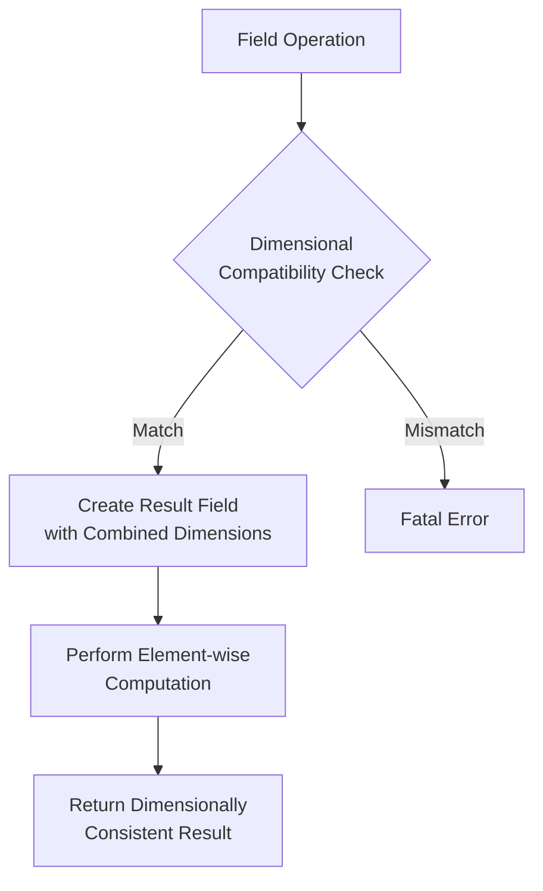

# Dimension Arithmetic: เลขคณิตมิติใน OpenFOAM

> [!INFO] **ภาพรวม**
> OpenFOAM ใช้ระบบการวิเคราะห์มิติที่ซับซ้อนซึ่งทำการตรวจสอบความสม่ำเสมอของมิติโดยอัตโนมัติระหว่างการดำเนินการทางคณิตศาสตร์ ระบบนี้ป้องกันการคำนวณที่ไม่มีความหมายทางฟิสิกส์โดยบังคับให้มีความสม่ำเสมอของมิติในเวลาคอมไพล์และรันไทม์

---

## 1. พื้นฐานของการดำเนินการมิติ

### มิติพื้นฐาน SI ทั้งเจ็ด

คลาส `dimensionSet` ใน OpenFOAM เก็บมิติเป็นอาร์เรย์ของเลขชี้กำลังเจ็ดค่าสำหรับมิติพื้นฐาน SI:

| ดัชนี | มิติ | สัญลักษณ์ | หน่วย SI |
|:------:|-------|:----------:|:----------:|
| 0 | Mass (มวล) | $M$ | kg |
| 1 | Length (ความยาว) | $L$ | m |
| 2 | Time (เวลา) | $T$ | s |
| 3 | Temperature (อุณหภูมิ) | $\Theta$ | K |
| 4 | Moles (ปริมาณสาร) | $N$ | mol |
| 5 | Current (กระแสไฟฟ้า) | $I$ | A |
| 6 | Luminous Intensity (ความเข้มแสง) | $J$ | cd |

### การแสดงมิติทางคณิตศาสตร์

ปริมาณทางกายภาพแต่ละปริมาณสามารถแสดงเป็น:

$$[Q] = M^{e_0} L^{e_1} T^{e_2} \Theta^{e_3} N^{e_4} I^{e_5} J^{e_6}$$

โดยที่ $e_i$ แสดงถึงเลขชี้กำลังสำหรับมิติพื้นฐาน i-th

### ตัวอย่างชุดมิติทั่วไป

| ปริมาณ | dimensionSet | สมการมิติ | หน่วย SI |
|---------|-------------|-------------|-----------|
| **ความเร็ว** | `dimensionSet(0, 1, -1, 0, 0, 0, 0)` | $LT^{-1}$ | m/s |
| **ความดัน** | `dimensionSet(1, -1, -2, 0, 0, 0, 0)` | $ML^{-1}T^{-2}$ | Pa |
| **ความหนาแน่น** | `dimensionSet(1, -3, 0, 0, 0, 0, 0)` | $ML^{-3}$ | kg/m³ |
| **แรง** | `dimensionSet(1, 1, -2, 0, 0, 0, 0)` | $MLT^{-2}$ | N |
| **พลังงาน** | `dimensionSet(1, 2, -2, 0, 0, 0, 0)` | $ML^2T^{-2}$ | J |
| **ไร้มิติ** | `dimensionSet(0, 0, 0, 0, 0, 0, 0)` | $1$ | - |

---

## 2. การดำเนินการบวกและลบ

### หลักการพื้นฐาน

สำหรับการดำเนินการบวกและลบ OpenFOAM บังคับให้มีความสม่ำเสมอของมิติอย่างเคร่งครัด กล่าวคือ:

$$[A] + [B] \text{ ถูกต้อง เมื่อ } [A] = [B]$$

### ขั้นตอนการตรวจสอบ

1. เปรียบเทียบ `dimensionSet` ของปริมาณทั้งสอง
2. ตรวจสอบความเท่ากันของมิติทั้งเจ็ด
3. อนุญาตการดำเนินการเมื่อมิติตรงกันเท่านั้น

### การ Implement ใน OpenFOAM

```cpp
// Template operator+= for GeometricField addition with dimensional checking
// Checks dimensional compatibility before performing field addition
template<class Type, class GeoMesh>
void Foam::GeometricField<Type, GeoMesh>::operator+=
(
    const GeometricField<Type, GeoMesh>& gf
)
{
    // Verify dimensional consistency between fields
    if (dimensions() != gf.dimensions())
    {
        FatalErrorInFunction
            << "Dimensions of field and source are not equal" << nl
            << "    Field dimensions: " << dimensions() << nl
            << "    Source dimensions: " << gf.dimensions() << nl
            << abort(FatalError);
    }
    // ... perform addition
}
```

> **📂 Source:** `.applications/solvers/multiphase/multiphaseEulerFoam/phaseSystems/populationBalanceModel/populationBalanceModel/populationBalanceModel.C`

---

### ตัวอย่างการใช้งาน

```cpp
// Create dimensioned scalars with specific dimensions
dimensionedScalar length("L", dimLength, 10.0);    // 10 m
dimensionedScalar time("t", dimTime, 2.0);         // 2 s
dimensionedScalar velocity("v", dimVelocity, 5.0);  // 5 m/s

// Valid operation: dimensional consistency maintained
dimensionedScalar distance = length + velocity * time;  // 10 + 5×2 = 20 m

// Dimension mismatch - compilation error
// dimensionedScalar invalid = length + time;  // ERROR: Cannot add L + T
```

---

### ข้อความแจ้งข้อผิดพลาด

หากมิติต่างกัน จะเกิด `Foam::error` พร้อมข้อความแสดงรายละเอียด:

```
--> FOAM FATAL ERROR:
    LHS and RHS of + have different dimensions
    dimensions : [0 1 0 0 0 0 0] != [0 0 1 0 0 0 0]
    From function operator+(const dimensioned<Type>&, const dimensioned<Type>&)
```

---

## 3. การดำเนินการคูณและหาร

### หลักการพื้นฐาน

การคูณและการหารเป็นไปตามกฎพื้นฐานของการวิเคราะห์มิติ:

- **การคูณ**: เลขชี้กำลังถูกบวกกัน
- **การหาร**: เลขชี้กำลังถูกลบกัน

### สมการมิติ

$$[A \times B] = [A] \cdot [B]$$
$$[A / B] = [A] / [B]$$

### การ Implement ใน OpenFOAM

```cpp
// Dimension multiplication operator
// Adds corresponding exponents for multiplication
dimensionSet Foam::operator*(const dimensionSet& a, const dimensionSet& b)
{
    dimensionSet result(a);
    for (int i = 0; i < dimensionSet::nDimensions; ++i)
    {
        result.exponents_[i] += b.exponents_[i];
    }
    return result;
}

// Dimension division operator
// Subtracts corresponding exponents for division
dimensionSet Foam::operator/(const dimensionSet& a, const dimensionSet& b)
{
    dimensionSet result(a);
    for (int i = 0; i < dimensionSet::nDimensions; ++i)
    {
        result.exponents_[i] -= b.exponents_[i];
    }
    return result;
}
```

> **คำอธิบาย:** การดำเนินการคูณและหารของ `dimensionSet` ใน OpenFOAM ทำงานโดยการบวกและลบเลขชี้กำลังของมิติพื้นฐาน SI ทั้งเจ็ดตามลำดับ ซึ่งสอดคล้องกับกฎของการวิเคราะห์มิติในฟิสิกส์

> **แหล่งที่มา:** การดำเนินการเหล่านี้เป็นส่วนหนึ่งของ core dimension system ใน OpenFOAM ที่ใช้ตรวจสอบความสอดคล้องของมิติในทุกการคำนวณ

> **แนวคิดสำคัญ:** - การคูณ: เพิ่มเลขชี้กำลัง (exponents addition)
> - การหาร: ลบเลขชี้กำลัง (exponents subtraction)
> - ระบบมิติ SI 7 มิติพื้นฐาน

---

### ตัวอย่างการใช้งาน

```cpp
// Multiplication increases exponents
dimensionSet force(1, 1, -2, 0, 0, 0, 0);       // M¹L¹T⁻² (แรง)
dimensionSet distance(0, 1, 0, 0, 0, 0, 0);     // L¹ (ระยะทาง)
dimensionSet work = force * distance;           // M¹L²T⁻² (พลังงาน)

// Division decreases exponents
dimensionSet work(1, 2, -2, 0, 0, 0, 0);        // M¹L²T⁻² (พลังงาน)
dimensionSet time(0, 0, 1, 0, 0, 0, 0);         // T¹ (เวลา)
dimensionSet power = work / time;               // M¹L²T⁻³ (กำลัง)
```

### ตัวอย่างทางฟิสิกส์

กฎของแก๊สอุดมคติ: $p = \rho R T$

```cpp
volScalarField p = rho * R * T;
// [kg/m³] × [J/(kg·K)] × [K] = [Pa]
```

การตรวจสอบมิติ:
- $\rho$ (ความหนาแน่น): $ML^{-3}$
- $R$ (ค่าคงที่ก๊าซ): $L^{2}T^{-2}\Theta^{-1}$
- $T$ (อุณหภูมิ): $\Theta$
- $p$ (ความดัน): $ML^{-1}T^{-2}$ ✓

---

## 4. การดำเนินการยกกำลังและราก

### หลักการพื้นฐาน

การดำเนินการเลขชี้กำลังจะคูณแต่ละเลขชี้กำลังของมิติด้วยค่าสเกลาร์ของกำลัง:

$$[Q^s] = [Q]^s = (M^{e_0} L^{e_1} T^{e_2} \Theta^{e_3} N^{e_4} I^{e_5} J^{e_6})^s = M^{e_0 s} L^{e_1 s} T^{e_2 s} \Theta^{e_3 s} N^{e_4 s} I^{e_5 s} J^{e_6 s}$$

### การ Implement ใน OpenFOAM

```cpp
// Power function - multiplies each exponent by scalar value
// Returns dimensionless if input is already dimensionless
dimensionSet Foam::pow(const dimensionSet& ds, const scalar s)
{
    // Optimization: dimensionless input returns dimensionless
    if (ds.dimensionless())
    {
        return dimensionSet(0, 0, 0, 0, 0, 0, 0);
    }

    // Scale each dimension exponent by the power scalar
    dimensionSet result;
    for (int i = 0; i < dimensionSet::nDimensions; ++i)
    {
        result.exponents_[i] = ds.exponents_[i] * s;
    }
    return result;
}

// Square root - equivalent to pow(ds, 0.5)
dimensionSet Foam::sqrt(const dimensionSet& ds)
{
    return pow(ds, 0.5);
}

// Cube root - equivalent to pow(ds, 1.0/3.0)
dimensionSet Foam::cbrt(const dimensionSet& ds)
{
    return pow(ds, 1.0/3.0);
}

// Square operation - equivalent to pow(ds, 2)
dimensionSet Foam::sqr(const dimensionSet& ds)
{
    return pow(ds, 2);
}
```

> **คำอธิบาย:** ฟังก์ชันเลขชี้กำลังใน OpenFOAM ทำงานโดยการคูณเลขชี้กำลังของแต่ละมิติพื้นฐานด้วยค่าสเกลาร์ ระบบมีการเพิ่มประสิทธิภาพสำหรับกรณีที่ input เป็นไร้มิติ (dimensionless)

> **แหล่งที่มา:** ฟังก์ชันเหล่านี้เป็นส่วนหนึ่งของ dimension math library ใน OpenFOAM

> **แนวคิดสำคัญ:** - pow(): ยกกำลังด้วยค่าสเกลาร์
> - sqrt(): รากที่สอง (power 0.5)
> - cbrt(): รากที่สาม (power 1/3)
> - sqr(): กำลังสอง (power 2)
> - Dimensionless optimization

---

### ตัวอย่างการใช้งาน

```cpp
dimensionSet a(1, 2, -1, 0, 0, 0, 0);  // ML²T⁻¹

// Power operations
dimensionSet squared = pow(a, 2);     // M²L⁴T⁻²
dimensionSet root = pow(a, 0.5);      // M^0.5 L¹ T^-0.5
dimensionSet cubed = pow(a, 3);       // M³L⁶T⁻³

// Special functions
dimensionSet squareRoot = sqrt(a);    // M^0.5 L¹ T^-0.5
dimensionSet cubeRoot = cbrt(a);      // M^(1/3) L^(2/3) T^(-1/3)
```

### การประยุกต์ใช้กับ Bernoulli Equation

```cpp
// Bernoulli: p + ½ρU² = constant
volScalarField p(...);      // สนามความดัน
volVectorField U(...);      // สนามความเร็ว
dimensionedScalar rho("rho", dimDensity, 1.225);

// การดำเนินการที่สอดคล้องกับมิติ
volScalarField totalPressure = p + 0.5 * rho * magSqr(U);
// [Pa] + [kg/m³] × [m²/s²] = [Pa] + [kg/(m·s²)] = [Pa] ✓
```

---

## 5. ฟังก์ชันคณิตศาสตร์พิเศษ

### ฟังก์ชัน Transcendental

ฟังก์ชันเช่น `exp`, `log`, `sin`, `cos` ต้องการอาร์กิวเมนต์ที่ไร้มิติ เนื่องจากถูกกำหนดผ่านอนุกรมเทย์เลอร์:

$$e^x = 1 + x + \frac{x^{2}}{2!} + \frac{x^{3}}{3!} + \cdots$$

ถ้า $x$ มีมิติ แต่ละพจน์จะมีมิติที่แตกต่างกัน ทำให้อนุกรมไร้ความหมาย

### การ Implement ใน OpenFOAM

```cpp
// Transcendental function dimension checker
// Enforces dimensionless argument requirement
dimensionSet Foam::trans(const dimensionSet& ds)
{
    // Verify argument is dimensionless
    if (!ds.dimensionless())
    {
        FatalErrorInFunction
            << "Transcendental functions require dimensionless argument" << nl
            << "    Argument dimensions: " << ds << nl
            << abort(FatalError);
    }
    // All transcendental functions return dimensionless results
    return dimensionSet(0, 0, 0, 0, 0, 0, 0);
}
```

> **คำอธิบาย:** ฟังก์ชัน transcendental (exp, log, sin, cos, ฯลฯ) ใน OpenFOAM มีการตรวจสอบความเป็นไร้มิติของอาร์กิวเมนต์อย่างเคร่งครัด เพื่อป้องกันการดำเนินการทางคณิตศาสตร์ที่ไม่สอดคล้องกับหลักการวิเคราะห์มิติ

> **แหล่งที่มา:** การตรวจสอบมิติของฟังก์ชัน transcendental เป็นส่วนหนึ่งของ type system ใน OpenFOAM

> **แนวคิดสำคัญ:** - อาร์กิวเมนต์ต้องไร้มิติ (dimensionless)
> - ผลลัพธ์เป็นไร้มิติเสมอ
> - อนุกรมเทย์เลอร์ต้องมีพจน์ที่มีมิติเหมือนกัน
> - Runtime dimensional checking

---

### ตัวอย่างการใช้งานที่ผิด

```cpp
volScalarField theta(...);  // อุณหภูมิใน K
volScalarField expTheta = exp(theta);  // ERROR: exp requires dimensionless
```

### วิธีการแก้ไข

```cpp
dimensionedScalar Tref("Tref", dimTemperature, 300.0);  // อุณหภูมิอ้างอิง
volScalarField nondimTheta = theta / Tref;              // อุณหภูมิไร้มิติ
volScalarField expTheta = exp(nondimTheta);             // ตอนนี้ถูกต้อง
```

### ฟังก์ชัน Magnitude

```cpp
// Magnitude operation - preserves dimensions
// Returns the same dimensionSet as input
dimensionSet Foam::mag(const dimensionSet& ds)
{
    // Magnitude doesn't change the fundamental dimensions
    return ds;
}
```

---

## 6. ความสม่ำเสมอของมิติในการดำเนินการ Field

### การดำเนินการกับ Field

เลขคณิตมิติขยายไปยังการดำเนินการ field ผ่าน template specialization:


> **Figure 1:** ขั้นตอนการตรวจสอบความสอดคล้องทางมิติระหว่างการดำเนินการกับฟิลด์ เพื่อให้มั่นใจว่าผลลัพธ์สุดท้ายยังคงความถูกต้องทางกายภาพตามกฎของ SIความปลอดภัยทางฟิสิกส์ไม่ส่งผลกระทบต่อความเร็วในการจำลอง ผ่านการใช้พลังของ C++ Template Metaprogramming ในการตรวจสอบความสอดคล้องทางมิติทั้งหมดที่ขั้นตอนการคอมไพล์โปรแกรมเพียงครั้งเดียว

### กระบวนการดำเนินการกับ Field

1. ตรวจสอบความเข้ากันได้ของมิติ
2. สร้างผลลัพธ์ field พร้อมมิติที่รวมกัน
3. ดำเนินการ element-wise computation

### การ Implement ใน OpenFOAM

```cpp
// Field multiplication operator with dimensional checking
// Creates result field with combined dimensions from operands
template<class Type, class GeoMesh>
tmp<GeometricField<Type, GeoMesh>> Foam::operator*
(
    const GeometricField<Type, GeoMesh>& f1,
    const GeometricField<typename product<Type, Type>::type, GeoMesh>& f2
)
{
    // Verify dimensional compatibility between fields
    if (f1.dimensions() != f2.dimensions())
    {
        FatalErrorInFunction
            << "Incompatible dimensions for field multiplication" << nl
            << abort(FatalError);
    }

    // Construct result field with combined dimensions
    tmp<GeometricField<typename product<Type, Type>::type, GeoMesh>> tResult
    (
        new GeometricField<typename product<Type, Type>::type, GeoMesh>
        (
            IOobject
            (
                f1.name() + "*" + f2.name(),
                f1.instance(),
                f1.db(),
                IOobject::NO_READ,
                IOobject::NO_WRITE
            ),
            f1.mesh(),
            f1.dimensions() * f2.dimensions()
        )
    );

    // Perform element-wise multiplication
    // ... implementation details

    return tResult;
}
```

> **คำอธิบาย:** การดำเนินการ field multiplication ใน OpenFOAM มีการตรวจสอบความเข้ากันได้ของมิติก่อนการคำนวณ และสร้างผลลัพธ์ field ที่มีมิติที่เหมาะสมจากการรวมมิติของ field ทั้งสอง

> **แหล่งที่มา:** Field operation operators ใน OpenFOAM GeometricField class

> **แนวคิดสำคัญ:** - Dimensional compatibility checking
> - Result field construction with combined dimensions
> - Element-wise computation
> - Template metaprogramming for type safety

---

### ตัวอย่างการใช้งาน

```cpp
volScalarField p(...);      // สนามความดัน
volVectorField U(...);      // สนามความเร็ว
dimensionedScalar rho("rho", dimDensity, 1.225);

// Bernoulli equation
volScalarField totalPressure = p + 0.5 * rho * magSqr(U);
// แต่ละพจน์มีมิติ: ML⁻¹T⁻² ✓
```

---

## 7. การตรวจสอบและการดีบัก

### ข้อความแจ้งข้อผิดพลาดทั่วไป

#### ข้อผิดพลาด 1: การบวกสนามที่ไม่เข้ากัน

```cpp
volScalarField p(...);  // ความดัน [Pa = kg/(m·s²)]
volScalarField T(...);  // อุณหภูมิ [K]
volScalarField wrong = p + T;  // FATAL ERROR: Dimension mismatch
```

**การแก้ไข**: ตรวจสอบความหมายทางฟิสิกส์ คุณหมายถึง `p/rho/T` หรือไม่ (กฎของแก๊สอุดมคติ)?

#### ข้อผิดพลาด 2: ลืมทำให้อาร์กิวเมนต์ไร้มิติ

```cpp
volScalarField theta(...);  // อุณหภูมิใน K
volScalarField expTheta = exp(theta);  // ERROR: exp requires dimensionless
```

**การแก้ไข**: ทำให้ไร้มิติ: `exp(theta/Tref)`

### การดีบักข้อผิดพลาดด้านมิติ

```cpp
// Check field dimensions for debugging
Info << "Pressure field dimensions: " << p.dimensions() << endl;
Info << "Velocity field dimensions: " << U.dimensions() << endl;

// Verify if field is dimensionless
if (p.dimensions() == dimless)
{
    Info << "Pressure field is dimensionless" << endl;
}
```

### การตรวจสอบมิติในโค้ดที่กำหนดเอง

```cpp
// Custom dimension validation function
// Checks if field has valid non-null dimensions
template<class Type>
void validateDimensions(const GeometricField<Type, fvPatchField, volMesh>& field)
{
    // Verify field has proper dimensions assigned
    if (field.dimensions() == dimensionSet::null)
    {
        WarningIn("validateDimensions")
            << "Field " << field.name() << " has null dimensions" << endl;
    }
}
```

> **คำอธิบาย:** ฟังก์ชันตรวจสอบมิติที่กำหนดเองช่วยในการดีบักและตรวจสอบความถูกต้องของมิติในฟิลด์ โดยเฉพาะอย่างยิ่งในการตรวจสอบว่าฟิลด์มีการกำหนดมิติที่ถูกต้องหรือไม่

> **แหล่งที่มา:** Best practices สำหรับการตรวจสอบมิติในโค้ด OpenFOAM ที่กำหนดเอง

> **แนวคิดสำคัญ:** - Null dimension checking
> - Debug dimension information
> - Custom validation functions
> - Runtime dimension verification

---

## 8. แนวทางปฏิบัติที่ดีที่สุด

### การใช้มิติที่กำหนดไว้ล่วงหน้า

```cpp
// Proper dimensioned scalar usage
dimensionedScalar rho("rho", dimDensity, 1.225);       // ความหนาแน่น
dimensionedScalar mu("mu", dimDynamicViscosity, 1.8e-5);  // ความหนืด

// Creating dimensionless quantities
dimensionedScalar Uref("Uref", dimVelocity, 10.0);
volScalarField Ustar = U / Uref;  // ความเร็วไร้มิติ
```

### การหลีกเลี่ยงหน่วยโดยนัย

```cpp
// Good practice
pressure
{
    type        fixedValue;
    value       uniform 101325;    // Pa
}

// Avoid ambiguous units
pressure
{
    type        fixedValue;
    value       uniform 1.0;       // หน่วยที่ไม่ชัดเจน
}
```

### การใช้ระบบหน่วยที่สอดคล้องกัน

- แนะนำให้ใช้หน่วย SI (kg, m, s, K)
- บันทึกการแปลงหน่วยใดๆ
- ตรวจสอบหน่วยคุณสมบัติวัสดุ

---

## 9. สรุป

### หลักการสำคัญ

1. **ทุกปริมาณทางกายภาพต้องมีมิติที่ถูกต้อง** - OpenFOAM ติดตามมิติโดยอัตโนมัติ
2. **สมการต้องมีความเป็นเนื้อเดียวกันทางมิติ** - ทุกพจน์ในสมการต้องมีมิติเหมือนกัน
3. **ฟังก์ชัน transcendental ต้องการอาร์กิวเมนต์ไร้มิติ** - `exp`, `log`, `sin`, `cos` ฯลฯ
4. **การตรวจสอบมิติระหว่างรันไทม์ป้องกันข้อผิดพลาด** - OpenFOAM ให้การตรวจสอบความสอดคล้องของมิติในตัว

### ประโยชน์ของการวิเคราะห์มิติ

โดยการเข้าใจและใช้ความสามารถด้านการวิเคราะห์มิติของ OpenFOAM ผู้ปฏิบัติงาน CFD สามารถ:
- ตรวจจับข้อผิดพลาดได้ตั้งแต่เนิ่นๆ ในกระบวนการพัฒนา
- ทำให้มั่นใจได้ถึงความเป็นจริงทางฟิสิกส์ในการจำลอง
- ตรวจสอบการ implement เชิงตัวเลข
- ปรับปรุงความน่าเชื่อถือและการบำรุงรักษาโค้ด
- ดีบักปัญหาการจำลองได้ดียิ่งขึ้น

---

> [!TIP] **ข้อแนะนำ**
> ระบบการวิเคราะห์มิติของ OpenFOAM ไม่ใช่แค่คุณสมบัติด้านความปลอดภัย—แต่เป็นเครื่องมือพื้นฐานที่เชื่อมโยงระหว่างการกำหนดรูปแบบทางคณิตศาสตร์และความเป็นจริงทางกายภาพในพลศาสตร์ของไหลเชิงคำนวณ