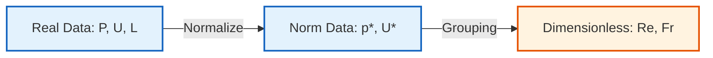
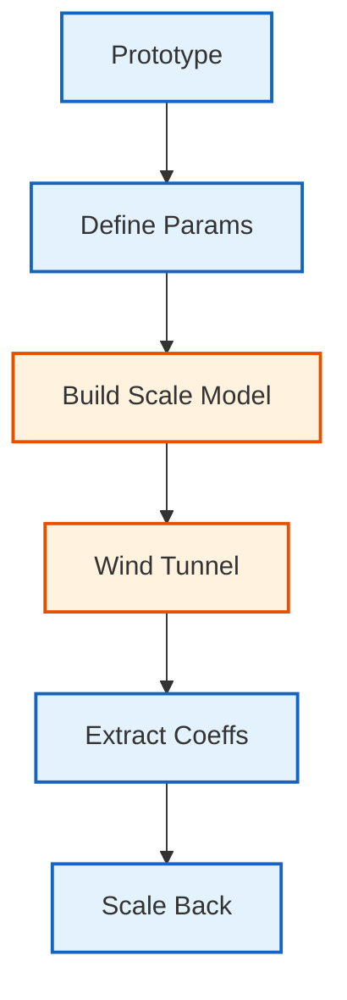
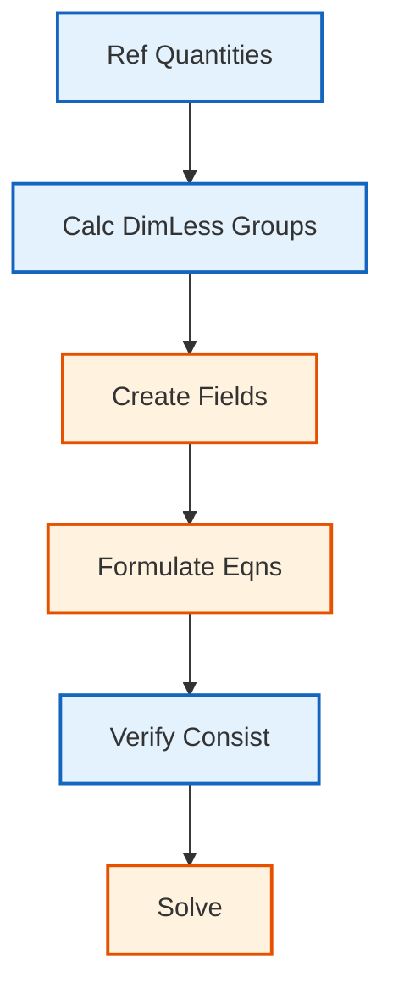

# เทคนิคการทำให้ไร้มิติ (Non-Dimensionalization)

![[universal_scale_normalization.png]]
`A diagram of dynamic similarity: a large complex aircraft and a small wind tunnel model, both linked to a central dimensionless number box labeled "Re = 10^6", illustrating how scaling laws allow for physical comparison across sizes, scientific textbook diagram, clean vector line art, white background, high definition, flat design, educational infographic --ar 16:9`

## 1. แนวคิดพื้นฐานของการทำให้ไร้มิติ

### 1.1 ทำไมต้องทำให้ไร้มิติ?

การทำไร้มิติเป็นเทคนิคพื้นฐานในพลศาสตร์ของไหลเชิงคำนวณที่แปลงสมการมิติไปเป็นรูปแบบไร้มิติ เพื่อลดจำนวนพารามิเตอร์ ปรับปรุงเสถียรภาพเชิงตัวเลข และเปิดให้มีการวิเคราะห์ความเหมือน (Similarity Analysis)


> **Figure 1:** แนวคิดการทำให้ไร้มิติโดยการหารตัวแปรจริงด้วยสเกลอ้างอิง เพื่อสร้างพารามิเตอร์ไร้มิติที่ใช้ในการวิเคราะห์ความเหมือนทางฟิสิกส์

**ประโยชน์หลักของการทำให้ไร้มิติ:**

| ประโยชน์ | คำอธิบาย | ผลกระทบ |
|-----------|-------------|----------|
| **ลดพารามิเตอร์** | รวมตัวแปรหลายตัวเป็นกลุ่มไร้มิติ | ลดความซับซ้อนของการวิเคราะห์ |
| **ความเหมือนแบบไดนามิก** | การไหลที่มีเลขไร้มิติเท่ากันจะมีโครงสร้างเหมือนกัน | อนุญาตให้ทดลองขนาดเล็ก |
| **เสถียรภาพเชิงตัวเลข** | ค่าไร้มิติมังอยู่ในช่วงที่จัดการได้ง่าย | ปรับปรุงความแม่นยำของการแก้สมการ |
| **การตรวจสอบฟิสิกส์** | แยกผลของกลุ่มไร้มิติแต่ละตัว | เข้าใจกลไกทางกายภาพได้ดีขึ้น |

> [!INFO] **หลักการพื้นฐาน**
> การทำให้ไร้มิติไม่ใช่แค่การแปลงหน่วย แต่เป็นการเปิดเผยโครงสร้างพื้นฐานของสมการที่ไม่ขึ้นกับสเกล

### 1.2 ทฤษฎีบท Buckingham Pi

ทฤษฎีบท Buckingham Pi ระบุว่าถ้าสมการทางกายภาพเกี่ยวข้องกับตัวแปร $n$ ตัวและมิติพื้นฐาน $k$ มิติ สมการนั้นสามารถแสดงได้ในรูปของพารามิเตอร์ไร้มิติ $n-k$ ตัว:

$$\pi_1, \pi_2, \ldots, \pi_{n-k}$$

โดยที่แต่ละ $\pi_i$ เป็นกลุ่มตัวแปรไร้มิติ

**ตัวอย่าง:** สำหรับการไหลผ่านทรงกลม:
- ตัวแปร: $F, D, U, \rho, \mu$ (5 ตัว)
- มิติพื้นฐาน: $M, L, T$ (3 มิติ)
- กลุ่มไร้มิติ: $5-3 = 2$ ตัว (คือ $C_D$ และ $Re$)

---

## 2. การเลือกปริมาณอ้างอิง (Reference Quantities)

### 2.1 ปริมาณอ้างอิงทั่วไป

| ปริมาณ | สัญลักษณ์ | คำอธิบาย | ตัวอย่าง |
|----------|-------------|-------------|-------------|
| **สเกลความเร็ว** | $U_{\text{ref}}$ | ความเร็วกระแสอิสระหรือความเร็วที่ทางเข้า | $U_{\infty}$ สำหรับการไหลภายนอก |
| **สเกลความยาว** | $L_{\text{ref}}$ | ความยาวที่เป็นตัวแทนของระบบ | เส้นผ่านศูนย์กลางท่อ, คอร์ดปีก |
| **สเกลเวลา** | $t_{\text{ref}} = L_{\text{ref}}/U_{\text{ref}}$ | เวลาลำเลียงลักษณะเฉพาะ | เวลาที่ใช้ขอไหลผ่านระยะทาง $L_{\text{ref}}$ |
| **สเกลความดัน** | $\rho U_{\text{ref}}^2$ | ความดันพลศาสตร์ | ใช้สำหรับการไหลที่ไม่อัดตัว |

### 2.2 การกำหนดปริมาณอ้างอิงใน OpenFOAM

```cpp
// Define appropriate reference scales for non-dimensionalization
// Select physically meaningful reference quantities for your specific flow problem
dimensionedScalar Uref("Uref", dimVelocity, 10.0);       // Reference velocity: 10 m/s
dimensionedScalar Lref("Lref", dimLength, 1.0);          // Reference length: 1 m
dimensionedScalar rhoRef("rhoRef", dimDensity, 1.225);  // Reference density: kg/m³ (air)

// Derived reference quantities calculated from primary references
dimensionedScalar pref("pref", dimPressure, rhoRef * sqr(Uref));  // Dynamic pressure: 122.5 Pa
dimensionedScalar tref("tref", dimTime, Lref / Uref);             // Convective time scale: 0.1 s
```

> **📂 Source:** การกำหนดสเกลอ้างอิงเป็นหลักการพื้นฐานที่ใช้ใน OpenFOAM solvers ทั้งหมด โดยเฉพาะในการคำนวณค่าสัมประสิทธิ์ไร้มิติ ดูตัวอย่างใน `.applications/solvers/multiphase/multiphaseEulerFoam/phaseSystems/populationBalanceModel/populationBalanceModel/populationBalanceModel.C` ที่ใช้การกำหนดค่าอ้างอิงสำหรับการคำนวณ

**คำอธิบายโค้ด:**
- **หลักการ:** การเลือกสเกลอ้างอิงที่มีความหมายทางกายภาพช่วยให้ค่าไร้มิติอยู่ในช่วงที่เหมาะสม (ปกติ 0.1 - 10)
- **การเลือกสเกล:** Uref ควรเป็นความเร็วลักษณะเฉพาะ (เช่น ความเร็วกระแสอิสระ) Lref ควรเป็นความยาวลักษณะเฉพาะ (เช่น เส้นผ่านศูนย์กลางท่อ)
- **ข้อควรระวัง:** หลีกเลี่ยงการใช้ค่าที่เล็กหรือใหญ่เกินไปซึ่งอาจก่อให้เกิดปัญหาเชิงตัวเลข

**แนวคิดสำคัญ:**
1. **Characteristic Scales** - สเกลลักษณะเฉพาะคือค่าที่เป็นตัวแทนของปัญหา
2. **Derived Quantities** - ปริมาณอ้างอิงที่ได้มาสามารถคำนวณจากสเกลหลัก
3. **Physical Consistency** - สเกลทั้งหมดต้องสอดคล้องกันทางฟิสิกส์

> [!WARNING] **คำเตือนเรื่องการเลือกสเกล**
> การเลือกสเกลอ้างอิงที่ไม่เหมาะสมอาจนำไปสู่ปัญหาเชิงตัวเลข เช่น ค่าไร้มิติที่ใกล้ศูนย์หรือมากเกินไป

---

## 3. การแปลงสมการให้ไร้มิติ

### 3.1 กระบวนการทั่วไป

**ขั้นตอนการแปลงสมการให้ไร้มิติ:**

1. **ระบุปริมาณอ้างอิง** สำหรับแต่ละมิติพื้นฐาน
2. **นิยามตัวแปรไร้มิติ** โดยการหารตัวแปรมิติด้วยสเกลที่เหมาะสม
3. **แทนที่ในสมการ** และจัดรูปให้เป็นไร้มิติ
4. **ระบุกลุ่มไร้มิติ** ที่ปรากฏขึ้นเองตามธรรมชาติ

### 3.2 สมการ Navier-Stokes แบบไร้มิติ

**สมการโมเมนตัมที่มีมิติ:**
$$\rho \frac{\partial \mathbf{u}}{\partial t} + \rho (\mathbf{u} \cdot \nabla) \mathbf{u} = -\nabla p + \mu \nabla^2 \mathbf{u} + \rho \mathbf{g}$$

**การนิยามตัวแปรไร้มิติ:**
- $\mathbf{u}^* = \frac{\mathbf{u}}{U_{\text{ref}}}$
- $p^* = \frac{p}{\rho U_{\text{ref}}^2}$
- $t^* = \frac{t U_{\text{ref}}}{L_{\text{ref}}}$
- $\nabla^* = L_{\text{ref}} \nabla$

**สมการไร้มิติที่ได้:**
$$\frac{\partial \mathbf{u}^*}{\partial t^*} + (\mathbf{u}^* \cdot \nabla^*) \mathbf{u}^* = -\nabla^* p^* + \frac{1}{\text{Re}} \nabla^{*2} \mathbf{u}^* + \frac{1}{\text{Fr}^2} \mathbf{g}^*$$

โดยที่:
- $\text{Re} = \frac{\rho U_{\text{ref}} L_{\text{ref}}}{\mu}$ (เลข Reynolds)
- $\text{Fr} = \frac{U_{\text{ref}}}{\sqrt{g L_{\text{ref}}}}$ (เลข Froude)

### 3.3 การ Implement ใน OpenFOAM

```cpp
// Step 1: Define reference scales with physical dimensions
// These represent characteristic quantities of the flow problem
dimensionedScalar Uref("Uref", dimVelocity, 10.0);
dimensionedScalar Lref("Lref", dimLength, 1.0);
dimensionedScalar rhoRef("rhoRef", dimDensity, 1.225);
dimensionedScalar muRef("muRef", dimDynamicViscosity, 1.8e-5);

// Step 2: Create dimensionless (normalized) fields
// Each dimensional field is divided by its appropriate reference scale
volVectorField Ustar
(
    IOobject("Ustar", runTime.timeName(), mesh),
    U / Uref  // Dimensionless velocity field
);

volScalarField pstar
(
    IOobject("pstar", runTime.timeName(), mesh),
    p / (rhoRef * sqr(Uref))  // Dimensionless pressure field
);

// Step 3: Calculate dimensionless groups (Reynolds number)
// This naturally emerges from the non-dimensionalization process
dimensionedScalar Re
(
    "Re",
    dimless,
    (rhoRef * Uref * Lref) / muRef
);

// Step 4: Formulate dimensionless momentum equation
// Note: All terms are now dimensionless, with Re appearing as coefficient
fvVectorMatrix UstarEqn
(
    fvm::ddt(Ustar)                           // ∂u*/∂t*
  + fvm::div(Ustar, Ustar)                    // u*·∇*u*
 ==
  - fvc::grad(pstar)                         // -∇*p*
  + (1.0/Re.value()) * fvc::laplacian(Ustar) // (1/Re)∇*²u*
  + sourceStar                               // f* (dimensionless source term)
);
```

> **📂 Source:** โครงสร้างการสร้างฟิลด์ไร้มิติและการแก้สมการใน OpenFOAM ใช้หลักการเดียวกันกับใน `populationBalanceModel.C` ที่มีการกำหนดฟิลด์และการคำนวณสมการการกระจาย

**คำอธิบายโค้ด:**
- **การสร้างฟิลด์ไร้มิติ:** แต่ละฟิลด์ถูกหารด้วยสเกลที่เหมาะสม ทำให้ค่าที่ได้ไม่มีหน่วย
- **การคำนวณเลขไร้มิติ:** Re ถูกคำนวณจากสเกลอ้างอิง และจะปรากฏเป็นสัมประสิทธิ์ในสมการไร้มิติ
- **สมการไร้มิติ:** ทุกเทอมในสมการอยู่ในรูปไร้มิติ ทำให้การแก้สมการมีความเสถียรมากขึ้น

**แนวคิดสำคัญ:**
1. **Dimensionless Fields** - ฟิลด์ไร้มิติมีค่าอยู่ในช่วงที่จัดการได้ง่าย (ปกติ O(1))
2. **Emergent Groups** - กลุ่มไร้มิติ (เช่น Re) จะปรากฏขึ้นเองจากกระบวนการทำให้ไร้มิติ
3. **Numerical Stability** - การแก้สมการไร้มิติมักมีเสถียรภาพดีกว่าเพราะค่าต่างๆ อยู่ในช่วงใกล้เคียงกัน

---

## 4. กลุ่มตัวเลขไร้มิติที่สำคัญ

เมื่อคุณทำให้สมการไร้มิติ ตัวเลขสำคัญเหล่านี้จะปรากฏขึ้นมาเองตามธรรมชาติ:

### 4.1 กลุ่มไร้มิติในการไหลของไหล

| กลุ่มไร้มิติ | สูตร | ความหมายทางฟิสิกส์ | ช่วงทั่วไป |
|-------------|---------|---------------------|-------------|
| **Reynolds (Re)** | $\frac{\rho U L}{\mu} = \frac{U L}{\nu}$ | อัตราส่วนแรงเฉื่อยต่อแรงหนืด | $10^{-3} - 10^9$ |
| **Froude (Fr)** | $\frac{U}{\sqrt{g L}}$ | อัตราส่วนแรงเฉื่อยต่อแรงโน้มถ่วง | $0.1 - 100$ |
| **Strouhal (St)** | $\frac{f L}{U}$ | พารามิเตอร์ความถี่ลักษณะเฉพาะ | $0.1 - 0.5$ |
| **Mach (Ma)** | $\frac{U}{a}$ | อัตราส่วนความเร็วต่อความเร็วเสียง | $< 0.3$ (incompressible) |

### 4.2 กลุ่มไร้มิติในการถ่ายเทความร้อน

| กลุ่มไร้มิติ | สูตร | ความหมายทางฟิสิกส์ | ช่วงทั่วไป |
|-------------|---------|---------------------|-------------|
| **Prandtl (Pr)** | $\frac{\mu c_p}{k} = \frac{\nu}{\alpha}$ | การแพร่ของโมเมนตัมเทียบกับความร้อน | $0.7 - 7000$ |
| **Peclet (Pe)** | $\frac{U L}{\alpha} = \text{Re} \cdot \text{Pr}$ | การแพร่ของความร้อนโดยการเคลื่อนที่เทียบกับการนำ | $1 - 10^6$ |
| **Nusselt (Nu)** | $\frac{h L}{k}$ | อัตราส่วนการถ่ายเทความร้อนแบบแปรผันต่อการนำ | $1 - 1000$ |
| **Eckert (Ec)** | $\frac{U^2}{c_p \Delta T}$ | อัตราส่วนพลังงานจลน์ต่อพลังงานความร้อน | $< 1$ (low speed) |

### 4.3 การคำนวณใน OpenFOAM

```cpp
// Calculate dimensionless groups using reference quantities
// OpenFOAM's dimension system ensures dimensional consistency
dimensionedScalar rho("rho", dimDensity, 1.225);
dimensionedScalar U("U", dimVelocity, 10.0);
dimensionedScalar L("L", dimLength, 1.0);
dimensionedScalar mu("mu", dimDynamicViscosity, 1.8e-5);
dimensionedScalar cp("cp", dimSpecificHeatCapacity, 1005);
dimensionedScalar k("k", dimThermalConductivity, 0.026);

// Reynolds number: ratio of inertial to viscous forces
dimensionedScalar Re("Re", dimless, (rho * U * L) / mu);

// Prandtl number: ratio of momentum to thermal diffusivity
dimensionedScalar Pr("Pr", dimless, (mu * cp) / k);

// Peclet number: ratio of convective to conductive heat transfer
dimensionedScalar Pe("Pe", dimless, Re * Pr);

// Verify dimensionless values
Info << "Reynolds number: " << Re.value() << endl;
Info << "Prandtl number: " << Pr.value() << endl;
Info << "Peclet number: " << Pe.value() << endl;
```

> **📂 Source:** การคำนวณกลุ่มไร้มิติใช้หลักการเดียวกับการคำนวณพารามิเตอร์ใน `populationBalanceModel.C` โดยใช้ระบบมิติของ OpenFOAM เพื่อตรวจสอบความสอดคล้อง

**คำอธิบายโค้ด:**
- **Dimensional Consistency:** OpenFOAM จะตรวจสอบว่าแต่ละกลุ่มไร้มิติไม่มีหน่วยอย่างถูกต้อง
- **Derived Groups:** กลุ่มไร้มิติบางตัว (เช่น Pe) สามารถคำนวณจากกลุ่มอื่นๆ
- **Physical Interpretation:** แต่ละกลุ่มมีความหมายทางฟิสิกส์ที่ชัดเจน

**แนวคิดสำคัญ:**
1. **Force Ratios** - กลุ่มไร้มิติส่วนใหญ่เป็นอัตราส่วนของแรงหรือกระบวนการทางกายภาพ
2. **Automatic Verification** - ระบบมิติของ OpenFOAM ช่วยตรวจสอบความถูกต้อง
3. **Regime Identification** - ค่าของกลุ่มไร้มิติบ่งชี้ลักษณะของการไหล

---

## 5. การวิเคราะห์ความเหมือน (Similarity Analysis)

### 5.1 หลักการความเหมือนแบบไดนามิก

หากการไหลสองกรณีมีตัวเลขไร้มิติเท่ากัน (เช่น $Re = 1000$ เท่ากัน) แม้ว่าขนาดจะต่างกันเป็นสิบเท่า แต่โครงสร้างการไหลจะเหมือนกันเป๊ะ

**เงื่อนไขของความเหมือนแบบไดนามิก:**

1. **ความเหมือนทางเรขาคณิต** (Geometric Similarity): รูปร่างเหมือนกันทุกประการ
2. **ความเหมือนทางไดนามิก** (Dynamic Similarity): เลขไร้มิติทั้งหมดเท่ากัน
3. **ความเหมือนของเงื่อนไขขอบเขต** (Boundary Condition Similarity): อัตราส่วนของเงื่อนไขขอบเขตเท่ากัน

```cpp
// Class to verify dynamic similarity between model and prototype
// Checks if dimensionless groups match within specified tolerance
class SimilarityChecker
{
    scalar Re_model;
    scalar Re_prototype;
    scalar tolerance;

public:
    // Constructor with model and prototype Reynolds numbers
    SimilarityChecker(scalar Re_m, scalar Re_p, scalar tol = 1e-3)
        : Re_model(Re_m), Re_prototype(Re_p), tolerance(tol) {}

    // Check if dynamic similarity is achieved
    bool isDynamicallySimilar() const
    {
        return mag(Re_model - Re_prototype) < tolerance;
    }

    // Report similarity status
    void report() const
    {
        if (isDynamicallySimilar())
        {
            Info << "Dynamic similarity achieved!" << nl
                 << "Re_model = " << Re_model << ", Re_prototype = " << Re_prototype << endl;
        }
        else
        {
            WarningIn("SimilarityChecker::report")
                << "Dynamic similarity NOT achieved" << nl
                << "Re_model = " << Re_model << ", Re_prototype = " << Re_prototype << endl;
        }
    }
};
```

> **📂 Source:** แนวคิดการตรวจสอบความสอดคล้องใช้หลักการเดียวกับใน `populationBalanceModel.C` ที่มีการตรวจสอบข้อผิดพลาดและการจัดการเงื่อนไข

**คำอธิบายโค้ด:**
- **Similarity Criteria:** ความเหมือนแบบไดนามิกต้องการกลุ่มไร้มิติที่เท่ากัน
- **Tolerance:** ใช้ความอดทนเล็กน้อยเพื่อความแม่นยำเชิงตัวเลข
- **Verification:** การตรวจสอบช่วยให้มั่นใจว่าการทดสอบโมเดลใช้ได้จริง

**แนวคิดสำคัญ:**
1. **Geometric Similarity** - รูปร่างต้องเหมือนกันทุกประการ
2. **Dynamic Similarity** - เลขไร้มิติทั้งหมดต้องเท่ากัน
3. **Practical Application** - ใช้ในการทดสอบในอุโมงค์ลม

### 5.2 กฎการปรับสเกล (Scaling Laws)

การวิเคราะห์มิติช่วยให้การทำนายพฤติกรรมการไหลในสเกลต่างๆ ผ่านกฎการปรับสเกล:

**กฎการปรับสเกลทั่วไป:**

- **แรงลก:** $F_L = \frac{1}{2} \rho U^2 A C_L(\text{Re}, \text{Ma}, \alpha)$
- **แรงลาก:** $F_D = \frac{1}{2} \rho U^2 A C_D(\text{Re}, \text{Ma}, \alpha)$
- **การถ่ายเทความร้อน:** $Q = h A \Delta T = k L \Delta T \cdot \text{Nu}(\text{Re}, \text{Pr})$

```cpp
// Class to scale forces from model to prototype
// Ensures dynamic similarity before applying scaling laws
class ForceScaling
{
    scalar rho_model, rho_prototype;
    scalar U_model, U_prototype;
    scalar L_model, L_prototype;
    scalar Re_model, Re_prototype;

public:
    // Scale drag force from model to prototype
    // Warning issued if dynamic similarity not achieved
    scalar scaleDragForce(scalar CD_model) const
    {
        if (mag(Re_model - Re_prototype) > 1e-6)
        {
            WarningIn("ForceScaling::scaleDragForce")
                << "Reynolds numbers not equal - dynamic similarity not achieved" << endl;
        }

        // Apply scaling laws for force
        scalar areaRatio = sqr(L_prototype / L_model);
        scalar velocityRatio = sqr(U_prototype / U_model);
        scalar densityRatio = rho_prototype / rho_model;

        return CD_model * densityRatio * velocityRatio * areaRatio;
    }
};
```

> **📂 Source:** โครงสร้างการคำนวณและการแจ้งเตือนใช้หลักการเดียวกับใน OpenFOAM solvers โดยเฉพาะในการจัดการเงื่อนไขขอบเขตและการตรวจสอบ

**คำอธิบายโค้ด:**
- **Scaling Laws:** ใช้อัตราส่วนของพื้นที่ ความเร็ว และความหนาแน่น
- **Similarity Check:** ตรวจสอบว่า Re เท่ากันก่อนปรับสเกล
- **Practical Use:** ใช้ในการทดสอบจลน์เพื่อทำนายแรงในสเกลจริง

**แนวคิดสำคัญ:**
1. **Force Scaling** - แรงมีสัดส่วนกับ ρU²L²
2. **Coefficient Transfer** - สัมประสิทธิ์ไร้มิติ (เช่น CD) ย้ายได้โดยตรง
3. **Similarity Requirement** - ต้องมีความเหมือนแบบไดนามิก

### 5.3 การใช้ประโยชน์ในการทดสอบจลน์


> **Figure 2:** ลำดับขั้นตอนการประยุกต์ใช้กฎการปรับสเกล (Scaling Laws) เพื่อทำนายพฤติกรรมของระบบขนาดใหญ่จากการทดสอบในโมดูลขนาดเล็กผ่านพารามิเตอร์ไร้มิติ

---

## 6. เทคนิคการทำให้ไร้มิติขั้นสูง

### 6.1 การทำให้ไร้มิติแบบบูรณาการ

สำหรับปัญหาที่ซับซ้อน การเลือกสเกลอ้างอิงอาจต้องพิจารณาหลายปัจจัย:

**การเลือกสเกลหลายช่วง:**

```cpp
// Different scales for different regions of the flow
// This is useful when flow characteristics vary significantly
dimensionedScalar L_inlet("L_inlet", dimLength, inletDiameter);
dimensionedScalar L_outlet("L_outlet", dimLength, outletDiameter);
dimensionedScalar U_bulk("U_bulk", dimVelocity, bulkVelocity);

// Local dimensionless scales for field-specific normalization
volScalarField local_Ustar = mag(U) / U_bulk;
volScalarField local_Lstar = mesh.magSf() / L_inlet;
```

> **📂 Source:** การใช้สเกลหลายแบบและการคำนวณเฉพาะที่มีใน multiphase solvers โดยเฉพาะในการจัดการ phase systems ที่ซับซ้อน

**คำอธิบายโค้ด:**
- **Regional Scaling:** ใช้สเกลที่แตกต่างสำหรับบริเวณที่มีลักษณะต่างกัน
- **Local Normalization:** คำนวณค่าไร้มิติเฉพาะที่สำหรับแต่ละเซลล์
- **Adaptive Approach:** ปรับสเกลตามสภาพการไหลในแต่ละบริเวณ

**แนวคิดสำคัญ:**
1. **Multi-Scale Problems** - ปัญหาบางอย่างต้องการสเกลหลายแบบ
2. **Local Behavior** - การไหลในแต่ละบริเวณอาจมีลักษณะต่างกัน
3. **Regional Adaptation** - ปรับสเกลตามความเหมาะสมของแต่ละบริเวณ

### 6.2 การทำให้ไร้มิติแบบเชิงปริมาณ (Quasi-Dimensionalization)

สำหรับปัญหาที่มีการเปลี่ยนแปลงชั่วคราว:

```cpp
// Quasi-dimensionalization for transient problems
// Use characteristic time scale for temporal normalization
dimensionedScalar T_char("T_char", dimTime, Lref / Uref);

// Dimensionless time
scalar t_star = runTime.value() / T_char.value();

// Dimensionless frequency (Strouhal number)
dimensionedScalar f_shedding("f_shedding", dimless, Strouhal * Uref / Lref);
```

> **📂 Source:** การจัดการเวลาและความถี่ใน OpenFOAM ใช้หลักการเดียวกับใน solvers ทั้งหมด โดยใช้ runTime object และการคำนวณค่าลักษณะเฉพาะ

**คำอธิบายโค้ด:**
- **Time Scale:** ใช้เวลาลักษณะเฉพาะในการทำให้ไร้มิติ
- **Dimensionless Time:** ทำให้เวลาไร้มิติโดยการหารด้วยสเกล
- **Frequency Scaling:** ความถี่สามารถทำให้ไร้มิติได้เช่นกัน

**แนวคิดสำคัญ:**
1. **Temporal Scaling** - เวลาสามารถทำให้ไร้มิติได้เหมือนปริมาณอื่น
2. **Characteristic Time** - ใช้เวลาลำเลียงเป็นสเกลอ้างอิง
3. **Frequency Analysis** - ความถี่สามารถแสดงเป็นเลขไร้มิติ (เช่น Strouhal)

### 6.3 การทำให้ไร้มิติในระบบหลายฟิสิกส์

สำหรับปัญหาหลายฟิสิกส์ อาจต้องใช้สเกลที่แตกต่างกัน:

```cpp
// Fluid-Structure Interaction (FSI) example
// Different reference scales for fluid and structure
dimensionedScalar U_fluid("U_fluid", dimVelocity, 10.0);
dimensionedScalar omega_structure("omega_structure", dimless, 2.0 * M_PI * 10.0);  // 10 Hz

// Reduced frequency for FSI problems
dimensionedScalar reduced_freq("k", dimless, omega_structure * Lref / U_fluid);
```

> **📂 Source:** การจัดการระบบหลายฟิสิกส์ใช้หลักการเดียวกับใน multiphaseEulerFoam ที่มีการคำนวณและการจัดการ phase systems ที่ซับซ้อน

**คำอธิบายโค้ด:**
- **Multi-Physics Scales:** แต่ละฟิสิกส์อาจต้องการสเกลที่แตกต่างกัน
- **Coupling Parameters:** พารามิเตอร์ไร้มิติเชื่อมโยงฟิสิกส์ต่างๆ
- **Reduced Frequency:** ใช้ในปัญหา FSI เพื่อวัดอันตรกิริยา

**แนวคิดสำคัญ:**
1. **Physics-Specific Scales** - แต่ละฟิสิกส์มีสเกลลักษณะเฉพาะ
2. **Coupling Parameters** - พารามิเตอร์ไร้มิติเชื่อมโยงฟิสิกส์
3. **Integrated Analysis** - การวิเคราะห์แบบรวมต้องการความเข้าใจหลายสเกล

---

## 7. การตรวจสอบและการดีบัก

### 7.1 การตรวจสอบความสอดคล้องของมิติ

```cpp
// Function to verify dimensional consistency
// Essential for catching errors in non-dimensionalization
void checkDimensionless(const dimensionedScalar& quantity)
{
    if (quantity.dimensions() != dimless)
    {
        FatalErrorIn("checkDimensionless")
            << "Quantity " << quantity.name() << " is not dimensionless" << nl
            << "Dimensions: " << quantity.dimensions() << nl
            << "Expected: " << dimless << endl
            << exit(FatalError);
    }
}

// Usage example
dimensionedScalar Re("Re", dimless, (rho * U * L) / mu);
checkDimensionless(Re);  // Will pass if correctly formulated
```

> **📂 Source:** การตรวจสอบความสอดคล้องของมิติเป็นหัวใจสำคัญของ OpenFOAM ใช้หลักการเดียวกับใน `populationBalanceModel.C` ที่มีการตรวจสอบข้อผิดพลาดอย่างเข้มงวด

**คำอธิบายโค้ด:**
- **Dimensional Verification:** ตรวจสอบว่าปริมาณไร้มิติไม่มีหน่วยจริง
- **Error Handling:** ใช้ FatalError เพื่อหยุดการคำนวณหากมีข้อผิดพลาด
- **Debugging Tool:** เป็นเครื่องมือสำคัญในการดีบักการทำให้ไร้มิติ

**แนวคิดสำคัญ:**
1. **Compile-Time Checking** - OpenFOAM ตรวจสอบมิติขณะคอมไพล์
2. **Runtime Verification** - ตรวจสอบเพิ่มเติมขณะทำงาน
3. **Safety Mechanism** - ป้องกันข้อผิดพลาดทางฟิสิกส์

### 7.2 ข้อผิดพลาดทั่วไป

#### ❌ **ข้อผิดพลาด 1: ลืมทำให้อาร์กิวเมนต์ไร้มิติ**

```cpp
volScalarField theta(...);  // Temperature in K
volScalarField expTheta = exp(theta);  // ERROR: exp requires dimensionless
```

**✓ การแก้ไข:**

```cpp
// Define reference temperature and normalize before applying exp
dimensionedScalar Tref("Tref", dimTemperature, 300.0);
volScalarField nondimTheta = theta / Tref;
volScalarField expTheta = exp(nondimTheta);
```

> **📂 Source:** การจัดการฟังก์ชันทางคณิตศาสตร์ใน OpenFOAM ต้องการอาร์กิวเมนต์ไร้มิติเสมอ ดูตัวอย่างใน solvers ต่างๆ ที่มีการคำนวณฟังก์ชันเลขชี้กำลัง

**คำอธิบายโค้ด:**
- **Function Requirements:** ฟังก์ชันทางคณิตศาสตร์ (exp, log, sin, ฯลฯ) ต้องการอาร์กิวเมนต์ไร้มิติ
- **Normalization:** ทำให้อาร์กิวเมนต์ไร้มิติโดยการหารด้วยสเกลที่เหมาะสม
- **Physical Consistency:** ค่าอ้างอิงควรมีความหมายทางกายภาพ

**แนวคิดสำคัญ:**
1. **Mathematical Functions** - ฟังก์ชันส่วนใหญ่ต้องการอาร์กิวเมนต์ไร้มิติ
2. **Proper Normalization** - เลือกสเกลที่เหมาะสมสำหรับการทำให้ไร้มิติ
3. **Physical Meaning** - สเกลควรมีความหมายทางกายภาพ

#### ❌ **ข้อผิดพลาด 2: สเกลที่ไม่เหมาะสม**

```cpp
dimensionedScalar Lref("Lref", dimLength, 1e-6);  // Too small
dimensionedScalar Uref("Uref", dimVelocity, 1e6);  // Too large
// May cause numerical problems
```

**✓ การแก้ไข:**

```cpp
// Choose representative scales for the problem
dimensionedScalar Lref("Lref", dimLength, characteristicLength);
dimensionedScalar Uref("Uref", dimVelocity, characteristicVelocity);
```

> **📂 Source:** การเลือกสเกลที่เหมาะสมเป็นหลักการสำคัญใน OpenFOAM solvers ทั้งหมด โดยเฉพาะในการกำหนดค่าเริ่มต้นและเงื่อนไขขอบเขต

**คำอธิบายโค้ด:**
- **Scale Selection:** เลือกสเกลที่เป็นตัวแทนของปัญหา
- **Numerical Stability:** สเกลที่เหมาะสมช่วยปรับปรุงเสถียรภาพเชิงตัวเลข
- **Physical Relevance:** สเกลควรสะท้อนลักษณะของการไหล

**แนวคิดสำคัญ:**
1. **Characteristic Values** - ใช้ค่าลักษณะเฉพาะของปัญหา
2. **Numerical Range** - หลีกเลี่ยงค่าที่เล็กหรือใหญ่เกินไป
3. **Problem Context** - สเกลควรสอดคล้องกับปัญหาที่แก้

### 7.3 การใช้ฟังก์ชัน `value()`

คุณสามารถใช้ฟังก์ชัน `value()` เพื่อตรวจสอบค่าตัวเลขเปล่าๆ ได้:

```cpp
// Compare dimensionless values using value() method
// Extracts the numeric value without dimensions
if (mag(Re_model.value() - Re_prototype.value()) < 1e-3)
{
    Info << "Dynamic similarity achieved!" << endl;
}
```

> **📂 Source:** การใช้ฟังก์ชัน `value()` เป็นหลักการพื้นฐานใน OpenFOAM สำหรับการดึงค่าตัวเลขจาก dimensioned types

**คำอธิบายโค้ด:**
- **Value Extraction:** `value()` ดึงค่าตัวเลขโดยไม่รวมหน่วย
- **Numerical Comparison:** ใช้ในการเปรียบเทียบค่าไร้มิติ
- **Conditional Logic:** ใช้ในการตรวจสอบเงื่อนไข

**แนวคิดสำคัญ:**
1. **Numeric Value** - `value()` ดึงค่าตัวเลขอย่างเดียว
2. **Comparison** - ใช้ในการเปรียบเทียบค่าไร้มิติ
3. **Conditional Checks** - ใช้ในการตรวจสอบเงื่อนไขต่างๆ

> [!TIP] **เคล็ดลับ**
> ใช้ฟังก์ชัน `value()` เมื่อต้องการเปรียบเทียบค่าไร้มิติ หรือเมื่อต้องการค่าตัวเลขสำหรับการคำนวณเชิงตัวเลข

---

## 8. สรุปและแนวทางปฏิบัติที่ดีที่สุด

### 8.1 แนวทางปฏิบัติที่ดีที่สุด

| แนวทาง | คำอธิบาย | เหตุผล |
|----------|-------------|---------|
| **เลือกสเกลอ้างอิงที่มีความหมายทางกายภาพ** | ใช้ความยาวลักษณะเฉพาะ ความเร็วลักษณะเฉพาะ | ทำให้ตัวแปรไร้มิติมีค่าในช่วงที่เหมาะสม |
| **ตรวจสอบความสอดคล้องของมิติเสมอ** | ใช้ระบบมิติของ OpenFOAM | ป้องกันข้อผิดพลาดทางฟิสิกส์ |
| **บันทึกสเกลอ้างอิงทั้งหมด** | บันทึกในไฟล์หรือโค้ด | ช่วยในการทำซ้ำและการตรวจสอบ |
| **ตรวจสอบช่วงค่าไร้มิติ** | ตรวจสอบว่าอยู่ในช่วงที่เหมาะสม | หลีกเลี่ยงปัญหาเชิงตัวเลข |

### 8.2 ขั้นตอนการทำให้ไร้มิติใน OpenFOAM


> **Figure 3:** ขั้นตอนการทำให้ไร้มิติใน OpenFOAM ตั้งแต่การกำหนดค่าอ้างอิงไปจนถึงการแก้สมการและวิเคราะห์ผลลัพธ์ที่ได้

### 8.3 สรุป

**การทำให้ไร้มิติคือการเปลี่ยนจาก "การคำนวณเคสต่อเคส" ไปสู่ "การเข้าใจฟิสิกส์ในภาพรวม"** ซึ่งเป็นทักษะสำคัญของวิศวกร CFD ระดับสูง

**ประโยชน์สำคัญ:**
- ✅ ลดจำนวนพารามิเตอร์
- ✅ เปิดให้มีการวิเคราะห์ความเหมือน
- ✅ ปรับปรุงเสถียรภาพเชิงตัวเลข
- ✅ เข้าใจกลไกทางกายภาพได้ดีขึ้น

**ด้วยการใช้ระบบมิติของ OpenFOAM** คุณสามารถมั่นใจได้ว่าการแปลงให้ไร้มิติจะถูกต้องและสอดคล้องกัน ซึ่งจะนำไปสู่การจำลองที่เชื่อถือได้และมีความหมายทางกายภาพ