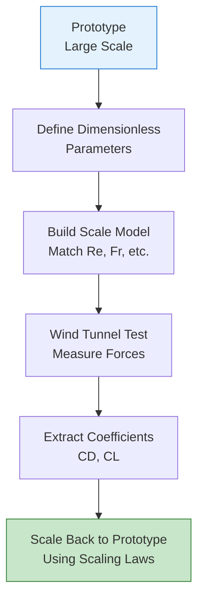
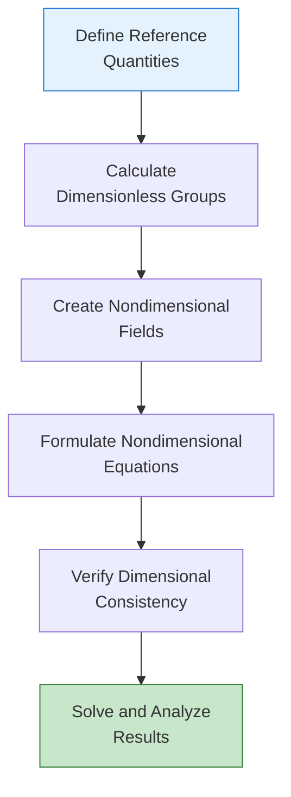

# เทคนิคการทำให้ไร้มิติ (Non-Dimensionalization)

![[universal_scale_normalization.png]]
`A diagram of dynamic similarity: a large complex aircraft and a small wind tunnel model, both linked to a central dimensionless number box labeled "Re = 10^6", illustrating how scaling laws allow for physical comparison across sizes, scientific textbook diagram, clean vector line art, white background, high definition, flat design, educational infographic --ar 16:9`

## 1. แนวคิดพื้นฐานของการทำให้ไร้มิติ

### 1.1 ทำไมต้องทำให้ไร้มิติ?

การทำไร้มิติเป็นเทคนิคพื้นฐานในพลศาสตร์ของไหลเชิงคำนวณที่แปลงสมการมิติไปเป็นรูปแบบไร้มิติ เพื่อลดจำนวนพารามิเตอร์ ปรับปรุงเสถียรภาพเชิงตัวเลข และเปิดให้มีการวิเคราะห์ความเหมือน (Similarity Analysis)


> **Figure 1:** แนวคิดการทำให้ไร้มิติโดยการหารตัวแปรจริงด้วยสเกลอ้างอิง เพื่อสร้างพารามิเตอร์ไร้มิติที่ใช้ในการวิเคราะห์ความเหมือนทางฟิสิกส์ความปลอดภัยทางฟิสิกส์ไม่ส่งผลกระทบต่อความเร็วในการจำลอง ผ่านการใช้พลังของ C++ Template Metaprogramming ในการตรวจสอบความสอดคล้องทางมิติทั้งหมดที่ขั้นตอนการคอมไพล์โปรแกรมเพียงครั้งเดียว

**ประโยชน์หลักของการทำให้ไร้มิติ:**

| ประโยชน์ | คำอธิบาย | ผลกระทบ |
|-----------|-------------|----------|
| **ลดพารามิเตอร์** | รวมตัวแปรหลายตัวเป็นกลุ่มไร้มิติ | ลดความซับซ้อนของการวิเคราะห์ |
| **ความเหมือนแบบไดนามิก** | การไหลที่มีเลขไร้มิติเท่ากันจะมีโครงสร้างเหมือนกัน | อนุญาตให้ทดลองขนาดเล็ก |
| **เสถียรภาพเชิงตัวเลข** | ค่าไร้มิติมังอยู่ในช่วงที่จัดการได้ง่าย | ปรับปรุงความแม่นยำของการแก้สมการ |
| **การตรวจสอบฟิสิกส์** | แยกผลของกลุ่มไร้มิติแต่ละตัว | เข้าใจกลไกทางกายภาพได้ดีขึ้น |

> [!INFO] **หลักการพื้นฐาน**
> การทำให้ไร้มิติไม่ใช่แค่การแปลงหน่วย แต่เป็นการเปิดเผยโครงสร้างพื้นฐานของสมการที่ไม่ขึ้นกับสเกล

### 1.2 ทฤษฎีบท Buckingham Pi

ทฤษฎีบท Buckingham Pi ระบุว่าถ้าสมการทางกายภาพเกี่ยวข้องกับตัวแปร $n$ ตัวและมิติพื้นฐาน $k$ มิติ สมการนั้นสามารถแสดงได้ในรูปของพารามิเตอร์ไร้มิติ $n-k$ ตัว:

$$\pi_1, \pi_2, \ldots, \pi_{n-k}$$

โดยที่แต่ละ $\pi_i$ เป็นกลุ่มตัวแปรไร้มิติ

**ตัวอย่าง:** สำหรับการไหลผ่านทรงกลม:
- ตัวแปร: $F, D, U, \rho, \mu$ (5 ตัว)
- มิติพื้นฐาน: $M, L, T$ (3 มิติ)
- กลุ่มไร้มิติ: $5-3 = 2$ ตัว (คือ $C_D$ และ $Re$)

---

## 2. การเลือกปริมาณอ้างอิง (Reference Quantities)

### 2.1 ปริมาณอ้างอิงทั่วไป

| ปริมาณ | สัญลักษณ์ | คำอธิบาย | ตัวอย่าง |
|----------|-------------|-------------|-------------|
| **สเกลความเร็ว** | $U_{\text{ref}}$ | ความเร็วกระแสอิสระหรือความเร็วที่ทางเข้า | $U_{\infty}$ สำหรับการไหลภายนอก |
| **สเกลความยาว** | $L_{\text{ref}}$ | ความยาวที่เป็นตัวแทนของระบบ | เส้นผ่านศูนย์กลางท่อ, คอร์ดปีก |
| **สเกลเวลา** | $t_{\text{ref}} = L_{\text{ref}}/U_{\text{ref}}$ | เวลาลำเลียงลักษณะเฉพาะ | เวลาที่ใช้ขอไหลผ่านระยะทาง $L_{\text{ref}}$ |
| **สเกลความดัน** | $\rho U_{\text{ref}}^2$ | ความดันพลศาสตร์ | ใช้สำหรับการไหลที่ไม่อัดตัว |

### 2.2 การกำหนดปริมาณอ้างอิงใน OpenFOAM

```cpp
// การเลือกสเกลอ้างอิงที่เหมาะสม
dimensionedScalar Uref("Uref", dimVelocity, 10.0);       // 10 m/s
dimensionedScalar Lref("Lref", dimLength, 1.0);          // 1 m
dimensionedScalar rhoRef("rhoRef", dimDensity, 1.225);  // kg/m³ (air)

// ปริมาณอ้างอิงที่ได้มา
dimensionedScalar pref("pref", dimPressure, rhoRef * sqr(Uref));  // 122.5 Pa
dimensionedScalar tref("tref", dimTime, Lref / Uref);             // 0.1 s
```

> [!WARNING] **คำเตือนเรื่องการเลือกสเกล**
> การเลือกสเกลอ้างอิงที่ไม่เหมาะสมอาจนำไปสู่ปัญหาเชิงตัวเลข เช่น ค่าไร้มิติที่ใกล้ศูนย์หรือมากเกินไป

---

## 3. การแปลงสมการให้ไร้มิติ

### 3.1 กระบวนการทั่วไป

**ขั้นตอนการแปลงสมการให้ไร้มิติ:**

1. **ระบุปริมาณอ้างอิง** สำหรับแต่ละมิติพื้นฐาน
2. **นิยามตัวแปรไร้มิติ** โดยการหารตัวแปรมิติด้วยสเกลที่เหมาะสม
3. **แทนที่ในสมการ** และจัดรูปให้เป็นไร้มิติ
4. **ระบุกลุ่มไร้มิติ** ที่ปรากฏขึ้นเองตามธรรมชาติ

### 3.2 สมการ Navier-Stokes แบบไร้มิติ

**สมการโมเมนตัมที่มีมิติ:**
$$\rho \frac{\partial \mathbf{u}}{\partial t} + \rho (\mathbf{u} \cdot \nabla) \mathbf{u} = -\nabla p + \mu \nabla^2 \mathbf{u} + \rho \mathbf{g}$$

**การนิยามตัวแปรไร้มิติ:**
- $\mathbf{u}^* = \frac{\mathbf{u}}{U_{\text{ref}}}$
- $p^* = \frac{p}{\rho U_{\text{ref}}^2}$
- $t^* = \frac{t U_{\text{ref}}}{L_{\text{ref}}}$
- $\nabla^* = L_{\text{ref}} \nabla$

**สมการไร้มิติที่ได้:**
$$\frac{\partial \mathbf{u}^*}{\partial t^*} + (\mathbf{u}^* \cdot \nabla^*) \mathbf{u}^* = -\nabla^* p^* + \frac{1}{\text{Re}} \nabla^{*2} \mathbf{u}^* + \frac{1}{\text{Fr}^2} \mathbf{g}^*$$

โดยที่:
- $\text{Re} = \frac{\rho U_{\text{ref}} L_{\text{ref}}}{\mu}$ (เลข Reynolds)
- $\text{Fr} = \frac{U_{\text{ref}}}{\sqrt{g L_{\text{ref}}}}$ (เลข Froude)

### 3.3 การ Implement ใน OpenFOAM

```cpp
// 1. กำหนดสเกลอ้างอิง
dimensionedScalar Uref("Uref", dimVelocity, 10.0);
dimensionedScalar Lref("Lref", dimLength, 1.0);
dimensionedScalar rhoRef("rhoRef", dimDensity, 1.225);
dimensionedScalar muRef("muRef", dimDynamicViscosity, 1.8e-5);

// 2. สร้างตัวแปรไร้มิติ
volVectorField Ustar
(
    IOobject("Ustar", runTime.timeName(), mesh),
    U / Uref  // ความเร็วไร้มิติ
);

volScalarField pstar
(
    IOobject("pstar", runTime.timeName(), mesh),
    p / (rhoRef * sqr(Uref))  // ความดันไร้มิติ
);

// 3. คำนวณเลข Reynolds
dimensionedScalar Re
(
    "Re",
    dimless,
    (rhoRef * Uref * Lref) / muRef
);

// 4. สมการโมเมนตัมไร้มิติ
fvVectorMatrix UstarEqn
(
    fvm::ddt(Ustar)                           // ∂u*/∂t*
  + fvm::div(Ustar, Ustar)                    // u*·∇*u*
 ==
  - fvc::grad(pstar)                         // -∇*p*
  + (1.0/Re.value()) * fvc::laplacian(Ustar) // (1/Re)∇*²u*
  + sourceStar                               // f*
);
```

---

## 4. กลุ่มตัวเลขไร้มิติที่สำคัญ

เมื่อคุณทำให้สมการไร้มิติ ตัวเลขสำคัญเหล่านี้จะปรากฏขึ้นมาเองตามธรรมชาติ:

### 4.1 กลุ่มไร้มิติในการไหลของไหล

| กลุ่มไร้มิติ | สูตร | ความหมายทางฟิสิกส์ | ช่วงทั่วไป |
|-------------|---------|---------------------|-------------|
| **Reynolds (Re)** | $\frac{\rho U L}{\mu} = \frac{U L}{\nu}$ | อัตราส่วนแรงเฉื่อยต่อแรงหนืด | $10^{-3} - 10^9$ |
| **Froude (Fr)** | $\frac{U}{\sqrt{g L}}$ | อัตราส่วนแรงเฉื่อยต่อแรงโน้มถ่วง | $0.1 - 100$ |
| **Strouhal (St)** | $\frac{f L}{U}$ | พารามิเตอร์ความถี่ลักษณะเฉพาะ | $0.1 - 0.5$ |
| **Mach (Ma)** | $\frac{U}{a}$ | อัตราส่วนความเร็วต่อความเร็วเสียง | $< 0.3$ (incompressible) |

### 4.2 กลุ่มไร้มิติในการถ่ายเทความร้อน

| กลุ่มไร้มิติ | สูตร | ความหมายทางฟิสิกส์ | ช่วงทั่วไป |
|-------------|---------|---------------------|-------------|
| **Prandtl (Pr)** | $\frac{\mu c_p}{k} = \frac{\nu}{\alpha}$ | การแพร่ของโมเมนตัมเทียบกับความร้อน | $0.7 - 7000$ |
| **Peclet (Pe)** | $\frac{U L}{\alpha} = \text{Re} \cdot \text{Pr}$ | การแพร่ของความร้อนโดยการเคลื่อนที่เทียบกับการนำ | $1 - 10^6$ |
| **Nusselt (Nu)** | $\frac{h L}{k}$ | อัตราส่วนการถ่ายเทความร้อนแบบแปรผันต่อการนำ | $1 - 1000$ |
| **Eckert (Ec)** | $\frac{U^2}{c_p \Delta T}$ | อัตราส่วนพลังงานจลน์ต่อพลังงานความร้อน | $< 1$ (low speed) |

### 4.3 การคำนวณใน OpenFOAM

```cpp
// การคำนวณกลุ่มไร้มิติ
dimensionedScalar rho("rho", dimDensity, 1.225);
dimensionedScalar U("U", dimVelocity, 10.0);
dimensionedScalar L("L", dimLength, 1.0);
dimensionedScalar mu("mu", dimDynamicViscosity, 1.8e-5);
dimensionedScalar cp("cp", dimSpecificHeatCapacity, 1005);
dimensionedScalar k("k", dimThermalConductivity, 0.026);

// เลข Reynolds
dimensionedScalar Re("Re", dimless, (rho * U * L) / mu);

// เลข Prandtl
dimensionedScalar Pr("Pr", dimless, (mu * cp) / k);

// เลข Peclet
dimensionedScalar Pe("Pe", dimless, Re * Pr);

// การตรวจสอบว่าไร้มิติ
Info << "Reynolds number: " << Re.value() << endl;
Info << "Prandtl number: " << Pr.value() << endl;
Info << "Peclet number: " << Pe.value() << endl;
```

---

## 5. การวิเคราะห์ความเหมือน (Similarity Analysis)

### 5.1 หลักการความเหมือนแบบไดนามิก

หากการไหลสองกรณีมีตัวเลขไร้มิติเท่ากัน (เช่น $Re = 1000$ เท่ากัน) แม้ว่าขนาดจะต่างกันเป็นสิบเท่า แต่โครงสร้างการไหลจะเหมือนกันเป๊ะ

**เงื่อนไขของความเหมือนแบบไดนามิก:**

1. **ความเหมือนทางเรขาคณิต** (Geometric Similarity): รูปร่างเหมือนกันทุกประการ
2. **ความเหมือนทางไดนามิก** (Dynamic Similarity): เลขไร้มิติทั้งหมดเท่ากัน
3. **ความเหมือนของเงื่อนไขขอบเขต** (Boundary Condition Similarity): อัตราส่วนของเงื่อนไขขอบเขตเท่ากัน

```cpp
// การตรวจสอบความเหมือนแบบไดนามิก
class SimilarityChecker
{
    scalar Re_model;
    scalar Re_prototype;
    scalar tolerance;

public:
    SimilarityChecker(scalar Re_m, scalar Re_p, scalar tol = 1e-3)
        : Re_model(Re_m), Re_prototype(Re_p), tolerance(tol) {}

    bool isDynamicallySimilar() const
    {
        return mag(Re_model - Re_prototype) < tolerance;
    }

    void report() const
    {
        if (isDynamicallySimilar())
        {
            Info << "Dynamic similarity achieved!" << nl
                 << "Re_model = " << Re_model << ", Re_prototype = " << Re_prototype << endl;
        }
        else
        {
            WarningIn("SimilarityChecker::report")
                << "Dynamic similarity NOT achieved" << nl
                << "Re_model = " << Re_model << ", Re_prototype = " << Re_prototype << endl;
        }
    }
};
```

### 5.2 กฎการปรับสเกล (Scaling Laws)

การวิเคราะห์มิติช่วยให้การทำนายพฤติกรรมการไหลในสเกลต่างๆ ผ่านกฎการปรับสเกล:

**กฎการปรับสเกลทั่วไป:**

- **แรงลก:** $F_L = \frac{1}{2} \rho U^2 A C_L(\text{Re}, \text{Ma}, \alpha)$
- **แรงลาก:** $F_D = \frac{1}{2} \rho U^2 A C_D(\text{Re}, \text{Ma}, \alpha)$
- **การถ่ายเทความร้อน:** $Q = h A \Delta T = k L \Delta T \cdot \text{Nu}(\text{Re}, \text{Pr})$

```cpp
// การปรับสเกลแรงลากจากโมเดลไปยังโปรโตไทป์
class ForceScaling
{
    scalar rho_model, rho_prototype;
    scalar U_model, U_prototype;
    scalar L_model, L_prototype;
    scalar Re_model, Re_prototype;

public:
    scalar scaleDragForce(scalar CD_model) const
    {
        if (mag(Re_model - Re_prototype) > 1e-6)
        {
            WarningIn("ForceScaling::scaleDragForce")
                << "Reynolds numbers not equal - dynamic similarity not achieved" << endl;
        }

        scalar areaRatio = sqr(L_prototype / L_model);
        scalar velocityRatio = sqr(U_prototype / U_model);
        scalar densityRatio = rho_prototype / rho_model;

        return CD_model * densityRatio * velocityRatio * areaRatio;
    }
};
```

### 5.3 การใช้ประโยชน์ในการทดสอบจลน์


> **Figure 2:** ลำดับขั้นตอนการประยุกต์ใช้กฎการปรับสเกล (Scaling Laws) เพื่อทำนายพฤติกรรมของระบบขนาดใหญ่จากการทดสอบในโมดูลขนาดเล็กผ่านพารามิเตอร์ไร้มิติความปลอดภัยทางฟิสิกส์ไม่ส่งผลกระทบต่อความเร็วในการจำลอง ผ่านการใช้พลังของ C++ Template Metaprogramming ในการตรวจสอบความสอดคล้องทางมิติทั้งหมดที่ขั้นตอนการคอมไพล์โปรแกรมเพียงครั้งเดียว

---

## 6. เทคนิคการทำให้ไร้มิติขั้นสูง

### 6.1 การทำให้ไร้มิติแบบบูรณาการ

สำหรับปัญหาที่ซับซ้อน การเลือกสเกลอ้างอิงอาจต้องพิจารณาหลายปัจจัย:

**การเลือกสเกลหลายช่วง:**
```cpp
// สเกลที่แตกต่างสำหรับบริเวณต่างๆ
dimensionedScalar L_inlet("L_inlet", dimLength, inletDiameter);
dimensionedScalar L_outlet("L_outlet", dimLength, outletDiameter);
dimensionedScalar U_bulk("U_bulk", dimVelocity, bulkVelocity);

// สเกลท้องถิ่น
volScalarField local_Ustar = mag(U) / U_bulk;
volScalarField local_Lstar = mesh.magSf() / L_inlet;
```

### 6.2 การทำให้ไร้มิติแบบเชิงปริมาณ (Quasi-Dimensionalization)

สำหรับปัญหาที่มีการเปลี่ยนแปลงชั่วคราว:

```cpp
// การทำให้ไร้มิติแบบเชิงปริมาณ
dimensionedScalar T_char("T_char", dimTime, Lref / Uref);

// เวลาไร้มิติ
scalar t_star = runTime.value() / T_char.value();

// ความถี่ไร้มิติ (Strouhal number)
dimensionedScalar f_shedding("f_shedding", dimless, Strouhal * Uref / Lref);
```

### 6.3 การทำให้ไร้มิติในระบบหลายฟิสิกส์

สำหรับปัญหาหลายฟิสิกส์ อาจต้องใช้สเกลที่แตกต่างกัน:

```cpp
// Fluid-Structure Interaction (FSI)
dimensionedScalar U_fluid("U_fluid", dimVelocity, 10.0);
dimensionedScalar omega_structure("omega_structure", dimless, 2.0 * M_PI * 10.0);  // 10 Hz
dimensionedScalar reduced_freq("k", dimless, omega_structure * Lref / U_fluid);
```

---

## 7. การตรวจสอบและการดีบัก

### 7.1 การตรวจสอบความสอดคล้องของมิติ

```cpp
// การตรวจสอบว่าค่าไร้มิติ
void checkDimensionless(const dimensionedScalar& quantity)
{
    if (quantity.dimensions() != dimless)
    {
        FatalErrorIn("checkDimensionless")
            << "Quantity " << quantity.name() << " is not dimensionless" << nl
            << "Dimensions: " << quantity.dimensions() << nl
            << "Expected: " << dimless << endl
            << exit(FatalError);
    }
}

// การใช้งาน
dimensionedScalar Re("Re", dimless, (rho * U * L) / mu);
checkDimensionless(Re);  // จะผ่านถ้าถูกต้อง
```

### 7.2 ข้อผิดพลาดทั่วไป

#### ❌ **ข้อผิดพลาด 1: ลืมทำให้อาร์กิวเมนต์ไร้มิติ**

```cpp
volScalarField theta(...);  // อุณหภูมิใน K
volScalarField expTheta = exp(theta);  // ERROR: exp requires dimensionless
```

**✓ การแก้ไข:**
```cpp
dimensionedScalar Tref("Tref", dimTemperature, 300.0);
volScalarField nondimTheta = theta / Tref;
volScalarField expTheta = exp(nondimTheta);
```

#### ❌ **ข้อผิดพลาด 2: สเกลที่ไม่เหมาะสม**

```cpp
dimensionedScalar Lref("Lref", dimLength, 1e-6);  // เล็กเกินไป
dimensionedScalar Uref("Uref", dimVelocity, 1e6);  // ใหญ่เกินไป
// อาจทำให้เกิดปัญหาเชิงตัวเลข
```

**✓ การแก้ไข:**
```cpp
// เลือกสเกลที่เป็นตัวแทนของปัญหา
dimensionedScalar Lref("Lref", dimLength, characteristicLength);
dimensionedScalar Uref("Uref", dimVelocity, characteristicVelocity);
```

### 7.3 การใช้ฟังก์ชัน `value()`

คุณสามารถใช้ฟังก์ชัน `value()` เพื่อตรวจสอบค่าตัวเลขเปล่าๆ ได้:

```cpp
if (mag(Re_model.value() - Re_prototype.value()) < 1e-3)
{
    Info << "Dynamic similarity achieved!" << endl;
}
```

> [!TIP] **เคล็ดลับ**
> ใช้ฟังก์ชัน `value()` เมื่อต้องการเปรียบเทียบค่าไร้มิติ หรือเมื่อต้องการค่าตัวเลขสำหรับการคำนวณเชิงตัวเลข

---

## 8. สรุปและแนวทางปฏิบัติที่ดีที่สุด

### 8.1 แนวทางปฏิบัติที่ดีที่สุด

| แนวทาง | คำอธิบาย | เหตุผล |
|----------|-------------|---------|
| **เลือกสเกลอ้างอิงที่มีความหมายทางกายภาพ** | ใช้ความยาวลักษณะเฉพาะ ความเร็วลักษณะเฉพาะ | ทำให้ตัวแปรไร้มิติมีค่าในช่วงที่เหมาะสม |
| **ตรวจสอบความสอดคล้องของมิติเสมอ** | ใช้ระบบมิติของ OpenFOAM | ป้องกันข้อผิดพลาดทางฟิสิกส์ |
| **บันทึกสเกลอ้างอิงทั้งหมด** | บันทึกในไฟล์หรือโค้ด | ช่วยในการทำซ้ำและการตรวจสอบ |
| **ตรวจสอบช่วงค่าไร้มิติ** | ตรวจสอบว่าอยู่ในช่วงที่เหมาะสม | หลีกเลี่ยงปัญหาเชิงตัวเลข |

### 8.2 ขั้นตอนการทำให้ไร้มิติใน OpenFOAM


> **Figure 3:** ขั้นตอนการทำให้ไร้มิติใน OpenFOAM ตั้งแต่การกำหนดค่าอ้างอิงไปจนถึงการแก้สมการและวิเคราะห์ผลลัพธ์ที่ได้ความปลอดภัยทางฟิสิกส์ไม่ส่งผลกระทบต่อความเร็วในการจำลอง ผ่านการใช้พลังของ C++ Template Metaprogramming ในการตรวจสอบความสอดคล้องทางมิติทั้งหมดที่ขั้นตอนการคอมไพล์โปรแกรมเพียงครั้งเดียว

### 8.3 สรุป

**การทำให้ไร้มิติคือการเปลี่ยนจาก "การคำนวณเคสต่อเคส" ไปสู่ "การเข้าใจฟิสิกส์ในภาพรวม"** ซึ่งเป็นทักษะสำคัญของวิศวกร CFD ระดับสูง

**ประโยชน์สำคัญ:**
- ✅ ลดจำนวนพารามิเตอร์
- ✅ เปิดให้มีการวิเคราะห์ความเหมือน
- ✅ ปรับปรุงเสถียรภาพเชิงตัวเลข
- ✅ เข้าใจกลไกทางกายภาพได้ดีขึ้น

**ด้วยการใช้ระบบมิติของ OpenFOAM** คุณสามารถมั่นใจได้ว่าการแปลงให้ไร้มิติจะถูกต้องและสอดคล้องกัน ซึ่งจะนำไปสู่การจำลองที่เชื่อถือได้และมีความหมายทางกายภาพ
