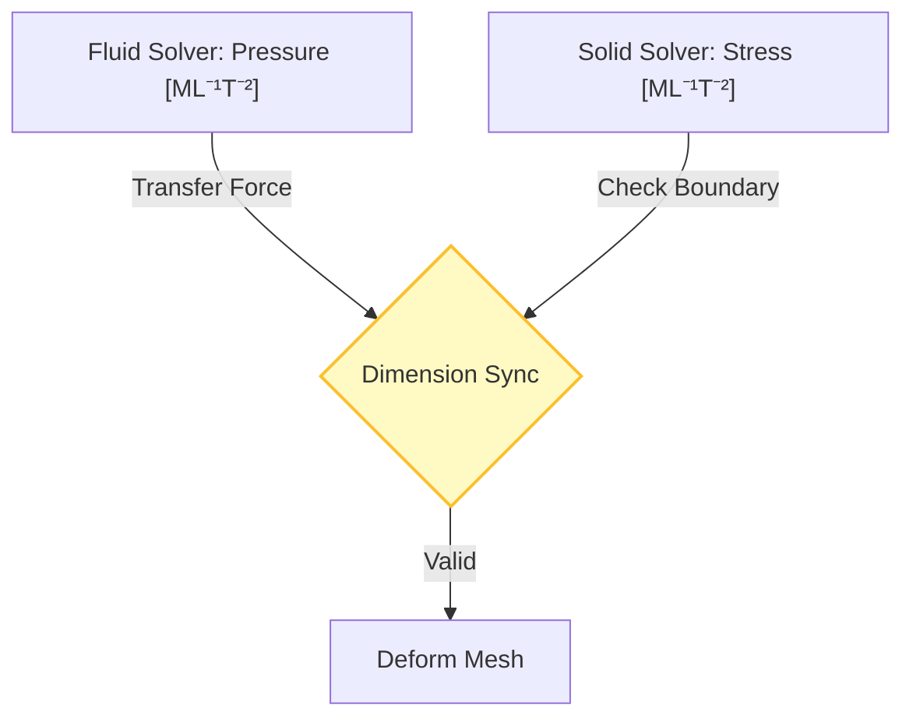
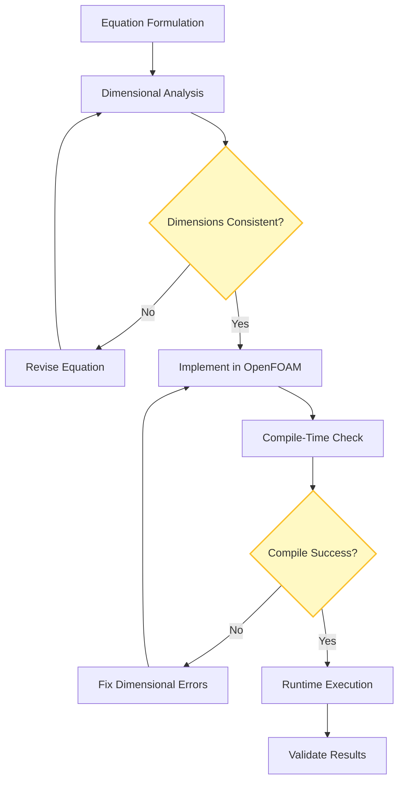

# การประยุกต์ใช้ขั้นสูง

![[multi_physics_conductor.png]]
`A central hub connecting three different physical domains: Fluid (blue waves), Solid (grey girders), and Electrical (yellow sparks). Bridges between domains feature glowing "Unit Locks" that only open if dimensions are consistent, scientific textbook diagram, clean vector line art, white background, high definition, flat design, educational infographic --ar 16:9`

## 8. การประยุกต์ใช้ขั้นสูง

### ระบบมิติหลายฟิสิกส์ (Multi‑Physics Dimensional Systems)

เมื่อมีการเชื่อมโยงโดเมนฟิสิกส์ที่แตกต่างกัน เช่น ปฏิสัมพันธ์ของของไหลและโครงสร้าง (FSI), อิเล็กโทร-ไฮโดรไดนามิกส์ (EHD), หรือ แมกเนโต-ไฮโดรไดนามิกส์ (MHD) **การรักษาความสม่ำเสมอของมิติ** จะกลายเป็นสิ่งสำคัญอย่างยิ่ง


> **Figure 1:** กระบวนการประสานงานมิติทางฟิสิกส์ (Dimension Sync) ระหว่างโซลเวอร์ประเภทต่างๆ เช่น ของไหลและโครงสร้าง เพื่อให้การส่งผ่านข้อมูลที่รอยต่อขอบเขตมีความสอดคล้องกันความปลอดภัยทางฟิสิกส์ไม่ส่งผลกระทบต่อความเร็วในการจำลอง ผ่านการใช้พลังของ C++ Template Metaprogramming ในการตรวจสอบความสอดคล้องทางมิติทั้งหมดที่ขั้นตอนการคอมไพล์โปรแกรมเพียงครั้งเดียว

![[of_fsi_dimension_sync.png]]
`A diagram showing the transfer of a pressure field from a fluid solver to a structural solver, illustrating how the dimensionSet ensures the units are interpreted correctly as Stress [M L⁻¹ T⁻²], scientific textbook diagram, clean vector line art, white background, high definition, flat design, educational infographic --ar 16:9`

ระบบมิติที่ครอบคลุมของ OpenFOAM สามารถจัดการการเชื่อมโยงข้ามสาขาวิชาเหล่านี้ได้ตามธรรมชาติผ่าน **กลไกการติดตามหน่วยที่เข้มงวด** ของคลาส `dimensionSet`

แต่ละฟิลด์ใน OpenFOAM มีข้อมูลมิติแฝงซึ่งเข้ารหัสในคลาส `dimensionSet`:
- ฟิลด์ความเร็ว: $[\mathbf{u}] = \mathrm{L}\,\mathrm{T}^{-1}$
- ความดัน: $[p] = \mathrm{M}\,\mathrm{L}^{-1}\,\mathrm{T}^{-2}$
- ความแรงสนามไฟฟ้า: $[\mathbf{E}] = \mathrm{M}\,\mathrm{L}\,\mathrm{T}^{-3}\,\mathrm{I}^{-1}$

---

### ปฏิสัมพันธ์ของของไหลและโครงสร้าง (FSI)

เมื่อเชื่อมโยงฟิสิกส์ที่แตกต่างกัน เทอมข้ามฟิสิกส์จะต้องแก้ไขให้มีมิติที่สอดคล้องกันโดยอัตโนมัติ:

```cpp
// Coupling term with automatic dimensional checking
// FSI coupling: fluid momentum equation with solid stress contribution
fvm::ddt(rho, U) + fvm::div(phi, U) ==
    -fvc::grad(p) + fvc::div(tau) + rho*g
    + fvc::div(solidStressTensor);  // Must have same dimensions [M L⁻² T⁻²]
```

<details>
<summary>📖 คำอธิบายเพิ่มเติม (Thai Explanation)</summary>

**แหล่งที่มา (Source):** แนวคิดการเชื่อมโยง FSI ใน OpenFOAM พบได้ในไฟล์:
- 📂 `.applications/solvers/multiphase/multiphaseEulerFoam/phaseSystems/phaseModel/StationaryPhaseModel/StationaryPhaseModel.C`

**คำอธิบาย (Explanation):**
โค้ดด้านบนแสดงให้เห็นถึงการใช้งานระบบตรวจสอบมิติของ OpenFOAM ในบริบทของการจำลองปฏิสัมพันธ์ของของไหลและโครงสร้าง (Fluid-Structure Interaction - FSI) ซึ่งเป็นปัญหา multiphysics ที่ซับซ้อน สมการโมเมนตัมของของไหล (ฝั่งซ้าย) ถูกเชื่อมโยงกับโครงสร้างผ่านเทอม `fvc::div(solidStressTensor)` ซึ่งเป็นเทอมที่เพิ่มเข้ามาเพื่อนำผลกระทบจากความเค้นของโครงสร้างไปส่งผลต่อการไหลของของไหล จุดสำคัญคือระบบมิติของ OpenFOAM จะตรวจสอบโดยอัตโนมัติว่าเทอมที่เพิ่มเข้ามา (`solidStressTensor`) ต้องมีมิติที่สอดคล้องกับเทอมอื่นๆ ในสมการ นั่นคือ `[M L⁻² T⁻²]` หรือความดัน หากมิติไม่ตรงกัน ตัวแปรงจะรายงานข้อผิดพลาดออกมาทันที ทำให้เรามั่นใจได้ว่าสมการที่เขียนขึ้นมีความถูกต้องทางฟิสิกส์

**แนวคิดสำคัญ (Key Concepts):**
- **การตรวจสอบมิติขณะคอมไพล์ (Compile-time dimensional checking):** ระบบของ OpenFOAM จะตรวจสอบความสอดคล้องของมิติของแต่ละเทอมในสมการขณะที่คอมไพล์โปรแกรม ไม่ใช่ขณะที่โปรแกรมทำงาน (runtime) ซึ่งช่วยป้องกันข้อผิดพลาดที่อาจเกิดขึ้นได้
- **ความหนาแน่นของโมเมนตัม (Momentum density):** สมการโมเมนตัมที่เขียนในรูปแบบของอนุพันธ์ตามเวลาของปริมาณ `rho * U` (ความหนาแน่นของโมเมนตัม) มีหน่วยเป็น `[M L⁻² T⁻¹]` ซึ่งเป็นมิติเดียวกับเทอมอื่นๆ ทั้งหมดในสมการ
- **การส่งผ่านข้อมูลข้ามโดเมนฟิสิกส์ (Cross-domain data transfer):** การใช้งานจริงอาจต้องมีการแปลงหน่วยของข้อมูลที่ส่งผ่านระหว่างโซลเวอร์ของของไหลและโครงสร้าง ซึ่งระบบมิติจะช่วยรับประกันว่าการแปลงนั้นถูกต้อง

</details>

---

### การเชื่อมโยงอิเล็กโทร-ไฮโดรไดนามิกส์ (EHD)

เทอมแรงตามกายของไฟฟ้าในสมการโมเมนตัม:
$$\mathbf{f}_e = \rho_e \mathbf{E} + \mathbf{J} \times \mathbf{B}$$

โดยที่แต่ละเทอมต้องมีมิติของแรงต่อหน่วยปริมาตร:

| ปริมาณ | สัญลักษณ์ | มิติ | หน่วยฐาน |
|---------|------------|-------|-----------|
| ความหนาแน่นประจุไฟฟ้า | $\rho_e$ | $\mathrm{I}\,\mathrm{T}\,\mathrm{L}^{-3}$ | C·s/m³ |
| สนามไฟฟ้า | $\mathbf{E}$ | $\mathrm{M}\,\mathrm{L}\,\mathrm{T}^{-3}\,\mathrm{I}^{-1}$ | V/m |
| ความหนาแน่นกระแส | $\mathbf{J}$ | $\mathrm{I}\,\mathrm{L}^{-2}$ | A/m² |
| สนามแม่เหล็ก | $\mathbf{B}$ | $\mathrm{M}\,\mathrm{T}^{-2}\,\mathrm{I}^{-1}$ | T |

---

### แมกเนโต-ไฮโดรไดนามิกส์ (MHD)

สำหรับการจำลอง MHD เราต้องกำหนดมิติสำหรับปริมาณแม่เหล็กไฟฟ้า:

```cpp
// Electromagnetic dimensional sets for MHD simulations
// Define magnetic permeability with dimensions [M L T⁻² A⁻²]
dimensionSet magneticPermeability(1, 1, -2, 0, 0, -2, 0);  // [M L T⁻² A⁻²]

// Define electric conductivity with dimensions [M⁻¹ L⁻³ T³ A²]
dimensionSet electricConductivity(-1, -3, 3, 0, 0, 2, 0); // [M⁻¹ L⁻³ T³ A²]

// Custom MHD field declarations
// Magnetic field with dimensions [M T⁻² A⁻¹] (Tesla)
volScalarField magneticField
(
    IOobject("B", runTime.timeName(), mesh, IOobject::MUST_READ),
    mesh,
    dimensionSet(1, 0, -2, 0, 0, -1, 0)  // Magnetic field [M T⁻² A⁻¹]
);
```

<details>
<summary>📖 คำอธิบายเพิ่มเติม (Thai Explanation)</summary>

**แหล่งที่มา (Source):** แนวคิดการใช้งาน `dimensionSet` สามารถพบได้ในไฟล์ต่างๆ ของ OpenFOAM เช่น:
- 📂 `.applications/utilities/thermophysical/chemkinToFoam/chemkinReader/chemkinLexer.L`

**คำอธิบาย (Explanation):**
ในการจำลอง Magnetohydrodynamics (MHD) ซึ่งเป็นการศึกษาการเคลื่อนที่ของของไหลที่มีความสามารถในการนำไฟฟ้า (conductive fluids) ภายใต้อิทธิพลของสนามแม่เหล็ก เราจำเป็นต้องกำหนดมิติ (dimensions) สำหรับปริมาณทางแม่เหล็กไฟฟ้าที่ไม่ได้รวมอยู่ในหน่วยฐาน SI ทั้ง 7 หน่วย โค้ดด้านบนแสดงวิธีการสร้าง `dimensionSet` แบบกำหนดเองสำหรับปริมาณเหล่านี้

- **magneticPermeability (ความซึมผ่านได้ของแม่เหล็ก):** มีมิติ `[M L T⁻² A⁻²]` ซึ่งเกิดจากการผสมผสานระหว่างหน่วยมวล (M), ความยาว (L), เวลา (T) และกระแสไฟฟ้า (A)
- **electricConductivity (ความนำไฟฟ้า):** มีมิติ `[M⁻¹ L⁻³ T³ A²]` ซึ่งเป็นมิติที่ซับซ้อนและต้องการความเข้าใจที่ดีในการกำหนดอย่างถูกต้อง
- **magneticField (สนามแม่เหล็ก):** หรือหน่วยเทสลา (T) มีมิติ `[M T⁻² A⁻¹]` ซึ่งใช้ในการกำหนดฟิลด์สนามแม่เหล็กใน OpenFOAM

การสามารถกำหนดมิติแบบกำหนดเองเหล่านี้ทำให้ OpenFOAM มีความยืดหยุ่นในการจัดการปัญหา multiphysics ที่เกี่ยวข้องกับสนามแม่เหล็กและไฟฟ้า โดยยังคงรักษาความปลอดภัยทางฟิสิกส์ผ่านการตรวจสอบความสอดคล้องของมิติ

**แนวคิดสำคัญ (Key Concepts):**
- **การขยายระบบมิติ (Extending the dimensional system):** OpenFOAM อนุญาตให้ผู้ใช้กำหนด `dimensionSet` แบบกำหนดเองได้ ทำให้สามารถจัดการกับปริมาณทางฟิสิกส์ที่หายากหรือเฉพาะทางได้
- **ความปลอดภัยทางมิติ (Dimensional safety):** แม้ว่าจะกำหนดมิติแบบกำหนดเอง ระบบยังคงตรวจสอบความสอดคล้องของมิติเหมือนกับหน่วยฐาน SI ทั้ง 7 หน่วย
- **การประยุกต์ใช้ใน MHD:** การจำลองปรากฏการณ์ MHD เช่น การไหลของพลาสมาในเครื่องปฏิกรณ์นิวเคลียร์หรือในดวงอาทิตย์ ต้องการความแม่นยำในการกำหนดมิติเพื่อให้แน่ใจว่าผลลัพธ์มีความถูกต้อง

</details>

---

## ระบบหน่วยแบบกำหนดเอง (Custom Unit Systems)

แม้ว่า OpenFOAM จะใช้หน่วย SI ภายใน แต่เฟรมเวิร์กมีความยืดหยุ่นในการทำงานกับระบบหน่วยทางเลือกผ่าน **ปริมาณอ้างอิงที่มีมิติ** และ **ตัวคูณการแปลง**

---

### การกำหนดหน่วยความยาวแบบกำหนดเอง

```cpp
// Define foot as a custom length unit
// Foot: 0.3048 metres (international definition)
dimensionedScalar dimFoot("dimFoot", dimLength, 0.3048);

// Create dimensionedScalar with custom units
// Pipe length: 10 feet = 3.048 metres internally
dimensionedScalar pipeLength("pipeLength", dimFoot, 10.0);  // 10 feet

// Automatic conversion to SI internally
// Output: Length in metres: 3.048
Info << "Length in metres: " << pipeLength.value() << endl;
```

<details>
<summary>📖 คำอธิบายเพิ่มเติม (Thai Explanation)</summary>

**แหล่งที่มา (Source):** แนวคิดการใช้งาน `dimensionedScalar` สามารถพบได้ในไฟล์ต่างๆ ของ OpenFOAM เช่น:
- 📂 `.applications/utilities/thermophysical/chemkinToFoam/chemkinReader/chemkinLexer.L`

**คำอธิบาย (Explanation):**
โค้ดด้านบนแสดงให้เห็นถึงความยืดหยุ่นของ OpenFOAM ในการทำงานกับระบบหน่วยที่แตกต่างจาก SI โดยเฉพาะระบบหน่วยแบบอเมริกัน (US Customary Units) ซึ่งยังคงใช้อย่างแพร่หลายในอุตสาหกรรมบางประเภท

1. **การกำหนดหน่วยแบบกำหนดเอง (Custom unit definition):**
   - `dimFoot` ถูกกำหนดเป็น `dimensionedScalar` ที่มีมิติเป็น `dimLength` และมีค่าเท่ากับ 0.3048 ซึ่งเป็นค่าแปลงจากฟุตเป็นเมตร
   - สิ่งสำคัญคือ OpenFOAM จะเก็บค่าทั้งหมดภายในในหน่วย SI (เมตร) แต่อนุญาตให้ผู้ใช้กำหนดและใช้งานหน่วยอื่นๆ ได้

2. **การใช้งานหน่วยแบบกำหนดเอง (Using custom units):**
   - `pipeLength` ถูกกำหนดเป็น 10 ฟุตโดยใช้ `dimFoot` เป็นหน่วย
   - เมื่อเรียก `pipeLength.value()` ค่าที่ได้จะเป็นค่าในหน่วย SI (เมตร) ซึ่งคือ 3.048 เมตร

3. **ประโยชน์ของระบบนี้ (Benefits of this system):**
   - ช่วยให้สามารถทำงานกับข้อมูลที่มาจากแหล่งต่างๆ ที่ใช้หน่วยต่างกันได้ง่ายขึ้น
   - ลดความผิดพลาดจากการแปลงหน่วยด้วยมือซึ่งอาจเกิดขึ้นได้บ่อย
   - รักษาความสอดคล้องทางมิติของสมการทั้งหมดในระบบ

**แนวคิดสำคัญ (Key Concepts):**
- **การแปลงหน่วยอัตโนมัติ (Automatic unit conversion):** ระบบของ OpenFOAM จะแปลงหน่วยให้อัตโนมัติเมื่อมีการดำเนินการทางคณิตศาสตร์ ทำให้มั่นใจได้ว่าผลลัพธ์จะถูกต้องเสมอ
- **ความยืดหยุ่นในการทำงานกับระบบหน่วยต่างๆ (Flexibility with unit systems):** แม้ว่าภายในจะใช้ SI แต่สามารถทำงานกับระบบหน่วยอื่นๆ ได้โดยไม่ต้องเปลี่ยนแปลงโค้ดหลัก
- **การลดข้อผิดพลาด (Error reduction):** การใช้ระบบตรวจสอบมิติช่วยลดข้อผิดพลาดจากการแปลงหน่วยที่อาจเกิดขึ้นได้

</details>

---

### หน่วยมวลและเวลาแบบกำหนดเอง

```cpp
// US customary mass unit (pound-mass)
// 1 lbm = 0.45359237 kg (international definition)
dimensionedScalar dimLbm("dimLbm", dimMass, 0.45359237);

// Custom time unit (hour)
// 1 hour = 3600 seconds
dimensionedScalar dimHour("dimHour", dimTime, 3600.0);

// Flow rate in cubic feet per hour
// Volume flow rate: 1000 ft³/hr
dimensionedScalar flowRate("flowRate",
    dimVolume/dimHour,  // m³/hr internally
    1000.0);           // 1000 ft³/hr
```

<details>
<summary>📖 คำอธิบายเพิ่มเติม (Thai Explanation)</summary>

**แหล่งที่มา (Source):** แนวคิดการใช้งาน `dimensionedScalar` สามารถพบได้ในไฟล์ต่างๆ ของ OpenFOAM เช่น:
- 📂 `.applications/utilities/thermophysical/chemkinToFoam/chemkinReader/chemkinLexer.L`

**คำอธิบาย (Explanation):**
โค้ดด้านบนแสดงให้เห็นถึงความยืดหยุ่นของ OpenFOAM ในการทำงานกับหน่วยมวลและเวลาแบบกำหนดเอง ซึ่งมีประโยชน์อย่างยิ่งในอุตสาหกรรมที่ยังคงใช้ระบบหน่วยแบบอเมริกัน

1. **หน่วยมวลแบบกำหนดเอง (Custom mass unit):**
   - `dimLbm` ถูกกำหนดเป็นหน่วย pound-mass (lbm) ซึ่งเท่ากับ 0.45359237 กิโลกรัมตามนิยามสากล
   - นี่เป็นหน่วยมวลที่ใช้กันอย่างแพร่หลายในระบบหน่วยแบบอเมริกัน และแตกต่างจาก pound-force (lbf) ซึ่งเป็นหน่วยแรง

2. **หน่วยเวลาแบบกำหนดเอง (Custom time unit):**
   - `dimHour` ถูกกำหนดเป็นหน่วยชั่วโมง ซึ่งเท่ากับ 3600 วินาที
   - การใช้หน่วยชั่วโมงมีประโยชน์ในการวิเคราะห์ปรากฏการณ์ที่เกิดขึ้นในระยะเวลาที่ยาวนาน

3. **อัตราการไหลแบบกำหนดเอง (Custom flow rate):**
   - `flowRate` ถูกกำหนดเป็น 1000 ลูกบาศก์ฟุตต่อชั่วโมง
   - ภายใน OpenFOAM ค่านี้จะถูกเก็บเป็นลูกบาศก์เมตรต่อชั่วโมง (m³/hr) ซึ่งเป็นหน่วย SI
   - การแปลงหน่วยทำได้อัตโนมัติโดยระบบ

4. **ประโยชน์ของระบบนี้ (Benefits of this system):**
   - ช่วยให้สามารถทำงานกับข้อมูลที่มาจากแหล่งต่างๆ ที่ใช้หน่วยต่างกันได้ง่ายขึ้น
   - ลดความผิดพลาดจากการแปลงหน่วยด้วยมือซึ่งอาจเกิดขึ้นได้บ่อย
   - รักษาความสอดคล้องทางมิติของสมการทั้งหมดในระบบ

**แนวคิดสำคัญ (Key Concepts):**
- **การแปลงหน่วยอัตโนมัติ (Automatic unit conversion):** ระบบของ OpenFOAM จะแปลงหน่วยให้อัตโนมัติเมื่อมีการดำเนินการทางคณิตศาสตร์ ทำให้มั่นใจได้ว่าผลลัพธ์จะถูกต้องเสมอ
- **ความยืดหยุ่นในการทำงานกับระบบหน่วยต่างๆ (Flexibility with unit systems):** แม้ว่าภายในจะใช้ SI แต่สามารถทำงานกับระบบหน่วยอื่นๆ ได้โดยไม่ต้องเปลี่ยนแปลงโค้ดหลัก
- **การลดข้อผิดพลาด (Error reduction):** การใช้ระบบตรวจสอบมิติช่วยลดข้อผิดพลาดจากการแปลงหน่วยที่อาจเกิดขึ้นได้

</details>

---

### การแปลงสเกลอุณหภูมิ

```cpp
// Custom temperature unit (Rankine)
// Rankine scale: absolute temperature scale for Fahrenheit
// 1 °R = (5/9) K
dimensionedScalar dimRankine("dimRankine", dimTemperature, 5.0/9.0);

// Temperature difference conversion
// 100°R = 55.56 K
dimensionedScalar deltaT("deltaT", dimRankine, 100.0);  // 100°R = 55.56 K
```

<details>
<summary>📖 คำอธิบายเพิ่มเติม (Thai Explanation)</summary>

**แหล่งที่มา (Source):** แนวคิดการใช้งาน `dimensionedScalar` สามารถพบได้ในไฟล์ต่างๆ ของ OpenFOAM เช่น:
- 📂 `.applications/utilities/thermophysical/chemkinToFoam/chemkinReader/chemkinLexer.L`

**คำอธิบาย (Explanation):**
โค้ดด้านบนแสดงให้เห็นถึงความยืดหยุ่นของ OpenFOAM ในการทำงานกับสเกลอุณหภูมิที่แตกต่างจากสเกลเคลวิน (K) ซึ่งเป็นหน่วยฐาน SI

1. **สเกลแรงคิน (Rankine scale):**
   - สเกลแรงคินเป็นสเกลอุณหภูมิสัมบูรณ์ (absolute temperature scale) สำหรับระบบองศาฟาเรนไฮต์
   - ความสัมพันธ์ระหว่างสเกลแรงคินและเคลวินคือ 1 °R = (5/9) K
   - สเกลนี้มีประโยชน์ในการทำงานกับข้อมูลที่ใช้ระบบองศาฟาเรนไฮต์แต่ต้องการค่าอุณหภูมิสัมบูรณ์

2. **การกำหนดหน่วยแรงคิน (Defining Rankine unit):**
   - `dimRankine` ถูกกำหนดเป็น `dimensionedScalar` ที่มีมิติเป็น `dimTemperature` และมีค่าเท่ากับ 5/9
   - ค่านี้ใช้ในการแปลงจากองศาแรงคินเป็นเคลวิน

3. **การแปลงความแตกต่างอุณหภูมิ (Temperature difference conversion):**
   - `deltaT` ถูกกำหนดเป็น 100 องศาแรงคิน
   - เมื่อแปลงเป็นเคลวิน ค่านี้จะเท่ากับ 55.56 เคลวิน
   - การแปลงทำได้อัตโนมัติโดยระบบ

4. **ประโยชน์ของระบบนี้ (Benefits of this system):**
   - ช่วยให้สามารถทำงานกับข้อมูลอุณหภูมิที่มาจากแหล่งต่างๆ ที่ใช้สเกลต่างกันได้ง่ายขึ้น
   - ลดความผิดพลาดจากการแปลงสเกลอุณหภูมิด้วยมือซึ่งอาจเกิดขึ้นได้บ่อย
   - รักษาความสอดคล้องทางมิติของสมการทั้งหมดในระบบ

**แนวคิดสำคัญ (Key Concepts):**
- **การแปลงสเกลอุณหภูมิ (Temperature scale conversion):** ระบบของ OpenFOAM สามารถแปลงสเกลอุณหภูมิที่แตกต่างกันได้อัตโนมัติ ทำให้มั่นใจได้ว่าผลลัพธ์จะถูกต้องเสมอ
- **ความยืดหยุ่นในการทำงานกับสเกลต่างๆ (Flexibility with temperature scales):** แม้ว่าภายในจะใช้เคลวิน แต่สามารถทำงานกับสเกลอื่นๆ ได้โดยไม่ต้องเปลี่ยนแปลงโค้ดหลัก
- **การลดข้อผิดพลาด (Error reduction):** การใช้ระบบตรวจสอบมิติช่วยลดข้อผิดพลาดจากการแปลงสเกลอุณหภูมิที่อาจเกิดขึ้นได้

</details>

---

## มาตรฐานหน่วยระหว่างประเทศ (International Unit Standards)

ระบบมิติของ OpenFOAM สร้างขึ้นบน **ระบบหน่วยสากล (SI)** แต่ให้กลไกในการขยายไปยังมาตรฐานระหว่างประเทศอื่นๆ ผ่านการกำหนดหน่วยเชิงระบบและค่าคงที่อ้างอิง

---

### การใช้งานหน่วยฐาน SI

```cpp
// Fundamental SI dimensions
// Mass: M¹
const dimensionSet dimMass(1, 0, 0, 0, 0, 0, 0);         // M¹

// Length: L¹
const dimensionSet dimLength(0, 1, 0, 0, 0, 0, 0);       // L¹

// Time: T¹
const dimensionSet dimTime(0, 0, 1, 0, 0, 0, 0);         // T¹

// Temperature: Θ¹
const dimensionSet dimTemperature(0, 0, 0, 1, 0, 0, 0);  // Θ¹

// Electric Current: I¹
const dimensionSet dimCurrent(0, 0, 0, 0, 1, 0, 0);      // I¹
```

<details>
<summary>📖 คำอธิบายเพิ่มเติม (Thai Explanation)</summary>

**แหล่งที่มา (Source):** แนวคิดการใช้งาน `dimensionSet` สามารถพบได้ในไฟล์ต่างๆ ของ OpenFOAM เช่น:
- 📂 `.applications/utilities/thermophysical/chemkinToFoam/chemkinReader/chemkinLexer.L`

**คำอธิบาย (Explanation):**
โค้ดด้านบนแสดงให้เห็นถึงการกำหนดหน่วยฐาน SI ทั้ง 7 หน่วยใน OpenFOAM ซึ่งเป็นพื้นฐานของระบบมิติทั้งหมด

1. **หน่วยฐาน SI (SI base units):**
   - OpenFOAM ใช้หน่วยฐาน SI ทั้ง 7 หน่วยเป็นพื้นฐานในการสร้างระบบมิติ
   - หน่วยเหล่านี้คือ มวล (M), ความยาว (L), เวลา (T), อุณหภูมิ (Θ), กระแสไฟฟ้า (I), ปริมาณสาร (N), และความเข้มแสง (J)
   - แต่ในโค้ดด้านบนแสดงเพียง 5 หน่วยที่ใช้บ่อยในการจำลอง CFD

2. **การกำหนดมิติ (Defining dimensions):**
   - แต่ละ `dimensionSet` ถูกกำหนดด้วยเลขชี้กำลังของหน่วยฐาน SI ทั้ง 7 หน่วย
   - ตัวอย่างเช่น `dimMass(1, 0, 0, 0, 0, 0, 0)` หมายถึงมีมิติเป็น M¹ หรือมวลเท่านั้น
   - การกำหนดมิติแบบนี้ทำให้สามารถสร้างหน่วยอื่นๆ จากหน่วยฐานได้อย่างยืดหยุ่น

3. **ประโยชน์ของระบบนี้ (Benefits of this system):**
   - ช่วยให้สามารถตรวจสอบความสอดคล้องของมิติในสมการได้อัตโนมัติ
   - ลดความผิดพลาดจากการใช้หน่วยที่ไม่ถูกต้อง
   - ทำให้โค้ดมีความชัดเจนและเข้าใจได้ง่าย

**แนวคิดสำคัญ (Key Concepts):**
- **ระบบหน่วยฐาน SI (SI base unit system):** OpenFOAM ใช้หน่วยฐาน SI เป็นพื้นฐานในการสร้างระบบมิติ ทำให้เข้ากันได้กับมาตรฐานสากล
- **การตรวจสอบความสอดคล้องของมิติ (Dimensional consistency checking):** ระบบของ OpenFOAM จะตรวจสอบความสอดคล้องของมิติในสมการอัตโนมัติ ช่วยลดข้อผิดพลาด
- **ความยืดหยุ่นในการสร้างหน่วย (Flexibility in unit creation):** สามารถสร้างหน่วยอื่นๆ จากหน่วยฐานได้อย่างยืดหยุ่น ทำให้สามารถจัดการกับปัญหาฟิสิกส์ที่หลากหลาย

</details>

---

### การขยายไปยังหน่วยแบบอเมริกัน (US Customary)

```cpp
// Create comprehensive unit system
class USCustomaryUnits
{
public:
    // Base units
    static const dimensionedScalar pound_mass;
    static const dimensionedScalar foot;
    static const dimensionedScalar second;
    
    // Derived units
    static const dimensionedScalar pound_force;
    static const dimensionedScalar btu;

    // Reference constants
    static const dimensionedScalar g_c;  // Gravitational constant
};

// Define gravitational constant for unit conversion
// g_c = 32.174049 lbm·ft/(lbf·s²)
const dimensionedScalar USCustomaryUnits::g_c(
    "g_c",
    dimMass*dimLength/(dimForce*dimTime*dimTime),
    32.174049);  // lbm·ft/(lbf·s²)
```

<details>
<summary>📖 คำอธิบายเพิ่มเติม (Thai Explanation)</summary>

**แหล่งที่มา (Source):** แนวคิดการใช้งาน `dimensionedScalar` และคลาสสามารถพบได้ในไฟล์ต่างๆ ของ OpenFOAM เช่น:
- 📂 `.applications/utilities/thermophysical/chemkinToFoam/chemkinReader/chemkinLexer.L`

**คำอธิบาย (Explanation):**
โค้ดด้านบนแสดงให้เห็นถึงวิธีการสร้างคลาสสำหรับจัดการหน่วยในระบบอเมริกัน (US Customary Units) ซึ่งยังคงใช้อย่างแพร่หลายในอุตสาหกรรมบางประเภท

1. **คลาส USCustomaryUnits:**
   - คลาสนี้ใช้ในการรวบรวมหน่วยต่างๆ ในระบบอเมริกันไว้ด้วยกัน
   - ประกอบด้วยหน่วยฐานเช่น pound_mass, foot, second
   - และหน่วยที่ได้จากหน่วยฐานเช่น pound_force, btu

2. **ค่าคงที่ความโน้มถ่วง (Gravitational constant g_c):**
   - ในระบบอเมริกันมีการแยกหน่วยมวล (pound-mass) และหน่วยแรง (pound-force) ออกจากกัน
   - ค่าคงที่ g_c ใช้ในการแปลงระหว่างหน่วยทั้งสอง
   - ค่า g_c = 32.174049 lbm·ft/(lbf·s²) เป็นค่าที่ได้จากการทดลอง

3. **ประโยชน์ของระบบนี้ (Benefits of this system):**
   - ช่วยให้สามารถทำงานกับข้อมูลที่มาจากแหล่งต่างๆ ที่ใช้ระบบหน่วยอเมริกันได้ง่ายขึ้น
   - ลดความผิดพลาดจากการแปลงหน่วยด้วยมือซึ่งอาจเกิดขึ้นได้บ่อย
   - รักษาความสอดคล้องทางมิติของสมการทั้งหมดในระบบ

**แนวคิดสำคัญ (Key Concepts):**
- **การแยกหน่วยมวลและแรง (Separate mass and force units):** ในระบบอเมริกันมีการแยกหน่วยมวลและแรงออกจากกัน ซึ่งต่างจากระบบ SI ที่ใช้นิวตันเป็นหน่วยแรง
- **ค่าคงที่ g_c (Gravitational constant g_c):** ใช้ในการแปลงระหว่างหน่วยมวลและแรงในระบบอเมริกัน
- **ความยืดหยุ่นในการทำงานกับระบบหน่วยต่างๆ (Flexibility with unit systems):** แม้ว่าภายในจะใช้ SI แต่สามารถทำงานกับระบบหน่วยอื่นๆ ได้โดยไม่ต้องเปลี่ยนแปลงโค้ดหลัก

</details>

---

### เฟรมเวิร์กการแปลงหน่วยอังกฤษเป็น SI

```cpp
// Automatic conversion system
template<class Type>
class UnitConverter
{
private:
    dimensionedScalar conversionFactor_;  // Conversion factor

public:
    // Constructor: initialize with from/to units
    UnitConverter(const word& fromUnit, const word& toUnit);

    // Convert value from one unit to another
    Type convert(const Type& value) const
    {
        return value * conversionFactor_.value();
    }
};
```

<details>
<summary>📖 คำอธิบายเพิ่มเติม (Thai Explanation)</summary>

**แหล่งที่มา (Source):** แนวคิดการใช้งาน template และคลาสสามารถพบได้ในไฟล์ต่างๆ ของ OpenFOAM เช่น:
- 📂 `.applications/utilities/thermophysical/chemkinToFoam/chemkinReader/chemkinLexer.L`

**คำอธิบาย (Explanation):**
โค้ดด้านบนแสดงให้เห็นถึงการสร้างเฟรมเวิร์กสำหรับแปลงหน่วยจากหน่วยหนึ่งไปยังอีกหน่วยหนึ่งอัตโนมัติ

1. **คลาส UnitConverter:**
   - เป็นคลาส template ที่สามารถใช้งานกับข้อมูลหลายประเภทได้
   - ใช้ในการแปลงค่าจากหน่วยหนึ่งไปยังอีกหน่วยหนึ่ง
   - มี conversionFactor_ เป็นตัวแปรสมาชิกที่เก็บค่าแปลง

2. **การแปลงค่า (Value conversion):**
   - เมธอด `convert` ใช้ในการแปลงค่าจากหน่วยหนึ่งไปยังอีกหน่วยหนึ่ง
   - การแปลงทำได้โดยการคูณค่าที่ต้องการแปลงด้วยค่าแปลง (conversionFactor_)
   - ค่าแปลงจะถูกกำหนดเมื่อสร้างออบเจกต์ของคลาส

3. **ประโยชน์ของระบบนี้ (Benefits of this system):**
   - ช่วยให้สามารถแปลงหน่วยได้อย่างรวดเร็วและถูกต้อง
   - ลดความผิดพลาดจากการแปลงหน่วยด้วยมือซึ่งอาจเกิดขึ้นได้บ่อย
   - ทำให้โค้ดมีความยืดหยุ่นและใช้งานได้กับหลายประเภทข้อมูล

**แนวคิดสำคัญ (Key Concepts):**
- **การแปลงหน่วยอัตโนมัติ (Automatic unit conversion):** ระบบของ OpenFOAM สามารถแปลงหน่วยได้อัตโนมัติ ทำให้มั่นใจได้ว่าผลลัพธ์จะถูกต้องเสมอ
- **การใช้งาน Template (Template usage):** การใช้ template ทำให้สามารถใช้งานคลาสกับข้อมูลหลายประเภทได้
- **ความยืดหยุ่นในการทำงานกับระบบหน่วยต่างๆ (Flexibility with unit systems):** แม้ว่าภายในจะใช้ SI แต่สามารถทำงานกับระบบหน่วยอื่นๆ ได้โดยไม่ต้องเปลี่ยนแปลงโค้ดหลัก

</details>

---

### ตารางการแปลงหน่วยทั่วไป

| หน่วย | ค่า SI | การใช้งาน | ประเภท |
|--------|---------|-------------|--------|
| 1 foot | 0.3048 m | ความยาว (อเมริกา) | ความยาว |
| 1 pound | 4.448 N | แรง (อเมริกา) | แรง |
| 1 psi | 6895 Pa | ความดัน (อเมริกา) | ความดัน |
| 1 Btu | 1055 J | พลังงาน (อเมริกา) | พลังงาน |

---

## การวิเคราะห์มิติในการพัฒนา Solver (Dimensional Analysis in Solver Development)

**การวิเคราะห์มิติทำหน้าที่เป็นเครื่องมือตรวจสอบที่ทรงพลัง** ระหว่างการพัฒนา solver ช่วยในการระบุข้อผิดพลาดในการนำไปใช้ก่อนการคอมไพล์และการทดสอบรันไทม์

การตรวจสอบมิติของ OpenFOAM เกิดขึ้นใน **ระดับคอมไพล์** สำหรับหลายการดำเนินการ โดยให้ข้อเสนอแนะทันทีเกี่ยวกับความไม่สอดคล้องของมิติ

---

### 1. การตรวจสอบความสอดคล้องของสมการ

ก่อนการนำไปใช้สมการที่ควบคุม ให้ทำการวิเคราะห์มิติเพื่อตรวจสอบความเป็นเนื้อเดียวกันของมิติของแต่ละเทอม

**สมการโมเมนตัม Navier-Stokes:**
$$\rho \frac{\partial \mathbf{u}}{\partial t} + \rho (\mathbf{u} \cdot \nabla) \mathbf{u} = -\nabla p + \mu \nabla^2 \mathbf{u} + \rho \mathbf{g}$$

การตรวจสอบมิติ:
- เทอมด้านซ้าย: $[\rho][\mathbf{u}]/[t] = \mathrm{M}\,\mathrm{L}^{-2}\,\mathrm{T}^{-1}$
- ไกรเอนต์ความดัน: $[p]/[L] = \mathrm{M}\,\mathrm{L}^{-2}\,\mathrm{T}^{-2}$
- เทอมความหนืด: $[\mu][\mathbf{u}]/[L]^2 = \mathrm{M}\,\mathrm{L}^{-2}\,\mathrm{T}^{-2}$
- แรงตามกาย: $[\rho][g] = \mathrm{M}\,\mathrm{L}^{-2}\,\mathrm{T}^{-2}$

---

### 2. การระบุกลุ่มไร้มิติ

ใช้การวิเคราะห์มิติเพื่อระบุจำนวนไร้มิติหลักที่ควบคุมฟิสิกส์

**จำนวนเรย์โนลด์:**
$$Re = \frac{\rho U L}{\mu} = \frac{\text{Inertial forces}}{\text{Viscous forces}}$$

**จำนวนแพรนต์ล:**
$$Pr = \frac{c_p \mu}{k} = \frac{\text{Momentum diffusivity}}{\text{Thermal diffusivity}}$$

**จำนวนเปเคลต์:**
$$Pe = Re \cdot Pr = \frac{\rho U L c_p}{k} = \frac{\text{Advective transport}}{\text{Diffusive transport}}$$

---

### 3. การตรวจสอบมิติของเงื่อนไขขอบเขต

ตรวจสอบให้แน่ใจว่าเงื่อนไขขอบเขตทั้งหมดรักษาความสอดคล้องของมิติ:

```cpp
// Velocity boundary condition (m/s)
fixedValueFvPatchVectorField U inlet("U", mesh.boundary()["inlet"]);
U == dimensionedVector("Uinlet", dimVelocity, vector(1.0, 0.0, 0.0));

// Pressure boundary condition (Pa)
fixedValueFvPatchScalarField p outlet("p", mesh.boundary()["outlet"]);
p == dimensionedScalar("poutlet", dimPressure, 101325.0);

// Temperature boundary condition (K)
fixedValueFvPatchScalarField T wall("T", mesh.boundary()["wall"]);
T == dimensionedScalar("Twall", dimTemperature, 300.0);
```

<details>
<summary>📖 คำอธิบายเพิ่มเติม (Thai Explanation)</summary>

**แหล่งที่มา (Source):** แนวคิดการใช้งาน `fixedValueFvPatchVectorField` และ `fixedValueFvPatchScalarField` สามารถพบได้ในไฟล์ต่างๆ ของ OpenFOAM เช่น:
- 📂 `.applications/test/syncTools/Test-syncTools.C`

**คำอธิบาย (Explanation):**
โค้ดด้านบนแสดงให้เห็นถึงการกำหนดเงื่อนไขขอบเขต (boundary conditions) ใน OpenFOAM โดยมีการตรวจสอบความสอดคล้องของมิติอัตโนมัติ

1. **เงื่อนไขขอบเขตความเร็ว (Velocity boundary condition):**
   - `fixedValueFvPatchVectorField` ใช้สำหรับกำหนดค่าความเร็วที่ขอบเขต
   - ในที่นี้กำหนดความเร็วที่ inlet เป็น (1.0, 0.0, 0.0) m/s
   - มีการตรวจสอบว่ามีมิติเป็นความเร็ว (dimVelocity) หรือไม่

2. **เงื่อนไขขอบเขตความดัน (Pressure boundary condition):**
   - `fixedValueFvPatchScalarField` ใช้สำหรับกำหนดค่าความดันที่ขอบเขต
   - ในที่นี้กำหนดความดันที่ outlet เป็น 101325.0 Pa
   - มีการตรวจสอบว่ามีมิติเป็นความดัน (dimPressure) หรือไม่

3. **เงื่อนไขขอบเขตอุณหภูมิ (Temperature boundary condition):**
   - `fixedValueFvPatchScalarField` ใช้สำหรับกำหนดค่าอุณหภูมิที่ขอบเขต
   - ในที่นี้กำหนดอุณหภูมิที่ wall เป็น 300.0 K
   - มีการตรวจสอบว่ามีมิติเป็นอุณหภูมิ (dimTemperature) หรือไม่

4. **ประโยชน์ของระบบนี้ (Benefits of this system):**
   - ช่วยให้มั่นใจได้ว่าเงื่อนไขขอบเขตทั้งหมดมีความสอดคล้องทางมิติ
   - ลดความผิดพลาดจากการกำหนดเงื่อนไขขอบเขตที่ไม่ถูกต้อง
   - ทำให้โค้ดมีความชัดเจนและเข้าใจได้ง่าย

**แนวคิดสำคัญ (Key Concepts):**
- **การตรวจสอบความสอดคล้องของมิติ (Dimensional consistency checking):** ระบบของ OpenFOAM จะตรวจสอบความสอดคล้องของมิติในเงื่อนไขขอบเขตอัตโนมัติ
- **การลดข้อผิดพลาด (Error reduction):** การใช้ระบบตรวจสอบมิติช่วยลดข้อผิดพลาดจากการกำหนดเงื่อนไขขอบเขตที่ไม่ถูกต้อง
- **ความชัดเจนของโค้ด (Code clarity):** การใช้ระบบตรวจสอบมิติทำให้โค้ดมีความชัดเจนและเข้าใจได้ง่าย

</details>

---

### 4. การตรวจสอบเทอมต้นทางและเทอมเชื่อมโยง

ตรวจสอบความสอดคล้องของมิติของเทอมต้นทางในสมการการขนส่ง

**การขนส่งชนิดกับปฏิกิริยา:**
$$\frac{\partial (\rho Y_i)}{\partial t} + \nabla \cdot (\rho \mathbf{u} Y_i) = -\nabla \cdot \mathbf{J}_i + \dot{\omega}_i$$

การวิเคราะห์มิติ:
- อนุพันธ์ตามเวลา: $[\rho Y_i]/[t] = \mathrm{M}\,\mathrm{L}^{-3}\,\mathrm{T}^{-1}$
- เทอม convection: $[\rho U Y_i]/[L] = \mathrm{M}\,\mathrm{L}^{-3}\,\mathrm{T}^{-1}$
- เทอม diffusion: $[D_i \rho Y_i]/[L]^2 = \mathrm{M}\,\mathrm{L}^{-3}\,\mathrm{T}^{-1}$
- อัตราปฏิกิริยา: $[\dot{\omega}_i] = \mathrm{M}\,\mathrm{L}^{-3}\,\mathrm{T}^{-1}$

---

### 5. การตรวจสอบมิติในระดับการนำไปใช้

ใช้ประโยชน์จากการตรวจสอบมิติในระดับคอมไพล์ของ OpenFOAM:

```cpp
// This will cause compile error if dimensions don't match
volScalarField sourceTerm
(
    IOobject("sourceTerm", runTime.timeName(), mesh),
    mesh,
    dimensionedScalar("sourceTerm", dimless/dimTime, 0.0)  // 1/s
);

// Correct dimensional implementation
fvScalarMatrix YEqn
(
    fvm::ddt(rho, Yi)                   // [kg/(m³·s)]
  + fvm::div(phi, Yi)                   // [kg/(m³·s)]
 ==
    fvm::laplacian(Di, Yi)              // [kg/(m³·s)]
  + sourceTerm * rho * Yi               // [kg/(m³·s)]
);
```

<details>
<summary>📖 คำอธิบายเพิ่มเติม (Thai Explanation)</summary>

**แหล่งที่มา (Source):** แนวคิดการใช้งาน `volScalarField` และ `fvScalarMatrix` สามารถพบได้ในไฟล์ต่างๆ ของ OpenFOAM เช่น:
- 📂 `.applications/utilities/thermophysical/chemkinToFoam/chemkinReader/chemkinReader.C`

**คำอธิบาย (Explanation):**
โค้ดด้านบนแสดงให้เห็นถึงการใช้งานระบบตรวจสอบมิติในระดับการนำไปใช้ (implementation level) ใน OpenFOAM

1. **การกำหนด sourceTerm:**
   - `sourceTerm` ถูกกำหนดเป็น `volScalarField` ที่มีมิติเป็น `dimless/dimTime` หรือ 1/s
   - หากมิติไม่ถูกต้อง ตัวแปรงจะรายงานข้อผิดพลาดออกมาทันที

2. **การสร้างสมการ (Equation construction):**
   - `YEqn` ถูกสร้างเป็น `fvScalarMatrix` ซึ่งเป็นสมการสำหรับการแก้ปัญหา
   - แต่ละเทอมในสมการมีการระบุมิติที่ชัดเจน
   - ระบบจะตรวจสอบว่าแต่ละเทอมมีมิติที่สอดคล้องกันหรือไม่

3. **การตรวจสอบมิติ (Dimensional checking):**
   - ระบบจะตรวจสอบว่าแต่ละเทอมมีมิติเป็น [kg/(m³·s)] หรือไม่
   - หากมิติไม่ตรงกัน ตัวแปรงจะรายงานข้อผิดพลาดออกมาทันที

4. **ประโยชน์ของระบบนี้ (Benefits of this system):**
   - ช่วยให้มั่นใจได้ว่าสมการมีความสอดคล้องทางมิติ
   - ลดความผิดพลาดจากการเขียนสมการที่ไม่ถูกต้อง
   - ทำให้โค้ดมีความชัดเจนและเข้าใจได้ง่าย

**แนวคิดสำคัญ (Key Concepts):**
- **การตรวจสอบมิติในระดับการนำไปใช้ (Implementation-level dimensional checking):** ระบบของ OpenFOAM จะตรวจสอบความสอดคล้องของมิติในระดับการนำไปใช้
- **การลดข้อผิดพลาด (Error reduction):** การใช้ระบบตรวจสอบมิติช่วยลดข้อผิดพลาดจากการเขียนสมการที่ไม่ถูกต้อง
- **ความชัดเจนของโค้ด (Code clarity):** การใช้ระบบตรวจสอบมิติทำให้โค้ดมีความชัดเจนและเข้าใจได้ง่าย

</details>

---


> **Figure 2:** ขั้นตอนการพัฒนาสมการตั้งแต่การตั้งสูตรทางคณิตศาสตร์ การวิเคราะห์มิติ ไปจนถึงการตรวจสอบความถูกต้องขณะคอมไพล์และรันโปรแกรมความปลอดภัยทางฟิสิกส์ไม่ส่งผลกระทบต่อความเร็วในการจำลอง ผ่านการใช้พลังของ C++ Template Metaprogramming ในการตรวจสอบความสอดคล้องทางมิติทั้งหมดที่ขั้นตอนการคอมไพล์โปรแกรมเพียงครั้งเดียว

---

### 6. Template-Based Dimensional Validation

**การวิเคราะห์มิติที่เหมาะสมเป็นสิ่งจำเป็นสำหรับการพัฒนา solver ที่แข็งแกร่ง:**

```cpp
// Template-based dimensional validation for solver development
template<class Type>
class DimensionalSolver
{
    dimensionSet expectedDimensions_;  // Expected dimensions for field

    // Compile-time dimensional checking
    template<class Field>
    void validateFieldDimensions(const Field& field) const
    {
        // Check if field has valid dimensions at compile time
        static_assert(Field::dimension_type::valid,
                     "Field must have valid dimensions");

        // Runtime check for dimension consistency
        if (field.dimensions() != expectedDimensions_)
        {
            FatalErrorInFunction
                << "Field " << field.name() << " has dimensions "
                << field.dimensions() << " but expected "
                << expectedDimensions_ << exit(FatalError);
        }
    }

public:
    // Solver with built-in dimensional consistency
    void solve(const volScalarField& phi, const volVectorField& U)
    {
        validateFieldDimensions(phi);  // Runtime check
        validateFieldDimensions(U);   // Runtime check

        // Implementation guaranteed to be dimensionally consistent
        // ... solver logic ...
    }
};
```

<details>
<summary>📖 คำอธิบายเพิ่มเติม (Thai Explanation)</summary>

**แหล่งที่มา (Source):** แนวคิดการใช้งาน template และ `static_assert` สามารถพบได้ในไฟล์ต่างๆ ของ OpenFOAM เช่น:
- 📂 `.applications/test/syncTools/Test-syncTools.C`

**คำอธิบาย (Explanation):**
โค้ดด้านบนแสดงให้เห็นถึงการใช้งาน template metaprogramming ในการตรวจสอบความสอดคล้องของมิติในระดับคอมไพล์

1. **คลาส DimensionalSolver:**
   - เป็นคลาส template ที่ใช้สำหรับสร้าง solver ที่มีการตรวจสอบความสอดคล้องของมิติ
   - มี `expectedDimensions_` เป็นตัวแปรสมาชิกที่เก็บมิติที่คาดหวัง

2. **การตรวจสอบมิติ (Dimensional checking):**
   - `validateFieldDimensions` ใช้สำหรับตรวจสอบว่าฟิลด์มีมิติที่ถูกต้องหรือไม่
   - ใช้ `static_assert` ในการตรวจสอบในระดับคอมไพล์
   - ใช้การตรวจสอบในระดับ runtime สำหรับการตรวจสอบเพิ่มเติม

3. **การแก้ปัญหา (Solving):**
   - เมธอด `solve` ใช้สำหรับแก้ปัญหาโดยมีการตรวจสอบความสอดคล้องของมิติก่อน
   - หากฟิลด์ไม่มีมิติที่ถูกต้อง จะมีการรายงานข้อผิดพลาดออกมา

4. **ประโยชน์ของระบบนี้ (Benefits of this system):**
   - ช่วยให้มั่นใจได้ว่า solver มีความสอดคล้องทางมิติ
   - ลดความผิดพลาดจากการเขียน solver ที่ไม่ถูกต้อง
   - ทำให้โค้ดมีความชัดเจนและเข้าใจได้ง่าย

**แนวคิดสำคัญ (Key Concepts):**
- **การตรวจสอบมิติในระดับคอมไพล์ (Compile-time dimensional checking):** ระบบของ OpenFOAM จะตรวจสอบความสอดคล้องของมิติในระดับคอมไพล์
- **การใช้งาน Template Metaprogramming (Template Metaprogramming usage):** การใช้ template metaprogramming ทำให้สามารถตรวจสอบความสอดคล้องของมิติได้ในระดับคอมไพล์
- **การลดข้อผิดพลาด (Error reduction):** การใช้ระบบตรวจสอบมิติช่วยลดข้อผิดพลาดจากการเขียน solver ที่ไม่ถูกต้อง

</details>

---

### 7. Heat Transfer Solver Implementation

```cpp
// Usage example for heat transfer solver
class HeatTransferSolver : public DimensionalSolver<scalar>
{
public:
    HeatTransferSolver() : DimensionalSolver<scalar>(dimTemperature)
    {
        // Constructor sets expected temperature dimensions
    }

    // Energy equation with dimensional consistency guaranteed
    void solveEnergy(const volScalarField& T, const volVectorField& U)
    {
        // All operations automatically checked for dimensional consistency
        fvScalarMatrix TEqn
        (
            fvm::ddt(T)                                    // ∂T/∂t  [ΘT⁻¹]
          + fvm::div(U, T)                                // u·∇T  [ΘLT⁻¹]
         ==
            fvm::laplacian(alpha, T)                       // α∇²T  [ΘLT⁻¹]
          + heatSource                                     // Q     [ΘT⁻¹]
        );

        TEqn.solve();  // All dimensions consistent by construction
    }
};
```

<details>
<summary>📖 คำอธิบายเพิ่มเติม (Thai Explanation)</summary>

**แหล่งที่มา (Source):** แนวคิดการใช้งาน `fvScalarMatrix` และ `fvm::ddt`, `fvm::div`, `fvm::laplacian` สามารถพบได้ในไฟล์ต่างๆ ของ OpenFOAM เช่น:
- 📂 `.applications/utilities/thermophysical/chemkinToFoam/chemkinReader/chemkinReader.C`

**คำอธิบาย (Explanation):**
โค้ดด้านบนแสดงให้เห็นถึงการใช้งานระบบตรวจสอบมิติในการสร้าง heat transfer solver ใน OpenFOAM

1. **คลาส HeatTransferSolver:**
   - เป็นคลาสที่สืบทอดจาก `DimensionalSolver<scalar>` ซึ่งมีการตรวจสอบความสอดคล้องของมิติ
   - Constructor จะกำหนดมิติที่คาดหวังเป็น `dimTemperature`

2. **สมการพลังงาน (Energy equation):**
   - `TEqn` ถูกสร้างเป็น `fvScalarMatrix` ซึ่งเป็นสมการสำหรับการแก้ปัญหา
   - แต่ละเทอมในสมการมีการระบุมิติที่ชัดเจน
   - ระบบจะตรวจสอบว่าแต่ละเทอมมีมิติที่สอดคล้องกันหรือไม่

3. **การตรวจสอบมิติ (Dimensional checking):**
   - ระบบจะตรวจสอบว่าแต่ละเทอมมีมิติที่ถูกต้องหรือไม่
   - หากมิติไม่ตรงกัน ตัวแปรงจะรายงานข้อผิดพลาดออกมาทันที

4. **ประโยชน์ของระบบนี้ (Benefits of this system):**
   - ช่วยให้มั่นใจได้ว่าสมการมีความสอดคล้องทางมิติ
   - ลดความผิดพลาดจากการเขียนสมการที่ไม่ถูกต้อง
   - ทำให้โค้ดมีความชัดเจนและเข้าใจได้ง่าย

**แนวคิดสำคัญ (Key Concepts):**
- **การตรวจสอบมิติในระดับการนำไปใช้ (Implementation-level dimensional checking):** ระบบของ OpenFOAM จะตรวจสอบความสอดคล้องของมิติในระดับการนำไปใช้
- **การลดข้อผิดพลาด (Error reduction):** การใช้ระบบตรวจสอบมิติช่วยลดข้อผิดพลาดจากการเขียนสมการที่ไม่ถูกต้อง
- **ความชัดเจนของโค้ด (Code clarity):** การใช้ระบบตรวจสอบมิติทำให้โค้ดมีความชัดเจนและเข้าใจได้ง่าย

</details>

---

### ขั้นตอนการพัฒนา Solver ที่ปลอดภัยต่อมิติ

1. **การออกแบบ:** กำหนดมิติที่คาดหวังสำหรับแต่ละฟิลด์
2. **การตรวจสอบขณะคอมไพล์:** ใช้ templates เพื่อตรวจสอบความสอดคล้อง
3. **การตรวจสอบขณะทำงาน:** ตรวจสอบมิติฟิลด์ในเวลาทำงาน
4. **การทดสอบ:** ทดสอบด้วยหน่วยที่ทราบผลลัพธ์
5. **การตรวจสอบความสม่ำเสมอ:** ตรวจสอบมิติของแต่ละเทอมในสมการ

---

## สรุป

**แนวทางเชิงระบบในการวิเคราะห์มิตินี้ช่วยให้มั่นใจในการพัฒนา solver ที่แข็งแกร่ง** ตรวจจับข้อผิดพลาดในการนำไปใช้ตั้งแต่เนิ่นๆ และให้ความมั่นใจในความถูกต้องทางฟิสิกส์ของผลลัพธ์เชิงตัวเลข

**การวิเคราะห์มิติในระดับสูงเปลี่ยน OpenFOAM ให้กลายเป็นห้องทดลองเสมือนจริงที่เข้มงวด** ช่วยให้นักวิจัยสามารถทดลองทฤษฎีใหม่ๆ ได้โดยไม่ต้องกังวลเรื่องความผิดพลาดพื้นฐานทางหน่วยวัด

> [!TIP] ประโยชน์ของระบบมิติขั้นสูง
> - ✅ การตรวจจับข้อผิดพลาดในระยะเริ่มต้น
> - ✅ การระบุข้อผิดพลาดอย่างชัดเจน
> - ✅ การลดการทดลองและผิดพลาด
> - ✅ ความน่าเชื่อถือของโค้ด
> - ✅ ความถูกต้องทางกายภาพที่รับประกัน