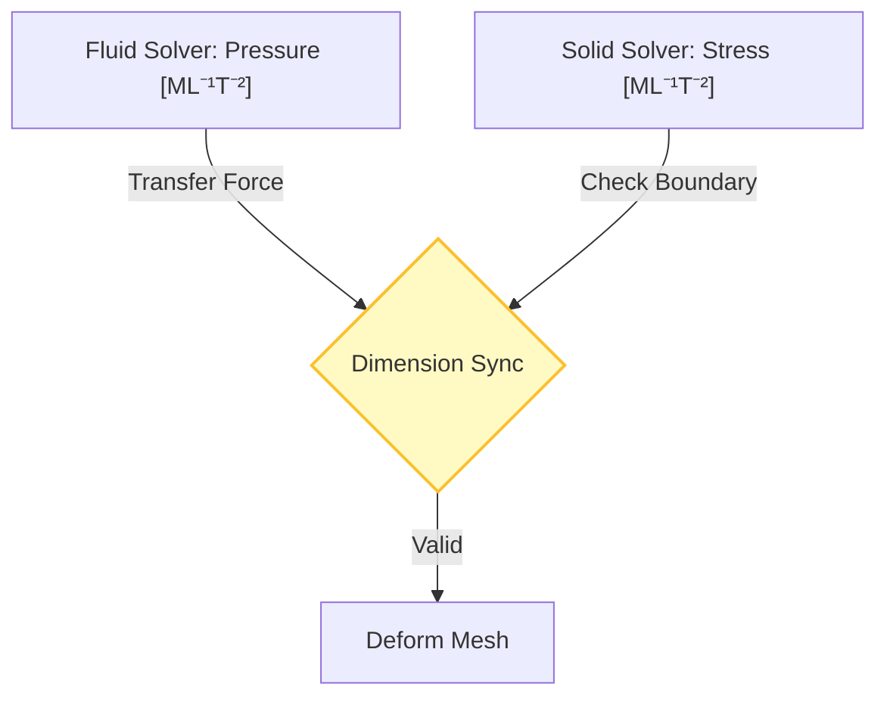
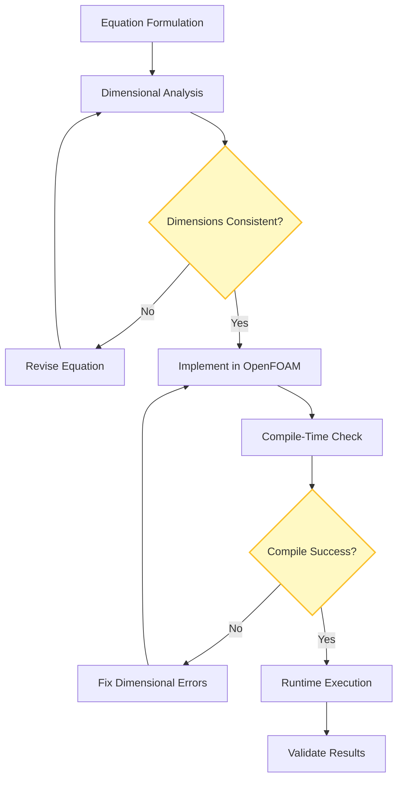

# การประยุกต์ใช้ขั้นสูง

![[multi_physics_conductor.png]]
`A central hub connecting three different physical domains: Fluid (blue waves), Solid (grey girders), and Electrical (yellow sparks). Bridges between domains feature glowing "Unit Locks" that only open if dimensions are consistent, scientific textbook diagram, clean vector line art, white background, high definition, flat design, educational infographic --ar 16:9`

## 8. การประยุกต์ใช้ขั้นสูง

### ระบบมิติหลายฟิสิกส์ (Multi‑Physics Dimensional Systems)

เมื่อมีการเชื่อมโยงโดเมนฟิสิกส์ที่แตกต่างกัน เช่น ปฏิสัมพันธ์ของของไหลและโครงสร้าง (FSI), อิเล็กโทร-ไฮโดรไดนามิกส์ (EHD), หรือ แมกเนโต-ไฮโดรไดนามิกส์ (MHD) **การรักษาความสม่ำเสมอของมิติ** จะกลายเป็นสิ่งสำคัญอย่างยิ่ง


> **Figure 1:** กระบวนการประสานงานมิติทางฟิสิกส์ (Dimension Sync) ระหว่างโซลเวอร์ประเภทต่างๆ เช่น ของไหลและโครงสร้าง เพื่อให้การส่งผ่านข้อมูลที่รอยต่อขอบเขตมีความสอดคล้องกันความปลอดภัยทางฟิสิกส์ไม่ส่งผลกระทบต่อความเร็วในการจำลอง ผ่านการใช้พลังของ C++ Template Metaprogramming ในการตรวจสอบความสอดคล้องทางมิติทั้งหมดที่ขั้นตอนการคอมไพล์โปรแกรมเพียงครั้งเดียว

![[of_fsi_dimension_sync.png]]
`A diagram showing the transfer of a pressure field from a fluid solver to a structural solver, illustrating how the dimensionSet ensures the units are interpreted correctly as Stress [M L⁻¹ T⁻²], scientific textbook diagram, clean vector line art, white background, high definition, flat design, educational infographic --ar 16:9`

ระบบมิติที่ครอบคลุมของ OpenFOAM สามารถจัดการการเชื่อมโยงข้ามสาขาวิชาเหล่านี้ได้ตามธรรมชาติผ่าน **กลไกการติดตามหน่วยที่เข้มงวด** ของคลาส `dimensionSet`

แต่ละฟิลด์ใน OpenFOAM มีข้อมูลมิติแฝงซึ่งเข้ารหัสในคลาส `dimensionSet`:
- ฟิลด์ความเร็ว: $[\mathbf{u}] = \mathrm{L}\,\mathrm{T}^{-1}$
- ความดัน: $[p] = \mathrm{M}\,\mathrm{L}^{-1}\,\mathrm{T}^{-2}$
- ความแรงสนามไฟฟ้า: $[\mathbf{E}] = \mathrm{M}\,\mathrm{L}\,\mathrm{T}^{-3}\,\mathrm{I}^{-1}$

---

### ปฏิสัมพันธ์ของของไหลและโครงสร้าง (FSI)

เมื่อเชื่อมโยงฟิสิกส์ที่แตกต่างกัน เทอมข้ามฟิสิกส์จะต้องแก้ไขให้มีมิติที่สอดคล้องกันโดยอัตโนมัติ:

```cpp
// Coupling term with automatic dimensional checking
fvm::ddt(rho, U) + fvm::div(phi, U) ==
    -fvc::grad(p) + fvc::div(tau) + rho*g
    + fvc::div(solidStressTensor);  // Must have same dimensions [M L⁻² T⁻²]
```

---

### การเชื่อมโยงอิเล็กโทร-ไฮโดรไดนามิกส์ (EHD)

เทอมแรงตามกายของไฟฟ้าในสมการโมเมนตัม:
$$\mathbf{f}_e = \rho_e \mathbf{E} + \mathbf{J} \times \mathbf{B}$$

โดยที่แต่ละเทอมต้องมีมิติของแรงต่อหน่วยปริมาตร:

| ปริมาณ | สัญลักษณ์ | มิติ | หน่วยฐาน |
|---------|------------|-------|-----------|
| ความหนาแน่นประจุไฟฟ้า | $\rho_e$ | $\mathrm{I}\,\mathrm{T}\,\mathrm{L}^{-3}$ | C·s/m³ |
| สนามไฟฟ้า | $\mathbf{E}$ | $\mathrm{M}\,\mathrm{L}\,\mathrm{T}^{-3}\,\mathrm{I}^{-1}$ | V/m |
| ความหนาแน่นกระแส | $\mathbf{J}$ | $\mathrm{I}\,\mathrm{L}^{-2}$ | A/m² |
| สนามแม่เหล็ก | $\mathbf{B}$ | $\mathrm{M}\,\mathrm{T}^{-2}\,\mathrm{I}^{-1}$ | T |

---

### แมกเนโต-ไฮโดรไดนามิกส์ (MHD)

สำหรับการจำลอง MHD เราต้องกำหนดมิติสำหรับปริมาณแม่เหล็กไฟฟ้า:

```cpp
// Electromagnetic dimensional sets
dimensionSet magneticPermeability(1, 1, -2, 0, 0, -2, 0);  // [M L T⁻² A⁻²]
dimensionSet electricConductivity(-1, -3, 3, 0, 0, 2, 0); // [M⁻¹ L⁻³ T³ A²]

// Custom MHD field declarations
volScalarField magneticField
(
    IOobject("B", runTime.timeName(), mesh, IOobject::MUST_READ),
    mesh,
    dimensionSet(1, 0, -2, 0, 0, -1, 0)  // Magnetic field [M T⁻² A⁻¹]
);
```

---

## ระบบหน่วยแบบกำหนดเอง (Custom Unit Systems)

แม้ว่า OpenFOAM จะใช้หน่วย SI ภายใน แต่เฟรมเวิร์กมีความยืดหยุ่นในการทำงานกับระบบหน่วยทางเลือกผ่าน **ปริมาณอ้างอิงที่มีมิติ** และ **ตัวคูณการแปลง**

---

### การกำหนดหน่วยความยาวแบบกำหนดเอง

```cpp
// Define foot as a custom length unit
dimensionedScalar dimFoot("dimFoot", dimLength, 0.3048);

// Create dimensionedScalar with custom units
dimensionedScalar pipeLength("pipeLength", dimFoot, 10.0);  // 10 feet

// Automatic conversion to SI internally
Info << "Length in metres: " << pipeLength.value() << endl;  // Outputs: 3.048
```

---

### หน่วยมวลและเวลาแบบกำหนดเอง

```cpp
// US customary mass unit (pound-mass)
dimensionedScalar dimLbm("dimLbm", dimMass, 0.45359237);

// Custom time unit (hour)
dimensionedScalar dimHour("dimHour", dimTime, 3600.0);

// Flow rate in cubic feet per hour
dimensionedScalar flowRate("flowRate",
    dimVolume/dimHour,  // m³/hr internally
    1000.0);           // 1000 ft³/hr
```

---

### การแปลงสเกลอุณหภูมิ

```cpp
// Custom temperature unit (Rankine)
dimensionedScalar dimRankine("dimRankine", dimTemperature, 5.0/9.0);

// Temperature difference conversion
dimensionedScalar deltaT("deltaT", dimRankine, 100.0);  // 100°R = 55.56 K
```

---

## มาตรฐานหน่วยระหว่างประเทศ (International Unit Standards)

ระบบมิติของ OpenFOAM สร้างขึ้นบน **ระบบหน่วยสากล (SI)** แต่ให้กลไกในการขยายไปยังมาตรฐานระหว่างประเทศอื่นๆ ผ่านการกำหนดหน่วยเชิงระบบและค่าคงที่อ้างอิง

---

### การใช้งานหน่วยฐาน SI

```cpp
// Fundamental SI dimensions
const dimensionSet dimMass(1, 0, 0, 0, 0, 0, 0);         // M¹
const dimensionSet dimLength(0, 1, 0, 0, 0, 0, 0);       // L¹
const dimensionSet dimTime(0, 0, 1, 0, 0, 0, 0);         // T¹
const dimensionSet dimTemperature(0, 0, 0, 1, 0, 0, 0);  // Θ¹
const dimensionSet dimCurrent(0, 0, 0, 0, 1, 0, 0);      // I¹
```

---

### การขยายไปยังหน่วยแบบอเมริกัน (US Customary)

```cpp
// Create comprehensive unit system
class USCustomaryUnits
{
public:
    static const dimensionedScalar pound_mass;
    static const dimensionedScalar foot;
    static const dimensionedScalar second;
    static const dimensionedScalar pound_force;
    static const dimensionedScalar btu;

    // Reference constants
    static const dimensionedScalar g_c;  // Gravitational constant
};

const dimensionedScalar USCustomaryUnits::g_c(
    "g_c",
    dimMass*dimLength/(dimForce*dimTime*dimTime),
    32.174049);  // lbm·ft/(lbf·s²)
```

---

### เฟรมเวิร์กการแปลงหน่วยอังกฤษเป็น SI

```cpp
// Automatic conversion system
template<class Type>
class UnitConverter
{
private:
    dimensionedScalar conversionFactor_;

public:
    UnitConverter(const word& fromUnit, const word& toUnit);

    Type convert(const Type& value) const
    {
        return value * conversionFactor_.value();
    }
};
```

---

### ตารางการแปลงหน่วยทั่วไป

| หน่วย | ค่า SI | การใช้งาน | ประเภท |
|--------|---------|-------------|--------|
| 1 foot | 0.3048 m | ความยาว (อเมริกา) | ความยาว |
| 1 pound | 4.448 N | แรง (อเมริกา) | แรง |
| 1 psi | 6895 Pa | ความดัน (อเมริกา) | ความดัน |
| 1 Btu | 1055 J | พลังงาน (อเมริกา) | พลังงาน |

---

## การวิเคราะห์มิติในการพัฒนา Solver (Dimensional Analysis in Solver Development)

**การวิเคราะห์มิติทำหน้าที่เป็นเครื่องมือตรวจสอบที่ทรงพลัง** ระหว่างการพัฒนา solver ช่วยในการระบุข้อผิดพลาดในการนำไปใช้ก่อนการคอมไพล์และการทดสอบรันไทม์

การตรวจสอบมิติของ OpenFOAM เกิดขึ้นใน **ระดับคอมไพล์** สำหรับหลายการดำเนินการ โดยให้ข้อเสนอแนะทันทีเกี่ยวกับความไม่สอดคล้องของมิติ

---

### 1. การตรวจสอบความสอดคล้องของสมการ

ก่อนการนำไปใช้สมการที่ควบคุม ให้ทำการวิเคราะห์มิติเพื่อตรวจสอบความเป็นเนื้อเดียวกันของมิติของแต่ละเทอม

**สมการโมเมนตัม Navier-Stokes:**
$$\rho \frac{\partial \mathbf{u}}{\partial t} + \rho (\mathbf{u} \cdot \nabla) \mathbf{u} = -\nabla p + \mu \nabla^2 \mathbf{u} + \rho \mathbf{g}$$

การตรวจสอบมิติ:
- เทอมด้านซ้าย: $[\rho][\mathbf{u}]/[t] = \mathrm{M}\,\mathrm{L}^{-2}\,\mathrm{T}^{-1}$
- ไกรเอนต์ความดัน: $[p]/[L] = \mathrm{M}\,\mathrm{L}^{-2}\,\mathrm{T}^{-2}$
- เทอมความหนืด: $[\mu][\mathbf{u}]/[L]^2 = \mathrm{M}\,\mathrm{L}^{-2}\,\mathrm{T}^{-2}$
- แรงตามกาย: $[\rho][g] = \mathrm{M}\,\mathrm{L}^{-2}\,\mathrm{T}^{-2}$

---

### 2. การระบุกลุ่มไร้มิติ

ใช้การวิเคราะห์มิติเพื่อระบุจำนวนไร้มิติหลักที่ควบคุมฟิสิกส์

**จำนวนเรย์โนลด์:**
$$Re = \frac{\rho U L}{\mu} = \frac{\text{Inertial forces}}{\text{Viscous forces}}$$

**จำนวนแพรนต์ล:**
$$Pr = \frac{c_p \mu}{k} = \frac{\text{Momentum diffusivity}}{\text{Thermal diffusivity}}$$

**จำนวนเปเคลต์:**
$$Pe = Re \cdot Pr = \frac{\rho U L c_p}{k} = \frac{\text{Advective transport}}{\text{Diffusive transport}}$$

---

### 3. การตรวจสอบมิติของเงื่อนไขขอบเขต

ตรวจสอบให้แน่ใจว่าเงื่อนไขขอบเขตทั้งหมดรักษาความสอดคล้องของมิติ:

```cpp
// Velocity boundary condition (m/s)
fixedValueFvPatchVectorField U inlet("U", mesh.boundary()["inlet"]);
U == dimensionedVector("Uinlet", dimVelocity, vector(1.0, 0.0, 0.0));

// Pressure boundary condition (Pa)
fixedValueFvPatchScalarField p outlet("p", mesh.boundary()["outlet"]);
p == dimensionedScalar("poutlet", dimPressure, 101325.0);

// Temperature boundary condition (K)
fixedValueFvPatchScalarField T wall("T", mesh.boundary()["wall"]);
T == dimensionedScalar("Twall", dimTemperature, 300.0);
```

---

### 4. การตรวจสอบเทอมต้นทางและเทอมเชื่อมโยง

ตรวจสอบความสอดคล้องของมิติของเทอมต้นทางในสมการการขนส่ง

**การขนส่งชนิดกับปฏิกิริยา:**
$$\frac{\partial (\rho Y_i)}{\partial t} + \nabla \cdot (\rho \mathbf{u} Y_i) = -\nabla \cdot \mathbf{J}_i + \dot{\omega}_i$$

การวิเคราะห์มิติ:
- อนุพันธ์ตามเวลา: $[\rho Y_i]/[t] = \mathrm{M}\,\mathrm{L}^{-3}\,\mathrm{T}^{-1}$
- เทอม convection: $[\rho U Y_i]/[L] = \mathrm{M}\,\mathrm{L}^{-3}\,\mathrm{T}^{-1}$
- เทอม diffusion: $[D_i \rho Y_i]/[L]^2 = \mathrm{M}\,\mathrm{L}^{-3}\,\mathrm{T}^{-1}$
- อัตราปฏิกิริยา: $[\dot{\omega}_i] = \mathrm{M}\,\mathrm{L}^{-3}\,\mathrm{T}^{-1}$

---

### 5. การตรวจสอบมิติในระดับการนำไปใช้

ใช้ประโยชน์จากการตรวจสอบมิติในระดับคอมไพล์ของ OpenFOAM:

```cpp
// This will cause compile error if dimensions don't match
volScalarField sourceTerm
(
    IOobject("sourceTerm", runTime.timeName(), mesh),
    mesh,
    dimensionedScalar("sourceTerm", dimless/dimTime, 0.0)  // 1/s
);

// Correct dimensional implementation
fvScalarMatrix YEqn
(
    fvm::ddt(rho, Yi)                   // [kg/(m³·s)]
  + fvm::div(phi, Yi)                   // [kg/(m³·s)]
 ==
    fvm::laplacian(Di, Yi)              // [kg/(m³·s)]
  + sourceTerm * rho * Yi               // [kg/(m³·s)]
);
```

---


> **Figure 2:** ขั้นตอนการพัฒนาสมการตั้งแต่การตั้งสูตรทางคณิตศาสตร์ การวิเคราะห์มิติ ไปจนถึงการตรวจสอบความถูกต้องขณะคอมไพล์และรันโปรแกรมความปลอดภัยทางฟิสิกส์ไม่ส่งผลกระทบต่อความเร็วในการจำลอง ผ่านการใช้พลังของ C++ Template Metaprogramming ในการตรวจสอบความสอดคล้องทางมิติทั้งหมดที่ขั้นตอนการคอมไพล์โปรแกรมเพียงครั้งเดียว

---

### 6. Template-Based Dimensional Validation

**การวิเคราะห์มิติที่เหมาะสมเป็นสิ่งจำเป็นสำหรับการพัฒนา solver ที่แข็งแกร่ง:**

```cpp
// Template-based dimensional validation for solver development
template<class Type>
class DimensionalSolver
{
    dimensionSet expectedDimensions_;

    // Compile-time dimensional checking
    template<class Field>
    void validateFieldDimensions(const Field& field) const
    {
        static_assert(Field::dimension_type::valid,
                     "Field must have valid dimensions");

        if (field.dimensions() != expectedDimensions_)
        {
            FatalErrorInFunction
                << "Field " << field.name() << " has dimensions "
                << field.dimensions() << " but expected "
                << expectedDimensions_ << exit(FatalError);
        }
    }

public:
    // Solver with built-in dimensional consistency
    void solve(const volScalarField& phi, const volVectorField& U)
    {
        validateFieldDimensions(phi);  // Runtime check
        validateFieldDimensions(U);   // Runtime check

        // Implementation guaranteed to be dimensionally consistent
        // ... solver logic ...
    }
};
```

---

### 7. Heat Transfer Solver Implementation

```cpp
// Usage example for heat transfer solver
class HeatTransferSolver : public DimensionalSolver<scalar>
{
public:
    HeatTransferSolver() : DimensionalSolver<scalar>(dimTemperature)
    {
        // Constructor sets expected temperature dimensions
    }

    // Energy equation with dimensional consistency guaranteed
    void solveEnergy(const volScalarField& T, const volVectorField& U)
    {
        // All operations automatically checked for dimensional consistency
        fvScalarMatrix TEqn
        (
            fvm::ddt(T)                                    // ∂T/∂t  [ΘT⁻¹]
          + fvm::div(U, T)                                // u·∇T  [ΘLT⁻¹]
         ==
            fvm::laplacian(alpha, T)                       // α∇²T  [ΘLT⁻¹]
          + heatSource                                     // Q     [ΘT⁻¹]
        );

        TEqn.solve();  // All dimensions consistent by construction
    }
};
```

---

### ขั้นตอนการพัฒนา Solver ที่ปลอดภัยต่อมิติ

1. **การออกแบบ:** กำหนดมิติที่คาดหวังสำหรับแต่ละฟิลด์
2. **การตรวจสอบขณะคอมไพล์:** ใช้ templates เพื่อตรวจสอบความสอดคล้อง
3. **การตรวจสอบขณะทำงาน:** ตรวจสอบมิติฟิลด์ในเวลาทำงาน
4. **การทดสอบ:** ทดสอบด้วยหน่วยที่ทราบผลลัพธ์
5. **การตรวจสอบความสม่ำเสมอ:** ตรวจสอบมิติของแต่ละเทอมในสมการ

---

## สรุป

**แนวทางเชิงระบบในการวิเคราะห์มิตินี้ช่วยให้มั่นใจในการพัฒนา solver ที่แข็งแกร่ง** ตรวจจับข้อผิดพลาดในการนำไปใช้ตั้งแต่เนิ่นๆ และให้ความมั่นใจในความถูกต้องทางฟิสิกส์ของผลลัพธ์เชิงตัวเลข

**การวิเคราะห์มิติในระดับสูงเปลี่ยน OpenFOAM ให้กลายเป็นห้องทดลองเสมือนจริงที่เข้มงวด** ช่วยให้นักวิจัยสามารถทดลองทฤษฎีใหม่ๆ ได้โดยไม่ต้องกังวลเรื่องความผิดพลาดพื้นฐานทางหน่วยวัด

> [!TIP] ประโยชน์ของระบบมิติขั้นสูง
> - ✅ การตรวจจับข้อผิดพลาดในระยะเริ่มต้น
> - ✅ การระบุข้อผิดพลาดอย่างชัดเจน
> - ✅ การลดการทดลองและผิดพลาด
> - ✅ ความน่าเชื่อถือของโค้ด
> - ✅ ความถูกต้องทางกายภาพที่รับประกัน
