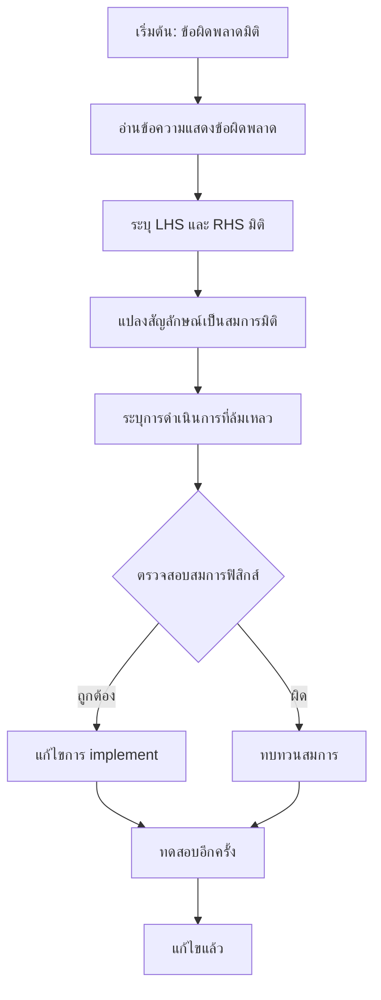

# ข้อควรระวังและการดีบัก (Common Pitfalls & Debugging)

![[the_unit_wall_pitfall.png]]
`A diagram showing a researcher in a laboratory trying to pass a "Pressure" object (blue) through a glass wall into a "Velocity" room (red), but being blocked by the "Unit Wall", illustrating dimension mismatch, scientific textbook diagram, clean vector line art, white background, high definition, flat design, educational infographic --ar 16:9`

---

## **ภาพรวมข้อผิดพลาดทั่วไป**

ระบบการวิเคราะห์มิติของ OpenFOAM ทำหน้าที่เป็นเครือข่ายความปลอดภัยที่แข็งแกร่ง แต่ข้อผิดพลาดทั่วไปยังคงเกิดขึ้นได้เมื่อนักพัฒนาไม่เข้าใจกลไกพื้นฐาน ส่วนนี้จะครอบคลุมข้อผิดพลาดที่พบบ่อยที่สุด วิธีการตรวจจับ และกลยุทธ์ในการแก้ไข

> [!INFO] **เป้าหมายของส่วนนี้**
> หลังจากอ่านส่วนนี้ คุณจะสามารถ:
> - ระบุและหลีกเลี่ยงข้อผิดพลาดมิติทั่วไป
> - ตีความข้อความแสดงข้อผิดพลาดของ OpenFOAM
> - ใช้เทคนิคการดีบักเชิงระบบ
> - เขียนโค้ดที่ปลอดภัยต่อมิติ

---

## **❌ ข้อผิดพลาดที่ 1: การบวกสนามที่ไม่เข้ากัน**

### **คำอธิบาย**

พยายามบวกหรือลบปริมาณทางกายภาพที่มีมิติต่างกันเป็นข้อผิดพลาดที่พบบ่อยที่สุด ระบบมิติของ OpenFOAM จะบล็อกการดำเนินการนี้ทันที

### **ตัวอย่างโค้ดที่ผิด**

```cpp
volScalarField p(...);  // ความดัน [Pa = kg/(m·s²)] = [M L⁻¹ T⁻²]
volScalarField T(...);  // อุณหภูมิ [K] = [Θ]
volScalarField wrong = p + T;  // FATAL ERROR: Dimension mismatch
```

### **ข้อความแสดงข้อผิดพลาดของ OpenFOAM**

```
--> FOAM FATAL ERROR:
    LHS and RHS of + have different dimensions
    LHS dimensions : [1 -1 -2 0 0 0 0]  = [M L⁻¹ T⁻²] (Pressure)
    RHS dimensions : [0  0  0 1 0 0 0]  = [Θ]           (Temperature)

    From function operator+(const dimensioned<Type>&, const dimensioned<Type>&)
    in file dimensionedType.C at line 234.
```

### **การวิเคราะห์มิติ**

| ปริมาณ | สัญลักษณ์มิติ | มิติ | หน่วย SI |
|----------|-----------------|-------------------|------------|
| ความดัน | $[p]$ | $ML^{-1}T^{-2}$ | Pa = N/m² |
| อุณหภูมิ | $[T]$ | $\Theta$ | K |

**ทำไมไม่สามารถบวกกันได้?**
- ความดันเป็น **แรงต่อหน่วยพื้นที่** ($F/A$)
- อุณหภูมิเป็น **ตัววัดความร้อน** (องศาเคลวิน)
- แทนปริมาณทางฟิสิกส์ที่**แตกต่างกันอย่างสิ้นเชิง**

### **✅ การแก้ไขที่ถูกต้อง: กฎของแก๊สอุดมคติ**

หากคุณกำลังพยายามใช้ความสัมพันธ์ของความดันและอุณหภูมิ:

$$p = \rho R T$$

```cpp
// การ implement ที่ถูกต้องสำหรับกฎของแก๊สอุดมคติ
dimensionedScalar R("R", dimensionSet(0, 2, -2, -1, 0, 0, 0), 287.05);  // J/(kg·K)

volScalarField p = rho * R * T;  // [kg/m³] × [J/(kg·K)] × [K] = [Pa] ✓
```

### **การตรวจสอบมิติ**

$$[p] = [\rho][R][T] = ML^{-3} \cdot L^{2}T^{-2}\Theta^{-1} \cdot \Theta = ML^{-1}T^{-2} \quad \checkmark$$

---

## **❌ ข้อผิดพลาดที่ 2: ลืมทำให้อาร์กิวเมนต์ไร้มิติ**

### **คำอธิบาย**

ฟังก์ชันทางคณิตศาสตร์อย่าง `exp()`, `log()`, `sin()`, `cos()` ต้องการอาร์กิวเมนต์ไร้มิติ การใส่ปริมาณที่มีมิติโดยตรงจะทำให้เกิดข้อผิดพลาด

### **ตัวอย่างโค้ดที่ผิด**

```cpp
volScalarField theta(...);  // อุณหภูมิใน K [Θ]
volScalarField expTheta = exp(theta);  // ERROR: exp requires dimensionless
```

### **ข้อความแสดงข้อผิดพลาด**

```
--> FOAM FATAL ERROR:
    Exp of dimensioned quantity not dimensionless
    dimensions : [0 0 0 1 0 0 0]  = [Θ]

    From function exp(const dimensioned<Type>&)
```

### **คำอธิบายทางคณิตศาสตร์**

ฟังก์ชันเลขชี้กำลังนิยามผ่านอนุกรมเทย์เลอร์:

$$e^{\theta} = 1 + \theta + \frac{\theta^{2}}{2!} + \frac{\theta^{3}}{3!} + \cdots$$

ถ้า $\theta$ มีมิติของอุณหภูมิ:
- พจน์ที่ 1: $1$ (ไร้มิติ)
- พจน์ที่ 2: $\theta$ (มีมิติของอุณหภูมิ $[\Theta]$)
- พจน์ที่ 3: $\theta^{2}$ (มีมิติของ $\Theta^{2}$)
- **ทุกพจน์มีมิติที่แตกต่างกัน → อนุกรมไร้ความหมาย!**

### **✅ การแก้ไขที่ถูกต้อง**

```cpp
// กำหนดอุณหภูมิอ้างอิง
dimensionedScalar Tref("Tref", dimTemperature, 300.0);  // 300 K

// ทำให้อุณหภูมิไร้มิติ
volScalarField nondimTheta = theta / Tref;  // ตอนนี้ไร้มิติ

// ใช้ในฟังก์ชันได้อย่างปลอดภัย
volScalarField expTheta = exp(nondimTheta);  // ✓ ถูกต้อง
```

### **ตารางฟังก์ชันที่ต้องการอาร์กิวเมนต์ไร้มิติ**

| ฟังก์ชัน OpenFOAM | สัญลักษณ์คณิตศาสตร์ | ความต้องการมิติ |
|--------------------|----------------------|------------------|
| `exp(x)` | $e^{x}$ | $x$ ต้องไร้มิติ |
| `log(x)` | $\ln(x)$ | $x$ ต้องไร้มิติ |
| `sin(x)` | $\sin(x)$ | $x$ ต้องไร้มิติ (เรียดิอัน) |
| `cos(x)` | $\cos(x)$ | $x$ ต้องไร้มิติ (เรียดิอัน) |
| `sqrt(x)` | $\sqrt{x}$ | $x$ ต้องเป็นกำลังสองของมิติ |
| `pow(x, n)` | $x^{n}$ | $n$ ต้องไร้มิติ |

---

## **❌ ข้อผิดพลาดที่ 3: การสเกลหน่วยที่ไม่ถูกต้อง**

### **คำอธิบาย**

OpenFOAM ใช้หน่วย SI ภายในเสมอ การใส่ค่าในหน่วยอื่นโดยไม่แปลงอย่างชัดเจนเป็นสาเหตุทั่วไปของข้อผิดพลาด

### **ตัวอย่างโค้ดที่ผิด**

```cpp
// ❌ กำกวม: หน่วยไม่ชัดเจน
dimensionedScalar v_wrong("v_wrong", dimVelocity, 10);
// 10 คืออะไร? m/s? cm/s? km/h?

// ❌ สับสน: ใส่ค่า cm/s โดยตรง
dimensionedScalar v_cm("v_cm", dimVelocity, 100);
// ตั้งใจให้เป็น 100 cm/s แต่ OpenFOAM ตีความเป็น 100 m/s!
```

### **✅ การแก้ไขที่ถูกต้อง**

```cpp
// ✓ ชัดเจน: หน่วย SI ที่ชัดเจน
dimensionedScalar v_correct("v_correct", dimVelocity, 10.0);  // 10 m/s

// ✓ การแปลงหน่วยที่ชัดเจน
dimensionedScalar v_cm_to_m("v_cm_to_m", dimVelocity, 100.0/100.0);  // 100 cm/s = 1 m/s

// ✓ การใช้ค่าคงที่แปลง
constexpr scalar cmToM = 0.01;
dimensionedScalar length_cm("length_cm", dimLength, 5.0 * cmToM);  // 5 cm = 0.05 m
```

### **ตารางการแปลงหน่วยทั่วไป**

| ปริมาณ | จาก | ถึง (SI) | ตัวคูณ |
|----------|------|-----------|---------|
| ความยาว | cm | m | $0.01$ |
| ความยาว | mm | m | $0.001$ |
| ความยาว | km | m | $1000$ |
| ความเร็ว | km/h | m/s | $1/3.6$ |
| ความดัน | bar | Pa | $1 \times 10^{5}$ |
| ความดัน | atm | Pa | $101325$ |
| ความดัน | psi | Pa | $6894.76$ |
| พลังงาน | cal | J | $4.184$ |
| พลังงาน | BTU | J | $1055.06$ |
| อุณหภูมิ | °C | K | $T_{K} = T_{°C} + 273.15$ |
| อุณหภูมิ | °F | K | $T_{K} = (T_{°F} + 459.67) \times 5/9$ |

> [!WARNING] **คำเตือนเรื่องอุณหภูมิ**
> การแปลงอุณหภูมิไม่เหมือนปริมาณอื่นๆ ต้องบวกออฟเซ็ต ไม่ใช่คูณตัวคูณเท่านั้น

---

## **❌ ข้อผิดพลาดที่ 4: การใช้ `.value()` เพื่อหลบเลี่ยงการตรวจสอบมิติ**

### **คำอธิบาย**

เมธอด `.value()` ดึงค่าตัวเลขดิบออกมาโดย**ทิ้งข้อมูลมิติ** การใช้มันเพื่อหลบเลี่ยงข้อผิดพลาดมิติเป็นปฏิบัติที่ผิดและอันตราย

### **ตัวอย่างโค้ดที่ผิด**

```cpp
// ❌ ปฏิบัติที่ผิด: การใช้ .value() เพื่อหลบเลี่ยงการตรวจสอบมิติ
volScalarField p(...);  // ความดัน [Pa]
volScalarField T(...);  // อุณหภูมิ [K]

volScalarField wrong = p + T;  // Error: มิติไม่ตรงกัน

// ❌ ไม่ควรทำเช่นนี้!
volScalarField badHack = p.value() + T;  // หลบเลี่ยงการตรวจสอบ แต่ไร้ความหมายทางฟิสิกส์
```

### **ปัญหาของแนวทางนี้**

1. **สูญเสียความหมายทางฟิสิกส์**: `101325 + 300` = 101625 (อะไรคือหน่วย?)
2. **ข้อผิดพลาดที่ยากต่อการติดตาม**: ผลลัพธ์ดูเหมือนจะใช้งานได้แต่ผิด
3. **ไม่สามารถทำซ้ำได้**: ค่าขึ้นอยู่กับหน่วยอินพุตโดยไม่มีการแปลง
4. **ทำลายเครือข่ายความปลอดภัย**: นั่นคือจุดประสงค์ของระบบมิติ!

### **✅ แนวทางที่ถูกต้อง**

```cpp
// ถ้าคุณต้องการรวมความดันและอุณหภูมิ ให้ตรวจสอบสมการฟิสิกส์ของคุณ

// ตัวอย่างที่ 1: กฎของแก๊สอุดมคติ p = ρRT
dimensionedScalar R("R", dimensionSet(0, 2, -2, -1, 0, 0, 0), 287.05);
volScalarField p_calc = rho * R * T;  // ✓

// ตัวอย่างที่ 2: สมการสถานะ
volScalarField pEOS = rho * specificGasConstant * T;  // ✓

// ตัวอย่างที่ 3: ความดันบริสุทธิ์
volScalarField p_total = p_static + 0.5 * rho * magSqr(U);  // Bernoulli ✓
```

> [!TIP] **เมื่อใดควรใช้ .value()**
> - ในการคำนวณจำนวนไร้มิติ: `scalar Re = (rho * U * L / mu).value();`
> - ในการเปรียบเทียบเชิงตัวเลข: `if (T.value() > 300.0) ...`
> - ในการแสดงผลเท่านั้น: `Info << "Pressure: " << p.value() << endl;`

---

## **❌ ข้อผิดพลาดที่ 5: การผสมประเภทฟิลด์ที่เข้ากันไม่ได้**

### **คำอธิบาย**

การพยายามดำเนินการระหว่างประเภทฟิลด์ที่แตกต่างกันโดยไม่สนใจความแตกต่างของมิติ

### **ตัวอย่างโค้ดที่ผิด**

```cpp
// ❌ การผสม volScalarField กับ surfaceScalarField โดยไม่ระมัดระวัง
volScalarField p(...);           // ความดันที่จุดศูนย์กลางเซลล์ [Pa]
surfaceScalarField phi(...);     // อัตราการไหลผ่านพื้นที่ [m³/s]

volScalarField wrong = p + phi;  // Error: มิติไม่ตรงกัน
```

### **การวิเคราะห์มิติ**

| ฟิลด์ | ตำแหน่ง | มิติ | คำอธิบาย |
|-------|-----------|------------------|------------|
| `p` | จุดศูนย์กลางเซลล์ | $ML^{-1}T^{-2}$ | ความดัน |
| `phi` | ใบหน้าเซลล์ | $L^{3}T^{-1}$ | อัตราการไหลผ่านพื้นที่ |

### **✅ การแก้ไขที่ถูกต้อง**

```cpp
// ต้องการแปลงระหว่างฟิลด์จุดศูนย์กลางและฟิลด์ใบหน้า
surfaceScalarField p_face = fvc::interpolate(p);  // แปลง p ไปยังใบหน้า

// หรือใช้ในสมการที่ถูกต้อง
fvScalarMatrix pEqn
(
    fvm::laplacian(dimensionedScalar("Dp", dimless, 1.0), p)
  + fvc::div(phi)  // อัตราการไหลใช้ใน divergence
);
```

---

## **การอ่านและการตีความข้อความแสดงข้อผิดพลาดของ OpenFOAM**

### **รูปแบบมาตรฐาน**

```
--> FOAM FATAL ERROR:
    [ข้อความอธิบาย]
    LHS dimensions : [M L T Θ N I J]  = (คำอธิบาย)
    RHS dimensions : [M L T Θ N I J]  = (คำอธิบาย)

    From function [ชื่อฟังก์ชัน]
    in file [ชื่อไฟล์] at line [หมายเลขบรรทัด].
```

### **การแปลงสัญลักษณ์มิติ**

| รูปแบบ | สมการมิติ | ความหมาย | ตัวอย่างหน่วย |
|----------|---------------------|-------------|------------------|
| `[0 0 0 0 0 0 0]` | - | ไร้มิติ | Reynolds, Prandtl |
| `[0 1 0 0 0 0 0]` | $L$ | ความยาว | m, mm, km |
| `[0 1 -1 0 0 0 0]` | $LT^{-1}$ | ความเร็ว | m/s, km/h |
| `[0 1 -2 0 0 0 0]` | $LT^{-2}$ | ความเร่ง | m/s² |
| `[1 -3 0 0 0 0 0]` | $ML^{-3}$ | ความหนาแน่น | kg/m³ |
| `[1 -1 -2 0 0 0 0]` | $ML^{-1}T^{-2}$ | ความดัน | Pa, psi, bar |
| `[1 1 -2 0 0 0 0]` | $MLT^{-2}$ | แรง | N, lbf |
| `[1 2 -2 0 0 0 0]` | $ML^{2}T^{-2}$ | พลังงาน | J, BTU, cal |
| `[0 2 -1 0 0 0 0]` | $L^{2}T^{-1}$ | ความหนืดจลน์ | m²/s |
| `[1 -1 -1 0 0 0 0]` | $ML^{-1}T^{-1}$ | ความหนืดไดนามิก | Pa·s |

### **ตัวอย่างการตีความ**

```
--> FOAM FATAL ERROR:
    LHS and RHS of + have different dimensions
    LHS dimensions : [0 2 -2 0 0 0 0]  = (kinematic energy per unit mass)
    RHS dimensions : [0 1 -1 0 0 0 0]  = (velocity)
```

**การวิเคราะห์:**
- **LHS** `[0 2 -2 0 0 0 0]` = $L^{2}T^{-2}$ = พลังงานจลน์ต่อมวล (m²/s²)
- **RHS** `[0 1 -1 0 0 0 0]` = $LT^{-1}$ = ความเร็ว (m/s)
- **ปัญหา**: พยายามบวกพลังงาน ($U^{2}/2$) กับความเร็ว ($U$)

**การแก้ไขที่เป็นไปได้:**
- ลบส่วนประกอบความเร็วถ้าไม่จำเป็น
- ทำให้ความเร็วไร้มิติก่อน
- ตรวจสอบว่าตั้งใจจะใช้ Bernoulli equation: $p + \frac{1}{2}\rho U^{2}$

---

## **เทคนิคการดีบักเชิงระบบ**

### **ขั้นตอนที่ 1: ระบุตำแหน่งข้อผิดพลาด**

```cpp
// เปิดใช้งานการดีบักมิติ
dimensionSet::debug = 1;

// พิมพ์ข้อมูลมิติของฟิลด์
Info << "=== Dimension Debug Info ===" << nl;
Info << "p dimensions: " << p.dimensions() << nl;
Info << "U dimensions: " << U.dimensions() << nl;
Info << "T dimensions: " << T.dimensions() << nl;
Info << "rho dimensions: " << rho.dimensions() << nl;
```

### **ขั้นตอนที่ 2: ฟังก์ชันตรวจสอบมิติที่กำหนดเอง**

```cpp
// ฟังก์ชันช่วยในการตรวจสอบมิติ
void printFieldDimensions(const word& fieldName, const dimensionSet& dims)
{
    Info << "Field: " << fieldName << nl
         << "  Dimensions: " << dims << nl
         << "  Mass exponent: " << dims[0] << nl
         << "  Length exponent: " << dims[1] << nl
         << "  Time exponent: " << dims[2] << nl
         << "  Temperature exponent: " << dims[3] << nl
         << endl;
}

// ฟังก์ชันตรวจสอบความสอดคล้อง
template<class Type>
bool checkDimensionalConsistency
(
    const GeometricField<Type, fvPatchField, volMesh>& field1,
    const GeometricField<Type, fvPatchField, volMesh>& field2
)
{
    if (field1.dimensions() != field2.dimensions())
    {
        WarningIn("checkDimensionalConsistency")
            << "Dimensional mismatch detected:" << nl
            << "  " << field1.name() << ": " << field1.dimensions() << nl
            << "  " << field2.name() << ": " << field2.dimensions() << endl;
        return false;
    }
    return true;
}
```

### **ขั้นตอนที่ 3: การตรวจสอบสมการทีละพจน์**

```cpp
// ตัวอย่าง: การตรวจสอบสมการโมเมนตัมทีละพจน์
// ρ(∂u/∂t) + ρ(u·∇)u = -∇p + μ∇²u

// เทอมชั่วคราว: ρ(∂u/∂t)
dimensionedScalar ddtTermDims = rho.dimensions() * U.dimensions() / dimTime;
Info << "∂u/∂t term dimensions: " << ddtTermDims << endl;  // ควรเป็น ML⁻²T⁻²

// เทอมพาพลศาสตร์: ρ(u·∇)u
dimensionedScalar convTermDims = rho.dimensions() * U.dimensions() * U.dimensions() / dimLength;
Info << "Convection term dimensions: " << convTermDims << endl;  // ควรเป็น ML⁻²T⁻²

// เทอมความดัน: ∇p
dimensionedScalar presTermDims = p.dimensions() / dimLength;
Info << "Pressure gradient dimensions: " << presTermDims << endl;  // ควรเป็น ML⁻²T⁻²

// เทอมความหนืด: μ∇²u
dimensionedScalar viscTermDims = mu.dimensions() * U.dimensions() / pow(dimLength, 2);
Info << "Viscous term dimensions: " << viscTermDims << endl;  // ควรเป็น ML⁻²T⁻²
```

### **ขั้นตอนที่ 4: การใช้ Mermaid Diagram เพื่อการติดตาม**


> **Figure 1:** แผนผังลำดับขั้นตอนการดีบักเมื่อเกิดข้อผิดพลาดด้านมิติ ตั้งแต่การอ่านข้อความแจ้งเตือนจากคอมไพเลอร์ไปจนถึงการตรวจสอบสมการฟิสิกส์และการแก้ไขโค้ดความปลอดภัยทางฟิสิกส์ไม่ส่งผลกระทบต่อความเร็วในการจำลอง ผ่านการใช้พลังของ C++ Template Metaprogramming ในการตรวจสอบความสอดคล้องทางมิติทั้งหมดที่ขั้นตอนการคอมไพล์โปรแกรมเพียงครั้งเดียว

---

## **ตารางสัญญาณเตือนและการแก้ไข**

| 🚩 สัญญาณเตือน (Symptom) | 🔧 วิธีแก้ (Solution) | 📍 บรรทัดที่เกี่ยวข้อง |
| :--- | :--- | :--- |
| `Fatal Error: incompatible dimensions` | ไล่เช็คหน่วยทีละพจน์ในสมการ | ตำแหน่งที่ระบุใน error |
| `sin(T) error` | หารด้วยค่าอ้างอิงให้ไร้มิติ (T/T_ref) | ฟังก์ชัน transcendental |
| Residual พุ่งสูง (Diverge) | ตรวจสอบ Scaling factors ในพจน์ Source | พจน์แหล่งกำเนิด |
| `object not found` ในไฟล์ 0/ | ตรวจสอบชื่อฟิลด์และหน่วยในไฟล์ตั้งต้น | ไฟล์ 0/[fieldName] |
| ผลลัพธ์ค่าลบเมื่อไม่ควรเป็น | ตรวจสอบมิติของเงื่อนไขขอบเขต | ไฟล์ 0/boundaryField |
| การแพร่กระจายช้าผิดปกติ | ตรวจสอบหน่วยของความหนืด/การแพร่ | transportProperties |
| การจำลองไม่เสถียร | ตรวจสอบสเกลเวลาและสเกลความยาว | controlDict |

---

## **กลยุทธ์การป้องกัน**

### **1. การพัฒนาที่ขับเคลื่อนด้วยมิติ**

```cpp
// ✓ แนวทางที่ดี: เริ่มต้นด้วยมิติที่ชัดเจน
dimensionedScalar U_ref("U_ref", dimVelocity, 10.0);      // m/s
dimensionedScalar L_ref("L_ref", dimLength, 1.0);         // m
dimensionedScalar T_ref("T_ref", dimTemperature, 300.0);  // K

// ใช้ในการคำนวณ
dimensionedScalar Re = rho * U_ref * L_ref / mu;  // ไร้มิติ
```

### **2. การเขียนเอกสารด้วยมิติ**

```cpp
// ✓ คอมเมนต์ที่มีประโยชน์
// สมการ Bernoulli: p + 0.5*ρ*U² = constant
// มิติ: [ML⁻¹T⁻²] + [ML⁻³][L²T⁻²] = [ML⁻¹T⁻²]
volScalarField Bernoulli = p + 0.5 * rho * magSqr(U);
```

### **3. การทดสอบหน่วยสำหรับความสอดคล้อง**

```cpp
// ฟังก์ชันทดสอบหน่วย
void testDimensionalConsistency()
{
    dimensionedScalar rho("rho", dimDensity, 1.225);
    dimensionedScalar U("U", dimVelocity, 10.0);
    dimensionedScalar L("L", dimLength, 1.0);
    dimensionedScalar mu("mu", dimDynamicViscosity, 1.8e-5);

    dimensionedScalar Re = (rho * U * L) / mu;

    // ตรวจสอบว่า Re ไร้มิติ
    if (Re.dimensions() != dimless)
    {
        FatalErrorIn("testDimensionalConsistency")
            << "Reynolds number is not dimensionless" << nl
            << "Dimensions: " << Re.dimensions() << endl
            << exit(FatalError);
    }

    Info << "✓ Reynolds number: " << Re.value() << " (dimensionless)" << endl;
}
```

### **4. การใช้มิติแบบกำหนดเองอย่างระมัดระวัง**

```cpp
// สำหรับฟิสิกส์เฉพาะทาง (เช่น แม่เหล็กไฟฟ้า)
dimensionSet dimPermittivity(1, -3, 4, 0, 0, 2, 0);  // ε₀: M⁻¹L⁻³T⁴I²
dimensionSet dimPermeability(1, 1, -2, 0, 0, -2, 0); // μ₀: MLT⁻²I⁻²

dimensionedScalar epsilon0("epsilon0", dimPermittivity, 8.854e-12);
dimensionedScalar mu0("mu0", dimPermeability, 4*M_PI*1e-7);

// ความเร็วคลื่น: c = 1/√(ε₀μ₀)
dimensionedScalar c("c", dimVelocity, 1.0/sqrt(epsilon0*mu0));
```

---

## **แนวทางปฏิบัติที่ดีที่สุด**

> [!TIP] **กฎทองคำของมิติ**
> 1. **เสมอ** ระบุมิติเมื่อสร้างค่าคงที่หรือฟิลด์
> 2. **เสมอ** ตรวจสอบความสอดคล้องของหน่วยก่อนดำเนินการ
> 3. **ไม่เคย** ใช้ `.value()` เพื่อหลบเลี่ยงการตรวจสอบมิติ
> 4. **เสมอ** แปลงเป็นหน่วย SI ภายใน
> 5. **เสมอ** ทำให้อาร์กิวเมนต์ฟังก์ชัน transcendental ไร้มิติ
> 6. **เสมอ** ตรวจสอบสมการทีละพจน์หากเกิดข้อผิดพลาด

### **เมื่อเกิดข้อผิดพลาด**

1. **อย่าตื่นตระหนก**: ระบบมิติทำงานได้ดีโดยการตรวจจับข้อผิดพลาด
2. **อ่านข้อความแสดงข้อผิดพลาดอย่างละเอียด**: บอกมิติที่แน่นอนของทั้งสองด้าน
3. **แปลงเป็นสมการมิติ**: ดูว่ามิติเหล่านี้หมายถึงอะไรทางฟิสิกส์
4. **ทบทวนสมการ**: ตรวจสอบสมการฟิสิกส์ของคุณ
5. **แก้ไขการ implement**: ไม่ใช่การใช้ `.value()` เพื่อหลบเลี่ยง

### **มองว่าระบบมิติคือ "เพื่อน"**

ระบบการตรวจสอบมิติของ OpenFOAM **ไม่ใช่ศัตรู**—มันเป็นเครื่องมือที่ทรงพลังซึ่ง:
- **ป้องกัน**ข้อผิดพลาดทางฟิสิกส์
- **ทำให้มั่นใจ**ในความสอดคล้องของสมการ
- **ให้เอกสาร**แบบฝังตัวเกี่ยวกับความหมายทางกายภาพ
- **ปรับปรุง**ความน่าเชื่อถือของโค้ด

เมื่อระบบแจ้ง Error อย่าพยายามฝืนโดยการใช้ `.value()` แต่ให้กลับไปทบทวน**สมการฟิสิกส์ของคุณใหม่อีกครั้ง** ข้อผิดพลาดมิติมักเป็นสัญญาณของความไม่เข้าใจทางฟิสิกส์ที่ต้องแก้ไข

---

**สรุป**: ข้อผิดพลาดมิติเป็นเพื่อนที่ดีที่สุดของคุณใน OpenFOAM—พวกเขาช่วยหาข้อผิดพลาดก่อนที่จะกลายเป็นหายนะทางวิทยาศาสตร์!
