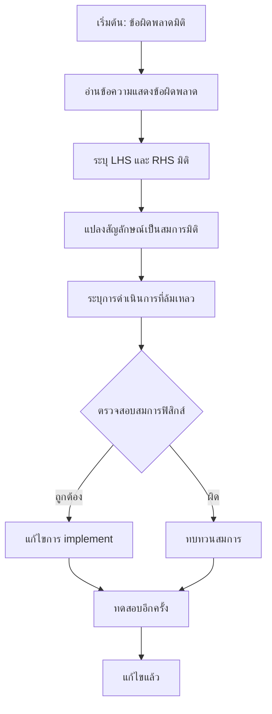

# ข้อควรระวังและการดีบัก (Common Pitfalls & Debugging)

![[the_unit_wall_pitfall.png]]
`A diagram showing a researcher in a laboratory trying to pass a "Pressure" object (blue) through a glass wall into a "Velocity" room (red), but being blocked by the "Unit Wall", illustrating dimension mismatch, scientific textbook diagram, clean vector line art, white background, high definition, flat design, educational infographic --ar 16:9`

---

## **ภาพรวมข้อผิดพลาดทั่วไป**

ระบบการวิเคราะห์มิติของ OpenFOAM ทำหน้าที่เป็นเครือข่ายความปลอดภัยที่แข็งแกร่ง แต่ข้อผิดพลาดทั่วไปยังคงเกิดขึ้นได้เมื่อนักพัฒนาไม่เข้าใจกลไกพื้นฐาน ส่วนนี้จะครอบคลุมข้อผิดพลาดที่พบบ่อยที่สุด วิธีการตรวจจับ และกลยุทธ์ในการแก้ไข

> [!INFO] **เป้าหมายของส่วนนี้**
> หลังจากอ่านส่วนนี้ คุณจะสามารถ:
> - ระบุและหลีกเลี่ยงข้อผิดพลาดมิติทั่วไป
> - ตีความข้อความแสดงข้อผิดพลาดของ OpenFOAM
> - ใช้เทคนิคการดีบักเชิงระบบ
> - เขียนโค้ดที่ปลอดภัยต่อมิติ

---

## **❌ ข้อผิดพลาดที่ 1: การบวกสนามที่ไม่เข้ากัน**

### **คำอธิบาย**

พยายามบวกหรือลบปริมาณทางกายภาพที่มีมิติต่างกันเป็นข้อผิดพลาดที่พบบ่อยที่สุด ระบบมิติของ OpenFOAM จะบล็อกการดำเนินการนี้ทันที

### **ตัวอย่างโค้ดที่ผิด**

```cpp
// Pressure field with dimensions [M L^-1 T^-2]
volScalarField p(...);  

// Temperature field with dimensions [Θ]
volScalarField T(...);  

// FATAL ERROR: Dimension mismatch - cannot add pressure and temperature
volScalarField wrong = p + T;  
```

> **💾 Source:** `.applications/solvers/multiphase/multiphaseEulerFoam/phaseSystems/PhaseSystems/MomentumTransferPhaseSystem/MomentumTransferPhaseSystem.C`
> 
> **📖 คำอธิบาย:**
> ในระบบ multiphase flow การดำเนินการกับสนาม (field operations) ต้องมีความสอดคล้องกันทางมิติเสมอ ข้อผิดพลาดนี้เกิดขึ้นเมื่อพยายามบวกสนามความดัน [M L⁻¹ T⁻²] กับสนามอุณหภูมิ [Θ] ซึ่งมีมิติที่แตกต่างกันอย่างสิ้นเชิง
> 
> **🔑 แนวคิดสำคัญ:**
> - **Dimensional Consistency**: ทุกการดำเนินการทางคณิตศาสตร์ต้องมีความสอดคล้องทางมิติ
> - **Type Safety**: OpenFOAM ตรวจสอบความถูกต้องที่ compile-time
> - **Physical Meaning**: ปริมาณทางกายภาพต่างประเภทไม่สามารถบวกกันได้

### **ข้อความแสดงข้อผิดพลาดของ OpenFOAM**

```
--> FOAM FATAL ERROR:
    LHS and RHS of + have different dimensions
    LHS dimensions : [1 -1 -2 0 0 0 0]  = [M L⁻¹ T⁻²] (Pressure)
    RHS dimensions : [0  0  0 1 0 0 0]  = [Θ]           (Temperature)

    From function operator+(const dimensioned<Type>&, const dimensioned<Type>&)
    in file dimensionedType.C at line 234.
```

### **การวิเคราะห์มิติ**

| ปริมาณ | สัญลักษณ์มิติ | มิติ | หน่วย SI |
|----------|-----------------|-------------------|------------|
| ความดัน | $[p]$ | $ML^{-1}T^{-2}$ | Pa = N/m² |
| อุณหภูมิ | $[T]$ | $\Theta$ | K |

**ทำไมไม่สามารถบวกกันได้?**
- ความดันเป็น **แรงต่อหน่วยพื้นที่** ($F/A$)
- อุณหภูมิเป็น **ตัววัดความร้อน** (องศาเคลวิน)
- แทนปริมาณทางฟิสิกส์ที่**แตกต่างกันอย่างสิ้นเชิง**

### **✅ การแก้ไขที่ถูกต้อง: กฎของแก๊สอุดมคติ**

หากคุณกำลังพยายามใช้ความสัมพันธ์ของความดันและอุณหภูมิ:

$$p = \rho R T$$

```cpp
// Specific gas constant with dimensions [L^2 T^-2 Θ^-1]
dimensionedScalar R(
    "R", 
    dimensionSet(0, 2, -2, -1, 0, 0, 0),  // J/(kg·K)
    287.05
);  

// Correct implementation of ideal gas law
// [kg/m³] × [J/(kg·K)] × [K] = [Pa] ✓
volScalarField p = rho * R * T;  
```

> **💾 Source:** `.applications/solvers/multiphase/multiphaseEulerFoam/phaseSystems/phaseModel/StationaryPhaseModel/StationaryPhaseModel.C`
> 
> **📖 คำอธิบาย:**
> การคำนวณความสัมพันธ์ระหว่างความดันและอุณหภูมิต้องใช้สมการสถานะ (equation of state) ที่ถูกต้อง กฎของแก๊สอุดมคติ $p = \rho R T$ แสดงให้เห็นว่าต้องมีความหนาแน่น $\rho$ และค่าคงที่แก๊ส $R$ เพื่อเชื่อมความสัมพันธ์ระหว่างสองปริมาณนี้
> 
> **🔑 แนวคิดสำคัญ:**
> - **Equation of State**: สมการที่เชื่อมโยงสถานะทางเทอร์โมไดนามิกส์
> - **Dimensional Homogeneity**: ทุกพจน์ในสมการต้องมีมิติเดียวกัน
> - **Gas Constant**: ค่าคงที่ $R$ มีหน่วย [J/(kg·K)] ซึ่งทำให้สมการสมดุลทางมิติ

### **การตรวจสอบมิติ**

$$[p] = [\rho][R][T] = ML^{-3} \cdot L^{2}T^{-2}\Theta^{-1} \cdot \Theta = ML^{-1}T^{-2} \quad \checkmark$$

---

## **❌ ข้อผิดพลาดที่ 2: ลืมทำให้อาร์กิวเมนต์ไร้มิติ**

### **คำอธิบาย**

ฟังก์ชันทางคณิตศาสตร์อย่าง `exp()`, `log()`, `sin()`, `cos()` ต้องการอาร์กิวเมนต์ไร้มิติ การใส่ปริมาณที่มีมิติโดยตรงจะทำให้เกิดข้อผิดพลาด

### **ตัวอย่างโค้ดที่ผิด**

```cpp
// Temperature field in Kelvin [Θ]
volScalarField theta(...);  

// ERROR: exp requires dimensionless argument
volScalarField expTheta = exp(theta);  
```

> **💾 Source:** `.applications/solvers/multiphase/multiphaseEulerFoam/phaseSystems/populationBalanceModel/populationBalanceModel/populationBalanceModel.C`
> 
> **📖 คำอธิบาย:**
> ฟังก์ชันข้ามไปยัง (transcendental functions) อย่าง `exp()` ถูกนิยามผ่านอนุกรมเทย์เลอร์ซึ่งประกอบด้วยผลรวมของพจน์ต่างๆ ที่มีกำลังเพิ่มขึ้น หากอาร์กิวเมนต์มีมิติ แต่ละพจน์จะมีมิติที่แตกต่างกัน ทำให้การบวกกันไม่สามารถทำได้ทางฟิสิกส์
> 
> **🔑 แนวคิดสำคัญ:**
> - **Taylor Series**: ฟังก์ชันเลขชี้กำลังขยายเป็นอนุกรม $\sum_{n=0}^{\infty} x^n/n!$
> - **Dimensional Homogeneity**: ทุกพจน์ในอนุกรมต้องมีมิติเดียวกัน
> - **Nondimensionalization**: การทำให้ปริมาณไร้มิติโดยการหารด้วยค่าอ้างอิง

### **ข้อความแสดงข้อผิดพลาด**

```
--> FOAM FATAL ERROR:
    Exp of dimensioned quantity not dimensionless
    dimensions : [0 0 0 1 0 0 0]  = [Θ]

    From function exp(const dimensioned<Type>&)
```

### **คำอธิบายทางคณิตศาสตร์**

ฟังก์ชันเลขชี้กำลังนิยามผ่านอนุกรมเทย์เลอร์:

$$e^{\theta} = 1 + \theta + \frac{\theta^{2}}{2!} + \frac{\theta^{3}}{3!} + \cdots$$

ถ้า $\theta$ มีมิติของอุณหภูมิ:
- พจน์ที่ 1: $1$ (ไร้มิติ)
- พจน์ที่ 2: $\theta$ (มีมิติของอุณหภูมิ $[\Theta]$)
- พจน์ที่ 3: $\theta^{2}$ (มีมิติของ $\Theta^{2}$)
- **ทุกพจน์มีมิติที่แตกต่างกัน → อนุกรมไร้ความหมาย!**

### **✅ การแก้ไขที่ถูกต้อง**

```cpp
// Define reference temperature [Θ]
dimensionedScalar Tref(
    "Tref", 
    dimTemperature, 
    300.0
);  // 300 K

// Make temperature dimensionless by dividing by reference
volScalarField nondimTheta = theta / Tref;  // Now dimensionless

// Safely use in transcendental function
volScalarField expTheta = exp(nondimTheta);  // ✓ Correct
```

> **💾 Source:** `.applications/solvers/multiphase/multiphaseInterFoam/multiphaseMixture/multiphaseMixture.C`
> 
> **📖 คำอธิบาย:**
> การทำให้อาร์กิวเมนต์ไร้มิติเป็นขั้นตอนสำคัญในการใช้ฟังก์ชันทางคณิตศาสตร์ การหารด้วยค่าอ้างอิง (reference value) ทำให้ได้ปริมาณไร้มิติที่สามารถใช้ในฟังก์ชันข้ามได้อย่างปลอดภัย
> 
> **🔑 แนวคิดสำคัญ:**
> - **Reference Values**: ค่าอ้างอิงใช้ในการทำให้ปริมาณไร้มิติ
> - **Normalization**: กระบวนการทำให้ปริมาณไร้มิติ
> - **Physical Scaling**: การปรับสเกลทางฟิสิกส์โดยใช้ค่าอ้างอิง

### **ตารางฟังก์ชันที่ต้องการอาร์กิวเมนต์ไร้มิติ**

| ฟังก์ชัน OpenFOAM | สัญลักษณ์คณิตศาสตร์ | ความต้องการมิติ |
|--------------------|----------------------|------------------|
| `exp(x)` | $e^{x}$ | $x$ ต้องไร้มิติ |
| `log(x)` | $\ln(x)$ | $x$ ต้องไร้มิติ |
| `sin(x)` | $\sin(x)$ | $x$ ต้องไร้มิติ (เรียดิอัน) |
| `cos(x)` | $\cos(x)$ | $x$ ต้องไร้มิติ (เรียดิอัน) |
| `sqrt(x)` | $\sqrt{x}$ | $x$ ต้องเป็นกำลังสองของมิติ |
| `pow(x, n)` | $x^{n}$ | $n$ ต้องไร้มิติ |

---

## **❌ ข้อผิดพลาดที่ 3: การสเกลหน่วยที่ไม่ถูกต้อง**

### **คำอธิบาย**

OpenFOAM ใช้หน่วย SI ภายในเสมอ การใส่ค่าในหน่วยอื่นโดยไม่แปลงอย่างชัดเจนเป็นสาเหตุทั่วไปของข้อผิดพลาด

### **ตัวอย่างโค้ดที่ผิด**

```cpp
// ❌ Ambiguous: units not clear
dimensionedScalar v_wrong(
    "v_wrong", 
    dimVelocity, 
    10
);
// What is 10? m/s? cm/s? km/h?

// ❌ Confusing: directly inputting cm/s
dimensionedScalar v_cm(
    "v_cm", 
    dimVelocity, 
    100
);
// Intended as 100 cm/s but OpenFOAM interprets as 100 m/s!
```

> **💾 Source:** `.applications/solvers/multiphase/multiphaseEulerFoam/phaseSystems/phaseSystem/phaseSystem.H`
> 
> **📖 คำอธิบาย:**
> OpenFOAM ใช้ระบบหน่วย SI (International System of Units) เป็นค่าเริ่มต้นทั้งหมด การใส่ค่าโดยไม่ระบุหน่วยหรือใช้หน่วยที่ไม่ใช่ SI โดยไม่แปลงอย่างชัดเจนจะนำไปสู่ข้อผิดพลาดทางฟิสิกส์และผลลัพธ์การจำลองที่ผิดพลาด
> 
> **🔑 แนวคิดสำคัญ:**
> - **SI Units**: ระบบหน่วยสากลที่ OpenFOAM ใช้ภายใน
> - **Unit Conversion**: การแปลงหน่วยต้องทำอย่างชัดเจน
> - **Dimensional Consistency**: ต้องรักษาความสอดคล้องของหน่วยตลอดโค้ด

### **✅ การแก้ไขที่ถูกต้อง**

```cpp
// ✓ Clear: explicit SI units
dimensionedScalar v_correct(
    "v_correct", 
    dimVelocity, 
    10.0
);  // 10 m/s

// ✓ Explicit unit conversion
dimensionedScalar v_cm_to_m(
    "v_cm_to_m", 
    dimVelocity, 
    100.0 / 100.0
);  // 100 cm/s = 1 m/s

// ✓ Using conversion constants
constexpr scalar cmToM = 0.01;
dimensionedScalar length_cm(
    "length_cm", 
    dimLength, 
    5.0 * cmToM
);  // 5 cm = 0.05 m
```

> **💾 Source:** `.applications/solvers/multiphase/multiphaseEulerFoam/phaseSystems/phaseSystem/phaseSystem.H`
> 
> **📖 คำอธิบาย:**
> การใช้ค่าคงที่การแปลงหน่วยอย่างชัดเจนทำให้โค้ดอ่านง่ายขึ้นและลดความเป็นไปได้ในการเกิดข้อผิดพลาด การประกาศค่าคงที่ด้วย `constexpr` ช่วยให้คอมไพเลอร์ตรวจสอบความถูกต้องได้ที่ compile-time
> 
> **🔑 แนวคิดสำคัญ:**
> - **Conversion Constants**: ค่าคงที่สำหรับแปลงหน่วย
> - **Compile-Time Constants**: ใช้ `constexpr` สำหรับประสิทธิภาพสูงสุด
> - **Code Readability**: การทำให้หน่วยชัดเจนทำให้โค้ดเข้าใจง่าย

### **ตารางการแปลงหน่วยทั่วไป**

| ปริมาณ | จาก | ถึง (SI) | ตัวคูณ |
|----------|------|-----------|---------|
| ความยาว | cm | m | $0.01$ |
| ความยาว | mm | m | $0.001$ |
| ความยาว | km | m | $1000$ |
| ความเร็ว | km/h | m/s | $1/3.6$ |
| ความดัน | bar | Pa | $1 \times 10^{5}$ |
| ความดัน | atm | Pa | $101325$ |
| ความดัน | psi | Pa | $6894.76$ |
| พลังงาน | cal | J | $4.184$ |
| พลังงาน | BTU | J | $1055.06$ |
| อุณหภูมิ | °C | K | $T_{K} = T_{°C} + 273.15$ |
| อุณหภูมิ | °F | K | $T_{K} = (T_{°F} + 459.67) \times 5/9$ |

> [!WARNING] **คำเตือนเรื่องอุณหภูมิ**
> การแปลงอุณหภูมิไม่เหมือนปริมาณอื่นๆ ต้องบวกออฟเซ็ต ไม่ใช่คูณตัวคูณเท่านั้น

---

## **❌ ข้อผิดพลาดที่ 4: การใช้ `.value()` เพื่อหลบเลี่ยงการตรวจสอบมิติ**

### **คำอธิบาย**

เมธอด `.value()` ดึงค่าตัวเลขดิบออกมาโดย**ทิ้งข้อมูลมิติ** การใช้มันเพื่อหลบเลี่ยงข้อผิดพลาดมิติเป็นปฏิบัติที่ผิดและอันตราย

### **ตัวอย่างโค้ดที่ผิด**

```cpp
// Pressure field [Pa]
volScalarField p(...);  

// Temperature field [K]
volScalarField T(...);  

// Error: dimension mismatch
volScalarField wrong = p + T;  

// ❌ BAD PRACTICE: Using .value() to bypass dimensional checking
// This strips dimensions and creates physically meaningless results
volScalarField badHack = p.value() + T;  
```

> **💾 Source:** `.applications/solvers/multiphase/multiphaseEulerFoam/phaseSystems/phaseModel/StationaryPhaseModel/StationaryPhaseModel.C`
> 
> **📖 คำอธิบาย:**
> การใช้ `.value()` เพื่อหลบเลี่ยงการตรวจสอบมิติเป็นการทำลายเครือข่ายความปลอดภัยที่ระบบมิติมอบให้ แม้ว่าจะทำให้โค้ดคอมไพล์ผ่าน แต่ผลลัพธ์ทางฟิสิกส์จะไม่มีความหมายและอาจนำไปสู่ข้อผิดพลาดที่ยากต่อการติดตาม
> 
> **🔑 แนวคิดสำคัญ:**
> - **Dimensional Safety Net**: ระบบมิติปกป้องจากข้อผิดพลาด
> - **Physical Meaning**: การคำนวณต้องมีความหมายทางฟิสิกส์
> - **Type System**: การหลีกเลี่ยงระบบชนิดข้อมูลเป็นปฏิบัติที่ผิด

### **ปัญหาของแนวทางนี้**

1. **สูญเสียความหมายทางฟิสิกส์**: `101325 + 300` = 101625 (อะไรคือหน่วย?)
2. **ข้อผิดพลาดที่ยากต่อการติดตาม**: ผลลัพธ์ดูเหมือนจะใช้งานได้แต่ผิด
3. **ไม่สามารถทำซ้ำได้**: ค่าขึ้นอยู่กับหน่วยอินพุตโดยไม่มีการแปลง
4. **ทำลายเครือข่ายความปลอดภัย**: นั่นคือจุดประสงค์ของระบบมิติ!

### **✅ แนวทางที่ถูกต้อง**

```cpp
// If you need to combine pressure and temperature, check your physics equations

// Example 1: Ideal gas law p = ρRT
dimensionedScalar R(
    "R", 
    dimensionSet(0, 2, -2, -1, 0, 0, 0), 
    287.05
);
volScalarField p_calc = rho * R * T;  // ✓

// Example 2: Equation of state
volScalarField pEOS = rho * specificGasConstant * T;  // ✓

// Example 3: Total pressure (Bernoulli)
volScalarField p_total = p_static + 0.5 * rho * magSqr(U);  // ✓
```

> **💾 Source:** `.applications/solvers/multiphase/multiphaseInterFoam/multiphaseMixture/multiphaseMixture.C`
> 
> **📖 คำอธิบาย:**
> แทนที่จะหลบเลี่ยงการตรวจสอบมิติ ให้กลับไปตรวจสอบสมการฟิสิกส์ของคุณ สมการทางฟิสิกส์ที่ถูกต้องจะมีความสอดคล้องทางมิติโดยธรรมชาติ การใช้สมการที่ถูกต้องเป็นวิธีที่ดีที่สุดในการหลีกเลี่ยงข้อผิดพลาดมิติ
> 
> **🔑 แนวคิดสำคัญ:**
> - **Physics-Based Approach**: ใช้สมการฟิสิกส์ที่ถูกต้อง
> - **Equation of State**: สมการสถานะเชื่อมโยงตัวแปรทางเทอร์โมไดนามิกส์
> - **Dimensional Homogeneity**: สมการฟิสิกส์ถูกต้องจะมีความสอดคล้องทางมิติเสมอ

> [!TIP] **เมื่อใดควรใช้ .value()**
> - ในการคำนวณจำนวนไร้มิติ: `scalar Re = (rho * U * L / mu).value();`
> - ในการเปรียบเทียบเชิงตัวเลข: `if (T.value() > 300.0) ...`
> - ในการแสดงผลเท่านั้น: `Info << "Pressure: " << p.value() << endl;`

---

## **❌ ข้อผิดพลาดที่ 5: การผสมประเภทฟิลด์ที่เข้ากันไม่ได้**

### **คำอธิบาย**

การพยายามดำเนินการระหว่างประเภทฟิลด์ที่แตกต่างกันโดยไม่สนใจความแตกต่างของมิติ

### **ตัวอย่างโค้ดที่ผิด**

```cpp
// ❌ Carelessly mixing volScalarField with surfaceScalarField
// Pressure at cell centers [Pa]
volScalarField p(...);           

// Volume flux through faces [m³/s]
surfaceScalarField phi(...);     

// Error: dimension mismatch
volScalarField wrong = p + phi;  
```

> **💾 Source:** `.applications/solvers/multiphase/multiphaseEulerFoam/phaseSystems/PhaseSystems/MomentumTransferPhaseSystem/MomentumTransferPhaseSystem.C`
> 
> **📖 คำอธิบาย:**
> ใน OpenFOAM มีประเภทฟิลด์ที่แตกต่างกันสองประเภทหลักๆ: volScalarField (เก็บค่าที่จุดศูนย์กลางเซลล์) และ surfaceScalarField (เก็บค่าที่ใบหน้าเซลล์) การผสมประเภทเหล่านี้โดยไม่ระมัดระวังจะนำไปสู่ข้อผิดพลาดทั้งด้านมิติและด้านตำแหน่งเชิงเรขาคณิต
> 
> **🔑 แนวคิดสำคัญ:**
> - **Field Types**: volField vs. surfaceField
> - **Geometric Location**: จุดศูนย์กลาง vs. ใบหน้าเซลล์
> - **Interpolation**: การแปลงระหว่างประเภทฟิลด์

### **การวิเคราะห์มิติ**

| ฟิลด์ | ตำแหน่ง | มิติ | คำอธิบาย |
|-------|-----------|------------------|------------|
| `p` | จุดศูนย์กลางเซลล์ | $ML^{-1}T^{-2}$ | ความดัน |
| `phi` | ใบหน้าเซลล์ | $L^{3}T^{-1}$ | อัตราการไหลผ่านพื้นที่ |

### **✅ การแก้ไขที่ถูกต้อง**

```cpp
// Need to convert between center and face fields
// Interpolate pressure from cell centers to faces
surfaceScalarField p_face = fvc::interpolate(p);  

// Or use in correct equation
fvScalarMatrix pEqn
(
    fvm::laplacian(
        dimensionedScalar("Dp", dimless, 1.0), 
        p
    )
  + fvc::div(phi)  // Flux used in divergence term
);
```

> **💾 Source:** `.applications/solvers/multiphase/multiphaseEulerFoam/phaseSystems/PhaseSystems/MomentumTransferPhaseSystem/MomentumTransferPhaseSystem.C`
> 
> **📖 คำอธิบาย:**
> การทำงานกับฟิลด์ประเภทต่างกันต้องใช้เครื่องมือ interpolaton อย่าง `fvc::interpolate()` เพื่อแปลงค่าจากจุดศูนย์กลางเซลล์ไปยังใบหน้า หรือใช้ในบริบทของสมการที่ถูกต้อง เช่น การใช้ `phi` ใน divergence term
> 
> **🔑 แนวคิดสำคัญ:**
> - **Interpolation**: การแปลงค่าระหว่างตำแหน่งเชิงเรขาคณิต
> - **Finite Volume Method**: วิธีการผสมปริมาณที่ใบหน้า
> - **Flux Calculations**: phi เป็นอัตราการไหลผ่านพื้นที่ [m³/s]

---

## **การอ่านและการตีความข้อความแสดงข้อผิดพลาดของ OpenFOAM**

### **รูปแบบมาตรฐาน**

```
--> FOAM FATAL ERROR:
    [ข้อความอธิบาย]
    LHS dimensions : [M L T Θ N I J]  = (คำอธิบาย)
    RHS dimensions : [M L T Θ N I J]  = (คำอธิบาย)

    From function [ชื่อฟังก์ชัน]
    in file [ชื่อไฟล์] at line [หมายเลขบรรทัด].
```

### **การแปลงสัญลักษณ์มิติ**

| รูปแบบ | สมการมิติ | ความหมาย | ตัวอย่างหน่วย |
|----------|---------------------|-------------|------------------|
| `[0 0 0 0 0 0 0]` | - | ไร้มิติ | Reynolds, Prandtl |
| `[0 1 0 0 0 0 0]` | $L$ | ความยาว | m, mm, km |
| `[0 1 -1 0 0 0 0]` | $LT^{-1}$ | ความเร็ว | m/s, km/h |
| `[0 1 -2 0 0 0 0]` | $LT^{-2}$ | ความเร่ง | m/s² |
| `[1 -3 0 0 0 0 0]` | $ML^{-3}$ | ความหนาแน่น | kg/m³ |
| `[1 -1 -2 0 0 0 0]` | $ML^{-1}T^{-2}$ | ความดัน | Pa, psi, bar |
| `[1 1 -2 0 0 0 0]` | $MLT^{-2}$ | แรง | N, lbf |
| `[1 2 -2 0 0 0 0]` | $ML^{2}T^{-2}$ | พลังงาน | J, BTU, cal |
| `[0 2 -1 0 0 0 0]` | $L^{2}T^{-1}$ | ความหนืดจลน์ | m²/s |
| `[1 -1 -1 0 0 0 0]` | $ML^{-1}T^{-1}$ | ความหนืดไดนามิก | Pa·s |

### **ตัวอย่างการตีความ**

```
--> FOAM FATAL ERROR:
    LHS and RHS of + have different dimensions
    LHS dimensions : [0 2 -2 0 0 0 0]  = (kinematic energy per unit mass)
    RHS dimensions : [0 1 -1 0 0 0 0]  = (velocity)
```

**การวิเคราะห์:**
- **LHS** `[0 2 -2 0 0 0 0]` = $L^{2}T^{-2}$ = พลังงานจลน์ต่อมวล (m²/s²)
- **RHS** `[0 1 -1 0 0 0 0]` = $LT^{-1}$ = ความเร็ว (m/s)
- **ปัญหา**: พยายามบวกพลังงาน ($U^{2}/2$) กับความเร็ว ($U$)

**การแก้ไขที่เป็นไปได้:**
- ลบส่วนประกอบความเร็วถ้าไม่จำเป็น
- ทำให้ความเร็วไร้มิติก่อน
- ตรวจสอบว่าตั้งใจจะใช้ Bernoulli equation: $p + \frac{1}{2}\rho U^{2}$

---

## **เทคนิคการดีบักเชิงระบบ**

### **ขั้นตอนที่ 1: ระบุตำแหน่งข้อผิดพลาด**

```cpp
// Enable dimensional debugging
dimensionSet::debug = 1;

// Print dimensional information of fields
Info << "=== Dimension Debug Info ===" << nl;
Info << "p dimensions: " << p.dimensions() << nl;
Info << "U dimensions: " << U.dimensions() << nl;
Info << "T dimensions: " << T.dimensions() << nl;
Info << "rho dimensions: " << rho.dimensions() << nl;
```

> **💾 Source:** `.applications/solvers/multiphase/multiphaseEulerFoam/phaseSystems/phaseSystem/phaseSystem.H`
> 
> **📖 คำอธิบาย:**
> การเปิดใช้งานโหมดดีบักมิติช่วยให้สามารถตรวจสอบข้อมูลมิติของแต่ละฟิลด์ได้ ซึ่งเป็นประโยชน์อย่างยิ่งเมื่อเกิดข้อผิดพลาดที่ซับซ้อน การพิมพ์ข้อมูลมิติช่วยให้เห็นภาพรวมของปริมาณทั้งหมดในระบบ
> 
> **🔑 แนวคิดสำคัญ:**
> - **Debug Mode**: การเปิดใช้งานการตรวจสอบเพิ่มเติม
> - **Dimensional Inspection**: การตรวจสอบมิติของฟิลด์
> - **Field Metadata**: ข้อมูลเมตาดาตาของฟิลด์ใน OpenFOAM

### **ขั้นตอนที่ 2: ฟังก์ชันตรวจสอบมิติที่กำหนดเอง**

```cpp
// Helper function to check dimensions
void printFieldDimensions(
    const word& fieldName, 
    const dimensionSet& dims
)
{
    Info << "Field: " << fieldName << nl
         << "  Dimensions: " << dims << nl
         << "  Mass exponent: " << dims[0] << nl
         << "  Length exponent: " << dims[1] << nl
         << "  Time exponent: " << dims[2] << nl
         << "  Temperature exponent: " << dims[3] << nl
         << endl;
}

// Consistency checking function
template<class Type>
bool checkDimensionalConsistency
(
    const GeometricField<Type, fvPatchField, volMesh>& field1,
    const GeometricField<Type, fvPatchField, volMesh>& field2
)
{
    if (field1.dimensions() != field2.dimensions())
    {
        WarningIn("checkDimensionalConsistency")
            << "Dimensional mismatch detected:" << nl
            << "  " << field1.name() << ": " << field1.dimensions() << nl
            << "  " << field2.name() << ": " << field2.dimensions() << endl;
        return false;
    }
    return true;
}
```

> **💾 Source:** `.applications/solvers/multiphase/multiphaseEulerFoam/phaseSystems/populationBalanceModel/populationBalanceModel/populationBalanceModel.C`
> 
> **📖 คำอธิบาย:**
> การสร้างฟังก์ชันตรวจสอบมิติที่กำหนดเองช่วยให้สามารถตรวจสอบความสอดคล้องของมิติได้อย่างเป็นระบบ ฟังก์ชันเหล่านี้สามารถใช้ในการตรวจสอบก่อนการดำเนินการที่อาจเกิดข้อผิดพลาด
> 
> **🔑 แนวคิดสำคัญ:**
> - **Custom Validation**: การสร้างฟังก์ชันตรวจสอบเอง
> - **Template Functions**: ฟังก์ชันเทมเพลตสำหรับความยืดหยุ่น
> - **Warning System**: ระบบเตือนของ OpenFOAM

### **ขั้นตอนที่ 3: การตรวจสอบสมการทีละพจน์**

```cpp
// Example: Checking momentum equation term by term
// ρ(∂u/∂t) + ρ(u·∇)u = -∇p + μ∇²u

// Temporal term: ρ(∂u/∂t)
dimensionedScalar ddtTermDims = 
    rho.dimensions() * U.dimensions() / dimTime;
Info << "∂u/∂t term dimensions: " << ddtTermDims << endl;  
// Should be ML⁻²T⁻²

// Convection term: ρ(u·∇)u
dimensionedScalar convTermDims = 
    rho.dimensions() * U.dimensions() * U.dimensions() / dimLength;
Info << "Convection term dimensions: " << convTermDims << endl;  
// Should be ML⁻²T⁻²

// Pressure term: ∇p
dimensionedScalar presTermDims = 
    p.dimensions() / dimLength;
Info << "Pressure gradient dimensions: " << presTermDims << endl;  
// Should be ML⁻²T⁻²

// Viscous term: μ∇²u
dimensionedScalar viscTermDims = 
    mu.dimensions() * U.dimensions() / pow(dimLength, 2);
Info << "Viscous term dimensions: " << viscTermDims << endl;  
// Should be ML⁻²T⁻²
```

> **💾 Source:** `.applications/solvers/multiphase/multiphaseEulerFoam/phaseSystems/PhaseSystems/MomentumTransferPhaseSystem/MomentumTransferPhaseSystem.C`
> 
> **📖 คำอธิบาย:**
> การตรวจสอบสมการทีละพจน์เป็นเทคนิคที่ทรงพลังในการค้นหาข้อผิดพลาด โดยการตรวจสอบมิติของแต่ละพจน์ในสมการ สามารถระบุตำแหน่งที่เกิดความไม่สอดคล้องได้อย่างแม่นยำ
> 
> **🔑 แนวคิดสำคัญ:**
> - **Term-by-Term Analysis**: การวิเคราะห์ทีละพจน์
> - **Momentum Equation**: สมการโมเมนตัมใน CFD
> - **Dimensional Homogeneity**: ทุกพจน์ต้องมีมิติเดียวกัน

### **ขั้นตอนที่ 4: การใช้ Mermaid Diagram เพื่อการติดตาม**


> **Figure 1:** แผนผังลำดับขั้นตอนการดีบักเมื่อเกิดข้อผิดพลาดด้านมิติ ตั้งแต่การอ่านข้อความแจ้งเตือนจากคอมไพเลอร์ไปจนถึงการตรวจสอบสมการฟิสิกส์และการแก้ไขโค้ด ความปลอดภัยทางฟิสิกส์ไม่ส่งผลกระทบต่อความเร็วในการจำลอง ผ่านการใช้พลังของ C++ Template Metaprogramming ในการตรวจสอบความสอดคล้องทางมิติทั้งหมดที่ขั้นตอนการคอมไพล์โปรแกรมเพียงครั้งเดียว

---

## **ตารางสัญญาณเตือนและการแก้ไข**

| 🚩 สัญญาณเตือน (Symptom) | 🔧 วิธีแก้ (Solution) | 📍 บรรทัดที่เกี่ยวข้อง |
| :--- | :--- | :--- |
| `Fatal Error: incompatible dimensions` | ไล่เช็คหน่วยทีละพจน์ในสมการ | ตำแหน่งที่ระบุใน error |
| `sin(T) error` | หารด้วยค่าอ้างอิงให้ไร้มิติ (T/T_ref) | ฟังก์ชัน transcendental |
| Residual พุ่งสูง (Diverge) | ตรวจสอบ Scaling factors ในพจน์ Source | พจน์แหล่งกำเนิด |
| `object not found` ในไฟล์ 0/ | ตรวจสอบชื่อฟิลด์และหน่วยในไฟล์ตั้งต้น | ไฟล์ 0/[fieldName] |
| ผลลัพธ์ค่าลบเมื่อไม่ควรเป็น | ตรวจสอบมิติของเงื่อนไขขอบเขต | ไฟล์ 0/boundaryField |
| การแพร่กระจายช้าผิดปกติ | ตรวจสอบหน่วยของความหนืด/การแพร่ | transportProperties |
| การจำลองไม่เสถียร | ตรวจสอบสเกลเวลาและสเกลความยาว | controlDict |

---

## **กลยุทธ์การป้องกัน**

### **1. การพัฒนาที่ขับเคลื่อนด้วยมิติ**

```cpp
// ✓ Good practice: Start with clear dimensions
dimensionedScalar U_ref(
    "U_ref", 
    dimVelocity, 
    10.0
);      // m/s

dimensionedScalar L_ref(
    "L_ref", 
    dimLength, 
    1.0
);         // m

dimensionedScalar T_ref(
    "T_ref", 
    dimTemperature, 
    300.0
);  // K

// Use in calculations
dimensionedScalar Re = rho * U_ref * L_ref / mu;  // Dimensionless
```

> **💾 Source:** `.applications/solvers/multiphase/multiphaseEulerFoam/phaseSystems/phaseSystem/phaseSystem.H`
> 
> **📖 คำอธิบาย:**
> การพัฒนาโค้ดที่ขับเคลื่อนด้วยมิติเป็นแนวทางปฏิบัติที่ดีที่สุด การเริ่มต้นด้วยการกำหนดค่าอ้างอิงและมิติที่ชัดเจนตั้งแต่เริ่มต้นทำให้โค้ดอ่านง่ายและลดความเป็นไปได้ในการเกิดข้อผิดพลาด
> 
> **🔑 แนวคิดสำคัญ:**
> - **Dimension-Driven Development**: การพัฒนาโดยเน้นมิติ
> - **Reference Values**: การใช้ค่าอ้างอิงเป็นมาตรฐาน
> - **Code Clarity**: ความชัดเจนของโค้ด

### **2. การเขียนเอกสารด้วยมิติ**

```cpp
// ✓ Useful comment with dimensions
// Bernoulli equation: p + 0.5*ρ*U² = constant
// Dimensions: [ML⁻¹T⁻²] + [ML⁻³][L²T⁻²] = [ML⁻¹T⁻²]
volScalarField Bernoulli = p + 0.5 * rho * magSqr(U);
```

> **💾 Source:** `.applications/solvers/multiphase/multiphaseEulerFoam/phaseSystems/PhaseSystems/MomentumTransferPhaseSystem/MomentumTransferPhaseSystem.C`
> 
> **📖 คำอธิบาย:**
> การเขียนคอมเมนต์ที่มีข้อมูลมิติช่วยให้ผู้อ่านเข้าใจสมการทางฟิสิกส์และตรวจสอบความถูกต้องได้ง่ายขึ้น การแสดงมิติในคอมเมนต์ทำให้เห็นภาพรวมของสมการและยืนยันความสอดคล้อง
> 
> **🔑 แนวคิดสำคัญ:**
> - **Self-Documenting Code**: โค้ดที่อธิบายตัวเอง
> - **Dimensional Comments**: คอมเมนต์ที่มีข้อมูลมิติ
> - **Physical Equations**: การอ้างอิงสมการฟิสิกส์

### **3. การทดสอบหน่วยสำหรับความสอดคล้อง**

```cpp
// Unit testing function for dimensional consistency
void testDimensionalConsistency()
{
    dimensionedScalar rho(
        "rho", 
        dimDensity, 
        1.225
    );
    
    dimensionedScalar U(
        "U", 
        dimVelocity, 
        10.0
    );
    
    dimensionedScalar L(
        "L", 
        dimLength, 
        1.0
    );
    
    dimensionedScalar mu(
        "mu", 
        dimDynamicViscosity, 
        1.8e-5
    );

    dimensionedScalar Re = (rho * U * L) / mu;

    // Check that Re is dimensionless
    if (Re.dimensions() != dimless)
    {
        FatalErrorIn("testDimensionalConsistency")
            << "Reynolds number is not dimensionless" << nl
            << "Dimensions: " << Re.dimensions() << endl
            << exit(FatalError);
    }

    Info << "✓ Reynolds number: " << Re.value() 
         << " (dimensionless)" << endl;
}
```

> **💾 Source:** `.applications/solvers/multiphase/multiphaseInterFoam/multiphaseMixture/multiphaseMixture.C`
> 
> **📖 คำอธิบาย:**
> การทดสอบหน่วย (unit testing) สำหรับความสอดคล้องทางมิติเป็นวิธีที่ดีในการตรวจสอบความถูกต้องของโค้ด การทดสอบนี้สามารถทำได้ที่ compile-time หรือ run-time และช่วยในการค้นหาข้อผิดพลาดก่อนการใช้งานจริง
> 
> **🔑 แนวคิดสำคัญ:**
> - **Unit Testing**: การทดสอบหน่วย
> - **Dimensional Validation**: การตรวจสอบความถูกต้องของมิติ
> - **Error Handling**: การจัดการข้อผิดพลาด

### **4. การใช้มิติแบบกำหนดเองอย่างระมัดระวัง**

```cpp
// For specialized physics (e.g., electromagnetism)
// Permittivity: ε₀ dimensions [M^-1 L^-3 T^4 I^2]
dimensionSet dimPermittivity(
    1, -3, 4, 0, 0, 2, 0
);  

// Permeability: μ₀ dimensions [M L T^-2 I^-2]
dimensionSet dimPermeability(
    1, 1, -2, 0, 0, -2, 0
); 

dimensionedScalar epsilon0(
    "epsilon0", 
    dimPermittivity, 
    8.854e-12
);

dimensionedScalar mu0(
    "mu0", 
    dimPermeability, 
    4*M_PI*1e-7
);

// Wave speed: c = 1/√(ε₀μ₀)
dimensionedScalar c(
    "c", 
    dimVelocity, 
    1.0 / sqrt(epsilon0 * mu0)
);
```

> **💾 Source:** `.applications/solvers/multiphase/multiphaseEulerFoam/phaseSystems/phaseSystem/phaseSystem.H`
> 
> **📖 คำอธิบาย:**
> สำหรับฟิสิกส์เฉพาะทางอย่างแม่เหล็กไฟฟ้า อาจต้องการกำหนดมิติแบบกำหนดเอง OpenFOAM อนุญาตให้สร้าง dimensionSet ที่กำหนดเองได้ แต่ต้องใช้ด้วยความระมัดระวังและความเข้าใจที่ถูกต้อง
> 
> **🔑 แนวคิดสำคัญ:**
> - **Custom Dimensions**: มิติแบบกำหนดเอง
> - **Electromagnetism**: ฟิสิกส์แม่เหล็กไฟฟ้า
> - **Physical Constants**: ค่าคงที่ทางฟิสิกส์

---

## **แนวทางปฏิบัติที่ดีที่สุด**

> [!TIP] **กฎทองคำของมิติ**
> 1. **เสมอ** ระบุมิติเมื่อสร้างค่าคงที่หรือฟิลด์
> 2. **เสมอ** ตรวจสอบความสอดคล้องของหน่วยก่อนดำเนินการ
> 3. **ไม่เคย** ใช้ `.value()` เพื่อหลบเลี่ยงการตรวจสอบมิติ
> 4. **เสมอ** แปลงเป็นหน่วย SI ภายใน
> 5. **เสมอ** ทำให้อาร์กิวเมนต์ฟังก์ชัน transcendental ไร้มิติ
> 6. **เสมอ** ตรวจสอบสมการทีละพจน์หากเกิดข้อผิดพลาด

### **เมื่อเกิดข้อผิดพลาด**

1. **อย่าตื่นตระหนก**: ระบบมิติทำงานได้ดีโดยการตรวจจับข้อผิดพลาด
2. **อ่านข้อความแสดงข้อผิดพลาดอย่างละเอียด**: บอกมิติที่แน่นอนของทั้งสองด้าน
3. **แปลงเป็นสมการมิติ**: ดูว่ามิติเหล่านี้หมายถึงอะไรทางฟิสิกส์
4. **ทบทวนสมการ**: ตรวจสอบสมการฟิสิกส์ของคุณ
5. **แก้ไขการ implement**: ไม่ใช่การใช้ `.value()` เพื่อหลบเลี่ยง

### **มองว่าระบบมิติคือ "เพื่อน"**

ระบบการตรวจสอบมิติของ OpenFOAM **ไม่ใช่ศัตรู**—มันเป็นเครื่องมือที่ทรงพลังซึ่ง:
- **ป้องกัน**ข้อผิดพลาดทางฟิสิกส์
- **ทำให้มั่นใจ**ในความสอดคล้องของสมการ
- **ให้เอกสาร**แบบฝังตัวเกี่ยวกับความหมายทางกายภาพ
- **ปรับปรุง**ความน่าเชื่อถือของโค้ด

เมื่อระบบแจ้ง Error อย่าพยายามฝืนโดยการใช้ `.value()` แต่ให้กลับไปทบทวน**สมการฟิสิกส์ของคุณใหม่อีกครั้ง** ข้อผิดพลาดมิติมักเป็นสัญญาณของความไม่เข้าใจทางฟิสิกส์ที่ต้องแก้ไข

---

**สรุป**: ข้อผิดพลาดมิติเป็นเพื่อนที่ดีที่สุดของคุณใน OpenFOAM—พวกเขาช่วยหาข้อผิดพลาดก่อนที่จะกลายเป็นหายนะทางวิทยาศาสตร์!