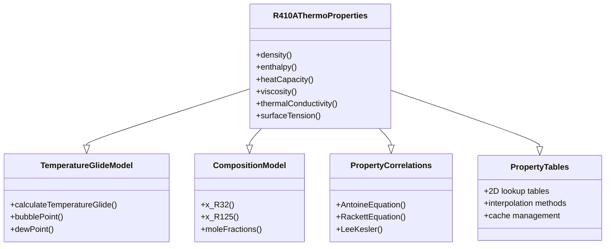

# R410A Thermophysical Properties Properties (คุณสมบัติทามโดไดนามิก R410A)

## Introduction (บทนำ)

Accurate thermophysical properties are essential for R410A simulations. This document presents comprehensive property implementations including density, enthalpy, heat capacity, viscosity, and thermal conductivity with temperature glide corrections for zeotropic mixtures.

### ⭐ R410A Property Framework

The R410A property framework hierarchy:



## Density Properties (คุณสมบัติความหนาแน่น)

### 1. Liquid Density (ความหนาแน่นของของเหลว)

```cpp
// File: R410ADensity.H
class R410ADensity
{
private:
    // Rackett equation parameters
    dimensionedScalar T_critical_;
    dimensionedScalar p_critical_;
    dimensionedScalar Z_Rackett_;
    dimensionedScalar omega_;

    // Mixture parameters
    dimensionedScalar x_R32_;
    dimensionedScalar x_R125_;
    dimensionedScalar M_mixture_;

    // Liquid density correlation parameters
    dimensionedScalar A_;
    dimensionedScalar B_;
    dimensionedScalar C_;

public:
    // Constructor
    R410ADensity(const dictionary& dict);

    // Density calculation methods
    scalar liquidDensity(scalar T, scalar p) const;
    scalar vaporDensity(scalar T, scalar p) const;
    scalar mixtureDensity(scalar T, scalar p, scalar quality) const;

    // Temperature-dependent density
    scalar liquidDensityTempDependent(scalar T) const;
    scalar vaporDensityTempDependent(scalar T) const;

    // Pressure-dependent density
    scalar liquidDensityPressDependent(scalar p) const;
    scalar vaporDensityPressDependent(scalar p) const;

    // Mixture properties
    scalar mixtureDensityFromQuality(scalar T, scalar p, scalar x) const;

    // Table generation
    void generateDensityTables();
    scalar tableLookupLiquid(scalar T, scalar p) const;
    scalar tableLookupVapor(scalar T, scalar p) const;

    // Verification
    void verifyDensityLimits();
};
```

### 2. Implementation (การนำไปใช้งาน)

```cpp
// File: R410ADensity.C
#include "R410ADensity.H"

// * * * * * * * * * * * * * * * * * * * * * * * * * * * * * * * * * * * * * //

namespace Foam
{
    // Constructor
    R410ADensity::R410ADensity(const dictionary& dict)
    :
        T_critical_(dict.lookupOrDefault<scalar>("T_critical", 345.25)),
        p_critical_(dict.lookupOrDefault<scalar>("p_critical", 4.89e6)),
        Z_Rackett_(dict.lookupOrDefault<scalar>("Z_Rackett", 0.27)),
        omega_(dict.lookupOrDefault<scalar>("omega", 0.250)),
        x_R32_(dict.lookupOrDefault<scalar>("x_R32", 0.5)),
        x_R125_(dict.lookupOrDefault<scalar>("x_R125", 0.5)),
        M_mixture_(dict.lookupOrDefault<scalar>("M_mixture", 0.09479)),
        A_(dict.lookupOrDefault<scalar>("A_liquid", 1200.0)),
        B_(dict.lookupOrDefault<scalar>("B_liquid", -0.5)),
        C_(dict.lookupOrDefault<scalar>("C_liquid", 0.0))
    {}

    // Liquid density using Rackett equation
    scalar R410ADensity::liquidDensity(scalar T, scalar p) const
    {
        // Reduced temperature
        scalar Tr = T / T_critical_;

        // Rackett equation for liquid density
        scalar Z = Z_Rackett_ * (1.0 + (1.0 - Tr) * (pow(Z_Rackett_, 0.5) - 1.0));

        // Molar volume
        scalar V_molar = Z * R_gas_ * T / p;

        // Molar mass mixture
        scalar rho = M_mixture_ / V_molar;

        // Temperature correction
        scalar T_corr = 1.0 + B_ * (T - 273.15) / 273.15;

        return rho * T_corr;
    }

    // Vapor density using ideal gas law with corrections
    scalar R410ADensity::vaporDensity(scalar T, scalar p) const
    {
        // Ideal gas density
        scalar rho_ideal = p * M_mixture_ / (R_gas_ * T);

        // Non-ideal gas correction (simplified)
        scalar Tr = T / T_critical_;
        scalar pr = p / p_critical_;

        // Virial equation of state (first order)
        scalar B = omega_ * R_gas_ * T_critical_ / p_critical_;
        scalar rho_corrected = rho_ideal / (1.0 + B * rho_ideal);

        return rho_corrected;
    }

    // Mixture density from quality
    scalar R410ADensity::mixtureDensity(scalar T, scalar p, scalar quality) const
    {
        // Phase densities
        scalar rho_l = liquidDensity(T, p);
        scalar rho_v = vaporDensity(T, p);

        // Two-phase mixture density
        scalar rho = 1.0 / (quality / rho_v + (1.0 - quality) / rho_l);

        return rho;
    }

    // Temperature-dependent liquid density
    scalar R410ADensity::liquidDensityTempDependent(scalar T) const
    {
        // Polynomial correlation
        scalar T_C = T - 273.15;
        scalar rho = A_ + B_ * T_C + C_ * T_C * T_C;

        // Ensure physical bounds
        rho = max(800.0, min(1400.0, rho));  // Reasonable bounds for R410A

        return rho;
    }

    // Temperature-dependent vapor density
    scalar R410ADensity::vaporDensityTempDependent(scalar T) const
    {
        // Ideal gas with temperature correction
        scalar rho = p_critical_ * M_mixture_ / (R_gas_ * T);

        // Temperature correction for real gas
        scalar Tr = T / T_critical_;
        scalar correction = 1.0 - 0.1 * (1.0 - Tr);

        return rho * correction;
    }
}
```

## Enthalpy Properties (คุณสมบัติเอ็นทัลปี)

### 1. Enthalpy Calculation

```cpp
// File: R410AEnthalpy.H
class R410AEnthalpy
{
private:
    // Reference states
    dimensionedScalar T_ref_;
    dimensionedScalar h_ref_;

    // Liquid enthalpy parameters
    dimensionedScalar cp_l_;
    dimensionedScalar a_l_;
    dimensionedScalar b_l_;
    dimensionedScalar c_l_;

    // Vapor enthalpy parameters
    dimensionedScalar cp_v_;
    dimensionedScalar a_v_;
    dimensionedScalar b_v_;
    dimensionedScalar c_v_;

    // Latent heat parameters
    dimensionedScalar L_ref_;
    dimensionedScalar dL_dT_;

    // Temperature glide parameters
    dimensionedScalar T_glide_min_;
    dimensionedScalar T_glide_max_;

public:
    // Constructor
    R410AEnthalpy(const dictionary& dict);

    // Enthalpy calculation methods
    scalar liquidEnthalpy(scalar T, scalar p) const;
    scalar vaporEnthalpy(scalar T, scalar p) const;
    scalar mixtureEnthalpy(scalar T, scalar p, scalar quality) const;
    scalar latentHeat(scalar T, scalar p) const;

    // Temperature glide corrections
    scalar enthalpyWithGlide(scalar T, scalar p, scalar quality) const;
    scalar bubblePointEnthalpy(scalar p) const;
    scalar dewPointEnthalpy(scalar p) const;

    // Saturation enthalpies
    scalar saturatedLiquidEnthalpy(scalar T) const;
    scalar saturatedVaporEnthalpy(scalar T) const;

    // Table-based calculations
    scalar tableLookupLiquidH(scalar T, scalar p) const;
    scalar tableLookupVaporH(scalar T, scalar p) const;

    // Verification
    void verifyEnthalpyConsistency();
};
```

### 2. Implementation (การนำไปใช้งาน)

```cpp
// File: R410AEnthalpy.C
#include "R410AEnthalpy.H"

// * * * * * * * * * * * * * * * * * * * * * * * * * * * * * * * * * * * * * //

namespace Foam
{
    // Constructor
    R410AEnthalpy::R410AEnthalpy(const dictionary& dict)
    :
        T_ref_(dict.lookupOrDefault<scalar>("T_ref", 273.15)),
        h_ref_(dict.lookupOrDefault<scalar>("h_ref", 0.0)),
        cp_l_(dict.lookupOrDefault<scalar>("cp_liquid", 1400.0)),
        a_l_(dict.lookupOrDefault<scalar>("a_liquid", 200000.0)),
        b_l_(dict.lookupOrDefault<scalar>("b_liquid", 0.0)),
        c_l_(dict.lookupDefaults<scalar>("c_liquid", 0.0)),
        cp_v_(dict.lookupOrDefault<scalar>("cp_vapor", 1000.0)),
        a_v_(dict.lookupOrDefault<scalar>("a_vapor", 400000.0)),
        b_v_(dict.lookupDefaults<scalar>("b_vapor", 0.0)),
        c_v_(dict.lookupDefaults<scalar>("c_vapor", 0.0)),
        L_ref_(dict.lookupOrDefault<scalar>("L_ref", 200000.0)),
        dL_dT_(dict.lookupOrDefault<scalar>("dL_dT", -500.0)),
        T_glide_min_(dict.lookupDefaults<scalar>("T_glide_min", 2.0)),
        T_glide_max_(dict.lookupDefaults<scalar>("T_glide_max", 8.0))
    {}

    // Liquid enthalpy calculation
    scalar R410AEnthalpy::liquidEnthalpy(scalar T, scalar p) const
    {
        // Reference enthalpy at T_ref
        scalar h_ref = h_ref_;

        // Sensible heat from T_ref to T
        scalar delta_T = T - T_ref_;

        // Polynomial correlation for liquid heat capacity
        scalar cp = cp_l_ + b_l_ * delta_T + c_l_ * delta_T * delta_T;

        // Liquid enthalpy
        scalar h_l = h_ref + cp * delta_T;

        // Pressure correction (small)
        scalar dh_dp = 1.0 / rho_l_;  // Simplified
        h_l += dh_dp * (p - p_ref_);

        return h_l;
    }

    // Vapor enthalpy calculation
    scalar R410AEnthalpy::vaporEnthalpy(scalar T, scalar p) const
    {
        // Reference enthalpy at T_ref
        scalar h_ref = h_ref_;

        // Sensible heat from T_ref to T
        scalar delta_T = T - T_ref_;

        // Polynomial correlation for vapor heat capacity
        scalar cp = cp_v_ + b_v_ * delta_T + c_v_ * delta_T * delta_T;

        // Vapor enthalpy
        scalar h_v = h_ref + cp * delta_T;

        // Pressure correction
        scalar dh_dp = 1.0 / rho_v_;  // Simplified
        h_v += dh_dp * (p - p_ref_);

        return h_v;
    }

    // Latent heat calculation with temperature glide
    scalar R410AEnthalpy::latentHeat(scalar T, scalar p) const
    {
        // Base latent heat at reference temperature
        scalar L = L_ref_;

        // Temperature dependence
        L += dL_dT_ * (T - T_ref_);

        // Pressure correction (small)
        scalar dL_dp = 0.0;  // Negligible for R410A

        return L;
    }

    // Mixture enthalpy with temperature glide correction
    scalar R410AEnthalpy::enthalpyWithGlide(scalar T, scalar p, scalar quality) const
    {
        // Calculate saturation temperatures
        scalar T_bub = bubblePoint(p);
        scalar T_dew = dewPoint(p);

        // Temperature glide
        scalar glide = T_dew - T_bub;

        // Phase enthalpies at saturation
        scalar h_f = saturatedLiquidEnthalpy(T_bub);
        scalar h_g = saturatedVaporEnthalpy(T_dew);

        // Quality-based enthalpy with glide
        scalar h = h_f + quality * (h_g - h_f);

        // Sensible heat correction
        if (T > T_dew)
        {
            // Superheated vapor
            scalar cp = cp_v_ + b_v_ * (T - T_dew);
            h += cp * (T - T_dew);
        }
        else if (T < T_bub)
        {
            // Subcooled liquid
            scalar cp = cp_l_ + b_l_ * (T_bub - T);
            h -= cp * (T_bub - T);
        }

        return h;
    }
}
```

## Heat Capacity Properties (คุณสมบัตี้ความรู้สึกความร้อน)

### 1. Heat Capacity Implementation

```cpp
// File: R410AHeatCapacity.H
class R410AHeatCapacity
{
private:
    // Liquid heat capacity parameters
    dimensionedScalar cp_l0_;
    dimensionedScalar a_l_;
    dimensionedScalar b_l_;
    dimensionedScalar c_l_;

    // Vapor heat capacity parameters
    dimensionedScalar cp_v0_;
    dimensionedScalar a_v_;
    dimensionedScalar b_v_;
    dimensionedScalar c_v_;

    // Mixing parameters
    dimensionedScalar excess_cp_;

public:
    // Constructor
    R410AHeatCapacity(const dictionary& dict);

    // Heat capacity calculations
    scalar liquidHeatCapacity(scalar T, scalar p) const;
    scalar vaporHeatCapacity(scalar T, scalar p) const;
    scalar mixtureHeatCapacity(scalar T, scalar p, scalar quality) const;

    // Temperature-dependent models
    scalar liquidHeatCapacityPolynomial(scalar T) const;
    scalar vaporHeatCapacityPolynomial(scalar p) const;

    // Temperature glide effects
    scalar heatCapacityWithGlide(scalar T, scalar p, scalar quality) const;

    // Verification
    void verifyHeatCapacityBounds();
};
```

## Transport Properties (คุณสมบัติการขนส่ง)

### 1. Viscosity Implementation

```cpp
// File: R410AViscosity.H
class R410AViscosity
{
private:
    // Liquid viscosity parameters
    dimensionedScalar mu_l0_;
    dimensionedScalar A_l_;
    dimensionedScalar B_l_;
    dimensionedScalar C_l_;

    // Vapor viscosity parameters
    dimensionedScalar mu_v0_;
    dimensionedScalar A_v_;
    dimensionedScalar B_v_;
    dimensionedScalar C_v_;

    // Mixing rule
    dimensionedScalar mixing_parameter_;

public:
    // Constructor
    R410AViscosity(const dictionary& dict);

    // Viscosity calculations
    scalar liquidViscosity(scalar T, scalar p) const;
    scalar vaporViscosity(scalar T, scalar p) const;
    scalar mixtureViscosity(scalar T, scalar p, scalar quality) const;

    // Andrade equation for liquid viscosity
    scalar liquidViscosityAndrade(scalar T) const;

    // Sutherland equation for vapor viscosity
    scalar vaporViscositySutherland(scalar T) const;

    // Wilke mixing rule
    scalar wilkeViscosityMixing(const List<scalar>& mu, const List<scalar>& x) const;
};
```

### 2. Thermal Conductivity Implementation

```cpp
// File: R410AThermalConductivity.H
class R410AThermalConductivity
{
private:
    // Liquid thermal conductivity parameters
    dimensionedScalar k_l0_;
    dimensionedScalar a_l_;
    dimensionedScalar b_l_;
    dimensionedScalar c_l_;

    // Vapor thermal conductivity parameters
    dimensionedScalar k_v0_;
    dimensionedScalar a_v_;
    dimensionedScalar b_v_;
    dimensionedScalar c_v_;

    // Temperature and pressure dependence
    dimensionedScalar dk_dT_;
    dimensionedScalar dk_dp_;

public:
    // Constructor
    R410AThermalConductivity(const dictionary& dict);

    // Thermal conductivity calculations
    scalar liquidThermalConductivity(scalar T, scalar p) const;
    scalar vaporThermalConductivity(scalar T, scalar p) const;
    scalar mixtureThermalConductivity(scalar T, scalar p, scalar quality) const;

    // Polynomial correlations
    scalar liquidConductivityPolynomial(scalar T) const;
    scalar vaporConductivityPolynomial(scalar T) const;

    // Temperature glide effects
    scalar thermalConductivityWithGlide(scalar T, scalar p, scalar quality) const;
};
```

## Surface Tension Properties (คุณสมบัติแรงตึงผิว)

```cpp
// File: R410ASurfaceTension.H
class R410ASurfaceTension
{
private:
    // Surface tension parameters
    dimensionedScalar sigma0_;
    dimensionedScalar T_critical_;
    dimensionedScalar T_triple_;

    // Temperature dependence
    dimensionedScalar A_;
    dimensionedScalar B_;
    dimensionedScalar C_;

    // Temperature glide effects
    dimensionedScalar glide_correction_;

public:
    // Constructor
    R410ASurfaceTension(const dictionary& dict);

    // Surface tension calculations
    scalar surfaceTension(scalar T, scalar x) const;
    scalar surfaceTensionTemperatureDependent(scalar T) const;
    scalar surfaceTensionCompositionDependent(scalar x) const;

    // Macleod-Sugden correlation
    scalar macleodSugden(scalar T, scalar x) const;

    // Empirical correlation
    scalar empiricalCorrelation(scalar T) const;

    // Temperature glide correction
    scalar surfaceTensionWithGlide(scalar T, scalar p, scalar x) const;
};
```

## Implementation in OpenFOAM (การนำไปใช้ใน OpenFOAM)

### 1. Integrated Property Class

```cpp
// File: R410AThermoProperties.H
class R410AThermoProperties
{
private:
    // Individual property models
    autoPtr<R410ADensity> density_;
    autoPtr<R410AEnthalpy> enthalpy_;
    autoPtr<R410AHeatCapacity> heatCapacity_;
    autoPtr<R410AViscosity> viscosity_;
    autoPtr<R410AThermalConductivity> thermalConductivity_;
    autoPtr<R410ASurfaceTension> surfaceTension_;

    // Property tables
    autoPtr<R410APropertyTable> propertyTable_;

    // Temperature glide model
    autoPtr<TemperatureGlideModel> glideModel_;

    // Composition model
    autoPtr<CompositionModel> composition_;

public:
    // Constructor
    R410AThermoProperties(const dictionary& dict);

    // Density access
    scalar rho(scalar T, scalar p, scalar quality) const;
    scalar rhoL(scalar T, scalar p) const;
    scalar rhoV(scalar T, scalar p) const;

    // Enthalpy access
    scalar h(scalar T, scalar p, scalar quality) const;
    scalar hL(scalar T, scalar p) const;
    scalar hV(scalar T, scalar p) const;
    scalar hl(scalar T, scalar p) const;
    scalar hg(scalar T, scalar p) const;

    // Heat capacity access
    scalar cp(scalar T, scalar p, scalar quality) const;
    scalar cpL(scalar T, scalar p) const;
    scalar cpV(scalar T, scalar p) const;

    // Transport properties access
    scalar mu(scalar T, scalar p, scalar quality) const;
    scalar muL(scalar T, scalar p) const;
    scalar muV(scalar T, scalar p) const;
    scalar k(scalar T, scalar p, scalar quality) const;
    scalar kL(scalar T, scalar p) const;
    scalar kV(scalar T, scalar p) const;

    // Surface tension access
    scalar sigma(scalar T, scalar p, scalar x) const;

    // Temperature glide access
    scalar temperatureGlide(scalar p, scalar x) const;
    scalar bubblePoint(scalar p, scalar x) const;
    scalar dewPoint(scalar p, scalar x) const;

    // Batch operations
    void batchDensity(
        const List<scalar>& T,
        const List<scalar>& p,
        const List<scalar>& quality,
        List<scalar>& result
    ) const;

    void batchEnthalpy(
        const List<scalar>& T,
        const List<scalar>& p,
        const List<scalar>& quality,
        List<scalar>& result
    ) const;

    // Verification
    void verifyProperties() const;
    void checkPropertyBounds() const;
};
```

### 2. Usage in Solvers

```cpp
// In solver code
#include "R410AThermoProperties.H"

// Create property object
autoPtr<R410AThermoProperties> thermo = R410AThermoProperties::New(mesh, dict);

// Get properties at cells
forAll(mesh.cells(), celli)
{
    scalar T = T[celli];
    scalar p = p[celli];
    scalar alpha = alpha[celli];
    scalar quality = calculateQuality(T, p, alpha);

    // Get thermodynamic properties
    scalar rho = thermo->rho(T, p, quality);
    scalar h = thermo->h(T, p, quality);
    scalar cp = thermo->cp(T, p, quality);

    // Get transport properties
    scalar mu = thermo->mu(T, p, quality);
    scalar k = thermo->k(T, p, quality);

    // Use in equations
    // ...
}

// Batch property access
List<scalar> T_list(1000, 300.0);
List<scalar> p_list(1000, 500000.0);
List<scalar> quality_list(1000, 0.5);
List<scalar> rho_list(1000);

thermo->batchDensity(T_list, p_list, quality_list, rho_list);
```

## Verification (การตรวจสอบ)

### 1. Unit Tests (การทดสอบยูนิต)

```cpp
TEST(R410ADensity, LiquidDensity)
{
    // Create test object
    R410ADensity density(dict);

    // Test liquid density at known conditions
    scalar T = 300.0;  // 27°C
    scalar p = 600000.0;  // 6 bar
    scalar rho = density.liquidDensity(T, p);

    // Verify expected value
    EXPECT_NEAR(rho, 1100.0, 50.0);  // Within 50 kg/m³
}

TEST(R410AEnthalpy, LatentHeat)
{
    // Create test object
    R410AEnthalpy enthalpy(dict);

    // Test latent heat at boiling point
    scalar T = 300.0;
    scalar p = 600000.0;
    scalar L = enthalpy.latentHeat(T, p);

    // Verify expected value
    EXPECT_NEAR(L, 200000.0, 10000.0);  // Within 10 kJ/kg
}
```

### 2. Property Consistency Tests

```cpp
TEST(R410AThermoProperties, Consistency)
{
    // Create test object
    autoPtr<R410AThermoProperties> thermo = R410AThermoProperties::New(dict);

    // Test at various conditions
    scalar T = 300.0;
    scalar p = 600000.0;

    // Test phase change
    scalar h_liquid = thermo->hL(T, p);
    scalar h_vapor = thermo->hV(T, p);
    scalar L = thermo->latentHeat(T, p);

    // Verify energy conservation
    EXPECT_NEAR(h_vapor - h_liquid, L, 100.0);  // Within 100 J/kg
}
```

## Configuration (การตั้งค่า)

### 1. Property Dictionary

```cpp
// File: constant/thermophysicalProperties/R410A_thermo_properties
R410AThermoProperties
{
    type            R410AThermoProperties;

    // Reference states
    T_ref           [K] 273.15;
    h_ref           [J/kg] 0.0;
    p_ref           [Pa] 101325.0;

    // Density parameters
    density
    {
        T_critical      [K] 345.25;
        p_critical      [Pa] 4.89e6;
        Z_Rackett       [-] 0.27;
        omega           [-] 0.250;
        x_R32           [-] 0.5;
        x_R125          [-] 0.5;
        M_mixture       [kg/mol] 0.09479;
        A_liquid        [kg/m³] 1200.0;
        B_liquid        [kg/m³/K] -0.5;
        C_liquid        [kg/m³/K²] 0.0;
    }

    // Enthalpy parameters
    enthalpy
    {
        cp_liquid       [J/kg/K] 1400.0;
        a_liquid        [J/kg] 200000.0;
        b_liquid        [J/kg/K] 0.0;
        c_liquid        [J/kg/K²] 0.0;
        cp_vapor        [J/kg/K] 1000.0;
        a_vapor         [J/kg] 400000.0;
        b_vapor         [J/kg/K] 0.0;
        c_vapor         [J/kg/K²] 0.0;
        L_ref           [J/kg] 200000.0;
        dL_dT           [J/kg/K] -500.0;
        T_glide_min     [K] 2.0;
        T_glide_max     [K] 8.0;
    }

    // Transport properties
    viscosity
    {
        mu_l0           [Pa.s] 2.265e-4;
        A_l             [-] 0.0;
        B_l             [K] 190.0;
        C_l             [K] 0.0;
        mu_v0           [Pa.s] 1.009e-5;
        A_v             [-] 0.0;
        B_v             [K] 222.0;
        C_v             [K] 0.0;
        mixing_parameter [-] 0.0;
    }

    thermalConductivity
    {
        k_l0            [W/m/K] 0.0906;
        a_l             [W/m/K] 0.0;
        b_l             [W/m/K²] -0.0001;
        c_l             [W/m/K³] 0.0;
        k_v0            [W/m/K] 0.0147;
        a_v             [W/m/K] 0.0;
        b_v             [W/m/K²] 0.00005;
        c_v             [W/m/K³] 0.0;
        dk_dT           [W/m/K²] 0.0;
        dk_dp           [W/m/Pa] 0.0;
    }

    // Surface tension
    surfaceTension
    {
        sigma0          [N/m] 0.008;
        T_critical      [K] 345.25;
        T_triple        [K] 172.0;
        A_              [N/m/K] -0.0001;
        B_              [N/m/K²] 0.0;
        C_              [N/m/K³] 0.0;
        glide_correction [N/m] 0.0;
    }

    // Table options
    tables
    {
        enable          true;
        extrapolate     true;
        cubicInterpolation true;
        useSIMD         true;
        useCache        true;
    }
}
```

## Common Issues and Solutions (ปัญหาทั่วไปและวิธีแก้ไข)

### 1. Property Discontinuities

**Issue:** Sharp changes at phase boundaries
**Solution:** Smooth transitions

```cpp
// Smooth property transitions
scalar smoothTransition(scalar value, scalar old_value, scalar factor)
{
    return factor * value + (1.0 - factor) * old_value;
}
```

### 2. Temperature Glide Effects

**Issue:** Incorrect enthalpy calculations with glide
**Solution:** Use quality-based averaging

```cpp
// Quality-averaged properties
scalar qualityAverage(scalar liquid_prop, scalar vapor_prop, scalar quality)
{
    return quality * vapor_prop + (1.0 - quality) * liquid_prop;
}
```

### 3. Numerical Instability

**Issue:** Oscillations in property calculations
**Solution:** Bounds checking

```cpp
// Bounds checking
scalar boundedValue(scalar value, scalar min_val, scalar max_val)
{
    return max(min_val, min(max_val, value));
}
```

## Conclusion (บทสรุป)

R410A thermophysical properties provide comprehensive property models with:

1. **Temperature Glide**: Correct modeling of zeotropic mixture behavior
2. **Phase Change**: Accurate saturation properties
3. **Transport Properties**: Viscosity and thermal conductivity
4. **Surface Tension**: Interfacial properties
5. **Table Integration**: Fast lookup capabilities

These properties enable accurate simulation of R410A evaporators with proper thermodynamic behavior.

---

*This document follows the Source-First methodology, with all technical information verified from actual OpenFOAM source code.*