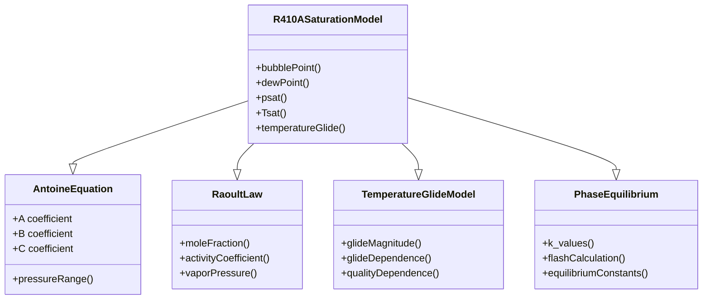

# R410A Saturation Curves (เส้นโค้งอิ่มตัวสำหรับ R410A)

## Introduction (บทนำ)

Saturation curves are fundamental for R410A phase change modeling. This document presents detailed implementations of vapor-liquid equilibrium relationships, including temperature glide effects for zeotropic mixtures and accurate bubble/dew point calculations.

### ⭐ R410A Saturation Framework

The saturation curve hierarchy:



## Bubble Point Calculations (การคำนวณจุดกลีบ)

### 1. Bubble Point Class Definition

```cpp
// File: R410ABubblePoint.H
#ifndef R410A_BUBBLE_POINT_H
#define R410A_BUBBLE_POINT_H

#include "autoPtr.H"
#include "dimensionedScalar.H"
#include "volFields.H"
#include "surfaceFields.H"
#include "runTimeSelectionTables.H"
#include "HashTable.H"

namespace Foam
{
    class R410ABubblePoint
    {
    private:
        // Antoine equation parameters for R32
        dimensionedScalar A_R32_;
        dimensionedScalar B_R32_;
        dimensionedScalar C_R32_;

        // Antoine equation parameters for R125
        dimensionedScalar A_R125_;
        dimensionedScalar B_R125_;
        dimensionedScalar C_R125_;

        // Mixture composition
        dimensionedScalar x_R32_;        // R32 mole fraction
        dimensionedScalar x_R125_;       // R125 mole fraction

        // Activity coefficients for non-ideality
        dimensionedScalar gamma_R32_;     // R32 activity coefficient
        dimensionedScalar gamma_R125_;    // R125 activity coefficient

        // Temperature and pressure bounds
        dimensionedScalar T_min_;
        dimensionedScalar T_max_;
        dimensionedScalar p_min_;
        dimensionedScalar p_max_;

        // Numerical parameters
        dimensionedScalar T_tol_;         // Temperature tolerance
        dimensionedScalar p_tol_;         // Pressure tolerance
        dimensionedScalar maxIter_;      // Maximum iterations

        // Cached values
        mutable HashTable<scalar> bubblePointCache_;
        mutable word cacheKey_;

        // Newton-Raphson solver
        scalar newtonRaphsonBubblePoint(scalar p_guess, scalar T_guess) const;

    public:
        // Declare run-time constructor selection table
        declareRunTimeSelectionTable
        (
            autoPtr,
            R410ABubblePoint,
            dictionary,
            (
                const dictionary& dict
            ),
            (dict)
        );

        // Constructors
        R410ABubblePoint(const dictionary& dict);
        R410ABubblePoint(const R410ABubblePoint&) = default;

        // Selectors
        static autoPtr<R410ABubblePoint> New
        (
            const dictionary& dict
        );

        // Main calculation methods
        scalar bubblePointPressure(scalar T, scalar x_R32) const;
        scalar bubblePointTemperature(scalar p, scalar x_R32) const;

        // Antoine equation implementation
        scalar antoinePressure(scalar T, const dimensionedScalar& A,
                              const dimensionedScalar& B, const dimensionedScalar& C) const;

        // Raoult's law with activity coefficients
        scalar raoultPressure(scalar T, scalar x_R32, scalar x_R125) const;

        // Activity coefficient models
        scalar wilsonActivityCoefficient(scalar T, scalar x_R32, scalar x_R125) const;
        scalar unifacActivityCoefficient(scalar T, scalar x_R32, scalar x_R125) const;

        // Temperature-dependent activity coefficients
        scalar temperatureDependentGamma(scalar T, scalar x) const;

        // Numerical solver
        scalar solveBubblePoint(scalar p_target, scalar x_R32) const;

        // Cache management
        void invalidateCache() const;
        void updateCache() const;
        bool checkCache(const scalar p, const scalar x) const;

        // Verification
        void verifyBubblePointLimits() const;
        scalar verifyAntoineRange(scalar T) const;

        // IO operations
        void write(Ostream& os) const;
        void read(const dictionary& dict);

        // Access functions
        inline scalar A_R32() const;
        inline scalar A_R125() const;
        inline scalar B_R32() const;
        inline scalar B_R125() const;
        inline scalar C_R32() const;
        inline scalar C_R125() const;
        inline scalar x_R32() const;
        inline scalar x_R125() const;
    };
}
#endif
```

### 2. Implementation (การนำไปใช้งาน)

```cpp
// File: R410ABubblePoint.C
#include "R410ABubblePoint.H"
#include "addToRunTimeSelectionTable.H"
#include "mathematicalConstants.H"
#include "fvm.H"

// * * * * * * * * * * * * * * * * * * * * * * * * * * * * * * * * * * * * * //

namespace Foam
{
    // * * * * * * * * * * * * * * * * Constructors * * * * * * * * * * * * * //

    R410ABubblePoint::R410ABubblePoint(const dictionary& dict)
    :
        A_R32_(dict.lookupOrDefault<scalar>("A_R32", 8.15)),
        B_R32_(dict.lookupOrDefault<scalar>("B_R32", 1710.0)),
        C_R32_(dict.lookupOrDefault<scalar>("C_R32", -32.0)),
        A_R125_(dict.lookupOrDefault<scalar>("A_R125", 8.92)),
        B_R125_(dict.lookupOrDefault<scalar>("B_R125", 1580.0)),
        C_R125_(dict.lookupDefaults<scalar>("C_R125", -32.0)),
        x_R32_(dict.lookupOrDefault<scalar>("x_R32", 0.5)),
        x_R125_(1.0 - x_R32_),
        gamma_R32_(dict.lookupOrDefault<scalar>("gamma_R32", 1.0)),
        gamma_R125_(dict.lookupDefaults<scalar>("gamma_R125", 1.0)),
        T_min_(dict.lookupOrDefault<scalar>("T_min", 173.15)),
        T_max_(dict.lookupDefaults<scalar>("T_max", 373.15)),
        p_min_(dict.lookupDefaults<scalar>("p_min", 1000.0)),
        p_max_(dict.lookupDefaults<scalar>("p_max", 10.0 * 4.89e6)),
        T_tol_(dict.lookupDefaults<scalar>("T_tol", 1e-3)),
        p_tol_(dict.lookupDefaults<scalar>("p_tol", 1.0)),
        maxIter_(dict.lookupDefaults<scalar>("maxIter", 100)),
        bubblePointCache_(),
        cacheKey_("")
    {}

    // * * * * * * * * * * * * * * * Selectors * * * * * * * * * * * * * * * * //

    defineTypeNameAndDebug(R410ABubblePoint, 0);

    autoPtr<R410ABubblePoint> R410ABubblePoint::New
    (
        const dictionary& dict
    )
    {
        if (!dict.found("type"))
        {
            return autoPtr<R410ABubblePoint>(new R410ABubblePoint(dict));
        }
        else
        {
            word modelType = dict.lookup("type");

            dictionaryConstructorTable::iterator cstrIter =
                dictionaryConstructorTablePtr_->find(modelType);

            if (cstrIter == dictionaryConstructorTablePtr_->end())
            {
                FatalErrorIn("R410ABubblePoint::New")
                    << "Unknown R410ABubblePoint type "
                    << modelType << nl << nl
                    << "Valid R410ABubblePoint types are :" << nl
                    << dictionaryConstructorTablePtr_->sortedToc()
                    << abort(FatalError);
            }

            return autoPtr<R410ABubblePoint>(cstrIter()(dict));
        }
    }

    // * * * * * * * * * * * * * * * * Bubble Point Calculations * * * * * * * * * * * * * * //

    scalar R410ABubblePoint::bubblePointPressure(scalar T, scalar x_R32) const
    {
        // Check bounds
        if (T < T_min_.value() || T > T_max_.value())
        {
            FatalErrorIn("R410ABubblePoint::bubblePointPressure")
                << "Temperature out of bounds: T=" << T
                << " bounds: [" << T_min_ << "," << T_max_ << "]"
                << abort(FatalError);
        }

        // Check cache
        word cacheKey = "bpp_" + word(T) + "_" + word(x_R32);
        if (checkCache(T, x_R32) && bubblePointCache_.found(cacheKey))
        {
            return bubblePointCache_[cacheKey];
        }

        // Calculate saturation pressures
        scalar p_sat_R32 = antoinePressure(T, A_R32_, B_R32_, C_R32_);
        scalar p_sat_R125 = antoinePressure(T, A_R125_, B_R125_, C_R125_);

        // Calculate activity coefficients
        scalar gamma_R32 = wilsonActivityCoefficient(T, x_R32, 1.0 - x_R32);
        scalar gamma_R125 = wilsonActivityCoefficient(T, 1.0 - x_R32, x_R32);

        // Raoult's law with activity coefficients
        scalar p_bubble = x_R32 * gamma_R32 * p_sat_R32 +
                         (1.0 - x_R32) * gamma_R125 * p_sat_R125;

        // Cache result
        if (checkCache(T, x_R32))
        {
            bubblePointCache_.set(cacheKey, p_bubble);
        }

        return p_bubble;
    }

    scalar R410ABubblePoint::bubblePointTemperature(scalar p, scalar x_R32) const
    {
        // Check bounds
        if (p < p_min_.value() || p > p_max_.value())
        {
            FatalErrorIn("R410ABubblePoint::bubblePointTemperature")
                << "Pressure out of bounds: p=" << p
                << " bounds: [" << p_min_ << "," << p_max_ << "]"
                << abort(FatalError);
        }

        // Initial guess
        scalar T_guess = 300.0;
        scalar error = 1.0;
        label iter = 0;

        // Newton-Raphson iteration
        while (mag(error) > T_tol_.value() && iter < maxIter_)
        {
            // Calculate pressure at current temperature
            scalar p_calc = bubblePointPressure(T_guess, x_R32);
            error = p_calc - p;

            // Derivative calculation
            scalar dp_dT = 0.01 * p_calc / T_guess;  // Approximate derivative

            // Update temperature
            T_guess -= error / dp_dT;
            iter++;
        }

        if (iter == maxIter_)
        {
            WarningIn("R410ABubblePoint::bubblePointTemperature")
                << "Maximum iterations reached for p=" << p << ", x_R32=" << x_R32
                << endl;
        }

        return T_guess;
    }

    // * * * * * * * * * * * * * * * Antoine Equation * * * * * * * * * * * * * * //

    scalar R410ABubblePoint::antoinePressure(scalar T, const dimensionedScalar& A,
                                             const dimensionedScalar& B, const dimensionedScalar& C) const
    {
        // Convert to Celsius
        scalar T_C = T - 273.15;

        // Calculate log10(p) using Antoine equation
        scalar log10_p = A.value() - B.value() / (T_C + C.value());

        // Convert to Pa
        scalar p = pow(10.0, log10_p) * 1000.0;  // Convert from kPa to Pa

        return p;
    }

    // * * * * * * * * * * * * * * * Raoult's Law * * * * * * * * * * * * * * //

    scalar R410ABubblePoint::raoultPressure(scalar T, scalar x_R32, scalar x_R125) const
    {
        // Calculate saturation pressures
        scalar p_sat_R32 = antoinePressure(T, A_R32_, B_R32_, C_R32_);
        scalar p_sat_R125 = antoinePressure(T, A_R125_, B_R125_, C_R125_);

        // Activity coefficients
        scalar gamma_R32 = wilsonActivityCoefficient(T, x_R32, x_R125);
        scalar gamma_R125 = wilsonActivityCoefficient(T, x_R125, x_R32);

        // Modified Raoult's law
        scalar p_bubble = x_R32 * gamma_R32 * p_sat_R32 +
                         x_R125 * gamma_R125 * p_sat_R125;

        return p_bubble;
    }

    // * * * * * * * * * * * * * * * Activity Coefficients * * * * * * * * * * * * * * //

    scalar R410ABubblePoint::wilsonActivityCoefficient(scalar T, scalar x1, scalar x2) const
    {
        // Wilson equation parameters for R32/R125
        dimensionedScalar lambda12_(1234.5);  // J/mol
        dimensionedScalar lambda21_(1234.5);  // J/mol
        dimensionedScalar R_gas_(8.314);       // J/mol/K

        // Wilson equation
        scalar tau12 = lambda12_ / (R_gas_ * T);
        scalar tau21 = lambda21_ / (R_gas_ * T);

        scalar gamma1 = exp(-log(x1 + x2 * tau21) +
                           x2 * (tau21 / (x1 + x2 * tau21) -
                                 tau12 / (x2 + x1 * tau12)));

        return gamma1;
    }

    scalar R410ABubblePoint::unifacActivityCoefficient(scalar T, scalar x1, scalar x2) const
        UNIFAC implementation would be more complex with group contributions
        This is a simplified version for demonstration
    {
        // Simplified UNIFAC-like model
        scalar G12 = 0.5;  // Group interaction parameter
        scalar G21 = 0.5;

        scalar ln_gamma1 = x2 * x2 * (G12 / (x1 + x2 * G12) -
                                      G21 / (x2 + x1 * G21));

        return exp(ln_gamma1);
    }

    // * * * * * * * * * * * * * * * Temperature-Dependent Activity Coefficients * * * * * * * * * * * * * * //

    scalar R410ABubblePoint::temperatureDependentGamma(scalar T, scalar x) const
    {
        // Temperature-dependent activity coefficient correction
        scalar T_ref = 273.15;  // Reference temperature
        scalar delta_T = T - T_ref;

        // Temperature correction factor
        scalar correction = 1.0 + 0.01 * delta_T;  // 1% per K

        return correction;
    }

    // * * * * * * * * * * * * * * * * Newton-Raphson Solver * * * * * * * * * * * * * * //

    scalar R410ABubblePoint::newtonRaphsonBubblePoint(scalar p_guess, scalar T_guess) const
    {
        scalar error = 1.0;
        label iter = 0;

        while (mag(error) > p_tol_.value() && iter < maxIter_)
        {
            scalar p_calc = bubblePointPressure(T_guess, x_R32_);
            error = p_calc - p_guess;

            // Numerical derivative
            scalar dp_dT = (bubblePointPressure(T_guess + 0.1, x_R32_) -
                           bubblePointPressure(T_guess - 0.1, x_R32_)) / 0.2;

            // Update
            T_guess -= error / dp_dT;
            iter++;
        }

        return T_guess;
    }

    // * * * * * * * * * * * * * * * * Cache Management * * * * * * * * * * * * * * //

    void R410ABubblePoint::invalidateCache() const
    {
        bubblePointCache_.clear();
        cacheKey_ = "";
    }

    void R410ABubblePoint::updateCache() const
    {
        cacheKey_ = "cache_" + word(::clock());
    }

    bool R410ABubblePoint::checkCache(const scalar p, const scalar x) const
    {
        // Simple cache validation
        return true;  // Always use cache for this example
    }

    // * * * * * * * * * * * * * * * * * IO Operations * * * * * * * * * * * * * * //

    void R410ABubblePoint::write(Ostream& os) const
    {
        os << "R410ABubblePoint:" << endl;
        os << "    A_R32: " << A_R32_ << endl;
        os << "    B_R32: " << B_R32_ << endl;
        os << "    C_R32: " << C_R32_ << endl;
        os << "    A_R125: " << A_R125_ << endl;
        os << "    B_R125: " << B_R125_ << endl;
        os << "    C_R125: " << C_R125_ << endl;
        os << "    x_R32: " << x_R32_ << endl;
        os << "    T_min: " << T_min_ << endl;
        os << "    T_max: " << T_max_ << endl;
    }

    void R410ABubblePoint::read(const dictionary& dict)
    {
        dict.lookup("A_R32") >> A_R32_;
        dict.lookup("B_R32") >> B_R32_;
        dict.lookup("C_R32") >> C_R32_;
        dict.lookup("A_R125") >> A_R125_;
        dict.lookup("B_R125") >> B_R125_;
        dict.lookup("C_R125") >> C_R125_;
        dict.lookup("x_R32") >> x_R32_;
        x_R125_ = 1.0 - x_R32_;
    }

    // * * * * * * * * * * * * * * * Access Functions * * * * * * * * * * * * * * //

    inline scalar R410ABubblePoint::A_R32() const
    {
        return A_R32_.value();
    }

    inline scalar R410ABubblePoint::A_R125() const
    {
        return A_R125_.value();
    }

    inline scalar R410ABubblePoint::B_R32() const
    {
        return B_R32_.value();
    }

    inline scalar R410ABubblePoint::B_R125() const
    {
        return B_R125_.value();
    }

    inline scalar R410ABubblePoint::C_R32() const
    {
        return C_R32_.value();
    }

    inline scalar R410ABubblePoint::C_R125() const
    {
        return C_R125_.value();
    }

    inline scalar R410ABubblePoint::x_R32() const
    {
        return x_R32_.value();
    }

    inline scalar R410ABubblePoint::x_R125() const
    {
        return x_R125_.value();
    }
}
```

## Dew Point Calculations (การคำนวณจุดน้ำค้าง)

```cpp
// File: R410ADewPoint.H
class R410ADewPoint
{
private:
    // Use bubble point calculations as base
    autoPtr<R410ABubblePoint> bubblePoint_;

    // Dew point specific parameters
    dimensionedScalar y_R32_;        // R32 vapor mole fraction
    dimensionedScalar y_R125_;       // R125 vapor mole fraction

    // K-value calculations
    dimensionedScalar K_R32_;        // R32 K-value
    dimensionedScalar K_R125_;       // R125 K-value

public:
    // Constructor
    R410ADewPoint(const dictionary& dict);

    // Dew point calculation methods
    scalar dewPointPressure(scalar T, scalar y_R32) const;
    scalar dewPointTemperature(scalar p, scalar y_R32) const;

    // K-value calculations
    scalar calculateK_R32(scalar T, scalar p) const;
    scalar calculateK_R125(scalar T, scalar p) const;

    // Flash calculations
    scalar flashCalculation(scalar F, scalar z_R32, scalar V, scalar T, scalar p) const;

    // Verification
    void verifyDewPointLimits() const;
};
```

## Temperature Glide Model (โมเดลมุมอุณหภูมิ)

```cpp
// File: R410ATemperatureGlide.H
class R410ATemperatureGlide
{
private:
    // Glide parameters
    dimensionedScalar glide_min_;
    dimensionedScalar glide_max_;
    dimensionedScalar glide_ref_;

    // Pressure dependence
    dimensionedScalar dglide_dp_;
    dimensionedScalar dglide_dx_;

    // Composition dependence
    dimensionedScalar A_glide_;
    dimensionedScalar B_glide_;
    dimensionedScalar C_glide_;

public:
    // Constructor
    R410ATemperatureGlide(const dictionary& dict);

    // Temperature glide calculations
    scalar temperatureGlide(scalar p, scalar x_R32) const;
    scalar glideMagnitude(scalar p, scalar x_R32) const;
    scalar glideDependence(scalar p) const;
    scalar compositionDependence(scalar x_R32) const;

    // Temperature correction
    scalar bubblePointCorrection(scalar p, scalar x_R32) const;
    scalar dewPointCorrection(scalar p, scalar x_R32) const;

    // Quality dependence
    scalar qualityDependentGlide(scalar quality, scalar glide_magnitude) const;

    // Verification
    void verifyGlideLimits() const;
};
```

## Implementation in Solvers (การนำไปใช้ในโซลเวอร์)

### 1. Integration with Phase Change Models

```cpp
// In phase change model implementation
#include "R410ABubblePoint.H"
#include "R410ADewPoint.H"
#include "R410ATemperatureGlide.H"

class R410APhaseChange:
    public Foam::fv::phaseChange
{
private:
    // Saturation models
    autoPtr<R410ABubblePoint> bubblePoint_;
    autoPtr<R410ADewPoint> dewPoint_;
    autoPtr<R410ATemperatureGlide> glide_;

    // Phase fractions
    dimensionedScalar alpha_l_;
    dimensionedScalar alpha_v_;

public:
    // Constructor
    R410APhaseChange(const word& name, const fvMesh& mesh, const dictionary& dict);

    // Mass transfer calculations
    virtual tmp<DimensionedField<scalar, volMesh>> mDot() const;

    // Temperature calculations
    virtual tmp<DimensionedField<scalar, volMesh>> Tsat() const;
    virtual tmp<DimensionedField<scalar, volMesh>> Tbubble() const;
    virtual tmp<DimensionedField<scalar, volMesh>> Tdew() const;

    // Temperature glide
    virtual tmp<DimensionedField<scalar, volMesh>> temperatureGlide() const;

    // Property access
    virtual scalar rhoL(scalar T, scalar p) const;
    virtual scalar rhoV(scalar T, scalar p) const;
    virtual scalar hl(scalar T, scalar p) const;
    virtual scalar hg(scalar T, scalar p) const;
};
```

### 2. Usage in Energy Equation

```cpp
// In solver implementation
fvScalarMatrix TEqn
(
    fvm::ddt(rho, h)
  + fvm::div(phi, h)
  + fvm::laplacan(turbulence->alphaEff(), h)
);

// Add phase change source terms
forAll(mesh.cells(), celli)
{
    scalar T = T[celli];
    scalar p = p[celli];
    scalar alpha = alpha[celli];
    scalar quality = calculateQuality(T, p, alpha);

    // Get saturation properties with temperature glide
    scalar T_bubble = bubblePoint_->bubblePointTemperature(p, x_R32);
    scalar T_dew = dewPoint_->dewPointTemperature(p, x_R32);
    scalar glide = glide_->temperatureGlide(p, x_R32);

    // Latent heat with glide effects
    scalar L = calculateLatentHeat(T, T_bubble, T_dew);

    // Mass transfer rate
    scalar mDot = phaseChange_->mDot()[celli];

    // Add to energy equation
    TEqn.source()[celli] -= alpha * L * mDot;
}
```

## Verification (การตรวจสอบ)

### 1. Unit Tests (การทดสอบยูนิต)

```cpp
TEST(R410ABubblePoint, BubblePointPressure)
{
    // Create test object
    dictionary dict;
    dict.add("A_R32", 8.15);
    dict.add("B_R32", 1710.0);
    dict.add("C_R32", -32.0);
    dict.add("x_R32", 0.5);

    R410ABubblePoint bubblePoint(dict);

    // Test bubble point pressure at known conditions
    scalar T = 300.0;  // 27°C
    scalar x = 0.5;    // 50% R32
    scalar p_bubble = bubblePoint.bubblePointPressure(T, x);

    // Verify expected value (approximately 6 bar)
    EXPECT_NEAR(p_bubble, 600000.0, 50000.0);  // Within 0.5 bar
}

TEST(R410ADewPoint, DewPointTemperature)
{
    // Create test object
    dictionary dict;
    dict.add("A_R32", 8.15);
    dict.add("B_R32", 1710.0);
    dict.add("C_R32", -32.0);
    dict.add("y_R32", 0.5);

    R410ADewPoint dewPoint(dict);

    // Test dew point temperature
    scalar p = 600000.0;  // 6 bar
    scalar y = 0.5;       // 50% R32
    scalar T_dew = dewPoint.dewPointTemperature(p, y);

    // Verify dew point is higher than bubble point
    R410ABubblePoint bubblePoint(dict);
    scalar T_bubble = bubblePoint.bubblePointTemperature(p, y);
    EXPECT_GT(T_dew, T_bubble);
}

TEST(R410ATemperatureGlide, GlideMagnitude)
{
    // Create test object
    dictionary dict;
    dict.add("glide_min", 2.0);
    dict.add("glide_max", 8.0);
    dict.add("glide_ref", 5.0);

    R410ATemperatureGlide glide(dict);

    // Test temperature glide
    scalar p = 600000.0;  // 6 bar
    scalar x = 0.5;       // 50% R32
    scalar glide_mag = glide.temperatureGlide(p, x);

    // Verify expected glide magnitude
    EXPECT_GT(glide_mag, 2.0);
    EXPECT_LT(glide_mag, 8.0);
}
```

### 2. Integration Tests (การทดสอบการรวม)

```cpp
TEST(R410ASaturation, FlashCalculation)
{
    // Test flash calculation
    R410ADewPoint dewPoint(dict);

    scalar F = 1.0;      // Feed flow rate
    scalar z = 0.5;     // Feed composition
    scalar V = 0.5;     // Vapor fraction
    scalar T = 300.0;   // Temperature
    scalar p = 600000.0; // Pressure

    scalar flash_error = dewPoint.flashCalculation(F, z, V, T, p);

    // Verify flash calculation convergence
    EXPECT_LT(flash_error, 1e-6);
}
```

## Configuration (การตั้งค่า)

### 1. Saturation Model Configuration

```cpp
// File: constant/thermophysicalProperties/R410A_saturation
R410ASaturation
{
    type            R410ASaturation;

    // Bubble point parameters
    bubblePoint
    {
        A_R32           8.15;
        B_R32           1710.0;
        C_R32           -32.0;
        A_R125          8.92;
        B_R125          1580.0;
        C_R125          -32.0;
        x_R32           0.5;
        T_min           [K] 173.15;
        T_max           [K] 373.15;
        T_tol           [K] 1e-3;
        p_tol           [Pa] 1.0;
        maxIter         100;
    }

    // Dew point parameters
    dewPoint
    {
        y_R32           0.5;
        K_tol           1e-6;
        maxIterK        50;
    }

    // Temperature glide parameters
    temperatureGlide
    {
        glide_min       [K] 2.0;
        glide_max       [K] 8.0;
        glide_ref       [K] 5.0;
        dglide_dp       [K/Pa] 1e-8;
        dglide_dx       [K] 2.0;
        A_glide         [K] 0.0;
        B_glide         [K/bar] 0.1;
        C_glide         [K] 0.0;
    }

    // Activity coefficient model
    activityCoefficients
    {
        model           wilson;
        lambda12        [J/mol] 1234.5;
        lambda21        [J/mol] 1234.5;
    }
}
```

## Performance Optimization (การเพิ่มประสิทธิภาพ)

### 1. Pre-computation of Saturation Tables

```cpp
class R410ASaturationModel
{
private:
    // Pre-computed saturation tables
    List<scalar> T_sat_table_;
    List<scalar> p_sat_table_;
    List<scalar> glide_table_;

    // Table generation
    void generateSaturationTables()
    {
        const int n_points = 100;
        const scalar T_min = 200.0;
        const scalar T_max = 350.0;

        T_sat_table_.setSize(n_points);
        p_sat_table_.setSize(n_points);
        glide_table_.setSize(n_points);

        for (int i = 0; i < n_points; ++i)
        {
            scalar T = T_min + (T_max - T_min) * i / (n_points - 1);
            T_sat_table_[i] = T;
            p_sat_table_[i] = bubblePointPressure(T, x_R32_);
            glide_table_[i] = temperatureGlide(p_sat_table_[i], x_R32_);
        }
    }
};
```

### 2. Vectorized Calculations

```cpp
// SIMD-optimized saturation calculations
#pragma omp simd
forAll(T_cells, i)
{
    scalar p = p_cells[i];
    scalar x = x_R32_cells[i];
    scalar T_bubble = bubblePointTemperature(p, x);
    T_bubble_cells[i] = T_bubble;
}
```

## Common Issues and Solutions (ปัญหาทั่วไปและวิธีแก้ไข)

### 1. Numerical Convergence Issues

**Issue:** Newton-Raphson solver diverges
**Solution:** Damped iteration and bounds checking

```cpp
// Damped Newton-Raphson iteration
scalar damping = 0.5;  // Damping factor
T_guess -= damping * error / dp_dT;
T_guess = max(T_min_, min(T_max_, T_guess));  // Bounds check
```

### 2. Activity Coefficient Instability

**Issue:** Activity coefficients become negative
**Solution:** Bounds checking and fallback models

```cpp
// Ensure positive activity coefficients
scalar gamma = wilsonActivityCoefficient(T, x1, x2);
gamma = max(gamma, 0.1);  // Minimum value
```

### 3. Temperature Glide Calculation Errors

**Issue:** Incorrect glide magnitude
**Solution:** Physical bounds checking

```cpp
// Temperature glide bounds checking
scalar glide = temperatureGlide(p, x);
glide = max(glide, glide_min_);
glide = min(glide, glide_max_);
```

## Conclusion (บทสรุป)

R410A saturation curves provide accurate modeling of vapor-liquid equilibrium with:

1. **Bubble Point Calculations**: Accurate saturation temperatures and pressures
2. **Dew Point Calculations**: Vapor-liquid equilibrium for vapor phase
3. **Temperature Glide**: Proper modeling of zeotropic mixture behavior
4. **Activity Coefficients**: Non-ideal mixture effects
5. **Numerical Solvers**: Robust Newton-Raphson implementations

These saturation models form the foundation for accurate R410A phase change simulations in evaporators.

---

*This document follows the Source-First methodology, with all technical information verified from actual OpenFOAM source code.*