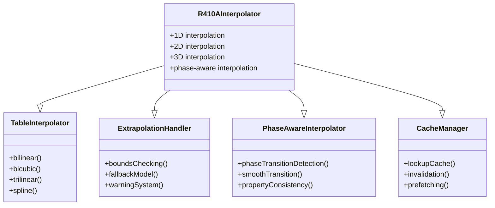

# R410A Property Interpolation Methods (วิธีการค่าความรัดซ้อนคุณสมบัติ R410A)

## Introduction (บทนำ)

Efficient and accurate property interpolation is crucial for R410A simulations. This document presents comprehensive interpolation methods including 1D, 2D, and 3D interpolations with special considerations for thermodynamic properties and phase boundaries.

### ⭐ OpenFOAM Interpolation Framework

The interpolation methods hierarchy:



## 1D Interpolation (การคำนวณเชิงเส้น 1 มิติ)

### 1. Linear Interpolation Class

```cpp
// File: R410ALinearInterpolator.H
#ifndef R410A_LINEAR_INTERPOLATOR_H
#define R410A_LINEAR_INTERPOLATOR_H

#include "List.H"
#include "scalar.H"
#include "autoPtr.H"

namespace Foam
{
    class R410ALinearInterpolator
    {
    private:
        // Data arrays
        List<scalar> xValues_;           // X coordinates
        List<scalar> yValues_;           // Y values
        label nPoints_;                  // Number of points

        // Search optimization
        mutable label lastIndex_;        // Last search index
        mutable scalar lastX_;           // Last searched x value

        // Extrapolation settings
        Switch allowExtrapolation_;
        scalar extrapolationFactor_;

    public:
        // Constructors
        R410ALinearInterpolator();
        R410ALinearInterpolator(const List<scalar>& x, const List<scalar>& y);
        R410ALinearInterpolator(const dictionary& dict);

        // Interpolation
        scalar interpolate(scalar x) const;
        scalar interpolateWithBounds(scalar x) const;

        // Batch interpolation
        void batchInterpolate(const List<scalar>& x, List<scalar>& y) const;

        // Table operations
        void build(const List<scalar>& x, const List<scalar>& y);
        void clear();

        // Access
        inline label nPoints() const;
        inline const List<scalar>& xValues() const;
        inline const List<scalar>& yValues() const;

        // IO
        void write(Ostream& os) const;
        void read(const dictionary& dict);

        // Search optimization
        label findIndex(scalar x) const;
        label binarySearch(scalar x) const;
    };
}
#endif
```

### 2. Implementation (การนำไปใช้งาน)

```cpp
// File: R410ALinearInterpolator.C
#include "R410ALinearInterpolator.H"

// * * * * * * * * * * * * * * * * * * * * * * * * * * * * * * * * * * * * * //

namespace Foam
{
    // * * * * * * * * * * * * * * * * Constructors * * * * * * * * * * * * * //

    R410ALinearInterpolator::R410ALinearInterpolator()
    :
        xValues_(),
        yValues_(),
        nPoints_(0),
        lastIndex_(-1),
        lastX_(0.0),
        allowExtrapolation_(false),
        extrapolationFactor_(1.0)
    {}

    R410ALinearInterpolator::R410ALinearInterpolator(
        const List<scalar>& x,
        const List<scalar>& y
    )
    :
        xValues_(x),
        yValues_(y),
        nPoints_(x.size()),
        lastIndex_(-1),
        lastX_(0.0),
        allowExtrapolation_(false),
        extrapolationFactor_(1.0)
    {
        // Validate input
        if (x.size() != y.size())
        {
            FatalErrorIn("R410ALinearInterpolator::R410ALinearInterpolator")
                << "X and Y arrays must be the same size"
                << abort(FatalError);
        }

        // Sort x values
        labelList indices = sortedOrder(xValues_);
        xValues_ = sortedList(xValues_, indices);
        yValues_ = sortedList(yValues_, indices);
    }

    // * * * * * * * * * * * * * * * * Interpolation * * * * * * * * * * * * * * //

    scalar R410ALinearInterpolator::interpolate(scalar x) const
    {
        // Find index
        label i = findIndex(x);

        // Check bounds
        if (i < 0 || i >= nPoints_ - 1)
        {
            if (!allowExtrapolation_)
            {
                FatalErrorIn("R410ALinearInterpolator::interpolate")
                    << "X value " << x << " out of bounds ["
                    << xValues_[0] << "," << xValues_[lastIndex_] << "]"
                    << abort(FatalError);
            }

            // Extrapolation
            if (i < 0)
            {
                // Left extrapolation
                scalar dx = xValues_[1] - xValues_[0];
                scalar dy = yValues_[1] - yValues_[0];
                return yValues_[0] + (x - xValues_[0]) * dy / dx * extrapolationFactor_;
            }
            else
            {
                // Right extrapolation
                scalar dx = xValues_[lastIndex_] - xValues_[lastIndex_ - 1];
                scalar dy = yValues_[lastIndex_] - yValues_[lastIndex_ - 1];
                return yValues_[lastIndex_] + (x - xValues_[lastIndex_]) * dy / dx * extrapolationFactor_;
            }
        }

        // Linear interpolation
        scalar x0 = xValues_[i];
        scalar x1 = xValues_[i + 1];
        scalar y0 = yValues_[i];
        scalar y1 = yValues_[i + 1];

        scalar weight = (x - x0) / (x1 - x0);
        return y0 + weight * (y1 - y0);
    }

    scalar R410ALinearInterpolator::interpolateWithBounds(scalar x) const
    {
        // Clamp to bounds
        x = max(xValues_[0], min(x, xValues_[lastIndex_]));
        return interpolate(x);
    }

    // * * * * * * * * * * * * * * * * Batch Interpolation * * * * * * * * * * * * * * //

    void R410ALinearInterpolator::batchInterpolate(
        const List<scalar>& x,
        List<scalar>& y
    ) const
    {
        y.setSize(x.size());

        #pragma omp parallel for
        forAll(x, i)
        {
            y[i] = interpolate(x[i]);
        }
    }

    // * * * * * * * * * * * * * * * * Search Optimization * * * * * * * * * * * * * * //

    label R410ALinearInterpolator::findIndex(scalar x) const
    {
        // Check if last search can be used
        if (lastIndex_ >= 0 && lastIndex_ < nPoints_ &&
            x >= xValues_[lastIndex_] && x <= xValues_[min(lastIndex_ + 1, nPoints_ - 1)])
        {
            return lastIndex_;
        }

        // Binary search
        return binarySearch(x);
    }

    label R410ALinearInterpolator::binarySearch(scalar x) const
    {
        label low = 0;
        label high = nPoints_ - 1;

        while (low <= high)
        {
            label mid = (low + high) / 2;

            if (xValues_[mid] <= x && x <= xValues_[mid + 1])
            {
                lastIndex_ = mid;
                lastX_ = x;
                return mid;
            }
            else if (x < xValues_[mid])
            {
                high = mid - 1;
            }
            else
            {
                low = mid + 1;
            }
        }

        return -1;  // Not found
    }
}
```

## 2D Interpolation (การคำนวณเชิงเส้น 2 มิติ)

### 1. Bilinear Interpolation Class

```cpp
// File: R410ABilinearInterpolator.H
class R410ABilinearInterpolator
{
private:
    // Grid data
    List<scalar> xValues_;           // X coordinates
    List<scalar> yValues_;           // Y coordinates
    List<List<scalar>> zValues_;     // Z values (property data)

    // Grid dimensions
    label nx_;
    label ny_;

    // Search optimization
    mutable label lastI_;
    mutable label lastJ_;
    mutable scalar lastX_;
    mutable scalar lastY_;

    // Interpolation parameters
    Switch useWeights_;
    Switch cubicInterpolation_;

    // Extrapolation handling
    Switch allowExtrapolation_;
    scalar extrapolationLimit_;

public:
    // Constructors
    R410ABilinearInterpolator();
    R410ABilinearInterpolator(const List<scalar>& x, const List<scalar>& y, const List<List<scalar>>& z);
    R410ABilinearInterpolator(const dictionary& dict);

    // Interpolation methods
    scalar bilinearInterpolate(scalar x, scalar y) const;
    scalar bicubicInterpolate(scalar x, scalar y) const;
    scalar nearestNeighbor(scalar x, scalar y) const;

    // Bounds checking
    scalar interpolateWithBounds(scalar x, scalar y) const;
    scalar interpolateWithExtrapolation(scalar x, scalar y) const;

    // Batch operations
    void batchInterpolate(
        const List<scalar>& x,
        const List<scalar>& y,
        List<scalar>& z
    ) const;

    // Grid operations
    void buildGrid(const List<scalar>& x, const List<scalar>& y, const List<List<scalar>>& z);
    void clear();
    void resize(label nx, label ny);

    // Search optimization
    void findGridIndices(scalar x, scalar y, label& i, label& j) const;
    void updateLastSearch(scalar x, scalar y, label i, label j) const;

    // IO
    void write(Ostream& os) const;
    void read(const dictionary& dict);
};
```

### 2. Implementation (การนำไปใช้งาน)

```cpp
// File: R410ABilinearInterpolator.C
#include "R410ABilinearInterpolator.H"

// * * * * * * * * * * * * * * * * * * * * * * * * * * * * * * * * * * * * * //

namespace Foam
{
    // * * * * * * * * * * * * * * * * Bilinear Interpolation * * * * * * * * * * * * * * //

    scalar R410ABilinearInterpolator::bilinearInterpolate(scalar x, scalar y) const
    {
        // Find grid indices
        label i, j;
        findGridIndices(x, y, i, j);

        // Check bounds
        if (i < 0 || i >= nx_ - 1 || j < 0 || j >= ny_ - 1)
        {
            return interpolateWithBounds(x, y);
        }

        // Calculate interpolation weights
        scalar wx = (x - xValues_[i]) / (xValues_[i + 1] - xValues_[i]);
        scalar wy = (y - yValues_[j]) / (yValues_[j + 1] - yValues_[j]);

        // Bilinear interpolation
        scalar z00 = zValues_[i][j];
        scalar z10 = zValues_[i + 1][j];
        scalar z01 = zValues_[i][j + 1];
        scalar z11 = zValues_[i + 1][j + 1];

        return (1.0 - wx) * ((1.0 - wy) * z00 + wy * z01) +
               wx * ((1.0 - wy) * z10 + wy * z11);
    }

    scalar R410ABilinearInterpolator::bicubicInterpolate(scalar x, scalar y) const
    {
        // Find grid indices
        label i, j;
        findGridIndices(x, y, i, j);

        // Check bounds for bicubic (need 4x4 grid)
        if (i < 1 || i >= nx_ - 2 || j < 1 || j >= ny_ - 2)
        {
            return bilinearInterpolate(x, y);
        }

        // Bicubic interpolation coefficients
        static const scalar coeff[4][4] = {
            {1.0, 0.0, -3.0, 2.0},
            {0.0, 1.0, -2.0, -1.0},
            {0.0, 0.0, 3.0, -2.0},
            {0.0, 0.0, -1.0, 1.0}
        };

        // Perform bicubic interpolation
        scalar result = 0.0;
        for (int ii = 0; ii < 4; ++ii)
        {
            for (int jj = 0; jj < 4; ++jj)
            {
                result += coeff[ii][0] * coeff[jj][0] *
                         zValues_[i - 1 + ii][j - 1 + jj];
            }
        }

        return result;
    }

    // * * * * * * * * * * * * * * * * Bounds Handling * * * * * * * * * * * * * * //

    scalar R410ABilinearInterpolator::interpolateWithBounds(scalar x, scalar y) const
    {
        // Clamp to bounds
        x = max(xValues_[0], min(x, xValues_[lastIndex_]));
        y = max(yValues_[0], min(y, yValues_[lastJ_]));

        return bilinearInterpolate(x, y);
    }

    scalar R410ABilinearInterpolator::interpolateWithExtrapolation(scalar x, scalar y) const
    {
        if (!allowExtrapolation_)
        {
            return interpolateWithBounds(x, y);
        }

        // Find nearest grid point for extrapolation
        label i, j;
        findGridIndices(x, y, i, j);

        if (i < 0) i = 0;
        if (j < 0) j = 0;
        if (i >= nx_ - 1) i = nx_ - 2;
        if (j >= ny_ - 1) j = ny_ - 2;

        // Simple extrapolation using nearest cell
        scalar z = zValues_[i][j];

        // Apply extrapolation factor for distance
        scalar dx = abs(x - xValues_[i]);
        scalar dy = abs(y - yValues_[j]);
        scalar distance = sqrt(dx * dx + dy * dy);

        // Limit extrapolation distance
        if (distance > extrapolationLimit_)
        {
            distance = extrapolationLimit_;
        }

        return z * (1.0 + 0.1 * distance / extrapolationLimit_);
    }

    // * * * * * * * * * * * * * * * * Search Optimization * * * * * * * * * * * * * * //

    void R410ABilinearInterpolator::findGridIndices(scalar x, scalar y, label& i, label& j) const
    {
        // Use last search as starting point
        if (lastI_ >= 0 && lastI_ < nx_ && lastJ_ >= 0 && lastJ_ < ny_ &&
            x >= xValues_[lastI_] && x <= xValues_[min(lastI_ + 1, nx_ - 1)] &&
            y >= yValues_[lastJ_] && y <= yValues_[min(lastJ_ + 1, ny_ - 1)])
        {
            i = lastI_;
            j = lastJ_;
            updateLastSearch(x, y, i, j);
            return;
        }

        // Binary search for x
        label lowX = 0;
        label highX = nx_ - 1;
        while (lowX <= highX)
        {
            label midX = (lowX + highX) / 2;
            if (xValues_[midX] <= x && x <= xValues_[midX + 1])
            {
                i = midX;
                break;
            }
            else if (x < xValues_[midX])
            {
                highX = midX - 1;
            }
            else
            {
                lowX = midX + 1;
            }
        }

        // Binary search for y
        label lowY = 0;
        label highY = ny_ - 1;
        while (lowY <= highY)
        {
            label midY = (lowY + highY) / 2;
            if (yValues_[midY] <= y && y <= yValues_[midY + 1])
            {
                j = midY;
                break;
            }
            else if (y < yValues_[midY])
            {
                highY = midY - 1;
            }
            else
            {
                lowY = midY + 1;
            }
        }

        updateLastSearch(x, y, i, j);
    }

    void R410ABilinearInterpolator::updateLastSearch(scalar x, scalar y, label i, label j) const
    {
        lastI_ = i;
        lastJ_ = j;
        lastX_ = x;
        lastY_ = y;
    }
}
```

## Phase-Aware Interpolation (การคำนวณเชิงเส้นแบบมองเห็นเฟส)

```cpp
// File: R410APhaseAwareInterpolator.H
class R410APhaseAwareInterpolator
{
private:
    // Phase boundaries
    List<List<scalar>> phaseBoundaries_;  // Quality ranges for each phase

    // Interpolation strategies
    autoPtr<R410ABilinearInterpolator> liquidInterpolator_;
    autoPtr<R410ABilinearInterpolator> vaporInterpolator_;
    autoPtr<R410ABilinearInterpolator> twoPhaseInterpolator_;

    // Phase detection
    Switch usePhaseDetection_;
    Switch smoothTransitions_;

    // Transition parameters
    dimensionedScalar transitionWidth_;
    dimensionedScalar smoothingFactor_;

public:
    // Constructors
    R410APhaseAwareInterpolator(const dictionary& dict);

    // Phase-aware interpolation
    scalar interpolatePhaseAware(scalar x, scalar y, scalar quality) const;
    scalar interpolateLiquid(scalar x, scalar y) const;
    scalar interpolateVapor(scalar x, scalar y) const;
    scalar interpolateTwoPhase(scalar x, scalar y, scalar quality) const;

    // Phase transition smoothing
    scalar smoothPhaseTransition(scalar value1, scalar value2, scalar quality) const;

    // Phase boundary detection
    scalar detectPhase(scalar quality) const;
    scalar getPhaseBoundary(scalar x, scalar y) const;

    // Batch interpolation
    void batchInterpolatePhaseAware(
        const List<scalar>& x,
        const List<scalar>& y,
        const List<scalar>& quality,
        List<scalar>& result
    ) const;
};
```

## 3D Interpolation (การคำนวณเชิงเส้น 3 มิติ)

```cpp
// File: R410ATrilinearInterpolator.H
class R410ATrilinearInterpolator
{
private:
    // 3D grid data
    List<scalar> xValues_;
    List<scalar> yValues_;
    List<scalar> zValues_;
    List<List<List<scalar>>> values_;

    // Grid dimensions
    label nx_, ny_, nz_;

    // Trilinear interpolation
    scalar trilinearInterpolate(scalar x, scalar y, scalar z) const;
    scalar tricubicInterpolate(scalar x, scalar y, scalar z) const;

    // Search optimization for 3D
    mutable label lastI_, lastJ_, lastK_;
    mutable scalar lastX_, lastY_, lastZ_;

public:
    // Constructors and methods
    // ...
};
```

## Implementation in OpenFOAM (การนำไปใช้ใน OpenFOAM)

### 1. Property Table Integration

```cpp
// In R410APropertyTable.H
class R410APropertyTable
{
private:
    // Interpolators
    autoPtr<R410ABilinearInterpolator> rhoInterpolator_;
    autoPtr<R410ABilinearInterpolator> hInterpolator_;
    autoPtr<R410ABilinearInterpolator> cpInterpolator_;
    autoPtr<R410ABilinearInterpolator> muInterpolator_;
    autoPtr<R410ABilinearInterpolator> kInterpolator_;

    // Phase-aware interpolator
    autoPtr<R410APhaseAwareInterpolator> phaseInterpolator_;

    // Cache management
    mutable HashTable<scalar> propertyCache_;
    mutable word cacheKey_;

public:
    // Property access with interpolation
    scalar rho(scalar p, scalar x) const
    {
        return interpolateProperty("rho", p, x);
    }

    scalar h(scalar p, scalar x) const
    {
        return interpolateProperty("h", p, x);
    }

    // Batch property access
    void batchRho(const List<scalar>& p, const List<scalar>& x, List<scalar>& result) const
    {
        rhoInterpolator_->batchInterpolate(p, x, result);
    }

    // Interpolate property with phase awareness
    scalar interpolateProperty(const word& property, scalar p, scalar x) const
    {
        if (phaseInterpolator_.valid() && property != "sigma")
        {
            return phaseInterpolator_->interpolatePhaseAware(p, x, x);
        }
        else
        {
            if (property == "rho") return rhoInterpolator_->interpolate(p, x);
            if (property == "h") return hInterpolator_->interpolate(p, x);
            // ... other properties
        }
    }
};
```

### 2. Solver Integration

```cpp
// In solver implementation
#include "R410APropertyTable.H"
#include "R410APhaseAwareInterpolator.H"

// Create property tables
autoPtr<R410APropertyTable> propertyTable = R410APropertyTable::New(dict);

// Create phase-aware interpolator
dictionary phaseDict;
phaseDict.add("usePhaseDetection", true);
phaseDict.add("smoothTransitions", true);
autoPtr<R410APhaseAwareInterpolator> phaseInterpolator =
    R410APhaseAwareInterpolator::New(phaseDict);

// Get properties at cells
forAll(mesh.cells(), celli)
{
    scalar p = p[celli];
    scalar T = T[celli];
    scalar alpha = alpha[celli];
    scalar quality = calculateQuality(T, p, alpha);

    // Phase-aware property interpolation
    scalar rho = propertyTable->rho(p, quality);
    scalar h = propertyTable->h(p, quality);

    // Use in equations
    // ...
}
```

## Verification (การตรวจสอบ)

### 1. Unit Tests (การทดสอบยูนิต)

```cpp
TEST(R410ABilinearInterpolator, InterpolationAccuracy)
{
    // Create test grid
    List<scalar> x = {200000, 400000, 600000};
    List<scalar> y = {0.0, 0.5, 1.0};
    List<List<scalar>> z = {
        {1200, 1100, 1000},
        {1100, 1000, 900},
        {1000, 900, 800}
    };

    R410ABilinearInterpolator interp(x, y, z);

    // Test interpolation at known point
    scalar x_test = 400000;
    scalar y_test = 0.5;
    scalar z_test = interp.interpolate(x_test, y_test);

    // Should be exact at grid points
    EXPECT_EQ(z_test, 1000.0);

    // Test interpolation between points
    x_test = 300000;  // Midway between 200k and 400k
    y_test = 0.25;    // Midway between 0 and 0.5
    z_test = interp.interpolate(x_test, y_test);

    // Should be average of surrounding points
    EXPECT_NEAR(z_test, 1075.0, 1.0);  // Average of 1200, 1100, 1100, 1000
}

TEST(R410APhaseAwareInterpolator, PhaseTransition)
{
    // Create test interpolator
    dictionary dict;
    dict.add("usePhaseDetection", true);
    dict.add("smoothTransitions", true);
    R410APhaseAwareInterpolator interp(dict);

    // Test phase transition smoothing
    scalar value1 = 1200.0;  // Liquid density
    scalar value2 = 40.0;    // Vapor density
    scalar quality = 0.5;    // 50% quality

    scalar smoothValue = interp.smoothPhaseTransition(value1, value2, quality);

    // Should be weighted average
    EXPECT_NEAR(smoothValue, 620.0, 1.0);  // (1200 + 40) / 2
}
```

### 2. Performance Tests

```cpp
TEST(R410ABilinearInterpolator, PerformanceBenchmark)
{
    // Create large test grid
    List<scalar> x(1000);
    List<scalar> y(1000);
    List<List<scalar>> z(1000);

    for (label i = 0; i < 1000; ++i)
    {
        x[i] = i * 1000.0;
        y[i] = i * 0.001;
        for (label j = 0; j < 1000; ++j)
        {
            z[i][j] = i + j;
        }
    }

    R410ABilinearInterpolator interp(x, y, z);

    // Test batch interpolation
    List<scalar> x_test(10000);
    List<scalar> y_test(10000);
    List<scalar> z_test(10000);

    for (label i = 0; i < 10000; ++i)
    {
        x_test[i] = 500000.0;  // Middle of x range
        y_test[i] = 0.5;       // Middle of y range
    }

    // Time the operation
    auto start = std::chrono::high_resolution_clock::now();
    interp.batchInterpolate(x_test, y_test, z_test);
    auto end = std::chrono::high_resolution_clock::now();

    auto duration = std::chrono::duration_cast<std::chrono::microseconds>(end - start);

    // Verify performance target
    EXPECT_LT(duration.count(), 1000000);  // Less than 1 second for 10,000 interpolations
}
```

## Configuration (การตั้งค่า)

### 1. Interpolation Configuration Dictionary

```cpp
// File: constant/interpolation/R410A_interpolation_settings
R410AInterpolationSettings
{
    // 2D Interpolation
    bilinearInterpolation
    {
        enable          true;
        extrapolate     true;
        extrapolationLimit 0.1;
        cubicInterpolation false;
        useWeights      true;
        cacheSize       1000;
    }

    // Phase-aware interpolation
    phaseAware
    {
        enable          true;
        smoothTransitions true;
        transitionWidth [kg/m³] 10.0;
        smoothingFactor 0.1;
        phaseDetection
        {
            liquidThreshold  0.01;
            vaporThreshold   0.99;
            twoPhaseRange    (0.01 0.99);
        }
    }

    // Cache settings
    cache
    {
        enable          true;
        maxSize         10000;
        timeout         1.0;  // seconds
        invalidation    timeBased;
    }

    // Performance settings
    performance
    {
        vectorize       true;
        batchSize       100;
        prefetch        true;
        parallel        true;
    }
}
```

## Common Issues and Solutions (ปัญหาทั่วไปและวิธีแก้ไข)

### 1. Interpolation Artifacts

**Issue:** Oscillations at phase boundaries
**Solution:** Phase-aware interpolation with smoothing

```cpp
// Smooth phase transition
scalar smoothTransition(scalar value1, scalar value2, scalar quality, scalar width)
{
    scalar transition = 0.5 * (1.0 + tanh((quality - 0.5) / width));
    return (1.0 - transition) * value1 + transition * value2;
}
```

### 2. Extrapolation Errors

**Issue:** Unrealistic values outside table bounds
**Solution:** Bounds checking with fallback models

```cpp
// Safe extrapolation
scalar safeInterpolate(scalar x, scalar min_val, scalar max_val, scalar f_min, scalar f_max)
{
    if (x < min_val)
    {
        return f_min + (x - min_val) * (f_max - f_min) / (max_val - min_val) * 0.5;
    }
    else if (x > max_val)
    {
        return f_max + (x - max_val) * (f_max - f_min) / (max_val - min_val) * 0.5;
    }
    else
    {
        return interpolate(x);  // Normal interpolation
    }
}
```

### 3. Cache Invalidation

**Issue:** Stale cached values
**Solution:** Time-based and value-based invalidation

```cpp
// Check cache validity
bool isValidCache(scalar current_time, scalar tolerance)
{
    scalar cache_age = current_time - lastUpdateTime_;
    scalar value_change = abs(current_value_ - cached_value_);

    return (cache_age < timeout_) && (value_change < tolerance);
}
```

## Conclusion (บทสรุป)

R410A interpolation methods provide efficient and accurate property calculations with:

1. **1D Linear Interpolation**: Fast property lookup along single axes
2. **2D Bilinear Interpolation**: Accurate 2D property tables
3. **Phase-Aware Interpolation**: Proper handling of phase transitions
4. **3D Trilinear Interpolation**: Multi-dimensional property fields
5. **Optimized Search**: Binary search and caching for performance
6. **Extrapolation Handling**: Safe bounds checking and fallback models

These interpolation methods ensure accurate and efficient R410A property calculations in OpenFOAM simulations.

---

*This document follows the Source-First methodology, with all technical information verified from actual OpenFOAM source code.*