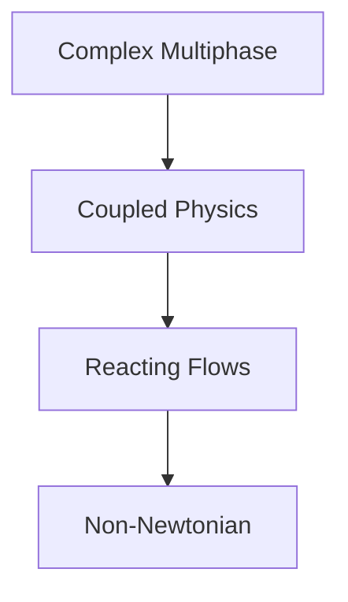

# 🗺️ Learning Navigator: Advanced Physics

> เส้นทางการเรียนรู้สำหรับ Advanced Physics ใน OpenFOAM

---

## 📋 สารบัญ

1. [Complex Multiphase Phenomena](#1-complex-multiphase-phenomena)
2. [Coupled Physics](#2-coupled-physics)
3. [Reacting Flows](#3-reacting-flows)
4. [Non-Newtonian Fluids](#4-non-newtonian-fluids)

---

## 1. Complex Multiphase Phenomena

> **Domain:** Phase Change, Cavitation, Population Balance

| เนื้อหา | คำอธิบาย |
|--------|----------|
| [00_Overview](CONTENT/01_COMPLEX_MULTIPHASE_PHENOMENA/00_Overview.md) | ภาพรวม |
| [01_Phase_Change_Modeling](CONTENT/01_COMPLEX_MULTIPHASE_PHENOMENA/01_Phase_Change_Modeling.md) | Phase Change Modeling |
| [02_Cavitation_Modeling](CONTENT/01_COMPLEX_MULTIPHASE_PHENOMENA/02_Cavitation_Modeling.md) | Cavitation |
| [03_Population_Balance_Modeling](CONTENT/01_COMPLEX_MULTIPHASE_PHENOMENA/03_Population_Balance_Modeling.md) | Population Balance |

---

## 2. Coupled Physics

> **Domain:** Multi-Region, CHT, FSI

| เนื้อหา | คำอธิบาย |
|--------|----------|
| [00_Overview](CONTENT/02_COUPLED_PHYSICS/00_Overview.md) | ภาพรวม |
| [01_Fundamentals](CONTENT/02_COUPLED_PHYSICS/01_Coupled_Physics_Fundamentals.md) | Fundamentals |
| [02_CHT](CONTENT/02_COUPLED_PHYSICS/02_Conjugate_Heat_Transfer.md) | Conjugate Heat Transfer |
| [03_FSI](CONTENT/02_COUPLED_PHYSICS/03_Fluid_Structure_Interaction.md) | Fluid-Structure Interaction |
| [04_Registry](CONTENT/02_COUPLED_PHYSICS/04_Object_Registry_Architecture.md) | Object Registry |
| [05_Advanced](CONTENT/02_COUPLED_PHYSICS/05_Advanced_Coupling_Topics.md) | Advanced Topics |
| [06_Validation](CONTENT/02_COUPLED_PHYSICS/06_Validation_and_Benchmarks.md) | Validation |
| [07_Exercises](CONTENT/02_COUPLED_PHYSICS/07_Exercises.md) | Exercises |

---

## 3. Reacting Flows

> **Domain:** Combustion, Chemistry, Species Transport

| เนื้อหา | คำอธิบาย |
|--------|----------|
| [00_Overview](CONTENT/03_REACTING_FLOWS/00_Overview.md) | ภาพรวม |
| [01_Fundamentals](CONTENT/03_REACTING_FLOWS/01_Reacting_Flow_Fundamentals.md) | Fundamentals |
| [02_Species_Transport](CONTENT/03_REACTING_FLOWS/02_Species_Transport.md) | Species Transport |
| [03_Chemistry_Models](CONTENT/03_REACTING_FLOWS/03_Chemistry_Models.md) | Chemistry Models |
| [04_Combustion](CONTENT/03_REACTING_FLOWS/04_Combustion_Models.md) | Combustion Models |
| [05_Chemkin](CONTENT/03_REACTING_FLOWS/05_Chemkin_Parsing.md) | Chemkin |
| [06_Workflow](CONTENT/03_REACTING_FLOWS/06_Practical_Workflow.md) | Practical Workflow |

---

## 4. Non-Newtonian Fluids

> **Domain:** Rheology, Viscosity Models

| เนื้อหา | คำอธิบาย |
|--------|----------|
| [00_Overview](CONTENT/04_NON_NEWTONIAN_FLUIDS/00_Overview.md) | ภาพรวม |
| [01_Fundamentals](CONTENT/04_NON_NEWTONIAN_FLUIDS/01_Non_Newtonian_Fundamentals.md) | Fundamentals |
| [02_Viscosity_Models](CONTENT/04_NON_NEWTONIAN_FLUIDS/02_Viscosity_Models.md) | Viscosity Models |
| [03_Architecture](CONTENT/04_NON_NEWTONIAN_FLUIDS/03_OpenFOAM_Architecture.md) | Architecture |
| [04_Implementation](CONTENT/04_NON_NEWTONIAN_FLUIDS/04_Numerical_Implementation.md) | Implementation |
| [05_Practical](CONTENT/04_NON_NEWTONIAN_FLUIDS/05_Practical_Usage.md) | Practical Usage |

---

## 🎯 Learning Path

---

*Last Updated: 2025-12-28*
