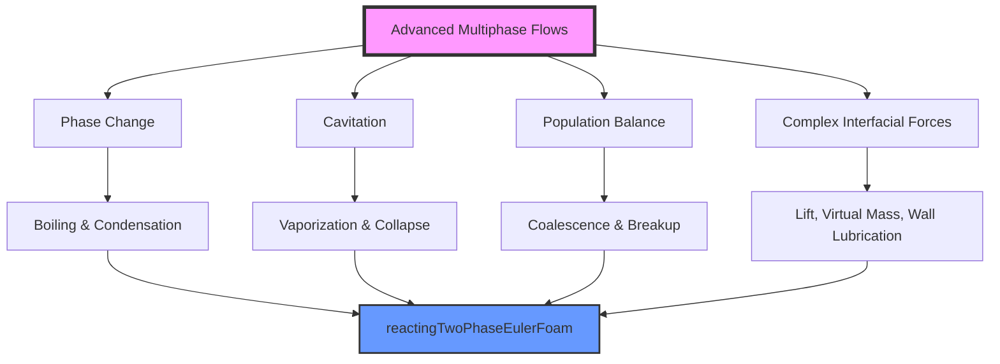

# 01_ADVANCED_MULTIPHASE_FLOWS

# การไหลแบบหลายเฟสขั้นสูงใน OpenFOAM

## 🎯 วัตถุประสงค์

โมดูลนี้ครอบคลุม**ปรากฏการณ์การไหลของหลายเฟสขั้นสูง**ที่เกินกว่าการจำลองแบบ Eulerian-Eulerian พื้นฐาน รวมถึง**การเปลี่ยนสถานะเฟส**, **การเกิดโพรง (Cavitation)**, **สมดุลประชากร (Population Balance)** และ**พลวัตของอินเตอร์เฟซที่ซับซ้อน** ปรากฏการณ์เหล่านี้มีความสำคัญอย่างยิ่งในกระบวนการทางอุตสาหกรรมที่ความสัมพันธ์ระหว่างเฟส พลวัตของอินเตอร์เฟซ และผลกระทบทางเทอร์โมไดนามิกส์เป็นตัวควบคุมพฤติกรรมของระบบ


> **Figure 1:** แผนภาพแสดงภาพรวมของปรากฏการณ์การไหลหลายเฟสขั้นสูงและกลไกทางฟิสิกส์ที่เกี่ยวข้อง ซึ่งบูรณาการเข้ากับตัวแก้สมการ `reactingTwoPhaseEulerFoam` เพื่อจัดการกับปัญหาการเปลี่ยนสถานะเฟสและพลวัตของอนุภาคที่ซับซ้อน


## 🎓 ผลการเรียนรู้

เมื่อสิ้นสุดโมดูลนี้ คุณจะมีความสามารถในด้านต่างๆ ดังนี้:

1. **Model Phase Change**: เข้าใจเทอร์โมไดนามิกของการเปลี่ยนสถานะ และสามารถใช้แบบจำลอง Hertz-Knudsen หรือ Lee สำหรับการเดือดและการควบแน่น
2. **Simulate Cavitation**: กำหนดค่าและปรับแต่งแบบจำลอง Schnerr-Sauer, Kunz หรือ Merkle สำหรับระบบไฮดรอลิก
3. **Apply Population Balance Equations (PBE)**: ใช้ระเบียบวิธีโมเมนต์ (Method of Moments) หรือ Class Method เพื่อพยากรณ์การกระจายขนาดของฟองหรืออนุภาค
4. **Master Complex Forces**: ใช้งานแรงการกระจายแบบปั่นป่วน (Turbulent Dispersion), การหล่อลื่นผนัง (Wall Lubrication), มวลเสมือน (Virtual Mass) และแรงยก (Lift)
5. **Eulerian-Eulerian Multi-fluid Modeling**: เข้าใจกรอบงานทางคณิตศาสตร์และความสัมพันธ์การปิด (Closure Relations) สำหรับระบบหลายเฟสที่หนาแน่น
6. **Analyze Numerical Challenges**: รับมือกับปัญหาเสถียรภาพเชิงตัวเลข, การรักษาความคมของอินเตอร์เฟซ และข้อจำกัดของอัตราส่วนความหนาแน่นสูง

## 📚 แผนผังการเรียนรู้

เนื้อหาถูกจัดเรียงตามหัวข้อทางเทคนิคเพื่อนำคุณจากพื้นฐานฟิสิกส์ของการเปลี่ยนสถานะไปจนถึงตัวแก้ปัญหาที่เชื่อมโยงกันอย่างซับซ้อน

| ลำดับ | หัวข้อ | รายละเอียด |
| :--- | :--- | :--- |
| **01** | [Phase Change Modeling](./01_Phase_Change_Modeling.md) | ฟิสิกส์ของการเดือดและการควบแน่น, แบบจำลอง Hertz-Knudsen และ Lee |
| **02** | [Cavitation Modeling](./02_Cavitation_Modeling.md) | กลไกการเกิดโพรง, แบบจำลอง Schnerr-Sauer, Kunz และ Merkle |
| **03** | [Population_Balance_Modeling](./03_Population_Balance_Modeling.md) | สมการ PBE, QMOM, การรวมตัว (Coalescence) และการแตกตัว (Breakup) |
| **04** | [Complex Interfacial Forces](./04_Complex_Interfacial_Forces.md) | แรงยก, มวลเสมือน, การหล่อลื่นผนัง และการกระจายแบบปั่นป่วน |
| **05** | [Eulerian Multiphase Solvers](./05_Eulerian_Multiphase_Solvers.md) | โครงสร้างของ `reactingTwoPhaseEulerFoam` และความสัมพันธ์การปิด |
| **06** | [Numerical Methods & VOF](./06_Numerical_Methods_and_VOF.md) | อัลกอริทึม MULES, การบีบอัดอินเตอร์เฟซ และเสถียรภาพเชิงตัวเลข |

## ⏱️ ระยะเวลาการเรียนโดยประมาณ

- **ทฤษฎีหลัก**: 4-5 ชั่วโมง
- **การใช้งานใน OpenFOAM**: 2-3 ชั่วโมง
- **แบบฝึกหัดและการปฏิบัติ**: 4-5 ชั่วโมง
- **รวมทั้งหมด**: **10-13 ชั่วโมง**

## 🔗 ข้อกำหนดเบื้องต้น

- พื้นฐาน CFD (Module 01) และ Finite Volume Method (Module 02)
- ความเข้าใจโครงสร้าง Case ของ OpenFOAM (Module 02)
- ประสบการณ์กับ Solver พื้นฐาน เช่น `interFoam` หรือ `multiphaseEulerFoam`
- ความรู้พื้นฐานด้านเทอร์โมไดนามิกและการถ่ายโอนมวล

## 🔬 การประยุกต์ใช้ในอุตสาหกรรม

- **พลังงาน**: การเดือดและการควบแน่นในเครื่องปฏิกรณ์นิวเคลียร์และเครื่องแลกเปลี่ยนความร้อน
- **ยานยนต์/อวกาศ**: การฉีดเชื้อเพลิงและการเกิด Cavitation ในปั๊ม
- **เคมี**: เครื่องปฏิกรณ์คอลัมน์ฟอง (Bubble Columns) และ Slurry Reactors
- **สิ่งแวดล้อม**: การขนส่งตะกอนและการจัดการน้ำเสีย

---

## 1. การจำลองการเปลี่ยนสถานะเฟส

**การเปลี่ยนสถานะเฟส** (Phase Change) เป็นปรากฏการณ์ทางกายภาพที่สำคัญในระบบหลายเฟส ประกอบด้วยการเดือด (boiling) และการควบแน่น (condensation)

### สมการพื้นฐานการเปลี่ยนสถานะ

$$
\dot{m}'' = \frac{h_{lv}}{T_{sat}} \left( \frac{q''}{h_{lv}} + \frac{\alpha_l \rho_l (T_l - T_{sat})}{\Delta t} \right)
$$

**ตัวแปรในสมการ:**
- $\dot{m}'':$ อัตราการเปลี่ยนสถานะต่อพื้นที่ ($kg/m^2s$)
- $h_{lv}:$ ความร้อนซ่อนของการกลั่น ($J/kg$)
- $T_{sat}:$ อุณหภูมิแบ่งเฟส ($K$)
- $q'':$ อัตราการถ่ายโอนความร้อน ($W/m^2$)
- $\alpha_l:$ สัดส่วนระดับของเหลว
- $\rho_l:$ ความหนาแน่นของเหลว ($kg/m^3$)
- $T_l:$ อุณหภูมิของเหลว ($K$)
- $\Delta t:$ ช่วงเวลา ($s$)

### OpenFOAM Code Implementation

```cpp
// การคำนวณอัตราการเปลี่ยนสถานะ
volScalarField mDotL
(
    "mDotL",
    hLv_/Tsat_ * (qDot_/hLv_ + alphaL_*rhoL_*(TL_-Tsat_)/deltaT_)
);
```

---

## 2. การจำลองแควิเทชัน

**แควิเทชัน** เป็นปรากฏการณ์ที่เกิดฟองก๊าซในของเหลวเมื่อความดันลดลงต่ำกว่าความดันไอ

### โมเดลการแควิเทชันที่ใช้ใน OpenFOAM

| โมเดล | สมการ | การประยุกต์ใช้ |
|---------|--------|--------------|
| Schnerr-Sauer | $R = \left(\frac{3\alpha_v}{4\pi}\right)^{1/3} \frac{1}{n_b}$ | ระบบไฮดรอลิกความเร็วสูง |
| Kunz | $C_{c} = \frac{(1 - \alpha_v^2)}{t_{\infty}}$ | อุปกรณ์ระบายน้ำ |
| Merkle | $C_{c} = \frac{C_{dest} \max(p_v - p, 0)^2}{\rho_l U_{\infty}^2}$ | ทัวร์ไบน์ไฮดรอลิก |

### การ Implement โมเดล Schnerr-Sauer

$$
R = \left(\frac{3\alpha_v}{4\pi n_b}\right)^{1/3}
$$

**ตัวแปร:**
- $R$: รัศมีฟอง ($m$)
- $\alpha_v$: สัดส่วนระดับไอ
- $n_b$: ความหนาแน่นจำนวนฟอง ($1/m^3$)

```cpp
// คำนวณรัศมีฟอง Schnerr-Sauer
volScalarField bubbleRadius
(
    max
    (
        pow((3*alphaV_)/(4*constant::mathematical::pi*nBubbles_), 1.0/3.0),
        dimensionedScalar("minR", dimLength, 1e-6)
    )
);
```

---

## 3. การจำลองสมดุลประชากร

**สมการสมดุลประชากร** (Population Balance Equation) ใช้ในการจำลองการกระจายขนาดของฟองหรืออนุภาค

### สมการทั่วไป

$$
\frac{\partial n}{\partial t} + \nabla \cdot (n \mathbf{u}) = B - D
$$

**ตัวแปร:**
- $n$: ฟังก์ชันความหนาแน่นจำนวน ($1/m^4$)
- $\mathbf{u}$: เวกเตอร์ความเร็ว ($m/s$)
- $B$: อัตราการเกิด (birth rate) ($1/m^3s$)
- $D$: อัตราการตาย (death rate) ($1/m^3s$)

### วิธีโมเมนต์ (Method of Moments)

**ขั้นตอนการ implement:**
1. กำหนดฟังก์ชันโมเมนต์: $M_k = \int_0^{\infty} L^k n(L) dL$
2. พัฒนาสมการการถ่ายโอนสำหรับโมเมนต์แต่ละตัว
3. ปิดระบบสมการโดยใช้สมมติฐานการกระจายขนาด

```cpp
// การคำนวณโมเมนต์ที่ k
Mk[k] = fvc::domainIntegrate(Lk[k]*n).value();
```

---

## 4. แรงอินเตอร์เฟสเชิงซ้อน

### 4.1 แรงอินเตอร์เฟสแบบทัวร์บูลเลนท์

**แรงอินเตอร์เฟสแบบทัวร์บูลเลนท์** มีผลต่อการเคลื่อนที่ของฟองในกระแสทัวร์บูลเลนท์

$$
\mathbf{F}_{TI} = C_{TD} \rho_c \epsilon^{2/3} d_b^{5/3}
$$

### 4.2 แรงหล่อลื่นผนัง

**แรงหล่อลื่นผนัง** เกิดขึ้นเมื่อฟองใกล้พื้นผิว

$$
\mathbf{F}_{WL} = -\mu \frac{\mathbf{u}_b - \mathbf{u}_w}{y^2}
$$

### 4.3 แรงมวลเสมือน

**แรงมวลเสมือน** (Virtual Mass Force) เกิดจากการเร่งความเร็วสัมพัทธ์ระหว่างเฟส

$$
\mathbf{F}_{VM} = C_{VM} \rho_c V_b \left(\frac{\partial \mathbf{u}_c}{\partial t} - \frac{\partial \mathbf{u}_d}{\partial t}\right)
$$

**ตัวแปร:**
- $C_{TD}$: สัมประสิทธิ์การกระจายทัวร์บูลเลนท์
- $\rho_c$: ความหนาแน่นของเฟสต่อเนื่อง
- $\epsilon$: อัตราการสลายตัวของพลังงานทัวร์บูลเลนท์
- $d_b$: เส้นผ่านศูนย์กลางฟอง
- $\mu$: ความหนืดพลศาสตร์
- $y$: ระยะห่างจากผนัง

---

## 5. โมเดลหลายไหล

### เฟรมเวิร์กยูเลอเรียนแบบหลายไหล

**โมเดลยูเลอเรียนแบบหลายไหล** (Multi-Fluid Eulerian) แก้สมการการถ่ายโอนสำหรับแต่ละเฟส

### สมการความต่อเนื่องสำหรับเฟส k

$$
\frac{\partial}{\partial t}(\alpha_k \rho_k) + \nabla \cdot (\alpha_k \rho_k \mathbf{u}_k) = \sum_{j=1}^{N} \dot{m}_{jk}
$$

### สมการโมเมนตัมสำหรับเฟส k

$$
\frac{\partial}{\partial t}(\alpha_k \rho_k \mathbf{u}_k) + \nabla \cdot (\alpha_k \rho_k \mathbf{u}_k \mathbf{u}_k) = -\alpha_k \nabla p_k + \nabla \cdot \boldsymbol{\tau}_k + \alpha_k \rho_k \mathbf{g} + \mathbf{M}_k
$$

**ตัวแปร:**
- $\alpha_k$: สัดส่วนระดับของเฟส k
- $\rho_k$: ความหนาแน่นของเฟส k
- $\mathbf{u}_k$: เวกเตอร์ความเร็วของเฟส k
- $p_k$: ความดันของเฟส k
- $\boldsymbol{\tau}_k$: เทนเซอร์ความเค้นของเฟส k
- $\mathbf{g}$: เวกเตอร์ความโน้มถ่วง
- $\mathbf{M}_k$: เทอมการแลกเปลี่ยนโมเมนตัมระหว่างเฟส

### ระบบโพลิไดสเปิร์ส

**โพลิไดสเปิร์ส** (Polydisperse) คือระบบที่มีการกระจายขนาดของอนุภาคหรือฟอง

```cpp
// การจัดการกับการกระจายขนาดแบบ polydisperse
PtrList<populationBalanceModel> popBalances(populationBalanceModelsNames.size());
forAll(popBalances, i)
{
    popBalances.set
    (
        i,
        populationBalanceModel::New
        (
            populationBalanceModelsNames[i],
            *this
        ).ptr()
    );
}
```

---

## 6. การไหลของอนุภาคหนาแน่น

### ทฤษฎีจลน์ของการไหลแบบเกรนูลาร์

**ทฤษฎีจลน์แบบเกรนูลาร์** (Kinetic Theory of Granular Flow) ใช้ในการจำลองพฤติกรรมของอนุภาคแข็งในระบบหลายเฟส

### สมการการไหลของอนุภาคหนาแน่น

$$
\rho_p \frac{\partial \mathbf{u}_p}{\partial t} + \rho_p (\mathbf{u}_p \cdot \nabla) \mathbf{u}_p = -\nabla p_p - \nabla \cdot \boldsymbol{\tau}_p + \beta (\mathbf{u}_g - \mathbf{u}_p) + \rho_p \mathbf{g}
$$

### แบบจำลองความเค้นและความหนืด

$$
\boldsymbol{\tau}_p = \mu_p (\nabla \mathbf{u}_p + (\nabla \mathbf{u}_p)^T) - \frac{2}{3} (\mu_p + \lambda_p) (\nabla \cdot \mathbf{u}_p) \mathbf{I}
$$

**ตัวแปร:**
- $\rho_p$: ความหนาแน่นอนุภาค ($kg/m^3$)
- $\mathbf{u}_p$: เวกเตอร์ความเร็วอนุภาค ($m/s$)
- $p_p$: ความดันของเฟสอนุภาค ($Pa$)
- $\mu_p$: ความหนืดของเฟสอนุภาค ($Pa \cdot s$)
- $\lambda_p$: ความหนืดลัมพ์ของเฟสอนุภาค ($Pa \cdot s$)
- $\beta$: สัมประสิทธิ์การแลกเปลี่ยนโมเมนตัมระหว่างเฟส ($kg/m^3s$)
- $\mathbf{u}_g$: เวกเตอร์ความเร็วของเหลว ($m/s$)

---

## 7. การไหลแบบหลายเฟสที่ไม่ใช่ไอโซเทอร์มัล

### การเชื่อมโยงสมการพลังงานและความร้อนอินเตอร์เฟส

**การไหลแบบไม่ใช่ไอโซเทอร์มัล** ต้องพิจารณาการถ่ายโอนความร้อนระหว่างเฟส

### สมการพลังงานสำหรับเฟส k

$$
\frac{\partial}{\partial t}(\alpha_k \rho_k h_k) + \nabla \cdot (\alpha_k \rho_k \mathbf{u}_k h_k) = \alpha_k \frac{\partial p_k}{\partial t} + \nabla \cdot (\alpha_k k_k \nabla T_k) + Q_{k} + Q_{ik}
$$

**ตัวแปร:**
- $h_k$: เอนทาลปีของเฟส k ($J/kg$)
- $k_k$: ค่าสัมประสิทธิ์การนำความร้อนของเฟส k ($W/mK$)
- $T_k$: อุณหภูมิของเฟส k ($K$)
- $Q_k$: แหล่งความร้อนภายในของเฟส k ($W/m^3$)
- $Q_{ik}$: การถ่ายโอนความร้อนระหว่างเฟส ($W/m^3$)

### การถ่ายโอนความร้อนอินเตอร์เฟส

$$
Q_{ik} = h_{ik} A_{ik} (T_i - T_k)
$$

**ตัวแปร:**
- $h_{ik}$: สัมประสิทธิ์การถ่ายโอนความร้อนระหว่างเฟส i และ k ($W/m^2K$)
- $A_{ik}$: พื้นที่อินเตอร์เฟสระหว่างเฟส i และ k ($m^2/m^3$)

---

## 8. วิธีการเชิงตัวเลขขั้นสูง

### 8.1 วิธีการจับอินเตอร์เฟส

**VOF (Volume of Fluid) Method**
- ใช้ฟังก์ชันสี $\alpha$ สำหรับการกำหนดตำแหน่งอินเตอร์เฟส
- $0 \leq \alpha \leq 1$ โดย $\alpha = 0$ สำหรับเฟส 1 และ $\alpha = 1$ สำหรับเฟส 2

**Level Set Method**
- ใช้ฟังก์ชันระยะทาง $\phi$ โดย $\phi = 0$ บนอินเตอร์เฟส
- $\phi > 0$ สำหรับเฟส 1 และ $\phi < 0$ สำหรับเฟส 2

### 8.2 เสถียรภาพและการลู่เข้า

**เงื่อนไข CFL สำหรับโมเดลหลายเฟส**

$$
CFL = \frac{\max(|\mathbf{u}_k|) \Delta t}{\Delta x} \leq CFL_{max}
$$

**การเพิ่มความเสถียร:**
- ใช้ under-relaxation สำหรับสมการโมเมนตัม
- จำกัดความเร็วสัมพัทธ์ระหว่างเฟส
- ใช้ numerical diffusion สำหรับการจับอินเตอร์เฟส

---

## 9. การตรวจสอบและการตรวจสอบความถูกต้อง

### กรณีเบนช์มาร์ก

| กรณีเบนช์มาร์ก | ปรากฏการณ์ | เป้าหมายการตรวจสอบ |
|-------------------|-------------|---------------------|
| การเดือดในท่อตรง | การเปลี่ยนสถานะแบบนิวเคลียร์ | อัตราการเดือด |
| การไหลของฟองในคอลัมน์ | การไหลแบบบับเบิล | การกระจายขนาดฟอง |
| การแควิเทชันในไฮดรอลิก | การเกิดและการสลายตัวของฟอง | ความดันแควิเทชัน |

### เทคนิคการเปรียบเทียบทดลอง

1. **การวัดเวลาเฉลี่ย (Time-averaging)**
   - ใช้สำหรับปรากฏการณ์สถิต
   - ลดผลของความไม่เสถียรเชิงตัวเลข

2. **การวิเคราะห์สเปกตรัม (Spectral Analysis)**
   - ตรวจสอบความถี่ของความไม่เสถียร
   - ระบุโหมดการแกว่งที่โดดเด่น

---

## 10. การประยุกต์ใช้ในอุตสาหกรรม

### 10.1 ระบบพลังงาน

- **โรงไฟฟ้าพลังความร้อน**: การเดือดในเตาไฟและหม้อน้ำ
- **ระบบนิวเคลียร์**: การไหลแบบสองเฟสในแกนเครื่องปฏิกรณ์
- **ระบบพลังงานแสงอาทิตย์**: การไหลของเกลือหลอมเหลว

### 10.2 การประมวลผลทางเคมี

- **หอกลั่น**: การไหลแบบสองเฟสและการถ่ายโอนมวล
- **เครื่องปฏิกรณ์**: ปฏิกิริยาหลายเฟสและการผสม
- **เครื่องดูดซับ**: การไหลของของเหลวและก๊าซ

### 10.3 การประยุกต์ใช้ด้านสิ่งแวดล้อม

- **ระบบบำบัดน้ำ**: การไหลแบบสองเฟสในอากาศ
- **การขนส่งน้ำมัน**: การไหลแบบสามเฟสในท่อ
- **การดักจับคาร์บอน**: การไหลเพื่อการซึมซับ

---

## 11. กรณีศึกษา

### 11.1 การเดือดในไมโครช่องทาง

**การตั้งค่า:**
- ช่องทางที่มีขนาด $50 \mu m \times 50 \mu m \times 1 mm$
- ความร้อนจากผนังคงที่: $100 kW/m^2$
- ของเหลว: น้ำที่ความดันบรรยากาศ

**ผลลัพธ์:**
- การเดือดแบบนิวเคลียร์สามารถจำลองได้อย่างถูกต้อง
- อัตราความร้อนวิกฤตเกิดขึ้นที่ $q''_{crit} \approx 1.2 MW/m^2$

### 11.2 ปั๊มแควิเทต

**พารามิเตอร์:**
- ความเร็วหมุน: $3000$ rpm
- อัตราส่วนความดัน: $8:1$
- ของเหลว: น้ำที่ $20°C$

**การวิเคราะห์:**
- แควิเทชันเกิดขึ้นที่ส่วนนำเข้าของใบพัด
- ประสิทธิภาพลดลง $15\%$ เมื่อ NPSH ต่ำกว่าค่าวิกฤต

### 11.3 เครื่องปฏิกรณ์เตียงลอยตัว

**เงื่อนไขการทำงาน:**
- อุณหภูมิ: $320°C$
- ความดัน: $15$ MPa
- สิ่งทรงกลม: อัลคาไทต์ขนาด $6$ mm

**ปรากฏการณ์ที่สำคัญ:**
- การเดือดแบบฟิล์มที่ผิวสิ่งทรงกลม
- การเคลื่อนที่แบบลอยตัวและการไหลเวียน

---

## 12. แบบฝึกหัดเชิงปฏิบัติ

### บทช่วยสอนที่ 1: การเดือดในช่องทางแนวตั้ง

**ขั้นตอน:**
1. สร้างเรขาคณิตด้วย blockMesh
2. ตั้งค่าเงื่อนไขขอบเขตสำหรับความร้อน
3. กำหนดโมเดลการเปลี่ยนสถานะ
4. กำหนดโมเดลความร้อนอินเตอร์เฟส
5. รันการจำลองและวิเคราะห์ผลลัพธ์

### บทช่วยสอนที่ 2: การไหลของฟองแบบลูกฟอง

**การ implement:**
```bash
# สร้างเคสสำหรับการไหลของฟอง
cp -r $FOAM_TUTORIALS/multiphase/multiphaseEulerFoam/bubbleColumn bubbleColumnCase
cd bubbleColumnCase
# แก้ไขการตั้งค่าตามความต้องการ
blockMesh
multiphaseEulerFoam
```

### บทช่วยสอนที่ 3: การแควิเทชันในไฮดรอลิก

**การเพิ่มโมเดลแควิเทชัน:**
```cpp
// ใน constant/transportProperties
phase1
{
    type            cavitationModel;
    cavitationModel SchnerrSauer;
    SchnerrSauerCoeffs
    {
        nBubbles     1e13;
        pSat         2300;
        dNucleation  1e-6;
    }
}
```

---

## 13. แนวปฏิบัติที่ดีและการแก้ปัญหา

### ปัญหาทั่วไบที่พบ

| ปัญหา | สาเหตุ | การแก้ไข |
|--------|--------|------------|
| การไม่ลู่เข้าของการจำลอง | เงื่อนไขเริ่มต้นไม่ดี | ใช้การค่อยๆ ปรับค่า |
| การสั่นของความดัน | การจับอินเตอร์เฟสที่ไม่ดี | เพิ่ม compression factor |
| ปัญหาความเร็วสูงเกินไป | การเสียดสีมากเกินไป | ปรับความหนืดของอินเตอร์เฟส |

### กลยุทธ์การเพิ่มประสิทธิภาพ

1. **การปรับแต่ง mesh**
   - ใช้ mesh ละเอียดใกล้อินเตอร์เฟส
   - ใช้ adaptive mesh refinement

2. **การเลือกโมเดลทางกายภาพที่เหมาะสม**
   - พิจารณาความเร็วสัมพัทธ์ระหว่างเฟส
   - เลือกโมเดลความหนืดตามรีโนลด์ส์

3. **การปรับแต่ง solver**
   - ใช้รูปแบบการจัดลำดับที่เหมาะสม
   - ปรับค่า under-relaxation

4. **การตรวจสอบความถูกต้อง**
   - ทำการตรวจสอบความสมดุลมวล
   - ตรวจสอบสมการพลังงานรวม
