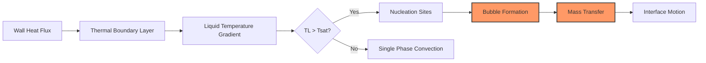
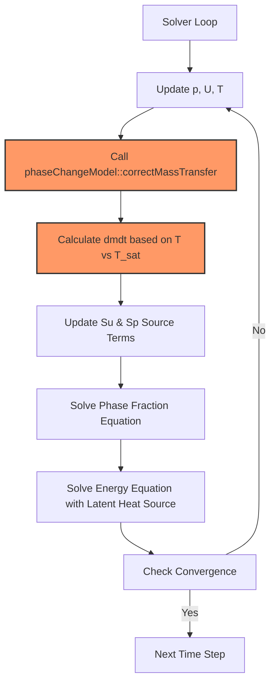

# Phase Change Modeling in OpenFOAM

> [!INFO] Overview
> This note covers the ==fundamental physics and numerical implementation== of phase change phenomena in OpenFOAM, including **boiling**, **condensation**, and **cavitation**. These processes are essential for industrial applications ranging from power generation to chemical processing.

---

## 1. Introduction

**Phase change** refers to the transformation of matter between different states (solid-liquid-gas), characterized by:
- **Latent heat effects** during transformation
- **Discontinuous property changes** at phase boundaries
- **Mass transfer** driven by thermodynamic non-equilibrium

### Key Applications

| Industry | Phase Change Phenomena | Critical Concerns |
|----------|----------------------|-------------------|
| **Power Generation** | Boiling in boilers, condensation in turbines | Heat transfer efficiency |
| **Chemical Processing** | Evaporation, crystallization | Product quality control |
| **Nuclear Safety** | Coolant boiling, emergency condensation | Safety margins |
| **Aerospace** | Fuel cavitation, cryogenic phase change | System reliability |
| **Oil & Gas** | Multiphase flow in wells, separation | Flow assurance |

---

## 2. Thermodynamic Fundamentals

### 2.1 Saturation Conditions

Phase change occurs under saturation conditions when the phase temperature reaches the saturation temperature $T_{sat}$ at the local pressure $p$:

$$T_{sat} = f(p)$$

The **Clausius-Clapeyron equation** governs the pressure-temperature dependence along the phase boundary:

$$\frac{\mathrm{d}p}{\mathrm{d}T} = \frac{L}{T\Delta v} \tag{2.1}$$

**Variables:**
- $L$: Latent heat of vaporization $[J/kg]$
- $T$: Absolute temperature $[K]$
- $\Delta v$: Specific volume change $[m^3/kg]$
- $\mathrm{d}p/\mathrm{d}T$: Slope of the saturation curve

### 2.2 Energy Balance at Interface

**Stefan Condition:** The interface velocity is governed by energy balance:

$$\rho_L v_{interface} = -k_L \left.\frac{\partial T}{\partial n}\right|_L + k_V \left.\frac{\partial T}{\partial n}\right|_V \tag{2.2}$$

**Variables:**
- $v_{interface}$: Interface velocity $[m/s]$
- $k_L, k_V$: Thermal conductivities $[W/(m·K)]$
- $\partial T/\partial n$: Temperature gradient normal to interface
- $\rho_L$: Liquid density $[kg/m^3]$

**Heat Flux Balance:**

$$q_l'' - q_v'' = \dot{m}'' h_{lv} \tag{2.3}$$

During boiling, the latent heat of vaporization $h_{lv}$ drives the phase transformation:

$$\dot{m}'' = \frac{q''}{h_{lv}} \tag{2.4}$$


> **Figure 1:** แผนภาพแสดงกระบวนการเกิดการเดือดตั้งแต่การรับความร้อนที่ผนังจนถึงการเคลื่อนที่ของส่วนต่อประสานระหว่างเฟสเนื่องจากการถ่ายโอนมวล


---

## 3. Mass Transfer Models

### 3.1 Hertz-Knudsen Model

Based on kinetic theory of gases, this model describes evaporation/condensation rates through pressure differences:

$$\dot{m}'' = \sqrt{\frac{M}{2\pi R T_{sat}}} \left(\frac{p_{sat}(T_l) - p_v}{\sqrt{T_l}} - \frac{p_v - p_{sat}(T_v)}{\sqrt{T_v}}\right) \tag{3.1}$$

**Assumptions:**
- Molecular collisions at interface
- Maxwell-Boltzmann velocity distribution
- No interface resistance (ideal conditions)

**Variables:**
- $M$: Molecular weight $[kg/mol]$
- $R$: Universal gas constant $[J/(mol·K)]$
- $p_{sat}(T)$: Saturation pressure $[Pa]$
- $T_l, T_v$: Liquid and vapor temperatures $[K]$
- $p_v$: Vapor pressure $[Pa]$

### 3.2 Schrage Model

Extends Hertz-Knudsen to include **accommodation coefficient** $\sigma$ for non-ideal interfaces:

$$\dot{m}'' = \frac{2\sigma}{2-\sigma} \sqrt{\frac{M}{2\pi R T_{sat}}} \left(p_{sat}(T_l) - p_v\right) \tag{3.2}$$

**Variables:**
- $\sigma$: Accommodation coefficient ($0 < \sigma \leq 1$)

The accommodation coefficient accounts for:
- Surface roughness effects
- Molecular-interface interactions
- Non-equilibrium thermodynamic effects

### 3.3 Lee Model (Semi-Empirical)

Most popular in CFD due to **numerical stability**:

**Evaporation ($T_l > T_{sat}$):**
$$\dot{m}'' = r \alpha_l \rho_l \frac{T_l - T_{sat}}{T_{sat}} \tag{3.3a}$$

**Condensation ($T_v < T_{sat}$):**
$$\dot{m}'' = r \alpha_v \rho_v \frac{T_{sat} - T_v}{T_{sat}} \tag{3.3b}$$

**Variables:**
- $r$: Relaxation coefficient (typically $0.1$ to $1000$)
- $\alpha_l, \alpha_v$: Liquid and vapor volume fractions
- $\rho_l, \rho_v$: Densities $[kg/m^3]$

> [!TIP] Implementation Note
> The relaxation coefficient $r$ requires careful tuning:
> - **Too small**: Excessive numerical diffusion at interface
> - **Too large**: Instability and stiffness issues
> - **Typical range**: $0.1 - 100$ depending on time step and mesh resolution

### 3.4 Interfacial Temperature Calculation

The interfacial temperature $T_{int}$ is determined from energy balance:

$$k_l \frac{\partial T_l}{\partial n}\bigg|_{int} - k_v \frac{\partial T_v}{\partial n}\bigg|_{int} = \dot{m}'' h_{lv} \tag{3.4}$$

**Iterative Algorithm:**
1. Assume interfacial temperature
2. Calculate mass transfer rate using kinetic model
3. Update interfacial temperature from energy balance
4. Iterate until convergence

---

## 4. Nucleation and Bubble Dynamics

### 4.1 Nucleation Types

**Homogeneous Nucleation:**
- Occurs in bulk liquid without surface assistance
- Requires significant superheat $\Delta T = T - T_{sat}$
- Nucleation rate $J$ (nuclei per volume per time):

$$J = J_0 \exp\left(-\frac{16\pi \sigma^3 v_l^2}{3k_B T (\Delta T)^2 h_{lv}^2}\right) \tag{4.1}$$

**Heterogeneous Nucleation:**
- Occurs at surface imperfections
- Lower energy barrier via contact angle $\theta$
- Critical radius $r_c$ and nucleation barrier $\Delta G^*$:

$$r_c = \frac{2\sigma T_{sat}}{h_{lv} \rho_v \Delta T} \tag{4.2a}$$

$$\Delta G^* = \frac{16\pi\sigma^3 v_l^2}{3 h_{lv}^2} f(\theta) \tag{4.2b}$$

where $f(\theta) = \frac{1}{4}(2+\cos\theta)(1-\cos\theta)^2$

**Variables:**
- $\sigma$: Surface tension $[N/m]$
- $v_l$: Liquid specific volume $[m^3/kg]$
- $k_B$: Boltzmann constant $[J/K]$
- $J_0$: Pre-exponential factor (~$10^{35}$ $m^{-3}s^{-1}$)

### 4.2 Bubble Growth (Rayleigh-Plesset Equation)

Describes bubble radius evolution $R(t)$ under pressure difference:

$$\rho_l \left(R\ddot{R} + \frac{3}{2}\dot{R}^2\right) = p_v - p_{\infty} - \frac{2\sigma}{R} - 4\mu_l \frac{\dot{R}}{R} \tag{4.3}$$

**Variables:**
- $R$: Bubble radius $[m]$
- $p_v$: Vapor pressure in bubble $[Pa]$
- $p_{\infty}$: Far-field pressure $[Pa]$
- $\mu_l$: Liquid viscosity $[Pa·s]$

**Simplified Growth Regimes:**

| Mechanism | Controlling Factor | Scaling Law |
|-----------|-------------------|-------------|
| **Heat-transfer controlled** | Liquid thermal conductivity | $R(t) \propto \sqrt{\alpha_l t}$ |
| **Inertia controlled** | Liquid inertia | $R(t) \propto t^{1/2}$ |
| **Diffusion controlled** | Mass transfer | $R(t) \propto t^{1/3}$ |

### 4.3 Population Balance Connection

For bubble populations, the **Population Balance Equation (PBE)** describes size distribution evolution $n(R,t)$:

$$\frac{\partial n}{\partial t} + \nabla \cdot (n\mathbf{u}) + \frac{\partial}{\partial R}(G n) = B - D + C_{coag} - C_{break} \tag{4.4}$$

**Variables:**
- $G = dR/dt$: Bubble growth rate $[m/s]$
- $B, D$: Birth and death rates
- $C_{coag}, C_{break}$: Coalescence and breakup terms

---

## 5. OpenFOAM Implementation

### 5.1 Phase Change Model Architecture

OpenFOAM implements phase change through the `phaseChangeModel` class hierarchy:

```cpp
class phaseChangeModel
{
    // Calculate interfacial temperature
    virtual tmp<volScalarField> Tintfc() const = 0;

    // Calculate mass transfer rate [kg/m³/s]
    virtual tmp<volScalarField> dmdt() const = 0;

    // Update source terms for energy equation
    virtual void correctMassTransfer
    (
        volScalarField& Su,
        volScalarField& Sp
    );
};
```

### 5.2 Solver Integration

Phase change is typically implemented in solvers like:
- `boilingEulerFoam`: Specialized for boiling flows
- `reactingEulerFoam`: General reacting multiphase with phase change
- `interPhaseChangeFoam`: VOF-based phase change

**Solution Algorithm:**


> **Figure 2:** แผนผังลำดับขั้นตอนการคำนวณของ Solver สำหรับแบบจำลองการเปลี่ยนสถานะเฟส โดยแสดงการเชื่อมโยงระหว่างการคำนวณอัตราการถ่ายโอนมวลและสมการพลังงานในแต่ละขั้นตอนการวนซ้ำ


### 5.3 Configuration in `phaseProperties`

```foam
phaseChange
{
    type            boiling;
    boilingModel    Lee;

    LeeCoeffs
    {
        coeff       1000;        // Relaxation coefficient
    }

    // Alternative: Schnerr-Sauer for cavitation
    // cavitationModel SchnerrSauer;
    // SchnerrSauerCoeffs
    // {
    //     nBubbles     1e13;
    //     pSat         2300;
    //     dNucleation  1e-6;
    // }
}
```

### 5.4 Energy Equation Coupling

The phase fraction evolution includes mass transfer source:

$$\frac{\partial \alpha_l}{\partial t} + \nabla \cdot (\alpha_l \mathbf{u}_l) = -\frac{\dot{m}''}{\rho_l A_{int}} \tag{5.1}$$

The energy equation includes latent heat source:

$$\frac{\partial (\alpha_k \rho_k h_k)}{\partial t} + \nabla \cdot (\alpha_k \rho_k \mathbf{u}_k h_k) = \alpha_k \frac{\partial p}{\partial t} + \nabla \cdot (\alpha_k k_k \nabla T_k) + \dot{q}_k + \dot{m}_k h_{k,\mathrm{int}} \tag{5.2}$$

**Variables:**
- $h_k$: Specific enthalpy of phase $k$ $[J/kg]$
- $k_k$: Thermal conductivity $[W/(m·K)]$
- $\dot{q}_k$: Interfacial heat transfer $[W/m^3]$
- $\dot{m}_k$: Mass transfer due to phase change $[kg/(m^3·s)]$

---

## 6. Cavitation Models

### 6.1 Physics of Cavitation

**Cavitation** occurs when local pressure falls below vapor pressure:

$$p_{local} < p_{sat}(T)$$

**Cavitation Number:**
$$\sigma_i = \frac{p_{\infty} - p_{sat}}{\frac{1}{2}\rho U_{\infty}^2} \tag{6.1}$$

Cavitation initiates when $\sigma_i < \sigma_{critical}$

### 6.2 Schnerr-Sauer Model

Based on bubble dynamics, assuming spherical bubbles with number density $n_b$:

$$\dot{m}'' = \frac{3\rho_l\rho_v}{\rho} \frac{\alpha_l\alpha_v}{R_b} \text{sign}(p_{sat} - p) \sqrt{\frac{2}{3}\frac{|p_{sat} - p|}{\rho_l}} \tag{6.2}$$

where bubble radius $R_b$ relates to vapor volume fraction:

$$\alpha_v = \frac{4}{3}\pi n_b R_b^3 \tag{6.3}$$

**Implementation:**

```cpp
class SchnerrSauerPhaseChange : public phaseChangeModel
{
    dimensionedScalar Cc_;      // Cavitation coefficient
    dimensionedScalar Cv_;      // Condensation coefficient
    dimensionedScalar pSat_;    // Saturation pressure

    virtual tmp<volScalarField> dmdt() const override
    {
        return (rhoLiquid_*rhoVapor_/rho_) * Cc_ *
               sqrt(2*mag(p_ - pSat_)/rhoLiquid_) *
               sign(p_ - pSat_);
    }
};
```

### 6.3 Kunz Model

Uses empirical functions for vaporization and condensation:

$$\dot{m}'' = \frac{C_{prod}\rho_v \min(0, p - p_{sat})}{t_{\infty}} - \frac{C_{dest}\rho_l \max(0, p_{sat} - p)}{t_{\infty}} U_{\infty} \tag{6.4}$$

**Characteristics:**
- Different treatment for vaporization and condensation
- Velocity-dependent source terms
- Tunable coefficients for calibration

### 6.4 Industrial Applications

| Application | Cavitation Type | Impact |
|-------------|-----------------|--------|
| **Hydraulic Machinery** | Vortex, sheet, cloud | Efficiency loss, vibration |
| **Marine Propellers** | Tip vortex, sheet | Thrust reduction, noise |
| **Fuel Injectors** | Transient cavitation | Atomization enhancement |
| **Medical Devices** | Controlled collapse | Drug delivery, therapy |

---

## 7. Computational Challenges

### 7.1 Time Scale Disparity

**Challenge:** Phase change may occur much faster than flow dynamics

| Phenomenon | Time Scale | Computational Impact |
|------------|------------|---------------------|
| **Phase change** | $10^{-6} - 10^{-4}$ s | Requires very small time steps |
| **Fluid flow** | $10^{-3} - 10^{-1}$ s | Can use larger time steps |
| **Heat transfer** | $10^{-4} - 10^{-2}$ s | Intermediate scale |

**Strategies:**
- **Implicit time integration** for phase change source terms
- **Adaptive time stepping** based on phase change rate
- **Subcycling** for fast phase change dynamics

### 7.2 Interface Sharpness

**Problem:** Numerical diffusion can smear sharp interfaces

**Metrics:**
- **Interface thickness:** Number of cells spanning interface
- **Volume fraction boundedness:** Ensuring $0 \leq \alpha \leq 1$

**Solutions:**
- **Compression schemes** (MULES in OpenFOAM)
- **High-resolution interface capturing**
- **Adaptive mesh refinement** near interface

```cpp
// Interface compression in VOF
surfaceScalarField phiAlpha
(
    fvc::flux
    (
        -fvc::snGrad(alpha1_)*mesh.magSf(),
        alpha1_,
        "div(phi,alpha1)"
    )
);
```

### 7.3 Conservation Issues

**Mass Conservation:**
$$\sum_{cells} \frac{\partial (\alpha \rho)}{\partial t} V_{cell} \neq 0$$

**Energy Conservation:**
$$\sum_{cells} \left[ \frac{\partial (\rho h)}{\partial t} + \nabla \cdot (\rho h \mathbf{u}) \right] V_{cell} \neq 0$$

**Verification Procedures:**
1. **Global mass balance** monitoring
2. **Energy balance** checking
3. **Conservation error** quantification
4. **Time step refinement** studies

---

## 8. Best Practices

### 8.1 Model Selection Guidelines

| Application | Recommended Model | Justification |
|-------------|-------------------|----------------|
| **Pool boiling** | Lee or Schrage** | Good stability, reasonable accuracy |
| **Flash evaporation** | Hertz-Knudsen | Captures non-equilibrium effects |
| **Cavitation** | Schnerr-Sauer | Validated for high-speed flows |
| **Condensation** | Lee with condensation | Numerically robust |

### 8.2 Parameter Calibration

**Lee Model Coefficient Calibration:**
1. Start with $r = 1.0$
2. Increase if interface is too diffuse
3. Decrease if simulation becomes unstable
4. Validate against experimental data

**Convergence Indicators:**
- **Mass conservation error** < $10^{-6}$
- **Energy balance error** < $10^{-4}$
- **Interface position stability**

### 8.3 Mesh Guidelines

| Parameter | Requirement | Purpose |
|-----------|-------------|---------|
| **Resolution** | 10-15 cells per bubble diameter | Resolve interface curvature |
| **Quality** | Orthogonality < 45°, Aspect ratio < 5 | Numerical accuracy |
| **Refinement** | 1-3 cells in boundary layer | Near-wall heat transfer |

### 8.4 Solver Settings

**Recommended Schemes:**

```foam
// In fvSchemes
ddtSchemes
{
    default         Euler;
}

interpolationSchemes
{
    default         linear;
}

divSchemes
{
    div(phi,alpha)  Gauss vanLeer;
    div(phi,U)      Gauss limitedLinearV 1;
}

fluxRequired
{
    default         no;
    p               yes;
}
```

**Solution Controls:**

```foam
// In fvSolution
solvers
{
    "alpha.*"
    {
        solver          smoothSolver;
        smoother        GaussSeidel;
        tolerance       1e-8;
        relTol          0;
    }

    p
    {
        solver          GAMG;
        tolerance       1e-7;
        relTol          0.01;
    }
}
```

---

## 9. Validation Cases

### 9.1 1D Stefan Problem

**Analytical Solution:**
$$\delta(t) = 2\lambda \sqrt{\alpha t} \tag{9.1}$$

where $\lambda$ satisfies:
$$\frac{e^{-\lambda^2}}{\text{erf}(\lambda)} = \frac{\sqrt{\pi} L}{c_p (T_m - T_0)} \tag{9.2}$$

**Validation Metrics:**
- Interface position error < 2%
- Temperature profile error < 1%

### 9.2 2D Nucleate Boiling

**Setup:**
- Horizontal heated surface
- Constant wall heat flux: $100 kW/m^2$
- Fluid: Water at atmospheric pressure

**Results:**
- Nucleate boiling accurately captured
- Critical heat flux occurs at $q''_{crit} \approx 1.2 MW/m^2$

### 9.3 Cavitation in Nozzle

**Parameters:**
- Inlet velocity: $50 m/s$
- Pressure ratio: $8:1$
- Fluid: Water at $20°C$

**Analysis:**
- Cavitation inception at nozzle throat
- $15\%$ efficiency drop when NPSH < critical

---

## 10. Troubleshooting

### 10.1 Common Issues

| Issue | Cause | Solution |
|-------|-------|----------|
| **Non-convergence** | Poor initial conditions | Use gradual ramping of boundary conditions |
| **Pressure oscillations** | Poor interface capturing | Increase compression factor |
| **Excessive velocities** | Too much interface friction | Adjust interfacial viscosity |
| **Mass imbalance** | Inconsistent phase fractions | Check MULES parameters |

### 10.2 Performance Optimization

**Mesh Optimization:**
- Use adaptive mesh refinement near interface
- Employ 2D or axisymmetric meshes when possible
- Limit total cell count to available computational resources

**Model Selection:**
- Choose simpler models (Schiller-Naumann) for dilute flows
- Use complex models (Gidaspow) for dense fluidized beds
- Consider quasi-steady assumptions for long transients

**Time Control:**
- Use **adaptive time stepping** based on Courant numbers (`maxCo`, `maxAlphaCo`)
- Implement **pseudo-transient** approach for steady-state with large time steps and under-relaxation

---

## 11. References

### 11.1 Key Papers

1. **Lee, W.H.** (1980). "A Pressure Iteration Scheme for Two-Phase Flow Modeling." *Computational Methods in Two-Phase Flow*
2. **Schnerr, G.H., & Sauer, J.** (2001). "Physical and Numerical Modeling of Unsteady Cavitation Dynamics." *Fourth International Symposium on Cavitation (CAV2001)*
3. **Kunz, R.F. et al.** (2000). "A Preconditioned Implicit Method for Two-Phase Flows with Application to Cavitation Prediction." *Computers & Fluids*
4. **Hertz, H.** (1882). "Über die Verdunstung der Flüssigkeiten, besonders des Quecksilbers, im luftleeren Raume." *Annalen der Physik*
5. **Knudsen, M.** (1915). "Die maximale Verdampfungsgeschwindigkeit des Quecksilbers." *Annalen der Physik*

### 11.2 OpenFOAM Implementation

- **Source Code:** `src/phaseSystemModels/phaseChangeModels/`
- **Tutorials:** `$FOAM_TUTORIALS/multiphase/multiphaseEulerFoam/`
- **Documentation:** OpenFOAM Programmer's Guide, Chapter 6

---

## 12. Summary Checklist

- [ ] Understand the thermodynamics of phase change (saturation, latent heat)
- [ ] Select appropriate mass transfer model for your application
- [ ] Configure phase change parameters in `phaseProperties`
- [ ] Set up proper mesh resolution near interfaces
- [ ] Implement appropriate boundary conditions for heat transfer
- [ ] Validate against analytical solutions or experimental data
- [ ] Monitor conservation properties (mass, energy)
- [ ] Perform time step sensitivity studies
- [ ] Document all model parameters and calibration procedures

---

**Further Reading:**
- [[02_Interfacial_Heat_Transfer]]
- [[03_Cavitation_Models]]
- [[04_Numerical_Methods]]
