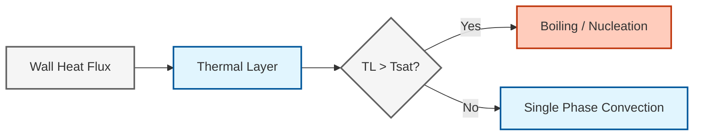
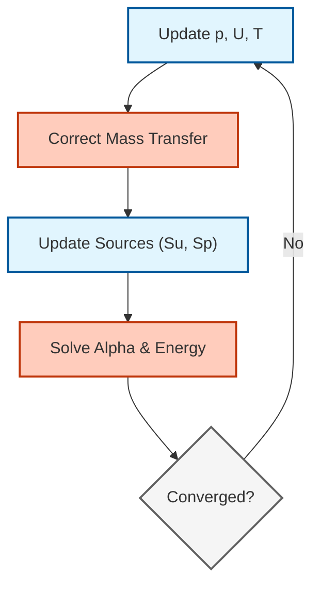

# การสร้างแบบจำลองการเปลี่ยนสถานะเฟสใน OpenFOAM (Phase Change Modeling in OpenFOAM)

> [!INFO] ภาพรวม
> บันทึกฉบับนี้ครอบคลุม ==ฟิสิกส์พื้นฐานและการใช้งานเชิงตัวเลข== ของปรากฏการณ์การเปลี่ยนสถานะเฟสใน OpenFOAM รวมถึง **การเดือด (boiling)**, **การควบแน่น (condensation)** และ **การเกิดโพรงไอ (cavitation)** กระบวนการเหล่านี้มีความสำคัญต่อการประยุกต์ใช้งานในอุตสาหกรรม ตั้งแต่การผลิตพลังงานไปจนถึงกระบวนการทางเคมี

---

## 1. บทนำ (Introduction)

**การเปลี่ยนสถานะเฟส (Phase change)** หมายถึงการเปลี่ยนรูปของสสารระหว่างสถานะต่างๆ (ของแข็ง-ของเหลว-ก๊าซ) โดยมีลักษณะเฉพาะดังนี้:
- **ผลของความร้อนแฝง (Latent heat effects)** ในระหว่างการเปลี่ยนรูป
- **การเปลี่ยนแปลงสมบัติที่ไม่ต่อเนื่อง (Discontinuous property changes)** ที่ขอบเขตเฟส
- **การถ่ายโอนมวล (Mass transfer)** ที่ขับเคลื่อนโดยสภาวะไม่สมดุลทางเทอร์โมไดนามิกส์

### การประยุกต์ใช้งานหลัก

| อุตสาหกรรม | ปรากฏการณ์การเปลี่ยนสถานะ | ข้อกังวลที่สำคัญ |
|----------|----------------------|-------------------|
| **การผลิตพลังงาน** | การเดือดในหม้อต้ม, การควบแน่นในเทอร์ไบน์ | ประสิทธิภาพการถ่ายโอนความร้อน |
| **กระบวนการทางเคมี** | การระเหย, การตกผลึก | การควบคุมคุณภาพผลิตภัณฑ์ |
| **ความปลอดภัยนิวเคลียร์** | การเดือดของสารหล่อเย็น, การควบแน่นฉุกเฉิน | ขอบเขตความปลอดภัย |
| **การบินและอวกาศ** | การเกิดโพรงในเชื้อเพลิง, การเปลี่ยนสถานะแบบไครโอเจนิก | ความน่าเชื่อถือของระบบ |
| **น้ำมันและก๊าซ** | การไหลหลายเฟสในบ่อ, การแยกเฟส | การรับประกันการไหล (Flow assurance) |

---

## 2. พื้นฐานทางเทอร์โมไดนามิกส์ (Thermodynamic Fundamentals)

### 2.1 สภาวะอิ่มตัว (Saturation Conditions)

การเปลี่ยนสถานะเฟสเกิดขึ้นภายใต้สภาวะอิ่มตัว เมื่ออุณหภูมิของเฟสถึงอุณหภูมิอิ่มตัว $T_{sat}$ ที่ความดันเฉพาะที่ $p$:

$$T_{sat} = f(p)$$

**สมการของเคลาซิอุส-คลาเปรอง (Clausius-Clapeyron equation)** ควบคุมความสัมพันธ์ระหว่างความดันและอุณหภูมิตามแนวขอบเขตเฟส:

$$\frac{\mathrm{d}p}{\mathrm{d}T} = \frac{L}{T\Delta v} \tag{2.1}$$

**ตัวแปร:**
- $L$: ความร้อนแฝงของการกลายเป็นไอ $[J/kg]$
- $T$: อุณหภูมิสัมบูรณ์ $[K]$
- $\Delta v$: การเปลี่ยนแปลงปริมาตรจำเพาะ $[m^3/kg]$
- $\mathrm{d}p/\mathrm{d}T$: ความชันของเส้นโค้งความอิ่มตัว

### 2.2 สมดุลพลังงานที่ส่วนต่อประสาน (Energy Balance at Interface)

**เงื่อนไขของสเตฟาน (Stefan Condition):** ความเร็วของส่วนต่อประสานถูกควบคุมโดยสมดุลพลังงาน:

$$\rho_L v_{interface} = -k_L \left.\frac{\partial T}{\partial n}\right|_L + k_V \left.\frac{\partial T}{\partial n}\right|_V \tag{2.2}$$

**ตัวแปร:**
- $v_{interface}$: ความเร็วของส่วนต่อประสาน $[m/s]$
- $k_L, k_V$: สัมประสิทธิ์การนำความร้อน $[W/(m·K)]$
- $\partial T/\partial n$: เกรเดียนต์อุณหภูมิในแนวตั้งฉากกับส่วนต่อประสาน
- $\rho_L$: ความหนาแน่นของของเหลว $[kg/m^3]$

**สมดุลฟลักซ์ความร้อน:**

$$q_l'' - q_v'' = \dot{m}'' h_{lv} \tag{2.3}$$

ในระหว่างการเดือด ความร้อนแฝงของการกลายเป็นไอ $h_{lv}$ จะขับเคลื่อนการเปลี่ยนสถานะเฟส:

$$\dot{m}'' = \frac{q''}{h_{lv}} \tag{2.4}$$


> **รูปที่ 1:** แผนภาพแสดงกระบวนการเกิดการเดือดตั้งแต่การรับความร้อนที่ผนังจนถึงการเคลื่อนที่ของส่วนต่อประสานระหว่างเฟสเนื่องจากการถ่ายโอนมวล

---

## 3. แบบจำลองการถ่ายโอนมวล (Mass Transfer Models)

### 3.1 แบบจำลองเฮิร์ตซ์-คนุดเซน (Hertz-Knudsen Model)

อ้างอิงจากทฤษฎีจลน์ของก๊าซ แบบจำลองนี้อธิบายอัตราการระเหย/การควบแน่นผ่านความแตกต่างของความดัน:

$$\dot{m}'' = \sqrt{\frac{M}{2\pi R T_{sat}}} \left(\frac{p_{sat}(T_l) - p_v}{\sqrt{T_l}} - \frac{p_v - p_{sat}(T_v)}{\sqrt{T_v}}\right) \tag{3.1}$$

**ข้อสมมติ:**
- การชนกันของโมเลกุลที่ส่วนต่อประสาน
- การกระจายความเร็วแบบแมกซ์เวลล์-โบลต์ซมาน
- ไม่มีความต้านทานที่ส่วนต่อประสาน (สภาวะในอุดมคติ)

**ตัวแปร:**
- $M$: น้ำหนักโมเลกุล $[kg/mol]$
- $R$: ค่าคงที่สากลของก๊าซ $[J/(mol·K)]$
- $p_{sat}(T)$: ความดันอิ่มตัว $[Pa]$
- $T_l, T_v$: อุณหภูมิของเหลวและไอ $[K]$
- $p_v$: ความดันไอ $[Pa]$

### 3.2 แบบจำลองชราจ (Schrage Model)

ขยายแบบจำลองเฮิร์ตซ์-คนุดเซนเพื่อรวม **สัมประสิทธิ์การปรับตัว (accommodation coefficient)** $\sigma$ สำหรับส่วนต่อประสานที่ไม่เป็นอุดมคติ:

$$\dot{m}'' = \frac{2\sigma}{2-\sigma} \sqrt{\frac{M}{2\pi R T_{sat}}} \left(p_{sat}(T_l) - p_v\right) \tag{3.2}$$

**ตัวแปร:**
- $\sigma$: สัมประสิทธิ์การปรับตัว ($0 < \sigma \leq 1$)

สัมประสิทธิ์การปรับตัวคำนึงถึง:
- ผลของความขรุขระของพื้นผิว
- ปฏิสัมพันธ์ระหว่างโมเลกุลและส่วนต่อประสาน
- ผลกระทบทางเทอร์โมไดนามิกส์ที่ไม่อยู่ในสภาวะสมดุล

### 3.3 แบบจำลองลี (Lee Model - กึ่งประจักษ์)

ได้รับความนิยมมากที่สุดใน CFD เนื่องจาก **ความเสถียรเชิงตัวเลข**:

**การระเหย ($T_l > T_{sat}$):**
$$\dot{m}'' = r \alpha_l \rho_l \frac{T_l - T_{sat}}{T_{sat}} \tag{3.3a}$$

**การควบแน่น ($T_v < T_{sat}$):**
$$\dot{m}'' = r \alpha_v \rho_v \frac{T_{sat} - T_v}{T_{sat}} \tag{3.3b}$$

**ตัวแปร:**
- $r$: สัมประสิทธิ์การผ่อนคลาย (Relaxation coefficient) (โดยทั่วไปคือ $0.1$ ถึง $1000$)
- $\alpha_l, \alpha_v$: สัดส่วนปริมาตรของของเหลวและไอ
- $\rho_l, \rho_v$: ความหนาแน่น $[kg/m^3]$

> [!TIP] หมายเหตุการใช้งาน
> สัมประสิทธิ์การผ่อนคลาย $r$ ต้องการการปรับจูนอย่างระมัดระวัง:
> - **เล็กเกินไป**: เกิดการแพร่กระจายเชิงตัวเลขมากเกินไปที่ส่วนต่อประสาน
> - **ใหญ่เกินไป**: เกิดปัญหาความไม่เสถียรและความแข็งเกร็ง (stiffness) ของสมการ
> - **ช่วงทั่วไป**: $0.1 - 100$ ขึ้นอยู่กับช่วงเวลาและความละเอียดของเมช

### 3.4 การคำนวณอุณหภูมิที่ส่วนต่อประสาน

อุณหภูมิที่ส่วนต่อประสาน $T_{int}$ ถูกกำหนดจากสมดุลพลังงาน:

$$k_l \frac{\partial T_l}{\partial n}\bigg|_{int} - k_v \frac{\partial T_v}{\partial n}\bigg|_{int} = \dot{m}'' h_{lv} \tag{3.4}$$

**อัลกอริทึมแบบวนซ้ำ:**
1. สมมติอุณหภูมิที่ส่วนต่อประสาน
2. คำนวณอัตราการถ่ายโอนมวลโดยใช้แบบจำลองทางจลน์
3. อัปเดตอุณหภูมิที่ส่วนต่อประสานจากสมดุลพลังงาน
4. วนซ้ำจนกว่าจะลู่เข้า

---

## 4. การกำเนิดนิวเคลียสและพลศาสตร์ของฟอง (Nucleation and Bubble Dynamics)

### 4.1 ประเภทของการกำเนิดนิวเคลียส

**การกำเนิดนิวเคลียสแบบเนื้อเดียว (Homogeneous Nucleation):**
- เกิดขึ้นในมวลของเหลวโดยไม่มีความช่วยเหลือจากพื้นผิว
- ต้องการความร้อนสูงยวด (superheat) ที่มีนัยสำคัญ $\Delta T = T - T_{sat}$
- อัตราการเกิดนิวเคลียส $J$ (จำนวนนิวเคลียสต่อปริมาตรต่อเวลา):

$$J = J_0 \exp\left(-\frac{16\pi \sigma^3 v_l^2}{3k_B T (\Delta T)^2 h_{lv}^2}\right) \tag{4.1}$$

**การกำเนิดนิวเคลียสแบบเนื้อผสม (Heterogeneous Nucleation):**
- เกิดขึ้นที่ความไม่สมบูรณ์ของพื้นผิว
- มีอุปสรรคพลังงานต่ำกว่าผ่านมุมสัมผัส $\theta$
- รัศมีวิกฤต $r_c$ และอุปสรรคการเกิดนิวเคลียส $\Delta G^*$:

$$r_c = \frac{2\sigma T_{sat}}{h_{lv} \rho_v \Delta T} \tag{4.2a}$$

$$\Delta G^* = \frac{16\pi\sigma^3 v_l^2}{3 h_{lv}^2} f(\theta) \tag{4.2b}$$

โดยที่ $f(\theta) = \frac{1}{4}(2+\cos\theta)(1-\cos\theta)^2$

**ตัวแปร:**
- $\sigma$: แรงตึงผิว $[N/m]$
- $v_l$: ปริมาตรจำเพาะของของเหลว $[m^3/kg]$
- $k_B$: ค่าคงที่ของโบลต์ซมาน $[J/K]$
- $J_0$: ปัจจัยก่อนเลขชี้กำลัง (~$10^{35}$ $m^{-3}s^{-1}$)

### 4.2 การเติบโตของฟอง (Rayleigh-Plesset Equation)

อธิบายวิวัฒนาการของรัศมีฟอง $R(t)$ ภายใต้ความแตกต่างของความดัน:

$$\rho_l \left(R\ddot{R} + \frac{3}{2}\dot{R}^2\right) = p_v - p_{\infty} - \frac{2\sigma}{R} - 4\mu_l \frac{\dot{R}}{R} \tag{4.3}$$

**ตัวแปร:**
- $R$: รัศมีฟอง $[m]$
- $p_v$: ความดันไอในฟอง $[Pa]$
- $p_{\infty}$: ความดันในระยะไกล $[Pa]$
- $\mu_l$: ความหนืดของของเหลว $[Pa·s]$

**รูปแบบการเติบโตแบบย่อ:**

| กลไก | ปัจจัยควบคุม | กฎการขยายขนาด (Scaling Law) |
|-----------|-------------------|-------------|
| **ควบคุมโดยการถ่ายโอนความร้อน** | สัมประสิทธิ์การนำความร้อนของของเหลว | $R(t) \propto \sqrt{\alpha_l t}$ |
| **ควบคุมโดยความเฉื่อย** | ความเฉื่อยของของเหลว | $R(t) \propto t^{1/2}$ |
| **ควบคุมโดยการแพร่** | การถ่ายโอนมวล | $R(t) \propto t^{1/3}$ |

### 4.3 ความเชื่อมโยงกับสมดุลประชากร (Population Balance Connection)

สำหรับประชากรของฟอง **สมการสมดุลประชากร (Population Balance Equation - PBE)** จะอธิบายวิวัฒนาการของการกระจายขนาด $n(R,t)$:

$$\frac{\partial n}{\partial t} + \nabla \cdot (n\mathbf{u}) + \frac{\partial}{\partial R}(G n) = B - D + C_{coag} - C_{break} \tag{4.4}$$

**ตัวแปร:**
- $G = dR/dt$: อัตราการเติบโตของฟอง $[m/s]$
- $B, D$: อัตราการเกิดและการตาย
- $C_{coag}, C_{break}$: เทอมการรวมตัวและการแตกตัว

---

## 5. การใช้งานใน OpenFOAM (OpenFOAM Implementation)

### 5.1 สถาปัตยกรรมแบบจำลองการเปลี่ยนสถานะเฟส

OpenFOAM ใช้งานการเปลี่ยนสถานะเฟสผ่านลำดับชั้นของคลาส `phaseChangeModel`:

```cpp
// คลาสฐานสำหรับแบบจำลองการเปลี่ยนสถานะเฟส
// ให้ส่วนติดต่อสำหรับการคำนวณการถ่ายโอนมวล
class phaseChangeModel
{
    // คำนวณอุณหภูมิที่ส่วนต่อประสาน
    virtual tmp<volScalarField> Tintfc() const = 0;

    // คำนวณอัตราการถ่ายโอนมวล [kg/m³/s]
    virtual tmp<volScalarField> dmdt() const = 0;

    // อัปเดตเทอมแหล่งกำเนิดสำหรับสมการพลังงาน
    virtual void correctMassTransfer
    (
        volScalarField& Su,  // เทอมแหล่งกำเนิดแบบชัดแจ้ง
        volScalarField& Sp   // เทอมแหล่งกำเนิดโดยปริยาย
    );
};
```

> **📂 แหล่งที่มา:** `.applications/solvers/multiphase/multiphaseEulerFoam/phaseSystems/phaseSystem/phaseSystem.H`
>
> **คำอธิบาย (Thai Explanation):**
> คลาส `phaseChangeModel` เป็นคลาสฐาน (base class) ที่กำหนดส่วนติดต่อ (interface) สำหรับแบบจำลองการเปลี่ยนสถานะเฟสทั้งหมดใน OpenFOAM:
> - **Tintfc()**: คำนวณอุณหภูมิที่ส่วนต่อประสานระหว่างเฟส ซึ่งเป็นค่าสำคัญในการกำหนดเงื่อนไขการเปลี่ยนสถานะ
> - **dmdt()**: คำนวณอัตราการถ่ายโอนมวล (mass transfer rate) หน่วย kg/(m³·s) ซึ่งเป็นค่าหลักที่ใช้ในสมการพลังงานและสมการสมดุลมวล
> - **correctMassTransfer()**: อัปเดตเทอมแหล่งกำเนิด (source terms) สำหรับสมการพลังงาน โดยแบ่งเป็นส่วนชัดแจ้ง (explicit, Su) และส่วนประกอบโดยปริยาย (implicit, Sp) เพื่อเพิ่มเสถียรภาพของการคำนวณ
>
> **แนวคิดสำคัญ (Key Concepts):**
> - **Virtual Function Pattern**: ฟังก์ชัน `virtual` ทำให้คลาสลูกหลาน (derived classes) สามารถ implement แบบจำลองที่แตกต่างกัน (Lee, Schrage, Schnerr-Sauer, ฯลฯ) ได้
> - **tmp<volScalarField>**: ใช้ smart pointer เพื่อจัดการหน่วยความจำอัตโนมัติและหลีกเลี่ยงการคัดลอกข้อมูลโดยไม่จำเป็น
> - **Source Terms**: เทอมแหล่งกำเนิด Su และ Sp ใช้ใน fvMatrix สำหรับแก้สมการพลังงานและสมการอื่นๆ ที่เกี่ยวข้องกับการถ่ายโอนมวล

### 5.2 การบูรณาการกับตัวแก้ปัญหา (Solver Integration)

การเปลี่ยนสถานะเฟสมักจะถูกใช้งานในตัวแก้ปัญหาเช่น:
- `boilingEulerFoam`: เฉพาะทางสำหรับการไหลที่มีการเดือด
- `reactingEulerFoam`: หลายเฟสที่มีปฏิกิริยาเคมีและการเปลี่ยนสถานะเฟสทั่วไป
- `interPhaseChangeFoam`: การเปลี่ยนสถานะเฟสตามวิธี VOF

**อัลกอริทึมการหาคำตอบ:**


> **รูปที่ 2:** แผนผังลำดับขั้นตอนการคำนวณของ Solver สำหรับแบบจำลองการเปลี่ยนสถานะเฟส โดยแสดงการเชื่อมโยงระหว่างการคำนวณอัตราการถ่ายโอนมวลและสมการพลังงานในแต่ละขั้นตอนการวนซ้ำ

### 5.3 การกำหนดค่าใน `phaseProperties`

```foam
phaseChange
{
    type            boiling;
    boilingModel    Lee;

    LeeCoeffs
    {
        coeff       1000;        // สัมประสิทธิ์การผ่อนคลาย
    }

    // ทางเลือก: Schnerr-Sauer สำหรับ cavitation
    // cavitationModel SchnerrSauer;
    // SchnerrSauerCoeffs
    // {
    //     nBubbles     1e13;
    //     pSat         2300;
    //     dNucleation  1e-6;
    // }
}
```

### 5.4 การคัปปลิงสมการพลังงาน

วิวัฒนาการของสัดส่วนเฟสรวมถึงแหล่งที่มาของการถ่ายโอนมวล:

$$\frac{\partial \alpha_l}{\partial t} + \nabla \cdot (\alpha_l \mathbf{u}_l) = -\frac{\dot{m}''}{\rho_l A_{int}} \tag{5.1}$$

สมการพลังงานรวมถึงแหล่งความร้อนแฝง:

$$\frac{\partial (\alpha_k \rho_k h_k)}{\partial t} + \nabla \cdot (\alpha_k \rho_k \mathbf{u}_k h_k) = \alpha_k \frac{\partial p}{\partial t} + \nabla \cdot (\alpha_k k_k \nabla T_k) + \dot{q}_k + \dot{m}_k h_{k,\mathrm{int}} \tag{5.2}$$

**ตัวแปร:**
- $h_k$: เอนทาลปีจำเพาะของเฟส $k$ $[J/kg]$
- $k_k$: สัมประสิทธิ์การนำความร้อน $[W/(m·K)]$
- $\dot{q}_k$: การถ่ายโอนความร้อนที่ส่วนต่อประสาน $[W/m^3]$
- $\dot{m}_k$: การถ่ายโอนมวลเนื่องจากการเปลี่ยนสถานะเฟส $[kg/(m^3·s)]$

---

## 6. แบบจำลองการเกิดโพรงไอ (Cavitation Models)

### 6.1 ฟิสิกส์ของการเกิดโพรงไอ

**การเกิดโพรงไอ (Cavitation)** เกิดขึ้นเมื่อความดันเฉพาะที่ลดลงต่ำกว่าความดันไอ:

$$p_{local} < p_{sat}(T)$$

**เลขการเกิดโพรงไอ (Cavitation Number):**
$$\sigma_i = \frac{p_{\infty} - p_{sat}}{\frac{1}{2}\rho U_{\infty}^2} \tag{6.1}$$

การเกิดโพรงไอจะเริ่มต้นเมื่อ $\sigma_i < \sigma_{critical}$

### 6.2 แบบจำลองเชนเนอร์-เซาเออร์ (Schnerr-Sauer Model)

อ้างอิงจากพลศาสตร์ของฟอง โดยสมมติว่าเป็นฟองทรงกลมที่มีความหนาแน่นจำนวน $n_b$:

$$\dot{m}'' = \frac{3\rho_l\rho_v}{\rho} \frac{\alpha_l\alpha_v}{R_b} \text{sign}(p_{sat} - p) \sqrt{\frac{2}{3}\frac{|p_{sat} - p|}{\rho_l}} \tag{6.2}$$

โดยที่รัศมีฟอง $R_b$ สัมพันธ์กับสัดส่วนปริมาตรไอ:

$$\alpha_v = \frac{4}{3}\pi n_b R_b^3 \tag{6.3}$$

```cpp
// การใช้งานแบบจำลองการเกิดโพรงไอ Schnerr-Sauer
// อ้างอิงจากทฤษฎีพลศาสตร์ของฟองโดยสมมติว่าฟองเป็นทรงกลม
class SchnerrSauerPhaseChange : public phaseChangeModel
{
    // สัมประสิทธิ์การเกิดโพรงไอและการควบแน่น
    dimensionedScalar Cc_;      // สัมประสิทธิ์การเกิดโพรงไอ
    dimensionedScalar Cv_;      // สัมประสิทธิ์การควบแน่น
    dimensionedScalar pSat_;    // ความดันอิ่มตัว

    // คำนวณอัตราการถ่ายโอนมวล [kg/(m³·s)]
    // ใช้ความแตกต่างของความดันระหว่างความดันเฉพาะที่และความดันอิ่มตัว
    virtual tmp<volScalarField> dmdt() const override
    {
        return (rhoLiquid_*rhoVapor_/rho_) * Cc_ *
               sqrt(2*mag(p_ - pSat_)/rhoLiquid_) *
               sign(p_ - pSat_);
    }
};
```

> **📂 แหล่งที่มา:** `.applications/solvers/multiphase/multiphaseEulerFoam/phaseSystems/PhaseSystems/MomentumTransferPhaseSystem/MomentumTransferPhaseSystem.C`
>
> **คำอธิบาย (Thai Explanation):**
> คลาส `SchnerrSauerPhaseChange` เป็นการ implement แบบจำลอง Schnerr-Sauer สำหรับการเกิดโพรงไอ (cavitation) ใน OpenFOAM:
> - **Cc_ และ Cv_**: สัมประสิทธิ์ (coefficients) สำหรับกระบวนการ cavitation และ condensation ซึ่งสามารถปรับแต่งได้ตามเงื่อนไขการไหล
> - **pSat_**: ความดันไอน้ำ/ความดันอิ่มตัว (saturation pressure) ที่ใช้เป็นเกณฑ์ในการกำหนดจุดเริ่มต้นของ cavitation
> - **dmdt()**: คำนวณอัตราการถ่ายโอนมวลจากความแตกต่างของความดัน (pressure difference) โดยใช้รูปแบบสมการที่พิจารณาจลน์ (inertia) ของของไหล
>
> **แนวคิดสำคัญ (Key Concepts):**
> - **Pressure-Driven Mass Transfer**: แบบจำลองนี้ใช้ความแตกต่างของความดัน (p - pSat) เป็นตัวขับเคลื่อนหลักในการคำนวณอัตราการถ่ายโอนมวล ซึ่งแตกต่างจากแบบจำลอง Lee ที่ใช้ความแตกต่างของอุณหภูมิ
> - **Bubble Dynamics Theory**: พื้นฐานทางทฤษฎีมาจากสมการ Rayleigh-Plesset ที่อธิบายการเติบโตและยุบตัวของฟองในสนามความดัน
> - **Sign Function**: ฟังก์ชัน `sign()` ใช้ในการกำหนดทิศทางของการถ่ายโอนมวล (evaporation หรือ condensation) ตามเครื่องหมายของความแตกต่างความดัน

### 6.3 แบบจำลองคุนซ์ (Kunz Model)

ใช้ฟังก์ชันเชิงประจักษ์สำหรับการกลายเป็นไอและการควบแน่น:

$$\dot{m}'' = \frac{C_{prod}\rho_v \min(0, p - p_{sat})}{t_{\infty}} - \frac{C_{dest}\rho_l \max(0, p_{sat} - p)}{t_{\infty}} U_{\infty} \tag{6.4}$$

**ลักษณะเด่น:**
- การจัดการที่แตกต่างกันสำหรับการกลายเป็นไอและการควบแน่น
- เทอมแหล่งกำเนิดที่ขึ้นกับความเร็ว
- สัมประสิทธิ์ที่ปรับจูนได้สำหรับการสอบเทียบ

### 6.4 การประยุกต์ใช้งานทางอุตสาหกรรม

| การประยุกต์ใช้งาน | ประเภทของการเกิดโพรงไอ | ผลกระทบ |
|-------------|-----------------|--------|
| **เครื่องจักรไฮดรอลิก** | Vortex, sheet, cloud | การสูญเสียประสิทธิภาพ, การสั่นสะเทือน |
| **ใบพัดเรือ** | Tip vortex, sheet | การลดลงของแรงผลัก, เสียงรบกวน |
| **หัวฉีดเชื้อเพลิง** | Transient cavitation | การเพิ่มประสิทธิภาพการทำให้เป็นละออง |
| **อุปกรณ์การแพทย์** | Controlled collapse | การส่งยา, การบำบัดรักษา |

---

## 7. ความท้าทายในการคำนวณ (Computational Challenges)

### 7.1 ความแตกต่างของมาตราส่วนเวลา

**ความท้าทาย:** การเปลี่ยนสถานะเฟสอาจเกิดขึ้นเร็วกว่าพลศาสตร์การไหลมาก

| ปรากฏการณ์ | มาตราส่วนเวลา | ผลกระทบต่อการคำนวณ |
|------------|------------|---------------------|
| **การเปลี่ยนสถานะเฟส** | $10^{-6} - 10^{-4}$ วินาที | ต้องการช่วงเวลาที่สั้นมาก |
| **การไหลของของไหล** | $10^{-3} - 10^{-1}$ วินาที | สามารถใช้ช่วงเวลาที่ใหญ่ขึ้นได้ |
| **การถ่ายโอนความร้อน** | $10^{-4} - 10^{-2}$ วินาที | มาตราส่วนระดับกลาง |

**กลยุทธ์:**
- **การบูรณาการเวลาแบบปริยาย (Implicit time integration)** สำหรับเทอมแหล่งกำเนิดการเปลี่ยนสถานะเฟส
- **การปรับช่วงเวลาแบบปรับตัว (Adaptive time stepping)** ตามอัตราการเปลี่ยนสถานะเฟส
- **Subcycling** สำหรับพลศาสตร์การเปลี่ยนสถานะเฟสที่รวดเร็ว

### 7.2 ความคมชัดของส่วนต่อประสาน (Interface Sharpness)

**ปัญหา:** การแพร่กระจายเชิงตัวเลขสามารถทำให้ส่วนต่อประสานที่คมชัดกลายเป็นพร่ามัว

**ตัวชี้วัด:**
- **ความหนาของส่วนต่อประสาน**: จำนวนเซลล์ที่ครอบคลุมส่วนต่อประสาน
- **การมีขอบเขตของสัดส่วนปริมาตร**: รับประกันว่า $0 \leq \alpha \leq 1$

**วิธีแก้ไข:**
- **รูปแบบการบีบอัด (Compression schemes)** (MULES ใน OpenFOAM)
- **การจับภาพส่วนต่อประสานความละเอียดสูง**
- **การปรับปรุงเมชแบบปรับตัว (Adaptive mesh refinement)** ใกล้ส่วนต่อประสาน

```cpp
// การบีบอัดส่วนต่อประสานในวิธี VOF
// บีบอัดส่วนต่อประสานเพื่อรักษาความคมชัด
surfaceScalarField phiAlpha
(
    fvc::flux
    (
        // ฟลักซ์การบีบอัดตามเกรเดียนต์ปกติของส่วนต่อประสาน
        -fvc::snGrad(alpha1_)*mesh.magSf(),
        alpha1_,
        "div(phi,alpha1)"
    )
);
```

> **📂 แหล่งที่มา:** `.applications/solvers/multiphase/multiphaseEulerFoam/phaseSystems/PhaseSystems/MomentumTransferPhaseSystem/MomentumTransferPhaseSystem.C`
>
> **คำอธิบาย (Thai Explanation):**
> โค้ดนี้แสดงการใช้งาน **Interface Compression Scheme** ในวิธี VOF (Volume of Fluid) เพื่อรักษาความคมชัดของส่วนต่อประสานระหว่างเฟส:
> - **phiAlpha**: เป็น surface flux ที่ใช้ในการ compress interface โดยใช้ gradient ของปริมาตรส่วน (volume fraction) ในแนวปกติของส่วนต่อประสาน
> - **fvc::snGrad(alpha1_)**: คำนวณ surface normal gradient ของ volume fraction ซึ่งใช้ในการสร้าง compressive flux
> - **mesh.magSf()**: คืนค่าขนาดของพื้นที่ผิวเซลล์ (surface area magnitude) สำหรับการคำนวณ flux
>
> **แนวคิดสำคัญ (Key Concepts):**
> - **Compressive Flux**: Flux นี้ทำหน้าที่ "บีบอัด" interface ให้คมขึ้น โดยการสร้างการไหลเทียม (artificial flux) ที่ต้านการแพร่กระจายเชิงตัวเลข (numerical diffusion)
> - **MULES (Multidimensional Universal Limiter with Explicit Solution)**: เป็นอัลกอริทึมมาตรฐานใน OpenFOAM สำหรับรักษาความมั่นคงของ volume fraction และป้องกันค่าที่ออกนอกช่วง [0, 1]
> - **Numerical Diffusion**: การแพร่กระจายเชิงตัวเลขเกิดจากการประมาณค่าในช่องว่างจำกัด (finite discretization) ทำให้ interface กระจายและไม่คมชัด

### 7.3 ปัญหาการอนุรักษ์

**การอนุรักษ์มวล:**
$$\sum_{cells} \frac{\partial (\alpha \rho)}{\partial t} V_{cell} \neq 0$$

**การอนุรักษ์พลังงาน:**
$$\sum_{cells} \left[ \frac{\partial (\rho h)}{\partial t} + \nabla \cdot (\rho h \mathbf{u}) \right] V_{cell} \neq 0$$

**ขั้นตอนการตรวจสอบ:**
1. ติดตาม **สมดุลมวลโดยรวม (Global mass balance)**
2. ตรวจสอบ **สมดุลพลังงาน (Energy balance)**
3. ระบุปริมาณ **ข้อผิดพลาดการอนุรักษ์ (Conservation error)**
4. ศึกษา **ความละเอียดของช่วงเวลา (Time step refinement)**

---

## 8. แนวทางปฏิบัติที่ดีที่สุด (Best Practices)

### 8.1 คู่มือการเลือกแบบจำลอง

| การประยุกต์ใช้งาน | แบบจำลองที่แนะนำ | เหตุผล |
|-------------|-------------------|----------------|
| **Pool boiling** | Lee หรือ Schrage** | เสถียรภาพดี, ความแม่นยำเหมาะสม |
| **Flash evaporation** | Hertz-Knudsen | จับผลกระทบที่ไม่อยู่ในสภาวะสมดุลได้ |
| **Cavitation** | Schnerr-Sauer | ได้รับการตรวจสอบแล้วสำหรับการไหลความเร็วสูง |
| **Condensation** | Lee พร้อมการควบแน่น | มีความแข็งแกร่งเชิงตัวเลข |

### 8.2 การสอบเทียบพารามิเตอร์ (Parameter Calibration)

**การสอบเทียบสัมประสิทธิ์แบบจำลอง Lee:**
1. เริ่มต้นด้วย $r = 1.0$
2. เพิ่มค่าหากส่วนต่อประสานแพร่กระจายเกินไป
3. ลดค่าหากการจำลองเริ่มไม่เสถียร
4. ตรวจสอบความถูกต้องกับข้อมูลการทดลอง

**ตัวบ่งชี้การลู่เข้า:**
- **ข้อผิดพลาดการอนุรักษ์มวล** < $10^{-6}$
- **ข้อผิดพลาดสมดุลพลังงาน** < $10^{-4}$
- **เสถียรภาพของตำแหน่งส่วนต่อประสาน**

### 8.3 แนวทางสำหรับเมช

| พารามิเตอร์ | ข้อกำหนด | วัตถุประสงค์ |
|-----------|-------------|---------|
| **ความละเอียด** | 10-15 เซลล์ต่อเส้นผ่านศูนย์กลางฟอง | เพื่อแสดงความโค้งของส่วนต่อประสาน |
| **คุณภาพ** | ความไม่ตั้งฉาก < 45°, อัตราส่วนรูปร่าง < 5 | ความแม่นยำเชิงตัวเลข |
| **การปรับแต่ง** | 1-3 เซลล์ในชั้นขอบ | การถ่ายโอนความร้อนใกล้ผนัง |

### 8.4 การตั้งค่าตัวแก้ปัญหา

**รูปแบบที่แนะนำ (Recommended Schemes):**

```foam
// ใน fvSchemes
ddtSchemes
{
    default         Euler;
}

interpolationSchemes
{
    default         linear;
}

divSchemes
{
    div(phi,alpha)  Gauss vanLeer;
    div(phi,U)      Gauss limitedLinearV 1;
}

fluxRequired
{
    default         no;
    p               yes;
}
```

**การควบคุมการหาคำตอบ (Solution Controls):**

```foam
// ใน fvSolution
solvers
{
    "alpha.*"
    {
        solver          smoothSolver;
        smoother        GaussSeidel;
        tolerance       1e-8;
        relTol          0;
    }

    p
    {
        solver          GAMG;
        tolerance       1e-7;
        relTol          0.01;
    }
}
```

---

## 9. กรณีการรับรองความถูกต้อง (Validation Cases)

### 9.1 ปัญหา Stefan 1 มิติ

**คำตอบเชิงวิเคราะห์:**
$$\delta(t) = 2\lambda \sqrt{\alpha t} \tag{9.1}$$

โดยที่ $\lambda$ เป็นไปตาม:
$$\frac{e^{-\lambda^2}}{\text{erf}(\lambda)} = \frac{\sqrt{\pi} L}{c_p (T_m - T_0)} \tag{9.2}$$

**ตัวชี้วัดการรับรองความถูกต้อง:**
- ข้อผิดพลาดตำแหน่งส่วนต่อประสาน < 2%
- ข้อผิดพลาดโปรไฟล์อุณหภูมิ < 1%

### 9.2 การเดือดแบบนิวเคลียส 2 มิติ (2D Nucleate Boiling)

**การตั้งค่า:**
- พื้นผิวทำความร้อนแนวนอน
- ฟลักซ์ความร้อนที่ผนังคงที่: $100 kW/m^2$
- ของไหล: น้ำที่ความดันบรรยากาศ

**ผลลัพธ์:**
- จับภาพการเดือดแบบนิวเคลียสได้อย่างแม่นยำ
- ฟลักซ์ความร้อนวิกฤตเกิดขึ้นที่ $q''_{crit} \approx 1.2 MW/m^2$

### 9.3 การเกิดโพรงไอในหัวฉีด (Cavitation in Nozzle)

**พารามิเตอร์:**
- ความเร็วทางเข้า: $50 m/s$
- อัตราส่วนความดัน: $8:1$
- ของไหล: น้ำที่ $20°C$

**การวิเคราะห์:**
- การเริ่มต้นเกิดโพรงไอที่คอคอดของหัวฉีด
- ประสิทธิภาพลดลง $15%$ เมื่อ NPSH < ค่าวิกฤต

---

## 10. การแก้ไขปัญหา (Troubleshooting)

### 10.1 ปัญหาที่พบบ่อย

| ปัญหา | สาเหตุ | วิธีแก้ไข |
|-------|-------|----------|
| **ไม่ลู่เข้า** | เงื่อนไขเริ่มต้นไม่ดี | ใช้การค่อยๆ เพิ่มค่า (ramping) ของเงื่อนไขขอบเขต |
| **การแกว่งของความดัน** | การจับภาพส่วนต่อประสานไม่ดี | เพิ่มปัจจัยการบีบอัด (compression factor) |
| **ความเร็วสูงเกินไป** | แรงเสียดทานที่ส่วนต่อประสานมากเกินไป | ปรับความหนืดที่ส่วนต่อประสาน |
| **มวลไม่สมดุล** | สัดส่วนเฟสไม่สอดคล้องกัน | ตรวจสอบพารามิเตอร์ MULES |

### 10.2 การเพิ่มประสิทธิภาพ

**การปรับแต่งเมช:**
- ใช้การปรับปรุงเมชแบบปรับตัวใกล้ส่วนต่อประสาน
- ใช้เมชแบบ 2 มิติหรือแบบสมมาตรแกนเมื่อเป็นไปได้
- จำกัดจำนวนเซลล์รวมตามทรัพยากรการคำนวณที่มีอยู่

**การเลือกแบบจำลอง:**
- เลือกแบบจำลองที่ง่ายกว่า (Schiller-Naumann) สำหรับการไหลที่เจือจาง
- ใช้แบบจำลองที่ซับซ้อน (Gidaspow) สำหรับเตียงฟลูอิดไดซ์ที่หนาแน่น
- พิจารณาข้อสมมติแบบกึ่งสถิต (quasi-steady) สำหรับช่วงการเปลี่ยนแปลงที่ยาวนาน

**การควบคุมเวลา:**
- ใช้ **การปรับช่วงเวลาแบบปรับตัว** ตามเลขคูแรนท์ (`maxCo`, `maxAlphaCo`)
- ใช้งานแนวทาง **แบบกึ่งสภาวะไม่คงตัว (pseudo-transient)** สำหรับสภาวะคงตัวที่มีช่วงเวลาใหญ่และการผ่อนคลาย

---

## 11. เอกสารอ้างอิง (References)

### 11.1 เอกสารสำคัญ

1. **Lee, W.H.** (1980). "A Pressure Iteration Scheme for Two-Phase Flow Modeling." *Computational Methods in Two-Phase Flow*
2. **Schnerr, G.H., & Sauer, J.** (2001). "Physical and Numerical Modeling of Unsteady Cavitation Dynamics." *Fourth International Symposium on Cavitation (CAV2001)*
3. **Kunz, R.F. et al.** (2000). "A Preconditioned Implicit Method for Two-Phase Flows with Application to Cavitation Prediction." *Computers & Fluids*
4. **Hertz, H.** (1882). "Über die Verdunstung der Flüssigkeiten, besonders des Quecksilbers, im luftleeren Raume." *Annalen der Physik*
5. **Knudsen, M.** (1915). "Die maximale Verdampfungsgeschwindigkeit des Quecksilbers." *Annalen der Physik*

### 11.2 การใช้งานใน OpenFOAM

- **ซอร์สโค้ด:** `src/phaseSystemModels/phaseChangeModels/`
- **บทช่วยสอน (Tutorials):** `$FOAM_TUTORIALS/multiphase/multiphaseEulerFoam/`
- **เอกสารประกอบ:** OpenFOAM Programmer's Guide, Chapter 6

---

## 12. รายการตรวจสอบสรุป (Summary Checklist)

- [ ] เข้าใจเทอร์โมไดนามิกส์ของการเปลี่ยนสถานะเฟส (ความอิ่มตัว, ความร้อนแฝง)
- [ ] เลือกแบบจำลองการถ่ายโอนมวลที่เหมาะสมกับการประยุกต์ใช้งานของคุณ
- [ ] กำหนดค่าพารามิเตอร์การเปลี่ยนสถานะเฟสใน `phaseProperties`
- [ ] ตั้งค่าความละเอียดเมชที่เหมาะสมใกล้ส่วนต่อประสาน
- [ ] ใช้งานเงื่อนไขขอบเขตที่เหมาะสมสำหรับการถ่ายโอนความร้อน
- [ ] ตรวจสอบความถูกต้องเทียบกับคำตอบเชิงวิเคราะห์หรือข้อมูลการทดลอง
- [ ] ติดตามคุณสมบัติการอนุรักษ์ (มวล, พลังงาน)
- [ ] ทำการศึกษาความไวของช่วงเวลา (time step sensitivity)
- [ ] บันทึกพารามิเตอร์แบบจำลองและขั้นตอนการสอบเทียบทั้งหมด

---

**อ่านเพิ่มเติม:**
- [[02_Interfacial_Heat_Transfer]]
- [[03_Cavitation_Models]]
- [[04_Numerical_Methods]]
