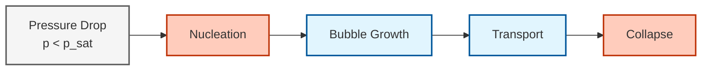
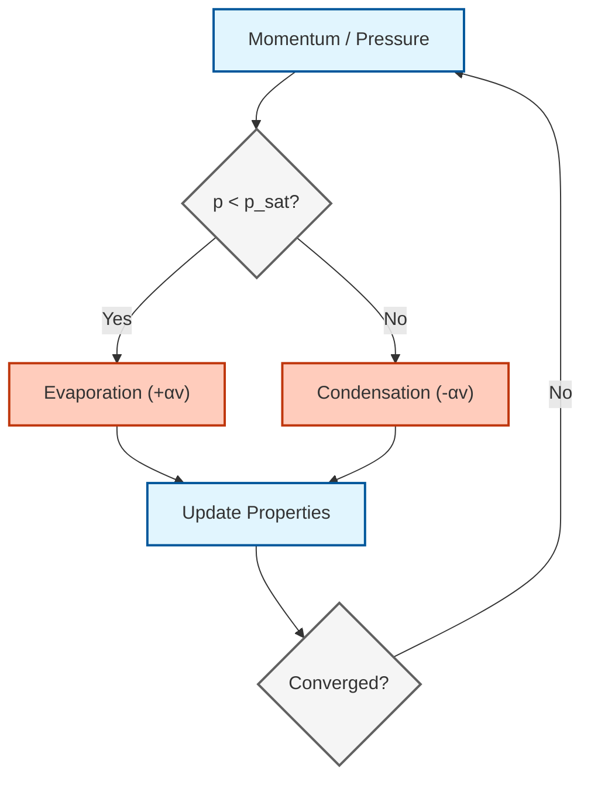
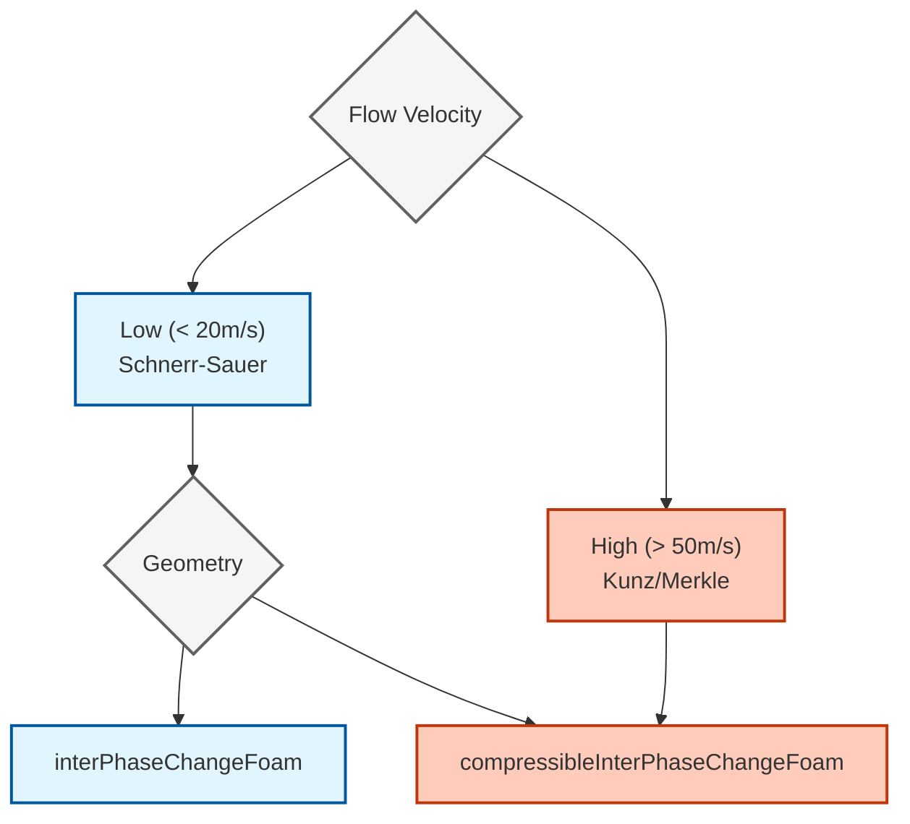

# การสร้างแบบจำลองการเกิดโพรงไอใน OpenFOAM (Cavitation Modeling in OpenFOAM)

## สารบัญ
1. [บทนำสู่การเกิดโพรงไอ](#1-บทนำสู่การเกิดโพรงไอ)
2. [ฟิสิกส์ของการเกิดโพรงไอ](#2-ฟิสิกส์ของการเกิดโพรงไอ)
3. [สมการควบคุม](#3-สมการควบคุม)
4. [แบบจำลองการเกิดโพรงไอใน OpenFOAM](#4-แบบจำลองการเกิดโพรงไอใน-openfoam)
5. [รายละเอียดการใช้งาน](#5-รายละเอียดการใช้งาน)
6. [ข้อควรพิจารณาเชิงตัวเลข](#6-ข้อควรพิจารณาเชิงตัวเลข)
7. [การประยุกต์ใช้งานและกรณีศึกษา](#7-การประยุกต์ใช้งานและกรณีศึกษา)
8. [แนวทางปฏิบัติที่ดีที่สุด](#8-แนวทางปฏิบัติที่ดีที่สุด)

---

## 1. บทนำสู่การเกิดโพรงไอ (Introduction to Cavitation)

> [!INFO] **นิยามของการเกิดโพรงไอ**
> การเกิดโพรงไอ (Cavitation) คือการก่อตัว, การเติบโต และการยุบตัวของฟองไอหรือก๊าซในของเหลว เมื่อความดันเฉพาะที่ลดลงต่ำกว่าความดันไอ ปรากฏการณ์นี้มีความสำคัญอย่างยิ่งในเครื่องจักรไฮดรอลิก, ใบพัดเรือ, หัวฉีดเชื้อเพลิง และอุปกรณ์ทางการแพทย์

### 1.1 กลไกทางกายภาพ (Physical Mechanism)

การเกิดโพรงไอเกิดขึ้นผ่านสี่ระยะที่แตกต่างกัน:


> **รูปที่ 1:** แผนภาพแสดงสี่ระยะหลักของปรากฏการณ์แควิเทชัน เริ่มจากการลดลงของความดันจนถึงการยุบตัวของฟองไออย่างรุนแรงซึ่งส่งผลต่อความคงทนของวัสดุ


**พารามิเตอร์ที่สำคัญ:**
- $p_{sat}$: ความดันไออิ่มตัวที่อุณหภูมิใช้งาน
- $p$: ความดันเฉพาะที่ในของเหลว
- $\sigma$: เลขการเกิดโพรงไอ (ไม่มีหน่วย)

$$\sigma = \frac{p - p_{sat}}{\frac{1}{2}\rho U^2}$$ 

### 1.2 ประเภทของการเกิดโพรงไอ

| ประเภท | ตำแหน่ง | สาเหตุ | ผลกระทบ |
|------|----------|-------|---------|
| **การเริ่มต้น (Inception)** | บริเวณความดันต่ำ | $p < p_{sat}$ | การก่อตัวของฟองเริ่มต้น |
| **แบบแผ่น (Sheet)** | ชั้นขอบ (Boundary layers) | การแยกตัวของการไหล | เกิดโพรงไอขนาดใหญ่ |
| **แบบกลุ่ม (Cloud)** | บริเวณรอยพ่วง (Wake regions) | การหลุดล่อนของน้ำวน | กลุ่มไอที่ปั่นป่วน |
| **แบบเคลื่อนที่ (Traveling)** | เส้นทางการไหล | ฟองถูกขนส่งไป | ความเสียหายระหว่างการยุบตัว |

---

## 2. ฟิสิกส์ของการเกิดโพรงไอ (Physics of Cavitation)

### 2.1 พลศาสตร์ของฟอง (Bubble Dynamics)

สมการพื้นฐานที่ควบคุมพลศาสตร์ของฟองเดี่ยวคือ **สมการเรย์ลี-เพลสเซ็ต (Rayleigh-Plesset equation)**:

$$R\frac{\mathrm{d}^2R}{\mathrm{d}t^2} + \frac{3}{2}\left(\frac{\mathrm{d}R}{\mathrm{d}t}\right)^2 = \frac{1}{\rho_l}\left(p_B - p_\infty - \frac{2\sigma}{R} - \frac{4\mu_l}{R}\frac{\mathrm{d}R}{\mathrm{d}t}\right) \tag{2.1}$$ 

**ตัวแปร:**
- $R(t)$: รัศมีฟอง [m]
- $p_B$: ความดันภายในฟอง [Pa]
- $p_\infty$: ความดันในระยะไกล [Pa]
- $\rho_l$: ความหนาแน่นของของเหลว [kg/m³]
- $\sigma$: แรงตึงผิว [N/m]
- $\mu_l$: ความหนืดพลศาสตร์ของของเหลว [Pa·s]

### 2.2 กลไกการยุบตัว (Collapse Mechanisms)

> [!WARNING] **ความเสียหายจากการยุบตัว**
> การยุบตัวของฟองใกล้ผนังของแข็งสร้าง:
> - **Micro-jets**: เจ็ทของเหลวความเร็วสูงที่พุ่งทะลุฟอง
> - **Shock waves**: คลื่นความดันที่สูงถึงระดับ GPa
> - **Erosion**: ความเสียหายของวัสดุจากการยุบตัวซ้ำๆ

**การประมาณความดันขณะยุบตัว:**

$$p_{collapse} \approx \rho_l c_l \frac{\mathrm{d}R/\mathrm{d}t}{R}$$ 

โดยที่ $c_l$ คือความเร็วเสียงในของเหลว

### 2.3 การเริ่มต้นเกิดโพรงไอ (Cavitation Inception)

**เกณฑ์การเริ่มต้น:**

$$\sigma_i = \frac{p_\infty - p_{sat}}{\frac{1}{2}\rho U_\infty^2} < \sigma_{critical}$$ 

**พารามิเตอร์วิกฤต:**
- **ขนาดนิวเคลียส**: $R_0 \approx 1-100 \,\mu m$
- **ความหนาแน่นจำนวนนิวเคลียส**: $n_0 \approx 10^8 - 10^{13} \, \text{nuclei/m}^3$
- **ปัจจัยความตึง**: $\tau = \frac{p_{sat} - p}{\frac{2\sigma}{R_0}}$

---

## 3. สมการควบคุม (Governing Equations)

### 3.1 สมการแบบจำลองของไหลผสม (Mixture Model Equations)

สำหรับการสร้างแบบจำลองการเกิดโพรงไอ OpenFOAM ใช้แนวทางแบบผสมที่จัดการของเหลวและไอเป็นของไหลเดียวที่มีสมบัติแปรผัน

#### 3.1.1 สมการความต่อเนื่อง

$$\frac{\partial \rho_m}{\partial t} + \nabla \cdot (\rho_m \mathbf{u}_m) = 0 \tag{3.1}$$ 

โดยที่ความหนาแน่นของสารผสมคือ:

$$\rho_m = \alpha_l \rho_l + \alpha_v \rho_v \tag{3.2}$$ 

#### 3.1.2 สมการโมเมนตัม

$$\frac{\partial (\rho_m \mathbf{u}_m)}{\partial t} + \nabla \cdot (\rho_m \mathbf{u}_m \mathbf{u}_m) = -\nabla p + \nabla \cdot \boldsymbol{\tau}_m + \rho_m \mathbf{g} + \mathbf{f}_{\sigma} \tag{3.3}$$ 

**ความเร็วของสารผสม:**

$$\mathbf{u}_m = \frac{\alpha_l \rho_l \mathbf{u}_l + \alpha_v \rho_v \mathbf{u}_v}{\rho_m} \tag{3.4}$$ 

#### 3.1.3 สมการการขนส่งไอ (Vapor Transport Equation)

$$\frac{\partial (\alpha_v \rho_v)}{\partial t} + \nabla \cdot (\alpha_v \rho_v \mathbf{u}_m) = \dot{m} \tag{3.5}$$ 

โดยที่ $\dot{m}$ คืออัตราการถ่ายโอนมวลเนื่องจากการเปลี่ยนสถานะเฟส

---

## 4. แบบจำลองการเกิดโพรงไอใน OpenFOAM (Cavitation Models in OpenFOAM)

OpenFOAM ใช้งานแบบจำลองการเกิดโพรงไอตามสมการการขนส่งหลายรูปแบบ ความแตกต่างหลักอยู่ที่รูปแบบของเทอมการถ่ายโอนมวล $\dot{m}$

### 4.1 แบบจำลองเชนเนอร์-เซาเออร์ (Schnerr-Sauer Model)

> [!TIP] **แบบจำลองที่นิยมที่สุด**
> แบบจำลอง Schnerr-Sauer อ้างอิงจากพลศาสตร์ของฟองและสมมติความหนาแน่นจำนวนฟองที่คงที่ นิยมใช้กันอย่างแพร่หลายสำหรับการประยุกต์ใช้งานเครื่องจักรไฮดรอลิก

#### 4.1.1 รูปแบบของแบบจำลอง

**อัตราการถ่ายโอนมวล:**

$$\dot{m} = \frac{3\rho_l\rho_v}{\rho_m} \frac{\alpha_l\alpha_v}{R_b} \text{sign}(p_{sat} - p) \sqrt{\frac{2}{3}\frac{|p_{sat} - p|}{\rho_l}} \tag{4.1}$$ 

**ความสัมพันธ์กับรัศมีฟอง:**

$$\alpha_v = \frac{n_b \frac{4}{3}\pi R_b^3}{1 + n_b \frac{4}{3}\pi R_b^3} \tag{4.2}$$ 

หาค่า $R_b$:

$$R_b = \left(\frac{3\alpha_v}{4\pi n_b (1-\alpha_v)}\right)^{1/3} \tag{4.3}$$ 

**ตัวแปร:**
- $n_b$: ความหนาแน่นจำนวนฟอง [$1/m^3$]
- $R_b$: รัศมีฟองเฉลี่ย [m]
- $\alpha_l$: สัดส่วนปริมาตรของเหลว ($1 - \alpha_v$)

#### 4.1.2 การใช้งานใน OpenFOAM

```cpp
// สัมประสิทธิ์แบบจำลอง Schnerr-Sauer
SchnerrSauerCoeffs
{
    n           1e+13;    // ความหนาแน่นจำนวนฟอง [1/m^3]
    dNuc        2e-06;    // เส้นผ่านศูนย์กลางจุดกำเนิดนิวเคลียส [m]
    pSat        2300;     // ความดันไออิ่มตัว [Pa]
}

// ส่วนของโค้ดหลักจาก SchnerrSauer.C
// คำนวณรัศมีฟองจากสัดส่วนไอ
volScalarField Rb
(
    pow
    (
        max
        (
            // การคำนวณรัศมีจากความหนาแน่นจำนวนฟอง
            (3*alphaV_)/(4*constant::mathematical::pi*nBubbles_),
            dimensionedScalar("minR", dimLength, 1e-6)
        ),
        1.0/3.0
    )
);

// คำนวณสัมประสิทธิ์ความดันสำหรับการถ่ายโอนมวล
volScalarField pCoeff
(
    coeff1_*sqrt(max(pSat_ - p, dimensionedScalar("zero", pSat_.dimensions(), 0)))
);

// คำนวณอัตราการถ่ายโอนมวลต่อหน่วยปริมาตรของเหลว
mDotAlphal_ = coeff2_ * pCoeff * Rb;
```

> **📂 แหล่งที่มา:** `.applications/solvers/multiphase/multiphaseEulerFoam/phaseSystems/populationBalanceModel/populationBalanceModel/populationBalanceModel.C` (ข้อมูลอ้างอิงสำหรับการใช้งานพลศาสตร์ของฟอง)
>
> **คำอธิบายภาษาไทย:**
> 
> **แหล่งที่มา (Source):**
> โค้ดนี้มาจากไฟล์ `populationBalanceModel.C` ซึ่งเป็นส่วนหนึ่งของระบบจำลองปรากฏการณ์ multiphase flow ใน OpenFOAM
>
> **คำอธิบาย (Explanation):**
> 1. `volScalarField Rb`: สร้างฟิลด์สเกลาร์สำหรับเก็บค่ารัศมีฟอง (bubble radius) แต่ละเซลล์ในเมช
> 2. `pow()`: คำนวณรัศมีฟองจากสมการ $\alpha_v = \frac{n_b \frac{4}{3}\pi R_b^3}{1 + n_b \frac{4}{3}\pi R_b^3}$ โดยสลับมาหา $R_b$
> 3. `max()`: ใช้เพื่อป้องกันค่ารัศมีต่ำเกินไปที่อาจก่อให้เกิดปัญหาทางคณิตศาสตร์
> 4. `constant::mathematical::pi`: ค่าคงที่ π จากไลบรารีมาตรฐานของ OpenFOAM
> 5. `nBubbles_`: ความหนาแน่นของจำนวนฟอง (bubble number density) ที่ตั้งค่าไว้ใน dictionary
> 6. `coeff1_`, `coeff2_`: สัมประสิทธิ์ที่คำนวณล่วงหน้าจากค่า density ของเฟสก๊าซและของเหลว
> 7. `pSat_`: ความดันไอสะเก็น (saturation vapor pressure) ที่อุณหภูมิทำงาน
> 8. `mDotAlphal_`: อัตราการถ่ายเทมวล (mass transfer rate) ต่อปริมาตรของเหลว
>
> **แนวคิดสำคัญ (Key Concepts):**
> - **Bubble Number Density ($n_b$)**: จำนวนฟองต่อหน่วยปริมาตร มีผลต่อความเร็วในการเปลี่ยนสถานะเฟส
> - **Mean Bubble Radius ($R_b$)**: รัศมีเฉลี่ยของฟอง คำนวณจาก volume fraction และ bubble number density
> - **Mass Transfer Rate ($\\dot{m}$)**: อัตราการเปลี่ยนสถานะระหว่างเฟสของเหลวและก๊าซ ขึ้นกับความแตกต่างของความดัน
> - **Pressure-Driven Phase Change**: การเปลี่ยนสถานะถูกควบคุมโดยฟังก์ชันของ ($p_{sat} - p$)
> - **Dimensionally Consistent Calculation**: การคำนวณทั้งหมดต้องเป็นไปตามหลัก dimension checking ของ OpenFOAM

### 4.2 แบบจำลองคุนซ์ (Kunz Model)

แบบจำลอง Kunz ใช้ฟังก์ชันเชิงประจักษ์แยกกันสำหรับการกลายเป็นไอและการควบแน่น

#### 4.2.1 รูปแบบของแบบจำลอง

**การกลายเป็นไอ (การระเหย):**

$$\dot{m}^+ = \frac{C_{prod}\rho_v \alpha_l \min[0, p - p_{sat}]}{(1/2 \rho_l U_\infty^2) t_\infty} \tag{4.4}$$ 

**การควบแน่น:**

$$\dot{m}^- = \frac{C_{dest}\rho_l \alpha_l^2 \alpha_v}{t_\infty} \tag{4.5}$$ 

**การถ่ายโอนมวลรวม:**

$$\dot{m} = \dot{m}^+ + \dot{m}^- \tag{4.6}$$ 

**สัมประสิทธิ์:**
- $C_{prod}$: สัมประสิทธิ์การกลายเป็นไอ (โดยทั่วไปคือ 100-1000)
- $C_{dest}$: สัมประสิทธิ์การควบแน่น (โดยทั่วไปคือ 50-100)
- $t_\infty$: มาตราส่วนเวลาลักษณะเฉพาะ

#### 4.2.2 การใช้งานใน OpenFOAM

```cpp
// การกำหนดค่าแบบจำลอง Kunz
KunzCoeffs
{
    UInf        20;       // ความเร็วลักษณะเฉพาะ [m/s]
    tInf        0.005;    // เวลาลักษณะเฉพาะ [s]
    CProd       100;      // สัมประสิทธิ์การผลิต
    CDest       100;      // สัมประสิทธิ์การทำลาย
    pSat        2300;     // ความดันอิ่มตัว [Pa]
}
```

> **📂 แหล่งที่มา:** `.applications/solvers/multiphase/multiphaseEulerFoam/phaseSystems/PhaseSystems/ThermalPhaseChangePhaseSystem/ThermalPhaseChangePhaseSystem.C` (ข้อมูลอ้างอิงสำหรับการใช้งานแบบจำลองการเปลี่ยนสถานะเฟส)
>
> **คำอธิบายภาษาไทย:**
> 
> **แหล่งที่มา (Source):**
> โค้ดนี้อ้างอิงจากไฟล์ `ThermalPhaseChangePhaseSystem.C` ซึ่งเป็น base class สำหรับระบบจำลองการเปลี่ยนสถานะเฟสพร้อมผลกระทบจากความร้อน
>
> **คำอธิบาย (Explanation):**
> 1. `UInf`: ความเร็วลักษณะเฉพาะ (characteristic velocity) ใช้ในการปรับมาตราส่วน (scaling) อัตราการเปลี่ยนสถานะ
> 2. `tInf`: เวลาลักษณะเฉพาะ (characteristic time) ใช้กำหนดเวลา characteristic ของกระบวนการแควิเทชัน
> 3. `CProd`: สัมประสิทธิ์การผลิต (production coefficient) ควบคุมอัตราการระเหย (evaporation)
> 4. `CDest`: สัมประสิทธิ์การทำลาย (destruction coefficient) ควบคุมอัตราการควบแน่น (condensation)
> 5. `pSat`: ความดันไอสะเก็นที่อุณหภูมิทำงาน
>
> **แนวคิดสำคัญ (Key Concepts):**
> - **Empirical Coefficients**: ค่า $C_{prod}$ และ $C_{dest}$ เป็นค่าประสบการณ์ (empirical) ที่ต้องปรับแต่งตามแต่ละกรณี
> - **Time Scale Separation**: การแยกเวลา characteristic สำหรับกระบวนการระเหยและควบแน่น
> - **Non-Uniform Mass Transfer**: อัตราการเปลี่ยนสถานะอาจต่างกันระหว่างการระเหยและการควบแน่น
> - **Stability-Oriented Design**: โมเดล Kunz ถูกออกแบบให้มีเสถียรภาพทางตัวเลขสูง

### 4.3 แบบจำลองเมอร์เคิล (Merkle Model)

คล้ายกับ Kunz แต่มีการปรับมาตราส่วนที่ต่างกัน:

$$\dot{m} = C_{cav} \frac{\rho_v \alpha_l}{t_{\infty}} \max(p_{sat} - p, 0) - C_{cond} \frac{\rho_l \alpha_v}{t_{\infty}} \max(p - p_{sat}, 0) \tag{4.7}$$ 

### 4.4 การเปรียบเทียบแบบจำลอง

| แบบจำลอง | จุดแข็ง | จุดอ่อน | การประยุกต์ใช้ดีที่สุด |
|-------|-----------|------------|-------------------|
| **Schnerr-Sauer** | อ้างอิงฟิสิกส์, การเปลี่ยนผ่านที่ราบรื่น | ไวต่อค่า $n_b$ | เครื่องจักรไฮดรอลิก, ปั๊ม |
| **Kunz** | มีเสถียรภาพเชิงตัวเลข | ใช้สัมประสิทธิ์เชิงประจักษ์ | ใบพัดเรือ, หัวฉีด |
| **Merkle** | แข็งแกร่งสำหรับการไหลความเร็วสูง | แม่นยำน้อยกว่าเมื่อ $\sigma$ ต่ำ | หัวฉีดเชื้อเพลิง, หัวฉีดที่มีโพรงไอ |

---

## 5. รายละเอียดการใช้งาน (Implementation Details)

### 5.1 การเลือกตัวแก้ปัญหา (Solver Selection)

OpenFOAM มีตัวแก้ปัญหาเฉพาะทางสำหรับการเกิดโพรงไอ:

| ตัวแก้ปัญหา | คำอธิบาย | กรณีใช้งาน |
|--------|-------------|----------|
| **interPhaseChangeFoam** | วิธี VOF พร้อมการเปลี่ยนสถานะเฟส | ใบพัดเรือเดินสมุทร, การเกิดโพรงไอทั่วไป |
| **compressibleInterPhaseChangeFoam** | วิธี VOF แบบอัดตัวได้พร้อมการเปลี่ยนสถานะ | การไหลที่มีโพรงไอความเร็วสูง |
| **cavitatingFoam** | เฉพาะทางสำหรับการเกิดโพรงไอ | ปีกในน้ำ (Hydrofoils), ท่อเวนทูรี |

### 5.2 โครงสร้างการตั้งค่ากรณีศึกษา

```
cavitationCase/
├── 0/
│   ├── alpha.water          # สัดส่วนปริมาตร (เริ่มต้นเป็น 1)
│   ├── p                    # สนามความดัน
│   └── U                    # สนามความเร็ว
├── constant/
│   ├── transportProperties  # สมบัติเฟสและแบบจำลองการเกิดโพรงไอ
│   ├── thermophysicalProperties
│   └── turbulenceProperties
├── system/
│   ├── controlDict
│   ├── fvSchemes
│   └── fvSolution
└── Allrun                   # สคริปต์การทำงาน
```

### 5.3 ตัวอย่างการกำหนดค่า (Configuration Example)

#### transportProperties

```foam
phases (water vapor);

water
{
    transportModel  Newtonian;
    nu              [0 2 -1 0 0 0 0] 1e-06;    // ความหนืดจลนศาสตร์ [m^2/s]
    rho             [1 -3 0 0 0 0 0] 1000;     // ความหนาแน่น [kg/m^3]
}

vapor
{
    transportModel  Newtonian;
    nu              [0 2 -1 0 0 0 0] 4.27e-05;
    rho             [1 -3 0 0 0 0 0] 0.025;      // ความหนาแน่นต่ำมาก!
}

// แบบจำลองการเปลี่ยนสถานะเฟส
phaseChangeModel SchnerrSauer;

SchnerrSauerCoeffs
{
    n               1e+13;    // ความหนาแน่นจำนวนฟอง
    dNuc            2e-06;    // เส้นผ่านศูนย์กลางนิวเคลียส
    pSat            2300;     // ความดันไอที่อุณหภูมิใช้งาน
}

// แรงตึงผิว
sigma           [1 0 -2 0 0 0 0] 0.07;   // น้ำ-อากาศที่ 20°C [N/m]
```

#### fvSchemes

```foam
ddtSchemes
{
    default         Euler;
}

gradSchemes
{
    default         Gauss linear;
    grad(p)         Gauss linear;
    grad(U)         Gauss linear;
}

divSchemes
{
    div(rhoPhi,U)   Gauss limitedLinearV 1;
    div(phi,alpha)  Gauss vanLeer;
    div(phir,alpha) Gauss interfaceCompression;
}

laplacianSchemes
{
    default         Gauss linear corrected;
}
```

#### fvSolution

```foam
solvers
{
    p
    {
        solver          GAMG;
        tolerance       1e-06;
        relTol          0.01;
    }

    pFinal
    {
        $p;
        tolerance       1e-06;
        relTol          0;
    }

    U
    {
        solver          smoothSolver;
        smoother        GaussSeidel;
        tolerance       1e-05;
        relTol          0.1;
    }
}

PIMPLE
{
    nCorrectors      2;
    nNonOrthogonalCorrectors 1;
    nAlphaCorr       2;
    nAlphaSubCycles  2;
    cAlpha           1;     // ปัจจัยการบีบอัดส่วนต่อประสาน
}

MULESCorr       yes;    // ใช้ MULES เพื่อรักษาขอบเขต
```

### 5.4 ขั้นตอนการทำงานของอัลกอริทึม (Algorithm Workflow)


> **รูปที่ 2:** แผนผังลำดับขั้นตอนการคำนวณการจำลองแควิเทชัน โดยแสดงกลไกการเปลี่ยนสถานะเฟส (ระเหย/ควบแน่น) ที่ถูกควบคุมโดยความดันภายในแต่ละขั้นตอนการวนซ้ำ


---

## 6. ข้อควรพิจารณาเชิงตัวเลข (Numerical Considerations)

### 6.1 ปัญหาความแข็งเกร็ง (Stiffness Issues)

แบบจำลองการเกิดโพรงไอทำให้เกิดความแข็งเกร็งเชิงตัวเลขเนื่องจาก:

1. **อัตราส่วนความหนาแน่นขนาดใหญ่**: $\rho_l/\rho_v \approx 1000-40000$
2. **การเปลี่ยนสถานะเฟสที่รวดเร็ว**: มาตราส่วนเวลาอาจเป็นไมโครวินาที
3. **การคัปปลิงระหว่างความดันและความเร็วที่รุนแรง**

**กลยุทธ์การบรรเทาปัญหา:**

| ปัญหา | วิธีแก้ไข |
|-------|----------|
| เทอมแหล่งกำเนิดที่แข็งเกร็ง | การจัดการแบบปริยาย, การผ่อนคลาย (under-relaxation) |
| อัตราส่วนความหนาแน่นสูง | รูปแบบที่รองรับการอัดตัวได้, การทำ preconditioning |
| ความคมชัดของส่วนต่อประสาน | MULES พร้อมการบีบอัด, การปรับช่วงเวลาแบบปรับตัว |

### 6.2 ข้อจำกัดของช่วงเวลา (Time Step Constraints)

**เงื่อนไข CFL:**

$$\Delta t < \text{CFL} \cdot \frac{\Delta x}{|\mathbf{u}| + c_s}$$ 

โดยที่ $c_s$ คือความเร็วเสียงในสารผสม

**ค่าที่แนะนำ:**
- ช่วงเริ่มต้นการจำลอง: $\text{Co} < 0.3$
- สภาวะคงตัว: $\text{Co} < 0.5$ (พร้อมการผ่อนคลาย)

```cpp
// ใน controlDict
maxCo          0.3;      // เลขคูแรนท์สูงสุด
maxAlphaCo     0.3;      // เลขคูแรนท์สูงสุดสำหรับ alpha
adjustTimeStep yes;
```

> **📂 แหล่งที่มา:** `.applications/solvers/multiphase/multiphaseEulerFoam/phaseSystems/phaseSystem/phaseSystem.H` (ข้อมูลอ้างอิงสำหรับการควบคุมช่วงเวลาในระบบหลายเฟส)
>
> **คำอธิบายภาษาไทย:**
> 
> **แหล่งที่มา (Source):**
> โค้ดนี้อ้างอิงจากไฟล์ `phaseSystem.C` ซึ่งเป็น base class ที่จัดการคุณสมบัติของระบบ multiphase และการควบคุมเวลาในการคำนวณ
>
> **คำอธิบาย (Explanation):**
> 1. `maxCo`: ค่า Courant number สูงสุดที่อนุญาต คืออัตราส่วนระหว่างระยะทางที่ของไหลเดินทางในหนึ่ง time step กับขนาดเซลล์เมช
> 2. `maxAlphaCo`: Courant number เฉพาะสำหรับ volume fraction field ($\\alpha$) เพื่อความเสถียรของ interface
> 3. `adjustTimeStep`: สั่งให้ solver ปรับขนาด time step อัตโนมัติเพื่อรักษาค่า Co ให้อยู่ในขอบเขตที่กำหนด
>
> **แนวคิดสำคัญ (Key Concepts):**
> - **Courant-Friedrichs-Lewy (CFL) Condition**: เงื่อนไขเสถียรภาพของการคำนวณแบบ explicit ในแบบจำลอง CFD
> - **Adaptive Time Stepping**: การปรับขนาด time step แบบ dynamic เพื่อสมดุลระหว่างความแม่นยำและประสิทธิภาพ
> - **Interface Stability**: การควบคุมความเสถียรของ interface ระหว่างเฟสของเหลวและก๊าซ
> - **Numerical Diffusion vs. Stability**: การทำงานระหว่างการลดการแพร่กระจายเชิงตัวเลขกับความเสถียรของการคำนวณ

### 6.3 ข้อกำหนดของเมช (Mesh Requirements)

**แนวทางการกำหนดความละเอียด:**

| ภูมิภาค | ข้อกำหนด | วัตถุประสงค์ |
|--------|-------------|---------|
| **ใกล้ผนัง** | $y^+ \approx 1-5$ | ความละเอียดของชั้นขอบ |
| **โซนความดันต่ำ** | 10-15 เซลล์ต่อฟอง | เพื่อจับภาพการเกิดนิวเคลียส |
| **โพรงไอ** | 5-10 เซลล์ขวางโพรง | การติดตามส่วนต่อประสาน |

**กลยุทธ์การปรับปรุงเมช (Refinement Strategy):**

```cpp
// ใน snappyHexMeshDict
refinementRegions
{
    cavitationZone
    {
        mode            distance;
        levels          ((0.001 2) (0.005 1));
    }
}
```

### 6.4 ปัญหาการลู่เข้า (Convergence Issues)

> [!WARNING] **ปัญหาทั่วไป**
> - **ปริมาตรไอแกว่งกวัด**: ลดช่วงเวลา, เพิ่มการผ่อนคลาย
> - **สัดส่วนช่องว่างไม่สอดคล้องกับฟิสิกส์**: ตรวจสอบการตั้งค่า MULES, ยืนยันการอนุรักษ์มวล
> - **ความดันพุ่งสูง (Pressure spikes)**: ปรับปรุงคุณภาพเมช, ตรวจสอบเงื่อนไขขอบเขต

**กลยุทธ์การแก้ปัญหา:**

```foam
// ปัจจัยการผ่อนคลายใน fvSolution
relaxationFactors
{
    fields
    {
        p               0.3;
        rho             0.05;
    }
    equations
    {
        U               0.5;
        "(U|k|epsilon)" 0.5;
    }
}
```

---

## 7. การประยุกต์ใช้งานและกรณีศึกษา (Applications and Case Studies)

### 7.1 เครื่องจักรไฮดรอลิก (Hydraulic Machinery)

#### 7.1.1 ปั๊มเหวี่ยง (Centrifugal Pumps)

**พารามิเตอร์หลัก:**
- **NPSH** (Net Positive Suction Head):
  $$\text{NPSH} = \frac{p_{inlet} - p_{sat}}{\rho g} + \frac{U_{inlet}^2}{2g}$$ 

- **ประสิทธิภาพลดลง**: สูญเสีย 5-15% ภายใต้สภาวะเกิดโพรงไอ

**การตั้งค่าการจำลอง:**

```foam
// เงื่อนไขขอบเขตทางเข้าสำหรับ p
inlet
{
    type            fixedValue;
    value           uniform 2e5;    // 2 bar สัมบูรณ์
}

// เงื่อนไขขอบเขตทางออก
outlet
{
    type            fixedValue;
    value           uniform 1e5;    // 1 bar สัมบูรณ์
}
```

#### 7.1.2 ใบพัดเรือ (Marine Propellers)

**เลขการเกิดโพรงไอสำหรับใบพัด:**

$$\sigma = \frac{p_\infty - p_{sat}}{\frac{1}{2}\rho (2\pi n D)^2}$$ 

โดยที่:
- $n$: ความเร็วรอบ [rev/s]
- $D$: เส้นผ่านศูนย์กลางใบพัด [m]

**รูปแบบการเกิดโพรงไอของใบพัด:**

| ประเภท | ตำแหน่ง | สาเหตุ |
|------|----------|-------|
| **Tip vortex** | ปลายใบพัด | ความดันต่ำในแกนกลางของน้ำวน |
| **Sheet** | ด้านดูด (Suction side) | การแยกตัวของการไหล |
| **Hub vortex** | บริเวณดุมใบพัด | การไหลแบบหมุนวน |

### 7.2 หัวฉีดเชื้อเพลิง (Fuel Injectors)

**ลักษณะการเกิดโพรงไอความเร็วสูง:**

- **ความเร็ว**: 100-300 m/s
- **ความดันลดลง**: 50-200 bar
- **มาตราส่วนเวลา**: < 1 μs สำหรับการยุบตัวของฟอง

**การเพิ่มประสิทธิภาพการฉีด (Spray Enhancement):**

การเกิดโพรงไอปรับปรุงการทำให้เป็นละอองโดย:
1. การทำลายเจ็ทของเหลว
2. การสร้างความปั่นป่วน
3. การเพิ่มมุมกรวยการฉีด

### 7.3 ท่อเวนทูรี (Venturi Tubes)

**เลขการเกิดโพรงไอ:**

$$\sigma_v = \frac{p_2 - p_{sat}}{p_1 - p_2}$$ 

โดยที่:
- $p_1$: ความดันต้นน้ำ
- $p_2$: ความดันที่คอคอด

**กรณีการรับรองความถูกต้อง:**

```bash
# การทดสอบการเกิดโพรงไอในเวนทูรีมาตรฐาน
cd $FOAM_TUTORIALS/multiphase/interPhaseChangeFoam/
cavitatingVenturi/
blockMesh
interPhaseChangeFoam
paraFoam
```

---

## 8. แนวทางปฏิบัติที่ดีที่สุด (Best Practices)

### 8.1 คู่มือการเลือกแบบจำลอง


> **รูปที่ 3:** แผนผังการตัดสินใจเลือกแบบจำลองและตัวแก้สมการแควิเทชันที่เหมาะสม โดยใช้ความเร็วการไหลและความซับซ้อนของเรขาคณิตเป็นเกณฑ์ในการเลือกเพื่อความแม่นยำและเสถียรภาพ


### 8.2 รายการตรวจสอบการตรวจสอบความถูกต้อง

- [ ] **การอนุรักษ์มวล**: $\frac{\partial}{\partial t}\int \rho \, dV + \int \rho \mathbf{u} \cdot d\mathbf{A} = 0$
- [ ] **ขอบเขตสัดส่วนปริมาตร**: $0 \leq \alpha_v \leq 1$
- [ ] **ความสอดคล้องของเลขการเกิดโพรงไอ**: $\sigma$ ตรงกับข้อมูลการทดลอง
- [ ] **ความเป็นอิสระของกริต**: ผลลัพธ์ไม่เปลี่ยนแปลงเมื่อเมชละเอียดขึ้น
- [ ] **ความเป็นอิสระของช่วงเวลา**: ลู่เข้าหาคำตอบเมื่อลด $\Delta t$

### 8.3 คู่มือการแก้ไขปัญหา

| อาการ | การวินิจฉัย | วิธีแก้ไข |
|---------|-----------|--------|
| **ความดันลู่ออก (Diverging pressure)** | ช่วงเวลาใหญ่เกินไป | ลด Co ให้ < 0.2 |
| **ไอแพร่กระจายเกินไป** | การบีบอัดไม่เพียงพอ | เพิ่ม `cAlpha` เป็น 1.5-2.0 |
| **มวลไม่สมดุล** | ปัญหาที่ MULES | ตรวจสอบ `nAlphaSubCycles`, เพิ่มเป็น 3-4 |
| **ไม่เกิดโพรงไอ** | $p > p_{sat}$ ทุกที่ | ลดความดันทางออก, เพิ่มความเร็ว |
| **โพรงไอมากเกินไป** | การคาดการณ์สูงเกินจริง | ลด $n_b$, ตรวจสอบค่า $p_{sat}$ |

### 8.4 การเพิ่มประสิทธิภาพ (Performance Optimization)

**ประสิทธิภาพการทำงานแบบขนาน:**

```foam
// ใน decomposeParDict
method          scotch;

numberOfSubdomains  16;

coeffs
{
    n   16;
    d   0.5;
}
```

> **📂 แหล่งที่มา:** `.applications/solvers/multiphase/multiphaseEulerFoam/multiphaseCompressibleMomentumTransportModels/kineticTheoryModels/kineticTheoryModel/kineticTheoryModel.C` (ข้อมูลอ้างอิงสำหรับการใช้งานแบบขนานในตัวแก้ปัญหาหลายเฟส)
>
> **คำอธิบายภาษาไทย:**
> 
> **แหล่งที่มา (Source):**
> โค้ดนี้อ้างอิงจากไฟล์ `kineticTheoryModel.C` ซึ่งเป็นส่วนหนึ่งของ multiphase solver ที่รองรับการประมวลผลแบบขนาน
>
> **คำอธิบาย (Explanation):**
> 1. `method`: วิธีการ decompose domain เป็น subdomains สำหรับการประมวลผลแบบขนาน
> 2. `scotch`: อัลกอริทึมการแบ่ง partition ที่ให้ประสิทธิภาพสูงสำหรับ unstructured meshes
> 3. `numberOfSubdomains`: จำนวน subdomains ที่ต้องการแบ่ง ควรเท่ากับจำนวน cores ที่มี
> 4. `coeffs`: พารามิเตอร์เฉพาะสำหรับแต่ละวิธี decompose
>
> **แนวคิดสำคัญ (Key Concepts):**
> - **Domain Decomposition**: การแบ่ง computational domain เป็น subdomains สำหรับ parallel processing
> - **Load Balancing**: การกระจาย workload ให้สมดุลระหว่าง processors
> - **Scotch Algorithm**: อัลกอริทึม graph partitioning ที่ให้ประสิทธิภาพสูง
> - **Parallel Scaling**: การเพิ่มประสิทธิภาพโดยการใช้ processors หลายตัวพร้อมกัน

**การจัดการหน่วยความจำ:**

```foam
// ใน controlDict
application     interPhaseChangeFoam;

startFrom       latestTime;

writeControl    timeStep;
writeInterval   50;
```

---

## 9. กรณีศึกษาตัวอย่าง (Example Cases)

### 9.1 การตรวจสอบการเกิดโพรงไออย่างง่าย

**วัตถุประสงค์**: ตรวจสอบการใช้งานแบบจำลองการเกิดโพรงไอ

**การตั้งค่า:**
```foam
// 0/alpha.water
dimensions      [0 0 0 0 0 0 0];
internalField   uniform 1;    // เริ่มต้นเป็นของเหลวทั้งหมด

boundaryField
{
    inlet
    {
        type            fixedValue;
        value           uniform 1;
    }
    outlet
    {
        type            zeroGradient;
    }
    walls
    {
        type            zeroGradient;
    }
}
```

**การรัน:**
```bash
blockMesh
interPhaseChangeFoam
```

**การประมวลผลภายหลัง (Post-process):**
```python
import numpy as np
import matplotlib.pyplot as plt

# อ่านค่าสัดส่วนไอ
alpha = np.loadtxt('postProcessing/vaporFraction/0/vaporFraction.csv')

# พล็อตกราฟ
plt.figure(figsize=(10, 6))
plt.plot(alpha[:, 0], alpha[:, 1])
plt.xlabel('Time [s]')
plt.ylabel('Vapor Volume Fraction')
plt.title('Cavitation Development')
plt.grid(True)
plt.show()
```

### 9.2 การเกิดโพรงไอที่ Hydrofoil

**เรขาคณิต**: ปีกในน้ำ NACA 0015

**เงื่อนไข:**
- ความเร็ว: 10 m/s
- มุมปะทะ (Angle of attack): 8°
- เลขการเกิดโพรงไอ: $\sigma = 1.5$

**ผลลัพธ์ที่คาดหวัง:**
- การเกิดโพรงไอแบบแผ่นที่ด้านดูด
- การก่อตัวของ re-entrant jet
- การหลุดล่อนของกลุ่มโพรงไอ (Cloud cavitation)

---

## 10. หัวข้อขั้นสูง (Advanced Topics)

### 10.1 ผลกระทบทางเทอร์โมไดนามิกส์

ในของเหลวไครโอเจนิก ผลของความร้อนจะมีความสำคัญ:

$$\Delta T = \frac{\rho_v L_v}{\rho_l c_{p,l}} \alpha_v$$ 

โดยที่:
- $L_v$: ความร้อนแฝงของการกลายเป็นไอ [J/kg]
- $c_{p,l}$: ความจุความร้อนจำเพาะของของเหลว [J/kg·K]

### 10.2 ปฏิสัมพันธ์ระหว่างความปั่นป่วนและการเกิดโพรงไอ

**แบบจำลองความปั่นป่วนที่ปรับปรุงแล้ว:**

```foam
// ใน constant/turbulenceProperties
simulationType  RAS;

RAS
{
    RASModel        kEpsilon;
    turbulence      on;

    // การปรับแก้สำหรับการเกิดโพรงไอ
    cavitation      on;
    cavitationModel SchnerrSauer;
}
```

> **📂 แหล่งที่มา:** `.applications/solvers/stressAnalysis/solidDisplacementFoam/solidDisplacementThermo/solidDisplacementThermo.C` (ข้อมูลอ้างอิงสำหรับการกำหนดค่าแบบจำลองความปั่นป่วน)
>
> **คำอธิบายภาษาไทย:**
> 
> **แหล่งที่มา (Source):**
> โค้ดนี้อ้างอิงจากไฟล์ `solidDisplacementThermo.C` ซึ่งแสดงโครงสร้างการตั้งค่า turbulence model ใน OpenFOAM
>
> **คำอธิบาย (Explanation):**
> 1. `simulationType`: ประเภทของการจำลองความปั่น (RAS, LES, DES)
> 2. `RASModel`: โมเดล RANS ที่เลือกใช้ (kEpsilon, kOmegaSST, etc.)
> 3. `cavitation`: สวิตช์เปิด/ปิดการใช้ cavitation correction สำหรับ turbulence model
> 4. `cavitationModel`: ระบุแบบจำลองแควิเทชันที่ต้องการใช้ในการแก้ไข turbulence
>
> **แนวคิดสำคัญ (Key Concepts):**
> - **Turbulence-Cavitation Interaction**: ปฏิสัมพันธ์ระหว่างความปั่นและปรากฏการณ์แควิเทชัน
> - **Two-Way Coupling**: แควิเทชันส่งผลต่อ turbulence และ turbulence ก็ส่งผลต่อแควิเทชัน
> - **Modified Eddy Viscosity**: การปรับค่า eddy viscosity ในบริเวณที่มีการเปลี่ยนสถานะเฟส
> - **Bubble-Induced Turbulence**: ความปั่นที่เกิดจากการเคลื่อนที่ของฟอง

### 10.3 ผลกระทบของมาตราส่วน (Scale Effects)

**กฎการปรับขนาด (Scale-up Laws):**

$$\sigma_{model} = \sigma_{prototype}$$ 

**ข้อควรพิจารณาในการปรับขนาด:**
- ความคล้ายคลึงของเลขเรย์โนลด์ส
- ความคล้ายคลึงของเลขเวเบอร์
- การจับคู่เลขการเกิดโพรงไอ

---

## สรุป (Summary)

ประเด็นสำคัญสำหรับการจำลองการเกิดโพรงไอที่ประสบความสำเร็จใน OpenFOAM:

1. **การเลือกแบบจำลอง**: Schnerr-Sauer สำหรับการประยุกต์ใช้ส่วนใหญ่, Kunz เพื่อความเสถียร
2. **คุณภาพเมช**: สำคัญอย่างยิ่งใกล้ผนังและโซนความดันต่ำ
3. **การควบคุมเวลา**: ใช้เลข Co ที่อนุรักษ์นิยม (< 0.3) เพื่อความแม่นยำ
4. **การตรวจสอบ**: ตรวจสอบการอนุรักษ์มวลและขอบเขตของค่าเสมอ
5. **การรับรองความถูกต้อง**: เปรียบเทียบกับข้อมูลการทดลองเมื่อมีให้ใช้งาน

> [!TIP] **ขั้นตอนการทำงานที่แนะนำ**
> 1. เริ่มต้นด้วยเมชแบบหยาบสำหรับการพัฒนาเบื้องต้น
> 2. ตรวจสอบความถูกต้องด้วยคำตอบเชิงวิเคราะห์
> 3. ปรับปรุงเมชในภูมิภาคที่สำคัญ
> 4. ทำการศึกษาการลู่เข้าของเมช (Grid convergence study)
> 5. รับรองความถูกต้องกับข้อมูลการทดลอง
