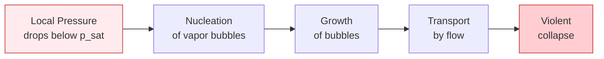
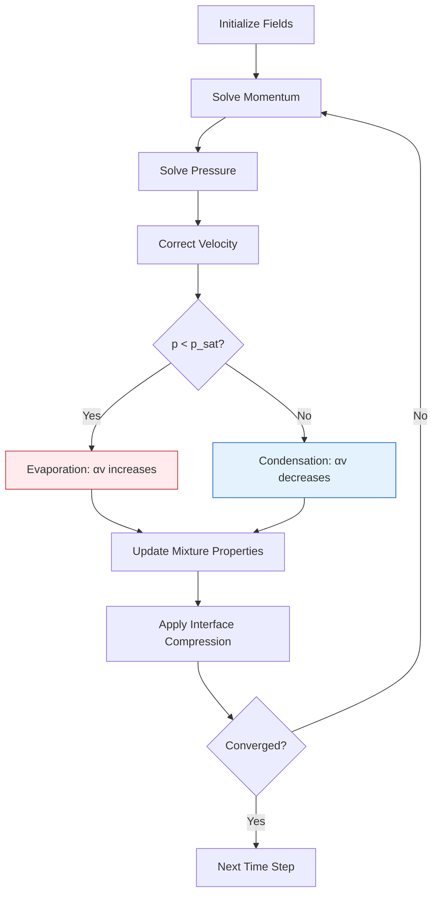
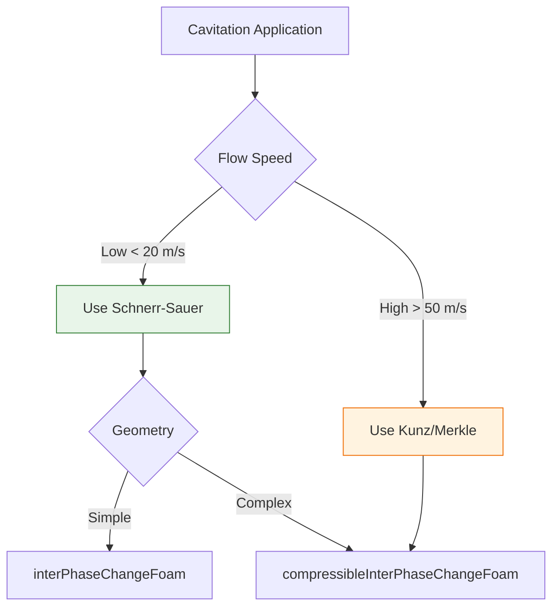

# Cavitation Modeling in OpenFOAM

## Table of Contents
1. [Introduction to Cavitation](#1-introduction-to-cavitation)
2. [Physics of Cavitation](#2-physics-of-cavitation)
3. [Governing Equations](#3-governing-equations)
4. [Cavitation Models in OpenFOAM](#4-cavitation-models-in-openfoam)
5. [Implementation Details](#5-implementation-details)
6. [Numerical Considerations](#6-numerical-considerations)
7. [Applications and Case Studies](#7-applications-and-case-studies)
8. [Best Practices](#8-best-practices)

---

## 1. Introduction to Cavitation

> [!INFO] **Cavitation Definition**
> Cavitation is the formation, growth, and collapse of vapor or gas bubbles in a liquid when local pressure falls below the vapor pressure. This phenomenon is critical in hydraulic machinery, marine propellers, fuel injectors, and medical devices.

### 1.1 Physical Mechanism

Cavitation occurs through four distinct stages:


> **Figure 1:** แผนภาพแสดงสี่ระยะหลักของปรากฏการณ์แควิเทชัน เริ่มจากการลดลงของความดันจนถึงการยุบตัวของฟองไออย่างรุนแรงซึ่งส่งผลต่อความคงทนของวัสดุ


**Key Parameters:**
- $p_{sat}$: Saturation vapor pressure at operating temperature
- $p$: Local pressure in the liquid
- $\sigma$: Cavitation number (dimensionless)

$$\sigma = \frac{p - p_{sat}}{\frac{1}{2}\rho U^2}$$

### 1.2 Types of Cavitation

| Type | Location | Cause | Effects |
|------|----------|-------|---------|
| **Inception** | Low pressure regions | $p < p_{sat}$ | Initial bubble formation |
| **Sheet** | Boundary layers | Separated flow | Large vapor pockets |
| **Cloud** | Wake regions | Vortex shedding | Turbulent vapor clouds |
| **Traveling** | Flow path | Bubbles transported | Damage during collapse |

---

## 2. Physics of Cavitation

### 2.1 Bubble Dynamics

The fundamental equation governing single bubble dynamics is the **Rayleigh-Plesset equation**:

$$R\frac{\mathrm{d}^2R}{\mathrm{d}t^2} + \frac{3}{2}\left(\frac{\mathrm{d}R}{\mathrm{d}t}\right)^2 = \frac{1}{\rho_l}\left(p_B - p_\infty - \frac{2\sigma}{R} - \frac{4\mu_l}{R}\frac{\mathrm{d}R}{\mathrm{d}t}\right) \tag{2.1}$$

**Variables:**
- $R(t)$: Bubble radius [m]
- $p_B$: Pressure inside bubble [Pa]
- $p_\infty$: Far-field pressure [Pa]
- $\rho_l$: Liquid density [kg/m³]
- $\sigma$: Surface tension [N/m]
- $\mu_l$: Liquid dynamic viscosity [Pa·s]

### 2.2 Collapse Mechanisms

> [!WARNING] **Collapse Damage**
> Bubble collapse near solid walls generates:
> - **Micro-jets**: High-velocity liquid jets penetrating the bubble
> - **Shock waves**: Pressure waves up to GPa levels
> - **Erosion**: Material damage from repeated collapses

**Collapse Pressure Estimate:**

$$p_{collapse} \approx \rho_l c_l \frac{\mathrm{d}R/\mathrm{d}t}{R}$$

where $c_l$ is the speed of sound in the liquid.

### 2.3 Cavitation Inception

**Inception Criterion:**

$$\sigma_i = \frac{p_\infty - p_{sat}}{\frac{1}{2}\rho U_\infty^2} < \sigma_{critical}$$

**Critical Parameters:**
- **Nuclei size**: $R_0 \approx 1-100 \,\mu m$
- **Nuclei concentration**: $n_0 \approx 10^8 - 10^{13} \, \text{nuclei/m}^3$
- **Tension factor**: $\tau = \frac{p_{sat} - p}{\frac{2\sigma}{R_0}}$

---

## 3. Governing Equations

### 3.1 Mixture Model Equations

For cavitation modeling, OpenFOAM uses a mixture approach treating liquid-vapor as a single fluid with variable properties.

#### 3.1.1 Continuity Equation

$$\frac{\partial \rho_m}{\partial t} + \nabla \cdot (\rho_m \mathbf{u}_m) = 0 \tag{3.1}$$

where the mixture density is:

$$\rho_m = \alpha_l \rho_l + \alpha_v \rho_v \tag{3.2}$$

#### 3.1.2 Momentum Equation

$$\frac{\partial (\rho_m \mathbf{u}_m)}{\partial t} + \nabla \cdot (\rho_m \mathbf{u}_m \mathbf{u}_m) = -\nabla p + \nabla \cdot \boldsymbol{\tau}_m + \rho_m \mathbf{g} + \mathbf{f}_{\sigma} \tag{3.3}$$

**Mixture velocity:**

$$\mathbf{u}_m = \frac{\alpha_l \rho_l \mathbf{u}_l + \alpha_v \rho_v \mathbf{u}_v}{\rho_m} \tag{3.4}$$

#### 3.1.3 Vapor Transport Equation

$$\frac{\partial (\alpha_v \rho_v)}{\partial t} + \nabla \cdot (\alpha_v \rho_v \mathbf{u}_m) = \dot{m} \tag{3.5}$$

where $\dot{m}$ is the mass transfer rate due to phase change.

---

## 4. Cavitation Models in OpenFOAM

OpenFOAM implements several transport equation-based cavitation models. The key difference is in the formulation of the mass transfer term $\dot{m}$.

### 4.1 Schnerr-Sauer Model

> [!TIP] **Most Popular Model**
> The Schnerr-Sauer model is based on bubble dynamics and assumes a constant bubble number density. It's widely used for hydraulic machinery applications.

#### 4.1.1 Model Formulation

**Mass Transfer Rate:**

$$\dot{m} = \frac{3\rho_l\rho_v}{\rho_m} \frac{\alpha_l\alpha_v}{R_b} \text{sign}(p_{sat} - p) \sqrt{\frac{2}{3}\frac{|p_{sat} - p|}{\rho_l}} \tag{4.1}$$

**Bubble Radius Relation:**

$$\alpha_v = \frac{n_b \frac{4}{3}\pi R_b^3}{1 + n_b \frac{4}{3}\pi R_b^3} \tag{4.2}$$

Solving for $R_b$:

$$R_b = \left(\frac{3\alpha_v}{4\pi n_b (1-\alpha_v)}\right)^{1/3} \tag{4.3}$$

**Variables:**
- $n_b$: Bubble number density [$1/m^3$]
- $R_b$: Mean bubble radius [m]
- $\alpha_l$: Liquid volume fraction ($1 - \alpha_v$)

#### 4.1.2 OpenFOAM Implementation

```cpp
// Schnerr-Sauer model coefficients
SchnerrSauerCoeffs
{
    n           1e+13;    // Bubble number density [1/m^3]
    dNuc        2e-06;    // Nucleation site diameter [m]
    pSat        2300;     // Saturation vapor pressure [Pa]
}

// Key code snippet from SchnerrSauer.C
volScalarField Rb
(
    pow
    (
        max
        (
            (3*alphaV_)/(4*constant::mathematical::pi*nBubbles_),
            dimensionedScalar("minR", dimLength, 1e-6)
        ),
        1.0/3.0
    )
);

// Mass transfer calculation
volScalarField pCoeff
(
    coeff1_*sqrt(max(pSat_ - p, dimensionedScalar("zero", pSat_.dimensions(), 0)))
);

mDotAlphal_ = coeff2_ * pCoeff * Rb;
```

### 4.2 Kunz Model

The Kunz model uses separate empirical functions for vaporization and condensation.

#### 4.2.1 Model Formulation

**Vaporization (Evaporation):**

$$\dot{m}^+ = \frac{C_{prod}\rho_v \alpha_l \min[0, p - p_{sat}]}{(1/2 \rho_l U_\infty^2) t_\infty} \tag{4.4}$$

**Condensation:**

$$\dot{m}^- = \frac{C_{dest}\rho_l \alpha_l^2 \alpha_v}{t_\infty} \tag{4.5}$$

**Total Mass Transfer:**

$$\dot{m} = \dot{m}^+ + \dot{m}^- \tag{4.6}$$

**Coefficients:**
- $C_{prod}$: Vaporization coefficient (typically 100-1000)
- $C_{dest}$: Condensation coefficient (typically 50-100)
- $t_\infty$: Characteristic time scale

#### 4.2.2 OpenFOAM Implementation

```cpp
KunzCoeffs
{
    UInf        20;       // Characteristic velocity [m/s]
    tInf        0.005;    // Characteristic time [s]
    CProd       100;      // Production coefficient
    CDest       100;      // Destruction coefficient
    pSat        2300;     // Saturation pressure [Pa]
}
```

### 4.3 Merkle Model

Similar to Kunz but with different scaling:

$$\dot{m} = C_{cav} \frac{\rho_v \alpha_l}{t_{\infty}} \max(p_{sat} - p, 0) - C_{cond} \frac{\rho_l \alpha_v}{t_{\infty}} \max(p - p_{sat}, 0) \tag{4.7}$$

### 4.4 Model Comparison

| Model | Strengths | Weaknesses | Best Applications |
|-------|-----------|------------|-------------------|
| **Schnerr-Sauer** | Physics-based, smooth transition | Sensitive to $n_b$ value | Hydraulic machinery, pumps |
| **Kunz** | Numerically stable | Empirical coefficients | Ship propellers, nozzles |
| **Merkle** | Robust for high-speed flows | Less accurate for low $\sigma$ | Fuel injectors, cavitating nozzles |

---

## 5. Implementation Details

### 5.1 Solver Selection

OpenFOAM provides specialized solvers for cavitation:

| Solver | Description | Use Case |
|--------|-------------|----------|
| **interPhaseChangeFoam** | VOF method with phase change | Surface ship propellers, general cavitation |
| **compressibleInterPhaseChangeFoam** | Compressible VOF with phase change | High-speed cavitating flows |
| **cavitatingFoam** | Specialized for cavitation | Hydrofoils, venturi tubes |

### 5.2 Case Setup Structure

```
cavitationCase/
├── 0/
│   ├── alpha.water          # Volume fraction (initially 1)
│   ├── p                    # Pressure field
│   └── U                    # Velocity field
├── constant/
│   ├── transportProperties  # Phase properties and cavitation model
│   ├── thermophysicalProperties
│   └── turbulenceProperties
├── system/
│   ├── controlDict
│   ├── fvSchemes
│   └── fvSolution
└── Allrun                   # Execution script
```

### 5.3 Configuration Example

#### transportProperties

```foam
phases (water vapor);

water
{
    transportModel  Newtonian;
    nu              [0 2 -1 0 0 0 0] 1e-06;    // Kinematic viscosity [m^2/s]
    rho             [1 -3 0 0 0 0 0] 1000;     // Density [kg/m^3]
}

vapor
{
    transportModel  Newtonian;
    nu              [0 2 -1 0 0 0 0] 4.27e-05;
    rho             [1 -3 0 0 0 0 0] 0.025;      // Low density!
}

// Phase change model
phaseChangeModel SchnerrSauer;

SchnerrSauerCoeffs
{
    n               1e+13;    // Bubble number density
    dNuc            2e-06;    // Nucleation diameter
    pSat            2300;     // Vapor pressure at operating temperature
}

// Surface tension
sigma           [1 0 -2 0 0 0 0] 0.07;   // Water-air at 20°C [N/m]
```

#### fvSchemes

```foam
ddtSchemes
{
    default         Euler;
}

gradSchemes
{
    default         Gauss linear;
    grad(p)         Gauss linear;
    grad(U)         Gauss linear;
}

divSchemes
{
    div(rhoPhi,U)   Gauss limitedLinearV 1;
    div(phi,alpha)  Gauss vanLeer;
    div(phir,alpha) Gauss interfaceCompression;
}

laplacianSchemes
{
    default         Gauss linear corrected;
}
```

#### fvSolution

```foam
solvers
{
    p
    {
        solver          GAMG;
        tolerance       1e-06;
        relTol          0.01;
    }

    pFinal
    {
        $p;
        tolerance       1e-06;
        relTol          0;
    }

    U
    {
        solver          smoothSolver;
        smoother        GaussSeidel;
        tolerance       1e-05;
        relTol          0.1;
    }
}

PIMPLE
{
    nCorrectors      2;
    nNonOrthogonalCorrectors 1;
    nAlphaCorr       2;
    nAlphaSubCycles  2;
    cAlpha           1;     // Interface compression factor
}

MULESCorr       yes;    // Use MULES for boundedness
```

### 5.4 Algorithm Workflow


> **Figure 2:** แผนผังลำดับขั้นตอนการคำนวณการจำลองแควิเทชัน โดยแสดงกลไกการเปลี่ยนสถานะเฟส (ระเหย/ควบแน่น) ที่ถูกควบคุมโดยความดันภายในแต่ละขั้นตอนการวนซ้ำ


---

## 6. Numerical Considerations

### 6.1 Stiffness Issues

Cavitation models introduce numerical stiffness due to:

1. **Large density ratios**: $\rho_l/\rho_v \approx 1000-40000$
2. **Rapid phase change**: Time scales can be microseconds
3. **Strong pressure-velocity coupling**

**Mitigation Strategies:**

| Issue | Solution |
|-------|----------|
| Stiff source terms | Implicit treatment, under-relaxation |
| Large density ratio | Compressible formulation, preconditioning |
| Interface sharpness | MULES with compression, adaptive time stepping |

### 6.2 Time Step Constraints

**CFL Condition:**

$$\Delta t < \text{CFL} \cdot \frac{\Delta x}{|\mathbf{u}| + c_s}$$

where $c_s$ is the speed of sound in the mixture.

**Recommended:**
- Initial transients: $\text{Co} < 0.3$
- Steady-state: $\text{Co} < 0.5$ (with under-relaxation)

```cpp
// In controlDict
maxCo          0.3;      // Maximum Courant number
maxAlphaCo     0.3;      // Maximum Courant for alpha
adjustTimeStep yes;
```

### 6.3 Mesh Requirements

**Resolution Guidelines:**

| Region | Requirement | Purpose |
|--------|-------------|---------|
| **Near walls** | $y^+ \approx 1-5$ | Boundary layer resolution |
| **Low pressure zones** | 10-15 cells per bubble | Capture nucleation |
| **Vapor cavity** | 5-10 cells across cavity | Interface tracking |

**Refinement Strategy:**

```cpp
// In snappyHexMeshDict
refinementRegions
{
    cavitationZone
    {
        mode            distance;
        levels          ((0.001 2) (0.005 1));
    }
}
```

### 6.4 Convergence Issues

> [!WARNING] **Common Problems**
> - **Oscillating vapor volume**: Reduce time step, increase under-relaxation
> - **Non-physical void fraction**: Check MULES settings, verify mass conservation
> - **Pressure spikes**: Improve mesh quality, check boundary conditions

**Solution Strategies:**

```foam
// Under-relaxation factors in fvSolution
relaxationFactors
{
    fields
    {
        p               0.3;
        rho             0.05;
    }
    equations
    {
        U               0.5;
        "(U|k|epsilon)" 0.5;
    }
}
```

---

## 7. Applications and Case Studies

### 7.1 Hydraulic Machinery

#### 7.1.1 Centrifugal Pumps

**Key Parameters:**
- **NPSH** (Net Positive Suction Head):
  $$\text{NPSH} = \frac{p_{inlet} - p_{sat}}{\rho g} + \frac{U_{inlet}^2}{2g}$$

- **Efficiency Drop**: 5-15% loss under cavitation

**Simulation Setup:**

```foam
// Inlet boundary condition for p
inlet
{
    type            fixedValue;
    value           uniform 2e5;    // 2 bar absolute
}

// Outlet boundary condition
outlet
{
    type            fixedValue;
    value           uniform 1e5;    // 1 bar absolute
}
```

#### 7.1.2 Marine Propellers

**Cavitation Number for Propellers:**

$$\sigma = \frac{p_\infty - p_{sat}}{\frac{1}{2}\rho (2\pi n D)^2}$$

where:
- $n$: Rotational speed [rev/s]
- $D$: Propeller diameter [m]

**Propeller Cavitation Patterns:**

| Type | Location | Cause |
|------|----------|-------|
| **Tip vortex** | Blade tips | Low pressure in vortex core |
| **Sheet** | Suction side | Flow separation |
| **Hub vortex** | Hub region | Swirl flow |

### 7.2 Fuel Injectors

**High-Speed Cavitation Characteristics:**

- **Velocity**: 100-300 m/s
- **Pressure drop**: 50-200 bar
- **Time scale**: < 1 μs for bubble collapse

**Spray Enhancement:**

Cavitation improves atomization by:
1. Breaking up liquid jets
2. Creating turbulence
3. Enhancing spray cone angle

### 7.3 Venturi Tubes

**Cavitation Number:**

$$\sigma_v = \frac{p_2 - p_{sat}}{p_1 - p_2}$$

where:
- $p_1$: Upstream pressure
- $p_2$: Throat pressure

**Validation Case:**

```bash
# Standard Venturi cavitation test
cd $FOAM_TUTORIALS/multiphase/interPhaseChangeFoam/
cavitatingVenturi/
blockMesh
interPhaseChangeFoam
paraFoam
```

---

## 8. Best Practices

### 8.1 Model Selection Guidelines


> **Figure 3:** แผนผังการตัดสินใจเลือกแบบจำลองและตัวแก้สมการแควิเทชันที่เหมาะสม โดยใช้ความเร็วการไหลและความซับซ้อนของเรขาคณิตเป็นเกณฑ์ในการเลือกเพื่อความแม่นยำและเสถียรภาพ


### 8.2 Verification Checklist

- [ ] **Mass conservation**: $\frac{\partial}{\partial t}\int \rho \, dV + \int \rho \mathbf{u} \cdot d\mathbf{A} = 0$
- [ ] **Volume fraction bounds**: $0 \leq \alpha_v \leq 1$
- [ ] **Cavitation number consistency**: $\sigma$ matches experimental data
- [ ] **Grid independence**: Results unchanged with mesh refinement
- [ ] **Time step independence**: Converged with $\Delta t$ reduction

### 8.3 Troubleshooting Guide

| Symptom | Diagnosis | Remedy |
|---------|-----------|--------|
| **Diverging pressure** | Time step too large | Reduce Co to < 0.2 |
| **Vapor spreading** | Insufficient compression | Increase `cAlpha` to 1.5-2.0 |
| **Mass imbalance** | MULES issue | Check `nAlphaSubCycles`, increase to 3-4 |
| **No cavitation** | $p > p_{sat}$ everywhere | Lower outlet pressure, increase velocity |
| **Excessive cavitation** | Over-prediction | Reduce $n_b$, check $p_{sat}$ value |

### 8.4 Performance Optimization

**Parallel Efficiency:**

```foam
// In decomposeParDict
method          scotch;

numberOfSubdomains  16;

coeffs
{
    n   16;
    d   0.5;
}
```

**Memory Management:**

```foam
// In controlDict
application     interPhaseChangeFoam;

startFrom       latestTime;

writeControl    timeStep;
writeInterval   50;
```

---

## 9. Example Cases

### 9.1 Simple Cavitation Validation

**Objective**: Verify cavitation model implementation

**Setup:**
```foam
// 0/alpha.water
dimensions      [0 0 0 0 0 0 0];
internalField   uniform 1;    // Initially all liquid

boundaryField
{
    inlet
    {
        type            fixedValue;
        value           uniform 1;
    }
    outlet
    {
        type            zeroGradient;
    }
    walls
    {
        type            zeroGradient;
    }
}
```

**Run:**
```bash
blockMesh
interPhaseChangeFoam
```

**Post-process:**
```python
import numpy as np
import matplotlib.pyplot as plt

# Read vapor fraction
alpha = np.loadtxt('postProcessing/vaporFraction/0/vaporFraction.csv')

# Plot
plt.figure(figsize=(10, 6))
plt.plot(alpha[:, 0], alpha[:, 1])
plt.xlabel('Time [s]')
plt.ylabel('Vapor Volume Fraction')
plt.title('Cavitation Development')
plt.grid(True)
plt.show()
```

### 9.2 Hydrofoil Cavitation

**Geometry:** NACA 0015 hydrofoil

**Conditions:**
- Velocity: 10 m/s
- Angle of attack: 8°
- Cavitation number: $\sigma = 1.5$

**Expected Results:**
- Sheet cavitation on suction side
- Re-entrant jet formation
- Cloud cavitation shedding

---

## 10. Advanced Topics

### 10.1 Thermodynamic Effects

In cryogenic liquids, thermal effects become important:

$$\Delta T = \frac{\rho_v L_v}{\rho_l c_{p,l}} \alpha_v$$

where:
- $L_v$: Latent heat of vaporization [J/kg]
- $c_{p,l}$: Liquid specific heat [J/kg·K]

### 10.2 Turbulence-Cavitation Interaction

**Modified Turbulence Models:**

```foam
// In constant/turbulenceProperties
simulationType  RAS;

RAS
{
    RASModel        kEpsilon;
    turbulence      on;

    // Cavitation correction
    cavitation      on;
    cavitationModel SchnerrSauer;
}
```

### 10.3 Scale Effects

**Scale-up Laws:**

$$\sigma_{model} = \sigma_{prototype}$$

**Scaling considerations:**
- Reynolds number similarity
- Weber number similarity
- Cavitation number matching

---

## Summary

Key takeaways for successful cavitation modeling in OpenFOAM:

1. **Model Selection**: Schnerr-Sauer for most applications, Kunz for stability
2. **Mesh Quality**: Critical near walls and low-pressure zones
3. **Time Stepping**: Conservative Co numbers (< 0.3) for accuracy
4. **Verification**: Always check mass conservation and boundedness
5. **Validation**: Compare with experimental data when available

> [!TIP] **Recommended Workflow**
> 1. Start with coarse mesh for initial development
> 2. Verify with analytical solutions
> 3. Refine mesh in critical regions
> 4. Perform grid convergence study
> 5. Validate against experimental data
