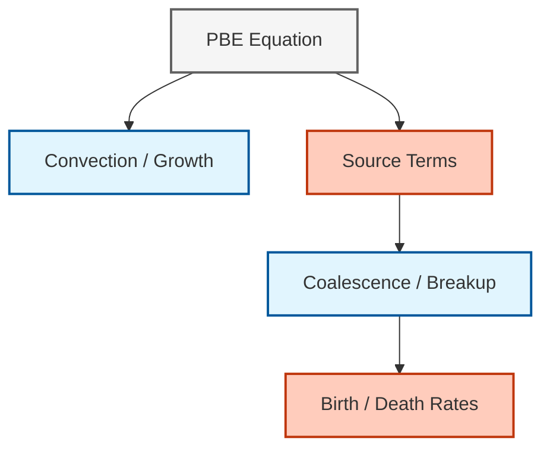
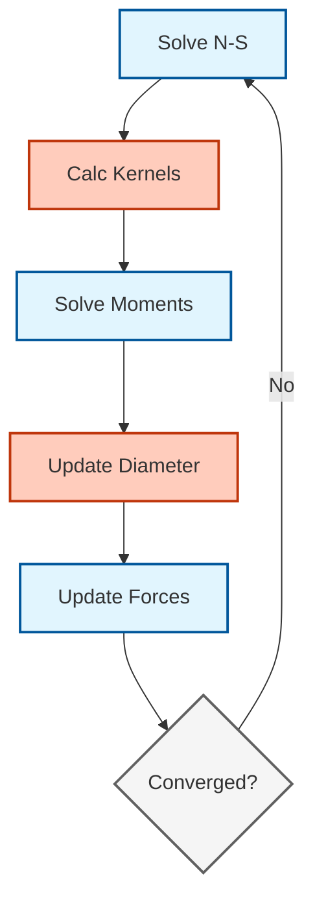

# Population Balance Modeling in OpenFOAM

## 1. Introduction (บทนำ)

**การสร้างแบบจำลองสมดุลประชากร (Population Balance Modeling - PBM)** เป็นกรอบการทำงานทางคณิตศาสตร์ที่ทรงพลังสำหรับอธิบายการวิวัฒนาการของระบบอนุภาคผ่านกระบวนการพลศาสตร์ต่างๆ รวมถึงการเกิดนิวเคลียส การเจริญเติบโต การรวมตัว (coalescence) และการแตกตัว (breakup) ในระบบหลายเฟส

สิ่งนี้มีความสำคัญเมื่อพฤติกรรมของระบบขึ้นอยู่กับการกระจายขนาด (Size Distribution) ของอนุภาค ฟอง หรือหยด เช่น ในเครื่องปฏิกรณ์เคมี กระบวนการตกผลึก หรือคอลัมน์ฟอง

> [!INFO] **ความสำคัญของ PBM**
> PBM ช่วยให้เราสามารถติดตามการวิวัฒนาการของการกระจายขนาดอนุภาคได้อย่างมีรายละเอียด ซึ่งส่งผลต่อ:
> - อัตราการถ่ายเทมวลและความร้อนระหว่างเฟส
> - พื้นที่ผิวรวมที่มีอยู่สำหรับปฏิกิริยาเคมี
> - แรงลากและพลวัตการไหลของเฟสกระจาย
> - ประสิทธิภาพการแยกส่วนในระบบอุตสาหกรรม

## 2. Population Balance Equation (สมการสมดุลประชากร)

### 2.1 สมการ PBE ทั่วไป

สมการ PBE อธิบายการเปลี่ยนแปลงของฟังก์ชันความหนาแน่นจำนวน $n(\mathbf{x}, \xi, t)$ ซึ่งระบุจำนวนอนุภาคที่มีคุณสมบัติ $\xi$ ที่ตำแหน่ง $\mathbf{x}$ และเวลา $t$:

$$\frac{\partial n(\mathbf{x}, \xi, t)}{\partial t} + \nabla \cdot [\mathbf{u}(\mathbf{x}, t) n(\mathbf{x}, \xi, t)] + \frac{\partial}{\partial \xi}[G(\xi, \mathbf{x}, t) n(\mathbf{x}, \xi, t)] = B_{agg} + B_{break} - D_{agg} - D_{break} \tag{1}$$

**ตัวแปร:**
- $n(\mathbf{x}, \xi, t)$ = ฟังก์ชันความหนาแน่นจำนวนอนุภาค ($1/m^4$)
- $\mathbf{x}$ = พิกัดปริภูมิทางกายภาพ
- $\xi$ = พิกัดปริภูมิคุณสมบัติ (โดยทั่วไปคือขนาดหรือปริมาตร)
- $t$ = เวลา
- $\mathbf{u}$ = ความเร็วของของไหล ($m/s$)
- $G$ = อัตราการเจริญเติบโตของอนุภาค
- $B_{agg}, B_{break}$ = เทอมการเกิดจากการรวมตัวและการแตกตัว
- $D_{agg}, D_{break}$ = เทอมการตายจากการรวมตัวและการแตกตัว

### 2.2 สมการ PBE สำหรับการกระจายขนาดฟอง

สำหรับการกระจายขนาดฟอง $n(R,t)$ โดยที่ $R$ คือรัศมีฟอง:

$$\frac{\partial n(R,t)}{\partial t} + \frac{\partial}{\partial R}\left[G(R) n(R,t)\right] = B(R,t) - D(R,t) \tag{2}$$

สำหรับระบบที่มีการแพร่ (convection) ในปริภูมิ:

$$\frac{\partial n(V, t)}{\partial t} + \nabla \cdot (\mathbf{u} n(V, t)) + \frac{\partial}{\partial V}(G n(V, t)) = B - D \tag{3}$$

โดยที่:
- $V$ = ปริมาตรของอนุภาค ($m^3$)
- $G$ = อัตราการเจริญเติบโต (Growth Rate)
- $B$ = อัตราการเกิด (Birth Rate) เนื่องจากการแตกตัว (Breakup) และการรวมตัว (Coalescence)
- $D$ = อัตราการตาย (Death Rate)


> **Figure 1:** แผนภาพแสดงองค์ประกอบทางฟิสิกส์ของสมการสมดุลประชากร (PBE) ซึ่งครอบคลุมถึงกลไกการขนส่ง การเจริญเติบโต และการเปลี่ยนแปลงจำนวนประชากรอนุภาคผ่านกระบวนการรวมตัวและแตกตัว


## 3. Solution Methods in OpenFOAM (วิธีการแก้ปัญหา)

OpenFOAM ให้วิธีการหลากหลายในการแก้สมการ PBE แต่ละวิธีมีข้อดีและข้อเสียที่แตกต่างกัน:


> **Figure 2:** แผนผังลำดับขั้นตอนการคำนวณในแต่ละรอบการวนซ้ำของ Solver สำหรับแบบจำลองสมดุลประชากร โดยเน้นการเชื่อมโยงระหว่างสมการโมเมนต์และแรงที่ส่วนต่อประสานระหว่างเฟส


### 3.1 Method of Moments (MOM)

**หลักการ:** แทนที่การแก้สมการสำหรับการแจกแจงโดยตรงด้วยการแก้สมการสำหรับโมเมนต์ (Moments) ของการแจกแจง

**นิยามโมเมนต์:**

$$m_k = \int_0^\infty \xi^k n(\xi) d\xi \tag{4}$$

หรือสำหรับความยาว $L$:

$$m_k = \int_0^\infty L^k n(L) dL \tag{5}$$

**ความหมายทางกายภาพของโมเมนต์แรก:**

| โมเมนต์ | ความหมายทางกายภาพ | หน่วย |
|----------|-------------------|--------|
| $m_0$ | ความหนาแน่นจำนวนฟองรวม | จำนวนฟองต่อปริมาตร |
| $m_1$ | ความหนาแน่นความยาวฟองรวม | $m^{-2}$ |
| $m_2$ | ความหนาแน่นพื้นที่ผิว | $m^{-1}$ |
| $m_3$ | สัดส่วนปริมาตร $\alpha$ | ไม่มีหน่วย |

**สมการโมเมนต์:**

$$\frac{\partial m_k}{\partial t} + \nabla \cdot (m_k \mathbf{u}) = k G_{k-1} + S_k \tag{6}$$

โดยที่:
- $G_{k-1}$ = การมีส่วนร่วมของการเจริญเติบโต
- $S_k$ = เทอมการแตกและการรวมตัว

#### 3.1.1 Quadrature Method of Moments (QMOM)

**Quadrature Method of Moments (QMOM)** ใช้เพื่อปิดระบบสมการโมเมนต์โดยการประมาณค่าอินทิกรัลด้วย Quadrature rules

**หลักการ:**

$$\int_0^\infty f(L) n(L) dL \approx \sum_{i=1}^{N_q} w_i f(L_i) \tag{7}$$

โดยที่:
- $w_i$ = น้ำหนัก quadrature (weights)
- $L_i$ = จุด abscissae (quadrature points)
- $N_q$ = จำนวน quadrature points

**ข้อดี:**
- ประหยัดการคำนวณมาก
- เหมาะสำหรับการจำลองขนาดใหญ่
- สามารถติดตามการเปลี่ยนแปลงของขนาดเฉลี่ยได้ดี

**ข้อเสีย:**
- สูญเสียข้อมูลรายละเอียดของรูปร่างการแจกแจง
- ไม่สามารถกู้คืนการแจกแจงขนาดที่สมบูรณ์ได้

<details>
<summary>📂 <b>Source: .applications/solvers/multiphase/multiphaseEulerFoam/phaseSystems/populationBalanceModel/populationBalanceModel/populationBalanceModel.H</b></summary>

**คำอธิบาย (Explanation):**
โค้ดตัวอย่างด้านล่างนี้แสดงโครงสร้างพื้นฐานของการ Implement QMOM ใน OpenFOAM ซึ่งประกอบด้วย:
1. การคำนวณโมเมนต์จากฟังก์ชันการแจกแจงขนาด
2. การจัดเก็บ weights และ abscissae สำหรับ quadrature
3. การอัปเดตค่า quadrature จากโมเมนต์ที่คำนวณได้

**แนวคิดสำคัญ (Key Concepts):**
- **Moment Calculation**: การคำนวณโมเมนต์ $m_k$ จากการอินทิเกรตคูณกับ $L^k$
- **Quadrature Weights ($w_i$)**: น้ำหนักที่ใช้ในการประมาณค่าอินทิกรัล
- **Abscissae ($L_i$)**: จุดตัวอย่างขนาดที่ใช้ในการคำนวณ
- **Moment Inversion**: กระบวนการแปลงจากโมเมนต์ไปเป็น weights และ abscissae

```cpp
// Calculate k-th moment from size distribution
// Domain integral of (size^k * number density)
Mk[k] = fvc::domainIntegrate(pow(L, k)*n).value();

// Quadrature Method of Moments implementation
class QMOM
{
private:
    // Quadrature weights and abscissae (size points)
    scalarField weights_;
    scalarField abscissae_;

    // Number of moments to track
    label nMoments_;

public:
    // Calculate moments from weights and abscissae
    // m_k = sum(w_i * L_i^k) for all quadrature points
    void calculateMoments()
    {
        for (label k = 0; k < nMoments_; k++)
        {
            m_[k] = 0;
            for (label i = 0; i < weights_.size(); i++)
            {
                m_[k] += weights_[i] * pow(abscissae_[i], k);
            }
        }
    }

    // Update quadrature points and weights from calculated moments
    // This involves solving the moment inversion problem
    void updateQuadrature();
};
```

</details>

### 3.2 Class Method (Discrete Method) / Method of Classes (MOC)

**หลักการ:** แบ่งช่วงขนาดของอนุภาคออกเป็นช่วงๆ (Bins หรือ Classes) และแก้สมการการขนส่งสำหรับแต่ละ Class

**สมการการขนส่ง:**

$$\frac{\partial n_i}{\partial t} + \nabla \cdot (n_i \mathbf{u}) = \sum_j \beta_{ij} n_j - \sum_j \beta_{ji} n_i \tag{8}$$

โดยที่:
- $n_i$ = ความหนาแน่นจำนวนอนุภาคใน class $i$
- $\beta_{ij}$ = เคอร์เนลการโอนจาก class $j$ ไปยัง class $i$

**การแบ่งส่วน (Sectional Method):**

$$N_i = \int_{R_i}^{R_{i+1}} n(R) dR \tag{9}$$

การอนุรักษ์มวลถูกบังคับใช้ผ่านการกำหนดส่วนและการคำนวณการไหลอย่างระมัดระวัง

**ข้อดี:**
- ให้รายละเอียดรูปร่างของการแจกแจงได้ดี
- การ implement ฟังก์ชันเคอร์เนลที่ซับซ้อนได้ง่าย
- การปรับตัวตาข่ายที่ยืดหยุ่น
- แก้สมการการแจกแจงขนาดโดยตรง

**ข้อเสีย:**
- มีต้นทุนการคำนวณสูงหากใช้จำนวน Class มาก
- การกระจายตัวเชิงตัวเลขข้ามขอบเขตช่อง
- ต้องการความละเอียดของ mesh สูง

### 3.3 Direct Quadrature Method of Moments (DQMOM)

**หลักการ:** วิธีการที่รวมความได้เปรียบของทั้ง MOM และ MOC โดยการแก้สมการการขนส่งโดยตรงสำหรับ weights และ abscissae

**ข้อดี:**
- สมดุลระหว่างความเร็วและความแม่นยำ
- สามารถจัดการกับการกระจายขนาดที่ซับซ้อนได้
- เหมาะสำหรับการจำลองที่มีการเปลี่ยนแปลงของการแจกแจงอย่างรวดเร็ว

**ข้อเสีย:**
- ซับซ้อนในการใช้งาน
- ต้องการความเข้าใจทางทฤษฎีที่ลึกซึ้ง

<details>
<summary>📂 <b>Source: .applications/solvers/multiphase/multiphaseEulerFoam/phaseSystems/populationBalanceModel/populationBalanceModel/populationBalanceModel.H</b></summary>

**คำอธิบาย (Explanation):**
โค้ดนี้แสดงการ Implement DQMOM ใน OpenFOAM ซึ่งแตกต่างจาก QMOM ตรงที่:
1. แก้สมการการขนส่งโดยตรงสำหรับ weights และ abscissae
2. คำนวณ source terms จากการรวมตัวและแตกตัวโดยตรง
3. สามารถจัดการกับการกระจายขนาดที่ซับซ้อนและเปลี่ยนแปลงเร็ว

**แนวคิดสำคิดสำคัญ (Key Concepts):**
- **Transport Equations for Weights/Abscissae**: การแก้สมการโดยตรงสำหรับตัวแปร quadrature
- **Source Term Calculation**: การคำนวณเทอมต้นทางจาก kernel functions
- **Coalescence Kernel**: ฟังก์ชันที่อธิบายอัตราการรวมตัวของฟอง
- **Quadrature Points**: จุดที่ใช้ในการประมาณค่าการกระจายขนาด

```cpp
// DQMOM implementation template
template<class CloudType>
class DQMOM
    : public PopulationBalanceModel<CloudType>
{
private:
    // Quadrature points (abscissae) and weights
    scalarField weights_;
    scalarField abscissae_;

    // Calculate moments from quadrature
    void calculateMoments();

    // Update quadrature from moments
    void updateQuadrature();

public:
    // Calculate source terms for coalescence and breakup
    void calculateSourceTerms()
    {
        // Calculate coalescence source term
        forAll(weights_, i)
        {
            scalar source = 0;
            forAll(weights_, j)
            {
                source += coalescenceKernel_(abscissae_[i], abscissae_[j])
                        * weights_[i] * weights_[j];
            }
            sources_[i] = source;
        }
    }

    // Solve transport equations for weights and abscissae
    void solve();
};
```

</details>

### 3.4 การเปรียบเทียบวิธีการ

| วิธีการ | หลักการ | ความเร็ว | ความแม่นยำ | ความจำใช้ |
|------------|------------|-----------|--------------|------------|
| **MOC (Method of Classes)** | แบ่งการกระจายขนาดต่อเนื่องเป็นคลาสขนาดแบบไม่ต่อเนื่อง | ช้า | สูงมาก | สูง |
| **MOM (Method of Moments)** | ติดตามโมเมนต์ของการกระจายขนาด | เร็ว | ปานกลาง | ต่ำ |
| **QMOM** | ใช้จุดและน้ำหนักควอดราเจอร์ | ปานกลาง | ปานกลาง | ปานกลาง |
| **DQMOM** | ใช้จุดและน้ำหนักควอดราเจอร์ + การแก้สมการการขนส่ง | เร็ว | สูง | ต่ำ |

## 4. Interaction Kernels (ฟังก์ชันเคอร์เนลการโต้ตอบ)

หัวใจสำคัญของ PBM คือแบบจำลองสำหรับการรวมตัวและการแตกตัว

### 4.1 Coalescence (การรวมตัว)

การรวมตัวขึ้นอยู่กับความถี่ในการชน (Collision Frequency) และประสิทธิภาพของการรวมตัว (Coalescence Efficiency):

$$\beta(V_i, V_j) = h(V_i, V_j) \lambda(V_i, V_j) \tag{10}$$

**เทอมการเกิดและเทอมการตาย:**

- **เทอมการเกิด:** $B_{agg} = \frac{1}{2} \int_0^\xi \beta(\xi', \xi - \xi') n(\xi') n(\xi - \xi') d\xi'$
- **เทอมการตาย:** $D_{agg} = n(\xi) \int_0^\infty \beta(\xi, \xi') n(\xi') d\xi'$

**แบบจำลองที่ใช้ใน OpenFOAM:**

| แบบจำลอง | สมการ | การประยุกต์ใช้ |
|------------|----------|----------------|
| **Luo** | $\beta = \frac{\pi}{4}(d_i + d_j)^2 u_{ij}$ | คอลัมน์ฟอง |
| **Prince & Blanch** | $\beta = \frac{\pi}{4}(d_i + d_j)^2 (u_i^2 + u_j^2)^{1/2}$ | ระบบที่มีความปั่นป่วนสูง |

โดยที่:
- $d_i, d_j$ = เส้นผ่านศูนย์กลางของฟอง
- $u_{ij}$ = ความเร็วในการชน

<details>
<summary>📂 <b>Source: .applications/solvers/multiphase/multiphaseEulerFoam/phaseSystems/populationBalanceModel/coalescenceModel/coalescenceModel.H</b></summary>

**คำอธิบาย (Explanation):**
โค้ดนี้แสดงโครงสร้างของ Coalescence Model ใน OpenFOAM:
1. **coalescenceModel**: Base class สำหรับทุกแบบจำลองการรวมตัว
2. **LuoCoalescence**: Implementation ของแบบจำลอง Luo ที่คำนวณค่า kernel จากความเร็วการชนและคุณสมบัติทางกายภาพ
3. การคำนวณคำนึงถึงความตึงผิว ความหนาแน่น และอัตราการสลายตัวของพลังงาน

**แนวคิดสำคัญ (Key Concepts):**
- **Collision Frequency**: อัตราการชนของฟองซึ่งขึ้นกับขนาดและความเร็ว
- **Coalescence Efficiency**: ความน่าจะเป็นที่ฟองจะรวมตัวเมื่อชนกัน
- **Weber Number**: จำนวนไร้มิติที่เปรียบเทียบแรงเฉื่อยกับแรงความตึงผิว
- **Turbulent Dissipation**: อัตราการสลายตัวของพลังงานทัวร์บูลเลนท์

```cpp
// Base class for coalescence models
class coalescenceModel
{
public:
    // Calculate coalescence kernel between two bubble sizes
    // Returns the rate of coalescence between bubbles of diameters d1 and d2
    virtual tmp<volScalarField> calculateKernel
    (
        const volScalarField& d1,
        const volScalarField& d2
    ) const = 0;
};

// Luo coalescence model implementation
class LuoCoalescence
    : public coalescenceModel
{
private:
    // Model coefficients
    dimensionedScalar C_;      // Coalescence constant
    volScalarField rho_;        // Density field
    volScalarField sigma_;      // Surface tension
    volScalarField epsilon_;    // Turbulent dissipation rate
    volVectorField U1_;         // Velocity field 1
    volVectorField U2_;         // Velocity field 2

public:
    tmp<volScalarField> calculateKernel
    (
        const volScalarField& d1,
        const volScalarField& d2
    ) const override
    {
        // Calculate collision velocity magnitude
        volScalarField uCollision
        (
            sqrt
            (
                sqr(U1_) + sqr(U2_)
                - 2*(U1_ & U2_)
            )
        );

        // Calculate Luo coalescence kernel
        // beta = (pi/4) * (d1 + d2)^2 * u_collision * exp(-C * We^0.5)
        return constant::mathematical::pi/4.0
             * sqr(d1 + d2)
             * uCollision
             * exp(-C_ * sqrt(rho_/sigma_) * pow(d1 + d2, 2.0/3.0) * epsilon_);
    }
};
```

</details>

### 4.2 Breakup (การแตกตัว)

การแตกตัวขึ้นอยู่กับอัตราการแตกตัวและฟังก์ชันการแจกแจงขนาดของอนุภาคลูก (Daughter Size Distribution):

$$S_i = \int_V^\infty f(V, V') g(V') n(V') dV' - g(V) n(V) \tag{11}$$

**เทอมการเกิดและเทอมการตาย:**

- **เทอมการเกิด:** $B_{break} = \int_\xi^\infty \beta_b(\xi', \xi) b(\xi, \xi') n(\xi') d\xi'$
- **เทอมการตาย:** $D_{break} = \beta_b(\xi) n(\xi)$

**แบบจำลองที่ใช้ใน OpenFOAM:**

| แบบจำลอง | สมการ | การประยุกต์ใช้ |
|------------|----------|----------------|
| **Luo** | $g(d) = C_1 \epsilon^{1/3} d^{2/3} \exp(-C_2 \frac{\sigma}{\rho \epsilon^{2/3} d^{5/3}})$ | คอลัมน์ฟอง |
| **Martinez-Bazán** | $g(d) = K \frac{\sigma^{1/2}}{\rho^{1/2} d^{5/6}} \epsilon^{2/3}$ | ระบบที่มีความปั่นป่วนสูง |

โดยที่:
- $\epsilon$ = อัตราการสลายตัวของพลังงานทัวร์บูลเลนท์ ($m^2/s^3$)
- $\sigma$ = ความตึงผิว ($N/m$)
- $\rho$ = ความหนาแน่น ($kg/m^3$)
- $C_1, C_2, K$ = สัมประสิทธิ์ประจำแบบจำลอง

<details>
<summary>📂 <b>Source: .applications/solvers/multiphase/multiphaseEulerFoam/phaseSystems/populationBalanceModel/breakupModel/breakupModel.H</b></summary>

**คำอธิบาย (Explanation):**
โค้ดนี้แสดงโครงสร้างของ Breakup Model ใน OpenFOAM:
1. **breakupModel**: Base class สำหรับทุกแบบจำลองการแตกตัว
2. **LuoBreakup**: Implementation ที่คำนวณอัตราการแตกตัวจาก Weber number
3. แบบจำลองพิจารณาสมดุลระหว่างแรงทัวร์บูลเลนท์ (ทำให้แตก) และแรงความตึงผิว (ต้านการแตก)

**แนวคิดสำคัญ (Key Concepts):**
- **Breakup Rate**: อัตราที่ฟองแตกตัวต่อหน่วยเวลา
- **Daughter Size Distribution**: การกระจายขนาดของฟองลูกหลังจากการแตกตัว
- **Weber Number (We)**: จำนวนไร้มิติ $\frac{\rho d \epsilon^{2/3}}{\sigma}$ ที่วัดอัตราสัมพัทธ์ของแรงเฉื่อยต่อแรงความตึงผิว
- **Critical Weber Number**: ค่า We ที่เกินกว่านั้นฟองจะแตกตัว

```cpp
// Base class for breakup models
class breakupModel
{
public:
    // Calculate breakup rate for bubbles of diameter d
    virtual tmp<volScalarField> calculateRate
    (
        const volScalarField& d
    ) const = 0;

    // Daughter size distribution function
    // Returns probability of parent breaking into daughter of size dDaughter
    virtual tmp<volScalarField> daughterDistribution
    (
        const scalar dParent,
        const scalar dDaughter
    ) const = 0;
};

// Luo breakup model implementation
class LuoBreakup
    : public breakupModel
{
private:
    dimensionedScalar C1_;     // Breakup frequency coefficient
    dimensionedScalar C2_;     // Breakup exponential coefficient
    volScalarField rho_;       // Density field
    volScalarField sigma_;     // Surface tension field
    volScalarField epsilon_;   // Turbulent dissipation rate

public:
    tmp<volScalarField> calculateRate
    (
        const volScalarField& d
    ) const override
    {
        // Calculate Weber number: We = rho * d^2/3 * epsilon^2/3 / sigma
        volScalarField We(rho_*sqr(d)*epsilon_/(sigma_));

        // Calculate Luo breakup rate
        // g(d) = C1 * epsilon^1/3 * d^2/3 * exp(-C2/We)
        return C1_ * pow(epsilon_, 1.0/3.0)
             * pow(d, 2.0/3.0)
             * exp(-C2_ / We);
    }
};
```

</details>

## 5. Implementation in OpenFOAM (การใช้งานใน OpenFOAM)

PBM ใน OpenFOAM มักถูกใช้งานร่วมกับ Solver หลายเฟส เช่น `multiphaseEulerFoam` หรือ `reactingTwoPhaseEulerFoam` ผ่านไลบรารี `populationBalance`

### 5.1 โครงสร้างไฟล์ `populationBalanceProperties`

```foam
/*--------------------------------*- C++ -*----------------------------------*\
| =========                 |                                                 |
| \\      /  F ield         | OpenFOAM: The Open Source CFD Toolbox           |
|  \\    /   O peration     | Version:  v2306                                 |
|   \\  /    A nd           | Website:  www.openfoam.com                      |
|    \\/     M anipulation  |                                                 |
\*---------------------------------------------------------------------------*/
FoamFile
{
    version     2.0;
    format      ascii;
    class       dictionary;
    object      populationBalanceProperties;
}
// * * * * * * * * * * * * * * * * * * * * * * * * * * * * * * * * * * * * * //

populationBalanceModel  QMOM;

QMOMCoeffs
{
    numberOfMoments     6;

    // Growth model
    growthModel         constant;
    growthCoeffs
    {
        growthRate      0.001;  // m/s
    }

    // Coalescence model
    coalescenceModel    Luo;
    coalescenceCoeffs
    {
        C1              0.08;   // Coalescence coefficient
    }

    // Breakup model
    breakupModel        Luo;
    breakupCoeffs
    {
        C1              0.02;   // Breakup coefficient
        C2              1.3;    // Breakup exponent
    }

    // Nucleation model (optional)
    nucleationModel     none;
}

// ************************************************************************* //
```

### 5.2 การ Implement Solver

**โครงสร้างไฟล์ใน OpenFOAM:**

```
applications/solvers/multiphase/
├── multiphaseEulerFoam/
│   ├── multiphaseEulerFoam.C
│   └── createFields.H
└── reactingTwoPhaseEulerFoam/
    ├── reactingTwoPhaseEulerFoam.C
    └── createFields.H

src/phaseSystemModels/
├── populationBalanceModel/
│   ├── populationBalanceModel.H
│   ├── populationBalanceModel.C
│   ├── QMOM/
│   │   ├── QMOM.H
│   │   └── QMOM.C
│   └── DQMOM/
│       ├── DQMOM.H
│       └── DQMOM.C
└── coalescenceModel/
    ├── coalescenceModel.H
    └── Luo/
        ├── LuoCoalescence.H
        └── LuoCoalescence.C
```

<details>
<summary>📂 <b>Source: .applications/solvers/multiphase/multiphaseEulerFoam/createFields.H</b></summary>

**คำอธิบาย (Explanation):**
โค้ดนี้แสดงการใช้งาน Population Balance Model ใน Solver loop:
1. สร้าง populationBalance model instance ใน createFields.H
2. ใน main loop แก้สมการ Navier-Stokes และ phase fractions ก่อน
3. แก้สมการ population balance หลังจากได้ flow field
4. อัปเดตขนาดฟองเฉลี่ย (d32) จากโมเมนต์
5. คำนวณ interfacial forces โดยใช้ขนาดฟองใหม่

**แนวคิดสำคัญ (Key Concepts):**
- **Solution Strategy**: การแก้สมการ PBM แยกจากสมการโมเมนตัม
- **Sauter Mean Diameter (d32)**: เส้นผ่านศูนย์กลางเฉลี่ยที่คำนวณจากโมเมนต์
- **Interfacial Forces**: แรงที่ interface (drag, lift, virtual mass) ซึ่งขึ้นกับขนาดฟอง
- **Two-Way Coupling**: ขนาดฟองส่งผลต่อการไหล และการไหลส่งผลต่อขนาดฟอง

```cpp
// In createFields.H
// Create population balance model instance
// Reads configuration from constant/populationBalanceProperties
autoPtr<populationBalanceModel> populationBalance
(
    populationBalanceModel::New(mesh)
);

// In main time loop
while (runTime.run())
{
    // 1. Solve Navier-Stokes and phase fraction equations
    #include "UEqn.H"

    // 2. Solve pressure equation and update velocities
    #include "pEqn.H"

    // 3. Solve population balance equations
    // This updates the moments/size distribution
    populationBalance->solve();

    // 4. Update mean bubble diameter (Sauter mean diameter)
    // d32 = m3/m2 for volume-based moments
    d32_ = populationBalance->d32();

    // 5. Update interfacial forces using new size information
    // Drag force depends on bubble diameter
    #include "interfacialForces.H"

    runTime++;
}
```

</details>

### 5.3 การเชื่อมโยงกับ CFD

**การถ่ายโอนโมเมนตัม:**

$$\mathbf{F}_{drag} = \sum_{i=1}^{N_{classes}} K_i (\mathbf{u}_i - \mathbf{u}_c) \tag{12}$$

**การถ่ายโอนมวล:**

$$\frac{\partial \alpha_i}{\partial t} + \nabla \cdot (\alpha_i \mathbf{u}_i) = S_{PBM,i} \tag{13}$$

**การถ่ายโอนความร้อน:**

$$\frac{\partial (\alpha_i \rho_i h_i)}{\partial t} + \nabla \cdot (\alpha_i \rho_i h_i \mathbf{u}_i) = Q_{PBM,i} \tag{14}$$

<details>
<summary>📂 <b>Source: .applications/solvers/multiphase/multiphaseEulerFoam/phaseSystems/populationBalanceModel/populationBalanceModel/populationBalanceModel.C</b></summary>

**คำอธิบาย (Explanation):**
โค้ดนี้แสดงการคำนวณ Interfacial Forces จาก Population Balance Model:
1. วนลูปผ่านทุก size class ของฟอง
2. คำนวณ drag coefficient สำหรับแต่ละขนาด
3. รวม drag force จากทุก class เพื่อใช้ในสมการโมเมนตัม
4. แรงลากแตกต่างตามขนาดฟองแต่ละ class

**แนวคิดสำคัญ (Key Concepts):**
- **Size-Dependent Drag**: Drag coefficient ขึ้นกับขนาดฟอง
- **Momentum Coupling**: การถ่ายโอนโมเมนตัมระหว่างก๊าซและของเหลว
- **Multi-Size Class**: การพิจารณาฟองหลายขนาดพร้อมกัน
- **Interfacial Area**: พื้นที่ผิวรวมที่ขึ้นกับการกระจายขนาด

```cpp
// Calculate interfacial momentum transfer
virtual tmp<volVectorField> Fi() const
{
    tmp<volVectorField> tFi
    (
        new volVectorField
        (
            IOobject
            (
                "Fi",
                mesh_.time().timeName(),
                mesh_,
                IOobject::NO_READ,
                IOobject::NO_WRITE
            ),
            mesh_,
            dimensionedVector("zero", dimForce/dimVol, vector::zero)
        )
    );

    volVectorField& Fi = tFi.ref();

    // Calculate drag force for each size class
    // Sum contributions from all bubble size classes
    forAll(sizeClasses_, i)
    {
        // Calculate drag coefficient for this size class
        // Cd depends on Reynolds number which depends on bubble diameter
        volScalarField Cd(dragModel_->Cd(sizeClasses_[i]));

        // Calculate drag force: Fd = 0.75 * Cd * rho * |U_rel| * U_rel / d
        // Force is proportional to projected area (d^2) and relative velocity squared
        Fi += 0.75 * Cd * rhoContinuous_
            * mag(Uc_ - Ui_[i]) * (Uc_ - Ui_[i])
            / sizeClasses_[i] * alpha_[i];
    }

    return tFi;
}
```

</details>

## 6. Applications (การประยุกต์ใช้งาน)

> [!TIP] **การเลือกวิธีการ**
> - ใช้ **QMOM** เมื่อต้องการความเร็วในการคำนวณและขนาดเฉลี่ยเพียงพอสำหรับการวิเคราะห์
> - ใช้ **MOC/MOM** เมื่อต้องการรายละเอียดของการแจกแจงขนาดที่สมบูรณ์
> - ใช้ **DQMOM** เมื่อต้องการสมดุลระหว่างความเร็วและความแม่นยำ

### 6.1 Bubble Columns (คอลัมน์ฟอง)

**การพยากรณ์ขนาดฟอง**เพื่อคำนวณ:
- อัตราการถ่ายเทมวลและความร้อนที่แม่นยำ
- แรงลากที่ขึ้นอยู่กับขนาดฟอง
- พื้นที่ผิวรวมสำหรับปฏิกิริยาเคมี

**ตัวอย่างการตั้งค่า:**

```foam
// constant/populationBalanceProperties
populationBalanceModel  QMOM;

QMOMCoeffs
{
    numberOfMoments     4;

    // สำหรับ bubble columns
    coalescenceModel    Luo;
    breakupModel        Luo;

    // ขนาดเริ่มต้นของฟอง
    initialDistribution
    {
        type            uniform;
        d0              0.003;  // 3 mm
    }
}
```

### 6.2 Crystallization (การตกผลึก)

**การควบคุมการกระจายขนาดผลึก**ในอุตสาหกรรมยา:
- การควบคุมขนาดผลึกเฉลี่ย
- การลดความกว้างของการกระจายขนาด
- การเพิ่มประสิทธิภาพการผลิต

**ตัวอย่างการตั้งค่า:**

```foam
populationBalanceModel  DQMOM;

DQMOMCoeffs
{
    numberOfQuadraturePoints  3;

    // Growth model สำหรับ crystallization
    growthModel         sizeDependent;
    growthCoeffs
    {
        kg              1e-8;   // Growth rate coefficient [m/s]
        g               1.0;    // Growth order [dimensionless]
    }

    // Nucleation model
    nucleationModel     constant;
    nucleationCoeffs
    {
        B0              1e6;    // Nucleation rate [#/m³/s]
        nucleiSize      1e-6;   // Nuclei size [m]
    }
}
```

### 6.3 Emulsions (การทำเอมัลชัน)

**การศึกษาความเสถียร**ของการผสมของเหลวสองชนิดที่ไม่ละลายกัน:
- การทำนายความเสถียรของเอมัลชัน
- การศึกษาผลของ surfactant
- การออกแบบกระบวนการผสม

### 6.4 Aerosols (ละอองอนุภาคในอากาศ)

**การติดตามการสะสมและการเจริญเติบโต**ของอนุภาคในอากาศ:
- การกระจายตัวของมลพิษทางอากาศ
- การก่อตัวของฝุ่น PM2.5 และ PM10
- การวิเคราะห์คุณภาพอากาศ

## 7. Numerical Best Practices (แนวทางปฏิบัติที่ดี)

### 7.1 Moment Stability

> [!WARNING] **ความไม่เสถียรของโมเมนต์**
> ในวิธี QMOM โมเมนต์อาจมีความไม่เสถียรเชิงตัวเลขได้ง่าย โดยเฉพาะเมื่อ:
> - การกระจายขนาดมีความกว้างมาก
> - มีการเปลี่ยนแปลงของขนาดอย่างรวดเร็ว
> - ความละเอียดของ mesh ต่ำ

**การแก้ไข:**
- ใช้แผนการแยกส่วนที่มีความแม่นยำและเสถียร (MULES)
- ใช้ฟิลเตอร์เชิงตัวเลขสำหรับโมเมนต์
- จำกัดช่วงของโมเมนต์เพื่อป้องกันค่าที่ไม่สามารถยอมรับได้

<details>
<summary>📂 <b>Source: .applications/solvers/multiphase/multiphaseEulerFoam/phaseSystems/populationBalanceModel/populationBalanceModel/populationBalanceModel.C</b></summary>

**คำอธิบาย (Explanation):**
โค้ดนี้แสดงเทคนิคการจำกัดโมเมนต์เพื่อรักษาเสถียรภาพเชิงตัวเลข:
1. ใช้ฟังก์ชัน `max()` และ `min()` เพื่อจำกัดค่าโมเมนต์
2. ตรวจสอบความสม่ำเสมอของโมเมนต์เพื่อป้องกันค่าที่ไม่เป็นไปได้ทางกายภาพ
3. ป้องกันโมเมนต์จากการเป็นลบหรือเกินค่าสูงสุดที่กำหนด

**แนวคิดสำคัญ (Key Concepts):**
- **Moment Bounding**: การจำกัดค่าโมเมนต์ให้อยู่ในช่วงที่ยอมรับได้
- **Numerical Stability**: การป้องกันการเกิดความไม่เสถียรจากค่าเชิงตัวเลข
- **Moment Consistency**: การตรวจสอบว่าชุดโมเมนต์สอดคล้องกับการกระจายขนาดที่เป็นไปได้
- **Hankel Determinant**: Determinant ที่ใช้ตรวจสอบความถูกต้องของโมเมนต์

```cpp
// Limit moments to maintain numerical stability
// Prevents unphysical moment values that can cause solver divergence
void limitMoments()
{
    forAll(m_, i)
    {
        // Apply lower bound to prevent negative moments
        m_[i] = max(m_[i], momentMinLimits_[i]);

        // Apply upper bound to prevent unrealistic values
        m_[i] = min(m_[i], momentMaxLimits_[i]);
    }

    // Check consistency of moments (Hankel determinants must be positive)
    // This ensures the moments correspond to a valid size distribution
    checkMomentConsistency();
}
```

</details>

### 7.2 Mesh Resolution

ต้องการ Mesh ที่ละเอียดเพียงพอเพื่อ:
- จับการเปลี่ยนแปลงของอัตราการเจริญเติบโตและการแตกตัวในพื้นที่
- แก้ปัญหาความชันของความหนาแน่นขนาด
- รักษาความแม่นยำของการแยกส่วน

**แนวทาง:**
- 10-15 cells ต่อเส้นผ่านศูนย์กลางของฟองเฉลี่ย
- การปรับปรุง mesh แบบปรับตัวใกล้บริเวณที่มีการเปลี่ยนแปลงสูง
- การใช้ dynamic mesh refinement สำหรับกรณีที่มีการเปลี่ยนแปลงของ interface

```foam
// system/snappyHexMeshDict
refinementSurfaces
{
    bubbles
    {
        level           (4 5);  // ระดับการปรับปรุง mesh
    }
}

refinementRegions
{
    highBreakupRegion
    {
        mode            distance;
        levels          ((0.01 5) (0.05 4));
    }
}
```

### 7.3 Coupling (การเชื่อมโยง)

การเชื่อมโยงระหว่าง PBM และพลศาสตร์การไหล (Momentum/Turbulence) ต้องทำอย่างระมัดระวัง:

**กลยุทธ์การเชื่อมโยง:**

1. **Explicit Coupling (การเชื่อมโยงแบบชัดแจ้ง):**
   - อัปเดตขนาดฟองทุก time step
   - เร็วแต่อาจไม่เสถียร
   - เหมาะสำหรับกรณีที่การเปลี่ยนแปลงของขนาดช้าๆ

2. **Implicit Coupling (การเชื่อมโยงแบบโดยนัย):**
   - แก้สมการ PBM และ Navier-Stokes พร้อมกัน
   - เสถียรแต่ใช้ทรัพยากรมาก
   - เหมาะสำหรับกรณีที่มีการเชื่อมโยงที่แข็งแกร่ง

<details>
<summary>📂 <b>Source: .applications/solvers/multiphase/multiphaseEulerFoam/multiphaseEulerFoam.C</b></summary>

**คำอธิบาย (Explanation):**
โค้ดนี้แสดงสองกลยุทธ์ในการเชื่อมโยง PBM กับสมการโมเมนตัม:
1. **Explicit Coupling**: แก้สมการแยกกันและอัปเดตข้อมูลระหว่าง iteration
2. **Implicit Coupling**: สร้างระบบสมการรวมที่แก้พร้อมกัน
3. การเลือกขึ้นกับความแรงของการเชื่อมโยงระหว่างขนาดฟองและการไหล

**แนวคิดสำคัญ (Key Concepts):**
- **Coupling Strength**: ระดับการพึ่งพาระหว่าง PBM และ CFD
- **Explicit vs Implicit**: การเลือกวิธีการแก้สมการที่สมดุลระหว่างเสถียรภาพและประสิทธิภาพ
- **Segregated Solution**: การแก้สมการแยกกัน
- **Coupled Solution**: การแก้สมการรวมกันในระบบเดียว

```cpp
// Explicit coupling example
// Solve flow and population balance separately
void solve()
{
    // 1. Solve flow field (Navier-Stokes)
    #include "UEqn.H"
    #include "pEqn.H"

    // 2. Update population balance using previous flow field
    populationBalance->solve();

    // 3. Update interfacial forces with new size information
    #include "interfacialForces.H"

    // 4. Check convergence
    if (converged)
    {
        break;
    }
}

// Implicit coupling example
// Solve coupled system of equations
void solveImplicit()
{
    // Build coupled system including momentum and PBM sources
    fvVectorMatrix UEqn
    (
        fvm::ddt(rho, U)
      + fvm::div(rhoPhi, U)
      + fvm::Sp(dragCoefficient, U)
      ==
        fvc::grad(p)
      + dragCoefficient * Ub
    );

    // Include PBM source terms directly in momentum equation
    // This creates stronger coupling at the cost of complexity
    populationBalance->addSources(UEqn);

    // Solve coupled system
    UEqn.solve();
}
```

</details>

## 8. Summary (สรุป)

Population Balance Modeling (PBM) เป็นเครื่องมือที่ทรงพลังสำหรับการจำลองระบบหลายเฟสที่มีการกระจายขนาดของอนุภาค ใน OpenFOAM:

**จุดแข็ง:**
- มีวิธีการแก้ปัญหาที่หลากหลาย (QMOM, DQMOM, MOC)
- การเชื่อมโยงกับ interfacial forces และ heat transfer
- สามารถจำลองกระบวนการที่ซับซ้อนได้

**ความท้าทาย:**
- ความไม่เสถียรเชิงตัวเลขของโมเมนต์
- ต้นทุนการคำนวณสูงสำหรับวิธีที่มีความแม่นยำสูง
- การเลือกแบบจำลองที่เหมาะสมสำหรับแต่ละกรณี

**แนวทางปฏิบัติที่ดี:**
- เริ่มต้นด้วย QMOM สำหรับการทดสอบเบื้องต้น
- ใช้ mesh ที่ละเอียดเพียงพอสำหรับการแก้ปัญหาความชัน
- ตรวจสอบความเสถียรของโมเมนต์อย่างสม่ำเสมอ
- ใช้การเชื่อมโยงแบบ implicit สำหรับกรณีที่มี coupling ที่แข็งแกร่ง

---

## References

1. **Hulburt, H. M., & Katz, S.** (1964). Some problems in particle technology: A statistical mechanical formulation. *Chemical Engineering Science*, 19(8), 555-574.

2. **Marchisio, D. L., & Fox, R. O.** (2013). *Computational models for polydisperse particulate and multiphase systems*. Cambridge University Press.

3. **Ramkrishna, D.** (2000). *Population balances: Theory and applications to particulate systems in engineering*. Academic Press.

4. **OpenFOAM® Documentation** - Population Balance Models

5. **Luo, H.** (1993). Coalescence, breakup and liquid circulation in bubble column reactors. *Dr. Ing. Thesis*, Norwegian University of Science and Technology.

---

> [!INFO] **บทเรียนถัดไป**
> หลังจากเข้าใจ PBM แล้ว ขอแนะนำให้ศึกษา:
> - [[04_Interfacial_Dynamics]] - พลวัต์ของอินเตอร์เฟซที่ซับซ้อน
> - [[05_Heat_Transfer_Multiphase]] - การถ่ายเทความร้อนในระบบหลายเฟส
> - [[06_Advanced_Numerical_Methods]] - เทคนิคเชิงตัวเลขขั้นสูง