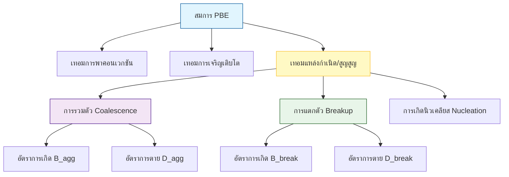
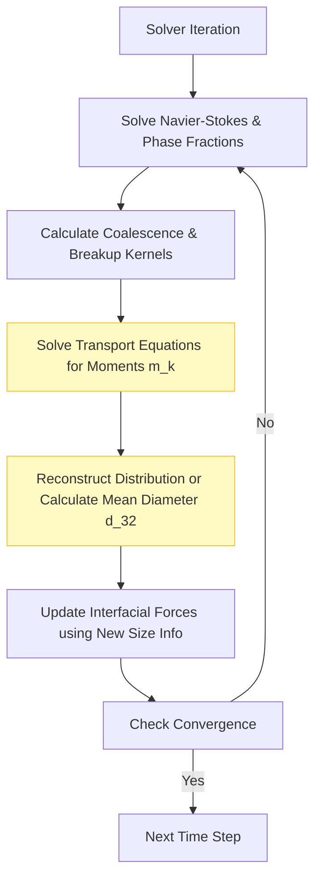

# Population Balance Modeling in OpenFOAM

## 1. Introduction (บทนำ)

**การสร้างแบบจำลองสมดุลประชากร (Population Balance Modeling - PBM)** เป็นกรอบการทำงานทางคณิตศาสตร์ที่ทรงพลังสำหรับอธิบายการวิวัฒนาการของระบบอนุภาคผ่านกระบวนการพลศาสตร์ต่างๆ รวมถึงการเกิดนิวเคลียส การเจริญเติบโต การรวมตัว (coalescence) และการแตกตัว (breakup) ในระบบหลายเฟส

สิ่งนี้มีความสำคัญเมื่อพฤติกรรมของระบบขึ้นอยู่กับการกระจายขนาด (Size Distribution) ของอนุภาค ฟอง หรือหยด เช่น ในเครื่องปฏิกรณ์เคมี กระบวนการตกผลึก หรือคอลัมน์ฟอง

> [!INFO] **ความสำคัญของ PBM**
> PBM ช่วยให้เราสามารถติดตามการวิวัฒนาการของการกระจายขนาดอนุภาคได้อย่างมีรายละเอียด ซึ่งส่งผลต่อ:
> - อัตราการถ่ายเทมวลและความร้อนระหว่างเฟส
> - พื้นที่ผิวรวมที่มีอยู่สำหรับปฏิกิริยาเคมี
> - แรงลากและพลวัตการไหลของเฟสกระจาย
> - ประสิทธิภาพการแยกส่วนในระบบอุตสาหกรรม

## 2. Population Balance Equation (สมการสมดุลประชากร)

### 2.1 สมการ PBE ทั่วไป

สมการ PBE อธิบายการเปลี่ยนแปลงของฟังก์ชันความหนาแน่นจำนวน $n(\mathbf{x}, \xi, t)$ ซึ่งระบุจำนวนอนุภาคที่มีคุณสมบัติ $\xi$ ที่ตำแหน่ง $\mathbf{x}$ และเวลา $t$:

$$\frac{\partial n(\mathbf{x}, \xi, t)}{\partial t} + \nabla \cdot [\mathbf{u}(\mathbf{x}, t) n(\mathbf{x}, \xi, t)] + \frac{\partial}{\partial \xi}[G(\xi, \mathbf{x}, t) n(\mathbf{x}, \xi, t)] = B_{agg} + B_{break} - D_{agg} - D_{break} \tag{1}$$

**ตัวแปร:**
- $n(\mathbf{x}, \xi, t)$ = ฟังก์ชันความหนาแน่นจำนวนอนุภาค ($1/m^4$)
- $\mathbf{x}$ = พิกัดปริภูมิทางกายภาพ
- $\xi$ = พิกัดปริภูมิคุณสมบัติ (โดยทั่วไปคือขนาดหรือปริมาตร)
- $t$ = เวลา
- $\mathbf{u}$ = ความเร็วของของไหล ($m/s$)
- $G$ = อัตราการเจริญเติบโตของอนุภาค
- $B_{agg}, B_{break}$ = เทอมการเกิดจากการรวมตัวและการแตกตัว
- $D_{agg}, D_{break}$ = เทอมการตายจากการรวมตัวและการแตกตัว

### 2.2 สมการ PBE สำหรับการกระจายขนาดฟอง

สำหรับการกระจายขนาดฟอง $n(R,t)$ โดยที่ $R$ คือรัศมีฟอง:

$$\frac{\partial n(R,t)}{\partial t} + \frac{\partial}{\partial R}\left[G(R) n(R,t)\right] = B(R,t) - D(R,t) \tag{2}$$

สำหรับระบบที่มีการแพร่ (convection) ในปริภูมิ:

$$\frac{\partial n(V, t)}{\partial t} + \nabla \cdot (\mathbf{u} n(V, t)) + \frac{\partial}{\partial V}(G n(V, t)) = B - D \tag{3}$$

โดยที่:
- $V$ = ปริมาตรของอนุภาค ($m^3$)
- $G$ = อัตราการเจริญเติบโต (Growth Rate)
- $B$ = อัตราการเกิด (Birth Rate) เนื่องจากการแตกตัว (Breakup) และการรวมตัว (Coalescence)
- $D$ = อัตราการตาย (Death Rate)



## 3. Solution Methods in OpenFOAM (วิธีการแก้ปัญหา)

OpenFOAM ให้วิธีการหลากหลายในการแก้สมการ PBE แต่ละวิธีมีข้อดีและข้อเสียที่แตกต่างกัน:



### 3.1 Method of Moments (MOM)

**หลักการ:** แทนที่การแก้สมการสำหรับการแจกแจงโดยตรงด้วยการแก้สมการสำหรับโมเมนต์ (Moments) ของการแจกแจง

**นิยามโมเมนต์:**

$$m_k = \int_0^\infty \xi^k n(\xi) d\xi \tag{4}$$

หรือสำหรับความยาว $L$:

$$m_k = \int_0^\infty L^k n(L) dL \tag{5}$$

**ความหมายทางกายภาพของโมเมนต์แรก:**

| โมเมนต์ | ความหมายทางกายภาพ | หน่วย |
|----------|-------------------|--------|
| $m_0$ | ความหนาแน่นจำนวนฟองรวม | จำนวนฟองต่อปริมาตร |
| $m_1$ | ความหนาแน่นความยาวฟองรวม | $m^{-2}$ |
| $m_2$ | ความหนาแน่นพื้นที่ผิว | $m^{-1}$ |
| $m_3$ | สัดส่วนปริมาตร $\alpha$ | ไม่มีหน่วย |

**สมการโมเมนต์:**

$$\frac{\partial m_k}{\partial t} + \nabla \cdot (m_k \mathbf{u}) = k G_{k-1} + S_k \tag{6}$$

โดยที่:
- $G_{k-1}$ = การมีส่วนร่วมของการเจริญเติบโต
- $S_k$ = เทอมการแตกและการรวมตัว

#### 3.1.1 Quadrature Method of Moments (QMOM)

**Quadrature Method of Moments (QMOM)** ใช้เพื่อปิดระบบสมการโมเมนต์โดยการประมาณค่าอินทิกรัลด้วย Quadrature rules

**หลักการ:**

$$\int_0^\infty f(L) n(L) dL \approx \sum_{i=1}^{N_q} w_i f(L_i) \tag{7}$$

โดยที่:
- $w_i$ = น้ำหนัก quadrature (weights)
- $L_i$ = จุด abscissae (quadrature points)
- $N_q$ = จำนวน quadrature points

**ข้อดี:**
- ประหยัดการคำนวณมาก
- เหมาะสำหรับการจำลองขนาดใหญ่
- สามารถติดตามการเปลี่ยนแปลงของขนาดเฉลี่ยได้ดี

**ข้อเสีย:**
- สูญเสียข้อมูลรายละเอียดของรูปร่างการแจกแจง
- ไม่สามารถกู้คืนการแจกแจงขนาดที่สมบูรณ์ได้

**การ Implement ใน OpenFOAM:**

```cpp
// การคำนวณโมเมนต์ที่ k
Mk[k] = fvc::domainIntegrate(pow(L, k)*n).value();

// Quadrature Method of Moments
class QMOM
{
private:
    // น้ำหนักและจุด quadrature
    scalarField weights_;
    scalarField abscissae_;

    // จำนวน moments
    label nMoments_;

public:
    // คำนวณ moments จาก weights และ abscissae
    void calculateMoments()
    {
        for (label k = 0; k < nMoments_; k++)
        {
            m_[k] = 0;
            for (label i = 0; i < weights_.size(); i++)
            {
                m_[k] += weights_[i] * pow(abscissae_[i], k);
            }
        }
    }

    // อัปเดต quadrature จาก moments
    void updateQuadrature();
};
```

### 3.2 Class Method (Discrete Method) / Method of Classes (MOC)

**หลักการ:** แบ่งช่วงขนาดของอนุภาคออกเป็นช่วงๆ (Bins หรือ Classes) และแก้สมการการขนส่งสำหรับแต่ละ Class

**สมการการขนส่ง:**

$$\frac{\partial n_i}{\partial t} + \nabla \cdot (n_i \mathbf{u}) = \sum_j \beta_{ij} n_j - \sum_j \beta_{ji} n_i \tag{8}$$

โดยที่:
- $n_i$ = ความหนาแน่นจำนวนอนุภาคใน class $i$
- $\beta_{ij}$ = เคอร์เนลการโอนจาก class $j$ ไปยัง class $i$

**การแบ่งส่วน (Sectional Method):**

$$N_i = \int_{R_i}^{R_{i+1}} n(R) dR \tag{9}$$

การอนุรักษ์มวลถูกบังคับใช้ผ่านการกำหนดส่วนและการคำนวณการไหลอย่างระมัดระวัง

**ข้อดี:**
- ให้รายละเอียดรูปร่างของการแจกแจงได้ดี
- การ implement ฟังก์ชันเคอร์เนลที่ซับซ้อนได้ง่าย
- การปรับตัวตาข่ายที่ยืดหยุ่น
- แก้สมการการแจกแจงขนาดโดยตรง

**ข้อเสีย:**
- มีต้นทุนการคำนวณสูงหากใช้จำนวน Class มาก
- การกระจายตัวเชิงตัวเลขข้ามขอบเขตช่อง
- ต้องการความละเอียดของ mesh สูง

### 3.3 Direct Quadrature Method of Moments (DQMOM)

**หลักการ:** วิธีการที่รวมความได้เปรียบของทั้ง MOM และ MOC โดยการแก้สมการการขนส่งโดยตรงสำหรับ weights และ abscissae

**ข้อดี:**
- สมดุลระหว่างความเร็วและความแม่นยำ
- สามารถจัดการกับการกระจายขนาดที่ซับซ้อนได้
- เหมาะสำหรับการจำลองที่มีการเปลี่ยนแปลงของการแจกแจงอย่างรวดเร็ว

**ข้อเสีย:**
- ซับซ้อนในการใช้งาน
- ต้องการความเข้าใจทางทฤษฎีที่ลึกซึ้ง

**การ Implement ใน OpenFOAM:**

```cpp
// DQMOM implementation
template<class CloudType>
class DQMOM
    : public PopulationBalanceModel<CloudType>
{
private:
    // Quadrature points and weights
    scalarField weights_;
    scalarField abscissae_;

    // Moments calculation
    void calculateMoments();

    // Update quadrature
    void updateQuadrature();

public:
    // Calculate source terms
    void calculateSourceTerms()
    {
        // คำนวณเทอมต้นทางการรวมตัว
        forAll(weights_, i)
        {
            scalar source = 0;
            forAll(weights_, j)
            {
                source += coalescenceKernel_(abscissae_[i], abscissae_[j])
                        * weights_[i] * weights_[j];
            }
            sources_[i] = source;
        }
    }

    // Solve transport equations for weights and abscissae
    void solve();
};
```

### 3.4 การเปรียบเทียบวิธีการ

| วิธีการ | หลักการ | ความเร็ว | ความแม่นยำ | ความจำใช้ |
|------------|------------|-----------|--------------|------------|
| **MOC (Method of Classes)** | แบ่งการกระจายขนาดต่อเนื่องเป็นคลาสขนาดแบบไม่ต่อเนื่อง | ช้า | สูงมาก | สูง |
| **MOM (Method of Moments)** | ติดตามโมเมนต์ของการกระจายขนาด | เร็ว | ปานกลาง | ต่ำ |
| **QMOM** | ใช้จุดและน้ำหนักควอดราเจอร์ | ปานกลาง | ปานกลาง | ปานกลาง |
| **DQMOM** | ใช้จุดและน้ำหนักควอดราเจอร์ + การแก้สมการการขนส่ง | เร็ว | สูง | ต่ำ |

## 4. Interaction Kernels (ฟังก์ชันเคอร์เนลการโต้ตอบ)

หัวใจสำคัญของ PBM คือแบบจำลองสำหรับการรวมตัวและการแตกตัว

### 4.1 Coalescence (การรวมตัว)

การรวมตัวขึ้นอยู่กับความถี่ในการชน (Collision Frequency) และประสิทธิภาพของการรวมตัว (Coalescence Efficiency):

$$\beta(V_i, V_j) = h(V_i, V_j) \lambda(V_i, V_j) \tag{10}$$

**เทอมการเกิดและเทอมการตาย:**

- **เทอมการเกิด:** $B_{agg} = \frac{1}{2} \int_0^\xi \beta(\xi', \xi - \xi') n(\xi') n(\xi - \xi') d\xi'$
- **เทอมการตาย:** $D_{agg} = n(\xi) \int_0^\infty \beta(\xi, \xi') n(\xi') d\xi'$

**แบบจำลองที่ใช้ใน OpenFOAM:**

| แบบจำลอง | สมการ | การประยุกต์ใช้ |
|------------|----------|----------------|
| **Luo** | $\beta = \frac{\pi}{4}(d_i + d_j)^2 u_{ij}$ | คอลัมน์ฟอง |
| **Prince & Blanch** | $\beta = \frac{\pi}{4}(d_i + d_j)^2 (u_i^2 + u_j^2)^{1/2}$ | ระบบที่มีความปั่นป่วนสูง |

โดยที่:
- $d_i, d_j$ = เส้นผ่านศูนย์กลางของฟอง
- $u_{ij}$ = ความเร็วในการชน

**การ Implement ใน OpenFOAM:**

```cpp
// Coalescence model base class
class coalescenceModel
{
public:
    // Calculate coalescence kernel
    virtual tmp<volScalarField> calculateKernel
    (
        const volScalarField& d1,
        const volScalarField& d2
    ) const = 0;
};

// Luo coalescence model
class LuoCoalescence
    : public coalescenceModel
{
public:
    tmp<volScalarField> calculateKernel
    (
        const volScalarField& d1,
        const volScalarField& d2
    ) const override
    {
        // คำนวณ collision frequency
        volScalarField uCollision
        (
            sqrt
            (
                sqr(U1_) + sqr(U2_)
                - 2*(U1_ & U2_)
            )
        );

        // คำนวณ kernel
        return constant::mathematical::pi/4.0
             * sqr(d1 + d2)
             * uCollision
             * exp(-C_ * sqrt(rho_/sigma_) * pow(d1 + d2, 2.0/3.0) * epsilon_);
    }
};
```

### 4.2 Breakup (การแตกตัว)

การแตกตัวขึ้นอยู่กับอัตราการแตกตัวและฟังก์ชันการแจกแจงขนาดของอนุภาคลูก (Daughter Size Distribution):

$$S_i = \int_V^\infty f(V, V') g(V') n(V') dV' - g(V) n(V) \tag{11}$$

**เทอมการเกิดและเทอมการตาย:**

- **เทอมการเกิด:** $B_{break} = \int_\xi^\infty \beta_b(\xi', \xi) b(\xi, \xi') n(\xi') d\xi'$
- **เทอมการตาย:** $D_{break} = \beta_b(\xi) n(\xi)$

**แบบจำลองที่ใช้ใน OpenFOAM:**

| แบบจำลอง | สมการ | การประยุกต์ใช้ |
|------------|----------|----------------|
| **Luo** | $g(d) = C_1 \epsilon^{1/3} d^{2/3} \exp(-C_2 \frac{\sigma}{\rho \epsilon^{2/3} d^{5/3}})$ | คอลัมน์ฟอง |
| **Martinez-Bazán** | $g(d) = K \frac{\sigma^{1/2}}{\rho^{1/2} d^{5/6}} \epsilon^{2/3}$ | ระบบที่มีความปั่นป่วนสูง |

โดยที่:
- $\epsilon$ = อัตราการสลายตัวของพลังงานทัวร์บูลเลนท์ ($m^2/s^3$)
- $\sigma$ = ความตึงผิว ($N/m$)
- $\rho$ = ความหนาแน่น ($kg/m^3$)
- $C_1, C_2, K$ = สัมประสิทธิ์ประจำแบบจำลอง

**การ Implement ใน OpenFOAM:**

```cpp
// Breakup model base class
class breakupModel
{
public:
    // Calculate breakup rate
    virtual tmp<volScalarField> calculateRate
    (
        const volScalarField& d
    ) const = 0;

    // Daughter size distribution
    virtual tmp<volScalarField> daughterDistribution
    (
        const scalar dParent,
        const scalar dDaughter
    ) const = 0;
};

// Luo breakup model
class LuoBreakup
    : public breakupModel
{
private:
    dimensionedScalar C1_;
    dimensionedScalar C2_;

public:
    tmp<volScalarField> calculateRate
    (
        const volScalarField& d
    ) const override
    {
        // คำนวณ Weber number
        volScalarField We(rho_*sqr(d)*epsilon_/(sigma_));

        // คำนวณ breakup rate
        return C1_ * pow(epsilon_, 1.0/3.0)
             * pow(d, 2.0/3.0)
             * exp(-C2_ / We);
    }
};
```

## 5. Implementation in OpenFOAM (การใช้งานใน OpenFOAM)

PBM ใน OpenFOAM มักถูกใช้งานร่วมกับ Solver หลายเฟส เช่น `multiphaseEulerFoam` หรือ `reactingTwoPhaseEulerFoam` ผ่านไลบรารี `populationBalance`

### 5.1 โครงสร้างไฟล์ `populationBalanceProperties`

```foam
/*--------------------------------*- C++ -*----------------------------------*\
| =========                 |                                                 |
| \\      /  F ield         | OpenFOAM: The Open Source CFD Toolbox           |
|  \\    /   O peration     | Version:  v2306                                 |
|   \\  /    A nd           | Website:  www.openfoam.com                      |
|    \\/     M anipulation  |                                                 |
\*---------------------------------------------------------------------------*/
FoamFile
{
    version     2.0;
    format      ascii;
    class       dictionary;
    object      populationBalanceProperties;
}
// * * * * * * * * * * * * * * * * * * * * * * * * * * * * * * * * * * * * * //

populationBalanceModel  QMOM;

QMOMCoeffs
{
    numberOfMoments     6;

    // Growth model
    growthModel         constant;
    growthCoeffs
    {
        growthRate      0.001;  // m/s
    }

    // Coalescence model
    coalescenceModel    Luo;
    coalescenceCoeffs
    {
        C1              0.08;   // Coalescence coefficient
    }

    // Breakup model
    breakupModel        Luo;
    breakupCoeffs
    {
        C1              0.02;   // Breakup coefficient
        C2              1.3;    // Breakup exponent
    }

    // Nucleation model (optional)
    nucleationModel     none;
}

// ************************************************************************* //
```

### 5.2 การ Implement Solver

**โครงสร้างไฟล์ใน OpenFOAM:**

```
applications/solvers/multiphase/
├── multiphaseEulerFoam/
│   ├── multiphaseEulerFoam.C
│   └── createFields.H
└── reactingTwoPhaseEulerFoam/
    ├── reactingTwoPhaseEulerFoam.C
    └── createFields.H

src/phaseSystemModels/
├── populationBalanceModel/
│   ├── populationBalanceModel.H
│   ├── populationBalanceModel.C
│   ├── QMOM/
│   │   ├── QMOM.H
│   │   └── QMOM.C
│   └── DQMOM/
│       ├── DQMOM.H
│       └── DQMOM.C
└── coalescenceModel/
    ├── coalescenceModel.H
    └── Luo/
        ├── LuoCoalescence.H
        └── LuoCoalescence.C
```

**ตัวอย่างการใช้งานใน solver:**

```cpp
// ใน createFields.H
// สร้าง population balance model
autoPtr<populationBalanceModel> populationBalance
(
    populationBalanceModel::New(mesh)
);

// ในวงซ้ำเวลาหลัก (main time loop)
while (runTime.run())
{
    // 1. แก้สมการ Navier-Stokes และสัดส่วนเฟส
    #include "UEqn.H"

    // 2. คำนวณความเร็วและความดัน
    #include "pEqn.H"

    // 3. แก้ population balance equations
    populationBalance->solve();

    // 4. อัปเดตขนาดฟองเฉลี่ย
    d32_ = populationBalance->d32();

    // 5. อัปเดตแรงอินเตอร์เฟซ
    #include "interfacialForces.H"

    runTime++;
}
```

### 5.3 การเชื่อมโยงกับ CFD

**การถ่ายโอนโมเมนตัม:**

$$\mathbf{F}_{drag} = \sum_{i=1}^{N_{classes}} K_i (\mathbf{u}_i - \mathbf{u}_c) \tag{12}$$

**การถ่ายโอนมวล:**

$$\frac{\partial \alpha_i}{\partial t} + \nabla \cdot (\alpha_i \mathbf{u}_i) = S_{PBM,i} \tag{13}$$

**การถ่ายโอนความร้อน:**

$$\frac{\partial (\alpha_i \rho_i h_i)}{\partial t} + \nabla \cdot (\alpha_i \rho_i h_i \mathbf{u}_i) = Q_{PBM,i} \tag{14}$$

**การ Implement ใน OpenFOAM:**

```cpp
// การเชื่อมโยงกับ interfacial forces
virtual tmp<volVectorField> Fi() const
{
    tmp<volVectorField> tFi
    (
        new volVectorField
        (
            IOobject
            (
                "Fi",
                mesh_.time().timeName(),
                mesh_,
                IOobject::NO_READ,
                IOobject::NO_WRITE
            ),
            mesh_,
            dimensionedVector("zero", dimForce/dimVol, vector::zero)
        )
    );

    volVectorField& Fi = tFi.ref();

    // คำนวณ drag force สำหรับแต่ละ size class
    forAll(sizeClasses_, i)
    {
        // คำนวณ drag coefficient
        volScalarField Cd(dragModel_->Cd(sizeClasses_[i]));

        // คำนวณ drag force
        Fi += 0.75 * Cd * rhoContinuous_
            * mag(Uc_ - Ui_[i]) * (Uc_ - Ui_[i])
            / sizeClasses_[i] * alpha_[i];
    }

    return tFi;
}
```

## 6. Applications (การประยุกต์ใช้งาน)

> [!TIP] **การเลือกวิธีการ**
> - ใช้ **QMOM** เมื่อต้องการความเร็วในการคำนวณและขนาดเฉลี่ยเพียงพอสำหรับการวิเคราะห์
> - ใช้ **MOC/MOM** เมื่อต้องการรายละเอียดของการแจกแจงขนาดที่สมบูรณ์
> - ใช้ **DQMOM** เมื่อต้องการสมดุลระหว่างความเร็วและความแม่นยำ

### 6.1 Bubble Columns (คอลัมน์ฟอง)

**การพยากรณ์ขนาดฟอง**เพื่อคำนวณ:
- อัตราการถ่ายเทมวลและความร้อนที่แม่นยำ
- แรงลากที่ขึ้นอยู่กับขนาดฟอง
- พื้นที่ผิวรวมสำหรับปฏิกิริยาเคมี

**ตัวอย่างการตั้งค่า:**

```foam
// constant/populationBalanceProperties
populationBalanceModel  QMOM;

QMOMCoeffs
{
    numberOfMoments     4;

    // สำหรับ bubble columns
    coalescenceModel    Luo;
    breakupModel        Luo;

    // ขนาดเริ่มต้นของฟอง
    initialDistribution
    {
        type            uniform;
        d0              0.003;  // 3 mm
    }
}
```

### 6.2 Crystallization (การตกผลึก)

**การควบคุมการกระจายขนาดผลึก**ในอุตสาหกรรมยา:
- การควบคุมขนาดผลึกเฉลี่ย
- การลดความกว้างของการกระจายขนาด
- การเพิ่มประสิทธิภาพการผลิต

**ตัวอย่างการตั้งค่า:**

```foam
populationBalanceModel  DQMOM;

DQMOMCoeffs
{
    numberOfQuadraturePoints  3;

    // Growth model สำหรับ crystallization
    growthModel         sizeDependent;
    growthCoeffs
    {
        kg              1e-8;   // Growth rate coefficient [m/s]
        g               1.0;    // Growth order [dimensionless]
    }

    // Nucleation model
    nucleationModel     constant;
    nucleationCoeffs
    {
        B0              1e6;    // Nucleation rate [#/m³/s]
        nucleiSize      1e-6;   // Nuclei size [m]
    }
}
```

### 6.3 Emulsions (การทำเอมัลชัน)

**การศึกษาความเสถียร**ของการผสมของเหลวสองชนิดที่ไม่ละลายกัน:
- การทำนายความเสถียรของเอมัลชัน
- การศึกษาผลของ surfactant
- การออกแบบกระบวนการผสม

### 6.4 Aerosols (ละอองอนุภาคในอากาศ)

**การติดตามการสะสมและการเจริญเติบโต**ของอนุภาคในอากาศ:
- การกระจายตัวของมลพิษทางอากาศ
- การก่อตัวของฝุ่น PM2.5 และ PM10
- การวิเคราะห์คุณภาพอากาศ

## 7. Numerical Best Practices (แนวทางปฏิบัติที่ดี)

### 7.1 Moment Stability

> [!WARNING] **ความไม่เสถียรของโมเมนต์**
> ในวิธี QMOM โมเมนต์อาจมีความไม่เสถียรเชิงตัวเลขได้ง่าย โดยเฉพาะเมื่อ:
> - การกระจายขนาดมีความกว้างมาก
> - มีการเปลี่ยนแปลงของขนาดอย่างรวดเร็ว
> - ความละเอียดของ mesh ต่ำ

**การแก้ไข:**
- ใช้แผนการแยกส่วนที่มีความแม่นยำและเสถียร (MULES)
- ใช้ฟิลเตอร์เชิงตัวเลขสำหรับโมเมนต์
- จำกัดช่วงของโมเมนต์เพื่อป้องกันค่าที่ไม่สามารถยอมรับได้

```cpp
// ตัวอย่างการจำกัดโมเมนต์
void limitMoments()
{
    forAll(m_, i)
    {
        // จำกัดค่าต่ำ
        m_[i] = max(m_[i], momentMinLimits_[i]);

        // จำกัดค่าสูง
        m_[i] = min(m_[i], momentMaxLimits_[i]);
    }

    // ตรวจสอบความเป็นบวกของ determinant
    checkMomentConsistency();
}
```

### 7.2 Mesh Resolution

ต้องการ Mesh ที่ละเอียดเพียงพอเพื่อ:
- จับการเปลี่ยนแปลงของอัตราการเจริญเติบโตและการแตกตัวในพื้นที่
- แก้ปัญหาความชันของความหนาแน่นขนาด
- รักษาความแม่นยำของการแยกส่วน

**แนวทาง:**
- 10-15 cells ต่อเส้นผ่านศูนย์กลางของฟองเฉลี่ย
- การปรับปรุง mesh แบบปรับตัวใกล้บริเวณที่มีการเปลี่ยนแปลงสูง
- การใช้ dynamic mesh refinement สำหรับกรณีที่มีการเปลี่ยนแปลงของ interface

```foam
// system/snappyHexMeshDict
refinementSurfaces
{
    bubbles
    {
        level           (4 5);  // ระดับการปรับปรุง mesh
    }
}

refinementRegions
{
    highBreakupRegion
    {
        mode            distance;
        levels          ((0.01 5) (0.05 4));
    }
}
```

### 7.3 Coupling (การเชื่อมโยง)

การเชื่อมโยงระหว่าง PBM และพลศาสตร์การไหล (Momentum/Turbulence) ต้องทำอย่างระมัดระวัง:

**กลยุทธ์การเชื่อมโยง:**

1. **Explicit Coupling (การเชื่อมโยงแบบชัดแจ้ง):**
   - อัปเดตขนาดฟองทุก time step
   - เร็วแต่อาจไม่เสถียร
   - เหมาะสำหรับกรณีที่การเปลี่ยนแปลงของขนาดช้าๆ

2. **Implicit Coupling (การเชื่อมโยงแบบโดยนัย):**
   - แก้สมการ PBM และ Navier-Stokes พร้อมกัน
   - เสถียรแต่ใช้ทรัพยากรมาก
   - เหมาะสำหรับกรณีที่มีการเชื่อมโยงที่แข็งแกร่ง

**การ Implement ใน OpenFOAM:**

```cpp
// Explicit coupling example
void solve()
{
    // 1. Solve flow field
    #include "UEqn.H"
    #include "pEqn.H"

    // 2. Update population balance
    populationBalance->solve();

    // 3. Update interfacial forces
    #include "interfacialForces.H"

    // 4. Check convergence
    if (converged)
    {
        break;
    }
}

// Implicit coupling example
void solveImplicit()
{
    // สร้างระบบสมการรวม
    fvVectorMatrix UEqn
    (
        fvm::ddt(rho, U)
      + fvm::div(rhoPhi, U)
      + fvm::Sp(dragCoefficient, U)
      ==
        fvc::grad(p)
      + dragCoefficient * Ub
    );

    // Include PBM source terms
    populationBalance->addSources(UEqn);

    // Solve coupled system
    UEqn.solve();
}
```

## 8. Summary (สรุป)

Population Balance Modeling (PBM) เป็นเครื่องมือที่ทรงพลังสำหรับการจำลองระบบหลายเฟสที่มีการกระจายขนาดของอนุภาค ใน OpenFOAM:

**จุดแข็ง:**
- มีวิธีการแก้ปัญหาที่หลากหลาย (QMOM, DQMOM, MOC)
- การเชื่อมโยงกับ interfacial forces และ heat transfer
- สามารถจำลองกระบวนการที่ซับซ้อนได้

**ความท้าทาย:**
- ความไม่เสถียรเชิงตัวเลขของโมเมนต์
- ต้นทุนการคำนวณสูงสำหรับวิธีที่มีความแม่นยำสูง
- การเลือกแบบจำลองที่เหมาะสมสำหรับแต่ละกรณี

**แนวทางปฏิบัติที่ดี:**
- เริ่มต้นด้วย QMOM สำหรับการทดสอบเบื้องต้น
- ใช้ mesh ที่ละเอียดเพียงพอสำหรับการแก้ปัญหาความชัน
- ตรวจสอบความเสถียรของโมเมนต์อย่างสม่ำเสมอ
- ใช้การเชื่อมโยงแบบ implicit สำหรับกรณีที่มี coupling ที่แข็งแกร่ง

---

## References

1. **Hulburt, H. M., & Katz, S.** (1964). Some problems in particle technology: A statistical mechanical formulation. *Chemical Engineering Science*, 19(8), 555-574.

2. **Marchisio, D. L., & Fox, R. O.** (2013). *Computational models for polydisperse particulate and multiphase systems*. Cambridge University Press.

3. **Ramkrishna, D.** (2000). *Population balances: Theory and applications to particulate systems in engineering*. Academic Press.

4. **OpenFOAM® Documentation** - Population Balance Models

5. **Luo, H.** (1993). Coalescence, breakup and liquid circulation in bubble column reactors. *Dr. Ing. Thesis*, Norwegian University of Science and Technology.

---

> [!INFO] **บทเรียนถัดไป**
> หลังจากเข้าใจ PBM แล้ว ขอแนะนำให้ศึกษา:
> - [[04_Interfacial_Dynamics]] - พลวัต์ของอินเตอร์เฟซที่ซับซ้อน
> - [[05_Heat_Transfer_Multiphase]] - การถ่ายเทความร้อนในระบบหลายเฟส
> - [[06_Advanced_Numerical_Methods]] - เทคนิคเชิงตัวเลขขั้นสูง
