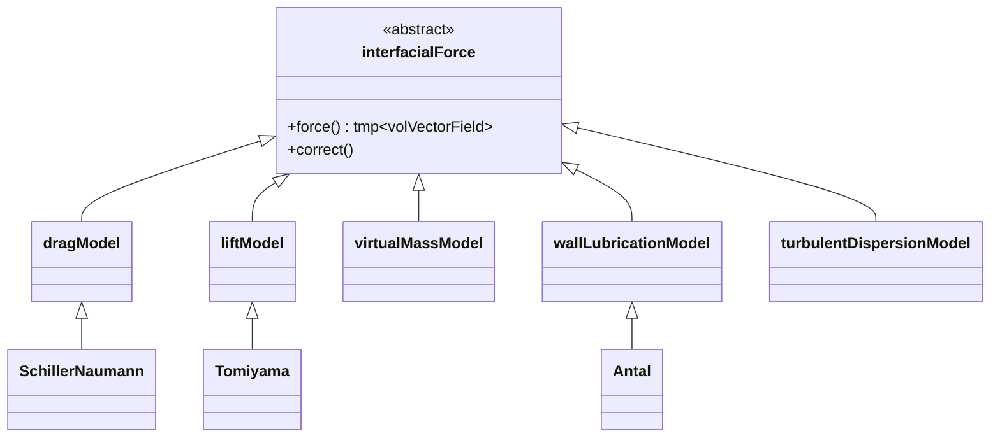

# แรงที่ส่วนต่อประสานเชิงซ้อนใน OpenFOAM (Complex Interfacial Forces in OpenFOAM)

> [!INFO] ภาพรวม
> บันทึกฉบับนี้ครอบคลุม **แรงที่ส่วนต่อประสานขั้นสูง (advanced interfacial forces)** ในการไหลหลายเฟสภายใน OpenFOAM นอกเหนือจากแรงลาก (drag forces) แล้ว ยังมีแรงเชิงซ้อนอื่นๆ ที่ส่งผลกระทบอย่างมีนัยสำคัญต่อความแม่นยำของการจำลองแบบ Eulerian-Eulerian ซึ่งรวมถึงแรงยก (lift), แรงมวลเสมือน (virtual mass), แรงหล่อลื่นผนัง (wall lubrication) และแรงการกระจายแบบปั่นป่วน (turbulent dispersion forces)

---

## 1. บทนำ (Introduction)

ในการจำลองการไหลแบบหลายเฟสโดยวิธี Eulerian-Eulerian แรงปฏิสัมพันธ์ระหว่างเฟส (Interfacial Forces) เป็นส่วนสำคัญที่กำหนดพิกัดและความเร็วของแต่ละเฟส นอกเหนือจากแรงลาก (Drag Force) แล้ว ยังมีแรงที่ซับซ้อนอื่นๆ ที่มีความสำคัญอย่างยิ่งต่อความแม่นยำของการจำลอง

### ความสำคัญของแรงอินเตอร์เฟซที่ซับซ้อน

แรงอินเตอร์เฟซที่ซับซ้อนมีบทบาทสำคัญใน:

| แรงอินเตอร์เฟซ | ผลกระทบหลัก | การประยุกต์ใช้ |
|---|---|---|
| **แรงยก (Lift Force)** | การเคลื่อนที่แนวขวาง | คอลัมน์ฟอง (Bubble columns), การไหลในท่อ |
| **แรงมวลเสมือน (Virtual Mass)** | การเร่งความเร็วสัมพัทธ์ | การเปลี่ยนทิศทางเร็ว, การพุ่งของฟอง |
| **แรงหล่อลื่นผนัง (Wall Lubrication)** | การกระจายตัวใกล้ผนัง | การไหลในท่อ, ช่องแคบ |
| **แรงการกระจายแบบปั่นป่วน (Turbulent Dispersion)** | การผสมผสานแบบปั่นป่วน | การไหลแบบปั่นป่วน (Turbulent flow) |

---

## 2. กรอบงานทางคณิตศาสตร์ (Mathematical Framework)

### สมการโมเมนตัมรวม

ในสมการโมเมนตัมของ OpenFOAM แรงเหล่านี้จะถูกรวมเข้าในเทอมการแลกเปลี่ยนโมเมนตัม $\mathbf{M}$:

$$
\mathbf{M}_c = -\mathbf{M}_d = \mathbf{F}_{drag} + \mathbf{F}_{lift} + \mathbf{F}_{vm} + \mathbf{F}_{wl} + \mathbf{F}_{td}
$$ 

โดยที่:
- $\mathbf{M}_c$: การแลกเปลี่ยนโมเมนตัมกับเฟสต่อเนื่อง
- $\mathbf{M}_d$: การแลกเปลี่ยนโมเมนตัมกับเฟสกระจาย
- $\mathbf{F}_{drag}$: แรงลาก
- $\mathbf{F}_{lift}$: แรงยก
- $\mathbf{F}_{vm}$: แรงมวลเสมือน
- $\mathbf{F}_{wl}$: แรงหล่อลื่นผนัง
- $\mathbf{F}_{td}$: แรงการกระจายแบบปั่นป่วน

### การพิจารณาแรงอินเตอร์เฟซ

$$ 
\frac{\partial}{\partial t}(\alpha_k \rho_k \mathbf{u}_k) + \nabla \cdot (\alpha_k \rho_k \mathbf{u}_k \mathbf{u}_k) = -\alpha_k \nabla p + \nabla \cdot (\alpha_k \boldsymbol{\tau}_k) + \alpha_k \rho_k \mathbf{g} + \mathbf{M}_k 
$$ 

---

## 3. แรงที่ส่วนต่อประสานที่สำคัญ (Key Interfacial Forces)

### 3.1 แรงยก (Lift Force)

แรงยกเกิดจากการไล่ระดับความเร็ว (Velocity Gradient) ของเฟสต่อเนื่อง ทำให้อนุภาคหรือฟองเคลื่อนที่ในแนวขวาง:

$$ 
\mathbf{F}_{L} = C_{L} \alpha_{d} \rho_{c} (\mathbf{u}_{c} - \mathbf{u}_{d}) \times (\nabla \times \mathbf{u}_{c}) 
$$ 

**ตัวแปรในสมการ:**
- $C_{L}$: สัมประสิทธิ์แรงยก (Lift Coefficient)
- $\alpha_{d}$: สัดส่วนปริมาตรของเฟสกระจาย
- $\rho_{c}$: ความหนาแน่นของเฟสต่อเนื่อง
- $\mathbf{u}_{c}, \mathbf{u}_{d}$: เวกเตอร์ความเร็วของเฟสต่อเนื่องและกระจาย

> [!TIP] การเปลี่ยนเครื่องหมายในสัมประสิทธิ์แรงยก
> สำหรับฟองขนาดเล็ก $C_{L}$ มักเป็นบวก (เคลื่อนที่ไปทางบริเวณความเร็วต่ำ) แต่สำหรับฟองขนาดใหญ่อาจเป็นลบเนื่องจากการเสียรูป

**แบบจำลองสัมประสิทธิ์แรงยก:**

| แบบจำลอง | สมการ | การใช้งาน |
|---|---|---|
| **Tomiyama** | $C_{L} = f(Eo, Re_{p})$ | ฟองที่เสียรูป |
| **Legendre-Magnaudet** | $C_{L} = \sqrt{C_{L}^{2, high} + C_{L}^{2, low}}$ | ฟองทรงกลม |
| **Saffman-Mei** | $C_{L} = f(Re_{p}, Re_{s})$ | อนุภาคในการไหลเฉือน |

### 3.2 แรงมวลเสมือน (Virtual Mass Force)

แรงที่เกิดจากการเร่งความเร็วของของไหลรอบๆ อนุภาคเมื่ออนุภาคมีการเร่งความเร็วสัมพัทธ์:

$$ 
\mathbf{F}_{vm} = C_{vm} \alpha_{d} \rho_{c} \left(\frac{\mathrm{D}_{d} \mathbf{u}_{d}}{\mathrm{D}t} - \frac{\mathrm{D}_{c} \mathbf{u}_{c}}{\mathrm{D}t}\right) 
$$ 

**ตัวแปรในสมการ:**
- $C_{vm}$: สัมประสิทธิ์มวลเสมือน (โดยทั่วไปมีค่า 0.5 สำหรับทรงกลม)
- $\frac{\mathrm{D}}{\mathrm{D}t}$: อนุพันธ์วัตถุ (Material Derivative)

> [!WARNING] ความสำคัญสำหรับอนุภาคเบา
> แรงมวลเสมือนมีความสำคัญมากเมื่อความหนาแน่นของเฟสกระจายมีค่าน้อยกว่าเฟสต่อเนื่องมาก (เช่น ฟองอากาศในน้ำ)

### 3.3 แรงหล่อลื่นผนัง (Wall Lubrication Force)

แรงที่ผลักอนุภาคออกจากผนังเนื่องจากการไหลที่ไม่สมมาตรรอบอนุภาคใกล้ขอบเขต:

$$ 
\mathbf{F}_{wl} = C_{wl} \alpha_{d} \rho_{c} |\mathbf{u}_{rel}|^{2} \mathbf{n}_{w} 
$$ 

**ตัวแปรในสมการ:**
- $C_{wl}$: สัมประสิทธิ์การหล่อลื่นผนัง
- $\mathbf{u}_{rel} = \mathbf{u}_{c} - \mathbf{u}_{d}$: ความเร็วสัมพัทธ์
- $\mathbf{n}_{w}$: เวกเตอร์หน่วยปกติของผนัง

**แบบจำลองที่ใช้กันทั่วไป:**

| แบบจำลอง | สมการ | ความเหมาะสม |
|---|---|---|
| **Antal** | $C_{wl}^{Antal} = \frac{C_{w1}}{y_{w}} + \frac{C_{w2}}{y_{w}^{2}}$ | การไหลในท่อ |
| **Tomiyama** | $C_{wl}^{Tomiyama} = f(Eo, y_{w})$ | ฟองขนาดใหญ่ |
| **Frank** | $C_{wl}^{Frank} = \max(C_{1}, C_{2} d_{p}/y_{w})$ | อนุภาคแข็ง |

> [!INFO] ป้องกันการสะสมที่ผนัง
> แรงหล่อลื่นผนังช่วยป้องกันไม่ให้อนุภาค "ทับซ้อน" หรือเกาะกลุ่มที่ผนังมากเกินไปในทางตัวเลข

### 3.4 แรงการกระจายแบบปั่นป่วน (Turbulent Dispersion Force)

ทำหน้าที่แทนผลกระทบของการปั่นป่วน (Turbulence) ที่มีต่อการกระจายตัวของเฟสกระจาย:

$$ 
\mathbf{F}_{td} = -C_{td} \rho_{c} k_{c} \nabla \alpha_{d} 
$$ 

**ตัวแปรในสมการ:**
- $C_{td}$: สัมประสิทธิ์การกระจายแบบปั่นป่วน
- $k_{c}$: พลังงานจลน์ความปั่นป่วนของเฟสต่อเนื่อง

**แบบจำลองการกระจาย:**

| แบบจำลอง | สมการ | ลักษณะเฉพาะ |
|---|---|---|
| **Burns** | $\mathbf{F}_{td} = -\frac{3}{4} C_{D} \frac{\alpha_{d} \rho_{c}}{d_{p}} |\mathbf{u}_{rel}| k_{c} \nabla \alpha_{d}$ | ใช้สัมประสิทธิ์ลาก |
| **Lopez de Bertodano** | $\mathbf{F}_{td} = -C_{td} \rho_{c} \varepsilon_{c} \nabla \alpha_{d}$ | ใช้อัตราการสลายตัว |
| **Grad-based** | $\mathbf{F}_{td} \propto -\nabla (k_{c})$ | อิงจากเกรเดียนต์พลังงานจลน์ |

---

## 4. การใช้งานใน OpenFOAM (Implementation in OpenFOAM)

### 4.1 การกำหนดค่าใน `phaseProperties`

แรงเหล่านี้ถูกกำหนดในไฟล์ `constant/phaseProperties` ภายใต้หัวข้อ `phaseInteraction`:

```foam
phaseInteraction
{
    (gas in liquid)
    {
        drag
        {
            type            SchillerNaumann;
        }
        lift
        {
            type            Tomiyama;
            Cl              0.28;
        }
        virtualMass
        {
            type            constantCoefficient;
            Cvm             0.5;
        }
        wallLubrication
        {
            type            Antal;
            Cw1             -0.01;
            Cw2             0.05;
        }
        turbulentDispersion
        {
            type            Burns;
        }
    }
}
```

> **คำอธิบาย (Explanation):**
> - `phaseInteraction`: บล็อกหลักสำหรับกำหนดการโต้ตอบระหว่างเฟส
> - `drag`: แรงลาก - ใช้แบบจำลอง Schiller-Naumann
> - `lift`: แรงยก - ใช้แบบจำลอง Tomiyama พร้อมค่าสัมประสิทธิ์ Cl = 0.28
> - `virtualMass`: แรงมวลเสมือน - ใช้ค่าสัมประสิทธิ์คงที่ Cvm = 0.5
> - `wallLubrication`: แรงหล่อลื่นผนัง - ใช้แบบจำลอง Antal พร้อมค่า Cw1 และ Cw2
> - `turbulentDispersion`: แรงกระจายแบบปั่นป่วน - ใช้แบบจำลอง Burns

> **แนวคิดสำคัญ (Key Concepts):**
> - การเลือกแบบจำลองแรงต้องสอดคล้องกับสภาพการไหลที่ต้องการจำลอง
> - ค่าสัมประสิทธิ์ต่างๆ ควรได้มาจากการทดลองหรืออ้างอิงจาก literature
> - แต่ละแบบจำลองมีข้อดีและข้อจำกัดที่แตกต่างกัน ต้องเลือกให้เหมาะกับแอปพลิเคชัน

### 4.2 โครงสร้างคลาสใน OpenFOAM


> **รูปที่ 1:** แผนผังคลาสแสดงสถาปัตยกรรมเชิงวัตถุของแบบจำลองแรงที่ส่วนต่อประสานใน OpenFOAM ซึ่งช่วยให้สามารถสลับเปลี่ยนหรือเพิ่มแบบจำลองแรงประเภทต่างๆ (เช่น แรงลาก แรงยก และแรงหล่อลื่นผนัง) ได้อย่างยืดหยุ่นผ่านระบบการสืบทอดคลาส

> **คำอธิบาย (Explanation):**
> - `interfacialForce`: คลาสพื้นฐานแบบ abstract ที่กำหนด interface สำหรับแรงอินเตอร์เฟซทั้งหมด
> - `dragModel`, `liftModel`, `virtualMassModel`, `wallLubricationModel`, `turbulentDispersionModel`: คลาสลูกที่สืบทอดจาก interfacialForce
> - `SchillerNaumann`, `Tomiyama`, `Antal`: คลาสการใช้งานจริง (concrete implementations)
> - การออกแบบแบบ polymorphic นี้ช่วยให้สามารถเพิ่มแบบจำลองใหม่โดยไม่ต้องแก้ไขโค้ดหลัก

> **แนวคิดสำคัญ (Key Concepts):**
> - **การสืบทอด (Inheritance)**: คลาสลูกทุกคลาสสืบทอดคุณสมบัติจาก interfacialForce
> - **Polymorphism**: ฟังก์ชัน force() ถูก override ในแต่ละคลาสลูกเพื่อคำนวณแรงที่แตกต่างกัน
> - **Runtime Selection**: ผู้ใช้สามารถเลือกแบบจำลองผ่านไฟล์ dictionary โดยไม่ต้องคอมไพล์โค้ดใหม่
> - **Separation of Concerns**: แต่ละคลาสรับผิดชอบคำนวณแรงเฉพาะประเภท

### 4.3 ตัวอย่างโค้ดการใช้งาน

```cpp
// Calculation of Tomiyama lift force
// การคำนวณแรงยกแบบ Tomiyama
tmp<volVectorField> TomiyamaLift::force() const
{
    // รับอ้างอิงถึงฟิลด์ของเฟสต่างๆ
    const volVectorField& Uc = phase1_.U();
    const volVectorField& Ud = phase2_.U();
    const volScalarField& alpha1 = phase1_;
    const volScalarField& alpha2 = phase2_;

    // คำนวณ vorticity ของเฟสต่อเนื่อง
    volVectorField omega = fvc::curl(Uc);

    // คำนวณความเร็วสัมพัทธ์
    volVectorField Ur = Uc - Ud;

    // สัมประสิทธิ์แรงยก (สามารถเป็นฟังก์ชันของ Eo และ Re)
    volScalarField Cl = Cl_;

    // คำนวณแรงยก: F_L = C_L * alpha_d * rho_c * (U_rel x omega)
    return Cl * alpha2 * phase1_.rho() * (Ur ^ omega);
}
```

> **คำอธิบาย (Explanation):**
> - `phase1_`, `phase2_`: อ้างอิงถึงเฟสต่อเนื่องและเฟสกระจาย
> - `fvc::curl(Uc)`: คำนวณ vorticity (rotation) ของเฟสต่อเนื่อง
> - `Ur ^ omega`: ผลคูณไขว้ (cross product) ระหว่างความเร็วสัมพัทธ์และ vorticity
> - แรงยกเป็นผลมาจากการไหลแบบ shear ที่ทำให้เกิดการเคลื่อนที่ในแนวขวาง

> **แนวคิดสำคัญ (Key Concepts):**
> - **Vorticity**: การหมุนของของไหล เป็นปัจจัยสำคัญในการคำนวณแรงยก
> - **Cross Product**: แรงยกทำงานในทิศทางที่ตั้งฉากกับทั้งความเร็วสัมพัทธ์และ vorticity
> - **Eötvös Number (Eo)**: จำนวนไร้มิติที่เกี่ยวข้องกับแรงตึงผิวและแรงโน้มถ่วง
> - **Reynolds Number (Re)**: จำนวนไร้มิติที่บอกถึงลักษณะการไหล

```cpp
// Calculation of virtual mass force
// การคำนวณแรงมวลเสมือน
tmp<volVectorField> VirtualMass::force() const
{
    // รับฟิลด์ความเร็ว
    const volVectorField& Uc = phase1_.U();
    const volVectorField& Ud = phase2_.U();
    const volScalarField& alpha2 = phase2_;

    // คำนวณ material derivative ของความเร็ว
    // D/Dt = ∂/∂t + U·∇
    volVectorField DUDt_c = fvc::ddt(Uc) + fvc::div(phi_, Uc);
    volVectorField DUDt_d = fvc::ddt(Ud) + fvc::div(phi_, Ud);

    // สัมประสิทธิ์มวลเสมือน (โดยทั่วไป 0.5 สำหรับทรงกลม)
    dimensionedScalar Cvm = Cvm_;

    // คำนวณแรงมวลเสมือน
    // F_vm = C_vm * alpha_d * rho_c * (DUDt_d - DUDt_c)
    return Cvm * alpha2 * phase1_.rho() * (DUDt_d - DUDt_c);
}
```

> **คำอธิบาย (Explanation):**
> - `fvc::ddt(U)`: อนุพันธ์เวลา (temporal derivative) ของความเร็ว
> - `fvc::div(phi_, U)`: เทอมการพา (convective term) ของ material derivative
> - `DUDt_d - DUDt_c`: ความแตกต่างของการเร่งความเร็วระหว่างเฟส
> - แรงมวลเสมือนเป็นผลมาจากการเร่งความเร็วสัมพัทธ์ระหว่างเฟส

> **แนวคิดสำคัญ (Key Concepts):**
> - **Material Derivative**: อนุพันธ์ที่ติดตามการเคลื่อนที่ของของไหล (Lagrangian view)
> - **Added Mass Effect**: มวลของของไหลที่ถูกเร่งความเร็วไปพร้อมกับอนุภาค
> - **Light Particles**: แรงมวลเสมือนมีความสำคัญมากสำหรับฟองหรืออนุภาคที่มีความหนาแน่นต่ำ
> - **Numerical Stiffness**: แรงมวลเสมือนอาจทำให้ระบบมีความแข็ง (stiff) และต้องการ implicit treatment

```cpp
// Calculation of Antal wall lubrication force
// การคำนวณแรงหล่อลื่นผนังแบบ Antal
tmp<volVectorField> AntalWallLubrication::force() const
{
    // รับฟิลด์ความเร็วและสัดส่วนปริมาตร
    const volVectorField& Uc = phase1_.U();
    const volVectorField& Ud = phase2_.U();
    const volScalarField& alpha2 = phase2_;

    // ระยะห่างจากผนัง (ต้องคำนวณล่วงหน้า)
    const volScalarField& yw = mesh_.wallDist();

    // ความเร็วสัมพัทธ์
    volVectorField Ur = Uc - Ud;

    // สัมประสิทธิ์ Antal
    const dimensionedScalar Cw1 = Cw1_;
    const dimensionedScalar Cw2 = Cw2_;
    const dimensionedScalar d = diameter_;

    // สัมประสิทธิ์การหล่อลื่นผนัง: C_wl = (C_w1/y_w + C_w2/y_w²) * d
    volScalarField Cwl = (Cw1/yw + Cw2/sqr(yw)) * d;

    // เวกเตอร์ปกติของผนัง
    volVectorField nw = mesh_.wallNormals();

    // คำนวณแรงหล่อลื่นผนัง
    // F_wl = C_wl * alpha_d * rho_c * |U_rel| * (U_rel · n_w) * n_w
    return Cwl * alpha2 * phase1_.rho() * mag(Ur) * (Ur & nw) * nw;
}
```

> **คำอธิบาย (Explanation):**
> - `mesh_.wallDist()`: ระยะห่างจากผนังในแต่ละเซลล์
> - `mesh_.wallNormals()`: เวกเตอร์หน่วยที่ตั้งฉากกับผนัง
> - `Cw1/yw + Cw2/sqr(yw)`: สัมประสิทธิ์ที่เพิ่มขึ้นเมื่อใกล้ผนัง
> - `mag(Ur) * (Ur & nw)`: ขนาดของแรงที่ขึ้นกับความเร็วสัมพัทธ์ในทิศทางปกติผนัง

> **แนวคิดสำคัญ (Key Concepts):**
> - **Wall Distance Function**: คำนวณระยะห่างจากผนังทุกเซลล์ใน mesh
> - **Asymmetric Flow**: การไหลที่ไม่สมมาตรรอบอนุภาคใกล้ผนัง
> - **Numerical Prevention**: ป้องกันปัญหาอนุภาคสะสมที่ผนังในระดับตัวเลข
> - **Force Direction**: แรงผลักอนุภาคออกจากผนังในทิศทางปกติ

---

## 5. คู่มือการเลือกแรง (Force Selection Guide)

### ตารางการเลือกแรงตามสถานการณ์

| สถานการณ์ | แรงที่สำคัญที่สุด | เหตุผล |
|:---|:---|:---|
| **คอลัมน์ฟอง (Bubble Columns)** | แรงยก, แรงการกระจายแบบปั่นป่วน | กำหนดโปรไฟล์รัศมีของฟองและการไหลวน |
| **การขนส่งทางลม (Pneumatic Transport)** | แรงลาก, แรงหล่อลื่นผนัง | ควบคุมการตกตะกอนและการเสียดสีกับผนัง |
| **การเร่งความเร็วอย่างรวดเร็ว** | แรงมวลเสมือน | มีผลต่อการตอบสนองเชิงเวลาของอนุภาคเบา |
| **ไมโครฟลูอิดิกส์ (Microfluidics)** | แรงหล่อลื่นผนัง, แรงยก | กำหนดตำแหน่งของอนุภาคในช่องแคบ |
| **ถังกวน (Stirred Tanks)** | แรงยก, แรงการกระจายแบบปั่นป่วน | การผสมและการกระจายตัวในการหมุน |
| **การเดือด/การควบแน่น** | แรงมวลเสมือน, แรงลาก | การเคลื่อนที่ของฟองในระหว่างการเปลี่ยนสถานะ |

### แนวทางการเลือกแรง

> [!TIP] คำแนะนำในการเลือกแรง
> 1. **พิจารณาอัตราส่วนความหนาแน่น**: ถ้า $\rho_d \ll \rho_c$ หรือ $\rho_d \gg \rho_c$ ให้พิจารณาแรงมวลเสมือน
> 2. **พิจารณาการไหลแบบเฉือน**: ถ้ามีเกรเดียนต์ความเร็วสูงให้รวมแรงยก
> 3. **พิจารณาระยะห่างจากผนัง**: ถ้าอยู่ใกล้ผนัง (< 5 เท่าของเส้นผ่านศูนย์กลางอนุภาค) ให้รวมแรงหล่อลื่นผนัง
> 4. **พิจารณาความปั่นป่วน**: ถ้า $Re > 10,000$ ให้รวมแรงการกระจายแบบปั่นป่วน

---

## 6. ความเสถียรเชิงตัวเลข (Numerical Stability)

### ความท้าทายทางตัวเลข

แรงมวลเสมือนและแรงยกอาจทำให้ระบบสมดุลโมเมนตัมมีลักษณะ "แข็ง" (Stiff):

| ปัญหา | สาเหตุ | การแก้ไข |
|---|---|---|
| **Stiffness** | เทอมอนุพันธ์เวลาที่สูง | ใช้การจัดการแบบกึ่งโดยนัย (semi-implicit treatment) |
| **การแกว่งกวัด** | การจับคู่ที่เข้มข้นระหว่างเฟส | ปรับค่าการผ่อนคลาย (under-relaxation) |
| **การลู่ออก (Divergence)** | สัมประสิทธิ์ที่ผิดพลาดทางฟิสิกส์ | ตรวจสอบค่าพารามิเตอร์ |

### กลยุทธ์การรักษาเสถียรภาพ

OpenFOAM มักจัดการแรงเหล่านี้แบบกึ่งโดยนัย (Semi-implicit) เพื่อเพิ่มเสถียรภาพ:

```cpp
// การจัดการแรงมวลเสมือนแบบกึ่งโดยนัย
// ในสมการโมเมนตัมของเฟสกระจาย
fvVectorMatrix UEqn
(
    // เทอมอนุพันธ์เวลา
    fvm::ddt(alphaD, rhoD, Ud)
    
    // เทอมการพา
  + fvm::div(alphaD*rhoD*phiD, Ud)
    
    // การจัดการแบบโดยนัยของมวลเสมือนสำหรับเฟสกระจาย
  + fvm::Sp(Cvm*rhoC*alphaD, Ud)
    
    // เทอมไขว้สำหรับเฟสต่อเนื่อง (การจัดการแบบชัดแจ้ง)
  - fvm::Sp(Cvm*rhoC*alphaD, Uc)
  
  ==
    // แรงโน้มถ่วง
    alphaD*rhoD*g
    
    // เทอมความหนืด
  + fvm::laplacian(alphaD*muD, Ud)
    
    // แรงที่ส่วนต่อประสานต่างๆ
  + dragForce 
  + liftForce 
  + wallLubricationForce 
  + turbulentDispersionForce
);
```

> **คำอธิบาย (Explanation):**
> - `fvm::ddt()`: เทอมอนุพันธ์เวลาแบบ implicit (ใช้ fvm แทน fvc)
> - `fvm::Sp(Cvm*rhoC*alphaD, Ud)`: การจัดการ implicit ของแรงมวลเสมือนสำหรับเฟสกระจาย
> - เครื่องหมาย `-` ในเทอมไขว้แสดงถึงแรงปฏิกิริยาที่ตรงกันข้าม
> - การจัดการ semi-implicit ช่วยเพิ่มเสถียรภาพของการแก้สมการ

> **แนวคิดสำคัญ (Key Concepts):**
> - **Implicit Treatment**: วิธีการจัดการเชิงตัวเลขที่เพิ่มเสถียรภาพ
> - **fvVectorMatrix**: เมทริกซ์สมการเวกเตอร์สำหรับการแก้ปัญหาแบบ implicit
> - **Source Term (Sp)**: เทอมแหล่งกำเนิดที่ถูกเพิ่มเข้าไปในเมทริกซ์
> - **Stiff System**: ระบบที่มีหลายมาตราส่วนเวลา ทำให้การแก้ปัญหาท้าทาย
> - **Numerical Stability**: ความสามารถในการลู่เข้าของคำตอบเชิงตัวเลข

> [!WARNING] การเลือกสัมประสิทธิ์ทางกายภาพ
> การเลือกสัมประสิทธิ์ที่ผิดพลาดทางฟิสิกส์อาจนำไปสู่ความไม่เสถียรและการไม่ลู่เข้าของคำตอบ

---

## 7. การประยุกต์ใช้ขั้นสูง (Advanced Applications)

### 7.1 การไหลแบบโพลีไดสเปิร์ส (Polydisperse Flows)

สำหรับระบบที่มีการกระจายขนาดของอนุภาค:

```foam
// กำหนดหลายเฟสกระจายที่มีขนาดต่างกัน
phases (continuous dispersed1 dispersed2);

// เฟสกระจายแรก (ฟองขนาดใหญ่)
dispersed1
{
    diameter       uniform 1e-3;    // ฟองขนาด 1 mm
    rho            constant 1.2;
    // คุณสมบัติเพิ่มเติม
}

// เฟสกระจายที่สอง (ฟองขนาดเล็ก)
dispersed2
{
    diameter       uniform 1e-4;    // ฟองขนาด 0.1 mm
    rho            constant 1.2;
    // คุณสมบัติเพิ่มเติม
}
```

> **คำอธิบาย (Explanation):**
> - `phases`: รายชื่อเฟสทั้งหมดในระบบ (รวมเฟสต่อเนื่องและเฟสกระจาย)
> - `dispersed1`, `dispersed2`: เฟสกระจายสองชนิดที่มีขนาดต่างกัน
> - `diameter`: เส้นผ่านศูนย์กลางของอนุภาคในแต่ละเฟส
> - การใช้หลายเฟสกระจายช่วยจำลองระบบที่มีการกระจายขนาดของอนุภาค

> **แนวคิดสำคัญ (Key Concepts):**
> - **Polydisperse Systems**: ระบบที่มีอนุภาคหลายขนาด
> - **Size Distribution**: การกระจายขนาดของอนุภาคแตกต่างกัน
> - **Population Balance**: การจำลองการเปลี่ยนแปลงของจำนวนและขนาดอนุภาค
> - **Multi-Phase Model**: ใช้เฟสแยกกันสำหรับแต่ละช่วงขนาด
> - **Coalescence & Breakup**: กระบวนการรวมตัวและแตกตัวของฟอง/อนุภาค

### 7.2 แบบจำลองการไหลที่ซับซ้อน

**การเชื่อมต่อสองทาง (Two-way coupling):**

การเชื่อมต่อสองทางระหว่างเฟสกระจายและเฟสต่อเนื่องเกี่ยวข้องกับ:
- **การแลกเปลี่ยนโมเมนตัม**: ถูกปรับเปลี่ยนโดยการมีอยู่ของเฟสกระจาย
- **การปรับเปลี่ยนความปั่นป่วน**: ระดับความปั่นป่วนที่เพิ่มขึ้นหรือลดลง
- **ผลกระทบต่อปริมาตร**: การแทนที่ของเฟสต่อเนื่อง

สมการความปั่นป่วนรวมถึงผลกระทบของเฟสกระจาย:

$$ 
\frac{\partial k_{c}}{\partial t} + \mathbf{u}_{c} \cdot \nabla k_{c} = P_{k} - \varepsilon_{c} + T_{pd} 
$$ 

โดยที่ $T_{pd}$ คือปฏิสัมพันธ์ความปั่นป่วนเฟสกระจาย

> **คำอธิบาย (Explanation):**
> - `∂k_c/∂t`: อนุพันธ์เวลาของพลังงานจลน์ความปั่นป่วน
> - `P_k`: เทอมการผลิตพลังงานจลน์ (production term)
> - `ε_c`: อัตราการสลายตัวของความปั่นป่วน (dissipation rate)
> - `T_pd`: เทอมปฏิสัมพันธ์ระหว่างเฟส (two-way coupling term)
> - การเชื่อมต่อสองทางทำให้เฟสกระจายส่งผลต่อความปั่นป่วนของเฟสต่อเนื่อง

> **แนวคิดสำคัญ (Key Concepts):**
> - **Two-way Coupling**: แรงและผลกระทบไหลผ่านสองทิศทาง
> - **Turbulence Modulation**: การเปลี่ยนแปลงของความปั่นป่วนเนื่องจากเฟสกระจาย
> - **Production Term**: การสร้างพลังงานจลน์จากการไหลเฉือน
> - **Dissipation Rate**: อัตราการสลายตัวของพลังงานจลน์
> - **Phase Interaction**: การโต้ตอบระหว่างเฟสที่ส่งผลต่อสมการ

### 7.3 การตรวจสอบความถูกต้อง (Validation)

**กรณีการตรวจสอบมาตรฐาน:**

| กรณีเกณฑ์มาตรฐาน | ปรากฏการณ์ | เป้าหมายการตรวจสอบ |
|---|---|---|
| **การไหลในคอลัมน์ฟอง** | การกระจายสัดส่วนช่องว่างตามแนวรัศมี | การกระจายตัวของฟอง |
| **การไหลของอนุภาคในท่อ** | การวัดความเข้มข้นที่แกนกลาง | การตกตะกอน |
| **เตียงฟลูอิดไดซ์ (Fluidized Bed)** | ความดันตกและลักษณะการผสม | การทำให้ลอยตัว |

> **คำอธิบาย (Explanation):**
> - **Bubble Columns**: ใช้ทดสอบการกระจายตัวของฟองในของไหล
> - **Particle Pipe Flow**: ทดสอบการตกตะกอนและการเคลื่อนที่ในท่อ
> - **Fluidized Beds**: ทดสอบลักษณะการไหลในเตียงลอย
> - การเปรียบเทียบกับข้อมูลการทดลองช่วยยืนยันความถูกต้องของแบบจำลอง

> **แนวคิดสำคัญ (Key Concepts):**
> - **Validation**: การตรวจสอบความถูกต้องของแบบจำลอง
> - **Benchmark Problems**: ปัญหามาตรฐานสำหรับการทดสอบ
> - **Experimental Comparison**: การเปรียบเทียบกับข้อมูลการทดลอง
> - **Radial Distribution**: การกระจายตัวในทิศทางรัศมี
> - **Holdup Profile**: โปรไฟล์สัดส่วนปริมาตรของเฟส

---

## 8. สรุปและแนวทางปฏิบัติที่ดีที่สุด (Summary and Best Practices)

### แนวทางปฏิบัติที่ดีที่สุด

1. **เริ่มต้นอย่างค่อยเป็นค่อยไป**:
   - เริ่มต้นด้วยแรงลาก (Drag Force) เพียงอย่างเดียว
   - เพิ่มแรงยก (Lift Force) หากมีการไหลแบบเฉือนที่มีนัยสำคัญ
   - เพิ่มแรงมวลเสมือน (Virtual Mass) สำหรับการไหลที่ไม่คงตัว
   - เพิ่มแรงหล่อลื่นผนังเมื่ออยู่ใกล้ขอบเขต
   - เพิ่มแรงการกระจายแบบปั่นป่วนสำหรับการไหลแบบปั่นป่วน

2. **การตรวจสอบพารามิเตอร์**:
   - ตรวจสอบค่า $C_{L}$, $C_{vm}$, $C_{td}$ จากเอกสารวิชาการ
   - ทำการวิเคราะห์ความไว (sensitivity analysis) สำหรับพารามิเตอร์หลัก
   - เปรียบเทียบกับข้อมูลการทดลอง

3. **การตรวจสอบเชิงตัวเลข**:
   - ทำการศึกษาความเป็นอิสระของเมช (mesh independence study)
   - ตรวจสอบเลขคูแรนท์ (Courant number) (< 1 สำหรับการจัดการแบบชัดแจ้ง)
   - ตรวจสอบค่าตกค้าง (residuals) และสมดุลมวล

### สรุป

การจำลองแรงที่ส่วนต่อประสานเชิงซ้อนเป็นสิ่งจำเป็นสำหรับความแม่นยำในการคาดการณ์พฤติกรรมการไหลหลายเฟส การเลือกและกำหนดค่าแรงเหล่านี้อย่างเหมาะสม ร่วมกับการจัดการเชิงตัวเลขที่ถูกต้อง จะนำไปสู่ผลลัพธ์การจำลองที่เชื่อถือได้และมีประโยชน์

---

## 9. เอกสารอ้างอิงและการอ่านเพิ่มเติม

1. **Ishii, M., & Hibiki, T.** (2011). *Thermo-fluid dynamics of two-phase flow* (2nd ed.). Springer.
2. **Crowe, C. T., et al.** (2011). *Multiphase flows with droplets and particles* (2nd ed.). CRC Press.
3. **Clift, R., Grace, J. R., & Weber, M. E.** (2005). *Bubbles, drops, and particles*. Academic Press.
4. **OpenFOAM User Guide** - Section on multiphase flows
5. **Greenshields, C. J.** (2021). *Notes on CFD: General purpose CFD software*. OpenFOAM Foundation.

---

**สถานะเอกสาร:** ✅ สมบูรณ์
**อัปเดตล่าสุด:** 9 มกราคม 2025
**เวอร์ชัน OpenFOAM:** v9+ (เข้ากันได้กับ v8, v10)
**ผู้จัดทำ:** ทีมวิจัย CFD
