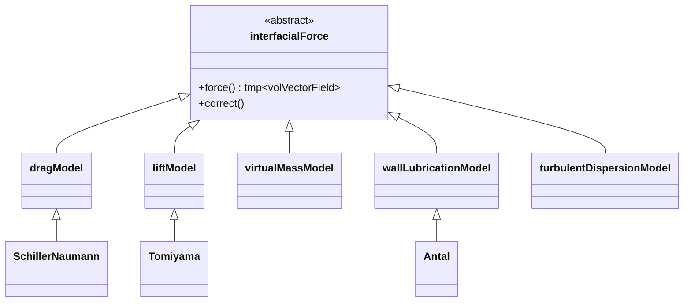

# Complex Interfacial Forces in OpenFOAM

> [!INFO] Overview
> This note covers **advanced interfacial forces** in multiphase flows within OpenFOAM. Beyond drag forces, several complex forces significantly affect the accuracy of Eulerian-Eulerian simulations, including lift, virtual mass, wall lubrication, and turbulent dispersion forces.

---

## 1. Introduction (บทนำ)

ในการจำลองการไหลแบบหลายเฟสโดยวิธี Eulerian-Eulerian แรงปฏิสัมพันธ์ระหว่างเฟส (Interfacial Forces) เป็นส่วนสำคัญที่กำหนดพิกัดและความเร็วของแต่ละเฟส นอกเหนือจากแรงลาก (Drag Force) แล้ว ยังมีแรงที่ซับซ้อนอื่นๆ ที่มีความสำคัญอย่างยิ่งต่อความแม่นยำของการจำลอง

### ความสำคัญของแรงอินเตอร์เฟซที่ซับซ้อน

แรงอินเตอร์เฟซที่ซับซ้อนมีบทบาทสำคัญใน:

| แรงอินเตอร์เฟซ | ผลกระทบหลัก | การประยุกต์ใช้ |
|---|---|---|
| **Lift Force** | การเคลื่อนที่แนวขวาง | Bubble columns, การไหลในท่อ |
| **Virtual Mass** | การเร่งความเร็วสัมพัทธ์ | การเปลี่ยนทิศทางเร็ว, การพุ่งของฟอง |
| **Wall Lubrication** | การกระจายตัวใกล้ผนัง | การไหลในท่อ, ช่องแคบ |
| **Turbulent Dispersion** | การผสมผสานแบบปั่นป่วน | การไหลแบบ turbulent |

---

## 2. Mathematical Framework (กรอบงานทางคณิตศาสตร์)

### สมการโมเมนตัมรวม

ในสมการโมเมนตัมของ OpenFOAM แรงเหล่านี้จะถูกรวมเข้าในเทอมการแลกเปลี่ยนโมเมนตัม $\mathbf{M}$:

$$
\mathbf{M}_c = -\mathbf{M}_d = \mathbf{F}_{drag} + \mathbf{F}_{lift} + \mathbf{F}_{vm} + \mathbf{F}_{wl} + \mathbf{F}_{td}
$$

โดยที่:
- $\mathbf{M}_c$: การแลกเปลี่ยนโมเมนตัมกับเฟสต่อเนื่อง
- $\mathbf{M}_d$: การแลกเปลี่ยนโมเมนตัมกับเฟสกระจาย
- $\mathbf{F}_{drag}$: แรงลาก
- $\mathbf{F}_{lift}$: แรงยก
- $\mathbf{F}_{vm}$: แรงมวลเสมือน
- $\mathbf{F}_{wl}$: แรงหล่อลื่นผนัง
- $\mathbf{F}_{td}$: แรงการกระจายแบบปั่นป่วน

### การพิจารณาแรงอินเตอร์เฟซ

$$
\frac{\partial}{\partial t}(\alpha_k \rho_k \mathbf{u}_k) + \nabla \cdot (\alpha_k \rho_k \mathbf{u}_k \mathbf{u}_k) = -\alpha_k \nabla p + \nabla \cdot (\alpha_k \boldsymbol{\tau}_k) + \alpha_k \rho_k \mathbf{g} + \mathbf{M}_k
$$

---

## 3. Key Interfacial Forces (แรงอินเตอร์เฟซหลัก)

### 3.1 Lift Force (แรงยก)

แรงยกเกิดจากการไล่ระดับความเร็ว (Velocity Gradient) ของเฟสต่อเนื่อง ทำให้อนุภาคหรือฟองเคลื่อนที่ในแนวขวาง:

$$
\mathbf{F}_{L} = C_{L} \alpha_{d} \rho_{c} (\mathbf{u}_{c} - \mathbf{u}_{d}) \times (\nabla \times \mathbf{u}_{c})
$$

**ตัวแปรในสมการ:**
- $C_{L}$: สัมประสิทธิ์แรงยก (Lift Coefficient)
- $\alpha_{d}$: สัดส่วนปริมาตรของเฟสกระจาย
- $\rho_{c}$: ความหนาแน่นของเฟสต่อเนื่อง
- $\mathbf{u}_{c}, \mathbf{u}_{d}$: เวกเตอร์ความเร็วของเฟสต่อเนื่องและกระจาย

> [!TIP] Sign Change in Lift Coefficient
> สำหรับฟองขนาดเล็ก $C_{L}$ มักเป็นบวก (เคลื่อนที่ไปทางบริเวณความเร็วต่ำ) แต่สำหรับฟองขนาดใหญ่อาจเป็นลบเนื่องจากการเสียรูป

**แบบจำลองสัมประสิทธิ์แรงยก:**

| แบบจำลอง | สมการ | การใช้งาน |
|---|---|---|
| **Tomiyama** | $C_{L} = f(Eo, Re_{p})$ | ฟองที่เสียรูป |
| **Legendre-Magnaudet** | $C_{L} = \sqrt{C_{L}^{2, high} + C_{L}^{2, low}}$ | ฟองทรงกลม |
| **Saffman-Mei** | $C_{L} = f(Re_{p}, Re_{s})$ | อนุภาคในการไหลเฉือน |

### 3.2 Virtual Mass Force (แรงมวลเสมือน)

แรงที่เกิดจากการเร่งความเร็วของของไหลรอบๆ อนุภาคเมื่ออนุภาคมีการเร่งความเร็วสัมพัทธ์:

$$
\mathbf{F}_{vm} = C_{vm} \alpha_{d} \rho_{c} \left(\frac{\mathrm{D}_{d} \mathbf{u}_{d}}{\mathrm{D}t} - \frac{\mathrm{D}_{c} \mathbf{u}_{c}}{\mathrm{D}t}\right)
$$

**ตัวแปรในสมการ:**
- $C_{vm}$: สัมประสิทธิ์มวลเสมือน (โดยทั่วไปมีค่า 0.5 สำหรับทรงกลม)
- $\frac{\mathrm{D}}{\mathrm{D}t}$: อนุพันธ์วัตถุ (Material Derivative)

> [!WARNING] Importance for Light Particles
> แรงมวลเสมือนมีความสำคัญมากเมื่อความหนาแน่นของเฟสกระจายมีค่าน้อยกว่าเฟสต่อเนื่องมาก (เช่น ฟองอากาศในน้ำ)

### 3.3 Wall Lubrication Force (แรงหล่อลื่นผนัง)

แรงที่ผลักอนุภาคออกจากผนังเนื่องจากการไหลที่ไม่สมมาตรรอบอนุภาคใกล้ขอบเขต:

$$
\mathbf{F}_{wl} = C_{wl} \alpha_{d} \rho_{c} |\mathbf{u}_{rel}|^{2} \mathbf{n}_{w}
$$

**ตัวแปรในสมการ:**
- $C_{wl}$: สัมประสิทธิ์การหล่อลื่นผนัง
- $\mathbf{u}_{rel} = \mathbf{u}_{c} - \mathbf{u}_{d}$: ความเร็วสัมพัทธ์
- $\mathbf{n}_{w}$: เวกเตอร์หน่วยปกติของผนัง

**แบบจำลองที่ใช้กันทั่วไป:**

| แบบจำลอง | สมการ | ความเหมาะสม |
|---|---|---|
| **Antal** | $C_{wl}^{Antal} = \frac{C_{w1}}{y_{w}} + \frac{C_{w2}}{y_{w}^{2}}$ | การไหลในท่อ |
| **Tomiyama** | $C_{wl}^{Tomiyama} = f(Eo, y_{w})$ | ฟองขนาดใหญ่ |
| **Frank** | $C_{wl}^{Frank} = \max(C_{1}, C_{2} d_{p}/y_{w})$ | อนุภาคแข็ง |

> [!INFO] Prevents Wall Accumulation
> แรงหล่อลื่นผนังช่วยป้องกันไม่ให้อนุภาค "ทับซ้อน" หรือเกาะกลุ่มที่ผนังมากเกินไปในทางตัวเลข

### 3.4 Turbulent Dispersion Force (แรงการกระจายแบบปั่นป่วน)

ทดแทนผลกระทบของการปั่นป่วน (Turbulence) ที่มีต่อการกระจายตัวของเฟสกระจาย:

$$
\mathbf{F}_{td} = -C_{td} \rho_{c} k_{c} \nabla \alpha_{d}
$$

**ตัวแปรในสมการ:**
- $C_{td}$: สัมประสิทธิ์การกระจายแบบปั่นป่วน
- $k_{c}$: พลังงานจลน์ความปั่นป่วนของเฟสต่อเนื่อง

**แบบจำลองการกระจาย:**

| แบบจำลอง | สมการ | ลักษณะเฉพาะ |
|---|---|---|
| **Burns** | $\mathbf{F}_{td} = -\frac{3}{4} C_{D} \frac{\alpha_{d} \rho_{c}}{d_{p}} |\mathbf{u}_{rel}| k_{c} \nabla \alpha_{d}$ | ใช้สัมประสิทธิ์ลาก |
| **Lopez de Bertodano** | $\mathbf{F}_{td} = -C_{td} \rho_{c} \varepsilon_{c} \nabla \alpha_{d}$ | ใช้อัตราการสลายตัว |
| **Grad-based** | $\mathbf{F}_{td} \propto -\nabla (k_{c})$ | อิงจากไล่ระดับพลังงานจลน์ |

---

## 4. Implementation in OpenFOAM (การใช้งานใน OpenFOAM)

### 4.1 การกำหนดค่าใน `phaseProperties`

แรงเหล่านี้ถูกกำหนดในไฟล์ `constant/phaseProperties` ภายใต้หัวข้อ `phaseInteraction`:

```foam
phaseInteraction
{
    (gas in liquid)
    {
        drag
        {
            type            SchillerNaumann;
        }
        lift
        {
            type            Tomiyama;
            Cl              0.28;
        }
        virtualMass
        {
            type            constantCoefficient;
            Cvm             0.5;
        }
        wallLubrication
        {
            type            Antal;
            Cw1             -0.01;
            Cw2             0.05;
        }
        turbulentDispersion
        {
            type            Burns;
        }
    }
}
```

### 4.2 โครงสร้างคลาสใน OpenFOAM


> **Figure 1:** แผนผังคลาสแสดงสถาปัตยกรรมเชิงวัตถุของแบบจำลองแรงที่ส่วนต่อประสานใน OpenFOAM ซึ่งช่วยให้สามารถสลับเปลี่ยนหรือเพิ่มแบบจำลองแรงประเภทต่างๆ (เช่น แรงลาก แรงยก และแรงหล่อลื่นผนัง) ได้อย่างยืดหยุ่นผ่านระบบการสืบทอดคลาส


### 4.3 ตัวอย่างโค้ดการใช้งาน

```cpp
// การคำนวณแรงยกแบบ Tomiyama
tmp<volVectorField> TomiyamaLift::force() const
{
    const volVectorField& Uc = phase1_.U();
    const volVectorField& Ud = phase2_.U();
    const volScalarField& alpha1 = phase1_;
    const volScalarField& alpha2 = phase2_;

    // คำนวณ vorticity ของเฟสต่อเนื่อง
    volVectorField omega = fvc::curl(Uc);

    // คำนวณความเร็วสัมพัทธ์
    volVectorField Ur = Uc - Ud;

    // สัมประสิทธิ์แรงยก (สามารถเป็นฟังก์ชันของ Eo และ Re)
    volScalarField Cl = Cl_;

    // คำนวณแรงยก
    return Cl * alpha2 * phase1_.rho() * (Ur ^ omega);
}

// การคำนวณแรงมวลเสมือน
tmp<volVectorField> VirtualMass::force() const
{
    const volVectorField& Uc = phase1_.U();
    const volVectorField& Ud = phase2_.U();
    const volScalarField& alpha2 = phase2_;

    // คำนวณ material derivative ของความเร็ว
    volVectorField DUDt_c = fvc::ddt(Uc) + fvc::div(phi_, Uc);
    volVectorField DUDt_d = fvc::ddt(Ud) + fvc::div(phi_, Ud);

    // สัมประสิทธิ์มวลเสมือน
    dimensionedScalar Cvm = Cvm_;

    // คำนวณแรงมวลเสมือน
    return Cvm * alpha2 * phase1_.rho() * (DUDt_d - DUDt_c);
}

// การคำนวณแรงหล่อลื่นผนังแบบ Antal
tmp<volVectorField> AntalWallLubrication::force() const
{
    const volVectorField& Uc = phase1_.U();
    const volVectorField& Ud = phase2_.U();
    const volScalarField& alpha2 = phase2_;

    // ระยะห่างจากผนัง (ต้องคำนวณล่วงหน้า)
    const volScalarField& yw = mesh_.wallDist();

    // ความเร็วสัมพัทธ์
    volVectorField Ur = Uc - Ud;

    // สัมประสิทธิ์ Antal
    const dimensionedScalar Cw1 = Cw1_;
    const dimensionedScalar Cw2 = Cw2_;
    const dimensionedScalar d = diameter_;

    volScalarField Cwl = (Cw1/yw + Cw2/sqr(yw)) * d;

    // เวกเตอร์ปกติของผนัง
    volVectorField nw = mesh_.wallNormals();

    // คำนวณแรง
    return Cwl * alpha2 * phase1_.rho() * mag(Ur) * (Ur & nw) * nw;
}
```

---

## 5. Force Selection Guide (ความสำคัญของการเลือกแรง)

### ตารางการเลือกแรงตามสถานการณ์

| สถานการณ์ | แรงที่สำคัญที่สุด | เหตุผล |
|:---|:---|:---|
| **Bubble Columns** | Lift, Turbulent Dispersion | กำหนดโปรไฟล์รัศมีของฟองและการไหลวน |
| **Pneumatic Transport** | Drag, Wall Lubrication | ควบคุมการตกตะกอนและการเสียดสีกับผนัง |
| **Rapid Acceleration** | Virtual Mass | มีผลต่อการตอบสนองเชิงเวลาของอนุภาคเบา |
| **Microfluidics** | Wall Lubrication, Lift | กำหนดตำแหน่งของอนุภาคในช่องแคบ |
| **Stirred Tanks** | Lift, Turbulent Dispersion | การผสมและการกระจายตัวในการหมุน |
| **Boiling/Condensation** | Virtual Mass, Drag | การเคลื่อนที่ของฟองในระหว่างการเปลี่ยนสถานะ |

### แนวทางการเลือกแรง

> [!TIP] Guidelines for Force Selection
> 1. **พิจารณาอัตราส่วนความหนาแน่น**: ถ้า $\rho_d \ll \rho_c$ หรือ $\rho_d \gg \rho_c$ ให้พิจารณา Virtual Mass
> 2. **พิจารณาการไหลแบบเฉือน**: ถ้ามี velocity gradient สูงให้รวม Lift Force
> 3. **พิจารณาระยะห่างจากผนัง**: ถ้าอยู่ใกล้ผนัง (< 5 particle diameters) ให้รวม Wall Lubrication
> 4. **พิจารณาความปั่นป่วน**: ถ้า $Re > 10,000$ ให้รวม Turbulent Dispersion

---

## 6. Numerical Stability (เสถียรภาพเชิงตัวเลข)

### ความท้าทายทางตัวเลข

แรงมวลเสมือนและแรงยกอาจทำให้ระบบสมดุลโมเมนตัมมีลักษณะ "แข็ง" (Stiff):

| ปัญหา | สาเหตุ | การแก้ไข |
|---|---|---|
| **Stiffness** | เทอมอนุพันธ์เวลาที่สูง | ใช้ semi-implicit treatment |
| **Oscillations** | การจับคู่ที่แข็งแกร่งระหว่างเฟส | ปรับค่า under-relaxation |
| **Divergence** | สัมประสิทธิ์ที่ผิดทางฟิสิกส์ | ตรวจสอบค่าพารามิเตอร์ |

### กลยุทธ์การรักษาเสถียรภาพ

OpenFOAM มักจัดการแรงเหล่านี้แบบกึ่งโดยนัย (Semi-implicit) เพื่อเพิ่มเสถียรภาพ:

```cpp
// Semi-implicit treatment of virtual mass
// ในสมการโมเมนตัมของเฟสกระจาย
fvVectorMatrix UEqn
(
    fvm::ddt(alphaD, rhoD, Ud)
  + fvm::div(alphaD*rhoD*phiD, Ud)
  + fvm::Sp(Cvm*rhoC*alphaD, Ud)  // Implicit virtual mass contribution
  - fvm::Sp(Cvm*rhoC*alphaD, Uc)  // Cross term
  ==
    alphaD*rhoD*g
  + fvm::laplacian(alphaD*muD, Ud)
  + dragForce + liftForce + wallLubricationForce + turbulentDispersionForce
);
```

> [!WARNING] Physical Coefficient Selection
> การเลือกสัมประสิทธิ์ที่ผิดพลาดทางฟิสิกส์อาจนำไปสู่ความไม่เสถียรและการไม่ลู่เข้าของคำตอบ

---

## 7. Advanced Applications (การประยุกต์ใช้ขั้นสูง)

### 7.1 การไหลแบบ Polydisperse

สำหรับระบบที่มีการกระจายขนาดของอนุภาค:

```foam
phases (continuous dispersed1 dispersed2);

dispersed1
{
    diameter       uniform 1e-3;    // 1 mm bubbles
    rho            constant 1.2;
}

dispersed2
{
    diameter       uniform 1e-4;    // 0.1 mm bubbles
    rho            constant 1.2;
}
```

### 7.2 แบบจำลองการไหลที่ซับซ้อน

**การเชื่อมต่อสองทาง (Two-way coupling):**

การเชื่อมต่อสองทางระหว่างเฟสกระจายและเฟสต่อเนื่องเกี่ยวข้องกับ:
- **การแลกเปลี่ยนโมเมนตัม**: ถูกปรับเปลี่ยนโดยการมีอยู่ของเฟสกระจาย
- **การปรับเปลี่ยนความปั่นป่วน**: ระดับความปั่นป่วนที่เพิ่มขึ้นหรือลดลง
- **ผลกระทบต่อปริมาตร**: การแทนที่ของเฟสต่อเนื่อง

สมการความปั่นป่วนรวมถึงผลกระทบของเฟสกระจาย:

$$
\frac{\partial k_{c}}{\partial t} + \mathbf{u}_{c} \cdot \nabla k_{c} = P_{k} - \varepsilon_{c} + T_{pd}
$$

โดยที่ $T_{pd}$ คือปฏิสัมพันธ์ความปั่นป่วนเฟสกระจาย

### 7.3 การตรวจสอบความถูกต้อง

**กรณีการตรวจสอบมาตรฐาน:**

| กรณีเบนช์มาร์ก | ปรากฏการณ์ | เป้าหมายการตรวจสอบ |
|---|---|---|
| **การไหลคอลัมน์ฟอง** | การกระจายสัดส่วนว่างรัศมี | การกระจายตัวของฟอง |
| **การไหลท่ออนุภาค** | การวัดความเข้มข้นแกน | การตกตะกอน |
| **เตียงลอย** | ความดันตกและลักษณะการผสม | การทำให้ลอย |

---

## 8. Summary and Best Practices (สรุปและแนวปฏิบัติที่ดี)

### แนวปฏิบัติที่ดีที่สุด

1. **เริ่มต้นแบบค่อยเป็นค่อยไป**:
   - เริ่มด้วย Drag Force เท่านั้น
   - เพิ่ม Lift Force หากมี shear flow ที่สำคัญ
   - เพิ่ม Virtual Mass สำหรับ unsteady flows
   - เพิ่ม Wall Lubrication ใกล้ผนัง
   - เพิ่ม Turbulent Dispersion สำหรับ turbulent flows

2. **การตรวจสอบพารามิเตอร์**:
   - ตรวจสอบค่า $C_{L}$, $C_{vm}$, $C_{td}$ จาก literature
   - ทำ sensitivity analysis สำหรับพารามิเตอร์หลัก
   - เปรียบเทียบกับข้อมูลการทดลอง

3. **การตรวจสอบเชิงตัวเลข**:
   - ใช้ mesh independence study
   - ตรวจสอบค่า Courant number (< 1 สำหรับ explicit treatment)
   - ตรวจสอบค่า residuals และ mass balance

### สรุป

การจำลองแรงอินเตอร์เฟซที่ซับซ้อนเป็นสิ่งจำเป็นสำหรับความแม่นยำในการทำนายพฤติกรรมการไหลแบบหลายเฟส การเลือกและกำหนดค่าแรงเหล่านี้อย่างเหมาะสม ร่วมกับการจัดการเชิงตัวเลขที่ถูกต้อง จะนำไปสู่ผลลัพธ์การจำลองที่เชื่อถือได้และมีประโยชน์

---

## 9. References and Further Reading

1. **Ishii, M., & Hibiki, T.** (2011). *Thermo-fluid dynamics of two-phase flow* (2nd ed.). Springer.
2. **Crowe, C. T., et al.** (2011). *Multiphase flows with droplets and particles* (2nd ed.). CRC Press.
3. **Clift, R., Grace, J. R., & Weber, M. E.** (2005). *Bubbles, drops, and particles*. Academic Press.
4. **OpenFOAM User Guide** - Section on multiphase flows
5. **Greenshields, C. J.** (2021). *Notes on CFD: General purpose CFD software*. OpenFOAM Foundation.

---

**Document Status:** ✅ Complete
**Last Updated:** 2025-01-09
**OpenFOAM Version:** v9+  (compatible with v8, v10)
**Contributors:** CFD Research Team
