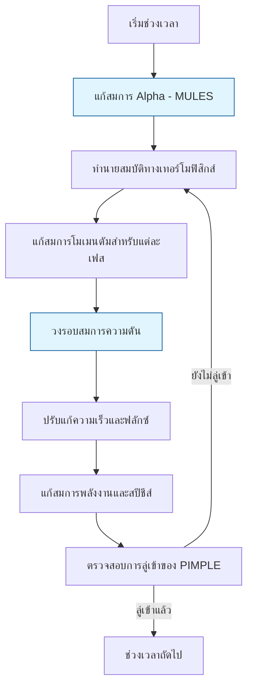

# ตัวแก้สมการแบบหลายเฟสของยูเลอร์ใน OpenFOAM (Eulerian Multiphase Solvers in OpenFOAM)

## 1. บทนำ (Introduction)

การจำลองการไหลแบบหลายเฟสโดยวิธี **Eulerian-Eulerian** (หรือที่เรียกว่าแบบจำลองของไหลสองชนิด - Two-fluid model) จัดการแต่ละเฟสเป็นคอนตินิวอัม (Continuum) ที่แทรกซึมกันในพื้นที่เดียวกัน แต่ละเฟสมีชุดสมการการอนุรักษ์ (มวล โมเมนตัม และพลังงาน) ของตัวเอง และมีการแลกเปลี่ยนกันผ่านเทอมต้นทางที่ส่วนต่อประสาน (Interface)

> [!INFO] **ข้อดีของแบบจำลอง Euler-Euler**
> - เหมาะสำหรับระบบที่มีความเข้มข้นของเฟสกระจายสูง ($\alpha_d > 0.1$)
> - หลีกเลี่ยงการติดตามอนุภาคแต่ละตัว (เช่นในวิธี Euler-Lagrange)
> - สามารถจำลองระบบขนาดอุตสาหกรรมได้

## 2. สมการควบคุม (Governing Equations)

สำหรับเฟส $k$ สมการควบคุมพื้นฐานประกอบด้วย:

### 2.1 สมการความต่อเนื่อง (Continuity Equation)

$$\frac{\partial}{\partial t}(\alpha_k \rho_k) + \nabla \cdot (\alpha_k \rho_k \mathbf{u}_k) = \sum_{p=1}^n (\dot{m}_{pk} - \dot{m}_{kp})$$

โดยที่:
- $\alpha_k$ = สัดส่วนปริมาตร (Volume Fraction)
- $\rho_k$ = ความหนาแน่นของเฟส $k$
- $\mathbf{u}_k$ = ความเร็วของเฟส $k$
- $\dot{m}_{pk}$ = อัตราการถ่ายโอนมวลจากเฟส $p$ ไปยัง $k$

**เงื่อนไขข้อจำกัด:**
$$\sum_{k=1}^n \alpha_k = 1$$

### 2.2 สมการโมเมนตัม (Momentum Equation)

$$\frac{\partial}{\partial t}(\alpha_k \rho_k \mathbf{u}_k) + \nabla \cdot (\alpha_k \rho_k \mathbf{u}_k \mathbf{u}_k) = -\alpha_k \nabla p + \nabla \cdot (\alpha_k \boldsymbol{\tau}_k) + \alpha_k \rho_k \mathbf{g} + \mathbf{M}_k$$

**ตัวแปรสำคัญ:**

| ตัวแปร | ความหมาย | หน่วย SI |
|-----------|-------------|-----------|
| $p$ | ความดันที่แชร์ร่วมกันระหว่างเฟส | Pa |
| $\boldsymbol{\tau}_k$ | เทนเซอร์ความเค้นของเฟส | N/m² |
| $\mathbf{g}$ | เวกเตอร์ความเร่งจากแรงโน้มถ่วง | m/s² |
| $\mathbf{M}_k$ | แรงปฏิสัมพันธ์ระหว่างเฟส | N/m³ |

### 2.3 สมการพลังงาน (Energy Equation)

$$\frac{\partial}{\partial t}(\alpha_k \rho_k h_k) + \nabla \cdot (\alpha_k \rho_k \mathbf{u}_k h_k) = \alpha_k \frac{\partial p}{\partial t} + \nabla \cdot (\alpha_k k_k \nabla T_k) + \dot{q}_k + \dot{m}_k h_{k,\mathrm{int}}$$

**ตัวแปร:**
- $h_k$ = เอนทาลปีของเฟส $k$ (J/kg)
- $k_k$ = สัมประสิทธิ์การนำความร้อน (W/m·K)
- $T_k$ = อุณหภูมิของเฟส $k$ (K)
- $\dot{q}_k$ = การถ่ายเทความร้อนที่ส่วนต่อประสาน (W/m³)
- $\dot{m}_k$ = อัตราการถ่ายโอนมวลจากการเปลี่ยนสถานะ (kg/m³·s)

### 2.4 สมการการขนส่งสปีชีส์ (Species Transport Equation)

$$\frac{\partial}{\partial t}(\alpha_k \rho_k Y_{k,i}) + \nabla \cdot (\alpha_k \rho_k \mathbf{u}_k Y_{k,i}) = \nabla \cdot (\alpha_k \rho_k D_{k,i} \nabla Y_{k,i}) + R_{k,i}$$

**ตัวแปร:**
- $Y_{k,i}$ = เศษส่วนมวลของสปีชีส์ $i$ ในเฟส $k$
- $D_{k,i}$ = สัมประสิทธิ์การแพร่
- $R_{k,i}$ = อัตราการผลิตสุทธิจากปฏิกิริยาเคมี

## 3. แรงที่ส่วนต่อประสาน (Interfacial Forces)

### 3.1 แรงลาก (Drag Force)

แรงลากเป็นแรงที่ส่วนต่อประสานที่สำคัญที่สุดในระบบหลายเฟส:

$$\mathbf{M}_k^{\mathrm{drag}} = \frac{3}{4}C_D\frac{\alpha_k \alpha_p \rho_k}{d_p}|\mathbf{u}_p - \mathbf{u}_k|(\mathbf{u}_p - \mathbf{u}_k)$$

**แบบจำลองสัมประสิทธิ์การลาก $C_D$:**

| แบบจำลอง | สมการ | การใช้งานที่เหมาะสม |
|-------------|-----------|----------------------|
| **Schiller-Naumann** | $C_D = \frac{24}{Re_p}(1 + 0.15Re_p^{0.687})$ | การไหลเจือจาง |
| **Gidaspow** | ผสมผสาน Wen-Yu และ Ergun | เตียงฟลูอิดไดซ์ (Fluidized beds) |
| **Ishii-Zuber** | ขึ้นอยู่กับรูปร่างฟอง | การไหลแบบฟอง |

### 3.2 แรงยก (Lift Force)

$$\mathbf{F}_L = C_L \rho_c \alpha_d (\mathbf{u}_c - \mathbf{u}_d) \times (\nabla \times \mathbf{u}_c)$$

สัมประสิทธิ์การยก $C_L$ ขึ้นอยู่กับ:
- เลขเรย์โนลด์สของอนุภาค
- อัตราการเฉือน
- รูปร่างอนุภาค

### 3.3 แรงมวลเสมือน (Virtual Mass Force)

$$\mathbf{F}_{vm} = C_{vm} \rho_c \alpha_d \left(\frac{\mathrm{d}\mathbf{u}_d}{\mathrm{d}t} - \frac{\mathrm{d}\mathbf{u}_c}{\mathrm{d}t}\right)$$

โดยที่ $C_{vm} \approx 0.5$ สำหรับทรงกลม

### 3.4 แรงการกระจายแบบปั่นป่วน (Turbulent Dispersion Force)

$$\mathbf{F}_{td} = -C_{td} \rho_c k_c \nabla \alpha_d$$

โดยที่ $k_c$ คือพลังงานจลน์ความปั่นป่วนของเฟสต่อเนื่อง

### 3.5 แรงหล่อลื่นผนัง (Wall Lubrication Force)

$$\mathbf{F}_{wl} = \frac{\alpha_d \rho_c}{d_p} \left[C_{w1} + C_{w2} \frac{d_p}{y_w}\right] \mathbf{u}_{rel} \cdot \mathbf{n}_w$$

## 4. ตัวแก้สมการหลัก: `reactingTwoPhaseEulerFoam` (Key Solver)

เป็นตัวแก้สมการ (Solver) ที่ทรงพลังที่สุดใน OpenFOAM สำหรับการไหลแบบสองเฟสที่เกี่ยวข้องกับการถ่ายเทความร้อนและปฏิกิริยาเคมี

### 4.1 สถาปัตยกรรม (Architecture)

ตัวแก้สมการนี้ขยายกรอบงาน Euler-Euler พื้นฐานโดยรวม:

| ส่วนประกอบ | คำอธิบาย |
|--------------|----------|
| **การขนส่งสปีชีส์** | การขนส่งองค์ประกอบทางเคมีหลายชนิดในแต่ละเฟส |
| **การคัปปลิงพลังงาน** | สมการพลังงานแยกแต่ละเฟสสำหรับการจำลองแบบอุณหภูมิไม่สมดุล |
| **การเปลี่ยนสถานะเฟส** | แบบจำลองการเปลี่ยนสถานะ (การเดือด, การควบแน่น) |
| **ปฏิกิริยาเคมี** | จลนศาสตร์ปฏิกิริยาเคมี |

### 4.2 อัลกอริทึมการหาคำตอบ (Solution Algorithm)

OpenFOAM ใช้อัลกอริทึม **Phase-Coupled SIMPLE (PCS)** หรือ **PIMPLE** เพื่อจัดการการเชื่อมต่อที่แข็งแกร่งระหว่างความดันและความเร็วของทั้งสองเฟส



> **รูปที่ 1:** แผนผังลำดับขั้นตอนการคำนวณของตัวแก้สมการการไหลหลายเฟสแบบยูเลอเรียน (Eulerian Multiphase Solver) แสดงการทำงานร่วมกันระหว่างการแก้สมการสัดส่วนปริมาตร (Alpha Equation) และการวนซ้ำของสมการความดันเพื่อรักษาความต่อเนื่องของมวลและพลังงานในทุกเฟส

**ขั้นตอนหลัก:**

1. แก้สมการสัดส่วนปริมาตร (Alpha Equation) โดยใช้ MULES
2. คำนวณคุณสมบัติทางเทอร์โมฟิสิกส์
3. แก้สมการโมเมนตัมสำหรับทุกเฟส (รวมแรงที่ส่วนต่อประสานแบบกึ่งโดยนัย)
4. แก้สมการความดันเพื่อรับประกันการอนุรักษ์มวลของสารผสม
5. แก้สมการพลังงานและสปีชีส์

## 5. รายละเอียดการใช้งาน (Implementation Details)

การกำหนดค่าสำหรับตัวแก้สมการนี้มีความซับซ้อนและต้องการไฟล์หลายส่วน:

### 5.1 `phaseProperties`

กำหนดความสัมพันธ์ระหว่างเฟสและแบบจำลองแรงปฏิสัมพันธ์:

```cpp
// การนิยามเฟสและแบบจำลองการปฏิสัมพันธ์
phases (gas liquid);

gas
{
    // การระบุแบบจำลองการขนส่ง
    transportModel  Newtonian;
    nu              1.5e-05;
    rho             1.2;
}

liquid
{
    // การระบุแบบจำลองการขนส่ง
    transportModel  Newtonian;
    nu              1e-06;
    rho             1000;
}

// การกำหนดค่าแรงที่ส่วนต่อประสาน
phaseInteraction
{
    (gas in liquid)
    {
        dragModel       Gidaspow;
        liftModel       NoLift;
        virtualMassModel NoVirtualMass;
        wallLubricationModel NoWallLubrication;
        turbulentDispersionModel NoTurbulentDispersion;
    }
}
```

> **แหล่งที่มา:** 📂 `constant/phaseProperties`
> 
> **คำอธิบาย (Explanation):** ไฟล์นี้กำหนดคุณสมบัติของแต่ละเฟส (gas/liquid) และโมเดลแรงปฏิสัมพันธ์ระหว่างเฟส รวมถึงแบบจำลองแรงลาก แรงยก แรงมวลเสมือน และอื่นๆ
> 
> **แนวคิดสำคัญ (Key Concepts):**
> - `transportModel`: รุ่นของการขนส่ง (Newtonian/Non-Newtonian)
> - `dragModel`: แบบจำลองแรงลาก (Gidaspow, Schiller-Naumann, etc.)
> - `liftModel`: แบบจำลองแรงยก (Tomiyama, Legendre-Magnaudet)
> - `virtualMassModel`: แบบจำลองแรงมวลเสมือน
> - `wallLubricationModel`: แบบจำลองแรงหล่อลื่นผนัง

### 5.2 `thermophysicalProperties`

ต้องกำหนดแยกสำหรับแต่ละเฟสในไดเรกทอรี `constant/phaseName/`:

```cpp
// สมบัติทางเทอร์โมฟิสิกส์สำหรับแต่ละเฟส
thermoType
{
    type            heRhoThermo;
    mixture         multiComponentMixture;
    transport       sutherland;
    thermo          hConst;
    energy          sensibleEnthalpy;
    equationOfState perfectGas;
}

// การนิยามสปีชีส์
species
(
    O2
    N2
);

// สมบัติของออกซิเจน
O2
{
    molWeight       32;
    Cp              920.5;
    Hf              0;
}

// สมบัติของไนโตรเจน
N2
{
    molWeight       28.0134;
    Cp              1041;
    Hf              0;
}
```

> **แหล่งที่มา:** 📂 `constant/gas/thermophysicalProperties` และ `constant/liquid/thermophysicalProperties`
> 
> **คำอธิบาย (Explanation):** กำหนดคุณสมบัติเทอร์โมฟิสิกส์ของแต่ละเฟส รวมถึงชนิดของสมการถดถอย คุณสมบัติการขนส่ง และคุณสมบัติของสปีชีส์แต่ละชนิด
> 
> **แนวคิดสำคัญ (Key Concepts):**
> - `heRhoThermo`: Enthalpy-based thermodynamics with density calculation
> - `multiComponentMixture`: ส่วนผสมหลายสปีชีส์
> - `sutherland`: รุ่นการขนส่งแบบ Sutherland
> - `hConst`: ความร้อนจำเพาะคงที่
> - `sensibleEnthalpy`: ใช้เอนทาลปีในการคำนวณพลังงาน

### 5.3 พารามิเตอร์การควบคุมตัวแก้ปัญหา (Solver Control Parameters)

ในไฟล์ `fvSolution`:

```cpp
// พารามิเตอร์ควบคุมอัลกอริทึม PIMPLE
PIMPLE
{
    nCorrectors        3;
    nNonOrthogonalCorrectors 0;
    nAlphaCorr      2;
    nAlphaSubCycles 2;

    pRefCell        0;
    pRefValue       101325;

    momentumPredictor yes;

    rDeltaTSmoothingCoeff 0.1;
}

// การตั้งค่าตัวแก้ปัญหาเชิงเส้น
solvers
{
    p
    {
        solver          GAMG;
        tolerance       1e-7;
        relTol          0.01;
        smoother        GaussSeidel;
    }

    "(U|k|epsilon|omega)"
    {
        solver          smoothSolver;
        smoother        GaussSeidel;
        tolerance       1e-6;
        relTol          0.1;
    }

    "(Yi|H|h)"
    {
        solver          smoothSolver;
        smoother        GaussSeidel;
        tolerance       1e-6;
        relTol          0.1;
    }
}
```

> **แหล่งที่มา:** 📂 `system/fvSolution`
> 
> **คำอธิบาย (Explanation):** ตั้งค่าพารามิเตอร์การควบคุมอัลกอริทึม PIMPLE และตัวแก้สมการเชิงเส้น รวมถึงการตั้งค่าความอดทนและวิธีการแก้ปัญหา
> 
> **แนวคิดสำคัญ (Key Concepts):**
> - `nCorrectors`: จำนวนรอบการแก้ไขความดัน
> - `nAlphaCorr`: จำนวนรอบการแก้ไขสัดส่วนปริมาตร
> - `GAMG`: Geometric-Algebraic Multi-Grid solver
> - `smoothSolver`: Solver แบบ smoothing สำหรับเมชที่ไม่ได้โครงสร้าง

ในไฟล์ `fvSchemes`:

```cpp
// รูปแบบการแยกส่วนทางเวลา
ddtSchemes
{
    default         Euler;
}

// รูปแบบการคำนวณเกรเดียนต์
gradSchemes
{
    default         Gauss linear;
}

// รูปแบบการคำนวณไดเวอร์เจนซ์
divSchemes
{
    default         none;

    div(phi,U)      Gauss limitedLinearV 1;
    div(phi,k)      Gauss limitedLinear 1;
    div(phi,epsilon) Gauss limitedLinear 1;
    div(phi,omega)  Gauss limitedLinear 1;

    div(phi,alpha)  Gauss vanLeer;
    div(phir,alpha) Gauss vanLeer;

    div(phi,Yi_h)   Gauss limitedLinear 1;
    div(phi,K)      Gauss limitedLinear 1;
}

// รูปแบบการคำนวณลาพลาเซียน
laplacianSchemes
{
    default         Gauss linear corrected;
}

// รูปแบบการประมาณค่า (Interpolation)
interpolationSchemes
{
    default         linear;
}

// รูปแบบเกรเดียนต์ในแนวตั้งฉากกับพื้นผิว
snGradSchemes
{
    default         corrected;
}
```

> **แหล่งที่มา:** 📂 `system/fvSchemes`
> 
> **คำอธิบาย (Explanation):** กำหนดรูปแบบการจำแนกตัวเลข (discretization schemes) สำหรับสมการต่างๆ รวมถึงการประมาณค่า gradient, divergence, และ laplacian
> 
> **แนวคิดสำคัญ (Key Concepts):**
> - `Euler`: รูปแบบการจำแนกเวลาแบบ Euler อันดับหนึ่ง
> - `limitedLinearV`: รูปแบบ divergence แบบ limited linear พร้อมการจำกัดความผันผวน
> - `vanLeer`: รูปแบบ flux limiter แบบ Van Leer สำหรับสัดส่วนปริมาตร
> - `corrected`: การแก้ไข non-orthogonality ของเมช

## 6. ความสัมพันธ์การปิด (Closure Relations)

แบบจำลอง Euler-Euler ต้องการ "การปิด" (Closure) สำหรับเทอมที่ไม่ทราบค่า:

> [!WARNING] **ความสำคัญของแบบจำลองการปิด**
> ความแม่นยำของการจำลองขึ้นอยู่กับความเหมาะสมของแบบจำลองปิดที่เลือกใช้

### 6.1 การถ่ายโอนโมเมนตัมที่ส่วนต่อประสาน (Interfacial Momentum Transfer)

แบบจำลองแรงลาก, แรงยก ฯลฯ:

| แรง | แบบจำลอง | ความสำคัญ |
|------|------------|----------|
| **แรงลาก (Drag)** | Schiller-Naumann, Gidaspow | ==สำคัญที่สุด== |
| **แรงยก (Lift)** | Tomiyama, Legendre-Magnaudet | สำคัญในการไหลแบบเฉือน (Shear flow) |
| **แรงมวลเสมือน** | Cvm = 0.5 | สำคัญในการเร่งความเร็วสูง |
| **การกระจายแบบปั่นป่วน** | Lopez de Bertodano, Burns | สำคัญในการไหลแบบปั่นป่วน |
| **แรงหล่อลื่นผนัง** | Antal, Tomiyama | สำคัญใกล้ผนัง |

### 6.2 ความเค้นแบบเกรนูลาร์ (สำหรับเฟสของแข็งหนาแน่น)

สำหรับเฟสของแข็งหนาแน่น (ทฤษฎีจลนศาสตร์ของการไหลแบบเม็ด - KTGF):

**อุณหภูมิเกรนูลาร์ (Granular Temperature):**
$$\Theta_s = \frac{1}{3}\langle \mathbf{c}' \cdot \mathbf{c}' \rangle$$

**ความดันของแข็ง (Solid Pressure):**
$$p_s = \alpha_s \rho_s \Theta_s \left[1 + 2g_0\alpha_s(1+e)\right]$$

**ฟังก์ชันการกระจายแนวรัศมี (Radial Distribution Function):**
$$g_0 = \left[1 - \left(\frac{\alpha_s}{\alpha_{s,max}}\right)^{1/3}\right]^{-1}$$

**ความหนืดของของแข็ง:**
$$\mu_s = \mu_{coll} + \mu_{kin}$$

โดยที่:
- $e$ = สัมประสิทธิ์การคืนสภาพ (Coefficient of restitution) (0.9-0.99)
- $\alpha_{s,max}$ = สัดส่วนปริมาตรสูงสุด (~0.63)

### 6.3 การถ่ายโอนความร้อนที่ส่วนต่อประสาน (Interfacial Heat Transfer)

ความสัมพันธ์ของเลขเฉลี่ยสเซิลต์ (Nusselt Number) สำหรับการถ่ายโอนความร้อนระหว่างเฟส:

$$\dot{q}_{12} = h_{12}A_{12}(T_1 - T_2)$$

| ระบบ | ความสัมพันธ์ Nusselt | ช่วงใช้งาน |
|------|-------------------------|-------------|
| ก๊าซ-ของเหลว | $Nu = 2 + 0.6Re^{1/2}Pr^{1/3}$ | ฟองและหยด |
| ของแข็ง-ก๊าซ | $Nu = 2 + 0.6Re^{0.5}Pr^{0.33}$ | อนุภาคในก๊าซ |
| ของแข็ง-ของเหลว | $Nu = 2 + 0.6Re^{0.5}Pr^{0.33}$ | เตียงฟลูอิดไดซ์ |

### 6.4 แบบจำลองความปั่นป่วน (Turbulence Models)

แบบจำลองความปั่นป่วนแยกแต่ละเฟสหรือแบบผสม:

**แบบจำลอง $k$-$\varepsilon$ แยกแต่ละเฟส:**
$$\frac{\partial}{\partial t}(\alpha_k \rho_k \varepsilon_k) + \nabla \cdot (\alpha_k \rho_k \mathbf{u}_k \varepsilon_k) = \nabla \cdot \left(\alpha_k \frac{\mu_{t,k}}{\sigma_{\varepsilon}} \nabla \varepsilon_k\right) + S_{\varepsilon,k}$$

## 7. หัวข้อขั้นสูง (Advanced Topics)

### 7.1 การสร้างแบบจำลองการเปลี่ยนสถานะเฟส (Phase Change Modeling)

**แบบจำลองเฮิร์ตซ์-คนุดเซน (Hertz-Knudsen Model):**
$$\dot{m}'' = \sqrt{\frac{M}{2\pi R T_{sat}}} \left(\frac{p_{sat}(T_l) - p_v}{\sqrt{T_l}} - \frac{p_v - p_{sat}(T_v)}{\sqrt{T_v}}\right)$$

**แบบจำลองชราจ (Schrage Model):**
$$\dot{m}'' = \frac{2\sigma}{2-\sigma} \sqrt{\frac{M}{2\pi R T_{sat}}} \left(p_{sat}(T_l) - p_v\right)$$

### 7.2 แบบจำลองสมดุลประชากร (Population Balance Models)

สำหรับระบบที่มีการกระจายขนาดของฟองหรืออนุภาค:

$$\frac{\partial n(R,t)}{\partial t} + \frac{\partial}{\partial R}\left[G(R) n(R,t)\right] = B(R,t) - D(R,t)$$

**ระเบียบวิธีโมเมนต์ (Method of Moments - QMOM):**
$$m_k = \int_0^{\infty} R^k n(R) dR$$

### 7.3 แบบจำลองการเกิดโพรงไอ (Cavitation Models)

**แบบจำลองเชนเนอร์-เซาเออร์ (Schnerr-Sauer Model):**
$$\dot{m}'' = \frac{3\rho_l\rho_v}{\rho} \frac{\alpha_l\alpha_v}{R_b} \text{sign}(p_{sat} - p) \sqrt{\frac{2}{3}\frac{|p_{sat} - p|}{\rho_l}}$$

โดยที่รัศมีฟอง $R_b$ สัมพันธ์กับสัดส่วนปริมาตรไอ:
$$\alpha_v = \frac{4}{3}\pi n_b R_b^3$$

## 8. แนวทางปฏิบัติที่ดีที่สุด (Best Practices)

### 8.1 เสถียรภาพ (Stability)

- **เริ่มต้นด้วยแบบจำลองที่ง่ายก่อน** (ไม่มีอุณหภูมิ, ไม่มีปฏิกิริยา) แล้วค่อยเพิ่มความซับซ้อน
- **ใช้การค่อยๆ ปรับค่า (Gradual ramping)** สำหรับเงื่อนไขขอบเขตที่ซับซ้อน
- **ตรวจสอบการอนุรักษ์มวล** ในแต่ละเฟสอย่างสม่ำเสมอ

### 8.2 การกำหนดค่าเวลา (Time Stepping)

- **ใช้การปรับช่วงเวลาอัตโนมัติ (Adjustable Time Step)**
- จำกัดค่า Max Co และ Max Alpha Co:

```cpp
// การควบคุมช่วงเวลาแบบปรับตัว
adjustTimeStep yes;

maxCo           0.5;
maxAlphaCo      0.5;
```

> **แหล่งที่มา:** 📂 `system/controlDict`
> 
> **คำอธิบาย (Explanation):** ตั้งค่าการปรับค่าเวลาอัตโนมัติตามค่า Courant number และ volume fraction flux number
> 
> **แนวคิดสำคัญ (Key Concepts):**
> - `adjustTimeStep`: เปิดใช้งานการปรับ time step อัตโนมัติ
> - `maxCo`: ค่า Courant number สูงสุดที่อนุญาต
> - `maxAlphaCo`: ค่า alpha Courant number สูงสุดสำหรับสัดส่วนปริมาตร

### 8.3 การลู่เข้า (Convergence)

- **การใช้ปัจจัยการผ่อนคลาย (Relaxation Factors) ที่เหมาะสม**:

```cpp
// ปัจจัยการผ่อนคลายเพื่อเสถียรภาพ
relaxationFactors
{
    fields
    {
        p               0.3;
        rho             1;
    }
    equations
    {
        U               0.7;
        "(k|epsilon|omega)" 0.7;
    }
}
```

> **แหล่งที่มา:** 📂 `system/fvSolution`
> 
> **คำอธิบาย (Explanation):** ตั้งค่า under-relaxation factors เพื่อเพิ่มความเสถียรของการแก้สมการ
> 
> **แนวคิดสำคัญ (Key Concepts):**
> - `p`: Under-relaxation factor สำหรับความดัน (ค่าต่ำช่วยเสถียร)
> - `U`: Under-relaxation factor สำหรับความเร็ว
> - `(k|epsilon|omega)`: Under-relaxation สำหรับตัวแปรความปั่นป่วน

### 8.4 คุณภาพเมช (Mesh Quality)

| พารามิเตอร์ | ข้อกำหนด | วัตถุประสงค์ |
|-------------|-----------|-------------|
| **การปรับปรุงความละเอียด** | 10-15 เซลล์ต่อเส้นผ่านศูนย์กลางฟอง | เพื่อแก้ปัญหาความโค้งของส่วนต่อประสาน |
| **ตัวชี้วัดคุณภาพ** | ความไม่ตั้งฉาก < 45°, อัตราส่วนรูปร่าง < 5, ความเบ้ (Skewness) < 0.8 | ความแม่นยำเชิงตัวเลข |
| **การรักษาชั้นขอบเขต** | ความหนา 1-3 เซลล์ใกล้ผนัง | การพยากรณ์ความเค้นเฉือนที่ผนังที่แม่นยำ |

### 8.5 การประมวลผลภายหลัง (Post-Processing)

**การตรวจสอบความถูกต้อง:**
- ตรวจสอบการอนุรักษ์มวลโดยรวม
- ตรวจสอบสมการพลังงานรวม
- วิเคราะห์การกระจาย (Distribution) ของสัดส่วนเฟส
- เปรียบเทียบกับข้อมูลการทดลอง

## 9. การประยุกต์ใช้งาน (Applications)

### 9.1 การประยุกต์ใช้งานในอุตสาหกรรม

| การใช้งาน | เฟสหลัก | ตัวแก้สมการที่เหมาะสม |
|--------------|-----------|-------------------|
| **เตียงฟลูอิดไดซ์** | ก๊าซ-ของแข็ง | reactingTwoPhaseEulerFoam |
| **คอลัมน์ฟอง** | ก๊าซ-ของเหลว | multiphaseEulerFoam |
| **การเดือด** | ของเหลว-ไอ | reactingTwoPhaseEulerFoam |
| **การเผาไหม้แบบละอองฉีด** | เชื้อเพลิง-อากาศ | reactingEulerFoam |

### 9.2 กรณีศึกษา (Case Studies)

**กรณีที่ 1: การเดือดในไมโครช่องทาง**
- ช่องทาง: $50 \mu m \times 50 \mu m \times 1 mm$
- ฟลักซ์ความร้อนที่ผนังคงที่: $100 kW/m^2$
- ฟลักซ์ความร้อนวิกฤต: $q''_{crit} \approx 1.2 MW/m^2$

**กรณีที่ 2: เครื่องปฏิกรณ์เตียงฟลูอิดไดซ์**
- อุณหภูมิ: $320°C$
- ความดัน: $15$ MPa
- อนุภาคทรงกลม: อัลคาไทต์ขนาด $6$ mm

## 10. การแก้ไขปัญหา (Troubleshooting)

### 10.1 ปัญหาทั่วไป

| ปัญหา | สาเหตุ | การแก้ไข |
|--------|----------|------------|
| **ไม่ลู่เข้า** | เงื่อนไขเริ่มต้นไม่ดี | ใช้การค่อยๆ ปรับค่า (Gradual ramping) |
| **ความดันแกว่งกวัด** | การจับส่วนต่อประสานไม่ดี | เพิ่มปัจจัยการบีบอัด (Compression factor) |
| **ความเร็วสูงเกินจริง** | แรงเสียดทานที่ส่วนต่อประสานมากเกินไป | ปรับความหนืดที่ส่วนต่อประสาน |

### 10.2 เคล็ดลับในการดีบั๊ก (Debugging Tips)

1. **ตรวจสอบมาตราส่วน (Scaling) ของสมการ**
2. **ตรวจสอบเงื่อนไขขอบเขต (Boundary conditions)**
3. **วิเคราะห์ค่าตกค้าง (Residuals)**
4. **ตรวจสอบสมดุลมวล (Mass balance)**
5. **ใช้การพล็อตจุด (Plot) และจุดตรวจสอบ (Probes) เพื่อการติดตาม**

---

## 11. เอกสารอ้างอิงและการอ่านเพิ่มเติม

1. **Ishii, M., & Hibiki, T.** (2011). *Thermo-Fluid Dynamics of Two-Phase Flow* (2nd ed.). Springer.
2. **Crowe, C. T., et al.** (2011). *Multiphase Flows with Droplets and Particles* (2nd ed.). CRC Press.
3. **Gidaspow, D.** (1994). *Multiphase Flow and Fluidization*. Academic Press.
4. **OpenFOAM User Guide** - บทการไหลหลายเฟส (Multiphase Flows)
5. **OpenFOAM Programmer's Guide** - แบบจำลองระบบเฟส (Phase System Models)

---

> [!TIP] **เส้นทางการเรียนรู้ (Learning Path)**
> หลังจากศึกษาเอกสารนี้ แนะนำให้:
> 1. ทำแบบฝึกหัดบทช่วยสอน (Tutorial): `multiphase/multiphaseEulerFoam/bubbleColumn`
> 2. ลองปรับเปลี่ยนแบบจำลองแรงลาก (Drag models) และเปรียบเทียบผลลัพธ์
> 3. ศึกษาการใช้งาน `reactingTwoPhaseEulerFoam` สำหรับระบบที่มีปฏิกิริยาเคมี
