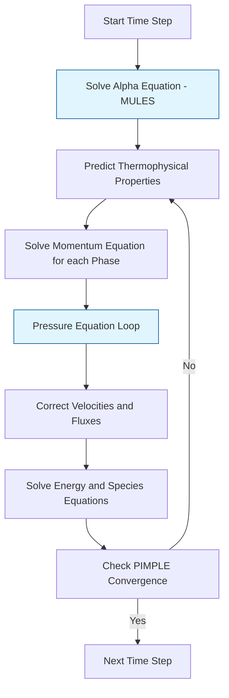

# Eulerian Multiphase Solvers in OpenFOAM

## 1. Introduction (บทนำ)

การจำลองการไหลแบบหลายเฟสโดยวิธี **Eulerian-Eulerian** (หรือที่เรียกว่าแบบจำลอง Two-fluid) จัดการแต่ละเฟสเป็นคอนติวนั่ม (Continuum) ที่แทรกซึมกันในพื้นที่เดียวกัน แต่ละเฟสมีชุดสมการการอนุรักษ์ (มวล โมเมนตัม และพลังงาน) ของตัวเอง และมีการแลกเปลี่ยนกันผ่านเทอมต้นทางที่อินเตอร์เฟซ

> [!INFO] **ข้อดีของแบบจำลอง Euler-Euler**
> - เหมาะสำหรับระบบที่มีความเข้มข้นของเฟสกระจายสูง ($\alpha_d > 0.1$)
> - หลีกเลี่ยงการติดตามอนุภาคแต่ละตัว (เช่นในวิธี Euler-Lagrange)
> - สามารถจำลองระบบขนาดอุตสาหกรรมได้

## 2. Governing Equations (สมการควบคุม)

สำหรับเฟส $k$ สมการควบคุมพื้นฐานประกอบด้วย:

### 2.1 Continuity Equation (สมการความต่อเนื่อง)

$$\frac{\partial}{\partial t}(\alpha_k \rho_k) + \nabla \cdot (\alpha_k \rho_k \mathbf{u}_k) = \sum_{p=1}^n (\dot{m}_{pk} - \dot{m}_{kp})$$

โดยที่:
- $\alpha_k$ = สัดส่วนปริมาตร (Volume Fraction)
- $\rho_k$ = ความหนาแน่นของเฟส $k$
- $\mathbf{u}_k$ = ความเร็วของเฟส $k$
- $\dot{m}_{pk}$ = อัตราการถ่ายโอนมวลจากเฟส $p$ ถึง $k$

**เงื่อนไขข้อจำกัด:**
$$\sum_{k=1}^n \alpha_k = 1$$

### 2.2 Momentum Equation (สมการโมเมนตัม)

$$\frac{\partial}{\partial t}(\alpha_k \rho_k \mathbf{u}_k) + \nabla \cdot (\alpha_k \rho_k \mathbf{u}_k \mathbf{u}_k) = -\alpha_k \nabla p + \nabla \cdot (\alpha_k \boldsymbol{\tau}_k) + \alpha_k \rho_k \mathbf{g} + \mathbf{M}_k$$

**ตัวแปรสำคัญ:**

| ตัวแปร | ความหมาย | หน่วย SI |
|-----------|-------------|-----------|
| $p$ | ความดันที่แชร์ร่วมกันระหว่างเฟส | Pa |
| $\boldsymbol{\tau}_k$ | เทนเซอร์ความเค้นของเฟส | N/m² |
| $\mathbf{g}$ | เวกเตอร์ความโน้มถ่วง | m/s² |
| $\mathbf{M}_k$ | แรงปฏิสัมพันธ์ระหว่างเฟส | N/m³ |

### 2.3 Energy Equation (สมการพลังงาน)

$$\frac{\partial}{\partial t}(\alpha_k \rho_k h_k) + \nabla \cdot (\alpha_k \rho_k \mathbf{u}_k h_k) = \alpha_k \frac{\partial p}{\partial t} + \nabla \cdot (\alpha_k k_k \nabla T_k) + \dot{q}_k + \dot{m}_k h_{k,\mathrm{int}}$$

**ตัวแปร:**
- $h_k$ = เอนทาลปีของเฟส $k$ (J/kg)
- $k_k$ = สัมประสิทธิ์การนำความร้อน (W/m·K)
- $T_k$ = อุณหภูมิของเฟส $k$ (K)
- $\dot{q}_k$ = การถ่ายเทความร้อนอินเตอร์เฟซ (W/m³)
- $\dot{m}_k$ = อัตราการถ่ายโอนมวลจากการเปลี่ยนสถานะ (kg/m³·s)

### 2.4 Species Transport Equation (สมการขนส่งสปีชีส์)

$$\frac{\partial}{\partial t}(\alpha_k \rho_k Y_{k,i}) + \nabla \cdot (\alpha_k \rho_k \mathbf{u}_k Y_{k,i}) = \nabla \cdot (\alpha_k \rho_k D_{k,i} \nabla Y_{k,i}) + R_{k,i}$$

**ตัวแปร:**
- $Y_{k,i}$ = เศษส่วนมวลของสปีชีส์ $i$ ในเฟส $k$
- $D_{k,i}$ = สัมประสิทธิ์การแพร่
- $R_{k,i}$ = อัตราการผลิตสุทธิจากปฏิกิริยาเคมี

## 3. Interfacial Forces (แรงอินเตอร์เฟซ)

### 3.1 Drag Force (แรงลาก)

แรงลากเป็นแรงอินเตอร์เฟซที่สำคัญที่สุดในระบบหลายเฟส:

$$\mathbf{M}_k^{\mathrm{drag}} = \frac{3}{4}C_D\frac{\alpha_k \alpha_p \rho_k}{d_p}|\mathbf{u}_p - \mathbf{u}_k|(\mathbf{u}_p - \mathbf{u}_k)$$

**แบบจำลองสัมประสิทธิ์การลาก $C_D$:**

| แบบจำลอง | สมการ | การใช้งานที่เหมาะสม |
|-------------|-----------|----------------------|
| **Schiller-Naumann** | $C_D = \frac{24}{Re_p}(1 + 0.15Re_p^{0.687})$ | การไหลเจือจาง |
| **Gidaspow** | ผสมผสาน Wen-Yu และ Ergun | เตียงลอย |
| **Ishii-Zuber** | ขึ้นอยู่กับรูปร่างฟอง | การไหลของฟอง |

### 3.2 Lift Force (แรงยก)

$$\mathbf{F}_L = C_L \rho_c \alpha_d (\mathbf{u}_c - \mathbf{u}_d) \times (\nabla \times \mathbf{u}_c)$$

สัมประสิทธิ์การยก $C_L$ ขึ้นอยู่กับ:
- Reynolds อนุภาค
- อัตราการเฉือน
- รูปร่างอนุภาค

### 3.3 Virtual Mass Force (แรงมวลเสมือน)

$$\mathbf{F}_{vm} = C_{vm} \rho_c \alpha_d \left(\frac{\mathrm{d}\mathbf{u}_d}{\mathrm{d}t} - \frac{\mathrm{d}\mathbf{u}_c}{\mathrm{d}t}\right)$$

โดยที่ $C_{vm} \approx 0.5$ สำหรับทรงกลม

### 3.4 Turbulent Dispersion Force (แรงกระจายแบบปั่นป่วน)

$$\mathbf{F}_{td} = -C_{td} \rho_c k_c \nabla \alpha_d$$

โดยที่ $k_c$ คือพลังงานจลน์ความปั่นป่วนของเฟสต่อเนื่อง

### 3.5 Wall Lubrication Force (แรงหล่อลื่นผนัง)

$$\mathbf{F}_{wl} = \frac{\alpha_d \rho_c}{d_p} \left[C_{w1} + C_{w2} \frac{d_p}{y_w}\right] \mathbf{u}_{rel} \cdot \mathbf{n}_w$$

## 4. Key Solver: `reactingTwoPhaseEulerFoam`

เป็น Solver ที่ทรงพลังที่สุดใน OpenFOAM สำหรับการไหลแบบสองเฟสที่เกี่ยวข้องกับการถ่ายเทความร้อนและปฏิกิริยาเคมี

### 4.1 Architecture (สถาปัตยกรรม)

Solver นี้ขยายกรอบงาน Euler-Euler พื้นฐานโดยรวม:

| ส่วนประกอบ | คำอธิบาย |
|--------------|----------|
| **Species Transport** | การขนส่งองค์ประกอบทางเคมีหลายชนิดในแต่ละเฟส |
| **Energy Coupling** | สมการพลังงานแยกแต่ละเฟสสำหรับการจำลองแบบไม่สมดุลอุณหภูมิ |
| **Phase Change** | แบบจำลองการเปลี่ยนสถานะ (Boiling, Condensation) |
| **Chemistry** | จลนศาสตร์ปฏิกิริยาเคมี |

### 4.2 Solution Algorithm (อัลกอริทึมการแก้ปัญหา)

OpenFOAM ใช้อัลกอริทึม **Phase-Coupled SIMPLE (PCS)** หรือ **PIMPLE** เพื่อจัดการการเชื่อมต่อที่แข็งแกร่งระหว่างความดันและความเร็วของทั้งสองเฟส


> **Figure 1:** แผนผังลำดับขั้นตอนการคำนวณของตัวแก้สมการการไหลหลายเฟสแบบยูเลอเรียน (Eulerian Multiphase Solver) แสดงการทำงานร่วมกันระหว่างการแก้สมการสัดส่วนปริมาตร (Alpha Equation) และการวนซ้ำของสมการความดันเพื่อรักษาความต่อเนื่องของมวลและพลังงานในทุกเฟส


**ขั้นตอนหลัก:**

1. แก้สมการสัดส่วนปริมาตร (Alpha Equation) โดยใช้ MULES
2. คำนวณคุณสมบัติทางเทอร์โมฟิสิกส์
3. แก้สมการโมเมนตัมสำหรับทุกเฟส (รวมแรงอินเตอร์เฟซแบบกึ่งโดยนัย)
4. แก้สมการความดันเพื่อรับประกันการอนุรักษ์มวลของส่วนผสม
5. แก้สมการพลังงานและสปีชีส์

## 5. Implementation Details (รายละเอียดการใช้งาน)

การกำหนดค่าสำหรับ Solver นี้มีความซับซ้อนและต้องการไฟล์หลายส่วน:

### 5.1 `phaseProperties`

กำหนดความสัมพันธ์ระหว่างเฟสและแรงปฏิสัมพันธ์:

```foam
phases (gas liquid);

gas
{
    transportModel  Newtonian;
    nu              1.5e-05;
    rho             1.2;
}

liquid
{
    transportModel  Newtonian;
    nu              1e-06;
    rho             1000;
}

phaseInteraction
{
    (gas in liquid)
    {
        dragModel       Gidaspow;
        liftModel       NoLift;
        virtualMassModel NoVirtualMass;
        wallLubricationModel NoWallLubrication;
        turbulentDispersionModel NoTurbulentDispersion;
    }
}
```

### 5.2 `thermophysicalProperties`

ต้องกำหนดแยกสำหรับแต่ละเฟสในโฟลเดอร์ `constant/phaseName/`:

```foam
thermoType
{
    type            heRhoThermo;
    mixture         multiComponentMixture;
    transport       sutherland;
    thermo          hConst;
    energy          sensibleEnthalpy;
    equationOfState perfectGas;
}

species
(
    O2
    N2
);

O2
{
    molWeight       32;
    Cp              920.5;
    Hf              0;
}

N2
{
    molWeight       28.0134;
    Cp              1041;
    Hf              0;
}
```

### 5.3 Solver Control Parameters

ใน `fvSolution`:

```foam
PIMPLE
{
    nCorrectors        3;
    nNonOrthogonalCorrectors 0;
    nAlphaCorr      2;
    nAlphaSubCycles 2;

    pRefCell        0;
    pRefValue       101325;

    momentumPredictor yes;

    rDeltaTSmoothingCoeff 0.1;
}

solvers
{
    p
    {
        solver          GAMG;
        tolerance       1e-7;
        relTol          0.01;
        smoother        GaussSeidel;
    }

    "(U|k|epsilon|omega)"
    {
        solver          smoothSolver;
        smoother        GaussSeidel;
        tolerance       1e-6;
        relTol          0.1;
    }

    "(Yi|H|h)"
    {
        solver          smoothSolver;
        smoother        GaussSeidel;
        tolerance       1e-6;
        relTol          0.1;
    }
}
```

ใน `fvSchemes`:

```foam
ddtSchemes
{
    default         Euler;
}

gradSchemes
{
    default         Gauss linear;
}

divSchemes
{
    default         none;

    div(phi,U)      Gauss limitedLinearV 1;
    div(phi,k)      Gauss limitedLinear 1;
    div(phi,epsilon) Gauss limitedLinear 1;
    div(phi,omega)  Gauss limitedLinear 1;

    div(phi,alpha)  Gauss vanLeer;
    div(phir,alpha) Gauss vanLeer;

    div(phi,Yi_h)   Gauss limitedLinear 1;
    div(phi,K)      Gauss limitedLinear 1;
}

laplacianSchemes
{
    default         Gauss linear corrected;
}

interpolationSchemes
{
    default         linear;
}

snGradSchemes
{
    default         corrected;
}
```

## 6. Closure Relations (ความสัมพันธ์การปิด)

แบบจำลอง Euler-Euler ต้องการ "การปิด" (Closure) สำหรับพจน์ที่ไม่ทราบค่า:

> [!WARNING] **ความสำคัญของ Closure Models**
> ความแม่นยำของการจำลองขึ้นอยู่กับความเหมาะสมของแบบจำลองปิดที่เลือกใช้

### 6.1 Interfacial Momentum Transfer

แบบจำลองแรงลาก แรงยก ฯลฯ:

| แรง | แบบจำลอง | ความสำคัญ |
|------|------------|----------|
| **Drag** | Schiller-Naumann, Gidaspow | ==สำคัญที่สุด== |
| **Lift** | Tomiyama, Legendre-Magnaudet | สำคัญในการไหลแบบ shear |
| **Virtual Mass** | Cvm = 0.5 | สำคัญในการเร่งความเร็วสูง |
| **Turbulent Dispersion** | Lopez de Bertodano, Burns | สำคัญในการไหลแบบปั่นป่วน |
| **Wall Lubrication** | Antal, Tomiyama | สำคัญใกล้ผนัง |

### 6.2 Granular Stress (สำหรับเฟสของแข็งหนาแน่น)

สำหรับเฟสของแข็งหนาแน่น (ทฤษฎีจลนศาสตร์ของการไหลแบบเม็ด - KTGF):

**Granular Temperature:**
$$\Theta_s = \frac{1}{3}\langle \mathbf{c}' \cdot \mathbf{c}' \rangle$$

**Solid Pressure:**
$$p_s = \alpha_s \rho_s \Theta_s \left[1 + 2g_0\alpha_s(1+e)\right]$$

**Radial Distribution Function:**
$$g_0 = \left[1 - \left(\frac{\alpha_s}{\alpha_{s,max}}\right)^{1/3}\right]^{-1}$$

**Solid Viscosity:**
$$\mu_s = \mu_{coll} + \mu_{kin}$$

โดยที่:
- $e$ = สัมประสิทธิ์การฟื้นตัว (0.9-0.99)
- $\alpha_{s,max}$ = สัดส่วนปริมาตรสูงสุด (~0.63)

### 6.3 Interfacial Heat Transfer

ความสัมพันธ์ Nusselt Number สำหรับการถ่ายเทความร้อนระหว่างเฟส:

$$\dot{q}_{12} = h_{12}A_{12}(T_1 - T_2)$$

| ระบบ | ความสัมพันธ์ Nusselt | ช่วงใช้งาน |
|------|-------------------------|-------------|
| แก๊ส-ของเหลว | $Nu = 2 + 0.6Re^{1/2}Pr^{1/3}$ | ฟองและหยด |
| ของแข็ง-แก๊ส | $Nu = 2 + 0.6Re^{0.5}Pr^{0.33}$ | อนุภาคในแก๊ส |
| ของแข็ง-ของเหลว | $Nu = 2 + 0.6Re^{0.5}Pr^{0.33}$ | เตียงลอย |

### 6.4 Turbulence Models

แบบจำลองความปั่นป่วนแยกแต่ละเฟสหรือแบบผสม:

**แบบจำลอง $k$-$\varepsilon$ แยกเฟส:**
$$\frac{\partial}{\partial t}(\alpha_k \rho_k \varepsilon_k) + \nabla \cdot (\alpha_k \rho_k \mathbf{u}_k \varepsilon_k) = \nabla \cdot \left(\alpha_k \frac{\mu_{t,k}}{\sigma_{\varepsilon}} \nabla \varepsilon_k\right) + S_{\varepsilon,k}$$

## 7. Advanced Topics (หัวข้อขั้นสูง)

### 7.1 Phase Change Modeling (การจำลองการเปลี่ยนสถานะ)

**แบบจำลอง Hertz-Knudsen:**
$$\dot{m}'' = \sqrt{\frac{M}{2\pi R T_{sat}}} \left(\frac{p_{sat}(T_l) - p_v}{\sqrt{T_l}} - \frac{p_v - p_{sat}(T_v)}{\sqrt{T_v}}\right)$$

**แบบจำลอง Schrage:**
$$\dot{m}'' = \frac{2\sigma}{2-\sigma} \sqrt{\frac{M}{2\pi R T_{sat}}} \left(p_{sat}(T_l) - p_v\right)$$

### 7.2 Population Balance Models (แบบจำลองสมดุลประชากร)

สำหรับระบบที่มีการกระจายขนาดของฟองหรืออนุภาค:

$$\frac{\partial n(R,t)}{\partial t} + \frac{\partial}{\partial R}\left[G(R) n(R,t)\right] = B(R,t) - D(R,t)$$

**Method of Moments (QMOM):**
$$m_k = \int_0^{\infty} R^k n(R) dR$$

### 7.3 Cavitation Models (แบบจำลองโพรงเปี่ยว)

**แบบจำลอง Schnerr-Sauer:**
$$\dot{m}'' = \frac{3\rho_l\rho_v}{\rho} \frac{\alpha_l\alpha_v}{R_b} \text{sign}(p_{sat} - p) \sqrt{\frac{2}{3}\frac{|p_{sat} - p|}{\rho_l}}$$

โดยที่รัศมีฟอง $R_b$ เกี่ยวข้องกับสัดส่วนปริมาตรไอ:
$$\alpha_v = \frac{4}{3}\pi n_b R_b^3$$

## 8. Best Practices (แนวทางปฏิบัติที่ดี)

### 8.1 Stability (ความเสถียร)

- **เริ่มต้นด้วยแบบจำลองที่ง่ายก่อน** (Isothermal, No reactions) แล้วค่อยเพิ่มความซับซ้อน
- **ใช้การค่อยๆ ปรับค่า** (gradual ramping) สำหรับเงื่อนไขขอบเขตที่ซับซ้อน
- **ตรวจสอบการอนุรักษ์มวล** ในแต่ละเฟสอย่างสม่ำเสมอ

### 8.2 Time Stepping (การกำหนดค่าเวลา)

- **ใช้การปรับ Time Step อัตโนมัติ** (Adjustable Time Step)
- จำกัด Max Co และ Max Alpha Co:

```foam
adjustTimeStep yes;

maxCo           0.5;
maxAlphaCo      0.5;
```

### 8.3 Convergence (การลู่เข้า)

- **การใช้ Relaxation Factors ที่เหมาะสม**:

```foam
relaxationFactors
{
    fields
    {
        p               0.3;
        rho             1;
    }
    equations
    {
        U               0.7;
        "(k|epsilon|omega)" 0.7;
    }
}
```

### 8.4 Mesh Quality (คุณภาพเมช)

| พารามิเตอร์ | ข้อกำหนด | วัตถุประสงค์ |
|-------------|-----------|-------------|
| **การปรับปรุง** | 10-15 cells ต่อเส้นผ่านศูนย์กลางของฟอง | แก้ปัญหาความโค้งของอินเตอร์เฟซ |
| **ตัวชี้วัดคุณภาพ** | ความตั้งฉาก < 45°, อัตราส่วนภาพ < 5, ความเบ้ < 0.8 | ความถูกต้องเชิงตัวเลข |
| **การรักษาชั้นขอบเขต** | ความหนา 1-3 cells ใกล้ผนัง | การทำนายความเค้นแรงเฉืองที่แม่นยำ |

### 8.5 Post-Processing

**การตรวจสอบความถูกต้อง:**
- ตรวจสอบการอนุรักษ์มวลโดยรวม
- ตรวจสอบสมการพลังงานรวม
- วิเคราะห์ distribution ของสัดส่วนเฟส
- เปรียบเทียบกับข้อมูลการทดลอง

## 9. Applications (การประยุกต์ใช้)

### 9.1 Industrial Applications

| แอปพลิเคชัน | เฟสหลัก | Solver ที่เหมาะสม |
|--------------|-----------|-------------------|
| **Fluidized Beds** | แก๊ส-ของแข็ง | reactingTwoPhaseEulerFoam |
| **Bubble Columns** | แก๊ส-ของเหลว | multiphaseEulerFoam |
| **Boiling** | ของเหลว-ไอ | reactingTwoPhaseEulerFoam |
| **Spray Combustion** | เชื้อเพลิง-อากาศ | reactingEulerFoam |

### 9.2 Case Studies

**Case 1: การเดือดในไมโครช่องทาง**
- ช่องทาง: $50 \mu m \times 50 \mu m \times 1 mm$
- ความร้อนจากผนังคงที่: $100 kW/m^2$
- อัตราความร้อนวิกฤต: $q''_{crit} \approx 1.2 MW/m^2$

**Case 2: เครื่องปฏิกรณ์เตียงลอย**
- อุณหภูมิ: $320°C$
- ความดัน: $15$ MPa
- สิ่งทรงกลม: อัลคาไทต์ขนาด $6$ mm

## 10. Troubleshooting (การแก้ปัญหา)

### 10.1 Common Problems

| ปัญหา | สาเหตุ | การแก้ไข |
|--------|----------|------------|
| **การไม่ลู่เข้า** | เงื่อนไขเริ่มต้นไม่ดี | ใช้การค่อยๆ ปรับค่า |
| **การสั่นของความดัน** | การจับอินเตอร์เฟซที่ไม่ดี | เพิ่ม compression factor |
| **ปัญหาความเร็วสูงเกินไป** | การเสียดสีมากเกินไป | ปรับความหนืดของอินเตอร์เฟซ |

### 10.2 Debugging Tips

1. **ตรวจสอบ scaling ของสมการ**
2. **ตรวจสอบ boundary conditions**
3. **วิเคราะห์ residuals**
4. **ตรวจสอบ mass balance**
5. **ใช้ plot และ probes สำหรับ monitoring**

---

## 11. References and Further Reading

1. **Ishii, M., & Hibiki, T.** (2011). *Thermo-Fluid Dynamics of Two-Phase Flow* (2nd ed.). Springer.
2. **Crowe, C. T., et al.** (2011). *Multiphase Flows with Droplets and Particles* (2nd ed.). CRC Press.
3. **Gidaspow, D.** (1994). *Multiphase Flow and Fluidization*. Academic Press.
4. **OpenFOAM User Guide** - Multiphase Flows Chapter
5. **OpenFOAM Programmer's Guide** - Phase System Models

---

> [!TIP] **Learning Path**
> หลังจากศึกษาเอกสารนี้ แนะนำให้:
> 1. ทำแบบฝึกหัด Tutorial: `multiphase/multiphaseEulerFoam/bubbleColumn`
> 2. ลองปรับเปลี่ยน drag models และเปรียบเทียบผลลัพธ์
> 3. ศึกษาการใช้งาน `reactingTwoPhaseEulerFoam` สำหรับระบบที่มีปฏิกิริยาเคมี
