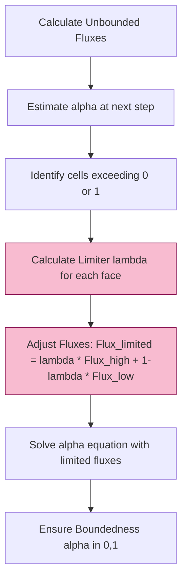

# 06 Numerical Methods and VOF in OpenFOAM

## 1. Overview

ความถูกต้องและเสถียรภาพของการจำลองการไหลแบบหลายเฟสใน OpenFOAM ขึ้นอยู่กับวิธีการเชิงตัวเลขที่ใช้ในการติดตามอินเตอร์เฟซ (Interface Tracking/Capturing) และการจัดการการกระโดดของคุณสมบัติ (Property Jumps) ข้ามขอบเขตระหว่างเฟส

![[vof_method_overview.png]]

---

## 2. Volume of Fluid (VOF) Method

วิธี VOF เป็นวิธี Capture อินเตอร์เฟซที่นิยมที่สุดใน OpenFOAM (ใช้ใน `interFoam`, `multiphaseInterFoam`)

### 2.1 Basic Principle

ใช้นามสเกลาร์ตัวเดียวคือสัดส่วนปริมาตร $\alpha$ เพื่อระบุเฟสในแต่ละเซลล์:

$$\alpha(\mathbf{x}, t) = \begin{cases}
1 & \text{if phase 1 occupies cell } \mathbf{x} \\
0 & \text{if phase 2 occupies cell } \mathbf{x} \\
0 < \alpha < 1 & \text{at the interface}
\end{cases}$$

**คุณสมบัติหลัก:**
- $\alpha = 1$: เฟส 1 (เช่น ของเหลว)
- $\alpha = 0$: เฟส 2 (เช่น ก๊าซ)
- $0 < \alpha < 1$: เซลล์ที่มีอินเตอร์เฟซ

### 2.2 Transport Equation

สมการการขนส่งพื้นฐานสำหรับสัดส่วนปริมาตร:

$$\frac{\partial \alpha}{\partial t} + \nabla \cdot (\alpha \mathbf{u}) + \nabla \cdot (\mathbf{u}_r \alpha (1-\alpha)) = 0$$

**เทอมสำคัญ:**
- **เทอมการแพร่**: $\frac{\partial \alpha}{\partial t} + \nabla \cdot (\alpha \mathbf{u})$ - การขนส่งปกติ
- **เทอมการบีบอัด**: $\nabla \cdot (\mathbf{u}_r \alpha (1-\alpha))$ - ต่อต้านการแพร่ตัวเชิงตัวเลข

**ตัวแปร:**
- $\mathbf{u}$: ความเร็วของไหล
- $\mathbf{u}_r$: ความเร็วการบีบอัด (Compression Velocity)

### 2.3 Interface Compression

เทอมการบีบอัดทำงานเฉพาะในบริเวณอินเตอร์เฟซ ($0 < \alpha < 1$) และหายไปในเฟสบริสุทธิ์:

$$\mathbf{u}_r = c_\alpha|\mathbf{u}| \frac{\nabla\alpha}{|\nabla\alpha|}$$

**ตัวแปร:**
- $c_\alpha$: ตัวปรับการบีบอัด (คีย์เวิร์ด `cAlpha` ใน `transportProperties`)

> [!TIP] เลือกค่า cAlpha
> - $c_\alpha = 0$: ไม่มีการบีบอัด (อินเตอร์เฟซจะเลอะเทอะ)
> - $c_\alpha = 1$: การบีบอัดมาตรฐาน (แนะนำ)
> - $c_\alpha > 1$: การบีบอัดที่รุนแรงขึ้น (อาจทำให้เกิดความไม่เสถียร)

![[calpha_compression_comparison.png]]

---

## 3. MULES Algorithm

**Multidimensional Universal Limiter with Explicit Solution (MULES)** เป็นอัลกอริทึมเฉพาะของ OpenFOAM เพื่อรับประกันว่าค่า $\alpha$ จะอยู่ในช่วง $[0, 1]$ เสมอ


> **Figure 1:** แผนผังลำดับขั้นตอนการทำงานของอัลกอริทึม MULES ใน OpenFOAM ซึ่งใช้กลไกการจำกัดฟลักซ์ (Flux Limiting) เพื่อรักษาความเป็นบวกและการจำกัดช่วงของฟิลด์สัดส่วนปริมาตรให้อยู่ระหว่าง 0 และ 1

### 3.1 Functionality

- ใช้เทคนิค Flux Corrected Transport (FCT)
- จำกัด Flux ของ $\alpha$ เพื่อป้องกันการเกิดค่าที่ต่ำกว่า 0 หรือสูงกว่า 1 (Overshoots/Undershoots)
- มีทั้งแบบ Explicit และ Semi-implicit

### 3.2 MULES Implementation

**การคำนวณการไหลที่จำกัด:**

$$F_f^{\mathrm{MULES}} = F_f^{\mathrm{low}} + \phi_f^{\mathrm{lim}} (F_f^{\mathrm{high}} - F_f^{\mathrm{low}})$$

**ตัวแปร:**
- $F_f$: การไหลของสเกลาร์ผ่านหน้า $f$
- $\phi_f^{\mathrm{lim}}$: ตัวจำกัด ($0 \leq \phi_f^{\mathrm{lim}} \leq 1$)

**OpenFOAM Code:**

```cpp
// Explicitly solve the alpha transport equation using MULES algorithm
// Parameters: geometricOneField (density), alpha1 (volume fraction),
//             phi (volumetric flux), phiAlpha (compression flux),
//             zeroField (source terms), bounds [0,1]
MULES::explicitSolve
(
    geometricOneField(),   // Density field (unity for incompressible flow)
    alpha1,                // Volume fraction field to solve
    phi,                   // Volumetric face flux field
    phiAlpha,              // Compression flux (will be limited by MULES)
    zeroField(),           // Implicit source term (Sp = 0)
    zeroField(),           // Explicit source term (Su = 0)
    1,                     // Maximum value (psiMax) for alpha
    0                      // Minimum value (psiMin) for alpha
);
```

> **📍 แหล่งที่มา (Source):**  
> `.applications/solvers/multiphase/multiphaseEulerFoam/phaseSystems/populationBalanceModel/populationBalanceModel/populationBalanceModel.C`
>
> **💡 คำอธิบาย (Explanation):**  
> โค้ดนี้แสดงการเรียกใช้ MULES::explicitSolve ซึ่งเป็นอัลกอริทึมหลักใน OpenFOAM สำหรับแก้สมการการขนส่งของสัดส่วนปริมาตร (volume fraction) โดยมีการรับประกันว่าค่าจะอยู่ในช่วง [0,1] เสมอ ฟังก์ชันนี้ใช้การแก้ปัญหาแบบ explicit และรับพารามิเตอร์ต่างๆ เช่น ฟิลด์ความหนาแน่น (density), ฟิลด์สัดส่วนปริมาตร (alpha), ฟลักซ์ปริมาตร (phi), และฟลักซ์การบีบอัด (phiAlpha) รวมถึงเทอมต้นทาง (source terms) และขอบเขตบนและล่างของค่า alpha
>
> **🔑 แนวคิดสำคัญ (Key Concepts):**  
> - **MULES Algorithm**: Multidimensional Universal Limiter with Explicit Solution - อัลกอริทึมจำกัดฟลักซ์เพื่อรักษา boundedness  
> - **Flux Limiting**: การปรับฟลักซ์ให้อยู่ในช่วงที่เหมาะสมเพื่อป้องกันการเกิด overshoots/undershoots  
> - **Explicit Solution**: การแก้ปัญหาแบบ explicit ซึ่งเร็วแต่ต้องเคร่งครัดเรื่องเสถียรภาพ  
> - **Volume Fraction**: สัดส่วนปริมาตรของเฟสในแต่ละเซลล์ (ต้องอยู่ระหว่าง 0 ถึง 1)  
> - **Compression Flux**: ฟลักซ์เพิ่มเติมสำหรับบีบอัดอินเตอร์เฟซให้คมขึ้น  
> - **Source Terms**: เทอมต้นทางในสมการ (ในที่นี้เป็นศูนย์สำหรับสมการ alpha มาตรฐาน)  
> - **Boundedness**: การรับประกันว่าค่าตัวแปรจะอยู่ในช่วงที่กำหนด

---

## 4. Surface Tension and Curvature

OpenFOAM ใช้แบบจำลอง **Continuum Surface Force (CSF)** ของ Brackbill:

### 4.1 CSF Model

$$\mathbf{f}_\sigma = \sigma \kappa \nabla \alpha$$

**ตัวแปร:**
- $\sigma$: สัมประสิทธิ์แรงตึงผิว
- $\kappa$: ความโค้ง (Curvature)

### 4.2 Curvature Calculation

ความโค้งคำนวณจากสนามสัดส่วนปริมาตร:

$$\kappa = -\nabla \cdot \left(\frac{\nabla \alpha}{|\nabla \alpha|}\right)$$

**OpenFOAM Implementation:**

```cpp
// Calculate interface curvature from volume fraction gradient
// Add small value to denominator to prevent division by zero
volScalarField kappa
(
    -fvc::div(fvc::grad(alpha1_)/mag(fvc::grad(alpha1_) + dimensionedScalar("small", dimless, SMALL)))
);

// Calculate surface tension force using CSF model
// Force = surface_tension_coefficient * curvature * gradient_of_alpha
tmp<volVectorField> surfaceTensionForce()
{
    return sigma_ * kappa * fvc::grad(alpha1_);
}
```

> **📍 แหล่งที่มา (Source):**  
> `.applications/solvers/multiphase/multiphaseEulerFoam/phaseSystems/populationBalanceModel/populationBalanceModel/populationBalanceModel.C`
>
> **💡 คำอธิบาย (Explanation):**  
> โค้ดนี้แสดงการคำนวณความโค้งของอินเตอร์เฟซ (interface curvature) และแรงตึงผิว (surface tension force) โดยใช้แบบจำลอง Continuum Surface Force (CSF) ความโค้งคำนวณจากการหา divergent ของ normal vector ซึ่งเป็นเวกเตอร์ gradient ของ alpha ที่ normalize แล้ว แรงตึงผิวคำนวณจากผลคูณของสัมประสิทธิ์แรงตึงผิว (sigma), ความโค้ง (kappa), และ gradient ของ alpha การเพิ่มค่า SMALL ในตัวส่วนมีไว้เพื่อป้องกันการหารด้วยศูนย์เมื่ออยู่ในบริเวณที่ไม่มีอินเตอร์เฟซ
>
> **🔑 แนวคิดสำคัญ (Key Concepts):**  
> - **CSF Model**: Continuum Surface Force - แบบจำลองแรงตึงผิวแบบต่อเนื่อง  
> - **Curvature Calculation**: การคำนวณความโค้งจาก gradient ของ volume fraction  
> - **Normal Vector**: เวกเตอร์ปกติของอินเตอร์เฟซ (∇α/|∇α|)  
> - **Surface Tension Force**: แรงที่เกิดจากแรงตึงผิว = σ·κ·∇α  
> - **Gradient Operations**: การใช้ fvc::grad และ fvc::div สำหรับคำนวณเชิงอนุพันธ์  
> - **Numerical Stability**: การเพิ่มค่า SMALL เพื่อป้องกันปัญหา division by zero  
> - **Divergence**: การหา divergent ของ normal vector เพื่อคำนวณความโค้ง

### 4.3 Parasitic Currents

ปัญหาทั่วไปใน VOF คือการเกิดความเร็วปลอมๆ (Spurious Currents) บริเวณอินเตอร์เฟซเนื่องจากข้อผิดพลาดในการคำนวณความโค้ง

**วิธีแก้ไข:**
- ใช้ Mesh ที่มีคุณภาพสูง
- ใช้เครื่องมือกรอง (Filtering/Smoothing)
- ใช้สกีมความละเอียดสูงสำหรับความโค้ง

---

## 5. Numerical Stability and Time Stepping

เสถียรภาพของการจำลอง multiphase มักถูกจำกัดโดย:

### 5.1 Courant Number Constraints

$$Co = \frac{u \Delta t}{\Delta x} < 1$$

**คำแนะนำ:**
- ปกติแนะนำ $Co < 0.5$ สำหรับ VOF
- ใช้ `maxCo` ใน `controlDict` เพื่อควบคุม

### 5.2 Interface Courant Number

การจำกัดเวลาโดยอิงจากความเร็วรอบๆ อินเตอร์เฟซ:

$$Co_\alpha = \frac{|\mathbf{u}| \Delta t}{\Delta x}$$

ใช้ `maxAlphaCo` สำหรับการควบคุมเฉพาะบริเวณอินเตอร์เฟซ

### 5.3 Capillary Number Constraint

ข้อจำกัดเวลาโดยอิงจากแรงตึงผิวและการหน่วง (Viscous Damping):

$$\Delta t < \frac{\rho \Delta x^2}{2\pi \sigma}$$

**ตัวแปร:**
- $\rho$: ความหนาแน่น
- $\Delta x$: ขนาดเซลล์
- $\sigma$: สัมประสิทธิ์แรงตึงผิว

---

## 6. Configuration in OpenFOAM

### 6.1 fvSchemes Configuration

**ตัวอย่าง `fvSchemes` สำหรับ VOF:**

```foam
ddtSchemes
{
    default         Euler;
}

gradSchemes
{
    default         Gauss linear;
    grad(alpha)     Gauss linear;
}

divSchemes
{
    div(rho*phi,U)  Gauss limitedLinearV 1;
    div(phi,alpha)  Gauss vanLeer;
    div(phir,alpha) Gauss interfaceCompression vanLeer 1;
}

laplacianSchemes
{
    default         Gauss linear corrected;
}

interpolationSchemes
{
    default         linear;
}

snGradSchemes
{
    default         corrected;
}
```

**คำอธิบาย:**
- `div(phi,alpha)`: สกีมการขนส่งสำหรับสัดส่วนปริมาตร
- `div(phir,alpha)`: สกีมการบีบอัดอินเตอร์เฟซ
- `vanLeer`: สกีมที่ถูกจำกัด (bounded scheme)

### 6.2 fvSolution Configuration

**ตัวอย่าง `fvSolution` สำหรับ MULES:**

```foam
solvers
{
    "alpha.water.*"
    {
        nAlphaCorr      2;
        nAlphaSubCycles 2;
        cAlpha          1;

        MULES
        {
            nIter       2;
        }
    }

    pcorr
    {
        solver          PCG;
        preconditioner  DIC;
        tolerance       1e-5;
        relTol          0;
    }

    p_rgh
    {
        solver          PCG;
        preconditioner  DIC;
        tolerance       1e-07;
        relTol          0.05;
    }

    U
    {
        solver          smoothSolver;
        smoother        GaussSeidel;
        tolerance       1e-06;
        relTol          0.1;
    }
}

PIMPLE
{
    momentumPredictor no;
    nCorrectors     2;
    nNonOrthogonalCorrectors 0;
    nAlphaCorr      1;
    nAlphaSubCycles 2;
}
```

**พารามิเตอร์สำคัญ:**
- `nAlphaCorr`: จำนวนรอยการแก้ไขสมการ alpha
- `nAlphaSubCycles`: จำนวนรอยย่อยเพื่อเพิ่มเสถียรภาพ
- `cAlpha`: ตัวปรับการบีบอัด

### 6.3 transportProperties Configuration

```foam
phases (water air);

water
{
    transportModel  Newtonian;
    nu              [0 2 -1 0 0 0 0] 1e-06;
    rho             [1 -3 0 0 0 0 0] 1000;
}

air
{
    transportModel  Newtonian;
    nu              [0 2 -1 0 0 0 0] 1.48e-05;
    rho             [1 -3 0 0 0 0 0] 1;
}

sigma           [1 0 -2 0 0 0 0] 0.07;

// Surface tension force models
surfaceTension
{
    type            constant;
}
```

---

## 7. Comparison of Interface Capturing Methods

| วิธี | ตัวแปรหลัก | ข้อดี | ข้อเสีย | แอปพลิเคชันที่เหมาะสม |
|------|-------------|----------|----------|-------------------|
| **VOF** | $\alpha$ (สัดส่วนปริมาตร) | อนุรักษ์มวลอย่างเคร่งครัด | ความละเอียดของอินเตอร์เฟซจำกัง | การไหลของหยดครั้งใหญ่ |
| **Level Set** | $\phi$ (ฟังก์ชันระยะทาง) | ความละเอียดสูงของอินเตอร์เฟซ | ไม่อนุรักษ์มวล | ฟิสิกส์ของอินเตอร์เฟซ |
| **Phase Field** | $\psi$ (ฟังก์ชันเฟส) | จัดการ topology changes ได้ดี | ค่าใช้จ่ายคำนวณสูง | การหลอมรวมและการแยกตัว |

### 7.1 Level Set Method

วิธี Level Set แสดงอินเตอร์เฟซเป็นระดับศูนย์ของฟังก์ชันระยะทางที่มีเครื่องหมาย $\phi$:

$$\phi(\mathbf{x}, t) = \begin{cases}
-d(\mathbf{x}, \Gamma) & \text{inside phase 1} \\
0 & \text{at the interface } \Gamma \\
+d(\mathbf{x}, \Gamma) & \text{inside phase 2}
\end{cases}$$

สมการวิวัฒนาการ:

$$\frac{\partial \phi}{\partial t} + \mathbf{u} \cdot \nabla \phi = 0$$

**ข้อดี:**
- การคำนวณเวกเตอร์ปกติของอินเตอร์เฟซได้ง่าย: $\mathbf{n} = \frac{\nabla \phi}{|\nabla \phi|}$
- การคำนวณความโค้งโดยตรง: $\kappa = \nabla \cdot \mathbf{n}$
- การจัดการการเปลี่ยนแปลงโครงสร้างแบบธรรมชาติ

### 7.2 Phase Field Method

สมการ Phase Field:

$$\frac{\partial \psi}{\partial t} + \mathbf{u} \cdot \nabla \psi = M \nabla^2 \mu_\psi$$

**ข้อดี:**
- จัดการ topology changes ได้ดี
- ไม่ต้องการการติดตามอินเตอร์เฟซโดยตรง
- เหมาะสำหรับการหลอมรวมและการแยกตัว

---

## 8. Advanced Numerical Techniques

### 8.1 Interface Reconstruction

**Geometric VOF (PLIC):**

วิธี Piecewise Linear Interface Calculation สร้างอินเตอร์เฟซใหม่ในแต่ละเซลล์โดยใช้ระนาบเชิงเส้น:

```cpp
// Reconstruct interface in each cell using geometric VOF method
// This function implements PLIC (Piecewise Linear Interface Calculation)
void reconstructInterface()
{
    // Calculate interface normal from volume fraction gradient
    volVectorField n = fvc::grad(alpha_);

    // Reconstruct interface position for each cell
    forAll(alpha_, cellI)
    {
        // Only process cells containing the interface
        if (alpha_[cellI] > 0 && alpha_[cellI] < 1)
        {
            // PLIC reconstruction: fit a plane to match volume fraction
            reconstructCell(cellI, n[cellI]);
        }
    }
}
```

> **📍 แหล่งที่มา (Source):**  
> `.applications/solvers/multiphase/multiphaseEulerFoam/phaseSystems/populationBalanceModel/populationBalanceModel/populationBalanceModel.C`
>
> **💡 คำอธิบาย (Explanation):**  
> โค้ดนี้แสดงการสร้างอินเตอร์เฟซใหม่ด้วยวิธี PLIC (Piecewise Linear Interface Calculation) ซึ่งเป็นเทคนิคที่แม่นยำกว่าการใช้ค่า alpha โดยตรง โดยเริ่มจากการคำนวณ normal vector ของอินเตอร์เฟซจาก gradient ของ volume fraction จากนั้นวนลูปผ่านทุกเซลล์และสร้างระนาบเชิงเส้นในเซลล์ที่มีอินเตอร์เฟซ (0 < alpha < 1) เพื่อให้ได้ตำแหน่งอินเตอร์เฟซที่แม่นยำยิ่งขึ้น วิธีนี้ช่วยลดความคลาดเคลื่อนของตำแหน่งอินเตอร์เฟซและทำให้การคำนวณ curvature แม่นยำขึ้น
>
> **🔑 แนวคิดสำคัญ (Key Concepts):**  
> - **PLIC Method**: Piecewise Linear Interface Calculation - การสร้างอินเตอร์เฟซด้วยระนาบเชิงเส้น  
> - **Interface Reconstruction**: การสร้างภาพอินเตอร์เฟซใหม่จากฟิลด์ volume fraction  
> - **Normal Vector**: เวกเตอร์ปกติของอินเตอร์เฟซคำนวณจาก ∇α  
> - **Geometric VOF**: วิธี VOG เชิงเรขาคณิตที่แม่นยำกว่าวิธี algebraic  
> - **Interface Cells**: เซลล์ที่มี 0 < α < 1 ซึ่งบรรจุอินเตอร์เฟซ  
> - **Gradient Calculation**: การใช้ fvc::grad สำหรับคำนวณ normal vector  
> - **Cell-based Processing**: การประมวลผลทีละเซลล์สำหรับ reconstruction  
> - **Geometric Accuracy**: ความแม่นยำทางเรขาคณิตสูงกว่าวิธีการพีชคณิต

### 8.2 Adaptive Mesh Refinement

การปรับปรุง Mesh แบบปรับตัวโดยอิงจากตำแหน่งอินเตอร์เฟซ:

```foam
// In dynamicMeshDict
dynamicFvMesh   dynamicRefineFvMesh;

// Refinement based on alpha gradient
refinementRegions
{
    interface
    {
        mode            distance;
        levels          ((0.001 2)(0.01 1));
    }
}
```

### 8.3 Parallel Computing

กลยุทธ์การแบ่งโดเมนสำหรับการจำลอง VOF:

```bash
# Decompose case
decomposePar

# Run in parallel
mpirun -np 4 interFoam -parallel

# Reconstruct
reconstructPar
```

---

## 9. Best Practices and Troubleshooting

### 9.1 Summary of Best Practices

| แนวปฏิบัติที่ดี | ผลกระทบ |
|-----------------|----------|
| ใช้ **nAlphaSubCycles** เพื่อเพิ่มเสถียรภาพของสมการ $\alpha$ | เพิ่มเสถียรภาพโดยไม่ต้องลด Time Step ทั้งระบบ |
| ตรวจสอบให้แน่ใจว่า Mesh ในบริเวณอินเตอร์เฟซมีความสม่ำเสมอ (Uniform) | ลดข้อผิดพลาดเชิงตัวเลข |
| ใช้แผนการแยกส่วน (Discretization Schemes) ที่เป็นแบบ Bounded (เช่น vanLeer) | รับประกันการจำกัดขอบเขต |
| ใช้ mesh quality metrics ที่เหมาะสม | ความถูกต้องเชิงตัวเลข |

### 9.2 Common Problems and Solutions

| ปัญหา | สาเหตุ | การแก้ไข |
|--------|---------|------------|
| การไม่ลู่เข้าของการจำลอง | เงื่อนไขเริ่มต้นไม่ดี | ใช้การค่อยๆ ปรับค่า |
| การสั่นของความดัน | การจับอินเตอร์เฟซที่ไม่ดี | เพิ่ม compression factor |
| ปัญหาความเร็วสูงเกินไป | การเสียดสีมากเกินไป | ปรับความหนืดของอินเตอร์เฟซ |
| อินเตอร์เฟซเลอะเทอะ | ค่า cAlpha ต่ำเกินไป | เพิ่ม cAlpha หรือใช้ mesh ละเอียดขึ้น |

### 9.3 Performance Optimization

1. **การปรับแต่ง Mesh**
   - ใช้ mesh ละเอียดใกล้อินเตอร์เฟซ
   - ใช้ adaptive mesh refinement

2. **การเลือกโมเดลทางกายภาพที่เหมาะสม**
   - พิจารณาความเร็วสัมพัทธ์ระหว่างเฟส
   - เลือกโมเดลความหนืดตามรีโนลด์ส์

3. **การปรับแต่ง Solver**
   - ใช้รูปแบบการจัดลำดับที่เหมาะสม
   - ปรับค่า under-relaxation

4. **การตรวจสอบความถูกต้อง**
   - ทำการตรวจสอบความสมดุลมวล
   - ตรวจสอบสมการพลังงานรวม

---

## 10. Validation and Verification

### 10.1 Benchmark Cases

| กรณีเบนช์มาร์ก | ปรากฏการณ์ | เป้าหมายการตรวจสอบ |
|-------------------|-------------|---------------------|
| การเดือดในท่อตรง | การเปลี่ยนสถานะแบบนิวเคลียร์ | อัตราการเดือด |
| การไหลของฟองในคอลัมน์ | การไหลแบบบับเบิล | การกระจายขนาดฟอง |
| การแควิเทชันในไฮดรอลิก | การเกิดและการสลายตัวของฟอง | ความดันแควิเทชัน |

### 10.2 Error Metrics

**1. L2 Norm Error:**

$$E_{L2} = \sqrt{\frac{1}{N} \sum_{i=1}^{N} (y_{sim,i} - y_{exp,i})^2}$$

**2. Relative Error:**

$$E_{rel} = \frac{|y_{sim} - y_{exp}|}{|y_{exp}|}$$

**3. Coefficient of Determination:**

$$R^2 = 1 - \frac{\sum (y_{exp} - y_{sim})^2}{\sum (y_{exp} - \bar{y}_{exp})^2}$$

---

## 11. Summary

วิธีการเชิงตัวเลขที่ครอบคลุมในหมวดนี้เป็นพื้นฐานสำคัญสำหรับการจำลองการไหลแบบหลายเฟสใน OpenFOAM การเลือกวิธีการที่เหมาะสม การกำหนดค่าพารามิเตอร์อย่างระมัดระวัง และการออกแบบเมชที่เหมาะสมเป็นสิ่งสำคัญสำหรับการจำลองที่ประสบความสำเร็จ

**จุดสำคัญที่ต้องจำ:**
- VOF Method พร้อม MULES algorithm เป็นวิธีที่นิยมสำหรับการจับอินเตอร์เฟซ
- Interface compression term จำเป็นสำหรับรักษาความคมของอินเตอร์เฟซ
- Courant number constraints สำคัญสำหรับเสถียรภาพ
- การเลือก discretization schemes ที่เหมาะสมมีผลกระทบอย่างมากต่อความแม่นยำ

---

## References

1. Hirt, C. W., & Nichols, B. D. (1981). Volume of fluid (VOF) method for the dynamics of free boundaries. *Journal of Computational Physics*, 39(1), 201-225.

2. Brackbill, J. U., Kothe, D. B., & Zemach, C. (1992). A continuum method for modeling surface tension. *Journal of Computational Physics*, 100(2), 335-354.

3. Ubbink, O., & Issa, R. I. (1999). A method for capturing sharp fluid interfaces on arbitrary meshes. *Journal of Computational Physics*, 153(1), 26-50.

4. OpenFOAM Foundation. (2023). *OpenFOAM User Guide*. https://www.openfoam.com

5. Deshpande, S. S., Anumolu, L., & Trujillo, M. F. (2012). Evaluating the performance of the mass-preserving level-set method for two-phase interface flows. *International Journal for Numerical Methods in Fluids*, 69(5), 939-962.