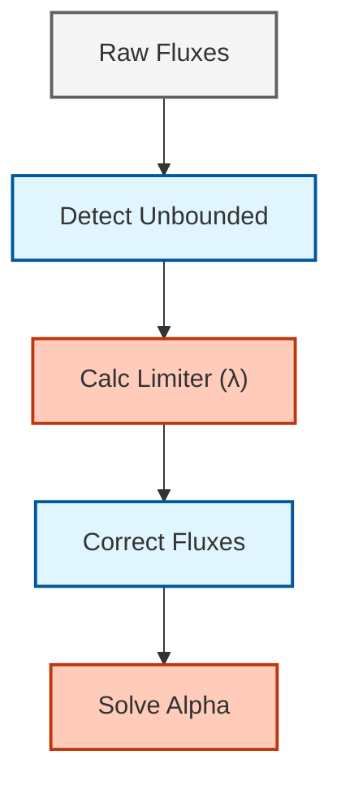

# 06 ระเบียบวิธีเชิงตัวเลขและ VOF ใน OpenFOAM (Numerical Methods and VOF in OpenFOAM)

## 1. ภาพรวม (Overview)

ความถูกต้องและเสถียรภาพของการจำลองการไหลแบบหลายเฟสใน OpenFOAM ขึ้นอยู่กับวิธีการเชิงตัวเลขที่ใช้ในการติดตามอินเตอร์เฟซ (Interface Tracking/Capturing) และการจัดการการกระโดดของคุณสมบัติ (Property Jumps) ข้ามขอบเขตระหว่างเฟส

![[vof_method_overview.png]]

---

## 2. วิธีวอลุ่มของของไหล (Volume of Fluid - VOF Method)

วิธี VOF เป็นวิธีจับภาพ (Capture) ส่วนต่อประสานที่นิยมที่สุดใน OpenFOAM (ใช้ในตัวแก้ปัญหาเช่น `interFoam`, `multiphaseInterFoam`)

### 2.1 หลักการพื้นฐาน (Basic Principle)

ใช้นามสเกลาร์ตัวเดียวคือสัดส่วนปริมาตร (Volume Fraction) $\alpha$ เพื่อระบุเฟสในแต่ละเซลล์:

$$\alpha(\mathbf{x}, t) = \begin{cases}
1 & \text{ถ้าเฟส 1 ครอบครองเซลล์ } \mathbf{x} \\
0 & \text{ถ้าเฟส 2 ครอบครองเซลล์ } \mathbf{x} \\
0 < \alpha < 1 & \text{ที่ส่วนต่อประสาน}
\end{cases}$$

**คุณสมบัติหลัก:**
- $\alpha = 1$: เฟส 1 (เช่น ของเหลว)
- $\alpha = 0$: เฟส 2 (เช่น ก๊าซ)
- $0 < \alpha < 1$: เซลล์ที่มีส่วนต่อประสาน

### 2.2 สมการการขนส่ง (Transport Equation)

สมการการขนส่งพื้นฐานสำหรับสัดส่วนปริมาตรคือ:

$$\frac{\partial \alpha}{\partial t} + \nabla \cdot (\alpha \mathbf{u}) + \nabla \cdot (\mathbf{u}_r \alpha (1-\alpha)) = 0$$

**เทอมสำคัญ:**
- **เทอมการพา (Convection Term)**: $\frac{\partial \alpha}{\partial t} + \nabla \cdot (\alpha \mathbf{u})$ - การขนส่งปกติ
- **เทอมการบีบอัด (Compression Term)**: $\nabla \cdot (\mathbf{u}_r \alpha (1-\alpha))$ - ทำหน้าที่ต่อต้านการแพร่กระจายเชิงตัวเลข (numerical diffusion)

**ตัวแปร:**
- $\mathbf{u}$: ความเร็วของไหล
- $\mathbf{u}_r$: ความเร็วการบีบอัด (Compression Velocity)

### 2.3 การบีบอัดส่วนต่อประสาน (Interface Compression)

เทอมการบีบอัดจะทำงานเฉพาะในบริเวณส่วนต่อประสาน ($0 < \alpha < 1$) และจะหายไปในบริเวณที่เป็นเฟสบริสุทธิ์:

$$\mathbf{u}_r = c_\alpha|\mathbf{u}| \frac{\nabla\alpha}{|\nabla\alpha|}$$

**ตัวแปร:**
- $c_\alpha$: ตัวปรับการบีบอัด (ใช้คีย์เวิร์ด `cAlpha` ในไฟล์ `transportProperties`)

> [!TIP] การเลือกค่า cAlpha
> - $c_\alpha = 0$: ไม่มีการบีบอัด (ส่วนต่อประสานจะแพร่กระจายและไม่คมชัด)
> - $c_\alpha = 1$: การบีบอัดมาตรฐาน (แนะนำสำหรับการใช้งานทั่วไป)
> - $c_\alpha > 1$: การบีบอัดที่รุนแรงขึ้น (อาจทำให้เกิดความไม่เสถียรเชิงตัวเลข)

![[calpha_compression_comparison.png]]

---

## 3. อัลกอริทึม MULES (MULES Algorithm)

**Multidimensional Universal Limiter with Explicit Solution (MULES)** เป็นอัลกอริทึมเฉพาะของ OpenFOAM เพื่อรับประกันว่าค่า $\alpha$ จะอยู่ในช่วง $[0, 1]$ เสมอ


> **รูปที่ 1:** แผนผังลำดับขั้นตอนการทำงานของอัลกอริทึม MULES ใน OpenFOAM ซึ่งใช้กลไกการจำกัดฟลักซ์ (Flux Limiting) เพื่อรักษาความเป็นบวกและการจำกัดช่วงของฟิลด์สัดส่วนปริมาตรให้อยู่ระหว่าง 0 และ 1

### 3.1 หน้าที่การทำงาน (Functionality)

- ใช้เทคนิคการขนส่งที่มีการปรับแก้ฟลักซ์ (Flux Corrected Transport - FCT)
- จำกัดฟลักซ์ของ $\alpha$ เพื่อป้องกันการเกิดค่าที่ต่ำกว่า 0 หรือสูงกว่า 1 (Overshoots/Undershoots)
- มีให้เลือกใช้ทั้งแบบชัดแจ้ง (Explicit) และแบบกึ่งโดยนัย (Semi-implicit)

### 3.2 การใช้งาน MULES (MULES Implementation)

**การคำนวณการไหลที่ถูกจำกัด:**

$$F_f^{\mathrm{MULES}} = F_f^{\mathrm{low}} + \phi_f^{\mathrm{lim}} (F_f^{\mathrm{high}} - F_f^{\mathrm{low}})$$

**ตัวแปร:**
- $F_f$: ฟลักซ์ของสเกลาร์ผ่านหน้าผิว $f$
- $\phi_f^{\mathrm{lim}}$: ตัวจำกัด (Limiter) ($0 \leq \phi_f^{\mathrm{lim}} \leq 1$)

**ตัวอย่างโค้ดใน OpenFOAM:**

```cpp
// แก้สมการการขนส่งของ alpha แบบชัดแจ้งโดยใช้อัลกอริทึม MULES
// พารามิเตอร์: geometricOneField (ความหนาแน่น), alpha1 (สัดส่วนปริมาตร),
//             phi (ฟลักซ์ปริมาตร), phiAlpha (ฟลักซ์การบีบอัด),
//             zeroField (เทอมแหล่งกำเนิด), ขอบเขต [0,1]
MULES::explicitSolve
(
    geometricOneField(),   // ฟิลด์ความหนาแน่น (เป็น 1 สำหรับการไหลที่อัดตัวไม่ได้)
    alpha1,                // ฟิลด์สัดส่วนปริมาตรที่จะหาคำตอบ
    phi,                   // ฟิลด์ฟลักซ์ปริมาตรที่หน้าผิว
    phiAlpha,              // ฟลักซ์การบีบอัด (จะถูกจำกัดโดย MULES)
    zeroField(),           // เทอมแหล่งกำเนิดโดยปริยาย (Sp = 0)
    zeroField(),           // เทอมแหล่งกำเนิดแบบชัดแจ้ง (Su = 0)
    1,                     // ค่าสูงสุด (psiMax) สำหรับ alpha
    0                      // ค่าต่ำสุด (psiMin) สำหรับ alpha
);
```

> **📍 แหล่งที่มา (Source):**  
> `.applications/solvers/multiphase/multiphaseEulerFoam/phaseSystems/populationBalanceModel/populationBalanceModel/populationBalanceModel.C`
>
> **💡 คำอธิบาย (Explanation):**  
> โค้ดนี้แสดงการเรียกใช้ MULES::explicitSolve ซึ่งเป็นอัลกอริทึมหลักใน OpenFOAM สำหรับแก้สมการการขนส่งของสัดส่วนปริมาตร (volume fraction) โดยมีการรับประกันว่าค่าจะอยู่ในช่วง [0,1] เสมอ ฟังก์ชันนี้ใช้การแก้ปัญหาแบบ explicit และรับพารามิเตอร์ต่างๆ เช่น ฟิลด์ความหนาแน่น (density), ฟิลด์สัดส่วนปริมาตร (alpha), ฟลักซ์ปริมาตร (phi), และฟลักซ์การบีบอัด (phiAlpha) รวมถึงเทอมต้นทาง (source terms) และขอบเขตบนและล่างของค่า alpha
>
> **🔑 แนวคิดสำคัญ (Key Concepts):**  
> - **MULES Algorithm**: Multidimensional Universal Limiter with Explicit Solution - อัลกอริทึมจำกัดฟลักซ์เพื่อรักษา boundedness  
> - **Flux Limiting**: การปรับฟลักซ์ให้อยู่ในช่วงที่เหมาะสมเพื่อป้องกันการเกิด overshoots/undershoots  
> - **Explicit Solution**: การแก้ปัญหาแบบ explicit ซึ่งเร็วแต่ต้องเคร่งครัดเรื่องเสถียรภาพ  
> - **Volume Fraction**: สัดส่วนปริมาตรของเฟสในแต่ละเซลล์ (ต้องอยู่ระหว่าง 0 ถึง 1)  
> - **Compression Flux**: ฟลักซ์เพิ่มเติมสำหรับบีบอัดอินเตอร์เฟซให้คมขึ้น  
> - **Source Terms**: เทอมต้นทางในสมการ (ในที่นี้เป็นศูนย์สำหรับสมการ alpha มาตรฐาน)  
> - **Boundedness**: การรับประกันว่าค่าตัวแปรจะอยู่ในช่วงที่กำหนด

---

## 4. แรงตึงผิวและความโค้ง (Surface Tension and Curvature)

OpenFOAM ใช้แบบจำลอง **แรงตึงผิวแบบต่อเนื่อง (Continuum Surface Force - CSF)** ของ Brackbill:

### 4.1 แบบจำลอง CSF (CSF Model)

$$\mathbf{f}_\sigma = \sigma \kappa \nabla \alpha$$

**ตัวแปร:**
- $\sigma$: สัมประสิทธิ์แรงตึงผิว
- $\kappa$: ความโค้ง (Curvature)

### 4.2 การคำนวณความโค้ง (Curvature Calculation)

ความโค้งคำนวณจากสนามของสัดส่วนปริมาตร:

$$\kappa = -\nabla \cdot \left(\frac{\nabla \alpha}{|\nabla \alpha|}\right)$$

**การใช้งานใน OpenFOAM (OpenFOAM Implementation):**

```cpp
// คำนวณความโค้งของส่วนต่อประสานจากเกรเดียนต์ของสัดส่วนปริมาตร
// เพิ่มค่าขนาดเล็กในตัวส่วนเพื่อป้องกันการหารด้วยศูนย์
volScalarField kappa
(
    -fvc::div(fvc::grad(alpha1_)/mag(fvc::grad(alpha1_) + dimensionedScalar("small", dimless, SMALL)))
);

// คำนวณแรงตึงผิวโดยใช้แบบจำลอง CSF
// แรง = สัมประสิทธิ์แรงตึงผิว * ความโค้ง * เกรเดียนต์ของ alpha
tmp<volVectorField> surfaceTensionForce()
{
    return sigma_ * kappa * fvc::grad(alpha1_);
}
```

> **📍 แหล่งที่มา (Source):**  
> `.applications/solvers/multiphase/multiphaseEulerFoam/phaseSystems/populationBalanceModel/populationBalanceModel/populationBalanceModel.C`
>
> **💡 คำอธิบาย (Explanation):**  
> โค้ดนี้แสดงการคำนวณความโค้งของอินเตอร์เฟซ (interface curvature) และแรงตึงผิว (surface tension force) โดยใช้แบบจำลอง Continuum Surface Force (CSF) ความโค้งคำนวณจากการหา divergent ของ normal vector ซึ่งเป็นเวกเตอร์ gradient ของ alpha ที่ normalize แล้ว แรงตึงผิวคำนวณจากผลคูณของสัมประสิทธิ์แรงตึงผิว (sigma), ความโค้ง (kappa), และ gradient ของ alpha การเพิ่มค่า SMALL ในตัวส่วนมีไว้เพื่อป้องกันการหารด้วยศูนย์เมื่ออยู่ในบริเวณที่ไม่มีอินเตอร์เฟซ
>
> **🔑 แนวคิดสำคัญ (Key Concepts):**  
> - **CSF Model**: Continuum Surface Force - แบบจำลองแรงตึงผิวแบบต่อเนื่อง  
> - **Curvature Calculation**: การคำนวณความโค้งจาก gradient ของ volume fraction  
> - **Normal Vector**: เวกเตอร์ปกติของอินเตอร์เฟซ (∇α/|∇α|)  
> - **Surface Tension Force**: แรงที่เกิดจากแรงตึงผิว = σ·κ·∇α  
> - **Gradient Operations**: การใช้ fvc::grad และ fvc::div สำหรับคำนวณเชิงอนุพันธ์  
> - **Numerical Stability**: การเพิ่มค่า SMALL เพื่อป้องกันปัญหา division by zero  
> - **Divergence**: การหา divergent ของ normal vector เพื่อคำนวณความโค้ง

### 4.3 กระแสเทียม (Parasitic Currents)

ปัญหาทั่วไปใน VOF คือการเกิดความเร็วที่ไม่มีอยู่จริงทางฟิสิกส์ (Spurious/Parasitic Currents) บริเวณส่วนต่อประสานเนื่องจากข้อผิดพลาดในการคำนวณความโค้ง

**วิธีแก้ไข:**
- ใช้เมช (Mesh) ที่มีคุณภาพสูง
- ใช้เครื่องมือกรองข้อมูล (Filtering/Smoothing)
- ใช้รูปแบบการแยกส่วนที่มีความละเอียดสูงสำหรับความโค้ง

---

## 5. ความเสถียรเชิงตัวเลขและการกำหนดค่าเวลา (Numerical Stability and Time Stepping)

เสถียรภาพของการจำลองแบบหลายเฟสมักถูกจำกัดโดยเงื่อนไขต่อไปนี้:

### 5.1 ข้อจำกัดของเลขคูแรนท์ (Courant Number Constraints)

$$Co = \frac{u \Delta t}{\Delta x} < 1$$

**คำแนะนำ:**
- ปกติแนะนำให้ใช้ $Co < 0.5$ สำหรับวิธี VOF
- ใช้พารามิเตอร์ `maxCo` ในไฟล์ `controlDict` เพื่อควบคุม

### 5.2 เลขคูแรนท์ที่ส่วนต่อประสาน (Interface Courant Number)

การจำกัดเวลาโดยอิงจากความเร็วรอบๆ ส่วนต่อประสาน:

$$Co_\alpha = \frac{|\mathbf{u}| \Delta t}{\Delta x}$$

ใช้พารามิเตอร์ `maxAlphaCo` สำหรับการควบคุมเฉพาะบริเวณส่วนต่อประสาน

### 5.3 ข้อจำกัดจากแรงตึงผิว (Capillary Number Constraint)

ข้อจำกัดเวลาโดยอิงจากแรงตึงผิวและการหน่วงเนื่องจากความหนืด (Viscous Damping):

$$\Delta t < \frac{\rho \Delta x^2}{2\pi \sigma}$$

**ตัวแปร:**
- $\rho$: ความหนาแน่น
- $\Delta x$: ขนาดเซลล์
- $\sigma$: สัมประสิทธิ์แรงตึงผิว

---

## 6. การกำหนดค่าใน OpenFOAM (Configuration in OpenFOAM)

### 6.1 การกำหนดค่าใน fvSchemes

**ตัวอย่างไฟล์ `fvSchemes` สำหรับวิธี VOF:**

```foam
ddtSchemes
{
    default         Euler;
}

gradSchemes
{
    default         Gauss linear;
    grad(alpha)     Gauss linear;
}

divSchemes
{
    div(rho*phi,U)  Gauss limitedLinearV 1;
    div(phi,alpha)  Gauss vanLeer;
    div(phir,alpha) Gauss interfaceCompression vanLeer 1;
}

laplacianSchemes
{
    default         Gauss linear corrected;
}

interpolationSchemes
{
    default         linear;
}

snGradSchemes
{
    default         corrected;
}
```

**คำอธิบาย:**
- `div(phi,alpha)`: รูปแบบการขนส่งสำหรับสัดส่วนปริมาตร
- `div(phir,alpha)`: รูปแบบการบีบอัดส่วนต่อประสาน
- `vanLeer`: รูปแบบที่มีขอบเขตจำกัด (bounded scheme) เพื่อป้องกันค่าเกินขอบเขต

### 6.2 การกำหนดค่าใน fvSolution

**ตัวอย่างไฟล์ `fvSolution` สำหรับอัลกอริทึม MULES:**

```foam
solvers
{
    "alpha.water.*"
    {
        nAlphaCorr      2;
        nAlphaSubCycles 2;
        cAlpha          1;

        MULES
        {
            nIter       2;
        }
    }

    pcorr
    {
        solver          PCG;
        preconditioner  DIC;
        tolerance       1e-5;
        relTol          0;
    }

    p_rgh
    {
        solver          PCG;
        preconditioner  DIC;
        tolerance       1e-07;
        relTol          0.05;
    }

    U
    {
        solver          smoothSolver;
        smoother        GaussSeidel;
        tolerance       1e-06;
        relTol          0.1;
    }
}

PIMPLE
{
    momentumPredictor no;
    nCorrectors     2;
    nNonOrthogonalCorrectors 0;
    nAlphaCorr      1;
    nAlphaSubCycles 2;
}
```

**พารามิเตอร์สำคัญ:**
- `nAlphaCorr`: จำนวนรอบการแก้ไขสมการ alpha
- `nAlphaSubCycles`: จำนวนรอบย่อย (sub-cycling) เพื่อเพิ่มเสถียรภาพ
- `cAlpha`: ตัวปรับการบีบอัด (Compression factor)

### 6.3 การกำหนดค่าใน transportProperties

```foam
phases (water air);

water
{
    transportModel  Newtonian;
    nu              [0 2 -1 0 0 0 0] 1e-06;
    rho             [1 -3 0 0 0 0 0] 1000;
}

air
{
    transportModel  Newtonian;
    nu              [0 2 -1 0 0 0 0] 1.48e-05;
    rho             [1 -3 0 0 0 0 0] 1;
}

sigma           [1 0 -2 0 0 0 0] 0.07;

// แบบจำลองแรงตึงผิว
surfaceTension
{
    type            constant;
}
```

---

## 7. การเปรียบเทียบวิธีการจับภาพส่วนต่อประสาน (Comparison of Interface Capturing Methods)

| วิธี | ตัวแปรหลัก | ข้อดี | ข้อเสีย | การประยุกต์ใช้ที่เหมาะสม |
|------|-------------|----------|----------|-------------------|
| **VOF** | $\alpha$ (สัดส่วนปริมาตร) | อนุรักษ์มวลอย่างเคร่งครัด | ความละเอียดของส่วนต่อประสานจำกัด | การไหลของหยด/ฟองขนาดใหญ่ |
| **Level Set** | $\phi$ (ฟังก์ชันระยะทาง) | ส่วนต่อประสานมีความละเอียดสูง | ไม่มีการอนุรักษ์มวล | ฟิสิกส์พื้นฐานของส่วนต่อประสาน |
| **Phase Field** | $\psi$ (ฟังก์ชันเฟส) | จัดการการเปลี่ยนโทโพโลยีได้ดี | ค่าใช้จ่ายในการคำนวณสูง | การหลอมรวมและการแยกตัวของเฟส |

### 7.1 วิธีเลเวลเซต (Level Set Method)

วิธี Level Set แสดงส่วนต่อประสานเป็นระดับศูนย์ของฟังก์ชันระยะทางที่มีเครื่องหมาย (signed distance function) $\phi$:

$$\phi(\mathbf{x}, t) = \begin{cases}
-d(\mathbf{x}, \Gamma) & \text{ภายในเฟส 1} \\
0 & \text{ที่ส่วนต่อประสาน } \Gamma \\
+d(\mathbf{x}, \Gamma) & \text{ภายในเฟส 2}
\end{cases}$$

สมการวิวัฒนาการคือ:

$$\frac{\partial \phi}{\partial t} + \mathbf{u} \cdot \nabla \phi = 0$$

**ข้อดี:**
- คำนวณเวกเตอร์แนวตั้งฉากของส่วนต่อประสานได้ง่าย: $\mathbf{n} = \frac{\nabla \phi}{|\nabla \phi|}$
- คำนวณความโค้งได้โดยตรง: $\kappa = \nabla \cdot \mathbf{n}$
- จัดการการเปลี่ยนแปลงโครงสร้างทางเรขาคณิตได้โดยธรรมชาติ

### 7.2 วิธีฟิลด์เฟส (Phase Field Method)

สมการ Phase Field คือ:

$$\frac{\partial \psi}{\partial t} + \mathbf{u} \cdot \nabla \psi = M \nabla^2 \mu_\psi$$

**ข้อดี:**
- จัดการการเปลี่ยนแปลงโทโพโลยี (Topology changes) ได้ดีเยี่ยม
- ไม่ต้องการการติดตามส่วนต่อประสานโดยตรง
- เหมาะสำหรับการจำลองการหลอมรวม (Coalescence) และการแยกตัว (Breakup)

---

## 8. เทคนิคเชิงตัวเลขขั้นสูง (Advanced Numerical Techniques)

### 8.1 การสร้างภาพส่วนต่อประสานใหม่ (Interface Reconstruction)

**วิธี VOF เชิงเรขาคณิต (Geometric VOF - PLIC):**

วิธี Piecewise Linear Interface Calculation สร้างส่วนต่อประสานใหม่ในแต่ละเซลล์โดยใช้ระนาบเชิงเส้น:

```cpp
// สร้างส่วนต่อประสานใหม่ในแต่ละเซลล์โดยใช้วิธี VOF เชิงเรขาคณิต
// ฟังก์ชันนี้ใช้งานวิธี PLIC (Piecewise Linear Interface Calculation)
void reconstructInterface()
{
    // คำนวณเวกเตอร์แนวตั้งฉากจากเกรเดียนต์ของสัดส่วนปริมาตร
    volVectorField n = fvc::grad(alpha_);

    // สร้างตำแหน่งส่วนต่อประสานใหม่สำหรับแต่ละเซลล์
    forAll(alpha_, cellI)
    {
        // ประมวลผลเฉพาะเซลล์ที่มีส่วนต่อประสานอยู่ภายใน
        if (alpha_[cellI] > 0 && alpha_[cellI] < 1)
        {
            // การสร้างใหม่แบบ PLIC: ปรับระนาบให้ตรงกับสัดส่วนปริมาตร
            reconstructCell(cellI, n[cellI]);
        }
    }
}
```

> **📍 แหล่งที่มา (Source):**  
> `.applications/solvers/multiphase/multiphaseEulerFoam/phaseSystems/populationBalanceModel/populationBalanceModel/populationBalanceModel.C`
>
> **💡 คำอธิบาย (Explanation):**  
> โค้ดนี้แสดงการสร้างอินเตอร์เฟซใหม่ด้วยวิธี PLIC (Piecewise Linear Interface Calculation) ซึ่งเป็นเทคนิคที่แม่นยำกว่าการใช้ค่า alpha โดยตรง โดยเริ่มจากการคำนวณ normal vector ของอินเตอร์เฟซจาก gradient ของ volume fraction จากนั้นวนลูปผ่านทุกเซลล์และสร้างระนาบเชิงเส้นในเซลล์ที่มีอินเตอร์เฟซ (0 < alpha < 1) เพื่อให้ได้ตำแหน่งอินเตอร์เฟซที่แม่นยำยิ่งขึ้น วิธีนี้ช่วยลดความคลาดเคลื่อนของตำแหน่งอินเตอร์เฟซและทำให้การคำนวณ curvature แม่นยำขึ้น
>
> **🔑 แนวคิดสำคัญ (Key Concepts):**  
> - **PLIC Method**: Piecewise Linear Interface Calculation - การสร้างอินเตอร์เฟซด้วยระนาบเชิงเส้น  
> - **Interface Reconstruction**: การสร้างภาพอินเตอร์เฟซใหม่จากฟิลด์ volume fraction  
> - **Normal Vector**: เวกเตอร์ปกติของอินเตอร์เฟซคำนวณจาก ∇α  
> - **Geometric VOF**: วิธี VOG เชิงเรขาคณิตที่แม่นยำกว่าวิธี algebraic  
> - **Interface Cells**: เซลล์ที่มี 0 < α < 1 ซึ่งบรรจุอินเตอร์เฟซ  
> - **Gradient Calculation**: การใช้ fvc::grad สำหรับคำนวณ normal vector  
> - **Cell-based Processing**: การประมวลผลทีละเซลล์สำหรับ reconstruction  
> - **Geometric Accuracy**: ความแม่นยำทางเรขาคณิตสูงกว่าวิธีการพีชคณิต

### 8.2 การปรับปรุงเมชแบบปรับตัว (Adaptive Mesh Refinement)

การปรับปรุงความละเอียดของเมชโดยอัตโนมัติอ้างอิงจากตำแหน่งของส่วนต่อประสาน:

```foam
// ในไฟล์ dynamicMeshDict
dynamicFvMesh   dynamicRefineFvMesh;

// การปรับปรุงเมชตามเกรเดียนต์ของ alpha
refinementRegions
{
    interface
    {
        mode            distance;
        levels          ((0.001 2)(0.01 1));
    }
}
```

### 8.3 การคำนวณแบบขนาน (Parallel Computing)

กลยุทธ์การแบ่งโดเมนสำหรับการจำลองแบบ VOF:

```bash
# แยกกรณีศึกษา (Decompose)
decomposePar

# รันการคำนวณแบบขนาน
mpirun -np 4 interFoam -parallel

# ประกอบข้อมูลกลับคืน (Reconstruct)
reconstructPar
```

---

## 9. แนวทางปฏิบัติที่ดีที่สุดและการแก้ไขปัญหา (Best Practices and Troubleshooting)

### 9.1 สรุปแนวทางปฏิบัติที่ดีที่สุด

| แนวปฏิบัติที่ดี | ผลกระทบ |
|-----------------|----------|
| ใช้ **nAlphaSubCycles** เพื่อเพิ่มเสถียรภาพของสมการ $\alpha$ | ช่วยเพิ่มเสถียรภาพโดยไม่ต้องลดขนาดช่วงเวลา (Time Step) ทั้งระบบ |
| รับประกันว่าเมชในบริเวณส่วนต่อประสานมีความสม่ำเสมอ (Uniform) | ช่วยลดข้อผิดพลาดเชิงตัวเลขที่เกิดจากการคำนวณความโค้ง |
| ใช้รูปแบบการแยกส่วน (Discretization Schemes) ที่เป็นแบบจำกัดช่วง (เช่น vanLeer) | รับประกันว่าค่าจะคงอยู่ในช่วง [0, 1] ที่ถูกต้องทางกายภาพ |
| ใช้ตัวชี้วัดคุณภาพเมช (mesh quality metrics) ที่เหมาะสม | เพื่อความถูกต้องและแม่นยำเชิงตัวเลข |

### 9.2 ปัญหาทั่วไปและวิธีแก้ไข

| ปัญหา | สาเหตุ | วิธีแก้ไข |
|--------|---------|------------|
| การจำลองไม่ลู่เข้าหาคำตอบ | เงื่อนไขเริ่มต้นไม่เหมาะสม | ใช้เทคนิคการค่อยๆ ปรับเพิ่มค่าเงื่อนไขขอบเขต (Gradual ramping) |
| ความดันเกิดการแกว่งกวัด | การจับภาพส่วนต่อประสานทำได้ไม่ดีพอ | เพิ่มปัจจัยการบีบอัด (Compression factor) |
| ความเร็วไหลสูงเกินความเป็นจริง | แรงเสียดทานที่ส่วนต่อประสานมากเกินไป | ปรับแต่งค่าความหนืดที่ส่วนต่อประสาน |
| ส่วนต่อประสานพร่ามัวหรือไม่คมชัด | ค่า cAlpha ต่ำเกินไป | เพิ่มค่า cAlpha หรือเพิ่มความละเอียดของเมช |

### 9.3 การเพิ่มประสิทธิภาพการคำนวณ (Performance Optimization)

1. **การปรับแต่งเมช (Mesh Optimization)**
   - ใช้เมชละเอียดเฉพาะบริเวณส่วนต่อประสาน
   - ใช้เทคนิคการปรับปรุงเมชแบบปรับตัว (Adaptive mesh refinement)

2. **การเลือกแบบจำลองทางกายภาพที่เหมาะสม**
   - พิจารณาความเร็วสัมพัทธ์ระหว่างเฟสอย่างรอบคอบ
   - เลือกแบบจำลองความหนืดให้สอดคล้องกับเลขเรย์โนลด์ส (Reynolds number)

3. **การปรับแต่งตัวแก้ปัญหา (Solver Tuning)**
   - เลือกรูปแบบการจัดลำดับการคำนวณที่เหมาะสม
   - ปรับค่าปัจจัยการผ่อนคลาย (Under-relaxation) ให้สมดุลระหว่างความเร็วและเสถียรภาพ

4. **การตรวจสอบความถูกต้อง**
   - ทำการตรวจสอบสมดุลมวลอย่างสม่ำเสมอ
   - ตรวจสอบความถูกต้องของสมการพลังงานรวม

---

## 10. การรับรองความถูกต้องและการตรวจสอบ (Validation and Verification)

### 10.1 กรณีศึกษาเกณฑ์มาตรฐาน (Benchmark Cases)

| กรณีเกณฑ์มาตรฐาน | ปรากฏการณ์ที่จำลอง | เป้าหมายการตรวจสอบ |
|-------------------|-------------|---------------------|
| การเดือดในท่อตรง | การเปลี่ยนสถานะแบบนิวเคลียส | อัตราการเดือด |
| การไหลของฟองในคอลัมน์ | การไหลแบบฟอง (Bubbly flow) | การกระจายขนาดของฟอง |
| การเกิดโพรงไอในระบบไฮดรอลิก | การเกิดและการสลายตัวของฟองไอ | ความดันวิกฤตของการเกิดโพรงไอ |

### 10.2 ตัวชี้วัดข้อผิดพลาด (Error Metrics)

**1. ข้อผิดพลาดแบบ L2 Norm (L2 Norm Error):**

$$E_{L2} = \sqrt{\frac{1}{N} \sum_{i=1}^{N} (y_{sim,i} - y_{exp,i})^2}$$

**2. ข้อผิดพลาดสัมพัทธ์ (Relative Error):**

$$E_{rel} = \frac{|y_{sim} - y_{exp}|}{|y_{exp}|}$$

**3. สัมประสิทธิ์การตัดสินใจ (Coefficient of Determination):**

$$R^2 = 1 - \frac{\sum (y_{exp} - y_{sim})^2}{\sum (y_{exp} - \bar{y}_{exp})^2}$$

---

## 11. สรุป (Summary)

วิธีการเชิงตัวเลขที่ครอบคลุมในโมดูลนี้เป็นพื้นฐานสำคัญสำหรับการจำลองการไหลแบบหลายเฟสใน OpenFOAM การเลือกวิธีการที่เหมาะสม การกำหนดค่าพารามิเตอร์อย่างระมัดระวัง และการออกแบบเมชที่เหมาะสมเป็นสิ่งสำคัญที่จะนำไปสู่ความสำเร็จในการจำลอง

**จุดสำคัญที่ต้องจดจำ:**
- วิธี VOF พร้อมอัลกอริทึม MULES เป็นวิธีมาตรฐานสำหรับการจับภาพส่วนต่อประสาน
- เทอมการบีบอัดส่วนต่อประสาน (Interface compression) มีความจำเป็นสำหรับการรักษาความคมชัด
- ข้อจำกัดของเลขคูแรนท์ (Courant number) มีความสำคัญอย่างยิ่งต่อเสถียรภาพการคำนวณ
- การเลือกรูปแบบการแยกส่วน (Discretization schemes) ที่เหมาะสมส่งผลกระทบอย่างมากต่อความแม่นยำของผลลัพธ์

---

## เอกสารอ้างอิง (References)

1. Hirt, C. W., & Nichols, B. D. (1981). Volume of fluid (VOF) method for the dynamics of free boundaries. *Journal of Computational Physics*, 39(1), 201-225.

2. Brackbill, J. U., Kothe, D. B., & Zemach, C. (1992). A continuum method for modeling surface tension. *Journal of Computational Physics*, 100(2), 335-354.

3. Ubbink, O., & Issa, R. I. (1999). A method for capturing sharp fluid interfaces on arbitrary meshes. *Journal of Computational Physics*, 153(1), 26-50.

4. OpenFOAM Foundation. (2023). *OpenFOAM User Guide*. https://www.openfoam.com

5. Deshpande, S. S., Anumolu, L., & Trujillo, M. F. (2012). Evaluating the performance of the mass-preserving level-set method for two-phase interface flows. *International Journal for Numerical Methods in Fluids*, 69(5), 939-962.
