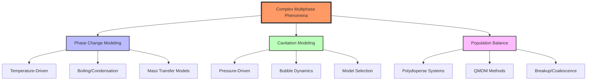
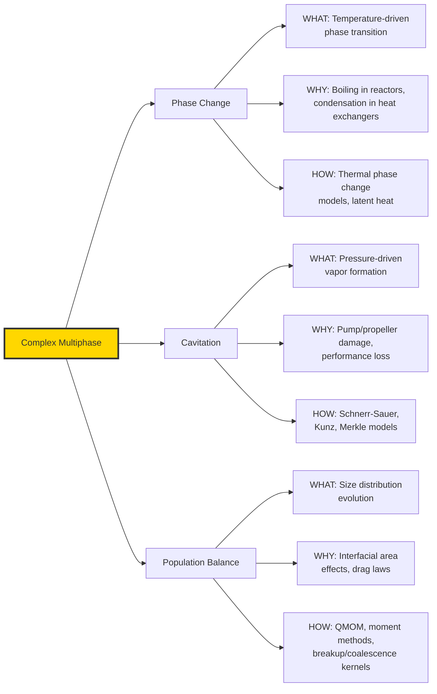
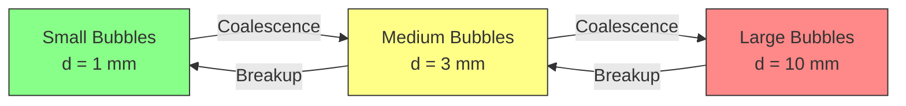
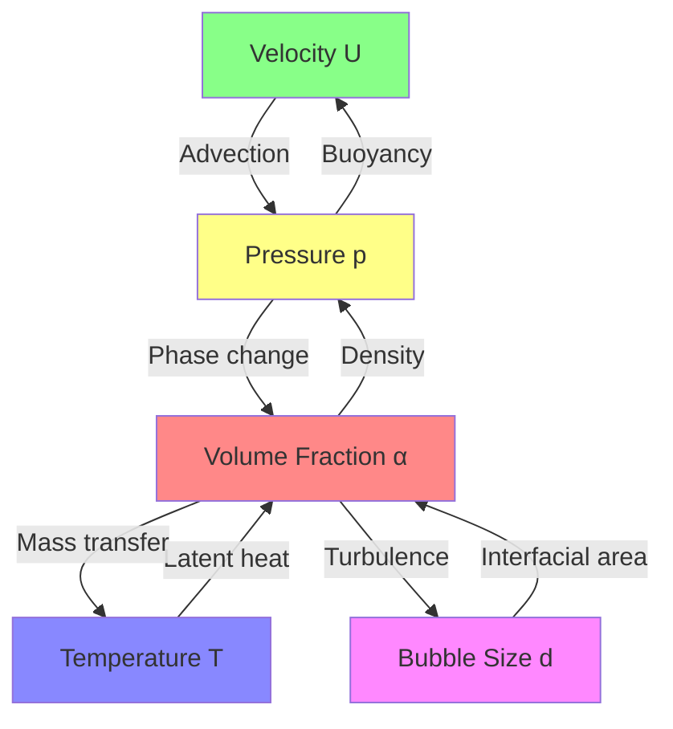

# 🌊 01: Complex Multiphase Phenomena (ปรากฏการณ์หลายเฟสที่ซับซ้อน)

**Difficulty**: Advanced | **Key Solvers**: `reactingTwoPhaseEulerFoam`, `multiphaseEulerFoam`, `interPhaseChangeFoam`

---

## 📚 Prerequisites (ความรู้พื้นฐานที่ต้องมี)

Before diving into this module, you should be comfortable with:

### Required Knowledge
- **MODULE 04: Multiphase Fundamentals** — Understanding of VOF method, Euler-Euler approach, and basic interfacial forces
- **Basic Thermodynamics** — Concepts of saturation pressure, latent heat, and phase equilibrium
- **Turbulence Modeling** — RANS/LES approaches for multiphase flows
- **OpenFOAM Basics** — Case structure, boundary conditions, and solver selection

### Key Skills to Review
- Setting up multiphase cases in OpenFOAM
- Understanding pressure-velocity coupling (PIMPLE algorithm)
- Mesh quality requirements for interface capturing

> **🎯 Self-Assessment**: Can you explain the difference between VOF and Euler-Euler methods? If not, review MODULE 04 before proceeding.

---

## 🎯 Learning Objectives (วัตถุประสงค์การเรียนรู้)

By the end of this module, you will be able to:

### WHAT (Define and Identify)
1. **Identify Complex Multiphase Phenomena** — Distinguish between simple two-phase flows and complex phenomena involving mass transfer, phase change, and polydisperse systems
2. **Classify Phase Change Mechanisms** — Differentiate between temperature-driven (boiling/condensation) and pressure-driven (cavitation) phase change
3. **Define Population Balance** — Understand when PBE is necessary versus constant-diameter assumptions

### WHY (Engineering Significance)
4. **Select Appropriate Models** — Choose the right cavitation, phase change, or population balance model based on:
   - Physical regime (pressure vs temperature driven)
   - Computational constraints
   - Required accuracy
   - Timescales of interest
5. **Predict Industrial Problems** — Anticipate cavitation damage, boiling crises, or bubble size effects in equipment design

### HOW (Implementation in OpenFOAM)
6. **Configure Phase Change Models** — Set up thermal phase change with proper latent heat and mass transfer coefficients
7. **Implement Cavitation Models** — Configure Schnerr-Sauer, Kunz, or Merkle models with appropriate parameters
8. **Solve Population Balance Equations** — Implement QMOM methods for polydisperse systems
9. **Troubleshoot Convergence Issues** — Identify and resolve common numerical instabilities in coupled physics simulations

---

## 🔬 Module Roadmap (แผนผังการเรียนรู้)



### Content Overview

| Section | Focus | Key Solvers | Complexity |
|---------|-------|-------------|------------|
| **01 - Phase Change** | Temperature-driven phase change, boiling, condensation | `reactingTwoPhaseEulerFoam`, `interCondensatingEvaporatingFoam` | ⭐⭐⭐ |
| **02 - Cavitation** | Pressure-driven phase change in high-speed flows | `interPhaseChangeFoam`, `multiphaseEulerFoam` | ⭐⭐⭐⭐ |
| **03 - Population Balance** | Polydisperse bubble/droplet systems | `multiphaseEulerFoam` + PBE | ⭐⭐⭐⭐⭐ |

---

## 💡 Key Concepts: Beyond Simple Multiphase Flow

### From MODULE 04 to MODULE 06: The Complexity Leap

In MODULE 04 (Multiphase Fundamentals), we learned:
- **Two immiscible phases** (e.g., water and air at room temperature)
- **No mass transfer** between phases
- **Constant phase properties** (density, viscosity)

In THIS module, we add complexity:

| Aspect | MODULE 04 (Simple) | MODULE 06 (Complex) |
|--------|-------------------|---------------------|
| **Phases** | 2, immiscible | 2+, with mass transfer |
| **Properties** | Constant | Variable (ρ, μ change with T, p) |
| **Equations** | Continuity + Momentum | + Energy + Species + PBE |
| **Coupling** | One-way | Two-way, strong coupling |
| **Timescales** | Single | Multiple (fast phase change, slow transport) |

### The Three Pillars of Complex Multiphase



---

## 🔥 Phenomenon 1: Phase Change (การเปลี่ยนสถานะ)

### WHAT: Definition and Types

**Phase change** is the transition of matter between liquid, vapor, and solid states, accompanied by:
- **Latent heat absorption/release** ($h_{lv}$ for liquid-vapor)
- **Density jumps** (ρ_water ≈ 1000 kg/m³, ρ_steam ≈ 0.6 kg/m³)
- **Mass transfer** across interfaces

| Type | Driving Force | Direction | Example |
|------|---------------|-----------|---------|
| **Boiling** | $T > T_{sat}$ | Liquid → Vapor | Water boiling at 100°C |
| **Condensation** | $T < T_{sat}$ | Vapor → Liquid | Steam condensing on cold surface |
| **Evaporation** | Concentration gradient | Liquid → Vapor (surface only) | Water evaporating at room temperature |
| **Solidification** | $T < T_{melting}$ | Liquid → Solid | Metal casting, ice formation |

### WHY: Engineering Importance

**Why do we care about phase change in CFD?**

1. **Heat Transfer Enhancement** — Boiling can achieve heat transfer coefficients 10-100× higher than single-phase convection
   - **Design Impact**: Nuclear reactor cooling, electronics thermal management, refrigeration systems
   - **Risk**: Boiling crisis (critical heat flux) can cause system failure

2. **Phase Distribution Matters** — The volume fraction of each phase affects:
   - Density and viscosity of the mixture
   - Flow patterns (bubbly, slug, churn, annular)
   - Heat and mass transfer rates

3. **Pressure Drop** — Phase change affects pressure drop in pipes and equipment
   - Two-phase multipliers increase pressure drop beyond single-phase predictions
   - Critical for pump sizing and system design

> **💡 Decision Criteria**: When to include phase change modeling?
> - **YES**: Boiling/condensation heat exchangers, reactors, cryogenics, cooling systems
> - **NO**: Adiabatic gas-liquid flows (e.g., oil-gas pipelines at constant T)

### HOW: OpenFOAM Implementation Overview

**Governing Equation Structure**:

```cpp
// Mass transfer source term in phase continuity equation
// For phase α (liquid) and phase β (vapor):
∂(αₗρₗ)/∂t + ∇·(αₗρₗU) = -ṁ'''    // Liquid loss by evaporation
∂(αᵥρᵥ)/∂t + ∇·(αᵥρᵥU) = +ṁ'''    // Vapor gain by evaporation

where ṁ''' = mass transfer rate per unit volume [kg/(m³·s)]
```

**Key Implementation Components**:

```cpp
// 1. Phase change model selection in constant/phaseProperties
phaseChangeModel thermalPhaseChange;  // OR Lee, HertzKnudsen

thermalPhaseChangeCoeffs
{
    hLv     2.26e6;      // Latent heat of vaporization [J/kg]
    Tsat    373.15;      // Saturation temperature [K]
    r       100;         // Mass transfer coefficient [1/s]
}

// 2. Energy equation coupling (automatic in reactingTwoPhaseEulerFoam)
// T field drives phase change through (T - Tsat)

// 3. Thermophysical properties must include:
// - Specific heat (Cp) for both phases
// - Thermal conductivity (k)
// - Latent heat (hLv)
```

**Solver Selection Guide**:

| Solver | When to Use | Key Features |
|--------|-------------|--------------|
| `interCondensatingEvaporatingFoam` | VOF method, sharp interface | Volume tracking, thermal phase change |
| `reactingTwoPhaseEulerFoam` | Euler-Euler, dispersed phase | Heat transfer, reactions, phase change |
| `multiphaseEulerFoam` | 3+ phases with phase change | Polydisperse, general multiphase |

> **📖 Detailed Implementation**: See [01_Phase_Change_Modeling.md](01_Phase_Change_Modeling.md) for complete setup procedures, boundary conditions, and troubleshooting.

---

## 🌪️ Phenomenon 2: Cavitation (การเกิดโพรงอากาศ)

### WHAT: Definition and Mechanism

**Cavitation** is the formation of vapor cavities in a liquid when local pressure drops below the vapor pressure:

$$p_{local} < p_{sat}(T) \rightarrow \text{liquid} \rightarrow \text{vapor bubbles}$$

**Three Stages of Cavitation**:

1. **Nucleation** — Bubble formation at low-pressure sites (imperfections, dissolved gas)
2. **Growth** — Rapid bubble expansion in low-pressure region
3. **Collapse** — Violent bubble implosion in high-pressure region (shock waves, damage)

### Physical Intuition: The Soda Bottle Analogy

> **🎯 Real-World Comparison**:
> - **Phase Change (Boiling)**: Like **popcorn** — heat (energy) causes transformation
> - **Cavitation**: Like **opening a soda bottle** — pressure drop causes gas release (no heating required!)

| Aspect | Boiling | Cavitation |
|--------|---------|------------|
| **Driving Force** | Temperature increase | Pressure decrease |
| **Primary Variable** | $T > T_{sat}$ | $p < p_{sat}$ |
| **Energy Input** | External heating required | No external heat (Bernoulli effect) |
| **Typical Locations** | Heated surfaces, reactors | Pump impellers, propellers, valves |

### WHY: Engineering Significance

**Why is cavitation critical in engineering design?**

| Impact | Mechanism | Consequence |
|--------|-----------|-------------|
| **Material Damage** | Bubble collapse near surfaces → micro-jets, shock waves (> 1000 MPa) | Pitting, erosion, fatigue failure |
| **Noise & Vibration** | Oscillatory bubble dynamics | Acoustic noise, structural vibration, passenger discomfort |
| **Performance Loss** | Vapor cavity changes flow patterns | Reduced pump head, propeller thrust drop |
| **Efficiency Reduction** | Energy loss to bubble formation | Decreased system efficiency |

**Typical Applications**:
- **Pumps** — Cavitation at impeller inlet limits suction head
- **Propellers** — Tip vortex cavitation affects thrust and efficiency
- **Valves & Orifices** — Local acceleration causes pressure drop
- **Hydro turbines** — Blade cavitation reduces power output

> **💡 Design Decision**: Cavitation modeling is ESSENTIAL when:
> - Fluid velocities > 10 m/s in water
> - Pressure drops approach vapor pressure
> - Equipment lifetime is critical (marine, power generation)
> - Noise/vibration is a concern (submarines, passenger vehicles)

### HOW: OpenFOAM Implementation Overview

**Model Selection Criteria**:

| Model | Accuracy | Stability | Best For | Computational Cost |
|-------|----------|-----------|----------|-------------------|
| **Schnerr-Sauer** | High | High | General purpose, pumps | Medium |
| **Kunz** | Medium | Very High | Marine propellers (robust) | Medium |
| **Merkle** | High | Medium | Industrial, turbomachinery | Medium |
| **Zwart** | High | High | Pumps, inducers | Medium |

**Basic Setup Structure**:

```cpp
// constant/transportProperties
phases (water vapor);

phaseChangeModel SchnerrSauer;

SchnerrSauerCoeffs
{
    n       1e13;    // Nucleation site density [1/m³]
    dNuc    2e-6;    // Nucleation diameter [m]
    pSat    2300;    // Saturation pressure [Pa] at 20°C
    Cc      1;       // Condensation coefficient
    Cv      1;       // Vaporization coefficient
}

// Mass transfer rate (calculated automatically):
// If p < pSat: ṁ''' = C_v * (rate of bubble growth)
// If p > pSat: ṁ''' = C_c * (rate of bubble collapse)
```

**Key Numerical Requirements**:

```cpp
// system/controlDict
maxCo           0.3;      // Critical for stability!
maxAlphaCo      0.3;      // Volume fraction CFL limit

// system/fvSolution
PIMPLE
{
    nCorrectors      3;    // Increased for pressure-velocity coupling
    nAlphaCorr      1;
    nAlphaSubCycles 2;    // Sub-cycle volume fraction
}
```

> **📖 Detailed Implementation**: See [02_Cavitation_Modeling.md](02_Cavitation_Modeling.md) for:
> - Complete model formulations and equations
> - Boundary condition setup
> - Mesh requirements for pressure gradient capture
> - Post-processing: cavitation number, vapor volume visualization

---

## 📊 Phenomenon 3: Population Balance (สมดุลประชากร)

### WHAT: Definition and Motivation

**Population Balance Equation (PBE)** tracks the evolution of particle/bubble size distributions in multiphase flows.

**Why do we need it?**

In MODULE 04, we assumed:
- **Monodisperse systems** — all bubbles/droplets have the same diameter
- **Constant diameter** — no breakup, no coalescence

**But real systems are POLYDISPERSE**:



**Key Processes**:

| Process | Mechanism | Effect on Distribution |
|---------|-----------|------------------------|
| **Breakup** — การแตกตัว | Turbulent eddies > surface tension | Shifts to smaller sizes |
| **Coalescence** — การรวมตัว | Bubble collisions + film drainage | Shifts to larger sizes |
| **Growth** — การเติบโต | Phase change (condensation/evaporation) | Changes size uniformly |
| **Nucleation** — การเกิดใหม่ | Supersaturation, nucleation sites | Adds small particles |

### WHY: Engineering Impact

**Why does bubble size distribution matter?**

1. **Interfacial Area** — Mass/heat transfer scales with total surface area:
   $$a_{interfacial} = \sum_i (n_i \cdot \pi d_i^2)$$
   - **Smaller bubbles** → larger interfacial area → faster mass transfer
   - **Critical for**: Reactors, fermenters, gas-liquid contactors

2. **Drag and Rise Velocity** — Bubble size affects terminal velocity:
   - Small bubbles (d < 1 mm): spherical, rise slowly
   - Large bubbles (d > 10 mm): ellipsoidal/cap-shaped, rise fast
   - **Affects**: Flow patterns, phase distribution

3. **Model Accuracy** — Constant-diameter assumption fails when:
   - Wide size distribution exists (span > 2)
   - Significant breakup/coalescence occurs
   - System has long residence times

> **💡 Decision Criteria**: When to use Population Balance?
> - **YES**: Bubble columns, fermenters, emulsions, sprays with breakup
> - **NO**: Narrow size distributions, short residence times, monodisperse systems

### HOW: OpenFOAM Implementation Overview

**Solution Methods**:

| Method | Approach | Pros | Cons | Computational Cost |
|--------|----------|------|------|-------------------|
| **Discrete (DQMOM)** | Track size bins directly | Accurate | Expensive (many equations) | High |
| **Moment-based (QMOM)** | Track statistical moments | Efficient | Requires quadrature | Medium |
| **Class Method** | Discrete sections | Flexible | Can be slow | Medium-High |

**QMOM (Quadrature Method of Moments)** is most common:

```cpp
// Instead of tracking every size, track moments:
// M_k = ∫₀^∞ n(d) · d^k dd

// M_0 = Total number of particles [1/m³]
// M_1 = Total length [m/m³]
// M_2 = Total surface area [m²/m³]
// M_3 = Total volume [m³/m³]

// Evolution equation for each moment:
∂M_k/∂t + ∇·(U M_k) = B_k - D_k   // Birth - Death terms
```

**Implementation Structure**:

```cpp
// constant/phaseProperties
phases (water air);

populationBalance on;

populationBalanceCoeffs
{
    // Continuous phase (water)
    continuousPhaseName water;

    // Dispersed phase (air bubbles)
    dispersedPhase air;

    // Size distribution moments
    nNodes  4;    // Number of quadrature nodes

    // Breakup kernel
    breakupModel Lehr;
    breakupCoeffs { ... }

    // Coalescence kernel
    coalescenceModel constant;
    coalescenceCoeffs { ... }
}
```

**Key Outputs**:

```cpp
// Fields calculated by PBE:
// - n: Number density distribution [1/m⁴]
// - d: Mean Sauter diameter [m]
// - d32: Sauter mean diameter (surface-weighted)
// - a: Interfacial area density [1/m]

// Post-process with:
foamListTimes
paraFoam -builtin
```

> **📖 Detailed Implementation**: See [03_Population_Balance_Modeling.md](03_Population_Balance_Modeling.md) for:
> - Complete PBE formulation
> - Kernel selection (breakup/coalescence models)
> - QMOM implementation details
> - Validation cases and tutorials

---

## 🆚 Comparative Summary: Three Phenomena

| Aspect | Phase Change | Cavitation | Population Balance |
|--------|--------------|------------|-------------------|
| **Primary Driver** | Temperature difference | Pressure difference | Size-dependent processes |
| **Timescale** | Medium (seconds) | Very fast (ms) | Variable (slow-fast) |
| **Key Challenge** | Latent heat coupling | Pressure-velocity coupling | Computational cost |
| **Typical Solver** | `reactingTwoPhaseEulerFoam` | `interPhaseChangeFoam` | `multiphaseEulerFoam` + PBE |
| **Mesh Requirements** | Capture thermal gradients | Resolve pressure drops | Sufficient for turbulence |
| **Stability Issues** | Temperature spikes | Pressure oscillations | Moment divergence |
| **Industrial Applications** | Power gen, refrigeration, nuclear | Marine, pumps, turbines | Reactors, separations, sprays |

---

## 🛠️ Hands-on Tutorials (บทเรียนปฏิบัติ)

### Tutorial 1: Boiling in a Heated Channel (การเดือดในท่อสี่เหลี่ยม)

**Objective**: Simulate nucleate boiling in a 2D channel with bottom heating

**Learning Goals**:
- Set up thermal phase change model
- Configure temperature-dependent properties
- Analyze boiling patterns and heat transfer

**WHAT you'll simulate**:
- Water flowing in a channel (velocity: 0.1 m/s)
- Bottom wall at $T_{wall} = 383$ K ($T_{sat} = 373$ K)
- Top wall at $T_{wall} = 300$ K
- Observe vapor bubble formation and growth

**WHY this matters**:
- Demonstrates temperature-driven phase change
- Relevant to electronics cooling, reactor design
- Shows importance of wall superheat

**HOW to implement**:
1. **Geometry & Mesh**: 2D channel (length: 0.1 m, height: 0.01 m)
2. **Solver**: `reactingTwoPhaseEulerFoam`
3. **Key Settings**:
   ```cpp
   // constant/phaseProperties
   phaseChangeModel thermalPhaseChange;
   hLv  2.26e6;        // Latent heat
   Tsat 373.15;        // Saturation temperature
   r    100;           // Relaxation factor
   ```
4. **Boundary Conditions**:
   - Inlet: liquid water at 300 K
   - Bottom wall: fixedValue 383 K (heated)
   - Top wall: fixedValue 300 K (cooled)
5. **Run**:
   ```bash
   reactingTwoPhaseEulerFoam
   ```
6. **Post-process**: Visualize vapor volume fraction, temperature field

**Expected Results**:
- Vapor bubbles form near heated wall
- Bubbles grow and detach (buoyancy)
- Heat transfer enhancement near boiling region

---

### Tutorial 2: Cavitation on a Hydrofoil (การเกิดโพรงบนใบพัด)

**Objective**: Analyze cavitation patterns on a NACA hydrofoil

**Learning Goals**:
- Set up Schnerr-Sauer cavitation model
- Understand pressure-cavitation relationship
- Calculate cavitation number

**WHAT you'll simulate**:
- NACA 0012 hydrofoil at angle of attack = 8°
- Inlet velocity: 10 m/s
- Outlet pressure: 1 bar
- Observe vapor cavity on suction side

**WHY this matters**:
- Critical for marine propeller design
- Demonstrates pressure-driven phase change
- Shows link between pressure distribution and cavitation

**HOW to implement**:
1. **Geometry**: NACA 0012 airfoil profile
2. **Solver**: `interPhaseChangeFoam`
3. **Key Settings**:
   ```cpp
   // constant/transportProperties
   phaseChangeModel SchnerrSauer;
   pSat  2300;          // Pa (water at 20°C)
   n     1e13;          // Nucleation density
   dNuc  2e-6;          // Nucleation diameter [m]
   ```
4. **Boundary Conditions**:
   - Inlet: velocity = (10 0 0) m/s, p = 2 bar
   - Outlet: p = 1 bar (pressure drop drives cavitation)
   - Walls: no-slip
5. **Mesh**: Refine near leading/trailing edges
6. **Post-process**:
   - Visualize alpha.vapor (vapor volume fraction)
   - Calculate cavitation number: $\sigma = (p - p_{sat}) / (0.5 \rho U^2)$
   - Plot pressure coefficient along foil surface

**Expected Results**:
- Vapor cavity forms on suction side where p < p_sat
- Cavity collapses near trailing edge (pressure recovery)
- Cavitation number correlates with cavity size

---

### Tutorial 3: Bubble Column with Population Balance (หอถังหมักพร้อม PBE)

**Objective**: Simulate polydisperse bubbles in a bubble column

**Learning Goals**:
- Implement QMOM population balance
- Analyze bubble size evolution
- Compare with constant-diameter assumption

**WHAT you'll simulate**:
- Cylindrical column (height: 1 m, diameter: 0.1 m)
- Air injected from bottom at 0.01 m/s
- Water as continuous phase
- Bubbles undergo breakup and coalescence

**WHY this matters**:
- Relevant to chemical reactors, fermenters
- Shows importance of size distribution
- Demonstrates PBE vs monodisperse comparison

**HOW to implement**:
1. **Geometry**: 2D axisymmetric column
2. **Solver**: `multiphaseEulerFoam` with PBE
3. **Key Settings**:
   ```cpp
   // constant/phaseProperties
   populationBalance on;
   breakupModel Lehr;
   coalescenceModel constant;
   nNodes  4;       // Number of quadrature nodes
   ```
4. **Boundary Conditions**:
   - Inlet (bottom): gas volume fraction = 0.2
   - Outlet (top): pressure = atmospheric
   - Walls: no-slip
5. **Run with/without PBE** for comparison
6. **Post-process**:
   - Mean Sauter diameter (d32) vs height
   - Gas holdup (volume fraction) distribution
   - Interfacial area density

**Expected Results**:
- Without PBE: constant bubble diameter
- With PBE: bubbles break up near inlet (high turbulence)
- Larger bubbles at top due to coalescence
- Interfacial area significantly different from monodisperse case

---

## ⚠️ Common Pitfalls (ปัญหาที่พบบ่อยและวิธีแก้ไข)

### Phase Change Issues

| Symptom | Cause | Solution |
|---------|-------|----------|
| **Temperature spikes** (T → ∞) | Mass transfer rate too high, latent heat imbalance | Reduce relaxation factor `r`, check energy equation convergence |
| **No phase change observed** | Wall temperature too close to T_sat | Increase temperature difference, verify phase change model is active |
| **Divergence during startup** | Initial conditions far from equilibrium | Initialize with equilibrium state, use smaller Δt for first steps |

### Cavitation Issues

| Symptom | Cause | Solution |
|---------|-------|----------|
| **Pressure oscillations** | Co > 0.3, rapid phase change | Reduce maxCo to 0.2-0.3, increase nCorrectors |
| **Unphysical cavitation** (p > p_sat but bubbles exist) | pSat set incorrectly, wrong units | Verify pSat value (Pa, not bar!), check temperature |
| **No cavitation observed** | Pressure drop insufficient | Increase velocity, reduce outlet pressure, check mesh resolution |

### Population Balance Issues

| Symptom | Cause | Solution |
|---------|-------|----------|
| **Negative moments** (M_k < 0) | Numerical instability, large time steps | Reduce Δt, use under-relaxation for moments |
| **Zero size evolution** | Breakup/coalescence coefficients too small | Verify kernel parameters, check literature values |
| **Extremely slow convergence** | Too many size bins/nodes | Reduce nNodes, use QMOM instead of discrete method |

### General Multiphase Issues

| Symptom | Cause | Solution |
|---------|-------|----------|
| **Volume fraction bounds violated** (α < 0 or α > 1) | MULES compression issue, large Δt | Reduce maxAlphaCo, check divScheme for alpha |
| **Mass imbalance** (total mass not conserved) | Inconsistent mass transfer rates | Verify ṁ_evap = ṁ_cond at equilibrium, check phaseProperties |
| **Solver won't start** | Missing thermophysical properties | Ensure Cp, k, hLv are defined for ALL phases |

---

## 🧠 Concept Check: Self-Assessment

<details>
<summary><b>1. What is the FUNDAMENTAL DIFFERENCE between boiling and cavitation?</b></summary>

**Answer**:
- **Boiling** is **temperature-driven**: occurs when $T > T_{sat}$ at constant (or near-constant) pressure
- **Cavitation** is **pressure-driven**: occurs when $p < p_{sat}$ at constant (or near-constant) temperature

**Both** result in liquid → vapor phase change, but the **driving force** and **applications** differ significantly.

**Example scenarios**:
- Boiling: Water in a kettle heated to 100°C at 1 atm
- Cavitation: Water flowing through a pump inlet at 20°C, pressure drops to 2 kPa (below p_sat)
</details>

<details>
<summary><b>2. When should you use Population Balance modeling instead of assuming constant bubble diameter?</b></summary>

**Answer**: Use PBE when:
1. **Size distribution affects key outcomes** (interfacial area, mass transfer, reaction rates)
2. **Significant breakup/coalescence occurs** (high turbulence, long residence times)
3. **Wide size distribution exists** (span = (d90 - d10)/d50 > 2)
4. **Accuracy is critical** (design optimization, scale-up)

**Constant diameter is acceptable when**:
- Narrow size distribution (monodisperse systems)
- Short residence times (minimal breakup/coalescence)
- Qualitative results only (flow patterns, not mass transfer)

**Rule of thumb**: If bubble/droplet size changes by > 50% through the domain, use PBE.
</details>

<details>
<summary><b>3. Why does phase change modeling make CFD simulations much more challenging?</b></summary>

**Answer**: Phase change introduces **strong coupling** between multiple physical phenomena:

1. **Mass-Energy Coupling**: Latent heat ($h_{lv}$) links mass transfer to temperature field
   - Evaporation absorbs energy → cools liquid
   - Condensation releases energy → heats liquid
   - Temperature and phase fraction equations become tightly coupled

2. **Density Jumps**: Large density ratio (ρ_liquid/ρ_vapor ≈ 1000 for water/steam)
   - Rapid density changes cause pressure waves
   - Requires small time steps (CFL limit based on compressibility)

3. **Source Term Stiffness**: Mass transfer source terms ($\dot{m}'''$) can be very large
   - $\dot{m}'''$ can change rapidly near $T_{sat}$ or $p_{sat}$
   - Requires under-relaxation and careful time step selection

4. **Multiple Timescales**:
   - Fast: Phase change (milliseconds)
   - Slow: Fluid transport (seconds)
   - Stiff system of equations requiring implicit solvers

**Result**: More iterations, smaller time steps, higher computational cost.
</details>

<details>
<summary><b>4. In the Schnerr-Sauer cavitation model, what do the parameters `n`, `dNuc`, `pSat`, `Cc`, and `Cv` represent?</b></summary>

**Answer**:
- **n** (nucleation site density): Number of bubble nucleation sites per unit volume [1/m³]
  - Typical: 10¹² - 10¹⁴ 1/m³ for water
  - Higher value → more potential bubble formation sites

- **dNuc** (nucleation diameter): Initial size of nucleated bubbles [m]
  - Typical: 1-10 μm (1e-6 to 1e-5 m)
  - Affects initial mass transfer rate

- **pSat** (saturation pressure): Pressure at which phase change occurs [Pa]
  - Temperature-dependent (e.g., 2300 Pa for water at 20°C)
  - **CRITICAL**: Must be in correct units (Pa, NOT bar!)

- **Cc** (condensation coefficient): Scaling factor for vapor → liquid collapse
  - Typical: 0.01 - 1
  - Lower values → slower collapse (more stable)

- **Cv** (vaporization coefficient): Scaling factor for liquid → vapor growth
  - Typical: 1 - 1000
  - Higher values → faster bubble growth

**Tuning tips**:
- Start with Cc = Cv = 1 (default)
- If unstable, reduce Cc (slower collapse)
- If no cavitation observed, increase Cv or decrease pSat
</details>

<details>
<summary><b>5. What is the "coupled physics" challenge in complex multiphase flows?</b></summary>

**Answer**: In MODULE 04 (simple multiphase), we solved:
- Continuity equation for each phase
- Momentum equation for mixture

**In MODULE 06 (complex multiphase), we solve ADDITIONALLY**:
- Energy equation (temperature field)
- Species equations (mass fractions)
- Population balance (size moments)

**All these equations are COUPLED**:



**Implications**:
1. **Cannot solve equations sequentially** — must iterate within each time step
2. **Convergence is harder** — more residuals to monitor
3. **Initial conditions matter** — start near equilibrium state
4. **Computational cost increases** — 3-10× slower than simple multiphase

**OpenFOAM response**: Use PIMPLE algorithm with increased `nCorrectors` (3-5 iterations).
</details>

---

## 📋 Key Takeaways (สรุปสิ่งสำคัญ)

### Core Concepts
1. **Complex multiphase flows involve coupled physics**: mass transfer, energy, and population balance equations
2. **Phase change driving forces differ**: Temperature-driven (boiling) vs pressure-driven (cavitation)
3. **Size distributions matter**: Real systems are polydisperse; PBE captures evolution
4. **Numerical stability is critical**: Strong coupling requires careful time step and solver settings

### Decision Framework

| Your Scenario | Use This Approach | Key Solver |
|---------------|-------------------|------------|
| Heat exchanger with boiling | Phase change modeling | `reactingTwoPhaseEulerFoam` |
| Pump/propeller at high speed | Cavitation modeling | `interPhaseChangeFoam` |
| Bubble column reactor | Population balance | `multiphaseEulerFoam` + PBE |
| Simple two-phase flow (no mass transfer) | MODULE 04 methods | `interFoam`, `twoPhaseEulerFoam` |

### Best Practices
- **Start simple**: Validate without phase change, then add complexity
- **Monitor all residuals**: p, U, T, alpha, and species
- **Use small time steps initially**: Co < 0.3 for phase change/cavitation
- **Check mass balance**: Total mass should be conserved (or follow known trend)
- **Verify physical parameters**: pSat, T_sat, h_Lv with literature

---

## 📖 Further Reading and Related Content

### Within This Module
- **[01_Phase_Change_Modeling.md](01_Phase_Change_Modeling.md)** — Detailed implementation of boiling/condensation models
- **[02_Cavitation_Modeling.md](02_Cavitation_Modeling.md)** — Complete cavitation model formulations and validation cases
- **[03_Population_Balance_Modeling.md](03_Population_Balance_Modeling.md)** — PBE theory, QMOM methods, and kernel selection

### Prerequisites
- **[MODULE 04: Multiphase Fundamentals](../../MODULE_04_MULTIPHASE_FUNDAMENTALS/CONTENT/00_Overview.md)** — VOF, Euler-Euler, interfacial forces

### Advanced Topics
- **[MODULE 06: Section 02 - Coupled Physics](../02_COUPLED_PHYSICS/00_Overview.md)** — Fluid-structure interaction, conjugate heat transfer
- **[MODULE 06: Section 03 - Reacting Flows](../03_REACTING_FLOWS/00_Overview.md)** — Chemical reactions with phase change

### External Resources
- **OpenFOAM Documentation**:
  - `interPhaseChangeFoam` solver guide
  - `reactingTwoPhaseEulerFoam` tutorial cases
- **Recommended Textbooks**:
  - Ishii & Hibiki (2011) — Thermo-Fluid Dynamics of Two-Phase Flow
  - Brennen (2013) — Cavitation and Bubble Dynamics
  - Ramkrishna (2000) — Population Balances: Theory and Applications

---

## ✅ Practice Exercises (แบบฝึกหัด)

### Exercise 1: Phase Change Model Selection
**Scenario**: You're designing a steam condenser for a power plant. Inlet is 90% steam at 400 K, outlet should be 100% liquid water at 350 K. Pressure is constant at 1 atm.

**Questions**:
1. Which phase change model should you use? (Lee, thermal, Hertz-Knudsen?)
2. What are the key parameters you need to set?
3. What boundary conditions do you need for temperature?

<details>
<summary>Click for solution</summary>

**Solution**:
1. Use **thermal phase change model** (temperature-driven, condensation)
2. Key parameters:
   - `Tsat = 373.15 K` (at 1 atm)
   - `hLv = 2.26e6 J/kg` (latent heat)
   - `r = 100-1000 1/s` (mass transfer coefficient)
3. Boundary conditions:
   - Inlet: `alpha.water = 0.1`, `T = 400 K`
   - Walls: `T = 300 K` (cooled)
   - Outlet: `zeroGradient` for alpha and T
</details>

---

### Exercise 2: Cavitation Number Calculation
**Scenario**: A pump operates with inlet velocity 15 m/s, inlet pressure 50 kPa. Water is at 20°C (p_sat = 2.3 kPa). Calculate the cavitation number.

**Questions**:
1. What is the cavitation number formula?
2. Is the pump likely to experience cavitation?
3. What design change would reduce cavitation risk?

<details>
<summary>Click for solution</summary>

**Solution**:
1. Cavitation number: $\sigma = \frac{p - p_{sat}}{0.5 \rho U^2}$
   - $p = 50,000$ Pa
   - $p_{sat} = 2,300$ Pa
   - $\rho = 1000$ kg/m³
   - $U = 15$ m/s
   - $\sigma = \frac{50000 - 2300}{0.5 \times 1000 \times 15^2} = \frac{47700}{112500} = 0.42$

2. **Yes, cavitation is likely** (typically $\sigma < 1$ indicates cavitation risk)

3. **To reduce risk**:
   - Increase inlet pressure (e.g., install booster pump)
   - Reduce inlet velocity (larger impeller inlet)
   - Lower fluid temperature (reduces p_sat)
</details>

---

### Exercise 3: Population Balance Necessity
**Scenario**: You're simulating a bubble column with:
- Inlet bubble diameter: 5 mm (monodisperse)
- Column height: 2 m
- Superficial gas velocity: 0.02 m/s
- Liquid: water (ρ = 1000 kg/m³)

**Questions**:
1. Under what conditions would you NEED population balance modeling?
2. If you observe bubble diameters from 2 mm to 15 mm throughout the column, does constant-diameter assumption work?
3. How would you verify if PBE is necessary?

<details>
<summary>Click for solution</summary>

**Solution**:
1. **Need PBE when**:
   - Significant breakup occurs (high turbulence, high shear)
   - Significant coalescence occurs (high gas holdup, long residence time)
   - Interfacial area affects mass transfer/reaction rates

2. **No, constant diameter will NOT work**:
   - Size range (2-15 mm) shows significant evolution
   - Span = (15 - 2)/5 = 2.6 > 2 (wide distribution)
   - Interfacial area will be WRONG with constant d

3. **Verification approach**:
   - Run with PBE and plot d32 vs height
   - If d32 changes by > 20%, PBE is necessary
   - Compare mass transfer rates with/without PBE
   - If mass transfer is a key output, use PBE

**Rule**: If in doubt, try PBE and compare with monodisperse case. If results differ significantly (> 10%), use PBE.
</details>

---

**Ready to dive into the first topic?** Continue to [01_Phase_Change_Modeling.md](01_Phase_Change_Modeling.md)
