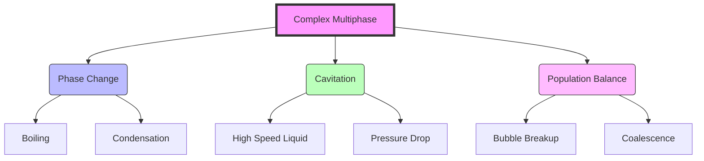

# 🌊 01: Complex Multiphase Phenomena (ปรากฏการณ์หลายเฟสที่ซับซ้อน)

**ระดับความยาก**: สูง (Advanced) | **Solver หลัก**: `reactingTwoPhaseEulerFoam`, `multiphaseEulerFoam`

---

## 📋 บทนำ (Introduction)

ในโมดูลพื้นฐาน เราได้เรียนรู้การจำลองการไหลแบบสองเฟส (Two-phase flow) อย่างง่าย เช่น น้ำกับอากาศที่ไม่ผสมกัน (VOF) แต่ในโลกความเป็นจริง ปรากฏการณ์หลายเฟสมักซับซ้อนกว่านั้นมาก:
*   **Mass Transfer**: น้ำเปลี่ยนเป็นไอน้ำ (Phase Change/Boiling)
*   **Phase Creation**: ฟองก๊าซเกิดขึ้นในของเหลวเมื่อความดันลดต่ำ (Cavitation)
*   **Dispersed Flow**: ฟองอากาศนับล้านฟองที่มีขนาดต่างกัน (Polydisperse systems)

โมดูลนี้จะพาคุณเจาะลึกเข้าไปใน **"ฟิสิกส์ระดับโมเลกุลและระดับอนุภาค"** ที่ส่งผลต่อพฤติกรรมระดับมหภาค โดยใช้ OpenFOAM เป็นเครื่องมือในการไขคำตอบ

> **💡 Key Concept**: ในระดับนี้ เราไม่ได้แค่แก้สมการ Navier-Stokes อีกต่อไป แต่เราต้องแก้สมการ **Energy (Temperature)**, **Species (Concentration)**, และ **Population Balance** ไปพร้อมๆ กัน (Coupled Physics)

> [!TIP] **มุมมองเปรียบเทียบ: การต้มป๊อปคอร์นและการเปิดขวดน้ำอัดลม (Popcorn & Soda)**
>
> 1.  **Phase Change (Boiling):** เหมือน **"การคั่วป๊อปคอร์น"**
>     *   เมื่อความร้อนถึงจุดหนึ่ง เมล็ดข้าวโพด (ของเหลว) จะระเบิดออกกลายเป็นป๊อปคอร์น (ไอ)
>     *   เราต้องใส่พลังงาน (ความร้อน) เข้าไปเพื่อเปลี่ยนสถานะ
> 2.  **Cavitation:** เหมือน **"การเปิดฝาขวดน้ำอัดลม"**
>     *   ฟองก๊าซไม่ได้เกิดจากความร้อน แต่เกิดจาก **ความดันที่ลดลง** ทันทีที่เปิดขวด (Pressure Drop) ทำให้ก๊าซที่ละลายอยู่ขยายตัวออกมาเป็นฟอง

---

## 🎯 วัตถุประสงค์การเรียนรู้ (Learning Objectives)

เมื่อจบบทเรียนนี้ คุณจะสามารถ:
1.  **Model Phase Change**: จำลองการเดือด (Boiling) และการควบแน่น (Condensation) โดยใช้แบบจำลอง `Lee` หรือ `Hertz-Knudsen`
2.  **Simulate Cavitation**: วิเคราะห์การเกิดโพรงอากาศในปั๊มหรือใบพัดเรือด้วยโมเดล `Schnerr-Sauer` หรือ `Merkle`
3.  **Master PBE**: ใช้สมการสมดุลประชากร (Population Balance Equation) เพื่อทำนายการกระจายตัวของขนาดฟอง (Bubble Size Distribution)
4.  **Select the Right Solver**: เข้าใจความแตกต่างและเลือกใช้ระหว่าง `interFoam` (VOF) และ `multiphaseEulerFoam` (Euler-Euler) ได้อย่างถูกต้อง

---

## 🗺️ แผนผังการเรียนรู้ (Module Roadmap)

เราจะแบ่งเนื้อหาออกเป็น 3 ส่วนหลักที่เชื่อมโยงกัน:



---

## 🔬 ส่วนที่ 1: การจำลองการเปลี่ยนสถานะ (Phase Change Modeling)

การเปลี่ยนสถานะเกิดขึ้นเมื่อของเหลวได้รับความร้อนจนถึงจุดเดือด หรือก๊าซสูญเสียความร้อนจนควบแน่น

### 1.1 สมการพื้นฐาน (Governing Equation)
อัตราการถ่ายเทมวล ($\dot{m}''$) มักถูกคำนวณจากความแตกต่างของอุณหภูมิ:

$$
\dot{m}'' = \frac{h_{lv}}{T_{sat}} \left( \frac{q''}{h_{lv}} + \frac{\alpha_l \rho_l (T_l - T_{sat})}{\Delta t} \right)
$$

### 1.2 เจาะลึกโค้ด OpenFOAM (Code Insight)
ตัวอย่างการคำนวณใน `ThermalPhaseChangePhaseSystem.C`:

```cpp
// Source: applications/solvers/multiphase/multiphaseEulerFoam/...
// การคำนวณอัตราการถ่ายเทมวล (Mass Transfer Rate)
volScalarField mDotL
(
    "mDotL",
    hLv_/Tsat_ * (qDot_/hLv_ + alphaL_*rhoL_*(TL_-Tsat_)/deltaT_)
);
```

> **👨‍💻 Developer Note**:
> สังเกตว่าพจน์ `alphaL_*rhoL_*(TL_-Tsat_)/deltaT_` คือการขับเคลื่อนด้วยอุณหภูมิ (Temperature-driven) ถ้า $T_L > T_{sat}$ ของเหลวจะกลายเป็นไอ

---

## 🌪️ ส่วนที่ 2: การเกิดโพรงอากาศ (Cavitation)

Cavitation ไม่ได้เกิดจากความร้อน แต่เกิดจาก **ความดัน** ที่ลดต่ำลงกว่าความดันไอ ($P < P_{v}$) มักพบในอุปกรณ์ไฮดรอลิกความเร็วสูง

### 2.1 โมเดลยอดนิยม (Popular Models)
*   **Schnerr-Sauer**: แม่นยำสำหรับระบบทั่วไป ใช้สมการ Bubble Growth
*   **Kunz**: เหมาะสำหรับงานที่ต้องการความเสถียรสูง (แต่ความแม่นยำอาจลดลง)
*   **Merkle**: ใช้บ่อยในงานด้าน Turbomachinery

### 2.2 การตั้งค่าใน OpenFOAM
ในไฟล์ `constant/phaseProperties` หรือ `transportProperties`:

```cpp
phase1
{
    type            cavitationModel;
    cavitationModel SchnerrSauer;
    SchnerrSauerCoeffs
    {
        nBubbles     1e13;  // จำนวนฟองต่อลูกบาศก์เมตร
        pSat         2300;  // ความดันไอ (Pa)
        dNucleation  1e-6;  // ขนาดเริ่มต้นของฟอง
    }
}
```

---

## 📊 ส่วนที่ 3: สมดุลประชากร (Population Balance)

ในความเป็นจริง ฟองอากาศไม่ได้มีขนาดเท่ากันหมด ฟองใหญ่อาจแตกตัว (Breakup) และฟองเล็กอาจรวมตัวกัน (Coalescence)

### 3.1 วิธีโมเมนต์ (Method of Moments - QMOM)
แทนที่จะติดตามฟองทุกฟอง เราติดตาม "ค่าเฉลี่ยเชิงสถิติ" (Moments) ของมันแทน ซึ่งประหยัดทรัพยากรเครื่องมากกว่า

```cpp
// การคำนวณโมเมนต์ที่ k ของการกระจายขนาด
Mk[k] = fvc::domainIntegrate(Lk[k]*n).value();
```

---

## ⚠️ ข้อควรระวังและปัญหาที่พบบ่อย (Common Pitfalls)

| ปัญหา (Issue) | สาเหตุ (Cause) | วิธีแก้ไข (Solution) |
| :--- | :--- | :--- |
| **Divergence** | Timestep ใหญ่เกินไปสำหรับสมการ Phase Change ที่ไวมาก | ลด $\Delta t$ หรือใช้ `adjustableRunTime` โดยตั้ง MaxCo < 0.5 |
| **Unrealistic Temperature** | อุณหภูมิพุ่งสูงหรือต่ำผิดปกติ | ตรวจสอบ Boundary Conditions และค่า $C_p$ (Heat Capacity) |
| **Pressure Oscillations** | การเปลี่ยนแปลงความหนาแน่นอย่างรุนแรง (Water -> Vapor) | ใช้ PIMPLE loop ที่มีจำนวน `nCorrectors` สูงขึ้น (3-5 ครั้ง) |

---

## 🛠️ บทเรียนปฏิบัติ (Hands-on Tutorials)

1.  **Boiling in a Channel**: สร้างแบบจำลองการเดือดในท่อสี่เหลี่ยม โดยให้ความร้อนที่ผนังด้านล่าง (เรียนรู้ `reactingTwoPhaseEulerFoam`)
2.  **Propeller Cavitation**: (Advanced) จำลองใบพัดเรือหมุนและดูบริเวณที่เกิด Cavitation (เรียนรู้การใช้ `MoveMesh` ร่วมกับ Cavitation)
3.  **Bubble Column**: จำลองหอถังหมักที่มีการเป่าอากาศด้านล่าง และดูการกระจายตัวของขนาดฟองด้วย PBE

**พร้อมจะลุยกับฟิสิกส์สุดโหดหรือยัง? ไปเริ่มที่หัวข้อแรกกันเลย!**

---

## 🧠 Concept Check: ทดสอบความเข้าใจ

<details>
<summary><b>1. Cavitation ต่างจากการเดือด (Boiling) อย่างไร?</b></summary>

**คำตอบ:**
*   **Boiling:** เกิดจาก **อุณหภูมิเพิ่มขึ้น** ($T > T_{sat}$) ที่ความดันคงที่
*   **Cavitation:** เกิดจาก **ความดันลดลง** ($P < P_{sat}$) ที่อุณหภูมิคงที่
ทั้งสองอย่างทำให้เกิดฟองไอเหมือนกัน แต่สาเหตุ (Driving Force) ต่างกัน
</details>

<details>
<summary><b>2. ทำไมเราต้องแก้สมการ Population Balance (PBE) ด้วย? แค่ VOF หรือ Euler-Euler ไม่พอเหรอ?</b></summary>

**คำตอบ:** **ไม่พอ** ถ้าขนาดฟองมีความสำคัญ
*   VOF/Euler-Euler ปกติมักสมมติให้ฟองมีขนาดคงที่ (Mean Diameter)
*   แต่ในความเป็นจริง ฟองมีการ **แตกตัว (Breakup)** และ **รวมตัว (Coalescence)** ตลอดเวลา ซึ่งส่งผลต่อพื้นที่ผิวและแรงต้าน (Drag) ดังนั้นถ้าอยากรู้การกระจายขนาดฟองที่ถูกต้อง ต้องใช้ PBE
</details>

<details>
<summary><b>3. ในสมการ Phase Change ถ้าคำนวณ Mass Transfer Rate ผิด จะเกิดอะไรขึ้น?</b></summary>

**คำตอบ:** จะเกิดปัญหา **Divergence** หรือ **Unrealistic Physics**
*   ถ้าอัตราการถ่ายเทมวลสูงเกินไป ความหนาแน่นในเซลล์จะเปลี่ยนจากของเหลวเป็นไอเร็วเกินไปจน Solver คำนวณความดันไม่ทัน (Pressure Spike) ทำให้การคำนวณล้มเหลว
</details>