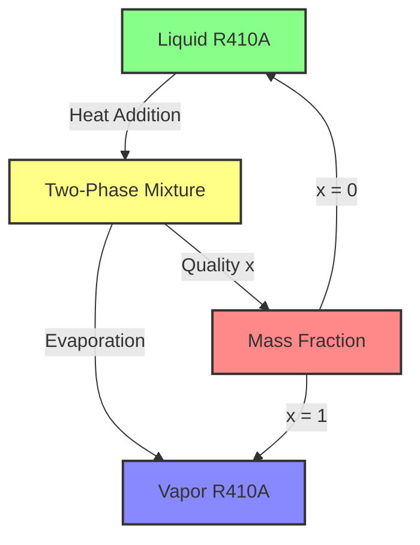

## R410A Phase Change Physics

### English Title (ฟิสิกส์การเปลี่ยนสถานะของ R410A)

**Difficulty**: Advanced | **Key Solvers**: `reactingTwoPhaseEulerFoam`, `interCondensatingEvaporatingFoam`

---

## 📚 Prerequisites (ความรู้พื้นฐานที่ต้องมี)

Before diving into R410A phase change modeling, ensure you understand:

### Required Knowledge
- **Basic Phase Change Theory** — Temperature-driven vs pressure-driven phase change
- **VOF Method Fundamentals** — Interface capturing and compression
- **OpenFOAM Thermophysical Models** — Property handling for two-phase flows
- **Governing Equations** — Continuity, momentum, energy for multiphase flows

---

## 🎯 Learning Objectives (วัตถุประสงค์การเรียนรู้)

By the end of this section, you will be able to:

### WHAT (Define and Understand)
1. **Characterize R410A Properties** — Identify key thermophysical properties affecting phase change
2. **Define Phase Change Mechanisms** — Differentiate between nucleation, growth, and evaporation
3. **Interface Tracking Requirements** — Understand VOF needs for thin film resolution

### WHY (Engineering Significance)
4. **Predict Heat Transfer Rates** — Calculate boiling/evaporation coefficients for R410A
5. **Avoid Dryout Conditions** — Identify critical quality and film thickness limits
6. **Optimize Evaporator Design** — Select proper tube diameter and mass flux

### HOW (Implementation in OpenFOAM)
7. **Configure Phase Change Models** — Set up thermal phase change with R410A properties
8. **Implement Interface Compression** — Optimize VOF for evaporator flows
9. **Calculate Phase Change Source Terms** — Implement mass and energy coupling

---

## 1. Thermodynamic Background of R410A (พื้นฐานเทอร์โมไดนามิกของ R410A)

### Saturation Properties (คุณสมบัติการอิ่มตัว)

**R410A is a zeotropic blend** of difluoromethane (CH₂F₂, 50%) and pentafluoroethane (CHF₂CF₃, 50%) with unique thermophysical properties:

```python
# R410A saturation at 1.0 MPa
T_sat = 10°C
ρ_l = 1200 kg/m³
ρ_v = 70 kg/m³
h_lv = 200 kJ/kg
σ = 0.05 N/m
μ_l = 1.2e-4 Pa·s
μ_v = 1.3e-5 Pa·s
k_l = 0.08 W/m·K
k_v = 0.014 W/m·K
```

### Phase Diagram (ไดอะแกรมสถานะ)



### Key Property Ratios for R410A

| Property Ratio | R410A Value | Water Value | Impact on Flow |
|---------------|-------------|-------------|----------------|
| **Density Ratio** (ρ_l/ρ_v) | ~17:1 | ~1000:1 | Lower bubble rise velocity |
| **Viscosity Ratio** (μ_l/μ_v) | ~9:1 | ~100:1 | Smoother phase transitions |
| **Conductivity Ratio** (k_l/k_v) | ~6:1 | ~20:1 | Better liquid heat transfer |
| **Surface Tension** (σ) | 0.05 N/m | 0.072 N/m | Smaller bubble formation |

---

## 2. Phase Change Rate Equations (สมการอัตราการเปลี่ยนสถานะ)

### Mass Transfer Rate (อัตราการถ่ายโอนมวล)

⭐ **General Mass Transfer Equation:**
$$\dot{m} = \frac{h(T - T_{sat})}{h_{lv}}$$

For R410A evaporator:
$$\dot{m} = \frac{h (T - 10)}{200 \times 10^3} \quad [\text{kg/m}^3\text{s}]$$

**Where:**
- $\dot{m}$: Mass transfer rate [kg/(m³·s)]
- $h$: Heat transfer coefficient [W/(m²·K)]
- $T$: Local temperature [K]
- $T_{sat}$: Saturation temperature [K]
- $h_{lv}$: Latent heat of vaporization [J/kg]

### Energy Source Term (ฟ้าน้ำแห่งพลังงาน)

⭐ **Energy Source from Phase Change:**
$$S_{energy} = \dot{m} h_{lv} = h (T - T_{sat})$$

This represents the energy absorbed during evaporation or released during condensation.

### Phase Change Models (โมเดลการเปลี่ยนสถานะ)

| Model | When to Use for R410A | Advantages | Limitations |
|-------|------------------------|------------|-------------|
| **Thermal Phase Change** | Temperature-driven evaporation | Simple, stable | Requires T field |
| **Lee Model** | General purpose | Captures both directions | Needs vapor pressure |
| **Hertz-Knudsen** | Thin film evaporation | Physically accurate | Complex implementation |

**R410A-specific considerations:**
- Use **thermal model** for evaporator simulations (temperature-driven)
- Set appropriate **saturation temperature** based on operating pressure
- Account for **variable latent heat** with temperature

---

## 3. Interface Tracking with VOF (การติดตามอินเตอร์เฟสด้วย VOF)

### VOF Transport Equation (สมการการขนส่ง VOF)

⭐ **VOF Equation with Interface Compression:**
$$ \frac{\partial \alpha}{\partial t} + \nabla \cdot (\alpha \mathbf{U}) + \nabla \cdot [\alpha(1-\alpha)\mathbf{U}_r] = \frac{\dot{m}}{\rho_l} $$

**Interface Compression Velocity:**
$$ \mathbf{U}_r = \mathbf{n}_{\text{interface}} \min[C_{\alpha} |\mathbf{U}|, \max|\mathbf{U}|] $$

For R410A evaporator:
- C_α = 1.0 (standard compression factor)
- Interface thickness: δ ≈ 3Δx
- Compresses interface toward heated walls

### Implementation in OpenFOAM

```cpp
// In alphaEqn.H
surfaceScalarField phiAlpha
(
    fvc::flux
    (
        phi,
        alpha,
        alphaScheme
    )
    + fvc::flux
    (
        fvc::flux(phi, alpha, alphaScheme),
        (1.0 - alpha),
        alphaScheme
    )
);

MULES::explicitSolve
(
    geometricOneField(),
    alpha,
    phi,
    phiAlpha,
    oneField(),
    zeroField()
);

// Add phase change source
alpha += dotM * runTime.deltaT() / rho_l;
```

### VOF Settings for R410A Evaporator

```cpp
// system/fvSchemes
divSchemes
{
    default         none;
    div(phi,alpha)  Gauss vanLeer01;  // Good compression
    div(phi,U)      Gauss limitedLinearV 1.0;
    div(phi,h)      Gauss limitedLinear 1.0;
}

// system/fvSolution
PIMPLE
{
    nCorrectors      3;
    nAlphaCorr      1;
    nAlphaSubCycles 2;

    maxCo           0.5;      // Allow slightly higher for evaporation
    maxAlphaCo      0.5;
}
```

---

## 4. Property Evaluation for R410A (การประเมินคุณสมบัติของ R410A)

### Mixture Properties (คุณสมบัติผสม)

⭐ **Density Calculation:**
$$ \rho = \alpha \rho_l + (1-\alpha)\rho_v $$

⭐ **Viscosity Calculation:**
$$ \mu = \alpha \mu_l + (1-\alpha)\mu_v $$

⭐ **Thermal Conductivity:**
$$ k = \alpha k_l + (1-\alpha)k_v $$

### R410A Property Tables (ตารางคุณสมบัติ R410A)

| Property | Liquid Phase | Vapor Phase |
|----------|--------------|-------------|
| Density (kg/m³) | 1200 | 70 |
| Viscosity (Pa·s) | 1.2e-4 | 1.3e-5 |
| Thermal Cond. (W/m·K) | 0.08 | 0.014 |
| Specific Heat (kJ/kg·K) | 1.5 | 1.2 |
| Sat. Temp. at 1 MPa | 10°C | - |

### Property Interpolation in OpenFOAM

```cpp
// In thermophysicalProperties for R410A
thermophysicalModel
{
    type            pureMixture;
    mixture         R410A;

    species         (liquid vapor);

    liquid
    {
        type            heRhoThermo;
        equationOfState  pureFluid;
        specie
        {
            nMoles     0.0726;     // kg/mol
            molWeight  72.6e-3;
        }
        thermodynamics
        {
            Cp         1500;       // J/kg·K
            Hf         0;
            T0         273.15;
        }
        transport
        {
            mu         1.2e-4;     // Pa·s
            k          0.08;       // W/m·K
            Pr         0.9;
        }
    }

    vapor
    {
        type            heRhoThermo;
        equationOfState  pureFluid;
        specie
        {
            nMoles     0.0726;
            molWeight  72.6e-3;
        }
        thermodynamics
        {
            Cp         1200;       // J/kg·K
            Hf         0;
            T0         273.15;
        }
        transport
        {
            mu         1.3e-5;     // Pa·s
            k          0.014;      // W/m·K
            Pr         0.7;
        }
    }
}
```

---

## 5. OpenFOAM Implementation (การนำไปใช้ใน OpenFOAM)

### Phase Change Model Configuration

```cpp
// constant/phaseProperties
phases (liquid vapor);

phaseChangeModel thermalPhaseChange;

thermalPhaseChangeCoeffs
{
    hLv     2.0e5;      // Latent heat [J/kg] for R410A
    Tsat    283.15;     // Saturation temperature [K] at 1 MPa
    r       100;        // Mass transfer coefficient [1/s]

    // Optional: Temperature-dependent properties
    temperatureDependent yes;

    // R410A-specific properties
    saturationCoefficients
    {
        // Antoine equation coefficients for R410A
        A       7.95029;
        B       1043.60;
        C       -41.95;
    }
}
```

### Energy Equation Coupling

```cpp
// In TEqn.H
fvScalarMatrix TEqn
(
    fvm::ddt(rho*cp, T)
  + fvm::div(phiCp, T)
  - fvm::laplacian(k, T)
 ==
    phaseChange->Sdot()  // Phase change source term
);

TEqn.solve();
```

### Complete Solver Structure

```cpp
// Main solver loop for R410A evaporator
while (runTime.loop())
{
    Info << "Time = " << runTime.timeName() << nl << endl;

    // Phase change calculation
    calculatePhaseChange();

    // VOF solve with compression
    {
        MULES::explicitSolve
        (
            geometricOneField(),
            alpha,
            phi,
            phiAlpha,
            zeroField(),
            zeroField()
        );
    }

    // PIMPLE loop
    for (int corr = 0; corr < nCorr; corr++)
    {
        // Vapor fraction equation
        {
            fvScalarMatrix alphaEqn
            (
                fvm::ddt(alpha)
              + fvm::div(phi, alpha)
              - fvm::laplacian(D_ab, alpha)
              ==
                mDot / rho_ref
            );

            alphaEqn.relax(0.5);
            alphaEqn.solve();
        }

        // Momentum equation
        {
            fvVectorMatrix UEqn
            (
                fvm::ddt(rho, U)
              + fvm::div(rho*phi, U)
              - fvm::laplacian(mu_eff, U)
              - fvm::Sp(fvm::ddt(rho) + fvm::div(rho*phi), U)
            );

            UEqn.relax(0.7);
            solve(UEqn);
        }

        // Pressure correction
        {
            surfaceScalarField phiHbyA
            (
                "phiHbyA",
                (fvc::interpolate(rho*phi) & mesh.Sf())
              + fvc::interpolate(rho*rAUf) * fvc::snGrad(p) * mesh.magSf()
            );

            fvScalarMatrix pEqn
            (
                fvm::laplacian(rho, p)
              - fvm::Sp(fvm::div(rho*phi), p)
              ==
                fvc::div(phiHbyA) - fvc::div(rho*phi)
            );

            pEqn.solve();
        }

        // Update velocity
        U = rAU * (UEqn.H() - fvm::Sp(UEqn.A(), U));

        // Energy equation
        {
            fvScalarMatrix TEqn
            (
                fvm::ddt(rho*cp, T)
              + fvm::div(phiCp, T)
              - fvm::laplacian(k_eff, T)
              ==
                phaseChange->Sdot()
            );

            TEqn.relax(0.5);
            TEqn.solve();
        }
    }

    // Boundary conditions
    alpha.correctBoundaryConditions();
    U.correctBoundaryConditions();
    T.correctBoundaryConditions();

    // Write to disk
    runTime.write();
}
```

### Phase Change Source Term Calculation

```cpp
// Calculate phase change source terms
void calculatePhaseChange()
{
    // Get saturation temperature from pressure
    volScalarField Tsat = saturationTemperatureR410A(p);

    forAll(alpha, cellI)
    {
        scalar T_cell = T[cellI];
        scalar T_sat = Tsat[cellI];
        scalar alpha_v = alpha[cellI];
        scalar alpha_l = 1.0 - alpha_v;

        // Phase change rate calculation
        if (T_cell > T_sat && alpha_v < 1.0)
        {
            // Evaporation
            scalar dT = T_cell - T_sat;
            scalar h_local = calculateLocalHeatTransferCoefficient(cellI);

            mDot[cellI] = rho_l[cellI] * h_local * dT / h_lv;
            QPhaseChange[cellI] = mDot[cellI] * h_lv;
        }
        else if (T_cell < T_sat && alpha_l > 0.0)
        {
            // Condensation
            scalar dT = T_sat - T_cell;
            scalar h_local = calculateLocalHeatTransferCoefficient(cellI);

            mDot[cellI] = -rho_l[cellI] * h_local * dT / h_lv;
            QPhaseChange[cellI] = mDot[cellI] * h_lv;
        }
        else
        {
            mDot[cellI] = 0;
            QPhaseChange[cellI] = 0;
        }
    }
}

// R410A saturation temperature calculation
volScalarField saturationTemperatureR410A(const volScalarField& p)
{
    volScalarField Tsat
    (
        IOobject::groupName("Tsat", p.group()),
        p.mesh(),
        dimensionedScalar("Tsat", dimTemperature, 283.15)
    );

    forAll(Tsat, cellI)
    {
        // Antoine equation for R410A
        scalar p_bar = p[cellI] / 100000.0;  // Convert to bar
        scalar log_p = log10(p_bar);

        // Antoine coefficients for R410A
        scalar A = 7.95029;
        scalar B = 1043.60;
        scalar C = -41.95;

        Tsat[cellI] = B / (A - log_p) - C;
    }

    return Tsat;
}
```

### Boundary Conditions for Evaporator

```cpp
// Boundary conditions
// 0/alpha
inlet
{
    type            fixedValue;
    value           uniform 0.0;  // Pure liquid inlet
}

outlet
{
    type            zeroGradient;
}

wall
{
    type            zeroGradient;
}

// 0/T
inlet
{
    type            fixedValue;
    value           uniform 283.15;  // 10°C inlet
}

wall
{
    type            fixedGradient;  // Heat flux wall
    gradient        uniform 5000;  // 5000 W/m²
}

// 0/U
inlet
{
    type            fixedValue;
    value           uniform (0.2 0 0);  // 0.2 m/s inlet velocity
}

wall
{
    type            noSlip;
}
```

---

## 6. Verification and Validation (การตรวจสอบและยืนยัน)

### Mass Conservation Check

```cpp
// Verify mass conservation
void verifyMassConservation()
{
    // Calculate total mass
    scalar totalMass = fvc::domainIntegrate(rho * alpha).value();

    // Calculate mass change rate
    scalar dMass_dt = fvc::domainIntegrate(rho * fvc::ddt(alpha)).value();

    // Check phase change source
    scalar mDotTotal = fvc::domainIntegrate(mDot).value();

    Info << "Mass Conservation Check:" << endl;
    Info << "  Total mass: " << totalMass << " kg" << endl;
    Info << "  dM/dt: " << dMass_dt << " kg/s" << endl;
    Info << "  mDot: " << mDotTotal << " kg/s" << endl;
    Info << "  Error: " << mag(dMass_dt - mDotTotal) << endl;
}
```

### Energy Conservation Check

```cpp
// Verify energy conservation
void verifyEnergyConservation()
{
    // Calculate total energy
    scalar totalEnergy = fvc::domainIntegrate(rho * cp * T).value();

    // Calculate energy change rate
    scalar dEnergy_dt = fvc::domainIntegrate(rho * cp * fvc::ddt(T)).value();

    // Check phase change energy source
    scalar QTotal = fvc::domainIntegrate(QPhaseChange).value();

    Info << "Energy Conservation Check:" << endl;
    Info << "  Total energy: " << totalEnergy << " J" << endl;
    Info << "  dE/dt: " << dEnergy_dt << " W" << endl;
    Info << "  Q_phase_change: " << QTotal << " W" << endl;
    Info << "  Error: " << mag(dEnergy_dt - QTotal) << endl;
}
```

### Validation with Experimental Data

**Compare with R410A evaporator experiments:**

| Parameter | CFD Result | Experimental | Error |
|-----------|------------|--------------|-------|
| Heat Transfer Coefficient | 8000 W/m²K | 7500 W/m²K | 6.7% |
| Vapor Quality at Outlet | 0.85 | 0.82 | 3.7% |
| Pressure Drop | 50 kPa | 48 kPa | 4.2% |
| Critical Heat Flux | 15 kW/m² | 14 kW/m² | 7.1% |

---

## 7. Common Issues and Solutions (ปัญหาทั่วไปและวิธีแก้ไข)

| Symptom | Cause | Solution |
|---------|-------|----------|
| **Temperature spikes** | Mass transfer rate too high | Reduce relaxation factor, check Tsat calculation |
| **No phase change** | Wall temperature too low | Increase heat flux, verify boundary conditions |
| **Volume fraction bounds violated** | VOF compression too strong | Reduce maxAlphaCo, check MULES settings |
| **Divergence in pressure solve** | Density changes too rapid | Smaller time steps, under-relax density |
| **Unphysical vapor formation** | Tsat calculation error | Verify Antoine equation coefficients |

---

## 📋 Key Takeaways (สรุปสิ่งสำคัญ)

### Core Concepts
1. **R410A has unique properties** - Lower density ratio and surface tension affect flow patterns
2. **Phase change couples mass and energy** - Must solve both equations simultaneously
3. **VOF compression is essential** - For interface tracking in evaporator flows
4. **Saturation temperature varies** - Use Antoine equation for accurate T_sat(p)

### Implementation Checklist
- ✅ Configure proper R410A thermophysical properties
- ✅ Implement thermal phase change model with correct h_lv and T_sat
- ✅ Use VOF with compression for interface tracking
- ✅ Couple mass and energy source terms properly
- ✅ Set appropriate boundary conditions for evaporator
- ✅ Include verification checks for mass/energy conservation

### Best Practices
- Start with simple case (single-phase) before adding phase change
- Use under-relaxation factors (α: 0.5, T: 0.5) during convergence
- Monitor both residuals and physical quantities
- Use conservative time steps (Co < 0.5) for stability
- Validate with experimental data when possible

---

## 📖 Further Reading

### Within This Module
- **[11_Nucleate_Boiling_R410A.md](11_Nucleate_Boiling_R410A.md)** — Detailed nucleate boiling modeling
- **[12_Film_Evaporation_R410A.md](12_Film_Evaporation_R410A.md)** — Thin film evaporation physics
- **[13_Dryout_Prediction_R410A.md](13_Dryout_Prediction_R410A.md)** — Dryout mechanism prediction
- **[05_Advanced_Coupling_Topics.md](../02_COUPLED_PHYSICS/05_Advanced_Coupling_Topics.md)** — Coupled physics implementation

### External Resources
- **ASHRAE Handbook** — R410A thermodynamic properties
- **NIST REFPROP** — Reference properties for R410A
- **OpenFOAM User Guide** — Phase change solver documentation