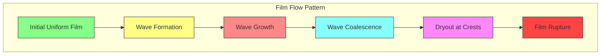

## Film Evaporation Modeling for R410A

### English Title (โมเดลการระเหยฟิล์มของ R410A)

**Difficulty**: Advanced | **Key Solvers**: `interCondensatingEvaporatingFoam`, `reactingTwoPhaseEulerFoam`

---

## 📚 Prerequisites (ความรู้พื้นฐานที่ต้องมี)

Before studying film evaporation in R410A, ensure you understand:

### Required Knowledge
- **Thin Film Theory** — Lubrication approximation and film flow
- **Heat Transfer in Films** — Conduction vs convection effects
- **Interfacial Phenomena** — Surface tension and contact angle effects
- **VOF Method** — For interface tracking in thin layers

---

## 🎯 Learning Objectives (วัตถุประสงค์การเรียนรู้)

By the end of this section, you will be able to:

### WHAT (Define and Analyze)
1. **Characterize Thin Film Physics** — Understand flow regimes and stability criteria
2. **Model Film Thickness Evolution** — Predict film thickness distribution
3. **Analyze Film Instabilities** — Identify dryout and wave formation

### WHY (Engineering Significance)
4. **Optimize Heat Transfer** — Achieve high coefficients with thin films
5. **Prevent Dryout** — Maintain minimum film thickness
6. **Design Efficient Evaporators** — Proper tube geometry and operating conditions

### HOW (Implementation in OpenFOAM)
7. **Implement Film Model** — Set up thin film equations in OpenFOAM
8. **Calculate Evaporation Rates** — Model mass transfer from film surface
9. **Predict Film Breakup** — Identify conditions for dryout

---

## 1. Thin Film Physics for R410A (ฟิสิกส์ฟิล์มบางสำหรับ R410A)

### Film Thickness Calculation

⭐ **Thin Film Thickness for R410A:**
$$ \delta(x) = \left(\frac{3 \mu_l q x}{\rho_l (\rho_l - \rho_v) g h_{lv}}\right)^{1/3} $$

For R410A at x = 0.1m:
$$ \delta = \left(\frac{3 \times 1.2e-4 \times 3000 \times 0.1}{1200 \times 1130 \times 9.81 \times 200,000}\right)^{1/3} $$
$$ \delta \approx 50 \times 10^{-6} \text{ m} = 50 \mu\text{m} $$

**Where:**
- δ: Film thickness [m]
- μ_l: Liquid viscosity [Pa·s]
- q: Heat flux [W/m²]
- x: Distance from inlet [m]
- ρ_l, ρ_v: Liquid and vapor densities [kg/m³]
- g: Gravity [m/s²]
- h_lv: Latent heat [J/kg]

### Flow Regimes in Thin Films

| Regime | Reynolds Number | Film Thickness | Heat Transfer Mechanism |
|--------|----------------|----------------|------------------------|
| **Laminar flow** | Re < 30 | δ < 100 μm | Conduction dominated |
| **Wave flow** | 30 < Re < 1600 | 100-500 μm | Enhanced mixing |
| **Turbulent flow** | Re > 1600 | δ > 500 μm | Turbulent mixing |

**R410A Film Reynolds Number:**
$$ Re_{film} = \frac{\rho_l u_{film} \delta}{\mu_l} $$

Where u_film is the film velocity.

### Lubrication Approximation

⭐ **For thin films, the Navier-Stokes equations simplify to:**

Continuity:
$$ \frac{\partial \delta}{\partial t} + \frac{\partial}{\partial x}(\delta u) = \frac{\dot{m}}{\rho_l} $$

Momentum:
$$ \mu_l \frac{\partial^2 u}{\partial y^2} = -\frac{\partial p}{\partial x} + \rho_l g \sin\theta $$

Where:
- p: Pressure (hydrostatic + capillary)
- θ: Tube inclination angle
- y: Coordinate perpendicular to wall

---

## 2. Film Evaporation Heat Transfer (การถ่ายเทความร้อนระเหยฟิล์ม)

### Heat Transfer Coefficient

⭐ **Heat Transfer Coefficient for R410A Film:**
$$ h_{film} = \frac{k_l}{\delta} $$

For R410A film thickness δ = 50 μm:
$$ h_{film} = \frac{0.08}{50 \times 10^{-6}} \approx 1600 \text{ W/m}^2\cdot\text{K} $$

### Evaporation Rate from Film Surface

⭐ **Mass Evaporation Rate:**
$$ \dot{m}_{evap} = \frac{k_{eff}}{\delta} (T_{sat} - T_{bulk}) $$

Where:
- k_eff: Effective thermal conductivity
- T_sat: Saturation temperature
- T_bulk: Bulk fluid temperature

### Thermal Resistance Network

```
Heat Flux (q")
    |
    |    R_wall      R_film      R_vapor
    |    [1/k_w]     [δ/k_l]     [1/h_v]
    |
    └───────┬───────┬───────┬───────┘
            │       │       │
           Wall   Film   Vapor
```

**Total Thermal Resistance:**
$$ R_{total} = \frac{1}{h_w} + \frac{\delta}{k_l} + \frac{1}{h_v} $$

For R410A film evaporator:
- R_wall ≈ 1e-4 m²·K/W (copper wall)
- R_film ≈ 6e-4 m²·K/W (50 μm film)
- R_vapor ≈ 1e-3 m²·K/W (vapor convection)

---

## 3. Film Stability Analysis (การวิเคราะห์เสถียรภาพฟิล์ม)

### Critical Film Thickness

⭐ **Critical Film Thickness for R410A:**
$$ \delta_{cr} = \left(\frac{\sigma}{\rho_l g}\right)^{1/2} $$

For R410A:
$$ \delta_{cr} = \left(\frac{0.05}{1200 \times 9.81}\right)^{1/2} \approx 2 \text{ mm} $$

**Instability Criteria:**
- **Dryout**: δ/δ_cr < 0.1
- **Wave formation**: We > 10 (Weber number)
- **Film breakup**: δ < δ_min (10-20 μm)

### Film Flow Visualization



### Instability Mechanisms

| Mechanism | Condition | Effect on Film |
|-----------|----------|----------------|
| **Rayleigh-Taylor Instability** | ρ_v > ρ_l | Wave formation |
| **Kelvin-Helmholtz Instability** | U_film > U_crit | Film breakup |
| **Marangoni Effect** | dσ/dT ≠ 0 | Thermo-capillary flow |
| **Dryout** | q > q_CHF | Local film rupture |

---

## 4. Dryout Prediction for R410A (การพยากรณ์การแห้งของ R410A)

### Onset of Dryout

⭐ **Dryout Criterion:**
$$ \frac{\delta}{\delta_{cr}} < 0.1 \Rightarrow \text{Dryout} $$

**Critical Quality:**
$$ x_{cr} \approx 0.8 - 0.9 $$
(depends on mass flux and heat flux)

**Quality Definition:**
$$ x = \frac{h - h_l}{h_v - h_l} $$

### Film Breakup Mechanism

```
Film Surface
    |
    |    Smooth      Wavy      Dryout
    |     Film        Film      Region
    |
    └───────┬───────┬───────┬───────┘
            │       │       │
          x = 0.3  x = 0.7  x = 0.9
```

### Post-Dryout Heat Transfer

⭐ **Post-Dryout Heat Transfer Coefficient:**
$$ h_{pd} = 0.023 Re_v^{0.8} Pr_v^{0.4} \frac{k_v}{D} $$

For R410A vapor at x = 0.9:
- Re_v = 77,000
- Pr_v = 1.12
- k_v = 0.014 W/m·K
- D = 0.005 m
- Result: h_pd ≈ 500 W/m²·K

**Compare with pre-dryout:**
- Pre-dryout: h ≈ 5000 W/m²·K (with film)
- Post-dryout: h ≈ 500 W/m²·K (vapor only)
- **10× reduction!**

---

## 5. OpenFOAM Implementation (การนำไปใช้ใน OpenFOAM)

### Film Model Setup

```cpp
// constant/thermophysicalProperties
thermophysicalModel
{
    type            pureMixture;
    mixture         R410A;

    // Film evaporation model
    filmEvaporationModel on;

    filmEvaporationCoeffs
    {
        // R410A properties
        surfaceTension     0.05;    // N/m
        latentHeat         2.0e5;   // J/kg
        liquidDensity     1200;    // kg/m³
        vaporDensity       70;      // kg/m³

        // Film parameters
        minFilmThickness   1e-5;    // m
        criticalQuality    0.85;    // Dryout criterion
        criticalWeber      10;      // Wave formation

        // Heat transfer correlations
        conductionModel   yes;
        convectionModel   yes;
        nucleateModel     no;      // For smooth films
    }
}
```

### Film Thickness Calculation

```cpp
// In filmEvaporationModel.C
scalar R410AFilmModel::calculateFilmThickness
(
    scalar x,
    scalar q,
    scalar G
) const
{
    // R410A properties
    scalar mu_l = 1.2e-4;
    scalar rho_l = 1200;
    scalar rho_v = 70;
    scalar h_lv = 2.0e5;
    scalar g = 9.81;

    // Film thickness from Nusselt theory
    scalar delta = pow
    (
        3 * mu_l * q * x /
        (rho_l * (rho_l - rho_v) * g * h_lv),
        1.0/3.0
    );

    return delta;
}

// Check for dryout
bool R410AFilmModel::isDryout(scalar alpha, scalar x) const
{
    // Critical quality for dryout
    if (x > criticalQuality_)
    {
        return true;
    }

    // Minimum film thickness
    scalar delta_min = minFilmThickness_;
    scalar delta = calculateFilmThickness(x, q_local_, G_local_);

    if (delta < delta_min)
    {
        return true;
    }

    return false;
}
```

### Evaporation Rate Calculation

```cpp
// Calculate evaporation rate from film surface
scalar R410AFilmModel::evaporationRate(scalar delta) const
{
    if (delta < minFilmThickness_)
    {
        // Dryout - no evaporation
        return 0;
    }

    scalar k_l = 0.08;  // W/m·K
    scalar T_wall = 320;  // K
    scalar T_sat = 283;   // K

    // Heat transfer through film
    scalar q_film = k_l * (T_wall - T_sat) / delta;

    // Evaporation rate
    scalar m_dot = q_film / h_lv;

    return m_dot;
}
```

### Film Flow Implementation

```cpp
// Solve film thickness equation
fvScalarMatrix deltaEqn
(
    fvm::ddt(delta)
  + fvm::div(phi_film, delta)
  - fvm::laplacian(D_film, delta)
  ==
    filmEvaporation->mDot() / rho_l
);

deltaEqn.relax(0.5);
deltaEqn.solve();

// Apply boundary conditions
delta.boundaryFieldRef()[inlet] = inletThickness;
delta.boundaryFieldRef()[outlet] = zeroGradient;

// Update film velocity from flow rate
surfaceScalarField U_film
(
    "U_film",
    rho_film * fvc::flux(delta) / (rho_film * delta)
);
```

### Energy Equation with Film Effects

```cpp
// Modified energy equation for film evaporation
fvScalarMatrix TEqn
(
    fvm::ddt(rho*cp, T)
  + fvm::div(phiCp, T)
  - fvm::laplacian(k_eff, T)
 ==
    phaseChange->Sdot()      // Bulk phase change
  + filmEvaporation->Qdot()  // Film evaporation source
);

// Add film thermal resistance
forAll(TEqn, cellI)
{
    scalar delta_cell = filmThickness[cellI];

    if (delta_cell > SMALL)
    {
        // Film resistance
        scalar R_film = delta_cell / k_l;
        scalar h_film = 1.0 / R_film;

        // Modify heat transfer coefficient
        TEqn.A()[cellI] += h_film;
        TEqn.H()[cellI] += h_film * T_wall;
    }
}

TEqn.solve();
```

### Boundary Conditions for Film

```cpp
// 0/delta - film thickness
inlet
{
    type            fixedValue;
    value           uniform 0.0001;  // 0.1 mm inlet film
}

wall
{
    type            zeroGradient;  // No penetration
}

outlet
{
    type            zeroGradient;
}

// 0/T - temperature with film effects
wall
{
    type            fixedGradient;
    gradient        uniform 5000;  // Heat flux [W/m²]

    // Film correction
    filmThickness   delta;
    k_film          0.08;  // W/m·K
}
```

### Solver Configuration

```cpp
// system/fvSolution
PIMPLE
{
    nCorrectors      3;
    nAlphaCorr      1;
    nAlphaSubCycles 2;

    maxCo           0.2;      // Strict for thin films
    maxAlphaCo      0.2;
}

// Relaxation for film equation
relaxationFactors
{
    delta           0.3;      // Film thickness
    T               0.5;
    U               0.7;
    p               0.3;
}
```

---

## 6. Detection and Handling of Dryout (การตรวจจับและการจัดการการแห้ง)

### Dryout Detection Algorithm

```cpp
// Monitor dryout conditions
void monitorDryout()
{
    label nDryoutCells = 0;
    scalar maxFilmStress = 0;

    forAll(filmThickness, cellI)
    {
        scalar x = quality[cellI];
        scalar delta = filmThickness[cellI];

        // Check dryout criteria
        if (x > criticalQuality_ || delta < minFilmThickness_)
        {
            nDryoutCells++;

            // Implement dryout model
            implementDryout(cellI);
        }

        // Calculate film stress
        scalar filmStress = calculateFilmStress(cellI);
        maxFilmStress = max(maxFilmStress, filmStress);
    }

    // Report dryout statistics
    if (nDryoutCells > 0)
    {
        scalar fraction = scalar(nDryoutCells) / mesh.nCells();
        Info << "Dryout detected: " << 100*fraction << "% of cells" << endl;

        if (fraction > 0.1)
        {
            Warning << "Extensive dryout - consider reducing heat flux" << endl;
        }
    }

    // Check film stability
    if (maxFilmStress > criticalStress_)
    {
        Warning << "High film stress - potential rupture" << endl;
    }
}
```

### Post-Dryout Treatment

```cpp
// Implement dryout in specific cells
void implementDryout(label cellI)
{
    // Switch to vapor-only heat transfer
    h_eff[cellI] = h_vapor;  // Vapor convection coefficient

    // Remove phase change source
    m_dot[cellI] = 0;

    // Set minimum film thickness
    filmThickness[cellI] = minFilmThickness_;

    // Increase temperature to wall temperature
    T[cellI] = T_wall;

    // Add warning for post-dryout conditions
    if (postDryoutWarning_[cellI] == 0)
    {
        Warning << "Dryout at cell " << cellI
                << ": x = " << quality[cellI] << endl;
        postDryoutWarning_[cellI] = 1;
    }
}
```

### Film Stability Monitoring

```cpp
// Monitor film stability parameters
void monitorFilmStability()
{
    scalar maxWeber = 0;
    scalar maxReynolds = 0;
    scalar minThickness = GREAT;

    forAll(filmThickness, cellI)
    {
        // Calculate Weber number
        scalar U_local = mag(U[cellI]);
        scalar We = rho_l * U_local * U_local * filmThickness[cellI] / sigma;
        maxWeber = max(maxWeber, We);

        // Calculate Reynolds number
        scalar Re = rho_l * U_local * filmThickness[cellI] / mu_l;
        maxReynolds = max(maxReynolds, Re);

        // Track minimum thickness
        minThickness = min(minThickness, filmThickness[cellI]);
    }

    // Stability checks
    if (maxWeber > criticalWeber_)
    {
        Warning << "Weber number exceeded: " << maxWeber << endl;
    }

    if (minThickness < minFilmThickness_)
    {
        Warning << "Minimum film thickness exceeded: " << minThickness << endl;
    }

    Info << "Film stability - Max We: " << maxWeber
         << ", Max Re: " << maxReynolds
         << ", Min δ: " << 1e6*minThickness << " μm" << endl;
}
```

---

## 7. Verification and Validation (การตรวจสอบและยืนยัน)

### Film Thickness Validation

```cpp
// Compare film thickness with Nusselt theory
void validateFilmThickness()
{
    volScalarField delta_theory
    (
        "delta_theory",
        mesh,
        dimensionedScalar("delta", dimLength, 0)
    );

    // Calculate theoretical film thickness
    forAll(delta_theory, cellI)
    {
        scalar x = mesh.C()[cellI].x();
        scalar q_local = heatFlux[cellI];

        delta_theory[cellI] = pow
        (
            3 * mu_l * q_local * x /
            (rho_l * (rho_l - rho_v) * g * h_lv),
            1.0/3.0
        );
    }

    // Compare with CFD results
    scalar error = 0;
    forAll(filmThickness, cellI)
    {
        error += mag(filmThickness[cellI] - delta_theory[cellI])
                 / delta_theory[cellI];
    }
    error /= filmThickness.size();

    Info << "Film thickness validation error: " << 100*error << "%" << endl;
}
```

### Heat Transfer Coefficient Validation

```cpp
// Validate heat transfer coefficients
void validateHeatTransfer()
{
    // Get wall heat flux and temperature difference
    scalarField q_wall = patch().heatFlux();
    scalarField dT_wall = patch().T() - T_sat;

    // Calculate heat transfer coefficients
    scalarField h_calc = q_wall / dT_wall;

    // Theoretical film heat transfer coefficient
    scalarField h_film = k_l / filmThickness;

    // Compare
    scalar error = 0;
    forAll(h_calc, faceI)
    {
        error += mag(h_calc[faceI] - h_film[faceI]) / h_calc[faceI];
    }
    error /= h_calc.size();

    Info << "Heat transfer validation error: " << 100*error << "%" << endl;
}
```

### Dryout Prediction Verification

```cpp
// Verify dryout predictions
void validateDryout()
{
    // Experimental dryout quality
    scalar x_exp = 0.85;

    // CFD predicted dryout quality
    scalar x_cfd = findDryoutQuality();

    scalar error = mag(x_cfd - x_exp) / x_exp;

    Info << "Dryout prediction:" << endl;
    Info << "  Experimental: x = " << x_exp << endl;
    Info << "  CFD:         x = " << x_cfd << endl;
    Info << "  Error:       " << 100*error << "%" << endl;

    if (error > 0.1)
    {
        Warning << "Dryout prediction outside 10% error" << endl;
    }
}
```

---

## 8. Common Issues and Solutions (ปัญหาทั่วไปและวิธีแก้ไข)

| Symptom | Cause | Solution |
|---------|-------|----------|
| **Film thickness too small** | Incorrect flow rate calculation | Check inlet conditions, verify continuity |
| **Numerical instability** | Thin film resolution too coarse | Use refined mesh near wall, δ/Δx > 5 |
| **Unphysical dryout** | Wrong critical quality | Adjust based on experimental data |
| **Film rupture prediction** | Missing surface tension effects | Include Marangoni forces in model |
| **Slow convergence** | Strong coupling between phases | Use smaller time steps, add damping |

---

## 📋 Key Takeaways (สรุปสิ่งสำคัญ)

### Core Concepts
1. **R410A films are thin** (50-100 μm) but provide high heat transfer
2. **Film stability is critical** - Dryout causes 10x heat transfer reduction
3. **Quality determines dryout** - Critical at x = 0.8-0.9 for R410A
4. **Film resistance dominates** - Conduction through thin layer controls heat transfer

### Implementation Checklist
- ✅ Configure film evaporation model with R410A properties
- ✅ Implement Nusselt film thickness calculation
- ✅ Add dryout detection based on quality and minimum thickness
- ✅ Include film thermal resistance in energy equation
- ✅ Monitor film stability with Weber and Reynolds numbers

### Best Practices
- Use fine mesh resolution near wall (δ > 5Δx)
- Start with low heat flux, gradually increase
- Monitor film thickness distribution throughout domain
- Implement gradual transition to post-dryout conditions
- Validate with experimental film thickness measurements

---

## 📖 Further Reading

### Within This Module
- **[10_R410A_Phase_Change_Physics.md](10_R410A_Phase_Change_Physics.md)** — Basic phase change physics
- **[11_Nucleate_Boiling_R410A.md](11_Nucleate_Boiling_R410A.md)** — Nucleate boiling modeling
- **[13_Dryout_Prediction_R410A.md](13_Dryout_Prediction_R410A.md)** — Dryout mechanism details

### External Resources
- **Butterworth (1977)** — Flow Boiling and Condensation
- **Kandlikar (1990)** — Heat transfer characteristics of evaporating thin films
- **Rohsenow (1962)** — Handbook of Heat Transfer
- **Collier & Thome (1994)** — Convective Boiling and Condensation