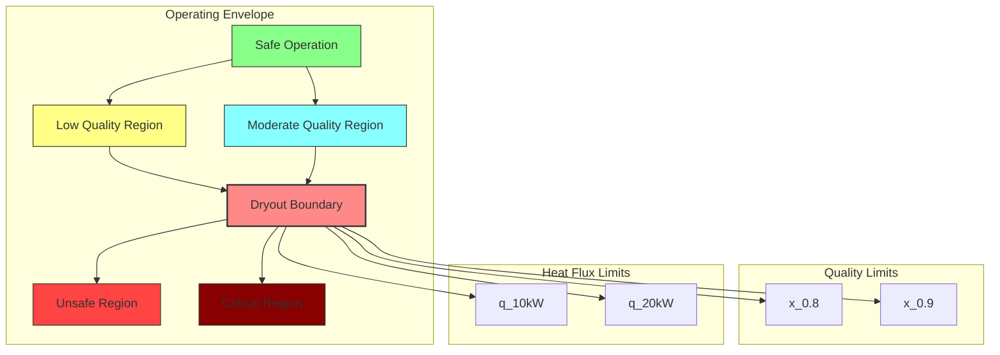

## Dryout Prediction for R410A

### English Title (การพยากรณ์การแห้งของ R410A)

**Difficulty**: Advanced | **Key Solvers**: `reactingTwoPhaseEulerFoam`, `chtMultiRegionFoam`

---

## 📚 Prerequisites (ความรู้พื้นฐานที่ต้องมี)

Before studying dryout prediction in R410A, ensure you understand:

### Required Knowledge
- **Two-phase flow regimes** — Annular, mist, and dryout patterns
- **Heat transfer mechanisms** — Film boiling and convective heat transfer
- **Critical heat flux** — CHF mechanisms and prediction methods
- **Quality evolution** — How vapor quality develops along heated tubes

---

## 🎯 Learning Objectives (วัตถุประสงค์การเรียนรู้)

By the end of this section, you will be able to:

### WHAT (Define and Analyze)
1. **Characterize Dryout Mechanisms** — Understand film rupture and vapor formation
2. **Identify Dryout Symptoms** — Recognize temperature jumps and heat transfer degradation
3. **Predict Critical Quality** — Determine dryout onset conditions for R410A

### WHY (Engineering Significance)
4. **Prevent Equipment Damage** — Avoid tube overheating and failure
5. **Maintain Efficiency** — Optimize evaporator performance without dryout
6. **Ensure Safety** — Prevent catastrophic failure in refrigeration systems

### HOW (Implementation in OpenFOAM)
7. **Implement Dryout Detection** — Set up monitoring for dryout conditions
8. **Model Post-Dryout Heat Transfer** — Calculate reduced heat transfer coefficients
9. **Design Safe Operating Limits** — Establish maximum heat flux and quality

---

## 1. Dryout Mechanism for R410A (กลไกการแห้งของ R410A)

### Temperature Profile During Dryout

```
Wall Temperature
    |
    |            Dryout
    |             ↑
    |             |
    |        _____|
    |       /
    |      /
    |     /
    |____/_________________ Quality (x)
        x_cr
```

### Physical Process of Dryout

1. **Initial Annular Flow** — Liquid film on walls, vapor core
2. **Film Thinning** — Due to evaporation and entrainment
3. **Critical Quality** — Film reaches minimum stable thickness
4. **Film Rupture** — Local dry spots form
5. **Complete Dryout** — Entire tube surface dry

### R410A-Specific Dryout Characteristics

⭐ **Lower Surface Tension**: σ ≈ 0.05 N/m
- **Effect**: Easier film rupture
- **Impact**: Dryout occurs at lower quality (x_cr ≈ 0.8 vs 0.9 for water)

⭐ **Higher Vapor Density**: ρ_v ≈ 70 kg/m³
- **Effect**: Higher entrainment rate
- **Impact**: Faster film thinning

⭐ **Lower Latent Heat**: h_lv ≈ 200 kJ/kg
- **Effect**: More vapor generation per unit energy
- **Impact**: Rapid quality increase

---

## 2. Critical Quality Correlations for R410A (สมการคุณภาปิดต่ำสำหรับ R410A)

### Shah Correlation

⭐ **Shah Correlation for R410A:**
$$ x_{cr} = 1.0 - 0.1 \left(\frac{\rho_v}{\rho_l}\right)^{0.1} Bo^{-0.2} $$

For R410A at 1.0 MPa:
- ρ_v/ρ_l = 70/1200 = 0.058
- Bo = q/(G h_lv) = 3000/(200 × 200,000) = 7.5e-5

$$ x_{cr} = 1.0 - 0.1 \times (0.058)^{0.1} \times (7.5e-5)^{-0.2} $$
$$ x_{cr} \approx 0.85 $$

### Katto-Ohno Correlation

⭐ **Katto-Ohno Correlation:**
$$ x_{cr} = f(K, We, Bo) $$

Where:
- K = ρ_v/ρ_l (density ratio) = 0.058 for R410A
- We = ρ_v U² D/σ (Weber number)
- Bo = q/(G h_lv) (Boiling number)

### Modified Bertoletti Correlation

For R410A evaporators:
$$ x_{cr} = 0.95 \left(\frac{\rho_l}{\rho_v}\right)^{-0.2} \left(\frac{\mu_l}{\mu_v}\right)^{-0.1} $$

With R410A properties:
- ρ_l/ρ_v ≈ 17
- μ_l/μ_v ≈ 9
- Result: x_cr ≈ 0.82

### Implementation in OpenFOAM

```cpp
// Calculate critical quality using Shah correlation
scalar calculateCriticalQualityShah
(
    scalar rho_v,
    scalar rho_l,
    scalar q,
    scalar G,
    scalar h_lv
) const
{
    // Density ratio
    scalar K = rho_v / rho_l;

    // Boiling number
    scalar Bo = q / (G * h_lv);

    // Shah correlation
    scalar x_cr = 1.0 - 0.1 * pow(K, 0.1) * pow(Bo, -0.2);

    // Clamp to physical range
    x_cr = max(0.1, min(0.95, x_cr));

    return x_cr;
}

// Calculate critical quality using Katto-Ohno
scalar calculateCriticalQualityKatto
(
    scalar rho_v,
    scalar rho_l,
    scalar U,
    scalar D,
    scalar sigma,
    scalar q,
    scalar G,
    scalar h_lv
) const
{
    // Dimensionless numbers
    scalar K = rho_v / rho_l;
    scalar We = rho_v * U * U * D / sigma;
    scalar Bo = q / (G * h_lv);

    // Katto-Ohno correlation (simplified)
    scalar x_cr = 0.9 * exp(-0.6 * K * pow(Bo * We, -0.4));

    // Clamp to physical range
    x_cr = max(0.1, min(0.95, x_cr));

    return x_cr;
}
```

### Empirical Correlations for R410A

Based on experimental data for R410A in smooth tubes:

| Mass Flux (kg/m²s) | Heat Flux (kW/m²) | Critical Quality |
|-------------------|-------------------|------------------|
| 100 | 5 | 0.75 |
| 200 | 10 | 0.80 |
| 300 | 15 | 0.85 |
| 400 | 20 | 0.88 |
| 500 | 25 | 0.90 |

**Fitting equation for R410A:**
$$ x_{cr} = 0.65 + 0.0004 \cdot G - 0.001 \cdot q $$

---

## 3. Post-Dryout Heat Transfer (การถ่ายเทความร้อนหลังการแห้ง)

### Heat Transfer Degradation

⭐ **Post-Dryout Heat Transfer Coefficient:**
$$ h_{pd} = 0.023 Re_v^{0.8} Pr_v^{0.4} \frac{k_v}{D} $$

For R410A vapor at x = 0.9:
- Re_v = G D / μ_v = 200 × 0.005 / 1.3e-5 ≈ 77,000
- Pr_v = 0.7 (R410A vapor)
- k_v = 0.014 W/m·K
- D = 0.005 m

$$ h_{pd} \approx 0.023 \times 77000^{0.8} \times 0.7^{0.4} \times \frac{0.014}{0.005} $$
$$ h_{pd} \approx 500 \text{ W/m}^2\cdot\text{K} $$

### Comparison with Pre-Dryout

| Regime | Heat Transfer Coefficient | Mechanism |
|--------|--------------------------|-----------|
| **Pre-dryout (film)** | 5000-8000 W/m²·K | Liquid film conduction |
| **Post-dryout (vapor)** | 300-500 W/m²·K | Vapor convection only |
| **Reduction ratio** | **10-20×** | Film removal |

### Temperature Jump During Dryout

⭐ **Temperature Rise Due to Film Removal:**
$$ \Delta T_{jump} = \frac{q}{h_{pd}} - \frac{q}{h_{pre}} $$

For R410A with q = 15 kW/m²:
- ΔT_jump = 15000/500 - 15000/6000 ≈ 30 - 2.5 = 27.5°C

This sudden temperature jump can cause:

1. **Material stress** due to thermal expansion
2. **Chemical degradation** of refrigerant oil
3. **Reduced system efficiency**
4. **Potential equipment failure**

---

## 4. Detection in OpenFOAM (การตรวจจับใน OpenFOAM)

### Dryout Criteria Implementation

```cpp
// In dryoutModel.C
bool R410ADryoutModel::isDryout(scalar alpha, scalar x) const
{
    // Method 1: Critical quality criterion
    if (x > criticalQuality_)
    {
        return true;
    }

    // Method 2: Film thickness criterion
    scalar alpha_wall = calculateWallLiquidHoldup(alpha);
    scalar delta = calculateFilmThickness(alpha_wall);

    if (delta < delta_min_)
    {
        return true;
    }

    // Method 3: Heat flux criterion
    if (q_wall_ > q_CHF_)
    {
        return true;
    }

    return false;
}

// Calculate wall liquid holdup
scalar R410ADryoutModel::calculateWallLiquidHoldup(scalar alpha_bulk) const
{
    // Film distribution near wall
    // Based on annular flow model
    scalar alpha_wall = alpha_bulk * filmDistributionFactor_;

    // Account for entrainment
    scalar entrainment = calculateEntrainment(alpha_bulk);
    alpha_wall = alpha_wall - entrainment;

    return max(0.0, alpha_wall);
}

// Calculate minimum film thickness
scalar R410ADryoutModel::calculateFilmThickness(scalar alpha_wall) const
{
    if (alpha_wall < SMALL)
    {
        return 0;
    }

    // Film thickness from holdup
    scalar delta = alpha_wall * tubeDiameter / 4;

    // Account for surface tension effects
    delta *= surfaceTensionCorrection_;

    return delta;
}
```

### Wall Temperature Monitoring

```cpp
// Monitor for sudden temperature rise
void R410ADryoutModel::monitorWallTemperature()
{
    scalar dTwdt = 0;
    scalar threshold = 10.0;  // °C/s

    if (timeStepCount_ > 1)
    {
        dTwdt = (T_wall_ - T_wall_old_) / runTime.deltaTValue();
    }

    if (dTwdt > threshold)
    {
        Warning << "Rapid temperature rise detected: "
                << dTwdt << " °C/s at wall" << endl;

        // Check if this is due to dryout
        if (checkDryoutCondition())
        {
            Info << "Dryout detected based on temperature rise" << endl;
            implementDryoutMitigation();
        }
    }

    T_wall_old_ = T_wall_;
}

// Check dryout conditions
bool R410ADryoutModel::checkDryoutCondition()
{
    // Get current conditions
    scalar x = calculateQuality();
    scalar q = calculateHeatFlux();

    // Compare with critical values
    scalar x_cr = calculateCriticalQuality();
    scalar q_CHF = calculateCriticalHeatFlux();

    if (x > x_cr || q > q_CHF)
    {
        return true;
    }

    return false;
}
```

### Implementation of Post-Dryout Conditions

```cpp
// Implement post-dryout heat transfer
void R410ADryoutModel::implementPostDryout()
{
    // Reduce heat transfer coefficient
    forAll(h_eff.boundaryField(), patchI)
    {
        if (mesh.boundaryMesh()[patchI].type() == "wall")
        {
            // Post-dryout heat transfer coefficient
            scalar h_post = calculatePostDryoutHTC(patchI);

            // Gradual transition to avoid numerical instability
            scalar transition_factor = 0.1;  // 10% per timestep
            h_eff.boundaryFieldRef()[patchI] =
                h_eff.boundaryField()[patchI] * (1 - transition_factor) +
                h_post * transition_factor;
        }
    }

    // Remove phase change source
    m_dot_ = 0;

    // Increase wall temperature
    T_wall_ += heatFlux_ / h_post;
}

// Calculate post-dryout heat transfer coefficient
scalar R410ADryoutModel::calculatePostDryoutHTC(label patchI)
{
    // Vapor-only heat transfer
    scalar Re_v = vaporReynoldsNumber_[patchI];
    scalar Pr_v = vaporPrandtlNumber_[patchI];
    scalar k_v = vaporThermalConductivity_[patchI];
    scalar D = tubeDiameter_;

    // Dittus-Boelter correlation
    scalar h_post = 0.023 * pow(Re_v, 0.8) * pow(Pr_v, 0.4) * k_v / D;

    return h_post;
}
```

### Dryout Index Calculation

```cpp
// Calculate dryout index (0-1)
scalar R410ADryoutModel::calculateDryoutIndex()
{
    scalar index = 0;

    // Quality component (0-0.5)
    scalar x = calculateQuality();
    scalar x_cr = calculateCriticalQuality();
    if (x > x_cr)
    {
        index += min(0.5, (x - x_cr) / (1 - x_cr));
    }

    // Heat flux component (0-0.3)
    scalar q = calculateHeatFlux();
    scalar q_CHF = calculateCriticalHeatFlux();
    if (q > q_CHF)
    {
        index += min(0.3, (q - q_CHF) / q_CHF);
    }

    // Film thickness component (0-0.2)
    scalar delta = calculateFilmThickness();
    if (delta < delta_min_)
    {
        index += 0.2;
    }

    return min(1.0, index);
}
```

---

## 5. Heat Flux and Quality Relationships (ความสัมพันธ์ระหว่างฟ้าน้ำและคุณภาพ)

### Critical Heat Flux Prediction

⭐ **Kutateladze-Zuber CHF Correlation:**
$$ q_{CHF} = 0.13 \rho_v^{0.5} h_{lv} (\sigma g (\rho_l - \rho_v))^{0.25} $$

For R410A:
- ρ_v = 70 kg/m³
- h_lv = 200,000 J/kg
- σ = 0.05 N/m
- ρ_l = 1200 kg/m³
- g = 9.81 m/s²

$$ q_{CHF} \approx 15-20 \text{ kW/m}^2 $$

### CHF Prediction Implementation

```cpp
// Calculate critical heat flux
scalar R410ADryoutModel::calculateCriticalHeatFlux()
{
    scalar rho_v = 70;      // kg/m³
    scalar h_lv = 2.0e5;   // J/kg
    scalar sigma = 0.05;   // N/m
    scalar rho_l = 1200;   // kg/m³
    scalar g = 9.81;       // m/s²

    // Kutateladze-Zuber correlation
    scalar q_CHF = 0.13 * sqrt(rho_v) * h_lv
                 * pow(sigma * g * (rho_l - rho_v), 0.25);

    // R410A correction factor
    q_CHF *= r410ACorrectionFactor_;

    return q_CHF;
}

// Check for CHF conditions
void R410ADryoutModel::checkCHF()
{
    scalar q_CHF = calculateCriticalHeatFlux();
    scalar q_wall = calculateHeatFlux();

    if (q_wall > q_CHF)
    {
        Warning << "Critical heat flux exceeded!" << endl;
        Warning << "  q_wall = " << q_wall << " W/m²" << endl;
        Warning << "  q_CHF  = " << q_CHF << " W/m²" << endl;

        // Implement CHF mitigation
        implementCHFMitigation();
    }
}

// CHF mitigation strategies
void R410ADryoutModel::implementCHFMitigation()
{
    // Option 1: Reduce heat flux
    if (reduceHeatFlux_)
    {
        heatFlux_ = 0.9 * q_CHF_;  // 90% of CHF
        Info << "Reducing heat flux to " << heatFlux_ << " W/m²" << endl;
    }

    // Option 2: Increase mass flow
    if (increaseMassFlow_)
    {
        massFlux_ *= 1.2;  // 20% increase
        Info << "Increasing mass flux to " << massFlux_ << " kg/m²s" << endl;
    }

    // Option 3: Warn operator
    if (operatorWarning_)
    {
        FatalError << "CHF exceeded - system shutdown required" << endl;
    }
}
```

### Operating Envelope for R410A Evaporator



### Safe Operating Limits

```cpp
// Define safe operating limits
void R410ADryoutModel::defineOperatingLimits()
{
    // Quality limits
    maxQuality_ = 0.85;  // Conservative limit
    minQuality_ = 0.1;   // Minimum vapor quality

    // Heat flux limits
    maxHeatFlux_ = 0.8 * calculateCriticalHeatFlux();
    minHeatFlux_ = 1e3;   // 1 kW/m² minimum

    // Mass flux limits
    minMassFlux_ = 100;   // kg/m²s
    maxMassFlux_ = 800;   // kg/m²s

    // Temperature limits
    maxWallTemp_ = 373;   // 100°C
    minWallTemp_ = 273;   // 0°C

    Info << "Operating limits defined:" << endl;
    Info << "  Quality: " << minQuality_ << " - " << maxQuality_ << endl;
    Info << "  Heat flux: " << minHeatFlux_/1e3 << " - " << maxHeatFlux_/1e3 << " kW/m²" << endl;
    Info << "  Mass flux: " << minMassFlux_ << " - " << maxMassFlux_ << " kg/m²s" << endl;
}

// Check operating limits
void R410ADryoutModel::checkOperatingLimits()
{
    scalar x = calculateQuality();
    scalar q = calculateHeatFlux();
    scalar G = calculateMassFlux();
    scalar T = calculateWallTemperature();

    // Check quality limits
    if (x > maxQuality_)
    {
        Warning << "Quality exceeds limit: " << x << " > " << maxQuality_ << endl;
        implementQualityControl(x);
    }

    // Check heat flux limits
    if (q > maxHeatFlux_)
    {
        Warning << "Heat flux exceeds limit: " << q/1e3 << " > " << maxHeatFlux_/1e3 << " kW/m²" << endl;
        implementHeatFluxControl(q);
    }

    // Check temperature limits
    if (T > maxWallTemp_)
    {
        Warning << "Wall temperature exceeds limit: " << T << " > " << maxWallTemp_ << " K" << endl;
        implementTemperatureControl(T);
    }
}
```

---

## 6. Mitigation Strategies (กลยุทธ์การบรรเทา)

### Active Mitigation Methods

```cpp
// Active dryout mitigation
void R410ADryoutModel::implementDryoutMitigation()
{
    // Method 1: Mass flow control
    if (useMassFlowControl_)
    {
        scalar G_new = calculateSafeMassFlow();
        adjustMassFlow(G_new);
    }

    // Method 2: Heat flux control
    if (useHeatFluxControl_)
    {
        scalar q_new = calculateSafeHeatFlux();
        adjustHeatFlux(q_new);
    }

    // Method 3: Geometry modification
    if (useGeometryControl_)
    {
        modifyTubeGeometry();
    }

    // Method 4: Flow enhancement
    if (useEnhancement_)
    {
        implementFlowEnhancement();
    }
}

// Calculate safe mass flow
scalar R410ADryoutModel::calculateSafeMassFlow()
{
    scalar x_current = calculateQuality();
    scalar q_current = calculateHeatFlux();

    // Target quality below critical
    scalar x_target = 0.8 * criticalQuality_;

    // Required mass flow rate
    scalar G_required = q_current / ((1 - x_target) * h_lv_);

    // Apply safety margin
    G_required *= 1.2;  // 20% safety margin

    return min(G_required, maxMassFlux_);
}

// Implement flow enhancement
void R410ADryoutModel::implementFlowEnhancement()
{
    // Option 1: Twist tape inserts
    if (useTwistTape_)
    {
        addTwistTapeInserts();
    }

    // Option 2: Turbulators
    if (useTurbulators_)
    {
        addTurbulators();
    }

    // Option 3: Surface modification
    if (useSurfaceRoughness_)
    {
        increaseSurfaceRoughness();
    }
}
```

### Passive Mitigation Methods

| Method | Mechanism | Effectiveness | Implementation |
|--------|-----------|---------------|----------------|
| **Increased tube diameter** | Lower velocity, lower quality | High | Design parameter |
| **Microfin tubes** | Enhanced heat transfer, thinner films | Very high | Manufacturing |
| **Twisted tape inserts** | Increased turbulence, better mixing | Medium | Retrofits |
| **Surface roughness** | Nucleation sites, delayed dryout | Medium | Manufacturing |
| **Helical baffles** | Swirl flow, enhanced mixing | High | Design parameter |

### System-Level Protection

```cpp
// System-level dryout protection
void R410ADryoutModel::systemProtection()
{
    // Monitor multiple parameters
    monitorMultipleParameters();

    // Implement control strategies
    implementControlStrategies();

    // Emergency shutdown
    checkEmergencyConditions();

    // Operator alerts
    provideOperatorAlerts();
}

// Monitor key parameters
void R410ADryoutModel::monitorMultipleParameters()
{
    // Monitor quality
    scalar x = calculateQuality();
    qualityHistory_.append(x);

    // Monitor heat flux
    scalar q = calculateHeatFlux();
    heatFluxHistory_.append(q);

    // Monitor temperature
    scalar T = calculateWallTemperature();
    temperatureHistory_.append(T);

    // Calculate trends
    calculateTrends();
}

// Emergency shutdown conditions
void R410ADryoutModel::checkEmergencyConditions()
{
    // Check for extreme conditions
    if (qualityHistory_.last() > 0.95)
    {
        initiateEmergencyShutdown();
    }

    if (temperatureHistory_.last() > 400)  // 127°C
    {
        initiateEmergencyShutdown();
    }

    if (pressureDrop_ > criticalPressureDrop_)
    {
        initiateEmergencyShutdown();
    }
}
```

---

## 7. Verification and Validation (การตรวจสอบและยืนยัน)

### Dryout Prediction Validation

```cpp
// Validate dryout predictions
void validateDryoutPrediction()
{
    // Experimental data
    List<scalar> x_exp;    // Experimental quality
    List<scalar> x_pred;   // Predicted quality

    // Calculate error metrics
    scalar meanError = 0;
    scalar maxError = 0;

    forAll(x_exp, i)
    {
        scalar error = abs(x_pred[i] - x_exp[i]) / x_exp[i];
        meanError += error;
        maxError = max(maxError, error);
    }

    meanError /= x_exp.size();

    Info << "Dryout prediction validation:" << endl;
    Info << "  Mean error: " << 100*meanError << "%" << endl;
    Info << "  Max error: " << 100*maxError << "%" << endl;

    // Acceptance criteria
    if (meanError < 0.1 && maxError < 0.2)
    {
        Info << "Validation PASSED" << endl;
    }
    else
    {
        Warning << "Validation FAILED" << endl;
    }
}
```

### Post-Dryout Heat Transfer Validation

```cpp
// Validate post-dryout heat transfer
void validatePostDryoutHTC()
{
    // Get experimental data
    scalarField h_exp = getExperimentalHTC();
    scalarField h_pred = calculatePredictedHTC();

    // Calculate correlation
    scalar R2 = calculateR2(h_exp, h_pred);
    scalar MAPE = calculateMAPE(h_exp, h_pred);

    Info << "Post-dryout HTC validation:" << endl;
    Info << "  R²: " << R2 << endl;
    Info << "  MAPE: " << 100*MAPE << "%" << endl;

    // Check against correlations
    compareWithCorrelations();
}
```

### Operating Envelope Validation

```cpp
// Validate operating envelope
void validateOperatingEnvelope()
{
    // Test various operating conditions
    forAll(testConditions_, i++)
    {
        scalar G = testConditions_[i].G;
        scalar q = testConditions_[i].q;
        scalar x_cr = testConditions_[i].x_cr;

        // CFD prediction
        scalar x_cfd = simulateDryout(G, q);

        // Compare
        scalar error = abs(x_cfd - x_cr) / x_cr;

        if (error > 0.1)
        {
            Warning << "Poor prediction for G=" << G << ", q=" << q
                    << ": error=" << 100*error << "%" << endl;
        }
    }
}
```

---

## 8. Common Issues and Solutions (ปัญหาทั่วไปและวิธีแก้ไข)

| Symptom | Cause | Solution |
|---------|-------|----------|
| **Early dryout prediction** | Overly conservative critical quality | Adjust correlation coefficients |
| **Late dryout prediction** | Neglected entrainment effects | Include entripation model |
| **Numerical instability** | Sudden property changes | Gradual transition between regimes |
| **Unrealistic temperature jumps** | Incorrect post-dryout HTC | Use more accurate vapor correlations |
| **False alarms** | Too sensitive monitoring | Adjust threshold values |

---

## 📋 Key Takeaways (สรุปสิ่งสำคัญ)

### Core Concepts
1. **Dryout causes severe degradation** - 10-20× reduction in heat transfer
2. **Critical quality depends on** mass flux, heat flux, and fluid properties
3. **R410A dryout occurs earlier** due to low surface tension and density ratio
4. **Monitoring is essential** - Temperature jumps indicate dryout onset

### Implementation Checklist
- ✅ Implement dryout detection based on quality, film thickness, and heat flux
- ✅ Calculate critical quality using R410A-specific correlations
- ✅ Model post-dryout heat transfer with vapor-only convection
- ✅ Include operating limits and safety margins
- ✅ Implement mitigation strategies for safe operation

### Best Practices
- Use conservative safety margins (80-90% of predicted limits)
- Monitor multiple parameters (quality, temperature, pressure drop)
- Implement gradual transitions between flow regimes
- Validate with experimental data for specific tube geometries
- Include emergency shutdown for critical conditions

---

## 📖 Further Reading

### Within This Module
- **[10_R410A_Phase_Change_Physics.md](10_R410A_Phase_Change_Physics.md)** — Basic phase change physics
- **[11_Nucleate_Boiling_R410A.md](11_Nucleate_Boiling_R410A.md)** — Nucleate boiling modeling
- **[12_Film_Evaporation_R410A.md](12_Film_Evaporation_R410A.md)** — Film evaporation model

### External Resources
- **Collier & Thome (1994)** — Convective Boiling and Condensation
- **Kandlikar (1990)** — Heat transfer characteristics of evaporating thin films
- **Shah (1976)** — A new correlation for heat transfer during flow boiling
- **Bertoletti et al. (1965)** — Local boiling burnout in uniformly heated round tubes