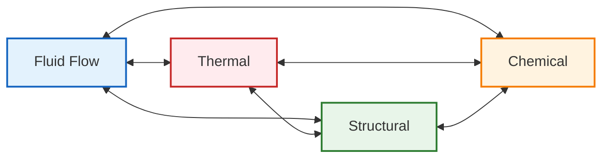
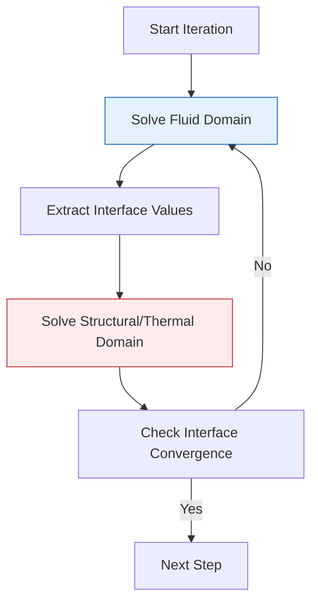

# Coupled Physics Fundamentals

## บทนำสู่การเชื่อมโยง Multi-Physics

การเชื่อมโยง **Multi-Physics** ใน OpenFOAM เป็นการแก้ปัญหาหลายปรากฏการณ์ทางฟิสิกส์ที่โต้ตอบกันพร้อมกัน ความสามารถนี้จำเป็นสำหรับการจำลอง CFD ที่สมจริงเมื่อ:

- **การไหลของของไหล** (Fluid flow)
- **การถ่ายเทความร้อน** (Heat transfer)
- **ปฏิกิริยาเคมี** (Chemical reactions)
- **กลศาสตร์โครงสร้าง** (Structural mechanics)

เกิดขึ้นพร้อมกัน สถาปัตยกรรมของ OpenFOAM ให้กรอบที่แข็งแกร่งสำหรับการนำไปใช้งาน Multi-Physics ผ่านการออกแบบแบบโมดูลาร์และไลบรารี solver ที่ครอบคลุม



> [!INFO] **แหล่งที่มาหลัก**
> เนื้อหานี้รวบรวมจากความรู้เชิงลึกเกี่ยวกับสถาปัตยกรรม `chtMultiRegionFoam` และกรอบการทำงาน FSI ใน OpenFOAM

---

## ประเภทของการเชื่อมโยงทางฟิสิกส์

### Fluid-Structure Interaction (FSI)

Fluid-Structure Interaction เป็นการเชื่อมโยงระหว่างพลศาสตร์ของไหลและกลศาสตร์ของแข็ง

#### แบบ One-way Coupling

แรงของไหลกระทำโครงสร้างโดยไม่มีการ feedback:

$$\mathbf{F}_{\text{fluid}} = \int_{\partial\Omega} (-p\mathbf{I} + \boldsymbol{\tau}) \cdot \mathbf{n} \, \mathrm{d}S$$

- **เหมาะสำหรับ**: การวิเคราะห์โครงสร้างที่ไม่ได้เปลี่ยนรูปร่างมากนัก
- **ตัวอย่าง**: การวิเคราะห์แรงลมบนอาคาร

#### แบบ Two-way Coupling

ต้องการการแก้ปัญหาของไหลและโครงสร้างพร้อมกัน:

$$\rho_f \left( \frac{\partial \mathbf{u}_f}{\partial t} + (\mathbf{u}_f \cdot \nabla) \mathbf{u}_f \right) = -\nabla p_f + \mu_f \nabla^2 \mathbf{u}_f + \mathbf{f}_{b,f}$$

$$\rho_s \frac{\partial^2 \mathbf{u}_s}{\partial t^2} = \nabla \cdot \boldsymbol{\sigma}_s + \mathbf{f}_{b,s}$$

โดยที่:
- $\rho_f, \rho_s$ = ความหนาแน่นของของไหลและของแข็ง
- $\mathbf{u}_f, \mathbf{u}_s$ = ความเร็วของไหลและการกระจัดของของแข็ง
- $p_f$ = ความดันของไหล
- $\boldsymbol{\sigma}_s$ = เทนเซอร์ความเค้นของของแข็ง

**Solver ใน OpenFOAM**:

| Solver | ประเภท | การใช้งาน |
|--------|--------|-------------|
| `solidDisplacementFoam` | One-way | การวิเคราะห์โครงสร้าง |
| `fluidStructureInteractionFoam` | Two-way | การโต้ตอบแบบไดนามิก |

### Thermal-Fluid Coupling

การเชื่อมโยง Thermal-fluid รับมือกับปฏิสัมพันธ์ระหว่างการถ่ายเทความร้อนและการไหลของของไหล

#### การพาความร้อนตามธรรมชาติ (Natural Convection)

แรงลอยตนขับเคลื่อนการไหล:

$$\rho \left( \frac{\partial \mathbf{u}}{\partial t} + (\mathbf{u} \cdot \nabla) \mathbf{u} \right) = -\nabla p + \mu \nabla^2 \mathbf{u} + \rho \mathbf{g} \beta (T - T_{ref})$$

$$\rho c_p \left( \frac{\partial T}{\partial t} + \mathbf{u} \cdot \nabla T \right) = k \nabla^2 T + Q$$

#### การพาความร้อนแบบบังคับ (Forced Convection)

การไหลภายนอกขับเคลื่อนการถ่ายเทความร้อน:

$$\text{Nu} = \frac{hL}{k} = f(\text{Re}, \text{Pr})$$

โดยที่:
- Nu = เลข Nusselt (อัตราส่วนการถ่ายเทความร้อน)
- Re = เลข Reynolds (อัตราส่วนความเฉื่อยต่อแรงเฉือน)
- Pr = เลข Prandtl (อัตราส่วนการแพร่กระจายโมเมนตัมต่อความร้อน)

**Solver สำหรับ Thermal-Fluid Coupling**:

| Solver | อัลกอริทึม | ความสามารถพิเศษ |
|--------|-------------|------------------|
| `buoyantSimpleFoam` | SIMPLE | สถานะคงที่ |
| `buoyantPimpleFoam` | PIMPLE | ไม่คงที่ |
| `reactingFoam` | PISO | ปฏิกิริยาเคมี |

---

## กลยุทธ์การเชื่อมโยง

### Segregated (Iterative) Coupling



แนวทาง Segregated แก้ปัญหาโดเมนฟิสิกส์แต่ละอย่างตามลำดับภายในแต่ละ time step

#### อัลกอริทึม Segregated Thermal-Fluid Coupling

```cpp
// Pseudo-code for segregated thermal-fluid coupling
for (int timeStep = 0; timeStep < nTimeSteps; timeStep++) {
    for (int couplingIter = 0; couplingIter < maxCouplingIter; couplingIter++) {
        // Step 1: Solve momentum equation with current temperature field
        solve(UEqn == -fvc::grad(p) + buoyancyForce(T));

        // Step 2: Solve pressure-velocity coupling (SIMPLE/PISO)
        solve(pEqn);

        // Step 3: Solve energy equation with current velocity field
        solve(TEqn == fvc::div(phi, T) + diffusionTerm);

        // Step 4: Check coupling convergence
        if (converged) break;
    }
}
```

**ข้อดี**:
- ✅ การนำไปใช้งานแบบโมดูลาร์
- ✅ ความต้องการหน่วยความจำต่ำกว่า
- ✅ กลยุทธ์การผ่อนคลายที่ยืดหยุ่น

**ข้อเสีย**:
- ❌ อาจต้องการการวนซ้ำการเชื่อมโยงหลายครั้ง
- ❌ ปัญหาการลู่เข้าสำหรับปัญหาที่เชื่อมโยงแน่นหนา

### Monolithic (Coupled) Coupling

แนวทาง Monolithic รวบรวมสมการฟิสิกส์ทั้งหมดเข้าเป็นระบบเชื่อมโยงเดียว

#### สมการ Block Coupled System

$$\begin{bmatrix}
\mathbf{A}_{uu} & \mathbf{A}_{up} & \mathbf{A}_{uT} \\
\mathbf{A}_{pu} & \mathbf{A}_{pp} & \mathbf{A}_{pT} \\
\mathbf{A}_{Tu} & \mathbf{A}_{Tp} & \mathbf{A}_{TT}
\end{bmatrix}
\begin{bmatrix}
delta \mathbf{u} \\
delta p \\
delta T
\end{bmatrix}
=
\begin{bmatrix}
\mathbf{r}_u \\
\mathbf{r}_p \\
\mathbf{r}_T
\end{bmatrix}$$

#### การนำไปใช้ใน OpenFOAM

```cpp
// Block coupled solver approach in OpenFOAM
BlockLduMatrix<vector, scalar, scalar> blockMatrix(nCells);

// Assemble coupled equations
blockMatrix.insertBlock(UEqn, 0, 0);  // Momentum equation
blockMatrix.insertBlock(pEqn, 1, 1);  // Continuity equation
blockMatrix.insertBlock(TEqn, 2, 2);  // Energy equation

// Add coupling terms
blockMatrix.insertBlock(couplingUT, 0, 2);  // Temperature-momentum coupling
blockMatrix.insertBlock(couplingTU, 2, 0);  // Momentum-temperature coupling

// Solve coupled system
BlockSolverPerformance<vector, scalar> solverPerf = blockSolver.solve(blockMatrix);
```

---

## อัลกอริทึมการแก้ปัญหาและเสถียรภาพ

### Fixed-Point Iteration

Fixed-point iteration เป็นวิธีการเชื่อมโยงที่ง่ายที่สุด

**สมการพื้นฐาน**:
$$\mathbf{x}^{k+1} = \mathbf{G}(\mathbf{x}^k)$$

**เกณฑ์การลู่เข้า**:
$$\|\mathbf{x}^{k+1} - \mathbf{x}^k| < \varepsilon$$

**การเพิ่มเสถียรภาพผ่านการผ่อนคลาย**:
$$\mathbf{x}^{k+1} = (1-alpha) \mathbf{x}^k + alpha \mathbf{G}(\mathbf{x}^k)$$

### Aitken's Δ² Acceleration

วิธีของ Aitken เร่งการลู่เข้าของการวนซ้ำแบบ fixed-point

**สูตร Aitken**:
$$alpha^{k} = -alpha^{k-1} \frac{(mathbf{r}^k, mathbf{r}^k - mathbf{r}^{k-1})}{\|\mathbf{r}^k - mathbf{r}^{k-1}\|^2}$$
$$\mathbf{x}^{k+1} = \mathbf{x}^k + alpha^k mathbf{r}^k$$

---

## เงื่อนไขขอบเขตสำหรับ Multi-Physics ที่เชื่อมโยง

### เงื่อนไขอินเตอร์เฟซ

ปัญหา Multi-Physics มักต้องการเงื่อนไขอินเตอร์เฟซพิเศษ

#### อินเตอร์เฟซ Thermal-fluid

**สภาพต่อเนื่องของอุณหภูมิ**:
$$T_{\text{fluid}}|_{\Gamma} = T_{\text{solid}}|_{\Gamma}$$

**สภาพต่อเนื่องของการไหลความร้อน**:
$$-k_f frac{partial T_f}{partial n}bigg|_{\Gamma} = -k_s frac{partial T_s}{partial n}bigg|_{\Gamma}$$

#### อินเตอร์เฟซ Fluid-structure

**สภาพต่อเนื่องของความเร็ว/การกระจัด**:
$$\mathbf{u}_{\text{fluid}}|_{\Gamma} = frac{partial mathbf{d}_{\text{solid}}}{partial t}bigg|_{\Gamma}$$

**สภาพต่อเนื่องของความเค้น**:
$$boldsymbol{sigma}_{\text{fluid}} cdot mathbf{n}|_{\Gamma} = boldsymbol{sigma}_{\text{solid}} cdot mathbf{n}|_{\Gamma}$$

### Boundary Condition สำหรับ Coupled Physics

| ประเภท | คลาสใน OpenFOAM | การใช้งาน |
|--------|-------------------|-------------|
| Thermal coupling | `thermalBaffleFvPatch` | การถ่ายเทความร้อนผ่านผนัง |
| FSI interface | `solidInteractionFvPatch` | การโต้ตอบของไหล-โครงสร้าง |
| Dynamic properties | `timeVaryingMappedFixedValue` | คุณสมบัติแปรผันตามเวลา |

---

## การจำลองความปั่นป่วนในการไหลที่เชื่อมโยง

### การประมาณของบูสซีเนสก์ (Boussinesq Approximation)

**สมการความหนาแน่นแปรผัน**:
$$rho(mathbf{x},t) = rho_0[1 - beta(T - T_0)]$$

**สัมประสิทธิ์การขยายตัวทางความร้อน**:
$$beta = -frac{1}{rho}left(frac{partial rho}{partial T}right)_p$$

**ข้อดีของการประมาณ Boussinesq**:
- ✅ ลดความซับซ้อนของสมการ
- ✅ เหมาะสำหรับความแตกต่างของอุณหภูมิเล็กน้อย (ΔT/T < 0.1)
- ✅ ประหยัดเวลาคำนวณ

---

## สถาปัตยกรรม Solver แบบกำหนดเองที่เชื่อมโยง

```cpp
class myCoupledSolver
{
    // Field references
    volVectorField& U_;
    volScalarField& p_;
    volScalarField& T_;

    // Physics models
    autoPtr<incompressible::turbulenceModel> turbulence_;
    autoPtr<thermophysicalModel> thermo_;

    // Coupling parameters
    scalar couplingTolerance_;
    int maxCouplingIterations_;
    scalar relaxationFactor_;

public:
    void solveCoupledSystem()
    {
        // Outer coupling loop
        for (int couplingIter = 0; couplingIter < maxCouplingIterations_; couplingIter++)
        {
            // Store previous iteration
            volVectorField Uprev = U_;
            volScalarField Tprev = T_;

            // Step 1: Solve momentum with buoyancy
            solveMomentum();

            // Step 2: Solve pressure-velocity coupling
            solvePressureVelocity();

            // Step 3: Solve energy equation
            solveEnergy();

            // Step 4: Apply relaxation
            U_ = relaxationFactor_ * U_ + (1 - relaxationFactor_) * Uprev;
            T_ = relaxationFactor_ * T_ + (1 - relaxationFactor_) * Tprev;

            // Step 5: Check convergence
            if (checkCouplingConvergence()) break;
        }
    }

private:
    void solveMomentum()
    {
        // Solve momentum with thermal buoyancy
        fvVectorMatrix UEqn
        (
            fvm::ddt(U_) + fvm::div(phi_, U_)
          + turbulence_->divDevReff(U_)
         ==
            -fvc::grad(p_)
          + thermo_->buoyancyForce(T_)
        );

        UEqn.relax();
        solve(UEqn == -fvc::grad(p_));
    }
};
```

---

## การตรวจสอบและการยืนยันความถูกต้อง

### ปัญหา Benchmark

#### การพาความร้อนตามธรรมชาติในช่อง (Natural Convection in Cavity)

**การตั้งค่าปัญหา**:
- **เรขาคณิต**: ช่องสี่เหลี่ยมจัตุรัส (L×L)
- **ขอบเขต**: ผนังซ้ายร้อน (T_h), ผนังขวาเย็น (T_c), ผนังบน/ล่างฉนวน
- **ช่วงเลข Rayleigh**: $10^3 leq Ra leq 10^8$

**สมการที่ใช้**:
$$Ra = frac{g beta (T_h - T_c) L^3}{nu alpha}$$

### เมตริกความผิดพลาด

#### L2 Norm สำหรับตัวแปรฟิลด์

$$\|e\|_{L_2} = sqrt{frac{1}{V}int_{Omega} (u_{text{numerical}} - u_{text{reference}})^2 , mathrm{d}V}$$

**เกณฑ์ความแม่นยำ**:
- **L2 error < 1%**: การจำลองคุณภาพสูง
- **L2 error < 5%**: การจำลองความแม่นยำระดับวิศวกรรม
- **L2 error > 10%**: ต้องการปรับปรุง网格หรือวิธีการ

---

## ปัญหาทั่วไปและวิธีแก้ไข

### ความล้มเหลวในการแมป (Mapping Failures)

**อาการของปัญหา**: ข้อความแสดงข้อผิดพลาด "Cannot find sample region" หรือ "Failed to map patch to region"

**การแก้ไข**:
```cpp
// ตรวจสอบชื่อ region ให้ตรงกัน
type            mapped;
sampleRegion    heaterRegion;  // ต้องตรงกับชื่อ region อย่างแน่นอน
samplePatch     heaterOutlet;  // ต้องตรงกับชื่อ patch อย่างแน่นอน
```

### ความไม่เสถียรทางตัวเลข (Numerical Instability)

**อาการของปัญหา**: การสั่นของอุณหภูมิเพิ่มขึ้นที่ขอบเขตของอินเตอร์เฟซ

**การควบคุม Relaxation**:
```cpp
relaxationFactors
{
    equations     1;
    U             0.7;
    h             0.5;
    k             0.7;
    epsilon       0.7;
}
```

### การ Convergence ช้า (Slow Convergence)

**อาการของปัญหา**: Coupling residuals สูง (1e-3 หรือสูงกว่า) ยังคงอยู่

**Aitken Acceleration**:
```cpp
PIMPLE
{
    nOuterCorrectors  50;
    nCorrectors      2;
    nNonOrthogonalCorrectors 0;
    aitkenAcceleration on;      // เปิดการเร่ง
}
```

---

## แหล่งอ้างอิงและทรัพยากรเพิ่มเติม

เนื้อหานี้เป็นส่วนหนึ่งของโมดูลการเรียนรู้ OpenFOAM ขั้นสูงเกี่ยวกับ Multi-Physics Coupling สำหรับข้อมูลเพิ่มเติม สามารถศึกษาได้ที่:

- **[[01_FILE_PURPOSE]]** - วัตถุประสงค์และขอบเขตของเอกสารนี้
- **[[02_LEARNING_OBJECTIVES]]** - เป้าหมายการเรียนรู้โดยละเอียด
- **[[Blueprint_chtMultiRegionFoam_Solver_Architecture]]** - สถาปัตยกรรม Solver CHT เชิงลึก
- **[[Why_This_Design_Architectural_Tradeoffs]]** - การวิเคราะห์การตัดสินใจดีไซน์

---

## Key Takeaways

> [!TIP] **ประเด็นสำคัญ**
> 1. **Multi-Physics Coupling** จำเป็นเมื่อฟิสิกส์หลายด้านโต้ตอบกันผ่านอินเตอร์เฟซที่ใช้ร่วมกัน
> 2. **Segregated vs Monolithic**: เลือกวิธีการแก้ปัญหาตามความแข็งแกร่งของการเชื่อมโยง
> 3. **เสถียรภาพเชิงตัวเลข**: เป็นความท้าทายหลักในปัญหา FSI และ CHT
> 4. **การตรวจสอบความถูกต้อง**: จำเป็นสำหรับการรับประกันคุณภาพของการจำลอง
