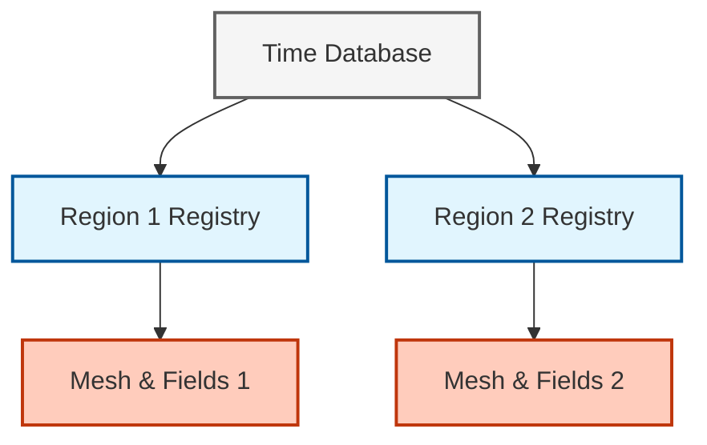

# ภาพรวมการคัปปลิงแบบหลายฟิสิกส์ (Multi-Physics Coupling: An Overview)

## บทนำสู่คัปปลิงแบบหลายฟิสิกส์ (Introduction to Coupled Physics)

**การคัปปลิงแบบหลายฟิสิกส์ (Multi-physics coupling)** ใน OpenFOAM หมายถึงการบูรณาการโดเมนทางฟิสิกส์ที่หลากหลายเข้าด้วยกันภายใต้กรอบงานการจำลองที่รวมเป็นหนึ่งเดียว ความสามารถขั้นสูงนี้ช่วยให้สามารถจำลองระบบวิศวกรรมที่ซับซ้อนซึ่งมีองค์ประกอบดังนี้:

- **การไหลของไหล (Fluid flow)** (สมการ Navier-Stokes)
- **การถ่ายโอนความร้อน (Heat transfer)** (การนำ, การพา, การแผ่รังสี)
- **กลศาสตร์โครงสร้าง (Structural mechanics)** (ความยืดหยุ่น, ความเหนียว)
- **สนามแม่เหล็กไฟฟ้า (Electromagnetic fields)** (สมการของ Maxwell)

องค์ประกอบเหล่านี้จะมีปฏิสัมพันธ์กันพร้อมกันผ่านขอบเขตที่ใช้ร่วมกัน (shared boundaries) หรือตามปริมาตร (volumetrically) ตลอดโดเมนการคำนวณ

### ความท้าทายทางวิศวกรรม

พิจารณา **ระบบหล่อเย็นใบพัดเทอร์ไบน์**: ก๊าซจากการเผาไหม้ที่ร้อนจัดไหลผ่านพื้นผิวใบพัด ในขณะที่ช่องหล่อเย็นภายในจะมีอากาศที่เย็นกว่าไหลเวียนอยู่ วัสดุของใบพัดจะเผชิญกับ:

- **เกรเดียนต์อุณหภูมิที่รุนแรง (Extreme temperature gradients)** (ความเค้นจากความร้อน - Thermal stress)
- **ภาระแรงดัน (Pressure loading)** จากการไหลของก๊าซ (การเสียรูปของโครงสร้าง - Structural deformation)
- **ประสิทธิภาพการหล่อเย็น (Cooling effectiveness)** ที่ขึ้นอยู่ทั้งกับการไหลและการนำความร้อน (CHT)

วิธีการแบบฟิสิกส์เดี่ยว (single-physics) แบบดั้งเดิมไม่สามารถจับภาพปฏิสัมพันธ์เหล่านี้ได้ นำไปสู่การ **ออกแบบที่เผื่อไว้มากเกินไป (over-conservative designs)** (ลดประสิทธิภาพ) หรือ **ความล้มเหลวที่รุนแรง (catastrophic failures)** (การคาดการณ์อุณหภูมิต่ำกว่าความเป็นจริง)

### พื้นฐานทางคณิตศาสตร์

ปัญหาแบบคัปปลิง (Coupled problems) จำเป็นต้องแก้ระบบสมการเชิงอนุพันธ์ย่อย (PDEs) ที่ตัวแปรจากฟิสิกส์ที่ต่างกันมีปฏิสัมพันธ์กัน:

#### สมการในโดเมนของไหล (Fluid Domain Equations)

**การอนุรักษ์โมเมนตัม:**
$$\rho_f \left( \frac{\partial \mathbf{u}_f}{\partial t} + (\mathbf{u}_f \cdot \nabla) \mathbf{u}_f \right) = -\nabla p_f + \mu_f \nabla^2 \mathbf{u}_f + \mathbf{f}_{b,f} \tag{1}$$ 

**การอนุรักษ์พลังงาน:**
$$\rho_f c_{p,f} \frac{\partial T_f}{\partial t} + \rho_f c_{p,f} \mathbf{u}_f \cdot \nabla T_f = \nabla \cdot (k_f \nabla T_f) + Q_f \tag{2}$$ 

#### สมการในโดเมนของแข็ง (Solid Domain Equations)

**การนำความร้อน:**
$$\rho_s c_{p,s} \frac{\partial T_s}{\partial t} = \nabla \cdot (k_s \nabla T_s) + Q_s \tag{3}$$ 

**พลวัตโครงสร้าง:**
$$\rho_s \frac{\partial^2 \mathbf{u}_s}{\partial t^2} = \nabla \cdot \boldsymbol{\sigma}_s + \mathbf{f}_{b,s} \tag{4}$$ 

### เงื่อนไขการคัปปลิงที่ส่วนต่อประสาน (Interface Coupling Conditions)

การคัปปลิงทางคณิตศาสตร์เกิดขึ้นที่ส่วนต่อประสาน (interfaces) $\Gamma$ ระหว่างโดเมน:

**ความต่อเนื่องของอุณหภูมิ:**
$$T_f|_{\Gamma} = T_s|_{\Gamma} \tag{5}$$ 

**การอนุรักษ์ฟลักซ์ความร้อน:**
$$-k_f \frac{\partial T_f}{\partial n}\bigg|_{\Gamma} = -k_s \frac{\partial T_s}{\partial n}\bigg|_{\Gamma} \tag{6}$$ 

**ความต่อเนื่องของความเร็ว/การกระจัด (FSI):**
$$\mathbf{u}_{\text{fluid}}|_{\Gamma} = \frac{\partial \mathbf{d}_{\text{solid}}}{\partial t}\bigg|_{\Gamma} \tag{7}$$ 

**สมดุลของแรงฉุด (Traction equilibrium):**
$$\boldsymbol{\sigma}_{\text{fluid}} \cdot \mathbf{n}|_{\Gamma} = \boldsymbol{\sigma}_{\text{solid}} \cdot \mathbf{n}|_{\Gamma} \tag{8}$$ 

---\n
## การจำแนกประเภทของปัญหาแบบคัปปลิง (Classification of Coupled Problems)

### แบ่งตามทิศทางการคัปปลิง

| ประเภท | คำอธิบาย | รูปแบบทางคณิตศาสตร์ | การประยุกต์ใช้ |
|------|-------------|-------------------|--------------|
| **การคัปปลิงทางเดียว (One-Way Coupling)** | ฟิสิกส์ A ส่งผลต่อฟิสิกส์ B แต่ B ไม่ส่งผลกลับหา A | $\mathbf{F}_A \rightarrow \mathbf{u}_B$, $\mathbf{u}_B \nrightarrow \mathbf{v}_A$ | ภาระจากแรงลม, การวิเคราะห์ความเค้นจากความร้อน |
| **การคัปปลิงสองทาง (Two-Way Coupling)** | ปฏิสัมพันธ์แบบสองทิศทางระหว่างโดเมน | $\mathbf{F}_A \leftrightarrow \mathbf{u}_B$, $\mathbf{v}_A \leftrightarrow \mathbf{u}_B$ | การวิเคราะห์การกระพือ (Flutter), การสั่นสะเทือนจากน้ำวน (VIV) |

### แบ่งตามลักษณะทางเวลา

| ประเภท | คำอธิบาย | ลักษณะความเสถียร |
|------|-------------|---------------------------|
| **การคัปปลิงสภาวะคงตัว (Steady-State Coupling)** | คำตอบที่ไม่เปลี่ยนแปลงตามเวลา | ลู่เข้าได้ง่ายกว่า, ไม่มีข้อจำกัดเรื่องช่วงเวลา (time step) |
| **การคัปปลิงสภาวะไม่คงตัว (Transient Coupling)** | วิวัฒนาการที่ขึ้นกับเวลา | จำเป็นต้องเลือกช่วงเวลาอย่างระมัดระวัง, อาจต้องมีการวนซ้ำย่อย (sub-iterations) |

### แบ่งตามกลยุทธ์การหาคำตอบ

| กลยุทธ์ | คำอธิบาย | ข้อดี | ข้อเสีย |
|----------|-------------|------------|----------------|
| **แบบแยกส่วน (Segregated/Partitioned)** | แก้สมการแต่ละฟิสิกส์แยกกัน แล้ววนซ้ำเพื่อคัปปลิง | เป็นโมดูล, ประหยัดหน่วยความจำ, ยืดหยุ่น | อาจต้องวนซ้ำหลายรอบ, มีปัญหาการลู่เข้าสำหรับการคัปปลิงที่รุนแรง |
| **แบบรวมศูนย์ (Monolithic/Coupled)** | แก้สมการทุกฟิสิกส์พร้อมกันในระบบเดียว | การลู่เข้าที่แข็งแกร่ง, ดีกว่าสำหรับระบบที่มีความฝืด (stiff systems) | ใช้หน่วยความจำสูง, การใช้งานซับซ้อน |

---\n
## การถ่ายโอนความร้อนแบบคอนจูเกต (Conjugate Heat Transfer - CHT)

### ปัญหาการส่งต่อทางความร้อน (The Thermal Handshake Problem)

**การถ่ายโอนความร้อนแบบคอนจูเกต (CHT)** จัดการกับความท้าทายพื้นฐานที่ **การพาความร้อนในของไหล** และ **การนำความร้อนในของแข็ง** เกิดขึ้นพร้อมกัน:

> **"เราจะคาดการณ์การถ่ายโอนความร้อนได้อย่างแม่นยำอย่างไร เมื่อของไหลมองเห็นขอบเขตของแข็ง และของแข็งมองเห็นขอบเขตของไหล?"**

#### ผลกระทบในโลกแห่งความเป็นจริง

CHT ช่วยให้คาดการณ์สิ่งต่อไปนี้ได้อย่างแม่นยำ:
- **การระบายความร้อนของอุปกรณ์อิเล็กทรอนิกส์** (แผ่นระบายความร้อนด้วยการพาความร้อนแบบบังคับ)
- **ประสิทธิภาพของอาคาร** (ผนังฉนวนที่เผชิญกับลมภายนอก)
- **ความปลอดภัยนิวเคลียร์** (การระบายความร้อนของแท่งเชื้อเพลิง)
- **ระบบป้องกันความร้อน** (ยานยนต์ไฮเปอร์โซนิก)

### การใช้งานใน OpenFOAM: `chtMultiRegionFoam`

โครงสร้างการทำงานแบบหลายภูมิภาค (multi-region framework) ของ OpenFOAM ช่วยให้ทำ CHT ได้ผ่าน:

#### สถาปัตยกรรมแบบแยกภูมิภาค (Region-Based Architecture)

```cpp
// การจัดการเมชแบบหลายภูมิภาค
PtrList<fvMesh> fluidRegions;
PtrList<fvMesh> solidRegions;

// ฟิลด์อุณหภูมิเฉพาะภูมิภาค
PtrList<volScalarField> Tfluids;
PtrList<volScalarField> Tsolids;

// การคัปปลิงส่วนต่อประสานผ่านขอบเขตที่แม็พไว้ (mapped boundaries)
forAll(fluidRegions, i)
{
    const volScalarField& Tfluid = Tfluids[i];
    const fvPatchScalarField& fluidPatch =
        Tfluid.boundaryField()[fluidInterfaceID];

    // แม็พไปยังส่วนต่อประสานของแข็ง
    fvPatchScalarField& solidPatch =
        Tsolids[i].boundaryFieldRef()[solidInterfaceID];
    solidPatch == fluidPatch;
}
```

#### 📂 แหล่งที่มา: `.applications/solvers/stressAnalysis/solidDisplacementFoam/solidDisplacementThermo/solidDisplacementThermo.C`

#### คำอธิบาย (Explanation):

โค้ดนี้แสดงการใช้งาน **Multi-Region Framework** ของ OpenFOAM สำหรับการจำลอง CHT (Conjugate Heat Transfer) ซึ่งเป็นเทคนิคในการแก้ปัญหาการถ่ายเทความร้อนระหว่างของไหลและของแข็งพร้อมกัน โดยมีแนวคิดหลักดังนี้:

1. **PtrList<fvMesh>**: ใช้ Pointer List ในการเก็บ mesh ของแต่ละ region (fluid/solid) แยกกัน ทำให้แต่ละ region มี mesh และ boundary conditions ของตัวเอง

2. **Region-specific fields**: ฟิลด์อุณหภูมิ (T) ถูกสร้างแยกกันสำหรับแต่ละ region ชื่อฟิลด์สามารถซ้ำกันได้เนื่องจากอยู่คนละ registry

3. **Interface coupling**: ใช้ mapped boundary conditions ในการส่งผ่านค่าอุณหภูมิและ flux ระหว่าง interfaces โดยตรง

#### แนวคิดสำคัญ:
- **การจัดการเมชตามภูมิภาค (Region-based mesh management)**: แต่ละภูมิภาค (fluid/solid) มีเมชของตัวเอง
- **การแม็พจากแพตช์สู่แพตช์ (Patch-to-patch mapping)**: การส่งผ่านข้อมูลระหว่างขอบเขต (boundaries)
- **ขอบเขตแบบคัปปลิง (Coupled boundaries)**: ขอบเขตที่เชื่อมต่อกันระหว่างภูมิภาค

#### คุณสมบัติหลัก (Key Features)

| คุณสมบัติ | คำอธิบาย | ประโยชน์ |
|---------|-------------|---------|
| **ฟิสิกส์เฉพาะภูมิภาค** | สมการควบคุมที่แตกต่างกันสำหรับแต่ละโดเมน | การแทนค่าทางฟิสิกส์ที่แม่นยำ |
| **การคัปปลิงส่วนต่อประสาน** | การแม็พอุณหภูมิและฟลักซ์ความร้อนโดยตรง | ความสอดคล้องทางกายภาพ |
| **การประมวลผลแบบขนาน** | การกระจายภูมิภาคอย่างมีประสิทธิภาพ | การคำนวณที่ขยายขนาดได้ (Scalable) |
| **การบูรณาการเวลาแบบซิงโครไนซ์** | การก้าวไปข้างหน้าพร้อมกันของทุกภูมิภาค | ความสอดคล้องทางเวลา |

---\n
## ปฏิสัมพันธ์ระหว่างของไหลและโครงสร้าง (Fluid-Structure Interaction - FSI)

### เมื่อของไหลทำให้ของแข็งโค้งงอ

**ปฏิสัมพันธ์ระหว่างของไหลและโครงสร้าง (FSI)** เชื่อมโยง:
- **พลศาสตร์ของไหล (Fluid dynamics)** (สมการ Navier-Stokes)
- **กลศาสตร์โครงสร้าง (Structural mechanics)** (กลศาสตร์ความยืดหยุ่น - Elastodynamics)

ผ่าน:
- **ความต่อเนื่องทางจลนศาสตร์ (Kinematic continuity)** (ความเร็วและการกระจัดต้องตรงกัน)
- **ความต่อเนื่องทางพลศาสตร์ (Dynamic continuity)** (สมดุลของแรงฉุด - traction equilibrium)

### ผลกระทบของมวลที่เพิ่มเข้ามา (The Added Mass Effect)

ความท้าทายที่สำคัญในการทำ FSI แบบแยกส่วน (partitioned FSI) คือ **ผลกระทบของมวลที่เพิ่มเข้ามา (added mass effect)**:

#### รูปแบบทางคณิตศาสตร์

**แรงมวลที่เพิ่มเข้ามา:**
$$\mathbf{F}_{\text{added}} = \rho_f V_{\text{disp}} \frac{\mathrm{d}^2 \mathbf{x}}{\mathrm{d}t^2} \tag{9}$$ 

**สมการโครงสร้างที่ปรับปรุงแล้ว:**
$$(m_s + m_{\text{added}}) \frac{\mathrm{d}^2 \mathbf{x}}{\mathrm{d}t^2} = \mathbf{F}_{\text{fluid}} + \mathbf{F}_{\text{structural}} \tag{10}$$ 

**โดยที่:**
- $\rho_f$ = ความหนาแน่นของไหล
- $V_{\text{disp}}$ = ปริมาตรของไหลที่ถูกแทนที่
- $m_s$ = มวลของโครงสร้าง
- $m_{\text{added}}$ = มวลที่เพิ่มเข้ามาที่เทียบเท่ากัน

#### ผลกระทบต่อความเสถียร

| อัตราส่วนความหนาแน่น | กลยุทธ์ที่แนะนำ | เหตุผล |
|--------------|---------------------|-----------|
| $\rho_f \ll \rho_s$ | **การคัปปลิงแบบอ่อน (Weak coupling)** | ความแม่นยำเพียงพอด้วยต้นทุนที่ต่ำ |
| $\rho_f \approx \rho_s$ | **การคัปปลิงแบบเข้มข้น (Strong coupling)** | จำเป็นต่อความเสถียรเชิงตัวเลข |
| $\rho_f > \rho_s$ | **การคัปปลิงแบบเข้มข้น (Strong coupling)** | รักษาความแม่นยำทางกายภาพ |

### อัลกอริทึมการคัปปลิง (Coupling Algorithms)

#### วิธีแบบแยกส่วน (Partitioned Approach)

```cpp
// โค้ดเทียมสำหรับตัวแก้ปัญหา FSI แบบแยกส่วน
while (t < endTime)
{
    // แก้ปัญหาของไหลบนเมชที่เสียรูป
    fluidSolver.solve();

    // ดึงความเค้นของไหลที่ส่วนต่อประสาน
    InterfaceStresses = extractFluidStresses();

    // นำไปใช้กับของแข็งในฐานะเงื่อนไขขอบเขต
    solidSolver.setInterfaceLoads(InterfaceStresses);

    // แก้ปัญหาทางกลศาสตร์โครงสร้าง
    solidSolver.solve();

    // อัปเดตเมชตามการกระจัดของของแข็ง
    meshDeformer.update(solidDisplacement);

    // ตรวจสอบการลู่เข้าของการคัปปลิง
    if (couplingConverged) advanceTime();
}
```

#### คำอธิบาย (Explanation):

โค้ดนี้แสดงอัลกอริทึม **Partitioned FSI Solver** ซึ่งเป็นวิธีการแก้ปัญหา Fluid-Structure Interaction โดยแยกการแก้ปัญหาของฟิสิกส์แต่ละชนิดออกจากกัน แล้วทำการวนลูปเพื่อให้บรรลุการจับคู่ (coupling) ที่ละเอียดถี่ถ้วน (converged):

1. **Segregated solving**: แต่ละ physics ถูกแก้ปัญหาแยกกันโดยใช้ solvers เฉพาะทาง (fluidSolver/solidSolver) ทำให้สามารถใช้ solvers ที่มีอยู่แล้วได้

2. **Interface data transfer**: การส่งผ่านข้อมูล (fluid stresses → solid loads, solid displacement → mesh deformation) เกิดขึ้นที่ interface boundaries

3. **Convergence checking**: ต้องตรวจสอบว่า coupling ได้บรรลุการลู่เข้า (converged) ก่อนที่จะไปยัง time step ถัดไป

#### แนวคิดสำคัญ:
- **วิธีแบบแยกส่วน (Partitioned approach)**: การแยกการแก้ปัญหาของแต่ละฟิสิกส์
- **เงื่อนไขขอบเขตที่ส่วนต่อประสาน (Interface boundary conditions)**: เงื่อนไขขอบเขตที่ใช้ในการส่งผ่านข้อมูล
- **การลู่เข้าของการคัปปลิง (Coupling convergence)**: การตรวจสอบว่าได้บรรลุการลู่เข้าของการจับคู่

#### วิธีแบบรวมศูนย์ (Monolithic Approach)

การประกอบระบบคัปปลิงแบบบล็อก (Block coupled system assembly):

$$ 
\begin{bmatrix}
\mathbf{A}_f & \mathbf{B}_{fs} \\
\mathbf{B}_{sf} & \mathbf{A}_s
\end{bmatrix}
\begin{bmatrix}
\Delta \mathbf{x}_f \\
\Delta \mathbf{x}_s
\end{bmatrix}
= 
\begin{bmatrix}
\mathbf{r}_f \\
\mathbf{r}_s
\end{bmatrix}
\tag{11} 
$$ 

---\n
## การจัดการฟิลด์แบบแยกตามภูมิภาคของ OpenFOAM (OpenFOAM's Region-Wise Field Management)

### ภาพรวมสถาปัตยกรรม (Architecture Overview)

ระบบแยกตามภูมิภาคของ OpenFOAM ให้กรอบงานสำหรับการจัดการฟิลด์ในโดเมนการคำนวณที่แยกจากกัน:


> **Figure 1:** แผนภาพแสดงสถาปัตยกรรมการจัดการฟิลด์แบบแยกภูมิภาค (Region-wise Field Management) ใน OpenFOAM ซึ่งช่วยให้สามารถบริหารจัดการเมชและข้อมูลทางฟิสิกส์ที่แตกต่างกันในหลายโดเมนคำนวณพร้อมกันได้อย่างมีประสิทธิภาพ

### ส่วนประกอบสำคัญ

#### การลงทะเบียนฟิลด์เฉพาะภูมิภาค (Region-Specific Field Registration)

```cpp
// ฟิลด์เฉพาะภูมิภาคพร้อม registry ที่เป็นอิสระ
volScalarField T_solid
(
    IOobject
    (
        "T",  // ชื่อเดียวกัน แต่อยู่คนละ registry
        solidMesh.time().timeName(),
        solidMesh.objectRegistry(),  // แยก registry ออกจากกัน
        IOobject::MUST_READ,
        IOobject::AUTO_WRITE
    ),
    solidMesh
);
```

#### 📂 แหล่งที่มา: `.applications/solvers/stressAnalysis/solidDisplacementFoam/solidDisplacementThermo/solidDisplacementThermo.C`

#### คำอธิบาย (Explanation):

โค้ดนี้แสดงการสร้างฟิลด์แบบ **Region-Specific** ซึ่งเป็นแนวคิดสำคัญใน OpenFOAM สำหรับจัดการ fields ใน multi-physics simulations:

1. **IOobject construction**: ใช้ IOobject ในการกำหนด properties ของ field รวมถึงการระบุ registry ที่จะใช้ (objectRegistry)

2. **Independent registries**: แต่ละ region (solidMesh, fluidMesh) มี objectRegistry ของตัวเอง ทำให้สามารถมี fields ชื่อเดียวกันใน regions ต่างกันได้โดยไม่เกิดการชนกัน (naming conflicts)

3. **Field lifecycle**: MUST_READ/AUTO_WRITE ระบุว่า field จะถูกอ่านจาก disk และเขียนกลับโดยอัตโนมัติเมื่อ save

#### แนวคิดสำคัญ:
- **Registry ออบเจกต์ (Object Registry)**: ระบบการจัดการฟิลด์แบบแยกตามภูมิภาค
- **การตั้งชื่อฟิลด์ (Field naming)**: สามารถใช้ชื่อเดียวกันในภูมิภาคที่ต่างกันได้
- **แฟล็ก IOobject (IOobject flags)**: การควบคุมการอ่าน/เขียนฟิลด์

#### การสื่อสารระหว่างส่วนต่อประสาน (Interface Communication)

```cpp
// การแม็พส่วนต่อประสานโดยตรงสำหรับเมชที่สอดคล้องกัน (conformal meshes)
forAll(fluidPatch, faceI)
{
    Tsolid.boundaryField()[solidPatchID][faceI] =
        Tfluid.boundaryField()[fluidPatchID][faceI];
}

// การทำ AMI interpolation สำหรับเมชที่ไม่สอดคล้องกัน (non-conformal meshes)
const AMIPatchToPatchInterpolation& AMI = AMIPatches[interfaceID];
scalarField solidT(fluidPatch.size(), 0.0);
AMI.interpolateToSource
(
    Tfluid.boundaryField()[fluidPatchID],
    solidT
);
```

#### 📂 แหล่งที่มา: `.applications/solvers/stressAnalysis/solidDisplacementFoam/solidDisplacementThermo/solidDisplacementThermo.C`

#### คำอธิบาย (Explanation):

โค้ดนี้แสดงสองวิธีในการสื่อสารข้อมูลระหว่าง interfaces ใน multi-region simulations:

1. **Direct mapping (Conformal meshes)**: เมื่อ meshes ของทั้งสอง regions มี faces ที่ตรงกันพอดี (conformal) สามารถ copy ค่าโดยตรงจาก fluid patch ไปยัง solid patch โดยใช้ loop forAll ผ่านทุก face

2. **AMI interpolation (Non-conformal meshes)**: เมื่อ meshes ไม่ตรงกัน ใช้ AMI (Arbitrary Mesh Interface) ในการ interpolate ค่าระหว่าง patches ที่มี geometries ต่างกัน

#### แนวคิดสำคัญ:
- **เมชแบบสอดคล้อง vs ไม่สอดคล้อง (Conformal vs. Non-conformal meshes)**: ความสัมพันธ์ของเมชระหว่างภูมิภาค
- **การแม็พจากแพตช์สู่แพตช์ (Patch-to-patch mapping)**: การส่งผ่านข้อมูลระหว่าง boundary patches
- **AMI interpolation**: อัลกอริทึมการประมาณค่า (interpolation) สำหรับเมชที่ไม่ตรงกัน

### ประโยชน์ของการจัดการแบบแยกตามภูมิภาค

| คุณสมบัติ | ประโยชน์ | ผลกระทบ |
|---------|---------|--------|
| **การแยกหน่วยความจำ** | ฟิลด์จากภูมิภาคที่ต่างกันสามารถมีชื่อเหมือนกันได้ | ป้องกันการชนกันของชื่อ |
| **การล้างข้อมูลอัตโนมัติ** | การทำลายภูมิภาคจะส่งผลต่อการลบข้อมูลที่เกี่ยวข้องแบบเป็นลำดับ | ป้องกันปัญหาหน่วยความจำรั่วไหล (memory leaks) |
| **การกระจายแบบขนาน** | แต่ละภูมิภาคสามารถแยกย่อย (decompose) ได้อย่างอิสระผ่าน MPI ranks | เพิ่มประสิทธิภาพการคำนวณแบบขนาน |
| **ประสิทธิภาพแคช** | ฟิลด์ที่เกี่ยวข้องกันจะถูกเก็บไว้ต่อเนื่องกัน | ปรับปรุงการเข้าถึงหน่วยความจำ |

---\n
## ความเสถียรเชิงตัวเลขและการลู่เข้า (Numerical Stability and Convergence)

### ความท้าทายด้านความเสถียร

ปัญหาแบบคัปปลิงนำมาซึ่งความท้าทายเชิงตัวเลขที่เป็นเอกลักษณ์:

#### ความแตกต่างของคุณสมบัติ (Property Contrasts)

ความแตกต่างอย่างมากของสมบัติวัสดุข้ามส่วนต่อประสานอาจทำให้เกิดความไม่เสถียร:

$$\frac{k_f}{k_s} \gg 1 \quad \text{หรือ} \quad \frac{k_f}{k_s} \ll 1$$ 

#### ความฝืด (Stiffness)

มาตราส่วนเวลาที่แตกต่างกันในฟิสิกส์ที่คัปปลิงกัน:

$$\tau_{\text{fluid}} \ll \tau_{\text{solid}}$$ 

### เทคนิคการทำให้เสถียร (Stabilization Techniques)

#### การผ่อนคลาย (Under-Relaxation)

$$\phi^{n+1} = (1-\alpha) \phi^n + \alpha \phi^{*} \tag{12}$$ 

**โดยที่:**
- $\alpha$ = ปัจจัยการผ่อนคลาย (relaxation factor) ($0 < \alpha \leq 1$)
- $\phi^{*}$ = ค่าที่คำนวณได้ใหม่
- $\phi^n$ = ค่าจากการวนซ้ำครั้งก่อน

```cpp
// การใช้งาน Under-relaxation
scalar relaxationFactor = 0.7;
T_new = (1 - relaxationFactor) * T_old + relaxationFactor * T_calculated;
```

#### 📂 แหล่งที่มา: `.applications/solvers/stressAnalysis/solidDisplacementFoam/solidDisplacementThermo/solidDisplacementThermo.C`

#### คำอธิบาย (Explanation):

โค้ดนี้แสดงการใช้ **Under-Relaxation** เทคนิคที่สำคัญในการรับประกันเสถียรภาพของ coupled problems:

1. **Relaxation formula**: สมการ $\phi^{n+1} = (1-\alpha) \phi^n + \alpha \phi^{*}$ ใช้ค่า weighted average ระหว่างค่าเก่า ($\phi^n$) และค่าใหม่ที่คำนวณได้ ($\phi^{*}$) เพื่อลดการเปลี่ยนแปลงขนาดใหญ่ระหว่าง iterations

2. **Relaxation factor**: ค่า $\alpha$ ปกติอยู่ที่ 0.3-0.7 ค่าที่ต่ำกว่าทำให้ลู่เข้าช้าแต่มีเสถียรภาพมากขึ้น ค่าที่สูงกว่าทำให้ลู่เข้าเร็วแต่อาจไม่เสถียร

3. **Implementation**: ใน OpenFOAM นิยมใช้ under-relaxation สำหรับ fields ที่มีการ coupling แรง เช่น อุณหภูมิใน CHT หรือ displacement ใน FSI

#### แนวคิดสำคัญ:
- **การผ่อนคลาย (Under-relaxation)**: เทคนิคการลดการเปลี่ยนแปลงระหว่างรอบการวนซ้ำ
- **ปัจจัยการผ่อนคลาย (Relaxation factor)**: ตัวแปรที่ควบคุมความเร็วในการลู่เข้า
- **ความเสถียรเชิงตัวเลข (Numerical stability)**: ความเสถียรของการแก้ปัญหาเชิงตัวเลข

#### การเร่งความเร็วแบบ Aitken's Δ² (Aitken's Δ² Acceleration)

การปรับปัจจัยการผ่อนคลายแบบไดนามิก:

$$\alpha^{k} = -\alpha^{k-1} \frac{(\mathbf{r}^k, \mathbf{r}^k - \mathbf{r}^{k-1})}{\|\mathbf{r}^k - \mathbf{r}^{k-1}\|^2} \tag{13}$$ 

$$\mathbf{x}^{k+1} = \mathbf{x}^k + \alpha^k \mathbf{r}^k \tag{14}$$ 

**โดยที่:**
- $\mathbf{r}^k = \mathbf{x}^{k+1} - \mathbf{x}^k$ = ค่าตกค้างจากการวนซ้ำ (iteration residual)
- $\alpha^k$ = ปัจจัยการเร่งความเร็วแบบ Aitken

#### เกณฑ์การลู่เข้า (Convergence Criteria)

```cpp
// การตรวจสอบการลู่เข้าที่ส่วนต่อประสาน (Interface convergence checking)
scalar residual = max(mag(TInterface - TInterface.oldTime()));
if (residual < couplingTolerance)
{
    break;  // การคัปปลิงลู่เข้าแล้ว
}
```

#### 📂 แหล่งที่มา: `.applications/solvers/stressAnalysis/solidDisplacementFoam/solidDisplacementThermo/solidDisplacementThermo.C`

#### คำอธิบาย (Explanation):

โค้ดนี้แสดงการตรวจสอบ **Coupling Convergence** ซึ่งเป็นสิ่งสำคัญใน iterative coupling algorithms:

1. **Residual calculation**: คำนวณค่า residual จากค่าสัมบูรณ์ของความต่างระหว่างค่าปัจจุบันและค่าใน time step ก่อนหน้า (oldTime) ที่ interface

2. **Convergence criterion**: เมื่อ residual ต่ำกว่า tolerance ที่กำหนด (couplingTolerance) ถือว่า coupling ได้บรรลุการลู่เข้าและสามารถหยุดการวนซ้ำได้

3. **Max operator**: ใช้ค่าสูงสุดบนทั้ง interface เพื่อรับประกันว่าทุกจุดได้บรรลุการลู่เข้า

#### แนวคิดสำคัญ:
- **ค่าตกค้างการคัปปลิง (Coupling residual)**: ความต่างระหว่างรอบการวนซ้ำ
- **เกณฑ์การลู่เข้า (Convergence criterion)**: เงื่อนไขในการหยุดการวนซ้ำ
- **การตรวจสอบที่ส่วนต่อประสาน (Interface checking)**: การตรวจสอบที่ขอบเขตส่วนต่อประสาน

---\n
## การตรวจสอบและการรับรองความถูกต้อง (Verification and Validation)

### การตรวจสอบการอนุรักษ์ (Conservation Checks)

#### สมดุลพลังงาน (Energy Balance)

$$\frac{\mathrm{d}}{\mathrm{d}t} \int_V (\rho e) \,\mathrm{d}V = -\int_{\partial V} q \cdot \mathbf{n} \,\mathrm{d}A + \int_V Q \,\mathrm{d}V \tag{15}$$ 

#### สมดุลมวล (Mass Balance - สำหรับของไหลที่อัดตัวไม่ได้)

$$\int_{\partial V} \mathbf{u} \cdot \mathbf{n} \,\mathrm{d}A = 0 \tag{16}$$ 

#### ความต่อเนื่องของฟลักซ์ความร้อนที่ส่วนต่อประสาน (Interface Heat Flux Continuity)

$$q_f = -k_f \frac{\partial T_f}{\partial n} = -k_s \frac{\partial T_s}{\partial n} = q_s \tag{17}$$ 

**เกณฑ์การตรวจสอบ:**

$$\frac{|q_f + q_s|}{|q_f|} < 10^{-6} \tag{18}$$ 

### การใช้งานใน OpenFOAM

```cpp
// การตรวจสอบความต่อเนื่องของฟลักซ์ความร้อน (Heat flux continuity verification)
scalarField qFluid = -kFluid.boundaryField()[fluidPatchID] *
                     gradTFluid.boundaryField()[fluidPatchID];

scalarField qSolid = -kSolid.boundaryField()[solidPatchID] *
                     gradTSolid.boundaryField()[solidPatchID];

scalar maxRelError = max(mag(qFluid + qSolid)/mag(qFluid));

if (maxRelError < 1e-6)
{
    Info << "ผ่านการตรวจสอบความต่อเนื่องของฟลักซ์ความร้อน: " << maxRelError << endl;
}
```

#### 📂 แหล่งที่มา: `.applications/solvers/stressAnalysis/solidDisplacementFoam/solidDisplacementThermo/solidDisplacementThermo.C`

#### คำอธิบาย (Explanation):

โค้ดนี้แสดงการ **Verification ของ Interface Heat Flux Continuity** ซึ่งเป็นสิ่งสำคัญในการตรวจสอบความถูกต้องของ CHT simulations:

1. **Heat flux calculation**: คำนวณ heat flux ที่ interface สำหรับทั้ง fluid ($q_f = -k_f \partial T_f/\partial n$) และ solid ($q_s = -k_s \partial T_s/\partial n$) โดยใช้ conductivity ($k$) และ temperature gradient ($\nabla T$)

2. **Continuity check**: ตามหลักการ conservation of energy ที่ interface ความร้อนที่ไหลออกจาก fluid ต้องเท่ากับความร้อนที่ไหลเข้า solid ($q_f = -q_s$)

3. **Relative error**: คำนวณค่า relative error ระหว่าง heat flux ทั้งสอง หากต่ำกว่า $10^{-6}$ ถือว่าผ่านการตรวจสอบ

#### แนวคิดสำคัญ:
- **ความต่อเนื่องของฟลักซ์ความร้อน (Heat flux continuity)**: ความต่อเนื่องของฟลักซ์ความร้อนที่ส่วนต่อประสาน
- **การตรวจสอบการอนุรักษ์ (Conservation verification)**: การตรวจสอบหลักการอนุรักษ์
- **ความคลาดเคลื่อนสัมพัทธ์ (Relative error)**: ค่าความคลาดเคลื่อนเทียบกับค่าอ้างอิง

### เกณฑ์มาตรฐานเชิงวิเคราะห์ (Analytical Benchmarks)

| ปัญหา | คำตอบเชิงวิเคราะห์ | พารามิเตอร์ |
|---------|---------------------|------------|
| **CHT สภาวะคงตัว** | $\frac{T - T_{cold}}{T_{hot} - T_{cold}} = \frac{1 + Bi \cdot (x/L)}{1 + Bi}$ | $Bi = \frac{hL}{k}$ |
| **การแพร่สภาวะไม่คงตัว** | $\frac{T(x,t) - T_{initial}}{T_{surface} - T_{initial}} = \text{erfc}\left(\frac{x}{2\sqrt{\alpha t}}\right)$ | $\alpha = \frac{k}{\rho c_p}$ |

---\n
## โรดแมปของโมดูล (Module Roadmap)

โมดูลนี้ครอบคลุมการจำลองแบบหลายฟิสิกส์ใน OpenFOAM อย่างละเอียด:

### 1. **พื้นฐาน (Fundamentals)**
- บทนำสู่ Multi-Physics (FSI, CHT, EMHD)
- กลยุทธ์การคัปปลิง (แบบแยกส่วน vs แบบรวมศูนย์)
- ความเสถียรเชิงตัวเลขและอัลกอริทึม

### 2. **การถ่ายโอนความร้อนแบบคอนจูเกต (CHT)**
- ปัญหา "การส่งต่อทางความร้อน" (Thermal Handshake)
- สถาปัตยกรรมของ `chtMultiRegionFoam`
- เงื่อนไขขอบเขตแบบ `mappedWall`

### 3. **ปฏิสัมพันธ์ระหว่างของไหลและโครงสร้าง (FSI)**
- เมื่อของไหลทำให้ของแข็งโค้งงอ
- ความไม่เสถียรจากมวลที่เพิ่มเข้ามา (Added Mass Instability)
- อัลกอริทึมการคัปปลิง (แบบอ่อน vs แบบเข้มข้น, การผ่อนคลายแบบ Aitken)

### 4. **สถาปัตยกรรม Object Registry (Object Registry Architecture)**
- วิธีที่ OpenFOAM จัดการฟิลด์ในหลายภูมิภาค
- ปัญหา Name Space และการเข้าถึงข้อมูลแบบ Template

### 5. **หัวข้อการคัปปลิงขั้นสูง (Advanced Coupling Topics)**
- ความต้านทานความร้อนสัมผัส (Thermal Contact Resistance)
- วัสดุเปลี่ยนสถานะ (Phase Change Materials - PCM)
- การคัปปลิงการแผ่รังสี (Radiation Coupling)

### 6. **การรับรองความถูกต้องและเกณฑ์มาตรฐาน (Validation and Benchmarks)**
- คำตอบเชิงวิเคราะห์ (CHT 1 มิติ)
- การตรวจสอบการอนุรักษ์ (มวล, พลังงาน, โมเมนตัม)

### 7. **แบบฝึกหัด (Exercises)**
- งานปฏิบัติเพื่อสร้างโมเดลแบบกำหนดเองและรันการจำลอง

---\n
## สรุปประเด็นสำคัญ (Key Takeaways)

1. **การคัปปลิงแบบหลายฟิสิกส์** มีความสำคัญอย่างยิ่งต่อการจำลองระบบวิศวกรรมที่ซับซ้อนซึ่งโดเมนทางฟิสิกส์ที่ต่างกันมีปฏิสัมพันธ์กัน

2. **สถาปัตยกรรมแบบแยกภูมิภาค** ใน OpenFOAM ช่วยให้สามารถจัดการปัญหาแบบคัปปลิงได้อย่างเป็นระบบและมีประสิทธิภาพ ผ่านการจัดการเมช, ฟิลด์ และตัวแก้ปัญหาที่แยกจากกัน

3. **เงื่อนไขที่ส่วนต่อประสาน** ช่วยรักษาความสอดคล้องทางกายภาพผ่านความต่อเนื่องของอุณหภูมิ, ฟลักซ์, ความเร็ว และแรงฉุดข้ามขอบเขตของโดเมน

4. **ความเสถียรเชิงตัวเลข** ในปัญหาแบบคัปปลิงต้องอาศัยการใส่ใจในปัจจัยการผ่อนคลาย, เกณฑ์การลู่เข้า และการเลือกช่วงเวลาอย่างระมัดระวัง

5. **การตรวจสอบและการรับรองความถูกต้อง** ผ่านการตรวจสอบการอนุรักษ์และเกณฑ์มาตรฐานเชิงวิเคราะห์เป็นสิ่งสำคัญในการรับประกันความแม่นยำของการจำลอง

6. **ผลกระทบของมวลที่เพิ่มเข้ามา (Added mass effect)** ใน FSI สร้างความท้าทายเชิงตัวเลขที่สำคัญ ซึ่งมักต้องการกลยุทธ์การคัปปลิงแบบเข้มข้นเพื่อความเสถียร

7. **Template metaprogramming** และสมาร์ทพอยน์เตอร์ (smart pointers) เป็นรากฐานของระบบการจัดการฟิลด์ที่มีประสิทธิภาพของ OpenFOAM

การเข้าใจแนวคิดเหล่านี้จะช่วยให้คุณสามารถจัดการกับปัญหาทางวิศวกรรมในโลกแห่งความเป็นจริงที่ครอบคลุมหลายโดเมนทางฟิสิกส์ และก้าวข้ามขีดจำกัดของสิ่งที่เป็นไปได้ด้วยการจำลองทางคอมพิวเตอร์

---\n