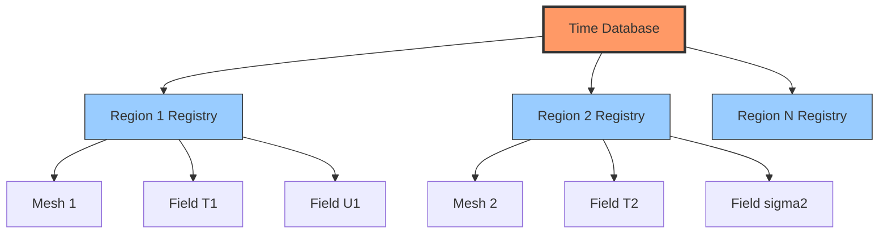

# Multi-Physics Coupling: An Overview

## Introduction to Coupled Physics

**Multi-physics coupling** in OpenFOAM represents the integration of multiple physical domains within a unified simulation framework. This advanced capability enables modeling of complex engineering systems where:

- **Fluid flow** (Navier-Stokes equations)
- **Heat transfer** (Conduction, convection, radiation)
- **Structural mechanics** (Elasticity, plasticity)
- **Electromagnetic fields** (Maxwell's equations)

interact simultaneously through shared boundaries or volumetrically throughout the computational domain.

### The Engineering Challenge

Consider a **turbine blade cooling system**: hot combustion gases flow over the blade surface while internal cooling channels circulate cooler air. The blade material experiences:

- **Extreme temperature gradients** (Thermal stress)
- **Pressure loading** from the gas flow (Structural deformation)
- **Cooling effectiveness** dependent on both flow and conduction (CHT)

Traditional single-physics approaches fail to capture these interactions, leading to either **over-conservative designs** (reduced efficiency) or **catastrophic failures** (under-predicted temperatures).

### Mathematical Foundation

Coupled problems require solving systems of partial differential equations (PDEs) where variables from different physics interact:

#### Fluid Domain Equations

**Momentum conservation:**
$$\rho_f \left( \frac{\partial \mathbf{u}_f}{\partial t} + (\mathbf{u}_f \cdot \nabla) \mathbf{u}_f \right) = -\nabla p_f + \mu_f \nabla^2 \mathbf{u}_f + \mathbf{f}_{b,f} \tag{1}$$

**Energy conservation:**
$$\rho_f c_{p,f} \frac{\partial T_f}{\partial t} + \rho_f c_{p,f} \mathbf{u}_f \cdot \nabla T_f = \nabla \cdot (k_f \nabla T_f) + Q_f \tag{2}$$

#### Solid Domain Equations

**Heat conduction:**
$$\rho_s c_{p,s} \frac{\partial T_s}{\partial t} = \nabla \cdot (k_s \nabla T_s) + Q_s \tag{3}$$

**Structural dynamics:**
$$\rho_s \frac{\partial^2 \mathbf{u}_s}{\partial t^2} = \nabla \cdot \boldsymbol{\sigma}_s + \mathbf{f}_{b,s} \tag{4}$$

### Interface Coupling Conditions

The mathematical coupling occurs at interfaces $\Gamma$ between domains:

**Temperature continuity:**
$$T_f|_{\Gamma} = T_s|_{\Gamma} \tag{5}$$

**Heat flux conservation:**
$$-k_f \frac{\partial T_f}{\partial n}\bigg|_{\Gamma} = -k_s \frac{\partial T_s}{\partial n}\bigg|_{\Gamma} \tag{6}$$

**Velocity/displacement continuity (FSI):**
$$\mathbf{u}_{\text{fluid}}|_{\Gamma} = \frac{\partial \mathbf{d}_{\text{solid}}}{\partial t}\bigg|_{\Gamma} \tag{7}$$

**Traction equilibrium:**
$$\boldsymbol{\sigma}_{\text{fluid}} \cdot \mathbf{n}|_{\Gamma} = \boldsymbol{\sigma}_{\text{solid}} \cdot \mathbf{n}|_{\Gamma} \tag{8}$$

---

## Classification of Coupled Problems

### By Coupling Direction

| Type | Description | Mathematical Form | Applications |
|------|-------------|-------------------|--------------|
| **One-Way Coupling** | Physics A affects Physics B, but not vice versa | $\mathbf{F}_A \rightarrow \mathbf{u}_B$, $\mathbf{u}_B \nrightarrow \mathbf{v}_A$ | Wind loading, thermal stress analysis |
| **Two-Way Coupling** | Bidirectional interaction between domains | $\mathbf{F}_A \leftrightarrow \mathbf{u}_B$, $\mathbf{v}_A \leftrightarrow \mathbf{u}_B$ | Flutter analysis, vortex-induced vibrations |

### By Temporal Nature

| Type | Description | Stability Characteristics |
|------|-------------|---------------------------|
| **Steady-State Coupling** | Time-invariant solutions | Easier convergence, no time step restrictions |
| **Transient Coupling** | Time-dependent evolution | Requires careful time step selection, may need sub-iterations |

### By Solution Strategy

| Strategy | Description | Advantages | Disadvantages |
|----------|-------------|------------|----------------|
| **Segregated (Partitioned)** | Solve each physics separately, iterate for coupling | Modular, memory efficient, flexible | May require many iterations, convergence issues for strong coupling |
| **Monolithic (Coupled)** | Solve all physics simultaneously in one system | Robust convergence, better for stiff systems | High memory usage, complex implementation |

---

## Conjugate Heat Transfer (CHT)

### The Thermal Handshake Problem

**Conjugate Heat Transfer** addresses the fundamental challenge where **fluid convection** and **solid conduction** occur simultaneously:

> **"How do we accurately predict heat transfer when the fluid sees a solid boundary and the solid sees a fluid boundary?"**

#### Real-World Impact

CHT enables accurate prediction of:
- **Electronics cooling** (heat sinks with forced convection)
- **Building efficiency** (insulated walls with external wind)
- **Nuclear safety** (fuel rod cooling)
- **Thermal protection systems** (hypersonic vehicles)

### OpenFOAM Implementation: `chtMultiRegionFoam`

OpenFOAM's multi-region framework enables CHT through:

#### Region-Based Architecture

```cpp
// Multi-region mesh management
PtrList<fvMesh> fluidRegions;
PtrList<fvMesh> solidRegions;

// Region-specific temperature fields
PtrList<volScalarField> Tfluids;
PtrList<volScalarField> Tsolids;

// Interface coupling through mapped boundaries
forAll(fluidRegions, i)
{
    const volScalarField& Tfluid = Tfluids[i];
    const fvPatchScalarField& fluidPatch =
        Tfluid.boundaryField()[fluidInterfaceID];

    // Map to solid interface
    fvPatchScalarField& solidPatch =
        Tsolids[i].boundaryFieldRef()[solidInterfaceID];
    solidPatch == fluidPatch;
}
```

#### Key Features

| Feature | Description | Benefit |
|---------|-------------|---------|
| **Region-specific physics** | Different governing equations for each domain | Accurate physics representation |
| **Interface coupling** | Direct mapping of temperature and heat flux | Physical consistency |
| **Parallel processing** | Efficient distribution of regions | Scalable computation |
| **Synchronized time integration** | Concurrent advancement of all regions | Temporal consistency |

---

## Fluid-Structure Interaction (FSI)

### When Fluids Bend Solids

**Fluid-Structure Interaction** couples:
- **Fluid dynamics** (Navier-Stokes equations)
- **Structural mechanics** (Elastodynamics)

through:
- **Kinematic continuity** (velocity/displacement matching)
- **Dynamic continuity** (traction equilibrium)

### The Added Mass Effect

A critical challenge in partitioned FSI is the **added mass effect**:

#### Mathematical Formulation

**Added mass force:**
$$\mathbf{F}_{\text{added}} = \rho_f V_{\text{disp}} \frac{\mathrm{d}^2 \mathbf{x}}{\mathrm{d}t^2} \tag{9}$$

**Modified structural equation:**
$$(m_s + m_{\text{added}}) \frac{\mathrm{d}^2 \mathbf{x}}{\mathrm{d}t^2} = \mathbf{F}_{\text{fluid}} + \mathbf{F}_{\text{structural}} \tag{10}$$

**where:**
- $\rho_f$ = fluid density
- $V_{\text{disp}}$ = displaced fluid volume
- $m_s$ = structural mass
- $m_{\text{added}}$ = equivalent added mass

#### Stability Implications

| Density Ratio | Recommended Strategy | Rationale |
|--------------|---------------------|-----------|
| $\rho_f \ll \rho_s$ | **Weak coupling** | Sufficient accuracy with low cost |
| $\rho_f \approx \rho_s$ | **Strong coupling** | Required for numerical stability |
| $\rho_f > \rho_s$ | **Strong coupling** | Maintains physical accuracy |

### Coupling Algorithms

#### Partitioned Approach

```cpp
// Pseudo-code for partitioned FSI solver
while (t < endTime)
{
    // Fluid solve on deformed mesh
    fluidSolver.solve();

    // Extract fluid stresses on interface
    InterfaceStresses = extractFluidStresses();

    // Apply to solid as boundary conditions
    solidSolver.setInterfaceLoads(InterfaceStresses);

    // Solve structural mechanics
    solidSolver.solve();

    // Update mesh based on solid displacement
    meshDeformer.update(solidDisplacement);

    // Check coupling convergence
    if (couplingConverged) advanceTime();
}
```

#### Monolithic Approach

Block coupled system assembly:

$$
\begin{bmatrix}
\mathbf{A}_f & \mathbf{B}_{fs} \\
\mathbf{B}_{sf} & \mathbf{A}_s
\end{bmatrix}
\begin{bmatrix}
\Delta \mathbf{x}_f \\
\Delta \mathbf{x}_s
\end{bmatrix}
=
\begin{bmatrix}
\mathbf{r}_f \\
\mathbf{r}_s
\end{bmatrix}
\tag{11}
$$

---

## OpenFOAM's Region-Wise Field Management

### Architecture Overview

OpenFOAM's region-wise system provides a framework for managing fields in separate computational domains:


> **Figure 1:** แผนภาพแสดงสถาปัตยกรรมการจัดการฟิลด์แบบแยกภูมิภาค (Region-wise Field Management) ใน OpenFOAM ซึ่งช่วยให้สามารถบริหารจัดการเมชและข้อมูลทางฟิสิกส์ที่แตกต่างกันในหลายโดเมนคำนวณพร้อมกันได้อย่างมีประสิทธิภาพ


### Key Components

#### Region-Specific Field Registration

```cpp
// Region-specific field with independent registry
volScalarField T_solid
(
    IOobject
    (
        "T",  // Same name, different registry
        solidMesh.time().timeName(),
        solidMesh.objectRegistry(),  // Separate registry
        IOobject::MUST_READ,
        IOobject::AUTO_WRITE
    ),
    solidMesh
);
```

#### Interface Communication

```cpp
// Direct interface mapping for conformal meshes
forAll(fluidPatch, faceI)
{
    Tsolid.boundaryField()[solidPatchID][faceI] =
        Tfluid.boundaryField()[fluidPatchID][faceI];
}

// AMI interpolation for non-conformal meshes
const AMIPatchToPatchInterpolation& AMI = AMIPatches[interfaceID];
scalarField solidT(fluidPatch.size(), 0.0);
AMI.interpolateToSource
(
    Tfluid.boundaryField()[fluidPatchID],
    solidT
);
```

### Benefits of Region-Wise Management

| Feature | Benefit | Impact |
|---------|---------|--------|
| **Memory isolation** | Fields from different regions can have identical names | Prevents naming conflicts |
| **Automatic cleanup** | Region destruction cascades data deletion | Prevents memory leaks |
| **Parallel distribution** | Each region decomposes independently across MPI ranks | Improves parallel efficiency |
| **Cache efficiency** | Related fields remain contiguous | Improves memory access |

---

## Numerical Stability and Convergence

### Stability Challenges

Coupled problems introduce unique numerical challenges:

#### Property Contrasts

Large differences in material properties across interfaces can cause instability:

$$\frac{k_f}{k_s} \gg 1 \quad \text{or} \quad \frac{k_f}{k_s} \ll 1$$

#### Stiffness

Different time scales in coupled physics:

$$\tau_{\text{fluid}} \ll \tau_{\text{solid}}$$

### Stabilization Techniques

#### Under-Relaxation

$$\phi^{n+1} = (1-\alpha) \phi^n + \alpha \phi^{*} \tag{12}$$

**where:**
- $\alpha$ = relaxation factor ($0 < \alpha \leq 1$)
- $\phi^{*}$ = newly computed value
- $\phi^n$ = previous iteration value

```cpp
// Under-relaxation implementation
scalar relaxationFactor = 0.7;
T_new = (1 - relaxationFactor) * T_old + relaxationFactor * T_calculated;
```

#### Aitken's Δ² Acceleration

Dynamic relaxation factor adaptation:

$$\alpha^{k} = -\alpha^{k-1} \frac{(\mathbf{r}^k, \mathbf{r}^k - \mathbf{r}^{k-1})}{\|\mathbf{r}^k - \mathbf{r}^{k-1}\|^2} \tag{13}$$

$$\mathbf{x}^{k+1} = \mathbf{x}^k + \alpha^k \mathbf{r}^k \tag{14}$$

**where:**
- $\mathbf{r}^k = \mathbf{x}^{k+1} - \mathbf{x}^k$ = iteration residual
- $\alpha^k$ = Aitken acceleration factor

#### Convergence Criteria

```cpp
// Interface convergence checking
scalar residual = max(mag(TInterface - TInterface.oldTime()));
if (residual < couplingTolerance)
{
    break;  // Coupling converged
}
```

---

## Verification and Validation

### Conservation Checks

#### Energy Balance

$$\frac{\mathrm{d}}{\mathrm{d}t} \int_V (\rho e) \,\mathrm{d}V = -\int_{\partial V} q \cdot \mathbf{n} \,\mathrm{d}A + \int_V Q \,\mathrm{d}V \tag{15}$$

#### Mass Balance (Incompressible)

$$\int_{\partial V} \mathbf{u} \cdot \mathbf{n} \,\mathrm{d}A = 0 \tag{16}$$

#### Interface Heat Flux Continuity

$$q_f = -k_f \frac{\partial T_f}{\partial n} = -k_s \frac{\partial T_s}{\partial n} = q_s \tag{17}$$

**Verification criterion:**

$$\frac{|q_f + q_s|}{|q_f|} < 10^{-6} \tag{18}$$

### Implementation in OpenFOAM

```cpp
// Heat flux continuity verification
scalarField qFluid = -kFluid.boundaryField()[fluidPatchID] *
                     gradTFluid.boundaryField()[fluidPatchID];

scalarField qSolid = -kSolid.boundaryField()[solidPatchID] *
                     gradTSolid.boundaryField()[solidPatchID];

scalar maxRelError = max(mag(qFluid + qSolid)/mag(qFluid));

if (maxRelError < 1e-6)
{
    Info << "Heat flux continuity verified: " << maxRelError << endl;
}
```

### Analytical Benchmarks

| Problem | Analytical Solution | Parameters |
|---------|---------------------|------------|
| **Steady-State CHT** | $\frac{T - T_{cold}}{T_{hot} - T_{cold}} = \frac{1 + Bi \cdot (x/L)}{1 + Bi}$ | $Bi = \frac{hL}{k}$ |
| **Transient Diffusion** | $\frac{T(x,t) - T_{initial}}{T_{surface} - T_{initial}} = \text{erfc}\left(\frac{x}{2\sqrt{\alpha t}}\right)$ | $\alpha = \frac{k}{\rho c_p}$ |

---

## Module Roadmap

This module provides comprehensive coverage of multi-physics simulation in OpenFOAM:

### 1. **Fundamentals**
- Introduction to Multi-Physics (FSI, CHT, EMHD)
- Coupling Strategies (Segregated vs. Monolithic)
- Numerical Stability and Algorithms

### 2. **Conjugate Heat Transfer (CHT)**
- The "Thermal Handshake" problem
- `chtMultiRegionFoam` architecture
- `mappedWall` boundary conditions

### 3. **Fluid-Structure Interaction (FSI)**
- When fluids bend solids
- Added Mass Instability
- Coupling algorithms (Weak vs. Strong, Aitken relaxation)

### 4. **Object Registry Architecture**
- How OpenFOAM manages fields across multiple regions
- The Namespace problem and Template-based access

### 5. **Advanced Coupling Topics**
- Thermal Contact Resistance
- Phase Change Materials (PCM)
- Radiation Coupling

### 6. **Validation and Benchmarks**
- Analytical solutions (1D CHT)
- Conservation checks (Mass, Energy, Momentum)

### 7. **Exercises**
- Practical tasks to implement custom models and run simulations

---

## Key Takeaways

1. **Multi-physics coupling** is essential for accurate simulation of complex engineering systems where different physical domains interact

2. **Region-based architecture** in OpenFOAM enables modular, efficient handling of coupled problems through separate mesh, field, and solver management

3. **Interface conditions** maintain physical consistency through continuity of temperature, flux, velocity, and traction across domain boundaries

4. **Numerical stability** in coupled problems requires careful attention to relaxation factors, convergence criteria, and time step selection

5. **Verification and validation** through conservation checks and analytical benchmarks is critical for ensuring simulation accuracy

6. **The added mass effect** in FSI creates significant numerical challenges that often require strong coupling strategies for stability

7. **Template metaprogramming** and smart pointers form the foundation of OpenFOAM's efficient field management system

Mastering these concepts enables you to tackle real-world engineering problems that span multiple physical domains, pushing the boundaries of what's possible with computational simulation.
