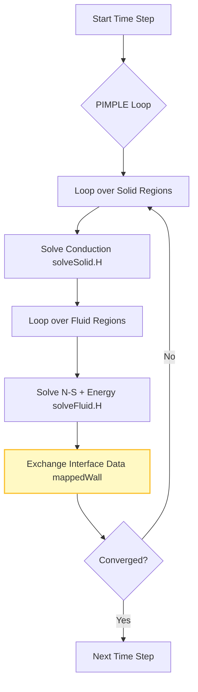
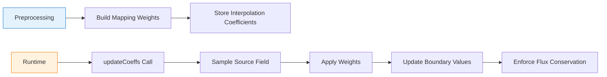

# Conjugate Heat Transfer (CHT) in OpenFOAM

## Overview

**Conjugate Heat Transfer (CHT)** addresses one of the most fundamental challenges in computational fluid dynamics: the simultaneous simulation of heat transfer between fluid and solid domains. This capability is essential for engineering applications where thermal interaction between materials dominates design decisions.

---

## 1. The Thermal Handshake Problem

### 1.1 Physical Motivation

Consider designing a **jet engine turbine blade**: hot combustion gases flow over the exterior surface while internal cooling channels circulate cooler air. The blade material experiences extreme thermal gradients, but traditional CFD treats fluid and solid as separate domains.

**CHT solves this fundamental challenge** by coupling fluid and solid domains at their interface, solving for temperature fields in both simultaneously with strict continuity of temperature and heat flux.

### 1.2 Real-World Applications

CHT enables accurate prediction of:
- **Electronics Cooling**: Heat sinks with forced convection
- **Building Energy Efficiency**: Wall insulation with external wind
- **Nuclear Safety**: Fuel rod cooling systems
- **Hypersonic Vehicles**: Thermal protection systems
- **Heat Exchangers**: Multi-region thermal coupling

### 1.3 Mathematical Foundation

#### Governing Equations

**Fluid Domain (Convection + Conduction):**

For incompressible flow with heat transfer:

$$\rho_f c_{p,f} \left( \frac{\partial T_f}{\partial t} + \mathbf{u}_f \cdot \nabla T_f \right) = k_f \nabla^2 T_f + Q_f \tag{1.1}$$

**Solid Domain (Pure Conduction):**

$$\rho_s c_{p,s} \frac{\partial T_s}{\partial t} = k_s \nabla^2 T_s + Q_s \tag{1.2}$$

**Interface Coupling Conditions:**

At the fluid-solid interface $\Gamma$, two physical constraints must be satisfied:

1. **Temperature Continuity:**
   $$T_f|_{\Gamma} = T_s|_{\Gamma} \tag{1.3}$$

2. **Heat Flux Continuity:**
   $$k_f \left(\frac{\partial T_f}{\partial n}\right)_{\Gamma} = k_s \left(\frac{\partial T_s}{\partial n}\right)_{\Gamma} \tag{1.4}$$

**Variable Definitions:**
- $\rho_f, \rho_s$ - Density of fluid and solid [kg/m³]
- $c_{p,f}, c_{p,s}$ - Specific heat capacity [J/(kg·K)]
- $T_f, T_s$ - Temperature fields [K]
- $k_f, k_s$ - Thermal conductivity [W/(m·K)]
- $\mathbf{u}_f$ - Fluid velocity vector [m/s]
- $Q_f, Q_s$ - Volumetric heat sources [W/m³]
- $\frac{\partial}{\partial n}$ - Normal derivative at interface

### 1.4 Computational Challenges

| Challenge | Description | Impact |
|-----------|-------------|--------|
| **Mesh Compatibility** | Regions often have different mesh resolution and topology | Requires geometric mapping |
| **Field Synchronization** | Temperature fields must be synchronized at every time step | High communication overhead |
| **Property Discontinuities** | Large jumps in thermal properties at interfaces | Numerical instability |
| **Time Scale Disparity** | Different time scales in fluid and solid regions | Severe time step restrictions |

---

## 2. Blueprint: `chtMultiRegionFoam` Solver Architecture

### 2.1 Partitioned Multi-Region Approach

OpenFOAM's primary CHT solver, `chtMultiRegionFoam`, uses a **partitioned approach** where fluid and solid regions solve their own equations independently but exchange boundary data at every iteration.

**Key Architectural Benefits:**
- Modular design reuses existing solvers
- Memory efficient (smaller matrices than monolithic)
- Allows different numerical schemes for fluid/solid
- Supports multiple fluid and solid regions simultaneously

### 2.2 Main Solver Loop

```cpp
// applications/solvers/heatTransfer/chtMultiRegionFoam/chtMultiRegionFoam.C
int main(int argc, char *argv[])
{
    #include "setRootCaseLists.H"
    #include "createTime.H"
    #include "createMeshes.H"

    // Multi-region PIMPLE control system
    pimpleMultiRegionControl pimples(fluidRegions, solidRegions);
    #include "createFields.H"

    while (pimples.run(runTime))
    {
        runTime++;
        const int nEcorr = pimples.dict().lookupOrDefault<int>("nEcorrectors", 1);

        while (pimples.loop())
        {
            for(int Ecorr=0; Ecorr<nEcorr; Ecorr++)
            {
                // SOLID REGIONS SOLUTION
                forAll(solidRegions, i)
                {
                    #include "setRegionSolidFields.H"
                    #include "solveSolid.H"
                }

                // FLUID REGIONS SOLUTION
                forAll(fluidRegions, i)
                {
                    #include "setRegionFluidFields.H"
                    #include "solveFluid.H"
                }
            }
        }
        runTime.write();
    }
    return 0;
}
```

### 2.3 Algorithm Flow


> **Figure 1:** แผนผังลำดับขั้นตอนการคำนวณของตัวแก้สมการ `chtMultiRegionFoam` แสดงวงจรการวนซ้ำระหว่างภูมิภาคของแข็งและของไหล พร้อมกระบวนการแลกเปลี่ยนข้อมูลที่ส่วนต่อประสานเพื่อให้บรรลุความสมดุลทางความร้อน


### 2.4 Key Architectural Features

| Feature | Description | Benefit |
|----------|-------------|---------|
| **PtrList\<fvMesh\>** | Variable number of fluid and solid regions | Scalable to multi-region problems |
| **pimpleMultiRegionControl** | Orchestrates synchronized time-stepping | Coordinated convergence criteria |
| **Macro System** | `#include` statements for region-specific code | Reusable, modular code structure |
| **Modular Solver** | Separate `solveSolid.H` and `solveFluid.H` | Independent numerical schemes |

### 2.5 Case Directory Structure

```
case/
├── constant/
│   ├── regionProperties           # Defines regions (fluid vs solid)
│   ├── fluid/                     # Fluid region data
│   │   ├── polyMesh/
│   │   └── thermophysicalProperties
│   └── solid/                     # Solid region data
│       ├── polyMesh/
│       └── thermophysicalProperties
├── 0/                             # Initial conditions
│   ├── fluid/                     # Fluid fields (U, p, T)
│   └── solid/                     # Solid fields (T)
└── system/                        # Solver settings
    ├── fluid/                     # Fluid solver settings
    └── solid/                     # Solid solver settings
```

### 2.6 Region Properties Definition

```cpp
// constant/regionProperties
regions
(
    fluid (fluidChannel fluidCavity)  // Multiple fluid regions supported
    solid (solidWall solidObstacle)   // Multiple solid regions supported
);
```

---

## 3. Internal Mechanics: Mathematical Formulation

### 3.1 Solid Domain Equations

The solid region solves the **transient heat conduction equation**:

$$\rho_s c_{p,s} \frac{\partial T_s}{\partial t} = \nabla \cdot (k_s \nabla T_s) + Q_s \tag{3.1}$$

**Implementation in `solveSolid.H`:**

```cpp
// Solid energy equation
fvScalarMatrix TEqn
(
    fvm::ddt(rho, Cpv, T)
  + fvm::laplacian(K, T)
 ==
    fvOptions(rho, Cpv, T)
);

TEqn.relax();
fvOptions.constrain(TEqn);
TEqn.solve();
```

### 3.2 Fluid Domain Equations

The fluid region solves the **incompressible Navier-Stokes equations** coupled with energy:

**Continuity:**
$$\nabla \cdot \mathbf{u} = 0 \tag{3.2}$$

**Momentum:**
$$\rho_f \frac{\partial \mathbf{u}}{\partial t} + \rho_f (\mathbf{u} \cdot \nabla) \mathbf{u} = -\nabla p + \mu_f \nabla^2 \mathbf{u} + \rho_f \mathbf{g} \tag{3.3}$$

**Energy (Enthalpy Formulation):**
$$\rho_f c_{p,f} \left( \frac{\partial T_f}{\partial t} + \mathbf{u} \cdot \nabla T_f \right) = \nabla \cdot (k_f \nabla T_f) + \Phi \tag{3.4}$$

Where $\Phi$ represents viscous dissipation:
$$\Phi = \mu_f \left[ 2\left(\frac{\partial u}{\partial x}\right)^2 + 2\left(\frac{\partial v}{\partial y}\right)^2 + 2\left(\frac{\partial w}{\partial z}\right)^2 + \left(\frac{\partial u}{\partial y} + \frac{\partial v}{\partial x}\right)^2 + \dots \right]$$

### 3.3 Coupling Strategy

The coupling is **explicit or semi-implicit** via boundary conditions. The solver iterates between domains until:

1. Interface temperature continuity: $T_f|_{\Gamma} = T_s|_{\Gamma}$
2. Heat flux balance: $-k_f \frac{\partial T_f}{\partial n}\bigg|_{\Gamma} = -k_s \frac{\partial T_s}{\partial n}\bigg|_{\Gamma}$

---

## 4. Mechanism: `mappedWall` Boundary Condition

### 4.1 The Mapping Engine: `mappedPatchBase`

The core of CHT coupling is the `mappedPatchBase` class—a geometric mapping tool that establishes relationships between source and target faces/cells across potentially non-conformal meshes.

```cpp
// src/meshTools/mappedPatches/mappedPolyPatch/mappedWallPolyPatch.H
class mappedWallPolyPatch
:
    public wallPolyPatch,
    public mappedPatchBase
{
    TypeName("mappedWall");

    // Sampling parameters:
    // - sampleRegion: region to sample from
    // - sampleMode: nearestCell, nearestFace, nearestPatchFace
    // - samplePatch: patch to sample from
    // - offset: geometric offset between regions
};
```

### 4.2 Sampling Modes

| Mode | Description | Accuracy | Performance |
|------|-------------|----------|-------------|
| **`nearestCell`** | Map to nearest cell center | First-order | Fastest |
| **`nearestFace`** | Map to nearest face center | Medium | Fast |
| **`nearestPatchFace`** | Map to nearest face on specified patch | Medium-High | Fast |
| **`interpolation`** | Use advanced interpolation schemes | Second-order+ | Slowest |

### 4.3 Field Transfer: `mappedFixedValueFvPatchField`

The actual field coupling is implemented through boundary conditions:

```cpp
// src/finiteVolume/fields/fvPatchFields/derived/mappedFixedValue/
template<class Type>
class mappedFixedValueFvPatchField
:
    public fixedValueFvPatchField<Type>,
    public mappedPatchFieldBase<Type>
{
    TypeName("mapped");

    virtual void updateCoeffs();
};
```

### 4.4 Configuration Examples

**In `0/fluid/T`:**

```cpp
interface_to_solid
{
    type            mapped;               // Uses mappedFixedValue
    fieldName       T;                    // Map Temperature
    sampleMode      nearestPatchFace;     // Mapping strategy
    sampleRegion    solid;                // Source region
    samplePatch     interface_to_fluid;   // Source patch
    value           uniform 300;          // Initial guess
}
```

**In `constant/fluid/polyMesh/boundary`:**

```cpp
interface_to_solid
{
    type            mappedWall;
    sampleMode      nearestPatchFace;
    sampleRegion    solid;
    samplePatch     interface_to_fluid;
    offset          (0 0 0);
}
```

### 4.5 Data Transfer Algorithm


> **Figure 2:** แผนภาพแสดงกระบวนการถ่ายโอนข้อมูลทางเรขาคณิตและฟิสิกส์ระหว่างภูมิภาค โดยใช้กลไกการแม็พ (Mapping) เพื่ออัปเดตเงื่อนไขขอบเขตในขณะรันการจำลอง


---

## 5. Architectural Trade-offs: Partitioned vs. Monolithic

### 5.1 Partitioned Approach (OpenFOAM)

**Advantages:**
- ✅ Modular (reuses existing solvers)
- ✅ Memory efficient (smaller matrices)
- ✅ Flexible numerical schemes per region
- ✅ Easier code maintenance

**Disadvantages:**
- ❌ Requires sub-iterations for strong coupling
- ❌ Potential stability issues with high conductivity ratios
- ❌ May need under-relaxation for convergence

### 5.2 Stability Considerations

High conductivity ratios (e.g., Copper vs. Air, $k_s/k_f \gg 1$) can cause numerical instability.

**Conductivity Ratio Impact:**

$$\beta_k = \frac{k_s}{k_f}$$

| Ratio Range | Stability | Recommended Approach |
|-------------|-----------|---------------------|
| $\beta_k < 10$ | Stable | Standard coupling |
| $10 \leq \beta_k \leq 100$ | Moderately stable | Under-relaxation required |
| $\beta_k > 100$ | Potentially unstable | Strong under-relaxation, small time steps |

### 5.3 Under-Relaxation Strategy

Essential for convergence with high conductivity ratios:

$$T^{n+1} = (1-\alpha_T) T^n + \alpha_T T_{\text{mapped}} \tag{5.1}$$

**Configuration in `system/fluid/fvSolution`:**

```cpp
relaxationFactors
{
    fields
    {
        T           0.5;    // Temperature under-relaxation
    }
    equations
    {
        U           0.7;
        "(h|e|k|epsilon|omega)" 0.7;
    }
}
```

**Typical Values:**
- Temperature: $\alpha_T \approx 0.3-0.7$ (lower for high $\beta_k$)
- Velocity: $\alpha_U \approx 0.7$
- Turbulence: $\alpha_{\text{turb}} \approx 0.7$

### 5.4 Aitken Acceleration

OpenFOAM can use **Aitken's $\Delta^2$ method** to dynamically adjust relaxation factors:

$$\alpha^k = -\alpha^{k-1} \frac{(\mathbf{r}^k, \mathbf{r}^k - \mathbf{r}^{k-1})}{\|\mathbf{r}^k - \mathbf{r}^{k-1}\|^2} \tag{5.2}$$

Where $\mathbf{r}^k = \mathbf{x}^{k+1} - \mathbf{x}^k$ is the iteration residual.

**Enable in `fvSolution`:**

```cpp
PIMPLE
{
    nOuterCorrectors  50;
    nCorrectors      2;
    nNonOrthogonalCorrectors 0;
    aitkenAcceleration on;      // Enable Aitken acceleration
}
```

---

## 6. Usage: Setting Up a CHT Simulation

### 6.1 Step-by-Step Workflow

#### Step 1: Mesh Generation

Create separate meshes for each region:

```bash
# Generate fluid mesh
blockMesh -region fluid

# Generate solid mesh
blockMesh -region solid
```

**Critical Requirements:**
- Interface patches must geometrically overlap
- Consistent face orientations (normal vectors)
- Appropriate mesh resolution at interfaces

#### Step 2: Define Regions

Edit `constant/regionProperties`:

```cpp
regions
(
    fluid ( fluid )
    solid ( solid )
);
```

#### Step 3: Configure Boundary Conditions

Set `type mappedWall` in `polyMesh/boundary`:

```cpp
// constant/fluid/polyMesh/boundary
interface_to_solid
{
    type            mappedWall;
    sampleMode      nearestPatchFace;
    sampleRegion    solid;
    samplePatch     interface_to_fluid;
    offset          (0 0 0);
}
```

Set `type mapped` in field files:

```cpp
// 0/fluid/T
interface_to_solid
{
    type            mapped;
    value           uniform 300;
}
```

#### Step 4: Run Solver

```bash
chtMultiRegionFoam
```

### 6.2 Best Practices

#### Time Step Selection

Limited by the fastest timescale (usually fluid convection):

```cpp
// system/controlDict
adjustTimeStep  yes;
maxCo           0.3;          // Reduced for CHT stability
maxDeltaT       0.1;
```

#### Relaxation Factors

```cpp
// system/fluid/fvSolution
relaxationFactors
{
    fields
    {
        T           0.5;    // Critical for interface stability
    }
}
```

#### Monitoring

Use function objects to monitor heat balance:

```cpp
// system/controlDict
functions
{
    heatBalance
    {
        type            surfaceRegion;
        functionObjectLibs ("libfieldFunctionObjects.so");
        region          fluid;
        surfaceRegion   interface_to_solid;
        operation       weightedSum;
        fields
        (
            phi         // Volume flux
            phiH        // Enthalpy flux (heat transfer rate)
        );
    }
}
```

---

## 7. Conservation Verification

### 7.1 Heat Flux Continuity Check

The fundamental physical requirement for CHT is heat flux continuity across interfaces:

$$q_f = -k_f \frac{\partial T_f}{\partial n} = -k_s \frac{\partial T_s}{\partial n} = q_s \tag{7.1}$$

**Verification Criterion:**

$$\frac{|q_f + q_s|}{|q_f|} < 10^{-6} \tag{7.2}$$

### 7.2 Implementation

```cpp
// Heat flux continuity verification
scalarField qFluid = -kFluid.boundaryField()[fluidPatchID] *
                     fvc::grad(TFluid).boundaryField()[fluidPatchID];

scalarField qSolid = -kSolid.boundaryField()[solidPatchID] *
                     fvc::grad(TSolid).boundaryField()[solidPatchID];

scalar maxRelError = max(mag(qFluid + qSolid)/mag(qFluid));

if (maxRelError < 1e-6)
{
    Info << "Heat flux continuity verified: " << maxRelError << endl;
}
```

### 7.3 Energy Balance Monitoring

Track total system energy:

$$E_{\text{total}} = \int_{\Omega_f} \rho_f c_{p,f} T_f \, dV + \int_{\Omega_s} \rho_s c_{p,s} T_s \, dV \tag{7.3}$$

**Change should equal boundary fluxes:**

$$\frac{dE_{\text{total}}}{dt} = \sum_{\text{boundaries}} \int_{\partial \Omega} \mathbf{q} \cdot \mathbf{n} \, dS \tag{7.4}$$

---

## 8. Common Issues and Solutions

### 8.1 Mapping Failures

**Symptoms:**
- Error: "Cannot find sample region"
- Error: "Failed to map patch to region"

**Solutions:**
- Check region names match exactly (case-sensitive)
- Verify patches exist in `constant/region/polyMesh/boundary`
- Ensure proper region definition in `regionProperties`

### 8.2 Numerical Instability

**Symptoms:**
- Temperature oscillations at interface
- Solution divergence near mapped boundaries
- Time step continuously reduced by solver

**Solutions:**
- Reduce under-relaxation factors: `T 0.3`
- Decrease time step: `maxCo 0.2`
- Improve mesh quality at interfaces
- Use `nearestPatchFace` sampling mode

### 8.3 Conservation Errors

**Symptoms:**
- Increasing energy imbalance
- Mass balance violations
- Unphysical heat transfer rates

**Solutions:**
- Ensure consistent flux orientation
- Use conservative discretization schemes
- Verify boundary normal vectors
- Check time integration consistency

### 8.4 Slow Convergence

**Symptoms:**
- High coupling residuals (> 1e-3)
- Solver stuck at iteration limits
- Excessive CPU time per time step

**Solutions:**
- Enable Aitken acceleration
- Increase outer correctors: `nOuterCorrectors 100`
- Optimize linear solver settings
- Improve initial conditions

---

## 9. Summary

### Key Takeaways

**`chtMultiRegionFoam` Architecture:**
- Uses **partitioned multi-region approach** for coupled thermal simulations
- **`PtrList<fvMesh>`** handles variable numbers of fluid and solid regions
- **`pimpleMultiRegionControl`** orchestrates synchronized time-stepping
- **Modular design** with separate `solveSolid.H` and `solveFluid.H`

**Coupling Mechanism:**
- **`mappedWall`** boundary conditions enforce $T$ and $q$ continuity
- **`mappedPatchBase`** provides geometric mapping between regions
- **`mappedFixedValue`** handles field transfer at runtime

**Stability Considerations:**
- **Under-relaxation** essential for high conductivity ratios
- **Aitken acceleration** improves convergence
- **Conservation checks** verify physical correctness

**Best Practices:**
- Start with `T` relaxation factor of 0.5
- Use `nearestPatchFace` sampling mode for accuracy
- Monitor heat flux continuity at interfaces
- Verify energy balance conservation

---

## References

- OpenFOAM® v2312 Documentation: `chtMultiRegionFoam` solver guide
- Jasak, H. (2009). "OpenFOAM: Open Source CFD in Research and Industry"
- Ferziger, J. H., & Peric, M. (2002). "Computational Methods for Fluid Dynamics"
- The OpenFOAM Foundation Ltd. (2024). "OpenFOAM User Guide"

---
**Document Version:** 1.0
**Last Updated:** 2025-12-23
**OpenFOAM Version:** 2312+
