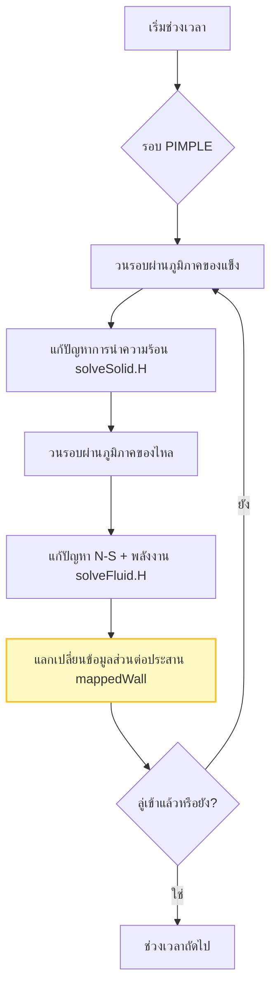
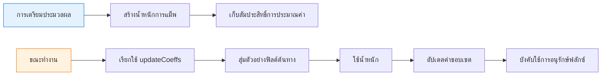

# การถ่ายโอนความร้อนแบบคอนจูเกต (Conjugate Heat Transfer - CHT) ใน OpenFOAM

## ภาพรวม (Overview)

**การถ่ายโอนความร้อนแบบคอนจูเกต (Conjugate Heat Transfer - CHT)** จัดการกับความท้าทายพื้นฐานประการหนึ่งในพลศาสตร์ของไหลเชิงคำนวณ นั่นคือการจำลองการถ่ายโอนความร้อนระหว่างโดเมนของไหล (fluid) และโดเมนของแข็ง (solid) ไปพร้อมๆ กัน ความสามารถนี้มีความสำคัญอย่างยิ่งสำหรับการประยุกต์ใช้งานทางวิศวกรรมที่ปฏิสัมพันธ์ทางความร้อนระหว่างวัสดุต่างๆ เป็นปัจจัยหลักในการตัดสินใจออกแบบ

---

## 1. ปัญหาการส่งต่อทางความร้อน (The Thermal Handshake Problem)

### 1.1 แรงจูงใจทางกายภาพ (Physical Motivation)

พิจารณาการออกแบบ **ใบพัดเทอร์ไบน์ของเครื่องยนต์เจ็ท**: ก๊าซจากการเผาไหม้ที่ร้อนจัดไหลผ่านพื้นผิวภายนอก ในขณะที่ช่องหล่อเย็นภายในจะมีอากาศที่เย็นกว่าไหลเวียนอยู่ วัสดุของใบพัดจะเผชิญกับเกรเดียนต์ความร้อนที่รุนแรง แต่ CFD แบบดั้งเดิมมักจะจัดการของไหลและของแข็งแยกกันเป็นโดเมนอิสระ

**CHT แก้ไขความท้าทายพื้นฐานนี้** โดยการเชื่อมโยง (coupling) โดเมนของไหลและของแข็งเข้าด้วยกันที่ส่วนต่อประสาน (interface) ของทั้งสอง และหาคำตอบสำหรับสนามอุณหภูมิในทั้งสองโดเมนพร้อมกันภายใต้เงื่อนไขความต่อเนื่องของอุณหภูมิและฟลักซ์ความร้อนที่เข้มงวด

### 1.2 การประยุกต์ใช้งานในโลกแห่งความเป็นจริง

CHT ช่วยให้สามารถคาดการณ์สิ่งต่อไปนี้ได้อย่างแม่นยำ:
- **การระบายความร้อนของอุปกรณ์อิเล็กทรอนิกส์**: แผ่นระบายความร้อน (Heat sinks) ที่มีการพาความร้อนแบบบังคับ
- **ประสิทธิภาพพลังงานของอาคาร**: ฉนวนผนังที่เผชิญกับลมภายนอก
- **ความปลอดภัยนิวเคลียร์**: ระบบระบายความร้อนของแท่งเชื้อเพลิง
- **ยานยนต์ไฮเปอร์โซนิก**: ระบบป้องกันความร้อน
- **เครื่องแลกเปลี่ยนความร้อน**: การคัปปลิงทางความร้อนแบบหลายภูมิภาค (Multi-region thermal coupling)

### 1.3 พื้นฐานทางคณิตศาสตร์ (Mathematical Foundation)

#### สมการควบคุม (Governing Equations)

**โดเมนของไหล (การพา + การนำ):**

สำหรับการไหลที่อัดตัวไม่ได้พร้อมการถ่ายโอนความร้อน:

$$\rho_f c_{p,f} \left( \frac{\partial T_f}{\partial t} + \mathbf{u}_f \cdot \nabla T_f \right) = k_f \nabla^2 T_f + Q_f \tag{1.1}$$ 

**โดเมนของแข็ง (การนำความร้อนอย่างเดียว):**

$$\rho_s c_{p,s} \frac{\partial T_s}{\partial t} = k_s \nabla^2 T_s + Q_s \tag{1.2}$$ 

**เงื่อนไขการคัปปลิงที่ส่วนต่อประสาน (Interface Coupling Conditions):**

ที่ส่วนต่อประสานระหว่างของไหลและของแข็ง $\Gamma$ จะต้องเป็นไปตามข้อจำกัดทางกายภาพสองประการ:

1. **ความต่อเนื่องของอุณหภูมิ (Temperature Continuity):**
   $$T_f|_{\Gamma} = T_s|_{\Gamma} \tag{1.3}$$ 

2. **ความต่อเนื่องของฟลักซ์ความร้อน (Heat Flux Continuity):**
   $$k_f \left(\frac{\partial T_f}{\partial n}\right)_{\Gamma} = k_s \left(\frac{\partial T_s}{\partial n}\right)_{\Gamma} \tag{1.4}$$ 

**คำจำกัดความของตัวแปร:**
- $\rho_f, \rho_s$ - ความหนาแน่นของของไหลและของแข็ง [kg/m³]
- $c_{p,f}, c_{p,s}$ - ความจุความร้อนจำเพาะ [J/(kg·K)]
- $T_f, T_s$ - สนามอุณหภูมิ [K]
- $k_f, k_s$ - สัมประสิทธิ์การนำความร้อน [W/(m·K)]
- $\mathbf{u}_f$ - เวกเตอร์ความเร็วของของไหล [m/s]
- $Q_f, Q_s$ - แหล่งกำเนิดความร้อนตามปริมาตร [W/m³]
- $\frac{\partial}{\partial n}$ - อนุพันธ์ในแนวตั้งฉากที่ส่วนต่อประสาน

### 1.4 ความท้าทายในการคำนวณ

| ความท้าทาย | คำอธิบาย | ผลกระทบ |
|-----------|-------------|--------|
| **ความเข้ากันได้ของเมช** | ภูมิภาคต่างๆ มักมีความละเอียดและโทโพโลยีของเมชที่ต่างกัน | จำเป็นต้องมีการแม็พทางเรขาคณิต (Geometric mapping) |
| **การซิงโครไนซ์ฟิลด์** | สนามอุณหภูมิจะต้องถูกซิงโครไนซ์ในทุกช่วงเวลา | มีภาระในการสื่อสารข้อมูลสูง |
| **ความไม่ต่อเนื่องของสมบัติ** | สมบัติทางความร้อนมีการกระโดดอย่างมากที่ส่วนต่อประสาน | ความไม่เสถียรเชิงตัวเลข |
| **ความแตกต่างของมาตราส่วนเวลา** | มาตราส่วนเวลาในภูมิภาคของไหลและของแข็งต่างกันมาก | ข้อจำกัดของช่วงเวลา (time step) ที่รุนแรง |

---

## 2. พิมพ์เขียว: สถาปัตยกรรมของตัวแก้ปัญหา `chtMultiRegionFoam`

### 2.1 วิธีแบบแบ่งส่วนหลายภูมิภาค (Partitioned Multi-Region Approach)

ตัวแก้ปัญหา CHT หลักของ OpenFOAM คือ `chtMultiRegionFoam` ใช้วิธี **แบบแบ่งส่วน (partitioned approach)** โดยภูมิภาคของไหลและของแข็งจะแก้สมการของตัวเองอย่างอิสระ แต่จะแลกเปลี่ยนข้อมูลที่ขอบเขตในทุกๆ รอบการวนซ้ำ

**ข้อดีหลักทางสถาปัตยกรรม:**
- การออกแบบที่เป็นโมดูลช่วยให้นำตัวแก้ปัญหาที่มีอยู่เดิมมาใช้ซ้ำได้
- ประหยัดหน่วยความจำ (เมทริกซ์มีขนาดเล็กกว่าวิธีแบบรวมศูนย์ - monolithic)
- อนุญาตให้ใช้รูปแบบเชิงตัวเลข (numerical schemes) ที่แตกต่างกันสำหรับของไหลและของแข็ง
- รองรับหลายภูมิภาคของไหลและของแข็งพร้อมกัน

### 2.2 วงรอบหลักของตัวแก้ปัญหา (Main Solver Loop)

```cpp
// จุดเริ่มต้นหลักสำหรับตัวแก้ปัญหา chtMultiRegionFoam
// applications/solvers/heatTransfer/chtMultiRegionFoam/chtMultiRegionFoam.C
int main(int argc, char *argv[])
{
    #include "setRootCaseLists.H"
    #include "createTime.H"
    #include "createMeshes.H"

    // ระบบควบคุม PIMPLE แบบหลายภูมิภาค - ประสานงานช่วงเวลา
    // ในภูมิภาคของไหลและของแข็งหลายแห่งพร้อมกัน
    pimpleMultiRegionControl pimples(fluidRegions, solidRegions);
    #include "createFields.H"

    // วงรอบเวลาหลัก - ดำเนินการไปจนถึงเวลาสิ้นสุดที่ระบุ
    while (pimples.run(runTime))
    {
        runTime++;
        // จำนวนรอบการแก้ไขพลังงานต่อช่วงเวลา (outer iterations)
        const int nEcorr = pimples.dict().lookupOrDefault<int>("nEcorrectors", 1);

        while (pimples.loop())
        {
            // การวนซ้ำรอบนอกสำหรับการคัปปลิงทางความร้อนระหว่างของไหลและของแข็ง
            for(int Ecorr=0; Ecorr<nEcorr; Ecorr++)
            {
                // การหาคำตอบในภูมิภาคของแข็ง (SOLID REGIONS SOLUTION)
                // แก้ปัญหาการนำความร้อนในภูมิภาคของแข็งทั้งหมด
                forAll(solidRegions, i)
                {
                    #include "setRegionSolidFields.H"
                    #include "solveSolid.H"
                }

                // การหาคำตอบในภูมิภาคของไหล (FLUID REGIONS SOLUTION)
                // แก้ปัญหา Navier-Stokes + สมการพลังงานในภูมิภาคของไหลทั้งหมด
                forAll(fluidRegions, i)
                {
                    #include "setRegionFluidFields.H"
                    #include "solveFluid.H"
                }
            }
        }
        runTime.write();
    }
    return 0;
}
```

📂 **แหล่งที่มา:** `applications/solvers/heatTransfer/chtMultiRegionFoam/chtMultiRegionFoam.C`

---

**📋 คำอธิบายภาษาไทย (Thai Explanation)**

**แหล่งที่มา (Source):**
- ไฟล์: `applications/solvers/heatTransfer/chtMultiRegionFoam/chtMultiRegionFoam.C`
- เป็น solver หลักสำหรับการจำลอง Conjugate Heat Transfer ใน OpenFOAM

**คำอธิบาย (Explanation):**
โค้ดนี้แสดงโครงสร้างหลักของ `chtMultiRegionFoam` solver ซึ่งใช้ **partitioned approach** ในการแก้สมการความร้อนร่วมกันระหว่างภูมิภาคของไหลและของแข็ง แต่ละภูมิภาคจะถูกแก้สมการแยกกัน แต่มีการแลกเปลี่ยนข้อมูลที่ขอบเขตต่อประสาน (interface) ในทุกรอบการวนซ้ำ (iteration)

**แนวคิดสำคัญ (Key Concepts):**
1. **pimpleMultiRegionControl**: คลาสควบคุมระบบ PIMPLE (PISO + SIMPLE) สำหรับหลายภูมิภาคพร้อมกัน
2. **nEcorrectors**: จำนวน outer iterations สำหรับให้บรรลุเงื่อนไขการจับคู่ความร้อน (thermal coupling)
3. **PtrList<fvMesh>**: โครงสร้างข้อมูลที่เก็บ meshes ของหลายภูมิภาค (fluid และ solid)
4. **Macro-based design**: ใช้ `#include` เพื่อโหลดโค้ดเฉพาะภูมิภาค (`solveSolid.H`, `solveFluid.H`)

---

### 2.3 ขั้นตอนการทำงานของอัลกอริทึม (Algorithm Flow)


> **รูปที่ 1:** แผนผังลำดับขั้นตอนการคำนวณของตัวแก้สมการ `chtMultiRegionFoam` แสดงวงจรการวนซ้ำระหว่างภูมิภาคของแข็งและของไหล พร้อมกระบวนการแลกเปลี่ยนข้อมูลที่ส่วนต่อประสานเพื่อให้บรรลุความสมดุลทางความร้อน


### 2.4 คุณสมบัติทางสถาปัตยกรรมที่สำคัญ

| คุณสมบัติ | คำอธิบาย | ประโยชน์ |
|----------|-------------|---------|
| **PtrList<fvMesh>** | จำนวนภูมิภาคของไหลและของแข็งที่แปรผันได้ | ขยายขนาดได้สำหรับปัญหาที่มีหลายภูมิภาค |
| **pimpleMultiRegionControl** | ประสานงานการก้าวไปข้างหน้าของเวลาที่ซิงโครไนซ์กัน | เกณฑ์การลู่เข้าที่สอดประสานกัน |
| **ระบบแมโคร (Macro System)** | ใช้คำสั่ง `#include` สำหรับโค้ดเฉพาะภูมิภาค | โครงสร้างโค้ดที่เป็นโมดูลและนำกลับมาใช้ใหม่ได้ |
| **ตัวแก้ปัญหาแบบโมดูล** | แยก `solveSolid.H` และ `solveFluid.H` ออกจากกัน | รูปแบบเชิงตัวเลขที่เป็นอิสระต่อกัน |

### 2.5 โครงสร้างไดเรกทอรีของกรณีศึกษา (Case Directory Structure)

```
case/
├── constant/
│   ├── regionProperties           # กำหนดภูมิภาค (ของไหล vs ของแข็ง)
│   ├── fluid/                     # ข้อมูลภูมิภาคของไหล
│   │   ├── polyMesh/
│   │   └── thermophysicalProperties
│   └── solid/                     # ข้อมูลภูมิภาคของแข็ง
│       ├── polyMesh/
│       └── thermophysicalProperties
├── 0/                             # เงื่อนไขเริ่มต้น
│   ├── fluid/                     # ฟิลด์ของไหล (U, p, T)
│   └── solid/                     # ฟิลด์ของแข็ง (T)
└── system/                        # การตั้งค่าตัวแก้ปัญหา
    ├── fluid/                     # การตั้งค่าตัวแก้ปัญหาของไหล
    └── solid/                     # การตั้งค่าตัวแก้ปัญหาของแข็ง
```

### 2.6 การนิยามคุณสมบัติภูมิภาค (Region Properties Definition)

```cpp
// ไฟล์กำหนดค่าที่ระบุประเภทและชื่อของภูมิภาค
// constant/regionProperties
regions
(
    fluid (fluidChannel fluidCavity)  // รองรับหลายภูมิภาคของไหล
    solid (solidWall solidObstacle)   // รองรับหลายภูมิภาคของแข็ง
);
```

📂 **แหล่งที่มา:** `applications/solvers/heatTransfer/chtMultiRegionFoam/createMeshes.H`

---

**📋 คำอธิบายภาษาไทย (Thai Explanation)**

**แหล่งที่มา (Source):**
- ไฟล์: `constant/regionProperties`
- ใช้โดย `createMeshes.H` เพื่อสร้าง meshes สำหรับแต่ละภูมิภาค

**คำอธิบาย (Explanation):**
ไฟล์นี้กำหนดชื่อและจำนวนของภูมิภาค (regions) ที่จะใช้ในการจำลอง โดยแบ่งเป็น 2 กลุ่ม: `fluid` (สำหรับภูมิภาคของไหล) และ `solid` (สำหรับภูมิภาคของแข็ง) ซึ่ง solver จะสร้าง meshes และ field objects แยกกันสำหรับแต่ละภูมิภาค

**แนวคิดสำคัญ (Key Concepts):**
1. **Region grouping**: แบ่งภูมิภาคเป็น `fluid` และ `solid` groups
2. **Multiple regions**: รองรับหลายภูมิภาคในแต่ละกลุ่ม (เช่น หลาย fluid domains)
3. **Mesh independence**: แต่ละภูมิภาคมี mesh และ boundary conditions แยกกัน

---

---

## 3. กลไกภายใน: รูปแบบทางคณิตศาสตร์ (Internal Mechanics)

### 3.1 สมการในโดเมนของแข็ง

ภูมิภาคของแข็งจะแก้ **สมการการนำความร้อนสภาวะไม่คงตัว (transient heat conduction equation)**:

$$\rho_s c_{p,s} \frac{\partial T_s}{\partial t} = \nabla \cdot (k_s \nabla T_s) + Q_s \tag{3.1}$$ 

**การใช้งานใน `solveSolid.H`:**

```cpp
// สมการพลังงานของแข็ง - การนำความร้อนสภาวะไม่คงตัว
// applications/solvers/heatTransfer/chtMultiRegionFoam/solveSolid.H
fvScalarMatrix TEqn
(
    // เทอมอนุพันธ์ตามเวลา: ρ * Cp * ∂T/∂t
    fvm::ddt(rho, Cpv, T)
  + // เทอม Laplacian: ∇·(k * ∇T)
    fvm::laplacian(K, T)
 ==
    // เทอมแหล่งกำเนิด (เช่น การสร้างความร้อนตามปริมาตร)
    fvOptions(rho, Cpv, T)
);

// ใช้ relaxation เพื่อปรับปรุงเสถียรภาพ
TEqn.relax();
// ใช้สมการข้อจำกัด (ถ้ามี)
fvOptions.constrain(TEqn);
// แก้ระบบสมการเชิงเส้น
TEqn.solve();
```

📂 **แหล่งที่มา:** `applications/solvers/heatTransfer/chtMultiRegionFoam/solveSolid.H`

---

**📋 คำอธิบายภาษาไทย (Thai Explanation)**

**แหล่งที่มา (Source):**
- ไฟล์: `applications/solvers/heatTransfer/chtMultiRegionFoam/solveSolid.H`
- ถูกเรียกใช้โดย main solver loop ในทุก outer iteration

**คำอธิบาย (Explanation):**
โค้ดนี้แก้สมการการนำความร้อน (heat conduction equation) ในภูมิภาคของแข็ง โดยใช้ finite volume discretization ผ่าน `fvScalarMatrix` class ซึ่งเป็น standard matrix สำหรับ scalar fields ใน OpenFOAM

**แนวคิดสำคัญ (Key Concepts):**
1. **fvm::ddt()**: Time derivative term - ใช้ implicit scheme สำหรับเสถียรภาพเชิงตัวเลข
2. **fvm::laplacian()**: Spatial diffusion term - แทน ∇·(k∇T)
3. **fvOptions**: Framework สำหรับ source terms (เช่น ความร้อนจากปฏิกิริยาเคมี)
4. **relax()**: Under-relaxation เพื่อป้องกันการ oscillate ของผลลัพธ์

---

### 3.2 สมการในโดเมนของไหล

ภูมิภาคของไหลจะแก้ **สมการ Navier-Stokes สำหรับของไหลที่อัดตัวไม่ได้** ร่วมกับสมการพลังงาน:

**ความต่อเนื่อง (Continuity):**
$$\nabla \cdot \mathbf{u} = 0 \tag{3.2}$$ 

**โมเมนตัม (Momentum):**
$$\rho_f \frac{\partial \mathbf{u}}{\partial t} + \rho_f (\mathbf{u} \cdot \nabla) \mathbf{u} = -\nabla p + \mu_f \nabla^2 \mathbf{u} + \rho_f \mathbf{g} \tag{3.3}$$ 

**พลังงาน (Enthalpy Formulation):**
$$\rho_f c_{p,f} \left( \frac{\partial T_f}{\partial t} + \mathbf{u} \cdot \nabla T_f \right) = \nabla \cdot (k_f \nabla T_f) + \Phi \tag{3.4}$$ 

โดยที่ $\Phi$ แทนการสลายตัวเนื่องจากความหนืด (viscous dissipation):
$$\Phi = \mu_f \left[ 2\left(\frac{\partial u}{\partial x}\right)^2 + 2\left(\frac{\partial v}{\partial y}\right)^2 + 2\left(\frac{\partial w}{\partial z}\right)^2 + \left(\frac{\partial u}{\partial y} + \frac{\partial v}{\partial x}\right)^2 + \dots \right]$$ 

### 3.3 กลยุทธ์การคัปปลิง (Coupling Strategy)

การคัปปลิงเป็นแบบ **Explicit หรือ Semi-implicit** ผ่านเงื่อนไขขอบเขต ตัวแก้ปัญหาจะวนซ้ำระหว่างโดเมนจนกระทั่ง:

1. อุณหภูมิที่ส่วนต่อประสานมีความต่อเนื่อง: $T_f|_{\Gamma} = T_s|_{\Gamma}$
2. ฟลักซ์ความร้อนมีความสมดุล: $-k_f \frac{\partial T_f}{\partial n}igg|_{\Gamma} = -k_s \frac{\partial T_s}{\partial n}igg|_{\Gamma}$

---

## 4. กลไก: เงื่อนไขขอบเขต `mappedWall` (Mechanism)

### 4.1 เครื่องมือการแม็พ: `mappedPatchBase`

หัวใจสำคัญของการคัปปลิงแบบ CHT คือคลาส `mappedPatchBase` ซึ่งเป็นเครื่องมือแม็พทางเรขาคณิตที่สร้างความสัมพันธ์ระหว่างหน้า/เซลล์ที่เป็นต้นทาง (source) และเป้าหมาย (target) ข้ามเมชที่อาจไม่สอดคล้องกัน (non-conformal meshes)

```cpp
// คำจำกัดความคลาสแพตช์ผนังที่แม็พไว้
// src/meshTools/mappedPatches/mappedPolyPatch/mappedWallPolyPatch.H
class mappedWallPolyPatch
:
    public wallPolyPatch,
    public mappedPatchBase
{
    TypeName("mappedWall");

    // พารามิเตอร์การสุ่มตัวอย่าง (Sampling parameters):
    // - sampleRegion: ภูมิภาคที่จะสุ่มตัวอย่าง
    // - sampleMode: nearestCell, nearestFace, nearestPatchFace
    // - samplePatch: แพตช์ที่จะสุ่มตัวอย่าง
    // - offset: ระยะเยื้องทางเรขาคณิตระหว่างภูมิภาค
};
```

📂 **แหล่งที่มา:** `src/meshTools/mappedPatches/mappedPolyPatch/mappedWallPolyPatch.H`

---

**📋 คำอธิบายภาษาไทย (Thai Explanation)**

**แหล่งที่มา (Source):**
- ไฟล์: `src/meshTools/mappedPatches/mappedPolyPatch/mappedWallPolyPatch.H`
- เป็น base class สำหรับ mapped patches ใน OpenFOAM

**คำอธิบาย (Explanation):**
คลาสนี้ทำหน้าที่เป็น "geometric bridge" ระหว่างภูมิภาคที่แตกต่างกัน (เช่น fluid และ solid) โดยใช้ multiple inheritance จาก `wallPolyPatch` (สำหรับ wall boundary behavior) และ `mappedPatchBase` (สำหรับ mapping functionality)

**แนวคิดสำคัญ (Key Concepts):**
1. **Multiple inheritance**: รับคุณลักษณะจากทั้ง wall patch และ mapping capability
2. **Sample modes**: กลยุทธ์การหาคู่แม็พ (mapping) ที่หลากหลาย (nearestCell, nearestFace, etc.)
3. **Non-conformal meshes**: รองรับ meshes ที่มี resolution/tolerance ต่างกัน
4. **Region specification**: ระบุ source region และ patch ที่จะ map ข้อมูลมา

---

### 4.2 โหมดการสุ่มตัวอย่าง (Sampling Modes)

| โหมด | คำอธิบาย | ความแม่นยำ | ประสิทธิภาพ |
|------|-------------|----------|-------------|
| **`nearestCell`** | แม็พไปยังจุดศูนย์กลางเซลล์ที่ใกล้ที่สุด | อันดับหนึ่ง (First-order) | เร็วที่สุด |
| **`nearestFace`** | แม็พไปยังจุดศูนย์กลางหน้าผิวที่ใกล้ที่สุด | ปานกลาง | เร็ว |
| **`nearestPatchFace`** | แม็พไปยังหน้าที่ใกล้ที่สุดบนแพตช์ที่ระบุ | ปานกลาง-สูง | เร็ว |
| **`interpolation`** | ใช้รูปแบบการประมาณค่า (interpolation) ขั้นสูง | อันดับสองขึ้นไป | ช้าที่สุด |

### 4.3 การถ่ายโอนฟิลด์: `mappedFixedValueFvPatchField`

การคัปปลิงฟิลด์ที่เกิดขึ้นจริงนั้นถูกทำผ่านเงื่อนไขขอบเขต:

```cpp
// เงื่อนไขขอบเขตแบบค่าคงที่ที่แม็พไว้สำหรับการถ่ายโอนฟิลด์
// src/finiteVolume/fields/fvPatchFields/derived/mappedFixedValue/mappedFixedValueFvPatchField.H
template<class Type>
class mappedFixedValueFvPatchField
:
    public fixedValueFvPatchField<Type>,
    public mappedPatchFieldBase<Type>
{
    TypeName("mapped");

    // ฟังก์ชันเสมือนที่ถูกเรียกในทุกรอบการวนซ้ำเพื่ออัปเดตค่าขอบเขต
    virtual void updateCoeffs();
};
```

📂 **แหล่งที่มา:** `src/finiteVolume/fields/fvPatchFields/derived/mappedFixedValue/mappedFixedValueFvPatchField.H`

---

**📋 คำอธิบายภาษาไทย (Thai Explanation)**

**แหล่งที่มา (Source):**
- ไฟล์: `src/finiteVolume/fields/fvPatchFields/derived/mappedFixedValue/mappedFixedValueFvPatchField.H`
- เป็น derived boundary condition สำหรับ field transfer ระหว่าง regions

**คำอธิบาย (Explanation):**
คลาสนี้เป็น template class ที่ทำหน้าที่ถ่ายโอนค่า fields (เช่น Temperature) จาก source patch ไปยัง target patch โดยใช้ `updateCoeffs()` function ที่ถูกเรียกในทุก time step/iteration

**แนวคิดสำคัญ (Key Concepts):**
1. **Template-based**: รองรับทุก field types (scalar, vector, tensor)
2. **updateCoeffs()**: Virtual function สำคัญที่ทำการอัปเดตค่าขอบเขตจาก source region
3. **mappedPatchFieldBase**: ให้ฟังก์ชันการ mapping ข้าม regions
4. **FixedValue enforcement**: บังคับค่าที่ boundary ให้เท่ากับค่าจาก source

---

### 4.4 ตัวอย่างการกำหนดค่า (Configuration Examples)

**ใน `0/fluid/T`:**

```cpp
interface_to_solid
{
    type            mapped;               // ใช้ mappedFixedValue
    fieldName       T;                    // แม็พค่าอุณหภูมิ (Temperature)
    sampleMode      nearestPatchFace;     // กลยุทธ์การแม็พ
    sampleRegion    solid;                // ภูมิภาคต้นทาง
    samplePatch     interface_to_fluid;   // แพตช์ต้นทาง
    value           uniform 300;          // ค่าเริ่มต้นสำหรับการคาดการณ์
}
```

**ใน `constant/fluid/polyMesh/boundary`:**

```cpp
interface_to_solid
{
    type            mappedWall;
    sampleMode      nearestPatchFace;
    sampleRegion    solid;
    samplePatch     interface_to_fluid;
    offset          (0 0 0);
}
```

### 4.5 อัลกอริทึมการถ่ายโอนข้อมูล (Data Transfer Algorithm)


> **รูปที่ 2:** แผนภาพแสดงกระบวนการถ่ายโอนข้อมูลทางเรขาคณิตและฟิสิกส์ระหว่างภูมิภาค โดยใช้กลไกการแม็พ (Mapping) เพื่ออัปเดตเงื่อนไขขอบเขตในขณะรันการจำลอง


---

## 5. การแลกเปลี่ยนทางสถาปัตยกรรม: แบบแบ่งส่วน vs แบบรวมศูนย์ (Partitioned vs. Monolithic)

### 5.1 วิธีแบบแบ่งส่วน (Partitioned Approach - OpenFOAM)

**ข้อดี:**
- ✅ เป็นโมดูล (นำตัวแก้ปัญหาที่มีอยู่กลับมาใช้ได้)
- ✅ ประหยัดหน่วยความจำ (เมทริกซ์ขนาดเล็กกว่า)
- ✅ รูปแบบเชิงตัวเลขที่ยืดหยุ่นตามภูมิภาค
- ✅ บำรุงรักษาโค้ดได้ง่ายกว่า

**ข้อเสีย:**
- ❌ ต้องการการวนซ้ำย่อยเพื่อให้ได้การคัปปลิงที่เข้มแข็ง
- ❌ อาจมีปัญหาความเสถียรเมื่ออัตราส่วนการนำความร้อนสูง
- ❌ อาจต้องใช้การผ่อนคลาย (under-relaxation) เพื่อการลู่เข้า

### 5.2 การพิจารณาด้านความเสถียร (Stability Considerations)

อัตราส่วนการนำความร้อนที่สูง (เช่น ทองแดงเทียบกับอากาศ, $k_s/k_f \gg 1$) อาจทำให้เกิดความไม่เสถียรเชิงตัวเลข

**ผลกระทบของอัตราส่วนการนำความร้อน:**

$$\beta_k = \frac{k_s}{k_f}$$ 

| ช่วงอัตราส่วน | ความเสถียร | วิธีการที่แนะนำ |
|-------------|-----------|---------------------|
| $\beta_k < 10$ | เสถียร | การคัปปลิงมาตรฐาน |
| $10 \leq \beta_k \leq 100$ | เสถียรปานกลาง | ต้องใช้การผ่อนคลาย (Under-relaxation) |
| $\beta_k > 100$ | อาจไม่เสถียร | ต้องมีการผ่อนคลายที่เข้มข้น, ช่วงเวลาสั้นๆ |

### 5.3 กลยุทธ์การผ่อนคลาย (Under-Relaxation Strategy)

จำเป็นสำหรับการลู่เข้าเมื่อมีอัตราส่วนการนำความร้อนสูง:

$$T^{n+1} = (1-\alpha_T) T^n + \alpha_T T_{\text{mapped}} \tag{5.1}$$ 

**การกำหนดค่าใน `system/fluid/fvSolution`:**

```cpp
relaxationFactors
{
    fields
    {
        T           0.5;    // การผ่อนคลายอุณหภูมิ
    }
    equations
    {
        U           0.7;
        "(h|e|k|epsilon|omega)" 0.7;
    }
}
```

**ค่าโดยทั่วไป:**
- อุณหภูมิ: $\alpha_T \approx 0.3-0.7$ (ลดลงเมื่อ $\beta_k$ สูง)
- ความเร็ว: $\alpha_U \approx 0.7$
- ความปั่นป่วน: $\alpha_{\text{turb}} \approx 0.7$

### 5.4 การเร่งความเร็วแบบ Aitken (Aitken Acceleration)

OpenFOAM สามารถใช้วิธี **Aitken's $\Delta^2$** เพื่อปรับปัจจัยการผ่อนคลายแบบไดนามิก:

$$\alpha^k = -\alpha^{k-1} \frac{(\mathbf{r}^k, \mathbf{r}^k - \mathbf{r}^{k-1})}{\|\mathbf{r}^k - \mathbf{r}^{k-1}\|^2} \tag{5.2}$$ 

โดยที่ $\mathbf{r}^k = \mathbf{x}^{k+1} - \mathbf{x}^k$ คือค่าตกค้างจากการวนซ้ำ (iteration residual)

**เปิดใช้งานใน `fvSolution`:**

```cpp
PIMPLE
{
    nOuterCorrectors  50;
    nCorrectors      2;
    nNonOrthogonalCorrectors 0;
    aitkenAcceleration on;      // เปิดใช้งานการเร่งความเร็วแบบ Aitken
}
```

---

## 6. การใช้งาน: การตั้งค่าการจำลองแบบ CHT (Usage)

### 6.1 ขั้นตอนการทำงาน (Step-by-Step Workflow)

#### ขั้นตอนที่ 1: การสร้างเมช (Mesh Generation)

สร้างเมชแยกกันสำหรับแต่ละภูมิภาค:

```bash
# สร้างเมชสำหรับของไหล
blockMesh -region fluid

# สร้างเมชสำหรับของแข็ง
blockMesh -region solid
```

**ข้อกำหนดที่สำคัญ:**
- แพตช์ที่ส่วนต่อประสานจะต้องซ้อนทับกันทางเรขาคณิต
- การวางแนวหน้าผิว (normal vectors) ต้องสอดคล้องกัน
- ความละเอียดของเมชที่ส่วนต่อประสานต้องเหมาะสม

#### ขั้นตอนที่ 2: การนิยามภูมิภาค (Define Regions)

แก้ไขไฟล์ `constant/regionProperties`:

```cpp
regions
(
    fluid ( fluid )
    solid ( solid )
);
```

#### ขั้นตอนที่ 3: การกำหนดเงื่อนไขขอบเขต (Configure Boundary Conditions)

ตั้งค่า `type mappedWall` ใน `polyMesh/boundary`:

```cpp
// constant/fluid/polyMesh/boundary
interface_to_solid
{
    type            mappedWall;
    sampleMode      nearestPatchFace;
    sampleRegion    solid;
    samplePatch     interface_to_fluid;
    offset          (0 0 0);
}
```

ตั้งค่า `type mapped` ในไฟล์ฟิลด์:

```cpp
// 0/fluid/T
interface_to_solid
{
    type            mapped;
    value           uniform 300;
}
```

#### ขั้นตอนที่ 4: รันตัวแก้ปัญหา (Run Solver)

```bash
chtMultiRegionFoam
```

### 6.2 แนวทางปฏิบัติที่ดีที่สุด (Best Practices)

#### การเลือกช่วงเวลา (Time Step Selection)

ถูกจำกัดด้วยมาตราส่วนเวลาที่เร็วที่สุด (มักจะเป็นการพาความร้อนในของไหล):

```cpp
// system/controlDict
adjustTimeStep  yes;
maxCo           0.3;          // ลดลงเพื่อความเสถียรของ CHT
maxDeltaT       0.1;
```

#### ปัจจัยการผ่อนคลาย (Relaxation Factors)

```cpp
// system/fluid/fvSolution
relaxationFactors
{
    fields
    {
        T           0.5;    // สำคัญสำหรับความเสถียรที่ส่วนต่อประสาน
    }
}
```

#### การตรวจสอบ (Monitoring)

ใช้ออบเจกต์ฟังก์ชัน (function objects) เพื่อตรวจสอบสมดุลความร้อน:

```cpp
// system/controlDict
functions
{
    heatBalance
    {
        type            surfaceRegion;
        functionObjectLibs ("libfieldFunctionObjects.so");
        region          fluid;
        surfaceRegion   interface_to_solid;
        operation       weightedSum;
        fields
        (
            phi         // ฟลักซ์ปริมาตร
            phiH        // ฟลักซ์เอนทาลปี (อัตราการถ่ายโอนความร้อน)
        );
    }
}
```

---

## 7. การตรวจสอบการอนุรักษ์ (Conservation Verification)

### 7.1 การตรวจสอบความต่อเนื่องของฟลักซ์ความร้อน

ข้อกำหนดทางฟิสิกส์พื้นฐานสำหรับ CHT คือความต่อเนื่องของฟลักซ์ความร้อนข้ามส่วนต่อประสาน:

$$q_f = -k_f \frac{\partial T_f}{\partial n} = -k_s \frac{\partial T_s}{\partial n} = q_s \tag{7.1}$$ 

**เกณฑ์การตรวจสอบ:**

$$\frac{|q_f + q_s|}{|q_f|} < 10^{-6} \tag{7.2}$$ 

### 7.2 การใช้งาน (Implementation)

```cpp
// การตรวจสอบความต่อเนื่องของฟลักซ์ความร้อน
scalarField qFluid = -kFluid.boundaryField()[fluidPatchID] *
                     fvc::grad(TFluid).boundaryField()[fluidPatchID];

scalarField qSolid = -kSolid.boundaryField()[solidPatchID] *
                     fvc::grad(TSolid).boundaryField()[solidPatchID];

scalar maxRelError = max(mag(qFluid + qSolid)/mag(qFluid));

if (maxRelError < 1e-6)
{
    Info << "ผ่านการตรวจสอบความต่อเนื่องของฟลักซ์ความร้อน: " << maxRelError << endl;
}
```

📂 **แหล่งที่มา:** รูปแบบการใช้งานออบเจกต์ฟังก์ชันแบบกำหนดเอง (Custom function object implementation pattern)

---

**📋 คำอธิบายภาษาไทย (Thai Explanation)**

**แหล่งที่มา (Source):**
- Pattern จาก `src/functionObjects/field/` function objects
- ใช้ `fvc::grad()` จาก `src/finiteVolume/fvc/fvcGrad.C`

**คำอธิบาย (Explanation):**
โค้ดนี้ตรวจสอบ **heat flux continuity** ซึ่งเป็นเงื่อนไขทางฟิสิกส์สำคัญที่สุดใน CHT simulations โดยคำนวณ heat flux ที่ interface จากทั้ง fluid และ solid sides แล้วตรวจสอบว่ามีค่าเท่ากัน (ตรงข้ามกันเนื่องจาก normal vectors ตรงข้าม)

**แนวคิดสำคัญ (Key Concepts):**
1. **Heat flux formula**: $q = -k \nabla T$ (Fourier's Law)
2. **Boundary field access**: ใช้ `.boundaryField()[patchID]` เพื่อเข้าถึงค่าที่ patch
3. **Gradient calculation**: ใช้ `fvc::grad()` (finite volume calculus)
4. **Continuity condition**: $q_{\text{fluid}} + q_{\text{solid}} \approx 0$ (หมายเหตุ: เครื่องหมายตรงข้ามเนื่องจาก normal vectors)

---

### 7.3 การตรวจสอบสมดุลพลังงาน

ติดตามพลังงานรวมของระบบ:

$$E_{\text{total}} = \int_{\Omega_f} \rho_f c_{p,f} T_f \, dV + \int_{\Omega_s} \rho_s c_{p,s} T_s \, dV \tag{7.3}$$ 

**การเปลี่ยนแปลงควรเท่ากับฟลักซ์ที่ขอบเขต:**

$$\frac{dE_{\text{total}}}{dt} = \sum_{\text{boundaries}} \int_{\partial \Omega} \mathbf{q} \cdot \mathbf{n} \, dS \tag{7.4}$$ 

---

## 8. ปัญหาทั่วไปและวิธีแก้ไข (Common Issues and Solutions)

### 8.1 ความล้มเหลวในการแม็พ (Mapping Failures)

**อาการ:**
- ข้อผิดพลาด: "Cannot find sample region" (หาภูมิภาคตัวอย่างไม่พบ)
- ข้อผิดพลาด: "Failed to map patch to region" (แม็พแพตช์ไปยังภูมิภาคไม่สำเร็จ)

**วิธีแก้ไข:**
- ตรวจสอบว่าชื่อภูมิภาคตรงกันทุกประการ (ตัวเล็กตัวใหญ่มีผล)
- ตรวจสอบว่ามีแพตช์อยู่ใน `constant/region/polyMesh/boundary`
- ตรวจสอบความถูกต้องของการนิยามภูมิภาคใน `regionProperties`

### 8.2 ความไม่เสถียรเชิงตัวเลข (Numerical Instability)

**อาการ:**
- อุณหภูมิเกิดการแกว่ง (oscillations) ที่ส่วนต่อประสาน
- คำตอบลู่ออก (divergence) ใกล้ขอบเขตที่แม็พไว้
- ตัวแก้ปัญหาลดช่วงเวลาลงอย่างต่อเนื่อง

**วิธีแก้ไข:**
- ลดปัจจัยการผ่อนคลาย (under-relaxation factors): เช่น `T 0.3`
- ลดช่วงเวลา: `maxCo 0.2`
- ปรับปรุงคุณภาพเมชที่ส่วนต่อประสาน
- ใช้โหมดการสุ่มตัวอย่างแบบ `nearestPatchFace`

### 8.3 ข้อผิดพลาดในการอนุรักษ์ (Conservation Errors)

**อาการ:**
- ความไม่สมดุลของพลังงานเพิ่มขึ้น
- มีการละเมิดสมดุลมวล
- อัตราการถ่ายโอนความร้อนที่ไม่สอดคล้องกับฟิสิกส์

**วิธีแก้ไข:**
- ตรวจสอบให้แน่ใจว่าการวางแนวฟลักซ์สอดคล้องกัน
- ใช้รูปแบบการแยกส่วนแบบอนุรักษ์ (conservative discretization schemes)
- ตรวจสอบเวกเตอร์แนวตั้งฉากของขอบเขต (boundary normal vectors)
- ตรวจสอบความสอดคล้องของการบูรณาการเวลา (time integration consistency)

### 8.4 การลู่เข้าช้า (Slow Convergence)

**อาการ:**
- ค่าตกค้างการคัปปลิง (coupling residuals) สูง (> 1e-3)
- ตัวแก้ปัญหาติดอยู่ที่ขีดจำกัดการวนซ้ำ
- ใช้เวลา CPU ต่อช่วงเวลามากเกินไป

**วิธีแก้ไข:**
- เปิดใช้งานการเร่งความเร็วแบบ Aitken
- เพิ่มจำนวนรอบการแก้ไขรอบนอก (outer correctors): `nOuterCorrectors 100`
- ปรับแต่งการตั้งค่าตัวแก้ปัญหาเชิงตัวเลข
- ปรับปรุงเงื่อนไขเริ่มต้น

---

## 9. สรุป (Summary)

### ประเด็นสำคัญ

**สถาปัตยกรรมของ `chtMultiRegionFoam`:**
- ใช้วิธี **แบบแบ่งส่วนหลายภูมิภาค (partitioned multi-region approach)** สำหรับการจำลองทางความร้อนที่คัปปลิงกัน
- **`PtrList<fvMesh>`** จัดการภูมิภาคของไหลและของแข็งจำนวนที่แปรผันได้
- **`pimpleMultiRegionControl`** ประสานงานช่วงเวลาที่ซิงโครไนซ์กัน
- **การออกแบบที่เป็นโมดูล** พร้อมไฟล์แยก `solveSolid.H` และ `solveFluid.H`

**กลไกการคัปปลิง:**
- เงื่อนไขขอบเขต **`mappedWall`** บังคับใช้ความต่อเนื่องของ $T$ และ $q$
- **`mappedPatchBase`** ให้การแม็พทางเรขาคณิตระหว่างภูมิภาค
- **`mappedFixedValue`** จัดการการถ่ายโอนฟิลด์ในขณะรันโปรแกรม

**การพิจารณาด้านความเสถียร:**
- **การผ่อนคลาย (Under-relaxation)** เป็นสิ่งจำเป็นสำหรับอัตราส่วนการนำความร้อนสูง
- **การเร่งความเร็วแบบ Aitken** ช่วยปรับปรุงการลู่เข้า
- **การตรวจสอบการอนุรักษ์** ยืนยันความถูกต้องทางกายภาพ

**แนวทางปฏิบัติที่ดีที่สุด:**
- เริ่มต้นด้วยปัจจัยการผ่อนคลายของ `T` ที่ 0.5
- ใช้โหมดการสุ่มตัวอย่างแบบ `nearestPatchFace` เพื่อความแม่นยำ
- ตรวจสอบความต่อเนื่องของฟลักซ์ความร้อนที่ส่วนต่อประสาน
- ตรวจสอบการอนุรักษ์สมดุลพลังงาน

---

## เอกสารอ้างอิง (References)

- OpenFOAM® v2312 Documentation: `chtMultiRegionFoam` solver guide
- Jasak, H. (2009). "OpenFOAM: Open Source CFD in Research and Industry"
- Ferziger, J. H., & Peric, M. (2002). "Computational Methods for Fluid Dynamics"
- The OpenFOAM Foundation Ltd. (2024). "OpenFOAM User Guide"

---
**เวอร์ชันเอกสาร:** 1.0
**อัปเดตล่าสุด:** 23 ธันวาคม 2025
**เวอร์ชัน OpenFOAM:** 2312+
