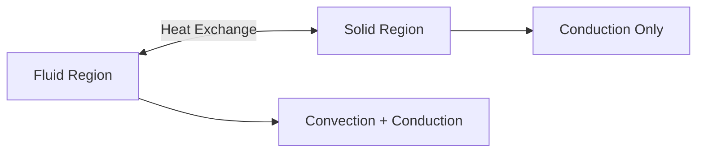

# Conjugate Heat Transfer

Conjugate Heat Transfer (CHT)

---

## Overview

> **CHT** = Heat transfer between fluid and solid regions

---

## 1. Multi-Region Concept



---

## 2. Solver

```bash
# Main CHT solver
chtMultiRegionFoam
```

---

## 3. Region Setup

```cpp
// constant/regionProperties
regions
(
    fluid  (fluid)
    solid  (heater bottomAir)
);
```

---

## 4. Interface Boundary

```cpp
// 0/fluid/T
interface
{
    type    compressible::turbulentTemperatureCoupledBaffleMixed;
    Tnbr    T;
    kappaMethod     fluidThermo;
    value   uniform 300;
}

// 0/solid/T
interface
{
    type    compressible::turbulentTemperatureCoupledBaffleMixed;
    Tnbr    T;
    kappaMethod     solidThermo;
    value   uniform 300;
}
```

---

## 5. Energy Equations

```cpp
// Fluid: convection + conduction
∂(ρh)/∂t + ∇·(ρUh) = ∇·(k∇T)

// Solid: conduction only
∂(ρh)/∂t = ∇·(k∇T)
```

---

## 6. Mesh Splitting

```bash
# Split mesh into regions
topoSet
splitMeshRegions -cellZonesOnly -overwrite
```

---

## Quick Reference

| Task | File/Command |
|------|--------------|
| Define regions | `regionProperties` |
| Interface BC | `turbulentTemperatureCoupledBaffleMixed` |
| Split mesh | `splitMeshRegions` |
| Run | `chtMultiRegionFoam` |

---

## Concept Check

<details>
<summary><b>1. CHT ทำอะไร?</b></summary>

**Solve heat** in fluid + solid simultaneously
</details>

<details>
<summary><b>2. Interface BC ทำอะไร?</b></summary>

**Match temperature and heat flux** ระหว่าง regions
</details>

<details>
<summary><b>3. Solid region ต่างจาก fluid อย่างไร?</b></summary>

**No convection** — conduction only
</details>

---

## Related Documents

- **ภาพรวม:** [00_Overview.md](00_Overview.md)
- **Registry:** [04_Object_Registry_Architecture.md](04_Object_Registry_Architecture.md)
