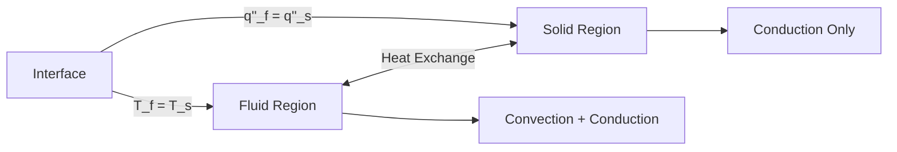

# Conjugate Heat Transfer

Conjugate Heat Transfer (CHT) — การถ่ายเทความร้อนร่วม (แบบต่อเนื่อง) ระหว่างของไหลและของแข็ง

---

## Learning Objectives

หลังจากอ่านบทนี้ คุณจะสามารถ:
- อธิบายแนวคิดพื้นฐานของ Conjugate Heat Transfer (CHT) และความแตกต่างจากการวิเคราะห์แยกส่วน
- เขียนให้ได้ Interface Conditions ทางคณิตศาสตร์ ระหว่างของไหลและของแข็ง
- Setup case แบบ multi-region ด้วย `chtMultiRegionFoam` ได้อย่างถูกต้อง
- วิเคราะห์และแก้ไขปัญหา convergence ที่พบบ่อยใน CHT simulation
- ประยุกต์ใช้กับแอปพลิเคชัน heat exchanger, electronics cooling และ thermal management

---

## 1. What is Conjugate Heat Transfer?

### 1.1 Definition (คืออะไร?)

**Conjugate Heat Transfer (CHT)** = การวิเคราะห์ความร้อนร่วมกันใน **ของไหล (fluid)** และ **ของแข็ง (solid)** แบบต่อเนื่อง ผ่าน **interface** เดียวกัน

> **Why "Conjugate"?** → เพราะ solve **ทั้งสองโดเมน** พร้อมกัน (coupled) ไม่ใช่แยก solve แล้วมาเฉลย BC ทีหลัง

### 1.2 Why CHT Matters (ทำไมต้องใช้?)

| Traditional (แยก) | CHT (ร่วม) |
|---|---|
| สมมติ BC ที่ interface (เช่น constant T, constant q'') | **BC หาอัตโนมัติ** จาก coupling |
| Error สูงถ้า flow-thermal interaction แรง | **แม่นยำกว่า** สำหรับ conjugate problems |
| Iterative manual BC adjustment | **อัตโนมัติ** ผ่าน solver |

**Applications:** Heat exchangers, electronics cooling, turbine blades, combustion chambers, HVAC

---

## 2. Theory: Interface Conditions (เงื่อนไขที่ Interface)

ที่ interface ระหว่าง fluid (f) และ solid (s) ต้องสอดคล้อง **กฎเหล็ก 2 ข้อ**:

### 2.1 Temperature Continuity (ความต่อเนื่องของอุณหภูมิ)

```cpp
T_f|_interface = T_s|_interface
```

> **Physical meaning:** อุณหภูมิที่จุดสัมผัสเดียวกัน **ต้องเท่ากัน** (ไม่มี jump)

### 2.2 Heat Flux Continuity (ความต่อเนื่องของ Heat Flux)

```cpp
q''_f|_interface = q''_s|_interface
```

หรือเขียนด้วย Fourier's Law:

```cpp
k_f · ∇T_f|_interface = k_s · ∇T_s|_interface
```

> **Physical meaning:** ความร้อนที่ไหลออกจาก fluid **ต้องเท่ากับ** ความร้อนที่ไหลเข้า solid (conservation of energy)

### 2.3 Derivation (การแปลงสมการ)

จาก **First Law of Thermodynamics** ที่ interface:

```
Energy from fluid = Energy to solid
∫_A q''_f · dA = ∫_A q''_s · dA
```

สำหรับ interface แบน (flat, normal unit vector **n**):

```cpp
q''_f · n = q''_s · n
```

แทน Fourier's Law (q'' = -k∇T):

```cpp
(-k_f ∇T_f) · n = (-k_s ∇T_s) · n
k_f (∂T_f/∂n) = k_s (∂T_s/∂n)
```

---

## 3. Multi-Region Solver Architecture

### 3.1 Solver Overview

```bash
# Main CHT solver (implicit coupling)
chtMultiRegionFoam
```

**How it works:**
1. Solve fluid region (momentum + energy)
2. Solve solid region (energy only)
3. **Exchange** T และ q'' ที่ interface
4. Repeat until convergence

### 3.2 Multi-Region Concept

<!-- IMAGE: IMG_06_001 -->
<!-- 
Purpose: เพื่อแสดงหลักการของ CHT (Conjugate Heat Transfer) ที่มี 2 Regions แยกกัน (Fluid vs Solid) แต่สื่อสารกันผ่าน Interface. ภาพนี้ต้องโชว์กฎเหล็ก 2 ข้อที่ Interface: 1. อุณหภูมิเท่ากัน ($T_f = T_s$) 2. Heat Flux เท่ากัน ($q''_f = q''_s$).
Prompt: "Cross-section Diagram of CHT Multi-Region Physics. **Left (Fluid):** Blue streamlines, T-profile curve. Annotate: 'Convection'. **Right (Solid):** Orange gradient. Annotate: 'Conduction'. **Interface:** Vertical line with EQUATIONS: 'T_f = T_s' and 'k_f grad(T) = k_s grad(T)'. **Style:** Engineering thermal analysis schematics, clear mathematical text."
-->
![[IMG_06_001.jpg]]



---

## 4. Implementation: Setup Guide

### 4.1 Region Definition

```cpp
// constant/regionProperties
regions
(
    fluid  (fluid)                    // Single fluid region
    solid  (heater bottomAir)        // Multiple solid regions
);
```

> **Note:** ชื่อ region ต้องตรงกับ directory name (`0/fluid`, `0/solid`)

### 4.2 Mesh Splitting

```bash
# 1. Define cellZones ใน topoSetDict
topoSet

# 2. Split mesh ตาม cellZones
splitMeshRegions -cellZonesOnly -overwrite

# Output:
# - constant/fluid/polyMesh
# - constant/solid/polyMesh
```

### 4.3 Interface Boundary Condition

```cpp
// 0/fluid/T
interface
{
    type    compressible::turbulentTemperatureCoupledBaffleMixed;
    Tnbr    T;                           // Field name ใน neighbor region
    kappaMethod     fluidThermo;         // คำนวณ k จาก fluid thermo
    value   uniform 300;                 // Initial guess
}

// 0/solid/T
interface
{
    type    compressible::turbulentTemperatureCoupledBaffleMixed;
    Tnbr    T;                           // Field name ใน neighbor region
    kappaMethod     solidThermo;         // คำนวณ k จาก solid thermo
    value   uniform 300;                 // Initial guess
}
```

**How it enforces interface conditions:**
1. **T continuity:** แชร์ค่า T ระหว่าง regions ผ่าน `Tnbr`
2. **Flux continuity:** คำนวณ q'' จากทั้งสองฝั่ง แล้ว balance ผ่าน `kappaMethod`

### 4.4 Energy Equations

```cpp
// Fluid: convection + conduction
∂(ρh)/∂t + ∇·(ρUh) = ∇·(k∇T)

// Solid: conduction only
∂(ρh)/∂t = ∇·(k∇T)
```

> **Key difference:** Fluid region มี convection term `∇·(ρUh)`; Solid region ไม่มี

---

## 5. Troubleshooting Common Issues

### 5.1 Divergence at Interface

**Symptoms:**
- Temperature spikes หรือ oscillates ที่ interface
- Residuals ไม่ลูกหลีง

**Solutions:**

| Issue | Fix |
|---|---|
| Mesh quality ไม่ดีที่ interface | ใช้ `splitMeshRegions -cellZonesOnly` และ check non-orthogonality |
| Under-relaxation แรงไป | ลด `relaxationFactors` ใน `fvSolution` |
| Initial condition แย่มาก | ใช้ `potentialFlow` หรือ `steadyState` ก่อน |

### 5.2 Convergence Slow

**Causes:**
- Thermal inertia สูงใน solid region
- Time step ใหญ่เกินไปสำหรับ conduction timescale

**Solutions:**

```cpp
// system/fvSolution
solid
{
    nCorrectors     2;        // Increase สำหรับ solid
    nNonOrthogonalCorrectors 1;
}
```

### 5.3 Heat Flux Mismatch

**Check:**
```bash
# Post-process heat flux ที่ interface
postProcess -func "components(grad(T))"
wallHeatFlux
```

**Expected:** `q''_fluid ≈ -q''_solid` (ขัดแย้งกันเพราะ normal direction ต่างกัน)

---

## 6. Quick Reference

| Task | File/Command |
|---|---|
| Define regions | `constant/regionProperties` |
| Interface BC | `compressible::turbulentTemperatureCoupledBaffleMixed` |
| Split mesh | `splitMeshRegions -cellZonesOnly` |
| Run solver | `chtMultiRegionFoam` |
| Check heat flux | `postProcess -func wallHeatFlux` |

---

## 7. Concept Check

<details>
<summary><b>1. CHT ทำอะไร?</b></summary>

**Solve heat** ใน fluid + solid พร้อมกัน ผ่าน interface coupling
</details>

<details>
<summary><b>2. Interface BC ทำอะไร?</b></summary>

**Match temperature (T_f = T_s)** และ **heat flux (q''_f = q''_s)** ระหว่าง regions
</details>

<details>
<summary><b>3. Solid region ต่างจาก fluid อย่างไร?</b></summary>

**No convection term** — conduction only (∂(ρh)/∂t = ∇·(k∇T))
</details>

<details>
<summary><b>4. kappaMethod ใช้ทำอะไร?</b></summary>

**Calculate thermal conductivity (k)** สำหรับ flux continuity condition (k_f ∇T_f = k_s ∇T_s)
</details>

---

## 8. Key Takeaways

✅ **CHT** = Solve fluid + solid heat transfer simultaneously ผ่าน coupled interface  
✅ **Interface conditions:** T continuity (T_f = T_s) + Flux continuity (k_f ∇T_f = k_s ∇T_s)  
✅ **Solver:** `chtMultiRegionFoam` ใช้ implicit coupling ผ่าน `turbulentTemperatureCoupledBaffleMixed`  
✅ **Setup:** 1) Define regions, 2) Split mesh, 3) Set interface BC, 4) Run  
✅ **Troubleshooting:** Check mesh quality, adjust under-relaxation, validate heat flux balance  

---

## 9. Related Documents

- **ภาพรวม coupled physics:** [00_Overview.md](00_Overview.md)
- **ทฤษฎี coupling:** [01_Coupled_Physics_Fundamentals.md](01_Coupled_Physics_Fundamentals.md)
- **FSI (โครงสร้าง + ของไหล):** [03_Fluid_Structure_Interaction.md](03_Fluid_Structure_Interaction.md)
- **Object registry:** [04_Object_Registry_Architecture.md](../../MODULE_05_OPENFOAM_PROGRAMMING/CONTENT/04_OBJECT_REGISTRIES/04_Object_Registry_Architecture.md)

---

## 10. Further Reading

- **OpenFOAM Guide:** CHT heat exchanger tutorial
- **Theory:** Incropera & DeWitt, *Fundamentals of Heat and Mass Transfer*, Ch. 3-4
- **Applications:** Electronics cooling (ICEPAK), Turbine cooling (ANSYS)