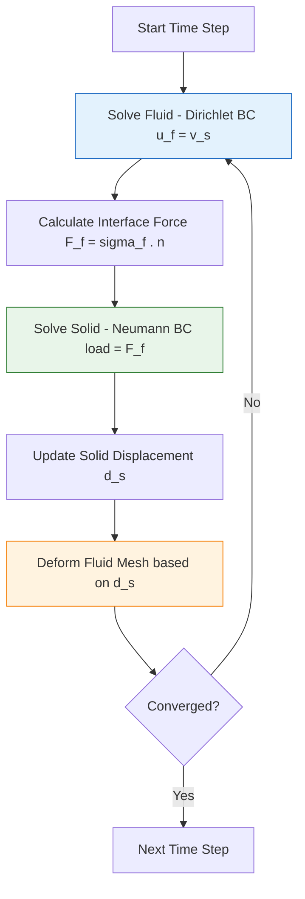

# Fluid-Structure Interaction (FSI) in OpenFOAM

## 1. Hook: When Fluids Bend Solids

Consider a **wind turbine blade** flexing in a gust, a **blood vessel** pulsing with heartbeat, or a **submarine periscope** vibrating due to vortex shedding. These are **Fluid-Structure Interaction (FSI)** problems, where fluid forces deform a structure, and the structure's motion modifies the fluid flow—a **two-way coupled**, highly non-linear system.

> [!INFO] Real-World Applications
> - **Aerospace**: Wing flutter, helicopter rotor dynamics
> - **Biomedical**: Blood flow in arteries, heart valve mechanics
> - **Civil Engineering**: Bridge aerodynamics, wind loads on buildings
> - **Marine**: Propeller-blade interactions, underwater vehicle dynamics

![[flexible_plate_fsi.png]]

### The Challenge

In FSI, the coupling creates challenges beyond standard CFD:

*   **Added Mass Effect**: Fluid inertia resists structural acceleration, leading to numerical instability
*   **Mesh Deformation**: The fluid mesh must move and deform to accommodate the solid, requiring dynamic mesh handling
*   **Time Scale Disparity**: Structural vibration modes may be much faster than fluid flow timescales

> [!WARNING] Stability Critical
> The ==added mass effect== is the primary source of numerical instability in FSI simulations. When fluid density approaches solid density ($\rho_f \approx \rho_s$), explicit coupling schemes become unstable unless special techniques are employed.

---

## 2. Blueprint: OpenFOAM FSI Ecosystem

OpenFOAM offers three main approaches to FSI:

### A. `solids4foam` (Specialized Toolkit)

*   **Type:** Monolithic / Strong Partitioned
*   **Best For:** Large deformations, non-linear materials, complex FSI
*   **Mechanism:** Solves fluid and solid equations in a tightly coupled loop (or monolithic matrix)
*   **Pros:** Most robust for strong coupling (e.g., blood flow)

### B. `preCICE` (External Coupling)

*   **Type:** Partitioned (Black-box)
*   **Best For:** Coupling OpenFOAM with external FEA solvers (CalculiX, ANSYS, Abaqus)
*   **Mechanism:** Uses the `preCICE` library to exchange boundary data
*   **Pros:** Allows using best-in-class structural solvers

### C. Native `mapped` Coupling (Lightweight)

*   **Type:** Explicit Partitioned
*   **Best For:** Small deformations, one-way coupling, flutter analysis
*   **Mechanism:** Uses `dynamicMotionSolverFvMesh` and `mapped` boundary conditions
*   **Pros:** Native, no external dependencies

> [!TIP] Selection Guide
> | Application | Recommended Tool |
> |-------------|------------------|
> | Large deformations, hyperelastic materials | **solids4foam** |
> | Coupling with commercial FEA codes | **preCICE** |
> | Small deformations, prototyping | **Native mapped** |

---

## 3. Internal Mechanics: FSI Mathematics

### Fluid Domain (ALE Formulation)

Navier-Stokes on a moving mesh (Arbitrary Lagrangian-Eulerian):

$$\rho_f \frac{\partial \mathbf{u}_f}{\partial t} + \rho_f (\mathbf{u}_f - \mathbf{u}_g) \cdot \nabla \mathbf{u}_f = -\nabla p + \mu_f \nabla^2 \mathbf{u}_f$$

$$\nabla \cdot \mathbf{u}_f = 0$$

**Variables:**
- $\rho_f$: Fluid density
- $\mathbf{u}_f$: Fluid velocity
- $\mathbf{u}_g$: Grid/mesh velocity
- $p$: Pressure
- $\mu_f$: Fluid viscosity

### Solid Domain

Elastodynamics equation:

$$\rho_s \frac{\partial^2 \mathbf{d}}{\partial t^2} = \nabla \cdot \boldsymbol{\sigma}_s + \mathbf{f}_s$$

**Variables:**
- $\rho_s$: Solid density
- $\mathbf{d}$: Displacement
- $\boldsymbol{\sigma}_s$: Cauchy stress tensor
- $\mathbf{f}_s$: External forces

### Interface Conditions

At the fluid-solid interface $\Gamma_{FSI}$:

1.  **Kinematic Continuity (Velocity):**
    $$\mathbf{u}_f = \frac{\partial \mathbf{d}}{\partial t} \quad \text{on} \quad \Gamma_{FSI}$$

2.  **Dynamic Equilibrium (Traction):**
    $$\boldsymbol{\sigma}_f \cdot \mathbf{n}_f + \boldsymbol{\sigma}_s \cdot \mathbf{n}_s = \mathbf{0} \quad \text{on} \quad \Gamma_{FSI}$$

**Variables:**
- $\mathbf{n}_f, \mathbf{n}_s$: Outward unit normals for fluid and solid domains

---

## 4. Mechanism: Coupling Algorithms

### Partitioned Approach (Dirichlet-Neumann)

The most common FSI algorithm follows a **staggered approach**:



**Algorithm Steps:**

1.  **Fluid Step (Dirichlet):** Solve fluid using structure velocity as BC
    $$\mathbf{u}_f|_{\Gamma} = \mathbf{v}_s$$

2.  **Force Transfer:** Calculate fluid stress
    $$\mathbf{F}_{fs} = \oint_{\Gamma} \boldsymbol{\sigma}_f \cdot \mathbf{n} \, \mathrm{d}S$$

3.  **Solid Step (Neumann):** Solve structure using fluid force as load
    $$\boldsymbol{\sigma}_s \cdot \mathbf{n}_s = -\mathbf{t}_f$$

4.  **Mesh Update:** Move fluid mesh based on solid displacement

### Strong vs. Weak Coupling

| **Aspect** | **Weak (Explicit)** | **Strong (Implicit)** |
|------------|---------------------|----------------------|
| **Algorithm** | Sequential per time step | Iterative within time step |
| **Stability** | Unstable for $\rho_f \approx \rho_s$ | Stable for all density ratios |
| **Cost** | Lower (one solve per domain) | Higher (multiple iterations) |
| **Use Case** | $\rho_f \ll \rho_s$ (air/steel) | $\rho_f \approx \rho_s$ (water/rubber) |

### Stabilization: Aitken Relaxation

To prevent divergence in strong coupling, displacement is under-relaxed dynamically:

$$\mathbf{d}^{k+1} = \mathbf{d}^k + \omega_k (\tilde{\mathbf{d}} - \mathbf{d}^k)$$

$$\omega^{n+1} = \omega^n \frac{(\mathbf{r}^{n-1})^T(\mathbf{r}^{n-1} - \mathbf{r}^n)}{(\mathbf{r}^{n-1} - \mathbf{r}^n)^T(\mathbf{r}^{n-1} - \mathbf{r}^n)}$$

Where:
- $\omega_k$: Dynamic relaxation factor
- $\mathbf{r}^n = \mathbf{d}^n - \mathbf{d}^{n-1}$: Iteration residual

> [!INFO] Implementation
> Aitken acceleration is particularly effective for FSI problems with moderate density ratios ($0.1 < \rho_f/\rho_s < 1.0$).

---

## 5. Usage: Getting Started with FSI (Native)

For a simple "Flag Flutter" case using native OpenFOAM tools:

### 1. Mesh Motion Setup

In `constant/dynamicMeshDict`:

```cpp
dynamicFvMesh   dynamicMotionSolverFvMesh;
motionSolverLibs (fvMotionSolvers);
solver          displacementLaplacian;
diffusivity     quadratic inverseDistance (flag_wall);
```

The `displacementLaplacian` solver smooths mesh motion according to:

$$\nabla \cdot (\gamma \nabla \mathbf{d}) = 0$$

Where $\gamma$ is the diffusivity field (higher near walls to preserve boundary layer resolution).

### 2. Boundary Conditions

**Fluid Side (`0/pointDisplacement`):**

```cpp
flag_wall
{
    type            fixedValue;
    value           uniform (0 0 0);
}
```

### 3. Stability Settings

In `system/fvSolution`:

```cpp
relaxationFactors
{
    fields
    {
        p               0.3;
        U               0.5;
    }
}
```

### 4. Running

For true FSI, `solids4foam` is recommended:

```bash
# Example solids4foam run
solids4Foam
```

For lightweight problems with small deformations:

```bash
# Moving mesh solver (fluid only with moving boundary)
pimpleDyMFoam
```

---

## 6. Why FSI is Challenging: Numerical Stability

### The Added Mass Instability

The **added mass effect** occurs when a structure accelerates through a dense fluid:

$$\mathbf{F}_{\text{added}} = -M_a \frac{\mathrm{d}^2 \mathbf{d}}{\mathrm{d}t^2}$$

$$M_a = \rho_f \int_{\Gamma} \mathbf{N}^T \mathbf{N} \, \mathrm{d}\Gamma$$

**Stability Criterion:**

Explicit coupling becomes unstable when:

$$\frac{\rho_f}{\rho_s} > C_{\text{crit}}$$

Where $C_{\text{crit}} \approx 0.1-1.0$ depending on geometry and discretization.

| **Density Ratio** | **Stability** | **Recommended Strategy** |
|-------------------|---------------|---------------------------|
| < 0.01 | Very High | Explicit coupling |
| 0.01 - 0.1 | Moderate | Aitken relaxation |
| > 0.1 | Very Low | Implicit coupling |

> [!WARNING] Water-Rubber Systems
> For water-rubber systems where $\rho_f/\rho_s \approx 1$, strong implicit coupling is ==mandatory== for stability.

### Stabilization Techniques

#### 1. Under-Relaxation

$$\mathbf{d}^{n+1} = \mathbf{d}^n + \omega(\mathbf{d}^* - \mathbf{d}^n)$$

Where $\omega \in [0.1, 0.5]$ for stability.

#### 2. Interface Quasi-Newton (IQN)

Approximates the inverse Jacobian of the interface mapping:

$$\mathbf{W}^{n+1} = \mathbf{W}^n + \frac{(\Delta\mathbf{R}^n - \mathbf{W}^n\Delta\mathbf{d}^n)\Delta\mathbf{d}^{nT}}{\Delta\mathbf{d}^{nT}\Delta\mathbf{d}^n}$$

#### 3. Artificial Compressibility

Adds numerical dissipation to stabilize pressure-velocity coupling:

$$\mu_{\text{art}} = C_{\text{art}} \rho_f h |\mathbf{v}_f - \mathbf{v}_m|$$

---

## 7. Summary: Key Insights

### Coupling Strategy Selection

**Critical Parameter:** Density ratio $\rho_f/\rho_s$

| **Scenario** | **Condition** | **Strategy** | **Reason** |
|--------------|---------------|--------------|------------|
| Light structures in air | $\rho_f \ll \rho_s$ | **Weak coupling** | Sufficient accuracy, low cost |
| Moderate density ratio | $0.1 < \rho_f/\rho_s < 1$ | **Strong coupling** | Required for stability |
| Heavy structures in water | $\rho_f \approx \rho_s$ | **Strong coupling** | Maintain physical accuracy |

### Key Takeaways

*   **Added Mass Instability:** The killer of explicit FSI schemes. Use implicit coupling or strong under-relaxation when fluid density is high (water).
*   **Mesh Quality:** The limiting factor. Large deformations ruin the fluid mesh. Use diffusion-based smoothing or automatic remeshing.
*   **Time Step:** Must satisfy both fluid CFL and structural stability criteria:

    $$\Delta t < \min\left( \text{CFL} \cdot \frac{\Delta x}{|\mathbf{U}_f|}, \sqrt{\frac{m_s}{k_{structure}}} \right)$$

*   **Convergence Monitoring:** Track both interface residuals and energy balance:

    ```cpp
    scalar residualForce = mag(fluidForce - solidForce);
    scalar energyError = mag(totalEnergyChange - expectedEnergyChange);
    ```

---

## 8. Conservation Checks

### Force Balance at Interface

$$\boldsymbol{\sigma}_f \cdot \mathbf{n}_f + \boldsymbol{\sigma}_s \cdot \mathbf{n}_s = \mathbf{0}$$

### Energy Conservation

$$\frac{\mathrm{d}}{\mathrm{d}t} (E_f + E_s) = P_f - D_s + Q_{\text{boundary}}$$

Where:
- $E_f, E_s$: Fluid and solid energy
- $P_f$: Power input from fluid
- $D_s$: Structural damping dissipation
- $Q_{\text{boundary}}$: Heat/energy flux through boundaries

### Implementation in OpenFOAM

```cpp
// Force balance verification
scalarField qFluid = -kFluid.boundaryField()[fluidPatchID] *
                     gradTFluid.boundaryField()[fluidPatchID];
scalarField qSolid = -kSolid.boundaryField()[solidPatchID] *
                     gradTSolid.boundaryField()[solidPatchID];

scalar maxRelError = max(mag(qFluid + qSolid)/mag(qFluid));

if (maxRelError < 1e-6)
{
    Info << "Interface force balance verified: " << maxRelError << endl;
}
```

---

## 9. Advanced Learning Path

1. **Start Simple:** Begin with static FSI (one-way coupling) to understand the framework
2. **Progress to Dynamic:** Move to weak coupling with small deformations
3. **Master Strong Coupling:** Implement Aitken relaxation and IQN methods
4. **Explore Advanced Topics:**
   - Large deformation finite elements
   - Hyperelastic material models
   - Contact mechanics in FSI
   - Parallel FSI algorithms

> [!TIP] Resources
> - **solids4foam**: [https://github.com/OpenFOAM/OpenFOAM-dev](https://github.com/OpenFOAM/OpenFOAM-dev)
> - **preCICE**: [https://precice.org/](https://precice.org/)
> - **Textbooks**: "Computational Fluid-Structure Interaction" by Bungartz and Schäfer

---

The FSI framework in OpenFOAM provides a powerful foundation for simulating coupled fluid-structure problems, from simple flag flutter to complex biomedical applications. Success requires careful attention to stability, mesh quality, and appropriate coupling strategy selection.
