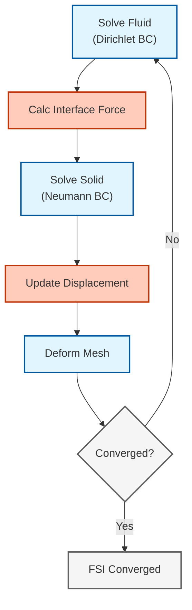

# ปฏิสัมพันธ์ระหว่างของไหลและโครงสร้าง (Fluid-Structure Interaction - FSI)

## เทคนิคการจำลองปฏิสัมพันธ์ระหว่างของไหลและโครงสร้างใน OpenFOAM

## 🎯 Learning Objectives (เป้าหมายการเรียนรู้)

After completing this section, you should be able to:
- **Define** FSI and identify when one-way vs two-way coupling is required (กำหนดและระบุเมื่อต้องใช้การคัปปลิงทางเดียวหรือสองทาง)
- **Explain** the added mass effect and its impact on numerical stability (อธิบายผลกระทบของมวลที่เพิ่มเข้ามาและผลต่อเสถียรภาพเชิงตัวเลข)
- **Compare** FSI tools: solids4foam, preCICE, and native coupling (เปรียบเทียบเครื่องมือ FSI ที่แตกต่างกัน)
- **Implement** basic FSI simulations with mesh deformation (นำไปใช้การจำลอง FSI พื้นฐานด้วยการเสียรูปเมช)
- **Apply** Aitken relaxation and other stabilization techniques (ปรับใช้เทคนิคการทำให้เสถียรเช่น Aitken relaxation)

> **แหล่งที่มาของทฤษฎีพื้นฐาน:** สำหรับกรอบงานทางทฤษฎีของ weak/strong coupling และสมการ interface โปรดดู [01_Coupled_Physics_Fundamentals.md](01_Coupled_Physics_Fundamentals.md)

---

## 1. WHAT: Definition and Fundamentals (สิ่งที่คือ นิยามและพื้นฐาน)

### 1.1 What is FSI? (FSI คืออะไร?)

**Fluid-Structure Interaction (FSI)** เป็นปรากฏการณ์ที่เกิดจาก **การคัปปลิงแบบสองทาง (two-way coupling)** ระหว่างของไหลและโครงสร้าง:
- **Fluid → Solid**: แรงจากของไหล (pressure, shear stress) ทำให้โครงสร้างเสียรูป
- **Solid → Fluid**: การเคลื่อนที่ของโครงสร้างเปลี่ยนรูปทรงโดเมนของไหล ส่งผลต่อการไหล

**Characteristics (ลักษณะเฉพาะ):**
- ระบบ **ไม่เชิงเส้นสูง** (highly nonlinear)
- ต้องการ **การคำนวณแบบวนซ้ำ** (iterative solution)
- **มาตราส่วนเวลาหลากหลาย** (multiple time scales)

### 1.2 Real-World Applications (การประยุกต์ใช้งานจริง)

| Domain (โดเมน) | Applications (การประยุกต์ใช้) |
|-----------------|---------------------------|
| **Aerospace** (การบินและอวกาศ) | Wing flutter, rotor dynamics, aeroelasticity |
| **Biomedical** (ชีวการแพทย์) | Blood flow in arteries, heart valve mechanics |
| **Civil Engineering** (วิศวกรรมโยธา) | Bridge aerodynamics, wind loads on buildings |
| **Marine** (วิศวกรรมทางเรือ) | Propeller-hull interaction, underwater vehicle dynamics |

> [!TIP] **มุมมองเปรียบเทียบ: คู่เต้นรำลีลาศ (The Ballroom Dancers Analogy)**
> FSI ก็เหมือนคู่เต้นลีลาศที่ต้องขยับตัวไปพร้อมกัน:
> - **Kinematic Continuity (ความต่อเนื่องทางจลนศาสตร์):** ความเร็วต้องเท่ากัน ห้ามเหยียบเท้า (Interface Velocity Match)
> - **Dynamic Continuity (สมดุลทางพลศาสตร์):** แรงที่จับกันต้องสมดุล (Interface Force Balance)
> - **Weak Coupling:** เหมือนเพิ่งหัดเต้น ฝ่ายชายขยับก่อน แล้วรอฝ่ายหญิงขยับตาม (One-Way / Explicit)
> - **Strong Coupling:** เหมือนนักเต้นมืออาชีพ ขยับและถ่ายเทแรงแทบจะเป็นเนื้อเดียวกัน (Two-Way / Implicit)
> - **Added Mass:** เหมือนเต้นกับคู่ที่ตัวหนักมาก (น้ำ) ต้องใช้แรงมหาศาล

### 1.3 Key Challenges (ความท้าทายหลัก)

1. **Added Mass Effect (ผลกระทบของมวลที่เพิ่มเข้ามา)**: ความเฉื่อยของของไหลต้านทานการเร่งความเร็วของโครงสร้าง นำไปสู่ความไม่เสถียรเชิงตัวเลข
2. **Mesh Deformation (การเสียรูปของเมช)**: เมชของไหลต้องเคลื่อนที่และเสียรูป จำเป็นต้องมี dynamic mesh handling
3. **Time Scale Disparity (ความแตกต่างของมาตราส่วนเวลา)**: รูปแบบการสั่นสะเทือนของโครงสร้างอาจเร็วกว่ามาตราส่วนเวลาของการไหล

<!-- IMAGE: IMG_06_005 -->
![[IMG_06_005.jpg]]

> **รูปที่ 1:** แผนภาพแสดงปฏิสัมพันธ์ระหว่างของไหลกับโครงสร้างแบบ 2-Way Coupling โดย Fluid จ่ายแรงให้ Solid ทำให้เกิดการเสียรูป และการเสียรูปนั้นเปลี่ยนหน้าตาของ Fluid Domain ในวงจรปิด

---

## 2. WHY: Motivation and Need (ทำไม แรงจูงใจและความจำเป็น)

### 2.1 Why is FSI Important? (ทำไม FSI จึงสำคัญ?)

**Physical Reality (ความเป็นจริงทางฟิสิกส์):**
- โครงสร้างในโลกแห่งความเป็นจริง **ไม่เคยเป็น rigid body** อย่างสมบูรณ์
- การละเลยผลของ FSI อาจนำไปสู่ **การทำนายที่ผิดพลาด** หรือ **ความล้มเหลวของโครงสร้าง** (catastrophic failure)
- ตัวอย่าง: การพริ้วของปีกเครื่องบิน (flutter) สามารถทำให้เครื่องบินแตกออกในอากาศ

**Design Optimization (การออกแบบที่เหมาะสม):**
- **Weight reduction**: ลดน้ำหนักวัสดุโดยยังคงความแข็งแรง
- **Performance improvement**: ปรับปรุงประสิทธิภาพของใบพัด ปีก และอุปกรณ์อื่นๆ
- **Safety margins**: ประเมินความปลอดภัยในสถานการณ์ขีดโจน

### 2.2 The Added Mass Crisis (วิกฤตด้านเสถียรภาพ)

> [!WARNING] คำเตือนด้านเสถียรภาพ
> ==ผลกระทบของมวลที่เพิ่มเข้ามา== เป็นที่มาหลักของความไม่เสถียรเชิงตัวเลขในการจำลอง FSI เมื่อความหนาแน่นของของไหลเข้าใกล้ความหนาแน่นของของแข็ง ($\rho_f \approx \rho_s$) รูปแบบการคัปปลิงแบบ explicit จะไม่เสถียร เว้นแต่จะใช้เทคนิคพิเศษเข้ามาช่วย

**Critical Density Ratio (อัตราส่วนความหนาแน่นวิกฤต):**

การคัปปลิงแบบ Explicit จะไม่เสถียรเมื่อ:

$$\frac{\rho_f}{\rho_s} > C_{\text{crit}}$$

โดยที่ $C_{\text{crit}} \approx 0.1-1.0$ ขึ้นอยู่กับเรขาคณิตและการ discretization

| **Density Ratio** | **Stability** | **Recommended Strategy** |
|-------------------|---------------|---------------------------|
| < 0.01 | Very High | Explicit Coupling |
| 0.01 - 0.1 | Moderate | Aitken Relaxation |
| > 0.1 | Very Low | Implicit Coupling |

### 2.3 Why Specialized Tools? (ทำไมต้องใช้เครื่องมือเฉพาะทาง?)

**Limitations of Standard CFD (ข้อจำกัดของ CFD มาตรฐาน):**
- Standard OpenFOAM solvers **ไม่สามารถจัดการ** กับการเสียรูปของโครงสร้างได้โดยตรง
- **ไม่มี** ตัวแก้ปัญหา solid mechanics ในตัว
- **ไม่มี** กลไกการคัปปลิงระหว่าง fluid และ solid domains

---

## 3. HOW: Implementation in OpenFOAM (อย่างไร การนำไปใช้ใน OpenFOAM)

### 3.1 OpenFOAM FSI Ecosystem (ระบบนิเวศ FSI ใน OpenFOAM)

OpenFOAM มีวิธีหลัก 3 วิธีในการจัดการกับ FSI:

#### A. `solids4foam` (Specialized Toolkit)

| Aspect | Description |
|--------|-------------|
| **Type** | Monolithic / Strong Partitioned |
| **Best For** | Large deformations, hyperelastic materials, complex FSI |
| **Mechanism** | Solves fluid and solid equations in tightly coupled loops (or monolithic matrix) |
| **Advantage** | Most robust for strong coupling (e.g., blood flow) |

#### B. `preCICE` (External Coupling)

| Aspect | Description |
|--------|-------------|
| **Type** | Partitioned (Black-box) |
| **Best For** | Connecting OpenFOAM with external FEA solvers (CalculiX, ANSYS, Abaqus) |
| **Mechanism** | Uses `preCICE` library for boundary data exchange |
| **Advantage** | Allows using best-in-class structural solvers |

#### C. Native `mapped` Coupling (Lightweight)

| Aspect | Description |
|--------|-------------|
| **Type** | Partitioned (Explicit) |
| **Best For** | Small deformations, one-way coupling, flutter analysis |
| **Mechanism** | Uses `dynamicMotionSolverFvMesh` and `mapped` BCs |
| **Advantage** | Native feature, no external libraries needed |

> [!TIP] Selection Guide (คู่มือการเลือก)
> | Application | Recommended Tool |
> |-------------|------------------|
> | Large deformations, hyperelastic materials | **solids4foam** |
> | Commercial FEA connection | **preCICE** |
> | Small deformations, prototyping | **Native mapped** |

### 3.2 Mathematical Foundation (รากฐานคณิตศาสตร์)

#### 3.2.1 Fluid Domain (ALE Formulation)

สมการ Navier-Stokes บนเมชที่เคลื่อนที่ (Arbitrary Lagrangian-Eulerian):

$$\rho_f \frac{\partial \mathbf{u}_f}{\partial t} + \rho_f (\mathbf{u}_f - \mathbf{u}_g) \cdot \nabla \mathbf{u}_f = -\nabla p + \mu_f \nabla^2 \mathbf{u}_f$$

$$\nabla \cdot \mathbf{u}_f = 0$$

**Variables:**
- $\rho_f$: Fluid density (ความหนาแน่นของไหล)
- $\mathbf{u}_f$: Fluid velocity (ความเร็วของไหล)
- $\mathbf{u}_g$: Grid/mesh velocity (ความเร็วของกริต/เมช)
- $p$: Pressure (ความดัน)
- $\mu_f$: Fluid viscosity (ความหนืดของของไหล)

#### 3.2.2 Solid Domain

สมการพลศาสตร์ความยืดหยุ่น (Elastodynamics):

$$\rho_s \frac{\partial^2 \mathbf{d}}{\partial t^2} = \nabla \cdot \boldsymbol{\sigma}_s + \mathbf{f}_s$$

**Variables:**
- $\rho_s$: Solid density (ความหนาแน่นของแข็ง)
- $\mathbf{d}$: Displacement (การกระจัด)
- $\boldsymbol{\sigma}_s$: Cauchy stress tensor (เทนเซอร์ความเค้นของ Cauchy)
- $\mathbf{f}_s$: External forces (แรงภายนอก)

#### 3.2.3 Interface Conditions

เงื่อนไขที่ส่วนต่อประสานระหว่างของไหลและของแข็ง $\Gamma_{FSI}$:

**1. Kinematic Continuity (ความต่อเนื่องทางจลนศาสตร์):**

$$\mathbf{u}_f = \frac{\partial \mathbf{d}}{\partial t} \quad \text{on} \quad \Gamma_{FSI}$$

**2. Dynamic Continuity (สมดุลทางพลศาสตร์):**

$$\boldsymbol{\sigma}_f \cdot \mathbf{n}_f + \boldsymbol{\sigma}_s \cdot \mathbf{n}_s = \mathbf{0} \quad \text{on} \quad \Gamma_{FSI}$$

**Variables:**
- $\mathbf{n}_f, \mathbf{n}_s$: Unit outward normal vectors for fluid and solid domains

### 3.3 Coupling Algorithms (อัลกอริทึมการคัปปลิง)

> **หมายเหตุ:** สำหรับคำอธิบายโดยละเอียดเกี่ยวกับ weak vs strong coupling โปรดดู [01_Coupled_Physics_Fundamentals.md](01_Coupled_Physics_Fundamentals.md#2-coupling-algorithms)

#### 3.3.1 Partitioned Approach (Dirichlet-Neumann)

อัลกอริทึม FSI ที่พบบ่อยที่สุดคือ **วิธีแบบสลับลำดับ (staggered approach)**:



**Algorithm Steps:**

1. **Fluid Step (Dirichlet):** Solve fluid using structure velocity as BC
   $$\mathbf{u}_f|_{\Gamma} = \mathbf{v}_s$$

2. **Force Transfer:** Calculate fluid stress
   $$\mathbf{F}_{fs} = \oint_{\Gamma} \boldsymbol{\sigma}_f \cdot \mathbf{n} \, \mathrm{d}S$$

3. **Solid Step (Neumann):** Solve structure using fluid force as load
   $$\boldsymbol{\sigma}_s \cdot \mathbf{n}_s = -\mathbf{t}_f$$

4. **Mesh Update:** Move fluid mesh according to solid displacement

#### 3.3.2 Strong vs. Weak Coupling Summary

| **Aspect** | **Weak (Explicit)** | **Strong (Implicit)** |
|------------|---------------------|----------------------|
| **Algorithm** | Sequential per timestep | Iterative within timestep |
| **Stability** | Unstable for $\rho_f \approx \rho_s$ | Stable for all density ratios |
| **Cost** | Lower (solve each domain once) | Higher (multiple iterations) |
| **Use Case** | $\rho_f \ll \rho_s$ (air/steel) | $\rho_f \approx \rho_s$ (water/rubber) |

> **รายละเอียดเพิ่มเติม:** ดูคำอธิบายเชิงลึกเกี่ยวกับ coupling algorithms ได้ที่ [01_Coupled_Physics_Fundamentals.md](01_Coupled_Physics_Fundamentals.md#2-coupling-algorithms)

#### 3.3.3 Aitken Relaxation (การผ่อนคลายแบบ Aitken)

เพื่อป้องกันการลู่ออกในการคัปปลิงแบบเข้มข้น การกระจัดจะถูกผ่อนคลายแบบไดนามิก:

$$\mathbf{d}^{k+1} = \mathbf{d}^k + \omega_k (\tilde{\mathbf{d}} - \mathbf{d}^k)$$

$$\omega^{n+1} = \omega^n \frac{(\mathbf{r}^{n-1})^T(\mathbf{r}^{n-1} - \mathbf{r}^n)}{(\mathbf{r}^{n-1} - \mathbf{r}^n)^T(\mathbf{r}^{n-1} - \mathbf{r}^n)}$$

**Variables:**
- $\omega_k$: Dynamic relaxation factor (ปัจจัยการผ่อนคลายแบบไดนามิก)
- $\mathbf{r}^n = \mathbf{d}^n - \mathbf{d}^{n-1}$: Iteration residual (ค่าตกค้างจากการวนซ้ำ)

> [!INFO] Application Note (หมายเหตุการใช้งาน)
> การเร่งความเร็วแบบ Aitken มีประสิทธิภาพอย่างยิ่งสำหรับปัญหา FSI ที่มีอัตราส่วนความหนาแน่นปานกลาง ($0.1 < \rho_f/\rho_s < 1.0$)

### 3.4 Practical Implementation (การนำไปใช้จริง)

#### 3.4.1 Mesh Motion Setup

ในไฟล์ `constant/dynamicMeshDict`:

```cpp
dynamicFvMesh   dynamicMotionSolverFvMesh; // Set dynamic mesh type
motionSolverLibs (fvMotionSolvers);        // Load motion solver libraries
solver          displacementLaplacian;     // Use Laplacian displacement solver
diffusivity     quadratic inverseDistance (flag_wall); // Quadratic inverse distance diffusivity
```

**Key Concepts:**
- **Laplacian Smoothing**: กระจายการเคลื่อนที่จากผนังไปยังภายในโดเมนอย่างราบรื่น
- **Inverse Distance**: ค่าน้ำหนักที่ลดลงตามระยะทาง ช่วยรักษาความละเอียดบริเวณใกล้ผนัง
- **Quadratic Diffusivity**: ค่าสัมประสิทธิ์แพร่แบบกำลังสอง ให้การควบคุมที่ละเอียดกว่า

**Laplacian Smoothing Equation:**

$$\nabla \cdot (\gamma \nabla \mathbf{d}) = 0$$

โดยที่:
- $\gamma$: Diffusivity field (ฟิลด์ความแพร่) ที่มีค่าสูงบริเวณใกล้ผนังเพื่อรักษาความละเอียดของ boundary layer
- $\mathbf{d}$: Displacement vector (เวกเตอร์การกระจัด)

#### 3.4.2 Boundary Conditions

**Fluid side (`0/pointDisplacement`):**

```cpp
flag_wall
{
    type            fixedValue;  // Set fixed value boundary condition
    value           uniform (0 0 0);  // Zero displacement (clamped condition)
}
```

**Key Concepts:**
- **Clamped Boundary**: เงื่อนไขขอบเขตที่ยึดโครงสร้างไว้นิ่งไม่ให้เคลื่อนที่ ใช้สำหรับจุดยึดของโครงสร้าง
- **pointDisplacement**: ฟิลด์ที่เก็บการกระจัดของจุดยอดเมช (mesh vertex displacement)
- **Zero Displacement**: การกระจัดเป็นศูนย์หมายถึงจุดที่ไม่มีการเคลื่อนที่

#### 3.4.3 Stability Settings

ในไฟล์ `system/fvSolution`:

```cpp
relaxationFactors
{
    fields
    {
        p               0.3;  // Pressure relaxation factor
        U               0.5;  // Velocity relaxation factor
    }
}
```

**Key Concepts:**
- **Under-Relaxation**: เทคนิคการลดความรุนแรงของการอัปเดตค่าตัวแปร ช่วยเพิ่มเสถียรภาพของการคำนวณ
- **Pressure-Velocity Coupling**: ความสัมพันธ์ระหว่างความดันและความเร็วในสมการ Navier-Stokes ต้องใช้การผ่อนคลายเพื่อความเสถียร
- **Convergence Acceleration**: การใช้ปัจจัยผ่อนคลายที่เหมาะสมช่วยให้การคำนวณลู่เข้าสู่คำตอบได้เร็วขึ้น

**Under-Relaxation Equation:**

$$\phi^{n+1} = \phi^n + \omega (\phi^* - \phi^n)$$

โดยที่:
- $\phi$: Variable (pressure or velocity)
- $\omega$: Relaxation factor (0 < ω ≤ 1)
- $\phi^*$: Newly calculated value

#### 3.4.4 Running the Simulation

สำหรับปัญหา FSI ที่แท้จริง แนะนำให้ใช้ `solids4foam`:

```bash
# Run solids4foam example
solids4Foam
```

สำหรับปัญหาเบาๆ ที่มีการเสียรูปขนาดเล็ก:

```bash
# Moving mesh solver (fluid only with moving boundaries)
pimpleDyMFoam
```

### 3.5 Stabilization Techniques (เทคนิคการทำให้เสถียร)

#### 3.5.1 The Added Mass Instability

**Added Mass Force:**

$$\mathbf{F}_{\text{added}} = -M_a \frac{\mathrm{d}^2 \mathbf{d}}{\mathrm{d}t^2}$$

$$M_a = \rho_f \int_{\Gamma} \mathbf{N}^T \mathbf{N} \, \mathrm{d}\Gamma$$

**Stability Criterion:**

Explicit coupling will be unstable when:

$$\frac{\rho_f}{\rho_s} > C_{\text{crit}}$$

โดยที่ $C_{\text{crit}} \approx 0.1-1.0$ ขึ้นอยู่กับเรขาคณิตและ discretization

> [!WARNING] Water-Rubber Systems
> สำหรับระบบน้ำ-ยางที่ $\rho_f/\rho_s \approx 1$ การคัปปลิงแบบ implicit ที่เข้มข้นเป็นเรื่อง ==จำเป็นอย่างยิ่ง== เพื่อความเสถียร

#### 3.5.2 Stabilization Methods

**1. Under-Relaxation:**

$$\mathbf{d}^{n+1} = \mathbf{d}^n + \omega(\mathbf{d}^* - \mathbf{d}^n)$$

โดยที่ $\omega \in [0.1, 0.5]$ เพื่อความเสถียร

**2. Interface Quasi-Newton (IQN):**

ประมาณค่า Jacobian ผกผันของการแม็พที่ส่วนต่อประสาน:

$$\mathbf{W}^{n+1} = \mathbf{W}^n + \frac{(\Delta\mathbf{R}^n - \mathbf{W}^n\Delta\mathbf{d}^n)\Delta\mathbf{d}^{nT}}{\Delta\mathbf{d}^{nT}\Delta\mathbf{d}^n}$$

**3. Artificial Compressibility:**

เพิ่มการสลายตัวเชิงตัวเลขเพื่อให้การคัปปลิงระหว่างความดันและความเร็วเสถียร:

$$\mu_{\text{art}} = C_{\text{art}} \rho_f h |\mathbf{v}_f - \mathbf{v}_m|$$

### 3.6 Conservation Checks (การตรวจสอบการอนุรักษ์)

#### Force Balance at Interface

$$\boldsymbol{\sigma}_f \cdot \mathbf{n}_f + \boldsymbol{\sigma}_s \cdot \mathbf{n}_s = \mathbf{0}$$

#### Energy Conservation

$$\frac{\mathrm{d}}{\mathrm{d}t} (E_f + E_s) = P_f - D_s + Q_{\text{boundary}}$$

**Variables:**
- $E_f, E_s$: Fluid and solid energy (พลังงานของของไหลและของแข็ง)
- $P_f$: Power from fluid (กำลังงานจากของไหล)
- $D_s$: Structural damping dissipation (การสลายตัวจากการหน่วงโครงสร้าง)
- $Q_{\text{boundary}}$: Heat/energy flux through boundary (ฟลักซ์ความร้อน/พลังงานผ่านขอบเขต)

#### Implementation in OpenFOAM

```cpp
// Calculate heat flux at fluid side of interface
scalarField qFluid = -kFluid.boundaryField()[fluidPatchID] *
                     gradTFluid.boundaryField()[fluidPatchID];

// Calculate heat flux at solid side of interface
scalarField qSolid = -kSolid.boundaryField()[solidPatchID] *
                     gradTSolid.boundaryField()[solidPatchID];

// Calculate maximum relative error between fluid and solid fluxes
scalar maxRelError = max(mag(qFluid + qSolid)/mag(qFluid));

// Check force balance at interface
if (maxRelError < 1e-6)
{
    Info << "Interface force balance check passed: " << maxRelError << endl;
}
```

**Key Concepts:**
- **Force Balance**: หลักการอนุรักษ์โมเมนตัมที่ส่วนต่อประสาน แรงจากของไหลต้องสมดุลกับแรงที่กระทำต่อโครงสร้าง
- **Energy Conservation**: หลักการอนุรักษ์พลังงานในระบบ FSI พลังงานรวมของระบบต้องคงที่
- **Interface Continuity**: ความต่อเนื่องของการถ่ายเทแรงและพลังงานที่ส่วนต่อประสาน

---

## 4. 📌 Key Takeaways (ข้อสรุปสำคัญ)

### Coupling Strategy Selection (การเลือกกลยุทธ์การคัปปลิง)

**Critical Parameter:** Density ratio $\rho_f/\rho_s$

| **Situation** | **Condition** | **Strategy** | **Reason** |
|--------------|---------------|--------------|------------|
| Lightweight structures in air | $\rho_f \ll \rho_s$ | **Weak coupling** | Sufficient accuracy, low cost |
| Moderate density ratio | $0.1 < \rho_f/\rho_s < 1$ | **Strong coupling** | Required for stability |
| Heavy structures in water | $\rho_f \approx \rho_s$ | **Strong coupling** | Maintains physical accuracy |

### Critical Insights (ข้อมูลเชิงลึกสำคัญ)

1. **Added Mass Instability (ความไม่เสถียรจากมวลที่เพิ่มเข้ามา):** ตัวทำลายรูปแบบ FSI แบบ explicit ควรใช้การคัปปลิงแบบ implicit หรือการผ่อนคลายที่รุนแรงเมื่อความหนาแน่นของของไหลสูง (เช่น น้ำ)

2. **Mesh Quality (คุณภาพเมช):** ปัจจัยจำกัด การเสียรูปขนาดใหญ่ทำลายเมชของไหล ควรใช้การทำให้เรียบแบบอาศัยการแพร่ (diffusion-based smoothing) หรือการสร้างเมชใหม่โดยอัตโนมัติ

3. **Time Step (ช่วงเวลา):** ต้องเป็นไปตามเกณฑ์ CFL ของไหลและเสถียรภาพของโครงสร้าง:

    $$\Delta t < \min\left( \text{CFL} \cdot \frac{\Delta x}{|\mathbf{U}_f|}, \sqrt{\frac{m_s}{k_{structure}}} \right)$$

4. **Convergence Monitoring (การตรวจสอบการลู่เข้า):** ติดตามทั้งค่าตกค้างที่ส่วนต่อประสานและสมดุลพลังงาน:

    ```cpp
    // Calculate force residual between fluid and solid domains
    scalar residualForce = mag(fluidForce - solidForce);
    // Calculate energy change error for verification
    scalar energyError = mag(totalEnergyChange - expectedEnergyChange);
    ```

---

## 5. 🚀 Advanced Learning Path (เส้นทางการเรียนรู้ขั้นสูง)

1. **Start Simple:** เริ่มด้วย FSI สภาวะคงตัว (การคัปปลิงทางเดียว) เพื่อทำความเข้าใจกรอบงาน
2. **Move to Dynamic:** เปลี่ยนไปใช้การคัปปลิงแบบอ่อนที่มีการเสียรูปขนาดเล็ก
3. **Master Strong Coupling:** ใช้งานการผ่อนคลายแบบ Aitken และวิธี IQN
4. **Explore Advanced Topics:**
   - Finite elements for large deformations (ไฟไนต์เอลิเมนต์สำหรับการเสียรูปขนาดใหญ่)
   - Hyperelastic material models (แบบจำลองวัสดุไฮเปอร์อิลาสติก)
   - Contact mechanics in FSI (กลศาสตร์การสัมผัสใน FSI)
   - Parallel FSI algorithms (อัลกอริทึม FSI แบบขนาน)

> [!TIP] Resources (แหล่งข้อมูล)
> - **solids4foam**: [https://github.com/OpenFOAM/OpenFOAM-dev](https://github.com/OpenFOAM/OpenFOAM-dev)
> - **preCICE**: [https://precice.org/](https://precice.org/)
> - **Textbook**: "Computational Fluid-Structure Interaction" โดย Bungartz และ Schäfer

---

## 🧠 Concept Check: ทดสอบความเข้าใจ

<details>
<summary><b>1. เมื่อไหร่ที่ FSI แบบ "One-Way Coupling" เพียงพอ?</b></summary>

**คำตอบ:** เมื่อ **การเสียรูปของโครงสร้างมีขนาดเล็ก** และ **ไม่ส่งผลกลับไปเปลี่ยนทิศทางลม/น้ำ อย่างมีนัยสำคัญ**
*   เช่น ป้ายจราจรที่สั่นเล็กน้อยเมื่อลมพัด หรือท่อระบายความร้อนที่ขยายตัวจากความร้อนนิดหน่อย
*   ถ้าปีกเครื่องบินบิดจนแรงยกเปลี่ยน หรือธงพริ้วสะบัด ต้องใช้ **Two-Way Coupling**
</details>

<details>
<summary><b>2. "Added Mass Effect" คืออะไร และทำไมมันถึงน่ากลัวใน FSI?</b></summary>

**คำตอบ:** คือปรากฏการณ์ที่โครงสร้างต้อง "แบก" มวลของของเหลวที่อยู่รอบๆ ไปด้วยขณะเคลื่อนที่
*   ใน **อากาศ** (เบา) ผลนี้น้อยมาก
*   ใน **น้ำ** (หนัก) ผลนี้มหาศาล น้ำมีความหนาแน่นใกล้เคียงของแข็ง
*   มันทำให้ Solver แบบ Explicit ทั่วไป **Diverge ทันที** เพราะแรงเฉื่อยของน้ำมากเกินกว่าที่โครงสร้างจะตอบสนองได้ทันใน Time step เดียว (ต้องใช้ Implicit/Iterative Coupling)
</details>

<details>
<summary><b>3. Aitken Relaxation ทำหน้าที่อะไรใน FSI loop?</b></summary>

**คำตอบ:** ทำหน้าที่ **"หาค่ากลาง" (Optimal Damping)** ในการอัปเดตตำแหน่งอย่างชาญฉลาด
*   แทนที่จะขยับตามแรงที่คำนวณได้ 100% (ซึ่งอาจจะเลยเถิด/Overshoot)
*   Aitken จะดูประวัติการขยับครั้งก่อนๆ แล้วคำนวณ $\omega$ (Relaxation Factor) ที่ดีที่สุดในรอบนั้นๆ เพื่อให้ลู่เข้าสู่สมดุลเร็วที่สุดและไม่ระเบิด
</details>

---

## 📖 Related Documents (เอกสารที่เกี่ยวข้อง)

### Module Structure (โครงสาร์มอดูล)
- **Overview:** [00_Overview.md](00_Overview.md) — Coupled Physics Overview & Catalog
- **Fundamentals:** [01_Coupled_Physics_Fundamentals.md](01_Coupled_Physics_Fundamentals.md) — Weak/Strong Coupling Theory (ดูทฤษฎีพื้นฐานที่นี่)
- **Previous:** [02_Conjugate_Heat_Transfer.md](02_Conjugate_Heat_Transfer.md) — Conjugate Heat Transfer
- **Next:** [04_Advanced_Coupling.md](04_Advanced_Coupling.md) — Advanced Coupling Techniques

### Related Topics (หัวข้อที่เกี่ยวข้อง)
- **Complex Multiphase:** [../01_COMPLEX_MULTIPHASE_PHENOMENA/00_Overview.md](../01_COMPLEX_MULTIPHASE_PHENOMENA/00_Overview.md) — ปรากฏการณ์หลายเฟส
- **Equations Reference:** [../99_EQUATIONS_REFERENCE/00_Overview.md](../99_EQUATIONS_REFERENCE/00_Overview.md) — สมการอ้างอิง