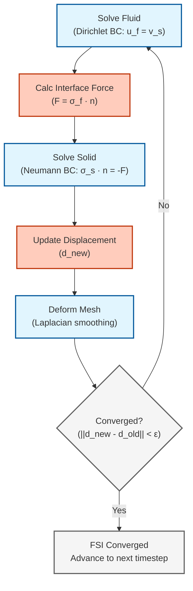

# ปฏิสัมพันธ์ระหว่างของไหลและโครงสร้าง (Fluid-Structure Interaction - FSI)

## เทคนิคการจำลองปฏิสัมพันธ์ระหว่างของไหลและโครงสร้างใน OpenFOAM

## 🎯 Learning Objectives (เป้าหมายการเรียนรู้)

After completing this section, you should be able to:
- **Define** FSI and distinguish between one-way vs two-way coupling scenarios (กำหนดและแยกแยะสถานการณ์การคัปปลิงทางเดียวและสองทาง)
- **Explain** the added mass effect and its impact on numerical stability (อธิบายผลกระทบของมวลที่เพิ่มเข้ามาและผลต่อเสถียรภาพเชิงตัวเลข)
- **Compare** FSI implementation approaches: solids4foam, preCICE, and native coupling (เปรียบเทียบแนวทางการนำ FSI ไปใช้)
- **Implement** basic FSI simulations with proper mesh deformation techniques (นำไปใช้การจำลอง FSI พื้นฐานด้วยเทคนิคการเสียรูปเมชที่เหมาะสม)
- **Apply** stabilization techniques including Aitken relaxation (ปรับใช้เทคนิคการทำให้เสถียรรวมถึง Aitken relaxation)

> **ที่มาของทฤษฎีพื้นฐาน:** สำหรับกรอบงานทางทฤษฎีของ weak/strong coupling และสมการ interface โปรดดู [01_Coupled_Physics_Fundamentals.md](01_Coupled_Physics_Fundamentals.md)

---

## 1. WHAT: Definitions and Concepts (สิ่งที่คือ นิยามและแนวคิด)

### 1.1 What is FSI? (FSI คืออะไร?)

**Fluid-Structure Interaction (FSI)** เป็นปรากฏการณ์ทางฟิสิกส์แบบ **multiphysics** ที่เกิดจากการคัปปลิงแบบสองทาง (two-way coupling) ระหว่าง:
- **Fluid Domain**: ของไหลที่ไหลและส่งถ่ายแรง (pressure, shear stress)
- **Solid Domain**: โครงสร้างที่เสียรูปและเคลื่อนที่ส่งกลับมาเปลี่ยนโดเมนของไหล

**ความสำคัญทางฟิสิกส์:** โครงสร้างในโลกแห่งความเป็นจริงไม่เคยเป็น rigid body อย่างสมบูรณ์ การละเลยผลของ FSI อาจนำไปสู่การทำนายที่ผิดพลาดหรือความล้มเหลวของโครงสร้าง (catastrophic failure)

### 1.2 One-Way vs Two-Way Coupling

| **Aspect** | **One-Way Coupling** | **Two-Way Coupling** |
|------------|---------------------|----------------------|
| **Direction** | Fluid → Solid only | Fluid ↔ Solid (bidirectional) |
| **Solid Effect** | Structure does NOT affect flow | Structure motion changes flow domain |
| **Complexity** | Simple, sequential | Complex, iterative |
| **Stability** | Always stable | May require stabilization |
| **Applications** | Small deformations, stiff structures | Large deformations, lightweight structures |

**เกณฑ์การเลือก:**
- ใช้ **One-Way** เมื่อ: การเสียรูปของโครงสร้างเล็กมากและไม่เปลี่ยนทิศทางลม/น้ำอย่างมีนัยสำคัญ (เช่น ป้ายจราจรที่สั่นเล็กน้อย)
- ใช้ **Two-Way** เมื่อ: การเสียรูปของโครงสร้างส่งผลกลับไปเปลี่ยนการไหล (เช่น ปีกเครื่องบินพริ้ว, ธงปลิว, หัวใจเต้น)

### 1.3 Real-World Applications (การประยุกต์ใช้งานจริง)

| **Domain** (โดเมน) | **Applications** (การประยุกต์ใช้) | **Coupling Type** |
|---------------------|----------------------------|-------------------|
| **Aerospace** (การบินและอวกาศ) | Wing flutter, rotor dynamics, aeroelasticity | Two-Way |
| **Biomedical** (ชีวการแพทย์) | Blood flow in arteries, heart valve mechanics | Two-Way |
| **Civil Engineering** (วิศวกรรมโยธา) | Bridge aerodynamics, wind loads on buildings | Usually One-Way |
| **Marine** (วิศวกรรมทางเรือ) | Propeller-hull interaction, underwater vehicles | Two-Way |
| **Energy** (พลังงาน) | Wind turbine blades, hydroelectric turbines | Two-Way |

> **มุมมองเปรียบเทียบ: The Ballroom Dancers Analogy**
> FSI ก็เหมือนคู่เต้นลีลาศ:
> - **Kinematic Continuity:** ความเร็วต้องเท่ากัน ห้ามเหยียบเท้า (Interface Velocity Match)
> - **Dynamic Continuity:** แรงที่จับกันต้องสมดุล (Interface Force Balance)
> - **Weak/Explicit:** ฝ่ายชายขยับก่อน แล้วรอฝ่ายหญิงตาม
> - **Strong/Implicit:** ขยับและถ่ายเทแรงเป็นเนื้อเดียวกัน
> - **Added Mass:** เต้นกับคู่หนัก (น้ำ) ต้องใช้แรงมหาศาล

### 1.4 Key Challenges (ความท้าทายหลัก)

1. **Added Mass Effect**: ความเฉื่อยของของไหลต้านทานการเร่งความเร็วของโครงสร้าง นำไปสู่ความไม่เสถียรเชิงตัวเลขเมื่อ $\rho_f \approx \rho_s$

2. **Mesh Deformation**: เมชของไหลต้องเคลื่อนที่และเสียรูปตามโครงสร้าง จำเป็นต้องมี dynamic mesh handling

3. **Time Scale Disparity**: รูปแบบการสั่นสะเทือนของโครงสร้างอาจเร็วกว่ามาตราส่วนเวลาของการไหล

4. **Conservation Enforcement**: ต้องรักษาสมดุลแรงและพลังงานที่ส่วนต่อประสานระหว่างโดเมน

---

## 2. WHY: Motivation and Applications (ทำไม แรงจูงใจและการประยุกต์ใช้)

### 2.1 Why FSI Matters (ทำไม FSI จึงสำคัญ)

**Physical Necessity (ความจำเป็นทางฟิสิกส์):**
- ในโลกแห่งความเป็นจริง **ไม่มีโครงสร้างใดที่เป็น rigid body อย่างสมบูรณ์**
- การละเลย FSI อาจทำให้:
  - **ทำนายแรงและความเค้นผิดพลาด** → โครงสร้างอาจพังเพราะถ่วงน้ำหนักไม่พอ
  - **พลาดปรากฏการณ์การสั่น (flutter)** → เครื่องบินสามารถแตกออกในอากาศได้ (Historical: Tacoma Narrows Bridge)
  - **เข้าใจผิดคุณสมบัติการไหล** → ประสิทธิภาพของเครื่องจักรลดลง

**Design Optimization Benefits (ประโยชน์ด้านการออกแบบ):**
- **Weight Reduction**: ลดน้ำหนักวัสดุโดยยังคงความแข็งแรง (lightweight but safe)
- **Performance Improvement**: ปรับปรุงประสิทธิภาพของใบพัด, ปีก, และอุปกรณ์อื่นๆ ผ่านการเสียรูปที่เหมาะสม
- **Safety Margins**: ประเมินความปลอดภัยในสถานการณ์ขีดโจนที่ CFD ธรรมดาไม่สามารถทำนายได้

### 2.2 The Added Mass Crisis (วิกฤตด้านเสถียรภาพ)

> **คำเตือนด้านเสถียรภาพ:** ==ผลกระทบของมวลที่เพิ่มเข้ามา== เป็นที่มาหลักของความไม่เสถียรเชิงตัวเลขในการจำลอง FSI เมื่อความหนาแน่นของของไหลเข้าใกล้ความหนาแน่นของของแข็ง ($\rho_f \approx \rho_s$) รูปแบบการคัปปลิงแบบ explicit จะไม่เสถียร เว้นแต่จะใช้เทคนิคพิเศษ

**Critical Density Ratio (อัตราส่วนความหนาแน่นวิกฤต):**

การคัปปลิงแบบ Explicit จะไม่เสถียรเมื่อ:

$$\frac{\rho_f}{\rho_s} > C_{\text{crit}}$$

โดยที่ $C_{\text{crit}} \approx 0.1-1.0$ ขึ้นอยู่กับเรขาคณิตและการ discretization

| **Density Ratio ($\rho_f/\rho_s$)** | **Stability** | **Recommended Strategy** |
|-----------------------------------|---------------|---------------------------|
| < 0.01 (Air/Steel) | Very High | Explicit Coupling |
| 0.01 - 0.1 (Light structures in air) | Moderate | Aitken Relaxation |
| 0.1 - 1.0 (Water/rubber, blood/tissue) | Low | Implicit Coupling |
| > 1.0 (Unusual) | Very Low | Monolithic / Strong IQN |

### 2.3 When Standard CFD is Not Enough (เมื่อ CFD มาตรฐานไม่เพียงพอ)

**ข้อจำกัดของ OpenFOAM solvers มาตรฐาน:**
- Standard solvers (`simpleFoam`, `pimpleFoam`) **ไม่สามารถ**จัดการกับการเสียรูปของโครงสร้างได้
- **ไม่มี**ตัวแก้ปัญหา solid mechanics ในตัว (no structural solver)
- **ไม่มี**กลไกการคัปปลิงระหว่าง fluid และ solid domains

**ดังนั้นจึงต้องใช้:**
1. **solids4foam** - เครื่องมือเฉพาะทางสำหรับ FSI แบบ strong coupling
2. **preCICE** - ระบบเชื่อมต่อกับ external FEA solvers (CalculiX, ANSYS, Abaqus)
3. **Native mapped coupling** - สำหรับปัญหา simple ที่มีการเสียรูปขนาดเล็ก

---

## 3. HOW: Implementation in OpenFOAM (อย่างไร การนำไปใช้ใน OpenFOAM)

### 3.1 FSI Implementation Approaches (แนวทางการนำ FSI ไปใช้)

OpenFOAM ecosystem มีวิธีหลัก 3 วิธีในการจัดการกับ FSI:

#### A. `solids4foam` (Recommended for Complex FSI)

| **Aspect** | **Description** |
|------------|-----------------|
| **Type** | Monolithic / Strong Partitioned |
| **Best For** | Large deformations, hyperelastic materials, blood flow, biomechanics |
| **Mechanism** | Solves fluid and solid equations in tightly coupled loops or monolithic matrix |
| **Advantages** | Most robust for $\rho_f \approx \rho_s$, handles large deformations |
| **Limitations** | Requires external installation, steeper learning curve |

#### B. `preCICE` (For Multi-Solver Coupling)

| **Aspect** | **Description** |
|------------|-----------------|
| **Type** | Partitioned (Black-box coupling) |
| **Best For** | Connecting OpenFOAM with external FEA solvers (CalculiX, ANSYS, Abaqus) |
| **Mechanism** | Uses preCICE library for boundary data exchange at interface |
| **Advantages** | Use best-in-class solvers for each physics, flexible |
| **Limitations** | Complex setup, communication overhead |

#### C. Native `mapped` Coupling (Lightweight Approach)

| **Aspect** | **Description** |
|------------|-----------------|
| **Type** | Partitioned (Explicit/Weak) |
| **Best For** | Small deformations, one-way coupling, flutter analysis, prototyping |
| **Mechanism** | Uses `dynamicMotionSolverFvMesh` and `mapped` boundary conditions |
| **Advantages** | No external libraries, simpler setup, good for learning |
| **Limitations** | Not robust for $\rho_f \approx \rho_s$, limited deformation capability |

> **คู่มือการเลือกเครื่องมือ:**
> | **Application** | **Recommended Tool** |
> |-----------------|---------------------|
> | Large deformations, hyperelastic materials, blood flow | **solids4foam** |
> | Connection with commercial FEA (ANSYS, Abaqus) | **preCICE** |
> | Small deformations, one-way coupling, learning | **Native mapped** |
> | Moderate density ratio (0.1 - 1.0) | **solids4foam + Aitken** |

### 3.2 Mathematical Foundation (รากฐานคณิตศาสตร์)

#### 3.2.1 Fluid Domain: ALE Formulation

สมการ Navier-Stokes บนเมชที่เคลื่อนที่ (Arbitrary Lagrangian-Eulerian - ALE):

**Momentum Equation:**

$$\rho_f \frac{\partial \mathbf{u}_f}{\partial t} + \rho_f (\mathbf{u}_f - \mathbf{u}_g) \cdot \nabla \mathbf{u}_f = -\nabla p + \mu_f \nabla^2 \mathbf{u}_f$$

**Continuity Equation:**

$$\nabla \cdot \mathbf{u}_f = 0$$

**Variables:**
- $\rho_f$: Fluid density (ความหนาแน่นของไหล)
- $\mathbf{u}_f$: Fluid velocity (ความเร็วของไหล)
- $\mathbf{u}_g$: Grid/mesh velocity (ความเร็วของเมชที่เคลื่อนที่)
- $p$: Pressure (ความดัน)
- $\mu_f$: Dynamic viscosity (ความหนืดของของไหล)

**ความสำคัญของ ALE:** เทอม $(\mathbf{u}_f - \mathbf{u}_g)$ คือความเร็วสัมพัทธ์ระหว่างของไหลและเมช ซึ่งจัดการกับผลกระทบจากการเคลื่อนที่ของเมช

#### 3.2.2 Solid Domain: Elastodynamics

สมการพลศาสตร์ความยืดหยุ่น (Elastodynamics equation):

$$\rho_s \frac{\partial^2 \mathbf{d}}{\partial t^2} = \nabla \cdot \boldsymbol{\sigma}_s + \mathbf{f}_s$$

**Variables:**
- $\rho_s$: Solid density (ความหนาแน่นของแข็ง)
- $\mathbf{d}$: Displacement field (ฟิลด์การกระจัด)
- $\boldsymbol{\sigma}_s$: Cauchy stress tensor (เทนเซอร์ความเค้นของ Cauchy)
- $\mathbf{f}_s$: Body forces (แรงต่อหน่วยปริมาตร เช่น แรงโน้มถ่วง)

**Constitutive Relation (Linear Elasticity):**

$$\boldsymbol{\sigma}_s = \lambda_s \text{tr}(\boldsymbol{\epsilon}) \mathbf{I} + 2\mu_s \boldsymbol{\epsilon}$$

$$\boldsymbol{\epsilon} = \frac{1}{2} (\nabla \mathbf{d} + (\nabla \mathbf{d})^T)$$

โดยที่:
- $\lambda_s, \mu_s$: Lamé parameters
- $\boldsymbol{\epsilon}$: Strain tensor (เทนเซอร์ความเครียด)

#### 3.2.3 Interface Conditions (เงื่อนไขที่ส่วนต่อประสาน)

เงื่อนไขที่ส่วนต่อประสานระหว่างของไหลและของแข็ง $\Gamma_{FSI}$:

**1. Kinematic Continuity (ความต่อเนื่องทางจลนศาสตร์):**

$$\mathbf{u}_f = \frac{\partial \mathbf{d}}{\partial t} \quad \text{on} \quad \Gamma_{FSI}$$

ความหมาย: ความเร็วของของไหลตรงส่วนต่อประสานต้องเท่ากับความเร็วของโครงสร้าง

**2. Dynamic Continuity (สมดุลทางพลศาสตร์):**

$$\boldsymbol{\sigma}_f \cdot \mathbf{n}_f + \boldsymbol{\sigma}_s \cdot \mathbf{n}_s = \mathbf{0} \quad \text{on} \quad \Gamma_{FSI}$$

ความหมาย: แรงที่ของไหลกระทำต่อโครงสร้างต้องสมดุลกับแรงตอบสนองของโครงสร้าง

**Variables:**
- $\mathbf{n}_f, \mathbf{n}_s$: Unit outward normal vectors สำหรับ fluid และ solid domains
- $\boldsymbol{\sigma}_f$: Fluid stress tensor ($-p\mathbf{I} + \mu_f(\nabla \mathbf{u}_f + \nabla \mathbf{u}_f^T)$)

### 3.3 Coupling Algorithms (อัลกอริทึมการคัปปลิง)

> **หมายเหตุ:** สำหรับคำอธิบายโดยละเอียดเกี่ยวกับ weak vs strong coupling โปรดดู [01_Coupled_Physics_Fundamentals.md](01_Coupled_Physics_Fundamentals.md)

#### 3.3.1 Partitioned Approach: Dirichlet-Neumann Staggered Scheme

อัลกอริทึม FSI ที่พบบ่อยที่สุดคือ **staggered approach**:



**Algorithm Steps:**

1. **Fluid Step (Dirichlet):** แก้สมการของไหลโดยใช้ความเร็วโครงสร้างเป็นเงื่อนไขขอบเขต
   $$\mathbf{u}_f|_{\Gamma} = \mathbf{v}_s = \frac{\partial \mathbf{d}}{\partial t}$$

2. **Force Transfer:** คำนวณแรงจากความเค้นของของไหล
   $$\mathbf{F}_{fs} = \oint_{\Gamma} \boldsymbol{\sigma}_f \cdot \mathbf{n} \, \mathrm{d}S$$

3. **Solid Step (Neumann):** แก้สมการโครงสร้างโดยใช้แรงจากของไหลเป็น load
   $$\boldsymbol{\sigma}_s \cdot \mathbf{n}_s = -\mathbf{t}_f$$

4. **Mesh Update:** เคลื่อนย้ายเมชของไหลตามการกระจัดของโครงสร้าง

5. **Convergence Check:** ตรวจสอบว่าการกระจัดลู่เข้าแล้วหรือยัง ถ้าไม่ลู่เข้าให้วนซ้ำตั้งแต่ขั้นตอนที่ 1

#### 3.3.2 Strong vs Weak Coupling Comparison

| **Aspect** | **Weak (Explicit)** | **Strong (Implicit)** |
|------------|---------------------|----------------------|
| **Algorithm** | Sequential per timestep (solve once each) | Iterative within timestep (solve until convergence) |
| **Stability** | Unstable for $\rho_f \approx \rho_s$ | Stable for all density ratios |
| **Cost per timestep** | Lower (1 fluid solve + 1 solid solve) | Higher (multiple solves until convergence) |
| **Accuracy** | First-order in time | Second-order possible |
| **Use Case** | $\rho_f \ll \rho_s$ (air/steel) | $\rho_f \approx \rho_s$ (water/rubber) |

**เกณฑ์การเลือก:**
```cpp
if (rho_fluid / rho_solid < 0.01) {
    // Air over steel: Explicit is fine
    useWeakCoupling();
} else if (rho_fluid / rho_solid < 0.1) {
    // Moderate: Try weak with Aitken relaxation
    useWeakCouplingWithAitken();
} else {
    // Water/rubber or blood/tissue: Must use strong
    useStrongCoupling();
}
```

#### 3.3.3 Aitken Dynamic Relaxation

เพื่อป้องกันการลู่ออกในการคัปปลิงแบบ strong การกระจัดจะถูกผ่อนคลายแบบไดนามิก:

**Update Formula:**

$$\mathbf{d}^{k+1} = \mathbf{d}^k + \omega_k (\tilde{\mathbf{d}} - \mathbf{d}^k)$$

**Aitken's Formula for $\omega_k$:**

$$\omega^{n+1} = \omega^n \left[ \frac{(\mathbf{r}^{n-1})^T(\mathbf{r}^{n-1} - \mathbf{r}^n)}{(\mathbf{r}^{n-1} - \mathbf{r}^n)^T(\mathbf{r}^{n-1} - \mathbf{r}^n)} \right]$$

**Variables:**
- $\omega_k$: Dynamic relaxation factor (ปัจจัยการผ่อนคลายแบบไดนามิก, $0 < \omega_k \leq 1$)
- $\tilde{\mathbf{d}}$: Newly computed displacement from solid solver
- $\mathbf{d}^k$: Displacement from previous iteration
- $\mathbf{r}^n = \mathbf{d}^n - \mathbf{d}^{n-1}$: Iteration residual (ค่าตกค้างจากการวนซ้ำ)

**Implementation Note:** Aitken acceleration มีประสิทธิภาพอย่างยิ่งสำหรับปัญหา FSI ที่มีอัตราส่วนความหนาแน่นปานกลาง ($0.1 < \rho_f/\rho_s < 1.0$)

### 3.4 Practical Implementation (การนำไปใช้จริง)

#### 3.4.1 Mesh Motion Setup

ในไฟล์ `constant/dynamicMeshDict`:

```cpp
motionSolverLibs (fvMotionSolvers);

dynamicFvMesh   dynamicMotionSolverFvMesh;

motionSolver    displacementLaplacian;

displacementLaplacianCoeffs
{
    diffusivity     quadratic inverseDistance (flag_wall);
    
    // Optional: Specify frozen zones
    frozenDiffusion yes;
}
```

**Key Concepts:**
- **Laplacian Smoothing:** กระจายการเคลื่อนที่จากผนังไปยังภายในโดเมนอย่างราบรื่น
- **Inverse Distance Weighting:** ค่าน้ำหนักที่ลดลงตามระยะทาง ช่วยรักษาความละเอียดบริเวณใกล้ผนัง
- **Quadratic Diffusivity:** ค่าสัมประสิทธิ์แพร่แบบกำลังสอง $\gamma = C/(1 + d/d_0)^2$ ให้การควบคุมที่ละเอียดกว่า

**Laplacian Smoothing Equation:**

$$\nabla \cdot (\gamma \nabla \mathbf{d}) = 0$$

โดยที่:
- $\gamma$: Diffusivity field (ฟิลด์ความแพร่) ที่มีค่าสูงบริเวณใกล้ผนังเพื่อรักษาความละเอียดของ boundary layer
- $\mathbf{d}$: Displacement vector (เวกเตอร์การกระจัด)

#### 3.4.2 Boundary Conditions for Fluid

**ในไฟล์ `0/pointDisplacement`:**

```cpp
dimensions      [0 1 0 0 0 0 0];

internalField   uniform (0 0 0);

boundaryField
{
    // Moving wall (FSI interface)
    flag_wall
    {
        type            fixedValue;
        value           uniform (0 0 0);  // Will be updated by FSI
    }
    
    // Fixed boundaries (inlet, outlet, etc.)
    inlet
    {
        type            fixedValue;
        value           uniform (0 0 0);
    }
    
    outlet
    {
        type            fixedValue;
        value           uniform (0 0 0);
    }
}
```

**ในไฟล์ `0/U` (Velocity):**

```cpp
boundaryField
{
    flag_wall
    {
        type            noSlip;  // No-slip condition for viscous flow
    }
}
```

**Key Concepts:**
- **pointDisplacement**: ฟิลด์ที่เก็บการกระจัดของจุดยอดเมช (mesh vertex displacement)
- **Clamped Boundary**: เงื่อนไข `fixedValue (0 0 0)` หมายถึงจุดที่ไม่มีการเคลื่อนที่ (จุดยึดของโครงสร้าง)
- **No-Slip Condition**: ความเร็วของของไหลที่ผนังต้องเท่ากับความเร็วของผนัง

#### 3.4.3 Stability Settings

ในไฟล์ `system/fvSolution`:

```cpp
solvers
{
    p
    {
        solver          GAMG;
        tolerance       1e-06;
        relTol          0.1;
    }
    
    pFinal
    {
        $p;
        relTol          0;
    }
    
    U
    {
        solver          smoothSolver;
        smoother        GaussSeidel;
        tolerance       1e-05;
        relTol          0.1;
    }
}

relaxationFactors
{
    fields
    {
        p               0.3;  // Pressure relaxation
    }
    equations
    {
        U               0.5;  // Velocity relaxation
    }
}
```

**Key Concepts:**
- **Under-Relaxation:** เทคนิคการลดความรุนแรงของการอัปเดตค่าตัวแปร ช่วยเพิ่มเสถียรภาพของการคำนวณ
- **Pressure-Velocity Coupling:** ใน PISO/SIMPLE algorithm ความสัมพันธ์ระหว่างความดันและความเร็วต้องใช้การผ่อนคลายเพื่อความเสถียร

**Under-Relaxation Equation:**

$$\phi^{n+1} = \phi^n + \omega (\phi^* - \phi^n)$$

โดยที่:
- $\phi$: Variable (pressure or velocity)
- $\omega$: Relaxation factor (0 < ω ≤ 1, โดยปกติ 0.3-0.7)
- $\phi^*$: Newly calculated value จาก solver
- $\phi^n$: Value from previous iteration

#### 3.4.4 Running the Simulation

**สำหรับปัญหา FSI ที่แท้จริง:**

```bash
# Run solids4foam for strong coupling problems
solids4Foam

# Run with parallel processing
decomposePar
mpirun -np 4 solids4Foam -parallel
reconstructPar
```

**สำหรับปัญหาเบาๆ ที่มีการเสียรูปขนาดเล็ก:**

```bash
# Moving mesh solver (fluid only with moving boundaries)
pimpleDyMFoam

# Check mesh quality during simulation
checkMesh -allRegions -time 0
```

### 3.5 Stabilization Techniques (เทคนิคการทำให้เสถียร)

#### 3.5.1 The Added Mass Instability

**Added Mass Force Definition:**

$$\mathbf{F}_{\text{added}} = -M_a \frac{\mathrm{d}^2 \mathbf{d}}{\mathrm{d}t^2}$$

$$M_a = \rho_f \int_{\Gamma} \mathbf{N}^T \mathbf{N} \, \mathrm{d}\Gamma$$

**Physical Meaning:** เมื่อโครงสร้างเคลื่อนที่ในของไหล มันต้องเร่งปริมาตรของไหลรอบๆ ด้วย ทำให้มี "มวลเพิ่ม" เหมือนกับว่ามีน้ำหนักตัวเอง + น้ำที่ติดตาม

**Stability Criterion:**

Explicit coupling will be unstable when:

$$\frac{\rho_f}{\rho_s} > C_{\text{crit}}$$

โดยที่ $C_{\text{crit}} \approx 0.1-1.0$ ขึ้นอยู่กับเรขาคณิตและ discretization

> **คำเตือน:** สำหรับระบบน้ำ-ยางที่ $\rho_f/\rho_s \approx 1$ การคัปปลิงแบบ implicit ที่เข้มข้นเป็นเรื่อง ==จำเป็นอย่างยิ่ง== เพื่อความเสถียร

#### 3.5.2 Stabilization Methods Comparison

| **Method** | **Principle** | **Cost** | **Best For** |
|------------|--------------|----------|-------------|
| **Under-Relaxation** | ลดขนาดการอัปเดตด้วย factor ω | Low | General stabilization |
| **Aitken Relaxation** | ปรับ ρ แบบไดนามิกจากประวัติ | Low-Medium | Moderate density ratios |
| **IQN-ILS** | Interface Quasi-Newton with Inverse Jacobian | High | High density ratios |
| **Artificial Compressibility** | เพิ่ม damping term ในสมการ | Medium | Pressure-velocity coupling |

**1. Under-Relaxation:**

$$\mathbf{d}^{n+1} = \mathbf{d}^n + \omega(\mathbf{d}^* - \mathbf{d}^n)$$

โดยที่ $\omega \in [0.1, 0.5]$ เพื่อความเสถียร

**2. Interface Quasi-Newton (IQN-ILS):**

ประมาณค่า Jacobian ผกผันของการแม็พที่ส่วนต่อประสาน:

$$\mathbf{W}^{n+1} = \mathbf{W}^n + \frac{(\Delta\mathbf{R}^n - \mathbf{W}^n\Delta\mathbf{d}^n)\Delta\mathbf{d}^{nT}}{\Delta\mathbf{d}^{nT}\Delta\mathbf{d}^n}$$

โดยที่:
- $\mathbf{W}$: ประมาณการ Jacobian ผกผัน
- $\Delta\mathbf{R}$: Change in residual
- $\Delta\mathbf{d}$: Change in displacement

**3. Artificial Compressibility:**

เพิ่มการสลายตัวเชิงตัวเลขเพื่อให้การคัปปลิงระหว่างความดันและความเร็วเสถียร:

$$\mu_{\text{art}} = C_{\text{art}} \rho_f h |\mathbf{v}_f - \mathbf{v}_m|$$

### 3.6 Conservation Verification (การตรวจสอบการอนุรักษ์)

#### Force Balance at Interface

$$\boldsymbol{\sigma}_f \cdot \mathbf{n}_f + \boldsymbol{\sigma}_s \cdot \mathbf{n}_s = \mathbf{0}$$

#### Energy Conservation

$$\frac{\mathrm{d}}{\mathrm{d}t} (E_f + E_s) = P_f - D_s + Q_{\text{boundary}}$$

**Variables:**
- $E_f, E_s$: Fluid and solid energy (พลังงานของของไหลและของแข็ง)
- $P_f$: Power input from fluid (กำลังงานจากของไหล)
- $D_s$: Structural damping dissipation (การสลายตัวจากการหน่วงโครงสร้าง)
- $Q_{\text{boundary}}$: Energy flux through boundary (ฟลักซ์พลังงานผ่านขอบเขต)

#### Implementation in OpenFOAM

```cpp
// Calculate force at fluid side of interface
vectorField fluidForce = rheo.boundaryField()[fluidPatchID].Sf()
                       & rheo.boundaryField()[fluidPatchID];

// Calculate force at solid side of interface  
vectorField solidForce = solid.boundaryField()[solidPatchID].Sf()
                       & solid.boundaryField()[solidPatchID];

// Calculate maximum relative error between fluid and solid forces
scalar maxRelError = max(mag(fluidForce + solidForce)/mag(fluidForce));

// Check force balance at interface
if (maxRelError < 1e-6)
{
    Info << "Interface force balance check PASSED: " 
         << maxRelError << endl;
}
else
{
    Warning << "Interface force balance check FAILED: " 
            << maxRelError << endl;
}

// Energy conservation check
scalar fluidEnergy = sum(0.5 * rho_f * U & U);
scalar solidEnergy = sum(0.5 * rho_s * V & V);
scalar totalEnergy = fluidEnergy + solidEnergy;
```

**Key Concepts:**
- **Force Balance**: หลักการอนุรักษ์โมเมนตัมที่ส่วนต่อประสาน แรงจากของไหลต้องสมดุลกับแรงตอบสนองของโครงสร้าง
- **Energy Conservation**: หลักการอนุรักษ์พลังงานในระบบ FSI พลังงานรวมของระบบต้องคงที่ (ไม่สูญหายหรือเกิดใหม่โดยอัตโนมัติ)
- **Interface Continuity**: ความต่อเนื่องของการถ่ายเทแรงและพลังงานที่ส่วนต่อประสาน

---

## 4. 📌 Key Takeaways (ข้อสรุปสำคัญ)

### Coupling Strategy Selection Guide (คู่มือการเลือกกลยุทธ์การคัปปลิง)

**Critical Parameter:** Density ratio $\rho_f/\rho_s$

| **Situation** | **Condition** | **Strategy** | **Reason** |
|--------------|---------------|--------------|------------|
| Lightweight structures in air | $\rho_f/\rho_s < 0.01$ | **Weak coupling** | Sufficient accuracy, low computational cost |
| Moderate density ratio | $0.01 < \rho_f/\rho_s < 0.1$ | **Weak + Aitken** | Balance between cost and stability |
| Heavy structures in water | $0.1 < \rho_f/\rho_s < 1$ | **Strong coupling** | Required for numerical stability |
| Blood flow, soft tissue | $\rho_f \approx \rho_s$ | **Strong + IQN** | Maximum stability needed |

### Critical Insights for Success (ข้อมูลเชิงลึกสำคัญสำหรับความสำเร็จ)

**1. Added Mass Instability (ความไม่เสถียรจากมวลที่เพิ่มเข้ามา):**
- เป็นตัวทำลายรูปแบบ FSI แบบ explicit
- ควรใช้การคัปปลิงแบบ implicit หรือการผ่อนคลายที่รุนแรงเมื่อความหนาแน่นของของไหลสูง (เช่น น้ำ)
- หากไม่จัดการอย่างถูกต้อง solver จะ diverge ทันที

**2. Mesh Quality (คุณภาพเมช):**
- เป็นปัจจัยจำกัดหลัก (main limiting factor)
- การเสียรูปขนาดใหญ่ทำลายเมชของไหล ทำให้ non-orthogonality เพิ่มขึ้น
- ควรใช้:
  - Diffusion-based smoothing สำหรับการเสียรูปขนาดเล็กถึงปานกลาง
  - Automatic remeshing สำหรับการเสียรูปขนาดใหญ่
  - Laplacian smoothing ด้วย quadratic inverse distance diffusivity

**3. Time Step Constraints (ข้อจำกัดของช่วงเวลา):**
- ต้องเป็นไปตามเกณฑ์ CFL ของไหลและเสถียรภาพของโครงสร้าง:

    $$\Delta t < \min\left( \text{CFL} \cdot \frac{\Delta x}{|\mathbf{U}_f|}, \sqrt{\frac{m_s}{k_{structure}}} \right)$$

    โดยที่:
    - CFL: Courant number (โดยปกติ < 1)
    - $\Delta x$: ขนาดเซลล์เมชเล็กที่สุด
    - $m_s$: มวลของโครงสร้าง
    - $k_{structure}$: ความแข็ง (stiffness) ของโครงสร้าง

**4. Convergence Monitoring (การตรวจสอบการลู่เข้า):**
- ติดตามทั้ง:
  - ค่าตกค้างที่ส่วนต่อประสาน (interface residual)
  - สมดุลพลังงาน (energy balance)
  - สมดุลแรง (force balance)

    ```cpp
    // Calculate force residual between fluid and solid domains
    scalar residualForce = mag(fluidForce - solidForce) / mag(fluidForce);
    
    // Calculate energy change error for verification
    scalar energyError = mag(totalEnergyChange - expectedEnergyChange);
    
    // Check convergence
    if (residualForce < 1e-6 && energyError < 1e-4)
    {
        Info << "FSI converged at iteration " << iter << endl;
    }
    ```

---

## 5. 🚀 Advanced Learning Path (เส้นทางการเรียนรู้ขั้นสูง)

### Progressive Learning Roadmap

**Phase 1: Foundation (พื้นฐาน)**
- เริ่มด้วย FSI สภาวะคงตัว (steady-state FSI) ที่ใช้การคัปปลิงทางเดียว (one-way coupling)
- ทำความเข้าใจกรอบงานของ ALE formulation
- ฝึกตั้งค่า dynamic mesh ใน OpenFOAM

**Phase 2: Dynamic FSI (FSI พลวัต)**
- เปลี่ยนไปใช้การคัปปลิงแบบอ่อน (weak coupling) กับการเสียรูปขนาดเล็ก
- ทำความเข้าใจและติดตั้ง solids4foam
- ฝึก run ตัวอย่างพื้นฐาน เช่น flexible beam in flow

**Phase 3: Strong Coupling Mastery (การเชี่ยวชาญการคัปปลิงแบบเข้ม)**
- ใช้งานการผ่อนคลายแบบ Aitken และ IQN-ILS
- จัดการกับปัญหา density ratio สูง (water/rubber systems)
- ฝึกตรวจสอบความเสถียรและการลู่เข้า

**Phase 4: Advanced Topics (หัวข้อขั้นสูง)**
- Finite elements สำหรับ large deformations (geometric nonlinearity)
- Hyperelastic material models (Neo-Hookean, Mooney-Rivlin)
- Contact mechanics ใน FSI (FSI with contact)
- Parallel FSI algorithms และ scalability
- Fluid-Structure-Thermal Interaction (FSTI) - การคัปปลิง 3 ฟิสิกส์

### Recommended Resources (แหล่งข้อมูลที่แนะนำ)

**Software & Tools:**
- **solids4foam**: [https://github.com/solids4foam/solids4foam](https://github.com/solids4foam/solids4foam) - เครื่องมือหลักสำหรับ FSI ใน OpenFOAM
- **preCICE**: [https://precice.org/](https://precice.org/) - Multi-solver coupling framework

**Textbooks:**
- **"Computational Fluid-Structure Interaction"** โดย Bungartz และ Schäfer
- **"Finite Element Procedures"** โดย Bathe (สำหรับพื้นฐาน FEM)
- **"Numerical Simulation of Fluid-Structure Interaction"** โดย Richter

**Review Papers:**
- Hou, G., et al. "Numerical methods for fluid-structure interaction — a review" (2012)
- Causin, et al. "Added mass effect in the design of partitioned algorithms for fluid-structure problems" (2005)

---

## 🧠 Concept Check: ทดสอบความเข้าใจ

<details>
<summary><b>1. เมื่อไหร่ที่ FSI แบบ "One-Way Coupling" เพียงพอ?</b></summary>

**คำตอบ:** เมื่อ **การเสียรูปของโครงสร้างมีขนาดเล็ก** และ **ไม่ส่งผลกลับไปเปลี่ยนทิศทางลม/น้ำ อย่างมีนัยสำคัญ**

*   **ตัวอย่างที่ใช้ One-Way ได้:**
    - ป้ายจราจรที่สั่นเล็กน้อยเมื่อลมพัด
    - ท่อระบายความร้อนที่ขยายตัวจากความร้อนนิดหน่อย
    - ตัวบ้านที่ได้รับแรงลมแต่ไม่เสียรูปมาก

*   **ตัวอย่างที่ต้องใช้ Two-Way:**
    - ปีกเครื่องบินบิดจนแรงยกเปลี่ยน
    - ธงพริ้วสะบัด
    - หัวใจเต้นที่มีการเสียรูปขนาดใหญ่
    - ใบพัดที่บิดและเปลี่ยนประสิทธิภาพ

</details>

<details>
<summary><b>2. "Added Mass Effect" คืออะไร และทำไมมันถึงน่ากลัวใน FSI?</b></summary>

**คำตอบ:** Added Mass Effect คือปรากฏการณ์ที่โครงสร้างต้อง "แบก" มวลของของเหลวที่อยู่รอบๆ ไปด้วยขณะเคลื่อนที่

*   **ในอากาศ (เบา):** ผลนี้น้อยมาก เพราะอากาศมีความหนาแน่นต่ำ ($\rho_{\text{air}} \approx 1.2$ kg/m³)
*   **ในน้ำ (หนัก):** ผลนี้มหาศาล เพราะน้ำมีความหนาแน่นสูง ($\rho_{\text{water}} \approx 1000$ kg/m³) ใกล้เคียงกับของแข็งหลายชนิด

**ทำไมน่ากลัว:**
- มันทำให้ Solver แบบ Explicit ทั่วไป **Diverge ทันที** เพราะแรงเฉื่อยของน้ำมากเกินกว่าที่โครงสร้างจะตอบสนองได้ทันใน Time step เดียว
- เมื่อ $\rho_f/\rho_s$ สูง (เช่น น้ำ/ยาง ≈ 1) ระบบจะไม่เสถียรอย่างมาก
- **วิธีแก้:** ต้องใช้ Implicit/Iterative Coupling ที่วนซ้ำจนกว่าจะลู่เข้า

</details>

<details>
<summary><b>3. Aitken Relaxation ทำหน้าที่อะไรใน FSI loop?</b></summary>

**คำตอบ:** Aitken Relaxation ทำหน้าที่ **"หาค่ากลางที่เหมาะสมที่สุด" (Optimal Dynamic Damping)** ในการอัปเดตตำแหน่งอย่างชาญฉลาด

*   **ปัญหา:** แทนที่จะขยับตามแรงที่คำนวณได้ 100% (ซึ่งอาจจะเลยเถิ่/Overshoot และทำให้ oscillate)
*   **วิธีการของ Aitken:**
    1. ดูประวัติการขยับครั้งก่อนๆ
    2. คำนวณ $\omega$ (Relaxation Factor) ที่ดีที่สุดในรอบนั้นๆ
    3. ใช้ $\omega$ นั้นในการอัปเดต: $\mathbf{d}^{n+1} = \mathbf{d}^n + \omega(\mathbf{d}^* - \mathbf{d}^n)$
*   **ผลลัพธ์:** ทำให้ลู่เข้าสู่สมดุลเร็วที่สุดและไม่ระเบิด (diverge)

**เมื่อไหร่ควรใช้:**
- กรณี density ratio ปานกลาง ($0.1 < \rho_f/\rho_s < 1.0$)
- ช่วยลดจำนวน iteration ที่ต้องการ
- เป็นทางเลือกที่ดีกว่า implicit coupling แบบเต็มรูปแบบสำหรับหลายกรณี

</details>

<details>
<summary><b>4. จะเลือกระหว่าง solids4foam, preCICE, และ Native coupling ได้อย่างไร?</b></summary>

**คำตอบ:** การเลือกขึ้นอยู่กับความซับซ้อนของปัญหาและทรัพยากรที่มี:

| **Criteria** | **solids4foam** | **preCICE** | **Native** |
|--------------|-----------------|-------------|------------|
| **Complexity** | High | Very High | Low-Medium |
| **Setup time** | Medium | Long | Short |
| **Best for** | Large deformations, biomechanics | Connecting with commercial FEA | Small deformations, prototyping |
| **Density ratio** | All ratios | All ratios | Low ratios only |
| **Learning curve** | Steep | Very steep | Gentle |

**คำแนะนำ:**
- **เริ่มต้นเรียนรู้:** Native coupling เพื่อเข้าใจพื้นฐาน
- **งานวิจัย/โครงงานจริง:** solids4foam
- **ต้องใช้ commercial FEA (ANSYS/Abaqus):** preCICE

</details>

---

## 📖 Related Documents (เอกสารที่เกี่ยวข้อง)

### Module Structure (โครงสรมอดูล)
- **Overview:** [00_Overview.md](00_Overview.md) — Coupled Physics Overview & Catalog
- **Fundamentals:** [01_Coupled_Physics_Fundamentals.md](01_Coupled_Physics_Fundamentals.md) — Weak/Strong Coupling Theory (ดูทฤษฎีพื้นฐานที่นี่)
- **Previous:** [02_Conjugate_Heat_Transfer.md](02_Conjugate_Heat_Transfer.md) — Conjugate Heat Transfer
- **Next:** [04_Advanced_Coupling.md](04_Advanced_Coupling.md) — Advanced Coupling Techniques

### Related Topics (หัวข้อที่เกี่ยวข้อง)
- **Complex Multiphase:** [../01_COMPLEX_MULTIPHASE_PHENOMENA/00_Overview.md](../01_COMPLEX_MULTIPHASE_PHENOMENA/00_Overview.md) — ปรากฏการณ์หลายเฟส
- **Equations Reference:** [../../99_EQUATIONS_REFERENCE/00_Overview.md](../../99_EQUATIONS_REFERENCE/00_Overview.md) — สมการอ้างอิง