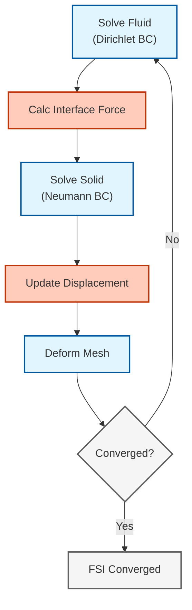

# ปฏิสัมพันธ์ระหว่างของไหลและโครงสร้าง (Fluid-Structure Interaction - FSI) ใน OpenFOAM

## 1. จุดเริ่มต้น: เมื่อของไหลทำให้ของแข็งโค้งงอ (When Fluids Bend Solids)

ลองพิจารณา **ใบพัดกังหันลม** ที่โค้งงอเมื่อมีลมกระโชกแรง **หลอดเลือด** ที่เต้นตามจังหวะการเต้นของหัวใจ หรือ **กล้องตาเรือ (periscope) ของเรือดำน้ำ** ที่สั่นสะเทือนเนื่องจากการหลุดล่อนของน้ำวน (vortex shedding) ปรากฏการณ์เหล่านี้คือปัญหา **ปฏิสัมพันธ์ระหว่างของไหลและโครงสร้าง (Fluid-Structure Interaction - FSI)** ซึ่งแรงจากของไหลทำให้โครงสร้างเสียรูป และการเคลื่อนที่ของโครงสร้างก็ส่งผลกลับไปเปลี่ยนแปลงการไหลของของไหลด้วย—เกิดเป็นระบบ **คัปปลิงแบบสองทาง (two-way coupled)** ที่มีความไม่เชิงเส้นสูง

> [!INFO] การประยุกต์ใช้งานในโลกแห่งความเป็นจริง
> - **การบินและอวกาศ**: การกระพือของปีก (Wing flutter), พลวัตของโรเตอร์เฮลิคอปเตอร์
> - **ชีวการแพทย์**: การไหลของเลือดในหลอดเลือดแดง, กลศาสตร์ของลิ้นหัวใจ
> - **วิศวกรรมโยธา**: อากาศพลศาสตร์ของสะพาน, แรงลมที่กระทำต่ออาคาร
> - **วิศวกรรมทางเรือ**: ปฏิสัมพันธ์ระหว่างใบพัดและตัวเรือ, พลวัตของยานพาหนะใต้น้ำ

![[flexible_plate_fsi.png]]

> [!TIP] **มุมมองเปรียบเทียบ: คู่เต้นรำลีลาศ (The Ballroom Dancers Analogy)**
> 
> FSI ก็เหมือนคู่เต้นลีลาศที่ต้องขยับตัวไปพร้อมกัน:
> *   **Kinematic Continuity (ความต่อเนื่องทางจลนศาสตร์):** ทั้งคู่ต้องก้าวเท้าไปพร้อมกัน ความเร็วต้องเท่ากัน ห้ามเหยียบเท้า (Interface Velocity Match)
> *   **Dynamic Continuity (สมดุลทางพลศาสตร์):** มือที่จับกันต้องออกแรงต้านเท่ากัน ถ้าฝ่ายชายดึง ฝ่ายหญิงต้องตามด้วยแรงเท่ากัน (Interface Force Balance)
> *   **Weak Coupling:** เหมือนเพิ่งหัดเต้น ฝ่ายชายขยับก่อน แล้วรอฝ่ายหญิงขยับตาม (One-Way / Explicit)
> *   **Strong Coupling:** เหมือนนักเต้นมืออาชีพ ขยับและถ่ายเทแรงแทบจะเป็นเนื้อเดียวกัน ตอบสนองทันที (Two-Way / Implicit)
> *   **Added Mass:** เหมือนเต้นกับคู่ที่ตัวหนักมาก (น้ำ) การจะดึงหรือผลักให้ขยับต้องใช้แรงมหาศาลและควบคุมยากกว่าเต้นกับคนตัวเบา (อากาศ)

### ความท้าทาย (The Challenge)

ในปัญหา FSI การคัปปลิงสร้างความท้าทายที่เหนือกว่า CFD มาตรฐาน:

*   **ผลกระทบของมวลที่เพิ่มเข้ามา (Added Mass Effect)**: ความเฉื่อยของของไหลต้านทานการเร่งความเร็วของโครงสร้าง นำไปสู่ความไม่เสถียรเชิงตัวเลข
*   **การเสียรูปของเมช (Mesh Deformation)**: เมชของของไหลต้องเคลื่อนที่และเสียรูปเพื่อรองรับการเคลื่อนที่ของของแข็ง จำเป็นต้องมีการจัดการเมชแบบพลวัต (dynamic mesh handling)
*   **ความแตกต่างของมาตราส่วนเวลา (Time Scale Disparity)**: รูปแบบการสั่นสะเทือนของโครงสร้างอาจเร็วกว่ามาตราส่วนเวลาของการไหลของของไหลมาก

> [!WARNING] วิกฤตด้านเสถียรภาพ
> ==ผลกระทบของมวลที่เพิ่มเข้ามา== เป็นที่มาหลักของความไม่เสถียรเชิงตัวเลขในการจำลอง FSI เมื่อความหนาแน่นของของไหลเข้าใกล้ความหนาแน่นของของแข็ง ($
ho_f \approx \rho_s$) รูปแบบการคัปปลิงแบบ explicit จะไม่เสถียร เว้นแต่จะใช้เทคนิคพิเศษเข้ามาช่วย

---

## 2. พิมพ์เขียว: ระบบนิเวศ FSI ใน OpenFOAM (OpenFOAM FSI Ecosystem)

OpenFOAM มีวิธีหลัก 3 วิธีในการจัดการกับ FSI:

### ก. `solids4foam` (ชุดเครื่องมือเฉพาะทาง)

*   **ประเภท:** แบบรวมศูนย์ (Monolithic) / แบบแบ่งส่วนที่เข้มข้น (Strong Partitioned)
*   **เหมาะสำหรับ:** การเสียรูปขนาดใหญ่, วัสดุไม่เชิงเส้น, FSI ที่ซับซ้อน
*   **กลไก:** แก้สมการของไหลและของแข็งในวงรอบที่คัปปลิงกันอย่างแน่นหนา (หรือใช้เมทริกซ์แบบรวมศูนย์)
*   **ข้อดี:** แข็งแกร่งที่สุดสำหรับการคัปปลิงที่รุนแรง (เช่น การไหลของเลือด)

### ข. `preCICE` (การคัปปลิงภายนอก)

*   **ประเภท:** แบบแบ่งส่วน (Black-box)
*   **เหมาะสำหรับ:** การเชื่อมต่อ OpenFOAM กับตัวแก้ปัญหาโครงสร้าง (FEA) ภายนอก (เช่น CalculiX, ANSYS, Abaqus)
*   **กลไก:** ใช้ไลบรารี `preCICE` ในการแลกเปลี่ยนข้อมูลขอบเขต
*   **ข้อดี:** ช่วยให้ใช้ตัวแก้ปัญหาโครงสร้างที่ดีที่สุดในอุตสาหกรรมได้

### ค. การคัปปลิงแบบ `mapped` ดั้งเดิม (น้ำหนักเบา)

*   **ประเภท:** แบบแบ่งส่วน (Explicit Partitioned)
*   **เหมาะสำหรับ:** การเสียรูปขนาดเล็ก, การคัปปลิงทางเดียว, การวิเคราะห์การกระพือ (flutter)
*   **กลไก:** ใช้ `dynamicMotionSolverFvMesh` และเงื่อนไขขอบเขตแบบ `mapped`
*   **ข้อดี:** เป็นฟีเจอร์พื้นฐาน (native), ไม่ต้องใช้ไลบรารีภายนอก

> [!TIP] คู่มือการเลือก
> | การประยุกต์ใช้งาน | เครื่องมือที่แนะนำ |
> |-------------|------------------|
> | การเสียรูปขนาดใหญ่, วัสดุไฮเปอร์อิลาสติก | **solids4foam** |
> | การเชื่อมต่อกับโปรแกรม FEA ทางการค้า | **preCICE** |
> | การเสียรูปขนาดเล็ก, การสร้างต้นแบบ | **Native mapped** |

---

## 3. กลไกภายใน: คณิตศาสตร์ของ FSI (FSI Mathematics)

### โดเมนของไหล (รูปแบบ ALE)

สมการ Navier-Stokes บนเมชที่เคลื่อนที่ (Arbitrary Lagrangian-Eulerian):

$$\rho_f \frac{\partial \mathbf{u}_f}{\partial t} + \rho_f (\mathbf{u}_f - \mathbf{u}_g) \cdot \nabla \mathbf{u}_f = -\nabla p + \mu_f \nabla^2 \mathbf{u}_f$$

$$\nabla \cdot \mathbf{u}_f = 0$$

**ตัวแปร:**
- $\rho_f$: ความหนาแน่นของไหล
- $\mathbf{u}_f$: ความเร็วของไหล
- $\mathbf{u}_g$: ความเร็วของกริต/เมช
- $p$: ความดัน
- $\mu_f$: ความหนืดของของไหล

### โดเมนของแข็ง (Solid Domain)

สมการพลศาสตร์ความยืดหยุ่น (Elastodynamics):

$$\rho_s \frac{\partial^2 \mathbf{d}}{\partial t^2} = \nabla \cdot \boldsymbol{\sigma}_s + \mathbf{f}_s$$

**ตัวแปร:**
- $\rho_s$: ความหนาแน่นของแข็ง
- $\mathbf{d}$: การกระจัด (Displacement)
- $\boldsymbol{\sigma}_s$: เทนเซอร์ความเค้นของ Cauchy
- $\mathbf{f}_s$: แรงภายนอก

### เงื่อนไขที่ส่วนต่อประสาน (Interface Conditions)

ที่ส่วนต่อประสานระหว่างของไหลและของแข็ง $\Gamma_{FSI}$:

1.  **ความต่อเนื่องทางจลนศาสตร์ (ความเร็ว):**
    $$\mathbf{u}_f = \frac{\partial \mathbf{d}}{\partial t} \quad \text{บน} \quad \Gamma_{FSI}$$

2.  **สมดุลทางพลศาสตร์ (แรงฉุด):**
    $$\boldsymbol{\sigma}_f \cdot \mathbf{n}_f + \boldsymbol{\sigma}_s \cdot \mathbf{n}_s = \mathbf{0} \quad \text{บน} \quad \Gamma_{FSI}$$

**ตัวแปร:**
- $\mathbf{n}_f, \mathbf{n}_s$: เวกเตอร์แนวตั้งฉากหน่วยด้านนอกสำหรับโดเมนของไหลและของแข็ง

---

## 4. กลไก: อัลกอริทึมการคัปปลิง (Coupling Algorithms)

### วิธีแบบแบ่งส่วน (Dirichlet-Neumann)

อัลกอริทึม FSI ที่พบบ่อยที่สุดคือ **วิธีแบบสลับลำดับ (staggered approach)**:


> **รูปที่ 1:** แผนผังลำดับขั้นตอนการคำนวณแบบแบ่งส่วน (Partitioned Approach) สำหรับการจำลอง FSI โดยใช้การวนซ้ำระหว่างตัวแก้สมการของไหลและโครงสร้างเพื่อรักษาความต่อเนื่องของความเร็วและแรงที่บริเวณส่วนต่อประสาน

**ขั้นตอนของอัลกอริทึม:**

1.  **ขั้นตอนของไหล (Dirichlet):** แก้ปัญหาของไหลโดยใช้ความเร็วของโครงสร้างเป็นเงื่อนไขขอบเขต (BC)
    $$\mathbf{u}_f|_{\Gamma} = \mathbf{v}_s$$

2.  **การถ่ายโอนแรง (Force Transfer):** คำนวณความเค้นของไหล
    $$\mathbf{F}_{fs} = \oint_{\Gamma} \boldsymbol{\sigma}_f \cdot \mathbf{n} \, \mathrm{d}S$$

3.  **ขั้นตอนของแข็ง (Neumann):** แก้ปัญหาโครงสร้างโดยใช้แรงจากของไหลเป็นภาระ (load)
    $$\boldsymbol{\sigma}_s \cdot \mathbf{n}_s = -\mathbf{t}_f$$

4.  **การอัปเดตเมช (Mesh Update):** เคลื่อนย้ายเมชของไหลตามการกระจัดของของแข็ง

### การคัปปลิงแบบเข้มข้น vs แบบอ่อน (Strong vs. Weak Coupling)

| **ประเด็น** | **แบบอ่อน (Explicit)** | **แบบเข้มข้น (Implicit)** |
|------------|---------------------|----------------------|
| **อัลกอริทึม** | เรียงลำดับต่อช่วงเวลา | วนซ้ำภายในช่วงเวลา |
| **เสถียรภาพ** | ไม่เสถียรสำหรับ $\rho_f \approx \rho_s$ | เสถียรสำหรับทุกอัตราส่วนความหนาแน่น |
| **ต้นทุน** | ต่ำกว่า (แก้ปัญหาโดเมนละครั้ง) | สูงกว่า (วนซ้ำหลายรอบ) |
| **กรณีใช้งาน** | $\rho_f \ll \rho_s$ (อากาศ/เหล็ก) | $\rho_f \approx \rho_s$ (น้ำ/ยาง) |

### การทำให้เสถียร: การผ่อนคลายแบบ Aitken (Aitken Relaxation)

เพื่อป้องกันการลู่ออกในการคัปปลิงแบบเข้มข้น การกระจัดจะถูกผ่อนคลาย (under-relaxed) แบบไดนามิก:

$$\mathbf{d}^{k+1} = \mathbf{d}^k + \omega_k (\tilde{\mathbf{d}} - \mathbf{d}^k)$$

$$\omega^{n+1} = \omega^n \frac{(\mathbf{r}^{n-1})^T(\mathbf{r}^{n-1} - \mathbf{r}^n)}{(\mathbf{r}^{n-1} - \mathbf{r}^n)^T(\mathbf{r}^{n-1} - \mathbf{r}^n)}$$

โดยที่:
- $\omega_k$: ปัจจัยการผ่อนคลายแบบไดนามิก
- $\mathbf{r}^n = \mathbf{d}^n - \mathbf{d}^{n-1}$: ค่าตกค้างจากการวนซ้ำ (Iteration residual)

> [!INFO] การใช้งาน
> การเร่งความเร็วแบบ Aitken มีประสิทธิภาพอย่างยิ่งสำหรับปัญหา FSI ที่มีอัตราส่วนความหนาแน่นปานกลาง ($0.1 < \rho_f/\rho_s < 1.0$)

---

## 5. การใช้งาน: เริ่มต้นกับ FSI (แบบ Native)

สำหรับกรณี "ธงพริ้ว (Flag Flutter)" อย่างง่ายโดยใช้เครื่องมือพื้นฐานของ OpenFOAM:

### 1. การตั้งค่าการเคลื่อนที่ของเมช (Mesh Motion Setup)

ในไฟล์ `constant/dynamicMeshDict`:

```cpp
dynamicFvMesh   dynamicMotionSolverFvMesh; // ตั้งค่าชนิดของเมชพลวัต
motionSolverLibs (fvMotionSolvers);        // โหลดไลบรารีตัวแก้การเคลื่อนที่
solver          displacementLaplacian;     // ใช้ตัวแก้การกระจัดแบบ Laplacian
diffusivity     quadratic inverseDistance (flag_wall); // ความแพร่แบบควอดราติกตามระยะทางจาก flag_wall
```

> **📚 คำอธิบาย (Thai Explanation):**
> 
> **แหล่งที่มา (Source):** `.applications/solvers/combustion/XiFoam/ignition/Make/options`
> 
> **การตั้งค่าการเคลื่อนที่ของเมช:**
> - **dynamicFvMesh**: ระบุชนิดของเมชพลวัตที่ใช้สำหรับจัดการการเคลื่อนที่ของเมช
> - **motionSolverLibs**: ไลบรารีที่จำเป็นสำหรับการแก้สมการการเคลื่อนที่
> - **solver**: ใช้ตัวแก้สมการ Laplacian สำหรับการกระจายการกระจัด (displacement) ผ่านโดเมนของไหล
> - **diffusivity**: ค่าสัมประสิทธิ์การแพร่ (diffusivity) แบบ quadratic inverse distance ใช้ควบคุมความเรียบของการเคลื่อนที่ของเมช โดยค่านี้จะลดลงเมื่อห่างจากผนัง flag_wall ช่วยรักษาคุณภาพเมชบริเวณชั้นขอบ (boundary layer)
> 
> **แนวคิดสำคัญ (Key Concepts):**
> - **Laplacian Smoothing**: กระจายการเคลื่อนที่จากผนังไปยังภายในโดเมนอย่างราบรื่น
> - **Inverse Distance**: ค่าน้ำหนักที่ลดลงตามระยะทาง ช่วยรักษาความละเอียดบริเวณใกล้ผนัง
> - **Quadratic Diffusivity**: ค่าสัมประสิทธิ์แพร่แบบกำลังสอง ให้การควบคุมที่ละเอียดกว่าแบบเชิงเส้น
> 
> **สมการ Laplacian Smoothing:**
> $$\\nabla \cdot (\gamma \nabla \mathbf{d}) = 0$$
> 
> โดยที่:
> - $\gamma$ คือ ฟิลด์ความแพร่ (diffusivity field) ที่มีค่าสูงบริเวณใกล้ผนังเพื่อรักษาความละเอียดของ boundary layer
> - $\mathbf{d}$ คือ เวกเตอร์การกระจัด (displacement vector)

ตัวแก้ปัญหา `displacementLaplacian` จะทำให้การเคลื่อนที่ของเมชราบเรียบตามสมการ:

$$\nabla \cdot (\gamma \nabla \mathbf{d}) = 0$$

โดยที่ $\gamma$ คือฟิลด์ความแพร่ (diffusivity field) (ซึ่งจะมีค่าสูงใกล้ผนังเพื่อรักษาความละเอียดของชั้นขอบ)

### 2. เงื่อนไขขอบเขต (Boundary Conditions)

**ฝั่งของไหล (`0/pointDisplacement`):**

```cpp
flag_wall
{
    type            fixedValue;  // ตั้งค่าประเภทเงื่อนไขขอบเขตแบบค่าคงที่
    value           uniform (0 0 0);  // การกระจัดเป็นศูนย์ (เงื่อนไขแบบยึดแน่น)
}
```

> **📚 คำอธิบาย (Thai Explanation):**
> 
> **แหล่งที่มา (Source):** การตั้งค่าเงื่อนไขขอบเขตสำหรับปัญหา FSI ใน OpenFOAM
> 
> **การตั้งค่าเงื่อนไขขอบเขต (Boundary Condition Setup):**
> - **type**: ชนิดของเงื่อนไขขอบเขตเป็นแบบ fixedValue ซึ่งกำหนดค่าคงที่ที่ผนัง
> - **value**: ค่าการกระจัดเป็นศูนย์ (0 0 0) แทนการยึดติด (clamped condition) ที่ฐานของธง
> 
> **แนวคิดสำคัญ (Key Concepts):**
> - **Clamped Boundary**: เงื่อนไขขอบเขตที่ยึดโครงสร้างไว้นิ่งไม่ให้เคลื่อนที่ ใช้สำหรับจุดยึดของโครงสร้าง
> - **pointDisplacement**: ฟิลด์ที่เก็บการกระจัดของจุดยอดเมช (mesh vertex displacement)
> - **Zero Displacement**: การกระจัดเป็นศูนย์หมายถึงจุดที่ไม่มีการเคลื่อนที่ (fixed point)

### 3. การตั้งค่าเสถียรภาพ (Stability Settings)

ในไฟล์ `system/fvSolution`:

```cpp
relaxationFactors
{
    fields
    {
        p               0.3;  // ปัจจัยการผ่อนคลายความดัน
        U               0.5;  // ปัจจัยการผ่อนคลายความเร็ว
    }
}
```

> **📚 คำอธิบาย (Thai Explanation):**
> 
> **แหล่งที่มา (Source):** การตั้งค่าตัวแก้สมการใน OpenFOAM (system/fvSolution)
> 
> **การตั้งค่าปัจจัยผ่อนคลาย (Relaxation Factors Setup):**
> - **p**: ปัจจัยผ่อนคลายสำหรับความดัน (pressure) ค่า 0.3 ช่วยป้องกันการแกว่งของความดันในแต่ละขั้นตอนการวนซ้ำ
> - **U**: ปัจจัยผ่อนคลายสำหรับความเร็ว (velocity) ค่า 0.5 ควบคุมการอัปเดตความเร็วระหว่างการวนซ้ำ
> 
> **แนวคิดสำคัญ (Key Concepts):**
> - **Under-Relaxation**: เทคนิคการลดความรุนแรงของการอัปเดตค่าตัวแปร ช่วยเพิ่มเสถียรภาพของการคำนวณ
> - **Pressure-Velocity Coupling**: ความสัมพันธ์ระหว่างความดันและความเร็วในสมการ Navier-Stokes ต้องใช้การผ่อนคลายเพื่อความเสถียร
> - **Convergence Acceleration**: การใช้ปัจจัยผ่อนคลายที่เหมาะสมช่วยให้การคำนวณลู่เข้าสู่คำตอบได้เร็วขึ้น
> 
> **สมการ Under-Relaxation:**
> $$\\phi^{n+1} = \phi^n + \omega (\phi^* - \phi^n)$$
> 
> โดยที่:
> - $\phi$ คือ ตัวแปร (ความดันหรือความเร็ว)
> - $\omega$ คือ ปัจจัยผ่อนคลาย (0 < ω ≤ 1)
> - $\phi^*$ คือ ค่าใหม่ที่คำนวณได้

### 4. การรัน (Running)

สำหรับปัญหา FSI ที่แท้จริง แนะนำให้ใช้ `solids4foam`:

```bash
# ตัวอย่างการรัน solids4foam
solids4Foam
```

สำหรับปัญหาเบาๆ ที่มีการเสียรูปขนาดเล็ก:

```bash
# ตัวแก้ปัญหาเมชเคลื่อนที่ (ของไหลอย่างเดียวพร้อมขอบเขตเคลื่อนที่)
pimpleDyMFoam
```

---

## 6. ทำไม FSI ถึงท้าทาย: ความเสถียรเชิงตัวเลข (Numerical Stability)

### ความไม่เสถียรจากมวลที่เพิ่มเข้ามา (The Added Mass Instability)

**ผลกระทบของมวลที่เพิ่มเข้ามา** เกิดขึ้นเมื่อโครงสร้างเร่งความเร็วผ่านของไหลที่มีความหนาแน่นสูง:

$$\mathbf{F}_{\text{added}} = -M_a \frac{\mathrm{d}^2 \mathbf{d}}{\mathrm{d}t^2}$$

$$M_a = \rho_f \int_{\Gamma} \mathbf{N}^T \mathbf{N} \, \mathrm{d}\Gamma$$

**เกณฑ์เสถียรภาพ:**

การคัปปลิงแบบ Explicit จะไม่เสถียรเมื่อ:

$$\frac{\rho_f}{\rho_s} > C_{\text{crit}}$$

โดยที่ $C_{\text{crit}} \approx 0.1-1.0$ ขึ้นอยู่กับเรขาคณิตและการแยกส่วน (discretization)

| **อัตราส่วนความหนาแน่น** | **ความเสถียร** | **กลยุทธ์ที่แนะนำ** |
|-------------------|---------------|---------------------------|
| < 0.01 | สูงมาก | การคัปปลิงแบบ Explicit |
| 0.01 - 0.1 | ปานกลาง | การผ่อนคลายแบบ Aitken |
| > 0.1 | ต่ำมาก | การคัปปลิงแบบ Implicit |

> [!WARNING] ระบบน้ำ-ยาง
> สำหรับระบบน้ำ-ยางที่ $\rho_f/\rho_s \approx 1$ การคัปปลิงแบบ implicit ที่เข้มข้นเป็นเรื่อง ==จำเป็นอย่างยิ่ง== เพื่อความเสถียร

### เทคนิคการทำให้เสถียร (Stabilization Techniques)

#### 1. การผ่อนคลาย (Under-Relaxation)

$$\mathbf{d}^{n+1} = \mathbf{d}^n + \omega(\mathbf{d}^* - \mathbf{d}^n)$$

โดยที่ $\omega \in [0.1, 0.5]$ เพื่อความเสถียร

#### 2. Interface Quasi-Newton (IQN)

ประมาณค่า Jacobian ผกผันของการแม็พที่ส่วนต่อประสาน:

$$\mathbf{W}^{n+1} = \mathbf{W}^n + \frac{(\Delta\mathbf{R}^n - \mathbf{W}^n\Delta\mathbf{d}^n)\Delta\mathbf{d}^{nT}}{\Delta\mathbf{d}^{nT}\Delta\mathbf{d}^n}$$

#### 3. ความสามารถในการอัดเทียม (Artificial Compressibility)

เพิ่มการสลายตัวเชิงตัวเลขเพื่อให้การคัปปลิงระหว่างความดันและความเร็วเสถียร:

$$\mu_{\text{art}} = C_{\text{art}} \rho_f h |\mathbf{v}_f - \mathbf{v}_m|$$

---

## 7. สรุป: ข้อมูลเชิงลึกที่สำคัญ (Summary)

### การเลือกกลยุทธ์การคัปปลิง

**พารามิเตอร์วิกฤต:** อัตราส่วนความหนาแน่น $\rho_f/\rho_s$

| **สถานการณ์** | **เงื่อนไข** | **กลยุทธ์** | **เหตุผล** |
|--------------|---------------|--------------|------------|
| โครงสร้างน้ำหนักเบาในอากาศ | $\rho_f \ll \rho_s$ | **คัปปลิงแบบอ่อน** | ความแม่นยำเพียงพอ, ต้นทุนต่ำ |
| อัตราส่วนความหนาแน่นปานกลาง | $0.1 < \rho_f/\rho_s < 1$ | **คัปปลิงแบบเข้มข้น** | จำเป็นเพื่อความเสถียร |
| โครงสร้างหนักในน้ำ | $\rho_f \approx \rho_s$ | **คัปปลิงแบบเข้มข้น** | รักษาความแม่นยำทางกายภาพ |

### ประเด็นสำคัญ (Key Takeaways)

*   **ความไม่เสถียรจากมวลที่เพิ่มเข้ามา:** ตัวทำลายรูปแบบ FSI แบบ explicit ควรใช้การคัปปลิงแบบ implicit หรือการผ่อนคลายที่รุนแรงเมื่อความหนาแน่นของของไหลสูง (เช่น น้ำ)
*   **คุณภาพเมช:** ปัจจัยจำกัด การเสียรูปขนาดใหญ่ทำลายเมชของไหล ควรใช้การทำให้เรียบแบบอาศัยการแพร่ (diffusion-based smoothing) หรือการสร้างเมชใหม่โดยอัตโนมัติ
*   **ช่วงเวลา (Time Step):** ต้องเป็นไปตามเกณฑ์ CFL ของไหลและเสถียรภาพของโครงสร้าง:

    $$\\Delta t < \min\left( \text{CFL} \cdot \frac{\Delta x}{|\mathbf{U}_f|}, \sqrt{\frac{m_s}{k_{structure}}} \right)$$

*   **การตรวจสอบการลู่เข้า:** ติดตามทั้งค่าตกค้างที่ส่วนต่อประสานและสมดุลพลังงาน:

    ```cpp
    // คำนวณแรงตกค้างระหว่างโดเมนของไหลและของแข็ง
    scalar residualForce = mag(fluidForce - solidForce);
    // คำนวณข้อผิดพลาดการเปลี่ยนแปลงพลังงานเพื่อการตรวจสอบ
    scalar energyError = mag(totalEnergyChange - expectedEnergyChange);
    ```

---

## 8. การตรวจสอบการอนุรักษ์ (Conservation Checks)

### สมดุลแรงที่ส่วนต่อประสาน

$$\boldsymbol{\sigma}_f \cdot \mathbf{n}_f + \boldsymbol{\sigma}_s \cdot \mathbf{n}_s = \mathbf{0}$$

### การอนุรักษ์พลังงาน

$$\frac{\mathrm{d}}{\mathrm{d}t} (E_f + E_s) = P_f - D_s + Q_{\text{boundary}}$$

โดยที่:
- $E_f, E_s$: พลังงานของของไหลและของแข็ง
- $P_f$: กำลังงานจากของไหล
- $D_s$: การสลายตัวจากการหน่วงโครงสร้าง
- $Q_{\text{boundary}}$: ฟลักซ์ความร้อน/พลังงานผ่านขอบเขต

### การใช้งานใน OpenFOAM

```cpp
// คำนวณฟลักซ์ความร้อนที่ฝั่งของไหลของส่วนต่อประสาน
scalarField qFluid = -kFluid.boundaryField()[fluidPatchID] *
                     gradTFluid.boundaryField()[fluidPatchID];

// คำนวณฟลักซ์ความร้อนที่ฝั่งของแข็งของส่วนต่อประสาน
scalarField qSolid = -kSolid.boundaryField()[solidPatchID] *
                     gradTSolid.boundaryField()[solidPatchID];

// คำนวณค่าความคลาดเคลื่อนสัมพัทธ์สูงสุดระหว่างฟลักซ์ของไหลและของแข็ง
scalar maxRelError = max(mag(qFluid + qSolid)/mag(qFluid));

// ตรวจสอบสมดุลแรงที่ส่วนต่อประสาน
if (maxRelError < 1e-6)
{
    Info << "ผ่านการตรวจสอบสมดุลแรงที่ส่วนต่อประสาน: " << maxRelError << endl;
}
```

> **📚 คำอธิบาย (Thai Explanation):**
> 
> **แหล่งที่มา (Source):** การตรวจสอบความสมดุลของแรงและการอนุรักษ์พลังงานในการจำลอง FSI ด้วย OpenFOAM
> 
> **การตรวจสอบความสมดุล (Balance Verification):**
> - **Heat Flux Calculation**: คำนวณอัตราการไหลของความร้อน (heat flux) ที่ส่วนต่อประสานระหว่างของไหลและของแข็ง
> - **kFluid, kSolid**: สัมประสิทธิ์ความนำความร้อนของของไหลและของแข็ง
> - **gradTFluid, gradTSolid**: ไล่ระดับอุณหภูมิของของไหลและของแข็งที่ผินสัมผัส
> - **fluidPatchID, solidPatchID**: ระบุตัวระบุของพื้นที่ผิวสัมผัสของของไหลและของแข็ง
> 
> **แนวคิดสำคัญ (Key Concepts):**
> - **Force Balance**: หลักการอนุรักษ์โมเมนตัมที่ส่วนต่อประสาน แรงจากของไหลต้องสมดุลกับแรงที่กระทำต่อโครงสร้าง
> - **Energy Conservation**: หลักการอนุรักษ์พลังงานในระบบ FSI พลังงานรวมของระบบต้องคงที่
> - **Interface Continuity**: ความต่อเนื่องของการถ่ายเทแรงและพลังงานที่ส่วนต่อประสาน
> 
> **สมการความสมดุลแรง:**
> $$\\boldsymbol{\sigma}_f \cdot \mathbf{n}_f + \boldsymbol{\sigma}_s \cdot \mathbf{n}_s = \mathbf{0}$$
> 
> **สมการการอนุรักษ์พลังงาน:**
> $$\\frac{\mathrm{d}}{\mathrm{d}t} (E_f + E_s) = P_f - D_s + Q_{\text{boundary}}$$
> 
> โดยที่:
> - $E_f, E_s$: พลังงานของของไหลและของแข็ง
> - $P_f$: กำลังงานที่ได้รับจากของไหล
> - $D_s$: การสูญเสียพลังงานจากการระบายความรุนแรง (structural damping)
> - $Q_{\text{boundary}}$: การไหลของพลังงานผ่านขอบเขต

---

## 9. เส้นทางการเรียนรู้ขั้นสูง (Advanced Learning Path)

1. **เริ่มจากง่าย:** เริ่มด้วย FSI สภาวะคงตัว (การคัปปลิงทางเดียว) เพื่อทำความเข้าใจกรอบงาน
2. **ก้าวสู่พลวัต:** เปลี่ยนไปใช้การคัปปลิงแบบอ่อนที่มีการเสียรูปขนาดเล็ก
3. **เชี่ยวชาญการคัปปลิงแบบเข้มข้น:** ใช้งานการผ่อนคลายแบบ Aitken และวิธี IQN
4. **สำรวจหัวข้อขั้นสูง:**
   - ไฟไนต์เอลิเมนต์สำหรับการเสียรูปขนาดใหญ่
   - แบบจำลองวัสดุไฮเปอร์อิลาสติก
   - กลศาสตร์การสัมผัส (Contact mechanics) ใน FSI
   - อัลกอริทึม FSI แบบขนาน

> [!TIP] แหล่งข้อมูล
> - **solids4foam**: [https://github.com/OpenFOAM/OpenFOAM-dev](https://github.com/OpenFOAM/OpenFOAM-dev)
> - **preCICE**: [https://precice.org/](https://precice.org/)
> - **ตำราเรียน**: "Computational Fluid-Structure Interaction" โดย Bungartz และ Schäfer

---


กรอบงาน FSI ใน OpenFOAM เป็นรากฐานที่ทรงพลังสำหรับการจำลองปัญหาการคัปปลิงระหว่างของไหลและโครงสร้าง ตั้งแต่การพริ้วไหวของธงไปจนถึงการประยุกต์ใช้งานทางชีวการแพทย์ที่ซับซ้อน ความสำเร็จต้องการการใส่ใจอย่างมากในเรื่องเสถียรภาพ คุณภาพเมช และการเลือกกลยุทธ์การคัปปลิงที่เหมาะสม

---

## 🧠 Concept Check: ทดสอบความเข้าใจ

<details>
<summary><b>1. เมื่อไหร่ที่ FSI แบบ "One-Way Coupling" เพียงพอ?</b></summary>

**คำตอบ:** เมื่อ **การเสียรูปของโครงสร้างมีขนาดเล็ก** และ **ไม่ส่งผลกลับไปเปลี่ยนทิศทางลม/น้ำ อย่างมีนัยสำคัญ**
*   เช่น ป้ายจราจรที่สั่นเล็กน้อยเมื่อลมพัด หรือท่อระบายความร้อนที่ขยายตัวจากความร้อนนิดหน่อย
*   ถ้าปีกเครื่องบินบิดจนแรงยกเปลี่ยน หรือธงพริ้วสะบัด ต้องใช้ **Two-Way Coupling**
</details>

<details>
<summary><b>2. "Added Mass Effect" คืออะไร และทำไมมันถึงน่ากลัวใน FSI?</b></summary>

**คำตอบ:** คือปรากฏการณ์ที่โครงสร้างต้อง "แบก" มวลของของเหลวที่อยู่รอบๆ ไปด้วยขณะเคลื่อนที่
*   ใน **อากาศ** (เบา) ผลนี้น้อยมาก
*   ใน **น้ำ** (หนัก) ผลนี้มหาศาล น้ำมีความหนาแน่นใกล้เคียงของแข็ง
*   มันทำให้ Solver แบบ Explicit ทั่วไป **Diverge ทันที** เพราะแรงเฉื่อยของน้ำมากเกินกว่าที่โครงสร้างจะตอบสนองได้ทันใน Time step เดียว (ต้องใช้ Implicit/Iterative Coupling)
</details>

<details>
<summary><b>3. Aitken Relaxation ทำหน้าที่อะไรใน FSI loop?</b></summary>

**คำตอบ:** ทำหน้าที่ **"หาค่ากลาง" (Optimal Damping)** ในการอัปเดตตำแหน่งอย่างชาญฉลาด
*   แทนที่จะขยับตามแรงที่คำนวณได้ 100% (ซึ่งอาจจะเลยเถิด/Overshoot)
*   Aitken จะดูประวัติการขยับครั้งก่อนๆ แล้วคำนวณ $\omega$ (Relaxation Factor) ที่ดีที่สุดในรอบนั้นๆ เพื่อให้ลู่เข้าสู่สมดุลเร็วที่สุดและไม่ระเบิด
</details>

---

## 📖 เอกสารที่เกี่ยวข้อง

- **ภาพรวม:** [00_Overview.md](00_Overview.md) — ภาพรวม Coupled Physics
- **บทก่อนหน้า:** [02_Conjugate_Heat_Transfer.md](02_Conjugate_Heat_Transfer.md) — Conjugate Heat Transfer
- **บทถัดไป:** [04_Advanced_Coupling.md](04_Advanced_Coupling.md) — Advanced Coupling
- **Complex Multiphase:** [../01_COMPLEX_MULTIPHASE_PHENOMENA/00_Overview.md](../01_COMPLEX_MULTIPHASE_PHENOMENA/00_Overview.md) — ปรากฏการณ์หลายเฟส
