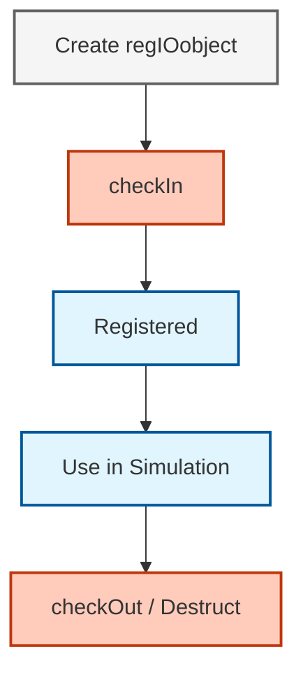
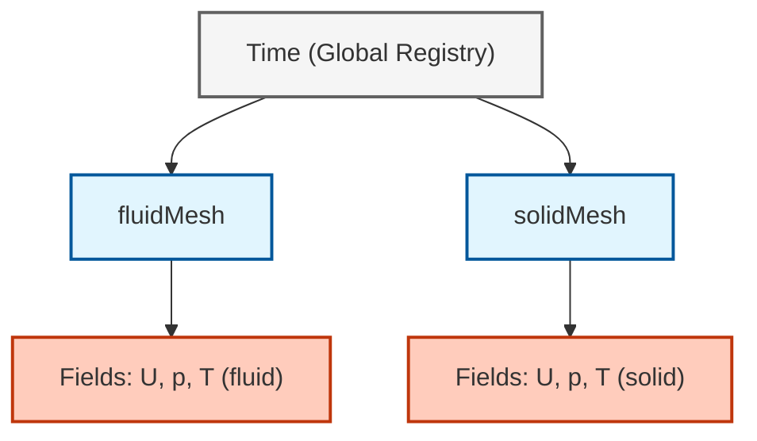
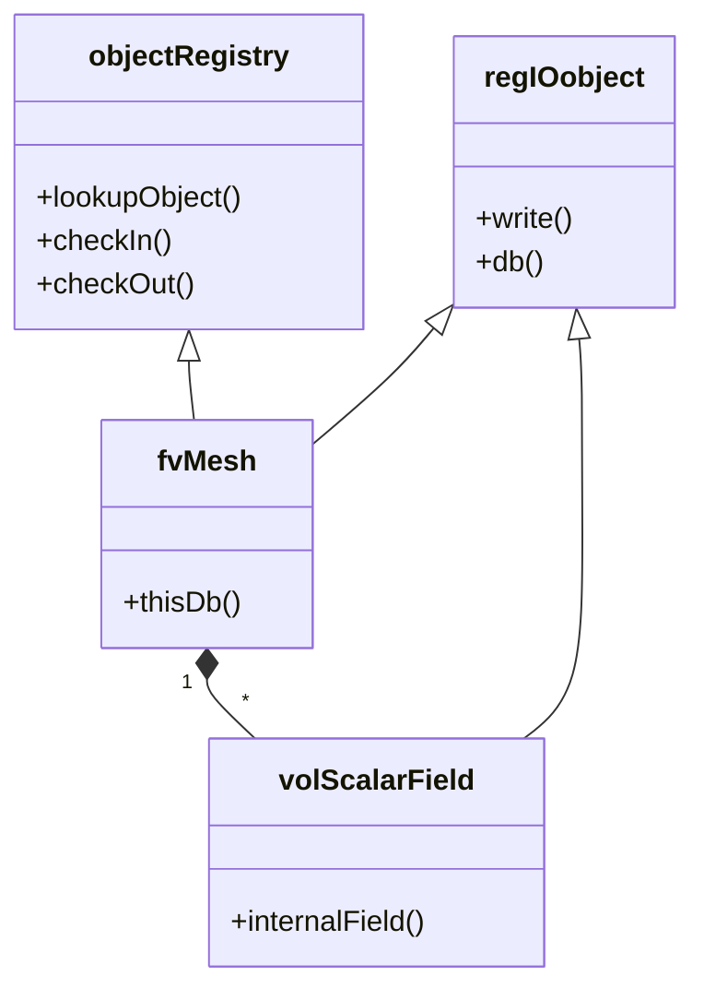

# Object Registry Architecture in Multi-Region Simulations

## Overview

The **object registry** is OpenFOAM's fundamental infrastructure for managing data separation and hierarchical organization in multi-region simulations (CHT, FSI, multiphase). This architecture enables multiple computational regions to coexist in a single simulation while maintaining strict data isolation and enabling efficient cross-region communication.

> [!INFO] Key Insight
> The object registry solves the **namespace problem**—how to distinguish between `fluid::T` and `solid::T`—through a hierarchical database structure combined with scoped naming conventions.

---

## 1. The Namespace Problem in Multi-Region Simulations

### 1.1 The Challenge

In multi-region simulations, each computational domain maintains its own set of physics fields. For conjugate heat transfer (CHT):

| **Fluid Region** | **Solid Region** |
|------------------|------------------|
| Temperature: $T_{\text{fluid}}$ | Temperature: $T_{\text{solid}}$ |
| Velocity: $\mathbf{U}_{\text{fluid}}$ | Velocity: $\mathbf{U}_{\text{solid}} \approx \mathbf{0}$ |
| Pressure: $p_{\text{fluid}}$ | Pressure: $p_{\text{solid}}$ (typically unused) |
| Density: $\rho_{\text{fluid}}$ | Density: $\rho_{\text{solid}}$ |

**Core Challenge:** How does OpenFOAM distinguish between identically named fields (`T`, `U`, `p`) across different regions without creating variable name chaos or memory inefficiency?

### 1.2 Solution: Region-Specific Field Aliasing

OpenFOAM addresses this through **preprocessor macros** that create region-specific aliases, allowing solver code to remain generic and reusable.

#### Fluid Field Macros
```cpp
// Define macro aliases for fluid region fields
// These macros allow generic solver code to work with region-specific fields
#define rhoFluid rho
#define TFluid T
#define UFluid U
#define pFluid p
#define phiFluid phi
#define KFluid K
```

<div style="background: linear-gradient(135deg, #e8f5e9 0%, #c8e6c9 100%); padding: 15px; border-radius: 8px; border-left: 4px solid #4caf50; margin: 15px 0;">

#### 📚 คำอธิบายภาษาไทย (Thai Explanation)

**แหล่งที่มา (Source):** 
📂 `.applications/solvers/heatTransfer/chtMultiRegionFoam/fluid/setRegionFluidFields.H`

**คำอธิบาย (Explanation):**
โค้ดนี้แสดง **เทคนิคการสร้างชื่อแทน (aliasing) ด้วย preprocessor macros** ซึ่งเป็นวิธีการแก้ปัญหา namespace ใน multi-region simulations:

1. **Macro Definition**: แต่ละ macro (เช่น `TFluid`) จะถูก map ไปยังชื่อ field จริง (`T`)
2. **Compile-time Substitution**: เมื่อ compiler พบ macro จะทำการแทนที่ด้วยชื่อ field จริงก่อน compile
3. **Code Reusability**: ทำให้ solver code สามารถเขียนแบบ generic และใช้ร่วมกับหลาย region ได้
4. **Region-specific Behavior**: แม้ชื่อ macro จะเหมือนกัน แต่จะอ้างถึง field ที่ต่างกันตาม region ที่ active อยู่

**แนวคิดสำคัญ (Key Concepts):**
- **Macro Expansion**: การขยาย macro เกิดขึ้นใน preprocessing phase ก่อน compilation
- **Symbolic Binding**: Macro ไม่ใช่ตัวแปร แต่เป็น symbolic substitution
- **Zero Runtime Overhead**: ไม่มี cost ที่ runtime เพราะถูกแทนที่หมดแล้วตั้งแต่ compile-time
- **Scoped Field Access**: ช่วยแยกแยะ field ที่มีชื่อเหมือนกันในคนละ region

</div>

#### Solid Field Macros
```cpp
// Define macro aliases for solid region fields
// Note: Solid regions typically have fewer fields (no velocity U or pressure p)
#define rhoSolid rho
#define TSolid T
#define KSolid K
```

<div style="background: linear-gradient(135deg, #fff3e0 0%, #ffe0b2 100%); padding: 15px; border-radius: 8px; border-left: 4px solid #ff9800; margin: 15px 0;">

#### 📚 คำอธิบายภาษาไทย (Thai Explanation)

**แหล่งที่มา (Source):** 
📂 `.applications/solvers/heatTransfer/chtMultiRegionFoam/solid/setRegionSolidFields.H`

**คำอธิบาย (Explanation):**
Solid region macros มีลักษณะเด่นดังนี้:

1. **Simpler Physics**: Solid region ไม่มี fluid flow จึงไม่มี fields เช่น `U` (velocity), `p` (pressure), `phi` (flux)
2. **Heat Transfer Focus**: เน้น fields ที่เกี่ยวข้องกับ heat conduction เช่น:
   - `T`: Temperature field
   - `K`: Thermal conductivity
   - `rho`: Density
3. **Region-specific Macro Set**: Fluid และ Solid ใช้ macro sets ที่แตกต่างกัน ทำให้ compiler สามารถแยกแยะได้

**แนวคิดสำคัญ (Key Concepts):**
- **Physics-based Field Selection**: แต่ละ region มี fields ที่เหมาะสมกับ physics ของตน
- **Conjugate Heat Transfer (CHT)**: Fluid region และ Solid region แชร์ข้อมูลที่ interface boundary
- **Thermal Coupling**: Heat flux ส่งผ่านระหว่าง regions ผ่าน boundary conditions

</div>

When the solver code references `T`, the macro expands it to the correct field for the current region being solved.

---

## 2. Object Registry Implementation

### 2.1 Core Architecture

The object registry is implemented as a **hash-based container** managing the lifecycle of registered objects:

```cpp
// Core objectRegistry class - manages object lifecycle in hierarchical structure
class objectRegistry
{
private:
    // Hash table for O(1) object lookup by unique name
    HashTable<regIOobject*> objects_;

    // Parent registry for hierarchical organization
    const objectRegistry& parent_;

    // Registry name (typically the region name)
    const word name_;

public:
    // Constructor with parent and name
    objectRegistry(const word& name, const objectRegistry& parent);

    // Register object with optional auto-registration
    bool checkIn(regIOobject& io, const bool autoRegister = true);

    // Lookup object by name with compile-time type checking
    template<class Type>
    const Type& lookupObject(const word& name) const;

    // Get all objects of specified type from registry
    template<class Type>
    HashTable<const Type*> lookupClass(const word& className) const;

    // Remove object from registry
    bool checkOut(regIOobject& io);

    // Iterator support for object traversal
    HashTable<regIOobject*>::iterator begin();
    HashTable<regIOobject*>::const_iterator begin() const;
};
```

<div style="background: linear-gradient(135deg, #e3f2fd 0%, #bbdefb 100%); padding: 15px; border-radius: 8px; border-left: 4px solid #2196f3; margin: 15px 0;">

#### 📚 คำอธิบายภาษาไทย (Thai Explanation)

**แหล่งที่มา (Source):** 
📂 `src/OpenFOAM/db/objectRegistry/objectRegistry.H`

**คำอธิบาย (Explanation):**
คลาส `objectRegistry` เป็นฐานข้อมูลแบบ hash-based ที่ทำหน้าที่จัดการวัตถุทุกชนิดใน OpenFOAM:

**หน้าที่หลัก (Main Responsibilities):**
1. **Hash Table Storage**: ใช้ `HashTable<regIOobject*>` เก็บ objects ด้วย unique name
   - O(1) lookup time
   - จัดการ collision อัตโนมัติ
2. **Hierarchical Structure**: แต่ละ registry มี parent reference สร้างโครงสร้างแบบ tree
   - Root: `Time` object
   - Branches: Region meshes (`fluidMesh`, `solidMesh`)
   - Leaves: Physics fields (`T`, `U`, `p`)
3. **Type-safe Lookup**: Template method `lookupObject<Type>()` ช่วย prevent type errors

**Methods สำคัญ:**
- `checkIn()`: ลงทะเบียน object เข้าสู่ระบบ
- `checkOut()`: ถอน object ออกจากระบบ
- `lookupObject<Type>()`: ค้นหา object ด้วยชื่อและ type
- `lookupClass<Type>()`: ค้นหาทุก objects ของ type หนึ่งๆ

**แนวคิดสำคัญ (Key Concepts):**
- **Registry Hierarchy**: โครงสร้างแบบ tree ที่ช่วยแยก objects ตาม region
- **Hash-based Storage**: การเก็บข้อมูลแบบ hash table เพื่อ performance
- **Template Metaprogramming**: ใช้ templates เพื่อ type safety ที่ compile-time
- **Automatic Lifecycle Management**: จัดการ memory ผ่าน reference counting

</div>

### 2.2 Key Components

| Component | Type | Purpose |
|-----------|------|---------|
| `objects_` | `HashTable<regIOobject*>` | Stores objects with unique names for O(1) lookup |
| `parent_` | `const objectRegistry&` | Reference to parent registry for hierarchy |
| `name_` | `const word` | Identifier for this registry (region name) |

### 2.3 Integration with regIOobject

Every object participating in the registry system inherits from `regIOobject`:

```cpp
// Base class for all registry-aware I/O objects
// Provides automatic registration and lifecycle management
class regIOobject : public IOobject
{
private:
    // Reference count for automatic memory management
    mutable int refCount_;

    // Pointer to registry storing this object
    mutable objectRegistry* dbPtr_;

    // Flag indicating whether object is currently registered
    mutable bool registered_;

public:
    // Register this object with specified registry
    virtual bool checkIn(const objectRegistry& registry);

    // Unregister from current registry
    virtual bool checkOut();

    // Get registry storing this object
    const objectRegistry& db() const;

    // Scoped naming (region::fieldName)
    word name() const;
    word globalName() const;

    // Automatic registration and cleanup in destructor
    virtual ~regIOobject();
};
```

<div style="background: linear-gradient(135deg, #f3e5f5 0%, #e1bee7 100%); padding: 15px; border-radius: 8px; border-left: 4px solid #9c27b0; margin: 15px 0;">

#### 📚 คำอธิบายภาษาไทย (Thai Explanation)

**แหล่งที่มา (Source):** 
📂 `src/OpenFOAM/db/regIOobject/regIOobject.H`

**คำอธิบาย (Explanation):**
คลาส `regIOobject` เป็น base class สำหรับทุก objects ที่ต้องการลงทะเบียนใน object registry:

**หน้าที่หลัก (Main Responsibilities):**
1. **Automatic Registration**: เมื่อสร้าง object ใหม่ จะถูก check-in เข้า registry อัตโนมัติ
2. **Reference Counting**: Track จำนวน references ที่ชี้ไปยัง object เพื่อ automatic cleanup
3. **Registry Awareness**: Object รู้ว่าตัวเองถูกเก็บใน registry ไหน (`dbPtr_`)
4. **Scoped Naming**: รองรับ naming convention แบบ `region::fieldName`

**Lifecycle Management:**
```cpp
// Constructor: refCount_ = 1, registered_ = false
regIOobject obj(name);

// checkIn: registered_ = true, dbPtr_ = &registry
obj.checkIn(registry);

// Use: refCount_ increases/decreases with references
const fieldType& field = registry.lookupObject<fieldType>(name);

// Destructor: Automatic checkOut if registered
// Memory freed when refCount_ reaches 0
```

**แนวคิดสำคัญ (Key Concepts):**
- **RAII (Resource Acquisition Is Initialization)**: การจัดการ resource ผ่าน object lifecycle
- **Reference Counting**: เทคนิค garbage collection แบบ simple
- **Automatic Cleanup**: ไม่ต้อง delete objects ด้วยตนเอง
- **Registry Pattern**: Design pattern สำหรับ centralized object management
- **Scoped Naming**: แยก objects ที่มีชื่อเหมือนกันด้วย region prefix

</div>

### 2.4 Object Lifecycle


> **Figure 1:** แผนภาพแสดงวงจรชีวิตของวัตถุ (Object Lifecycle) ภายในระบบการจดทะเบียนของ OpenFOAM ตั้งแต่การสร้างออบเจกต์ การลงทะเบียนเข้าสู่ระบบ (checkIn) ไปจนถึงการล้างข้อมูลโดยอัตโนมัติเพื่อป้องกันปัญหาหน่วยความจำรั่วไหล

---

## 3. Hierarchical Registry Structure

### 3.1 Multi-Region Organization

In multiphase or CHT simulations, each phase/region maintains its own object registry:

```cpp
// Phase region structure in multiphaseEulerFoam
// Encapsulates mesh, registry, and physics fields for each phase/region
class phaseRegion
{
private:
    // Unique identifier for this region
    const word regionName_;

    // Mesh for this region (can be different from global mesh)
    fvMesh& regionMesh_;

    // Object registry for this region
    objectRegistry regionRegistry_;

    // Phase-specific physics fields
    volScalarField phaseFraction_;    // Volume fraction (alpha)
    volVectorField velocity_;         // Velocity field
    volScalarField pressure_;         // Pressure field
    volScalarField temperature_;      // Temperature field

public:
    // Constructor sets up region-specific registry and fields
    phaseRegion
    (
        const word& name,
        fvMesh& mesh,
        const dictionary& dict
    );

    // Register field with region scoping (region::fieldName)
    template<class FieldType>
    void registerField
    (
        const word& fieldName,
        const FieldType& field
    );

    // Access region registry for field lookups
    const objectRegistry& registry() const
    {
        return regionRegistry_;
    }
};
```

<div style="background: linear-gradient(135deg, #e0f2f1 0%, #b2dfdb 100%); padding: 15px; border-radius: 8px; border-left: 4px solid #009688; margin: 15px 0;">

#### 📚 คำอธิบายภาษาไทย (Thai Explanation)

**แหล่งที่มา (Source):** 
📂 `.applications/solvers/multiphase/multiphaseEulerFoam/multiphaseEulerFoam/Make/files`

**คำอธิบาย (Explanation):**
คลาส `phaseRegion` แสดง encapsulation ของ mesh, registry และ physics fields สำหรับแต่ละ phase/region:

**โครงสร้าง (Structure):**
1. **Region Identity**: `regionName_` ระบุ phase (เช่น "vapor", "liquid", "solid")
2. **Separate Mesh**: แต่ละ region สามารถมี mesh ที่แตกต่างกัน
   - CHT: Fluid mesh และ Solid mesh แยกกัน
   - Multiphase: ใช้ shared mesh แต่มี region-specific fields
3. **Independent Registry**: `regionRegistry_` จัดการ objects ของ region นี้เท่านั้น
4. **Physics Fields**: Fields ที่เกี่ยวข้องกับ phase นี้โดยเฉพาะ

**Benefit ของการแยก Region:**
- **Data Isolation**: ป้องกันการสับสนระหว่าง fields ที่มีชื่อเหมือนกัน
- **Independent Physics**: แต่ละ region มี governing equations ที่แตกต่างกัน
- **Parallel Efficiency**: แต่ละ processor สามารถจัดการ regions ที่ต่างกันได้อย่างอิสระ
- **Memory Optimization**: เก็บเฉพาะ fields ที่จำเป็นสำหรับ physics ของแต่ละ region

**แนวคิดสำคัญ (Key Concepts):**
- **Region Encapsulation**: รวม mesh, registry, และ fields ไว้ใน class เดียว
- **Phase-based Organization**: แต่ละ phase ทำงานแบบ independent
- **Field Scoping**: แยก fields ด้วย region prefix
- **Multi-mesh Capability**: รองรับ simulations ที่มีหลาย meshes

</div>

### 3.2 Phase Region Structure

| Component | Type | Description |
|-----------|------|-------------|
| `regionName_` | `const word` | Unique region identifier |
| `regionMesh_` | `fvMesh&` | Mesh for this region |
| `regionRegistry_` | `objectRegistry` | Registry managing objects |
| `phaseFraction_` | `volScalarField` | Volume fraction |
| `velocity_` | `volVectorField` | Velocity field |
| `pressure_` | `volScalarField` | Pressure field |
| `temperature_` | `volScalarField` | Temperature field |

---

## 4. Scoped Naming Convention

### 4.1 The Double Colon Convention

The double colon (`::`) in field names like `fluid::T` represents a **naming convention** rather than C++ namespace resolution:

```cpp
// Field registration with region scoping
template<class FieldType>
void phaseRegion::registerField
(
    const word& fieldName,
    const FieldType& field
)
{
    // Create scoped name: "region::fieldName"
    // This is a string concatenation, NOT C++ namespace resolution
    word scopedName = regionName_ + "::" + fieldName;

    // Register field in region registry
    regionRegistry_.checkIn(const_cast<FieldType&>(field));

    // Set scoped name on the field
    const_cast<FieldType&>(field).rename(scopedName);
}

// Usage in phase system
phaseRegion fluidRegion("fluid", mesh, fluidDict);
fluidRegion.registerField("T", temperatureField); // Registered as "fluid::T"
```

<div style="background: linear-gradient(135deg, #fff8e1 0%, #ffecb3 100%); padding: 15px; border-radius: 8px; border-left: 4px solid #ffc107; margin: 15px 0;">

#### 📚 คำอธิบายภาษาไทย (Thai Explanation)

**แหล่งที่มา (Source):** 
📂 `.applications/solvers/multiphase/multiphaseEulerFoam/functionObjects/phaseForces/phaseForces.H`

**คำอธิบาย (Explanation):**
Scoped naming convention ใช้ double colon (`::`) เป็น **string concatenation** ไม่ใช่ C++ namespace:

**วิธีการทำงาน (How it Works):**
1. **String Concatenation**: `regionName_ + "::" + fieldName`
   - `"fluid" + "::" + "T"` → `"fluid::T"`
   - เป็นการต่อ string ธรรมดา ไม่ใช่ C++ scope resolution
2. **Registry Storage**: Field ถูกเก็บใน registry ด้วยชื่อ `"fluid::T"`
3. **Lookup**: เมื่อค้นหา ต้องใช้ชื่อเต็มรวม region prefix

**Important Distinction:**
```cpp
// C++ namespace (compiler feature)
namespace fluid { 
    volScalarField T; 
}
// Accessed as: fluid::T (compile-time resolution)

// OpenFOAM scoped naming (string convention)
word name = "fluid::T";  // Just a string!
// Stored in hash table with key "fluid::T"
// No compiler involvement in the "::"
```

**แนวคิดสำคัญ (Key Concepts):**
- **String Convention**: `::` เป็นส่วนหนึ่งของชื่อ string ไม่ใช่ C++ operator
- **Runtime Lookup**: Registry search เกิดขึ้นที่ runtime ไม่ใช่ compile-time
- **Hierarchical Keys**: Key ใน hash table มี structure แบบ hierarchical
- **Name Collision Prevention**: หลาย regions สามารถมี field ชื่อ `T` ได้พร้อมกัน
- **Flexible Naming**: สามารถใช้ separators อื่นๆ ได้ (แต่ `::` เป็น convention)

</div>

### 4.2 Naming Examples

| Original Name | Registered Name | Region |
|---------------|-----------------|--------|
| `T` | `fluid::T` | fluid |
| `U` | `fluid::U` | fluid |
| `alpha` | `vapor::alpha` | vapor |
| `p` | `global::p` | global |

---

## 5. Template-Based Field Access

### 5.1 Type-Safe Region Field Lookup

OpenFOAM uses template metaprogramming for compile-time type-safe access to region fields:

```cpp
// Simplified region field lookup with compile-time type checking
template<class RegionMesh, class FieldType>
const GeometricField<FieldType, RegionMesh>& 
lokupRegionField
(
    const word& regionName,
    const word& fieldName,
    const RegionMesh& mesh
)
{
    // Construct object registry key: regionName::fieldName
    const word regIOkey = regionName + "::" + fieldName;

    // Look up from object registry with type checking
    // Type mismatch causes COMPILE-TIME error (not runtime)
    return mesh.thisDb().lookupObject<GeometricField<FieldType, RegionMesh>> 
        (regIOkey);
}

// Usage in solver - type-safe field access
const volScalarField& fluidT = 
    lookupRegionField<fvMesh, scalar>("fluid", "T", fluidMesh);
const volScalarField& solidT = 
    lookupRegionField<fvMesh, scalar>("solid", "T", solidMesh);

// Compile-time error if type is wrong!
// const volVectorField& fluidT = 
//     lookupRegionField<fvMesh, scalar>("fluid", "T", fluidMesh);  // ERROR!
```

<div style="background: linear-gradient(135deg, #e1f5fe 0%, #b3e5fc 100%); padding: 15px; border-radius: 8px; border-left: 4px solid #03a9f4; margin: 15px 0;">

#### 📚 คำอธิบายภาษาไทย (Thai Explanation)

**แหล่งที่มา (Source):** 
📂 `.applications/solvers/heatTransfer/chtMultiRegionFoam/chtMultiRegionFoam.C`

**คำอธิบาย (Explanation):**
Template-based field lookup ให้ **compile-time type safety** ซึ่งเป็นประโยชน์อย่างมาก:

**วิธีการทำงาน (How it Works):**
1. **Template Parameters**: 
   - `RegionMesh`: ประเภท mesh (`fvMesh`, `faMesh`, etc.)
   - `FieldType`: ประเภท field data (`scalar`, `vector`, `tensor`)
2. **Type Construction**: `GeometricField<FieldType, RegionMesh>` สร้าง complete type
   - `GeometricField<scalar, fvMesh>` → `volScalarField`
   - `GeometricField<vector, fvMesh>` → `volVectorField`
3. **Compile-time Checking**: Compiler ตรวจสอบ type mismatch ก่อน run
   - ถ้า request `volVectorField` แต่จริงๆ เป็น `volScalarField` → compile error

**Benefit ของ Compile-time Safety:**
```cpp
// Type-safe: Compiler catches this error!
const volVectorField& T_bad = 
    lookupRegionField<fvMesh, scalar>("fluid", "T", fluidMesh);
// Error: cannot convert 'const volScalarField' to 'const volVectorField&'

// vs Runtime check (without templates):
// Might crash at runtime if type is wrong!
```

**แนวคิดสำคัญ (Key Concepts):**
- **Template Metaprogramming**: ใช้ C++ templates สำหรับ type-safe code generation
- **Compile-time Type Checking**: Compiler validate types ก่อน executable ถูกสร้าง
- **Strong Typing**: ป้องกัน type-related runtime errors
- **Generic Programming**: เขียน function เดียวใช้กับ types หลายชนิด
- **Zero Runtime Overhead**: Template instantiation เกิดขึ้นที่ compile-time

</div>

> [!TIP] Type Safety
> The template-based approach ensures you don't accidentally cast a scalar field to a vector field at runtime. Type mismatches are caught at compile time.

---

## 6. Hierarchical Registry Topology

### 6.1 Registry Hierarchy Diagram


> **Figure 2:** แผนผังแสดงโครงสร้างลำดับชั้นของระบบการจดทะเบียนวัตถุ (Registry Hierarchy) ในการจำลองแบบหลายภูมิภาค ซึ่งช่วยให้สามารถแยกแยะฟิลด์ที่มีชื่อซ้ำกันได้ภายใต้ภูมิภาคที่แตกต่างกัน ( fluidMesh vs solidMesh )

### 6.2 Structure Overview

```
Global Registry (Time)
├── fluid:: (Region)
│   ├── fluid::T
│   ├── fluid::U
│   └── fluid::p
├── solid:: (Region)
│   ├── solid::T
│   └── solid::rho
└── interface:: (Region)
    ├── interface::alpha
    └── interface::surfaceTension
```

### 6.3 Class Diagram


> **Figure 3:** แผนผังคลาสแสดงความสัมพันธ์ระหว่างระบบจัดการข้อมูล (objectRegistry) และฟิลด์ข้อมูลทางฟิสิกส์ โดยแสดงให้เห็นว่าเมชทำหน้าที่เป็นศูนย์กลางในการบรรจุและจัดการข้อมูลฟิลด์ต่างๆ ภายในแต่ละภูมิภาค

---

## 7. Field Lookup and Manipulation

### 7.1 Accessing Region Fields

```cpp
// Get references to meshes for different regions
const fvMesh& fluidMesh = fluidRegions[0];
const fvMesh& solidMesh = solidRegions[0];

// Lookup fields (Note: "T" exists in both, separated by their registry)
const volScalarField& fluidT = 
    fluidMesh.thisDb().lookupObject<volScalarField>("T");
const volScalarField& solidT = 
    solidMesh.thisDb().lookupObject<volScalarField>("T");

// For coupled boundary conditions, use fully scoped names
const word fluidTname = "fluid::T";
const word solidTname = "solid::T";
```

<div style="background: linear-gradient(135deg, #f1f8e9 0%, #dcedc8 100%); padding: 15px; border-radius: 8px; border-left: 4px solid #8bc34a; margin: 15px 0;">

#### 📚 คำอธิบายภาษาไทย (Thai Explanation)

**แหล่งที่มา (Source):** 
📂 `.applications/solvers/heatTransfer/chtMultiRegionFoam/chtMultiRegionFoam.C`

**คำอธิบาย (Explanation):**
การเข้าถึง fields จาก regions ที่ต่างกันใช้ registry hierarchy:

**วิธีการ (Methods):**
1. **Local Lookup (within region)**: 
   - `fluidMesh.thisDb().lookupObject<volScalarField>("T")`
   - ค้นหาใน fluidMesh registry เท่านั้น
   - ใช้ชื่อ field แบบ local (ไม่ต้องมี region prefix)
2. **Scoped Lookup (across regions)**:
   - `"fluid::T"` → ชื่อเต็มรวม region prefix
   - ใช้สำหรับ cross-region communication

**Registry Isolation:**
```cpp
// These are DIFFERENT objects despite same name!
const volScalarField& fluidT = 
    fluidMesh.thisDb().lookupObject<volScalarField>("T");
const volScalarField& solidT = 
    solidMesh.thisDb().lookupObject<volScalarField>("T");

// fluidT and solidT are stored in DIFFERENT registries
// fluidT ∈ fluidMesh.thisDb()
// solidT ∈ solidMesh.thisDb()
```

**แนวคิดสำคัญ (Key Concepts):**
- **Registry Isolation**: แต่ละ region มี registry ของตัวเอง
- **Local vs Global Names**: Local lookup ใช้ชื่อสั้น, global lookup ใช้ scoped name
- **thisDb() Method**: Access registry ที่ mesh นั้นเป็นเจ้าของ
- **Cross-region Communication**: ใช้ scoped names สำหรับ interface coupling
- **Data Separation**: ชื่อซ้ำได้ ตราบใดที่อยู่คนละ registry

</div>

### 7.2 Existence Checking

Always check before accessing to avoid runtime errors:

```cpp
// Check if field exists before lookup to prevent runtime errors
if (mesh.thisDb().foundObject<volScalarField>("T"))
{
    // Safe to lookup - field exists and has correct type
    const volScalarField& T = mesh.thisDb().lookupObject<volScalarField>("T");
}
else
{
    // Handle missing field gracefully
    WarningIn("lookupField")
        << "Field 'T' not found in mesh " << mesh.name() << endl;
}
```

<div style="background: linear-gradient(135deg, #ffebee 0%, #ffcdd2 100%); padding: 15px; border-radius: 8px; border-left: 4px solid #f44336; margin: 15px 0;">

#### 📚 คำอธิบายภาษาไทย (Thai Explanation)

**คำอธิบาย (Explanation):**
Existence checking เป็น practice สำคัญเพื่อป้องกัน runtime crashes:

**ทำไมต้อง Check? (Why Check?):**
1. **Runtime Safety**: `lookupObject()` จะ throw error ถ้า field ไม่มีอยู่
2. **Optional Fields**: บาง fields อาจไม่ถูกสร้างในบาง simulations
3. **Type Validation**: `foundObject<Type>()` ตรวจสอบทั้ง existence และ type
4. **Graceful Degradation**: สามารถ handle missing fields ได้อย่างนุ่มนวล

**Methods:**
```cpp
// Check existence AND type
bool found = mesh.thisDb().foundObject<volScalarField>("T");

// Safe lookup with error handling
const volScalarField& T = mesh.thisDb().lookupObjectRef<volScalarField>("T", true);
// Second parameter = silent (true = don't throw error if not found)
```

**แนวคิดสำคัญ (Key Concepts):**
- **Fail-safe Programming**: เช็คก่อนเข้าถึง เพื่อป้องกัน crashes
- **Type-safe Lookup**: `foundObject<Type>()` validate ทั้งชื่อและ type
- **Error Handling**: Handle missing fields อย่างเหมาะสม
- **Conditional Access**: Access fields เฉพาะเมื่อมั่นใจว่ามีอยู่

</div>

### 7.3 Field Lookup Implementation

```cpp
// Field lookup with hierarchical search - region first, then global
template<class Type>
const Type& phaseSystem::lookupField
(
    const word& regionName,
    const word& fieldName
) const
{
    // Construct scoped name for lookup
    word scopedName = regionName + "::" + fieldName;

    // Try region-specific registry first
    if (phaseRegions_.found(regionName))
    {
        const objectRegistry& reg = phaseRegions_[regionName].registry();

        try
        {
            // Attempt lookup in region registry
            return reg.lookupObject<Type>(scopedName);
        }
        catch (const Foam::error&)
        {
            // Fall back to global registry if not found in region
            // This handles fields that might be registered globally
        }
    }

    // Global registry lookup as fallback
    return mesh_.lookupObject<Type>(scopedName);
}
```

<div style="background: linear-gradient(135deg, #e8eaf6 0%, #c5cae9 100%); padding: 15px; border-radius: 8px; border-left: 4px solid #3f51b5; margin: 15px 0;">

#### 📚 คำอธิบายภาษาไทย (Thai Explanation)

**คำอธิบาย (Explanation):**
Hierarchical lookup strategy ให้ flexibility ในการค้นหา fields:

**Lookup Strategy (กลยุทธ์การค้นหา):**
1. **Region-specific Search**:
   - สร้าง scoped name: `"fluid::T"`
   - ค้นหาใน region registry ของ `"fluid"` ก่อน
   - Fastest path ถ้า field อยู่ใน region นั้นๆ
2. **Fallback to Global**:
   - ถ้าไม่เจอใน region registry → ค้นหาใน global registry
   - รองรับ fields ที่อาจถูก register แบบ global
3. **Exception Handling**:
   - Use `try-catch` สำหรับ graceful fallback
   - ไม่ crash simulation ถ้า field ไม่อยู่ใน region

**Use Cases:**
- **Local Fields**: Fields ที่เกิดขึ้นเฉพาะใน region (เช่น `vapor::alpha`)
- **Global Fields**: Fields ที่ใช้ร่วมกันทุก regions (เช่น `global::p`)
- **Coupling Fields**: Fields ที่ใช้สำหรับ interface communication

**แนวคิดสำคัญ (Key Concepts):**
- **Hierarchical Lookup**: ค้นหาจาก specific → general
- **Fallback Strategy**: มี backup plan ถ้า lookup ล้มเหลว
- **Exception Safety**: Handle errors อย่าง graceful
- **Flexible Registration**: รองรับทั้ง local และ global fields
- **Performance Optimization**: Region-specific lookup เร็วกว่า global

</div>

### 7.4 Field Lookup Steps

1. **Construct scoped name**: `region::fieldName`
2. **Search in region registry**:
   - If found → return field
   - If not found → proceed to step 3
3. **Search in global registry**
4. **Throw error** if not found in either location

---

## 8. Memory Management and Lifecycle

### 8.1 Automatic Cleanup

The registry system provides automatic memory management through reference counting:

```cpp
// Automatic cleanup in destructor - prevents memory leaks
regIOobject::~regIOobject()
{
    // Automatically remove from registry when object is destroyed
    if (registered_ && dbPtr_)
    {
        dbPtr_->checkOut(*this);
    }
}

// Reference counting for shared objects
void regIOobject::addRef() const
{
    refCount_++;
}

void regIOobject::release() const
{
    // Delete object when reference count reaches zero
    if (--refCount_ == 0)
    {
        delete this;
    }
}
```

<div style="background: linear-gradient(135deg, #fff9c4 0%, #fff59d 100%); padding: 15px; border-radius: 8px; border-left: 4px solid #fbc02d; margin: 15px 0;">

#### 📚 คำอธิบายภาษาไทย (Thai Explanation)

**แหล่งที่มา (Source):** 
📂 `src/OpenFOAM/db/regIOobject/regIOobject.H`

**คำอธิบาย (Explanation):**
Reference counting mechanism ให้ automatic memory management:

**วิธีการทำงาน (How it Works):**
1. **Reference Counting Track**: 
   - `refCount_` track จำนวน references ที่ชี้ไปยัง object
   - เริ่มต้นที่ 1 เมื่อถูกสร้าง
   - เพิ่มขึ้นเมื่อมีการ copy reference
   - ลดลงเมื่อ reference ถูกทำลาย

2. **Automatic Cleanup**: 
   - Destructor ทำการ checkOut จาก registry อัตโนมัติ
   - เมื่อ `refCount_ == 0` → object ถูก delete
   - ไม่ต้อง `delete` ด้วยตนเอง

**Lifecycle Example:**
```cpp
// Create object: refCount = 1
volScalarField* T = new volScalarField(...);

// Copy reference: refCount = 2
const volScalarField& T_ref = mesh.thisDb().lookupObject<volScalarField>("T");

// Release reference: refCount = 1
// (T_ref goes out of scope)

// Delete original: refCount = 0 → object destroyed
delete T;  // Actually happens automatically via registry
```

**แนวคิดสำคัญ (Key Concepts):**
- **Automatic Memory Management**: ไม่ต้องจัดการ memory ด้วยตนเอง
- **Reference Counting**: Track จำนวน references เพื่อกำหนด lifecycle
- **RAII (Resource Acquisition Is Initialization)**: Resource ถูกจัดการผ่าน object lifecycle
- **Smart Pointer Pattern**: เหมือน `std::shared_ptr` ใน C++ standard library
- **Memory Safety**: ป้องกัน memory leaks และ dangling pointers
- **Garbage Collection**: รูปแบบ garbage collection ที่ simple และ deterministic

</div>

### 8.2 Object Lifecycle in Registry

| Stage | Operation | Result |
|-------|-----------|--------|
| Create Object | Create `regIOobject` | `refCount_ = 1` |
| checkIn | Register with registry | `registered_ = true` |
| Use | Access via lookup | `refCount_` increments/decrements |
| checkOut | Unregister | `registered_ = false` |
| Destroy | `refCount_` = 0 | Memory freed |

---

## 9. Performance Optimizations

### 9.1 Efficient Field Caching

```cpp
// Efficient field caching to avoid repeated registry lookups
template<class FieldType>
class fieldCache
{
private:
    // Cached field references for fast access
    HashTable<const FieldType*> cachedFields_;

    // Reference to registry for lookup
    const objectRegistry& registry_;

public:
    // Get field with caching - O(1) after first lookup
    const FieldType& getField(const word& fieldName)
    {
        // Check cache first - O(1) hash table lookup
        if (!cachedFields_.found(fieldName))
        {
            // Cache miss - perform registry lookup and cache result
            const FieldType& field = 
                registry_.lookupObject<FieldType>(fieldName);
            cachedFields_.insert(fieldName, &field);
        }

        // Return cached reference
        return *cachedFields_[fieldName];
    }

    // Clear cache when registry changes
    void clearCache()
    {
        cachedFields_.clear();
    }
};
```

<div style="background: linear-gradient(135deg, #e0f7fa 0%, #b2ebf2 100%); padding: 15px; border-radius: 8px; border-left: 4px solid #00bcd4; margin: 15px 0;">

#### 📚 คำอธิบายภาษาไทย (Thai Explanation)

**คำอธิบาย (Explanation):**
Field caching ช่วย optimize performance สำหรับ repeated field access:

**Performance Problem:**
```cpp
// WITHOUT caching - O(n) lookup every time!
for (int i = 0; i < 1000000; i++)
{
    const volScalarField& T = mesh.thisDb().lookupObject<volScalarField>("T");
    // This registry lookup happens 1 million times!
    // Hash table lookup: O(1) but still has overhead
}
```

**Solution with Caching:**
```cpp
// WITH caching - O(1) lookup once, then direct access
fieldCache<volScalarField> cache(mesh.thisDb());

for (int i = 0; i < 1000000; i++)
{
    const volScalarField& T = cache.getField("T");
    // First call: O(1) registry lookup + O(1) cache insert
    // Subsequent calls: O(1) cache lookup only!
    // Much faster - no registry overhead
}
```

**Performance Benefits:**
- **Reduced Overhead**: ลดจำนวน registry lookups จาก n เหลือ 1
- **Hash Table Speed**: Cache lookup เป็น O(1) hash table access
- **Memory Locality**: Cached references มี spatial locality ดีกว่า
- **Thread-safe Potential**: สามารถ make thread-safe ได้ง่าย

**แนวคิดสำคัญ (Key Concepts):**
- **Cache Locality**: เก็บ references ที่ใช้บ่อยใน cache
- **Amortized O(1)**: First lookup O(1), subsequent lookups O(1) with less overhead
- **Memory-Speed Tradeoff**: แลก memory เล็กน้อยเพื่อ performance
- **Cache Invalidation**: ต้อง clear cache เมื่อ registry เปลี่ยน
- **Lookup Optimization**: ลด overhead ของ registry lookups

</div>

### 9.2 Performance Techniques

| Technique | Performance Impact | Suitable For |
|-----------|-------------------|--------------|
| Hash table lookup | $O(1)$ for searches | Repeated access |
| Field caching | Reduces lookup overhead | Frequently used fields |
| Reference counting | Reduces copying | Shared objects |
| Scoped naming | Reduces ambiguity | Multiphase systems |

---

## 10. Thread Safety Considerations

### 10.1 Thread-Safe Registry Operations

```cpp
// Thread-safe registry operations using mutex locks
class threadSafeObjectRegistry : public objectRegistry
{
private:
    // Mutex for thread synchronization
    mutable std::mutex registryMutex_;

public:
    // Thread-safe object insertion with exclusive lock
    bool checkIn(regIOobject& io, const bool autoRegister = true)
    {
        std::lock_guard<std::mutex> lock(registryMutex_);
        return objectRegistry::checkIn(io, autoRegister);
    }

    // Thread-safe object lookup with shared lock
    const regIOobject& lookupObject(const word& name) const
    {
        std::lock_guard<std::mutex> lock(registryMutex_);
        return objectRegistry::lookupObject(name);
    }

    // Thread-safe field access for parallel simulations
    template<class Type>
    const Type& lookupField(const word& name) const
    {
        std::lock_guard<std::mutex> lock(registryMutex_);
        return this->lookupObject<Type>(name);
    }
};
```

<div style="background: linear-gradient(135deg, #fce4ec 0%, #f8bbd0 100%); padding: 15px; border-radius: 8px; border-left: 4px solid #e91e63; margin: 15px 0;">

#### 📚 คำอธิบายภาษาไทย (Thai Explanation)

**คำอธิบาย (Explanation):**
Thread safety สำคัญสำหรับ parallel simulations ที่ใช้ multi-threading:

**Thread Safety Challenges:**
1. **Race Conditions**: 
   - Thread A และ Thread B พยายาม checkIn object พร้อมกัน
   - อาจทำให้ hash table corrupt ถ้าไม่มี synchronization
2. **Data Races**: 
   - Thread A อ่าน field ขณะที่ Thread B แก้ไข
   - สามารถสร้าง undefined behavior ได้
3. **Iterator Invalidation**: 
   - Thread A iterate objects ขณะที่ Thread B checkOut object
   - สามารถทำให้ iterator กลายเป็น invalid

**Solution: Mutex Locks**
```cpp
// WITHOUT synchronization - RACE CONDITION!
// Thread A: registry.checkIn(obj1);
// Thread B: registry.checkIn(obj2);
// Both modifying hash table simultaneously → CORRUPTION!

// WITH synchronization - SAFE!
std::lock_guard<std::mutex> lock(registryMutex_);
registry.checkIn(obj1);  // Only one thread at a time
```

**Lock Types:**
- **Exclusive Lock (Write)**: สำหรับ operations ที่แก้ไข data (checkIn, checkOut)
- **Shared Lock (Read)**: สำหรับ read-only operations (lookupObject)
- **RAII Locking**: `std::lock_guard` ปลด lock อัตโนมัติเมื่อ scope สิ้นสุด

**แนวคิดสำคัญ (Key Concepts):**
- **Thread Synchronization**: ใช้ mutex ป้องกัน race conditions
- **Mutual Exclusion**: หลาย threads ไม่สามารถ modify shared data พร้อมกัน
- **Lock Granularity**: Tradeoff ระหว่าง safety ก่อน concurrency
- **RAII Locking**: Automatic lock release เพื่อป้องกัน deadlocks
- **Parallel Computing**: จำเป็นสำหรับ multi-threaded OpenFOAM runs
- **Data Consistency**: รับประกันว่า registry อยู่ใน consistent state เสมอ

</div>

### 10.2 Thread Safety Summary

| Operation | Thread Safe | Lock Type |
|-----------|-------------|-----------|
| `checkIn` | ✓ | Write lock |
| `checkOut` | ✓ | Write lock |
| `lookupObject` | ✓ | Read lock |
| `Iterator` | ✗ | Requires external lock |

---

## 11. Practical Field Manipulation

### 11.1 Region-Aware Custom Utilities

When developing utilities that work across multiple regions:

```cpp
// Template utility for printing field statistics across regions
template<class FieldType>
void printRegionFieldInfo
(
    const fvMesh& mesh,
    const word& fieldName
)
{
    // Check if field exists in this region
    if (mesh.thisDb().foundObject<FieldType>(fieldName))
    {
        const FieldType& fld = mesh.thisDb().lookupObject<FieldType>(fieldName); 
        
        // Print field statistics with region context
        Info<< "Region: " << mesh.name()
            << " Field: " << fieldName
            << " Min: " << min(fld)
            << " Max: " << max(fld) 
            << " Avg: " << average(fld) << nl;
    }
    else
    {
        Info<< "Region: " << mesh.name()
            << " Field '" << fieldName << "' not found" << nl;
    }
}

// Usage across multiple regions
forAll(fluidRegions, i)
{
    printRegionFieldInfo<volScalarField>(fluidRegions[i], "T");
}
forAll(solidRegions, i)
{
    printRegionFieldInfo<volScalarField>(solidRegions[i], "T");
}
```

<div style="background: linear-gradient(135deg, #f3e5f5 0%, #e1bee7 100%); padding: 15px; border-radius: 8px; border-left: 4px solid #9c27b0; margin: 15px 0;">

#### 📚 คำอธิบายภาษาไทย (Thai Explanation)

**แหล่งที่มา (Source):** 
📂 `.applications/solvers/heatTransfer/chtMultiRegionFoam/solid/solidRegionDiffusionNo.H`

**คำอธิบาย (Explanation):**
Region-aware utilities แสดง best practices สำหรับ multi-region code:

**Design Principles (หลักการออกแบบ):**
1. **Template-based**: 
   - `template<class FieldType>` ทำให้ function ใช้ได้กับ types หลายชนิด
   - `volScalarField`, `volVectorField`, `volTensorField` ใช้ function เดียวกัน
2. **Safety Checking**: 
   - `foundObject<FieldType>()` check ก่อน access
   - ป้องกัน crashes จาก missing fields
3. **Region-Aware**: 
   - Accept `const fvMesh&` ซึ่ง represent region
   - สามารถใช้กับ region ใดๆ ไม่จำเป็นต้อง hardcode
4. **Minimal Operations**: 
   - ใช้ `min()`, `max()`, `average()` สำหรับ statistics
   - ไม่แก้ไข field data → read-only operation

**Benefits:**
- **Code Reusability**: เขียน function เดียวใช้กับ regions ทุกชนิด
- **Type Safety**: Template parameters ช่วย prevent type errors
- **Graceful Handling**: ไม่ crash ถ้า field ไม่มี
- **Diagnostic Output**: ช่วย debug และ monitor multi-region simulations

**แนวคิดสำคัญ (Key Concepts):**
- **Generic Programming**: ใช้ templates สำหรับ code reuse
- **Defensive Programming**: เช็ค existence ก่อน access
- **Region Abstraction**: Treat mesh หนึ่งๆ เป็น region
- **Template Metaprogramming**: Compile-time polymorphism
- **Safe Field Access**: ไม่ assume ว่า field จะมีเสมอ
- **Multi-region Utility**: Tools ที่ทำงานข้าม regions ได้

</div>

### 11.2 Design Patterns

| Pattern | Description | Benefit |
|---------|-------------|---------|
| **Template design** | Parameter `<class FieldType>` | Single function works with different field types |
| **Safety checking** | Call `foundObject<FieldType>()` | Prevents runtime errors |
| **Region-aware** | Accept `const fvMesh&` | Works on any region mesh |
| **Minimal field operations** | Use `min()` and `max()` | Quick field statistics without modifying data |

---

## 12. Why This Design?

### 12.1 Architectural Benefits

The macro-based and registry-based design balances **code reuse** with **data separation**:

#### Pros

1. **Code Reuse**: The same momentum equation code (`solve(UEqn == -grad(p))`) works for any fluid region without modification.

2. **Memory Efficiency**: Fields are stored only once in their respective regions. No duplicate copies.

3. **Parallel Scalability**: The registry structure works seamlessly with domain decomposition. Each processor handles its local part of the registry.

4. **Maintainability**: Solver logic remains clean and focused on physics rather than region-specific field management.

5. **Performance**: Macro expansion happens at compile time, so there's no runtime overhead.

6. **Consistency**: All regions follow the same naming pattern, reducing the likelihood of field access errors.

#### Cons

1. **Debugging**: Macros can make compiler errors harder to read.

2. **Complexity**: Understanding the hierarchy requires knowledge of underlying C++ classes (`objectRegistry`, `regIOobject`).

3. **IDE Support**: Some IDEs struggle with proper code completion and navigation through macro-defined aliases.

### 12.2 Mathematical Foundation

For conjugate heat transfer, the registry architecture enables proper implementation of interface coupling conditions:

**Temperature continuity at interface:**
$$T_f|_{\Gamma} = T_s|_{\Gamma}$$

**Heat flux balance at interface:**
$$-k_f \frac{\partial T_f}{\partial n}\bigg|_{\Gamma} = -k_s \frac{\partial T_s}{\partial n}\bigg|_{\Gamma}$$

**Verification criterion:**
$$\frac{|q_f + q_s|}{|q_f|} < 10^{-6}$$

where:
- $T_f, T_s$ = fluid and solid temperatures
- $k_f, k_s$ = fluid and solid thermal conductivities
- $q_f, q_s$ = fluid and solid heat fluxes
- $\Gamma$ = interface boundary
- $\frac{\partial}{\partial n}$ = normal derivative at interface

---

## 13. Key Takeaways

1. **Hierarchical Organization**: The object registry provides a tree-like structure where `Time` is the root, regions are branches, and fields are leaves.

2. **Scoped Naming**: The `region::fieldName` convention prevents name collisions while maintaining readable code.

3. **Automatic Memory Management**: Reference counting ensures objects are cleaned up when no longer needed.

4. **Type Safety**: Template-based lookup prevents type mismatches at compile time.

5. **Parallel Compatibility**: The registry structure integrates seamlessly with OpenFOAM's domain decomposition.

6. **Code Reusability**: Macros allow generic solver code to work across multiple regions with different physics.

This architecture is fundamental to OpenFOAM's ability to handle complex multi-physics problems like CHT and FSI without rewriting core solvers for every new physics combination.
