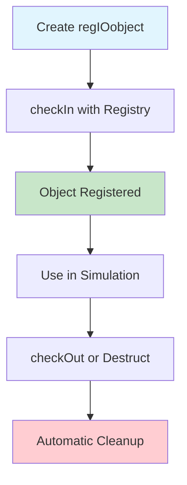
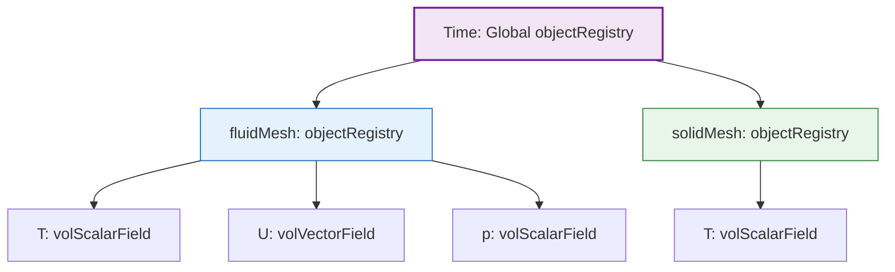
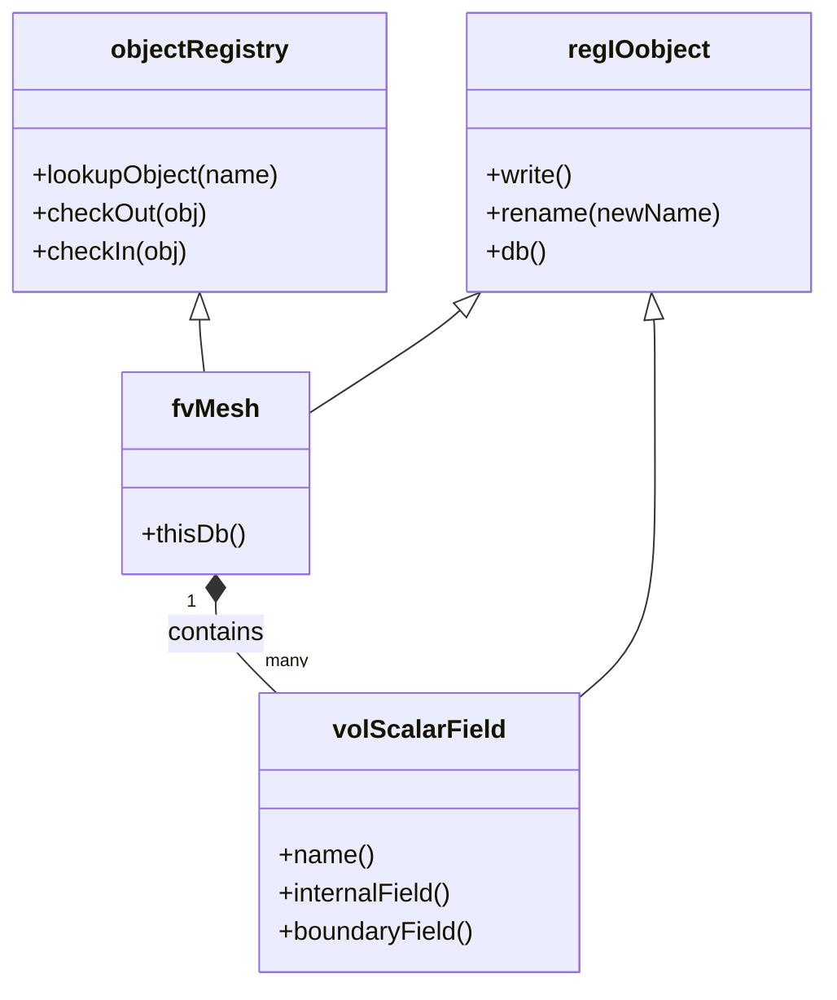

# Object Registry Architecture in Multi-Region Simulations

## Overview

The **object registry** is OpenFOAM's fundamental infrastructure for managing data separation and hierarchical organization in multi-region simulations (CHT, FSI, multiphase). This architecture enables multiple computational regions to coexist in a single simulation while maintaining strict data isolation and enabling efficient cross-region communication.

> [!INFO] Key Insight
> The object registry solves the **namespace problem**—how to distinguish between `fluid::T` and `solid::T`—through a hierarchical database structure combined with scoped naming conventions.

---

## 1. The Namespace Problem in Multi-Region Simulations

### 1.1 The Challenge

In multi-region simulations, each computational domain maintains its own set of physics fields. For conjugate heat transfer (CHT):

| **Fluid Region** | **Solid Region** |
|------------------|------------------|
| Temperature: $T_{\text{fluid}}$ | Temperature: $T_{\text{solid}}$ |
| Velocity: $\mathbf{U}_{\text{fluid}}$ | Velocity: $\mathbf{U}_{\text{solid}} \approx \mathbf{0}$ |
| Pressure: $p_{\text{fluid}}$ | Pressure: $p_{\text{solid}}$ (typically unused) |
| Density: $\rho_{\text{fluid}}$ | Density: $\rho_{\text{solid}}$ |

**Core Challenge:** How does OpenFOAM distinguish between identically named fields (`T`, `U`, `p`) across different regions without creating variable name chaos or memory inefficiency?

### 1.2 Solution: Region-Specific Field Aliasing

OpenFOAM addresses this through **preprocessor macros** that create region-specific aliases, allowing solver code to remain generic and reusable.

#### Fluid Field Macros
```cpp
// applications/solvers/heatTransfer/chtMultiRegionFoam/fluid/setRegionFluidFields.H
#define rhoFluid rho
#define TFluid T
#define UFluid U
#define pFluid p
#define phiFluid phi
#define KFluid K
```

#### Solid Field Macros
```cpp
// applications/solvers/heatTransfer/chtMultiRegionFoam/solid/setRegionSolidFields.H
#define rhoSolid rho
#define TSolid T
#define KSolid K
```

When the solver code references `T`, the macro expands it to the correct field for the current region being solved.

---

## 2. Object Registry Implementation

### 2.1 Core Architecture

The object registry is implemented as a **hash-based container** managing the lifecycle of registered objects:

```cpp
// src/OpenFOAM/db/objectRegistry/objectRegistry.H
class objectRegistry
{
private:
    // Hash table for O(1) object lookup by unique name
    HashTable<regIOobject*> objects_;

    // Parent registry for hierarchical organization
    const objectRegistry& parent_;

    // Registry name (typically the region name)
    const word name_;

public:
    // Constructor with parent and name
    objectRegistry(const word& name, const objectRegistry& parent);

    // Register object with optional scoping
    bool checkIn(regIOobject& io, const bool autoRegister = true);

    // Lookup object by name with type checking
    template<class Type>
    const Type& lookupObject(const word& name) const;

    // Get all objects of specified type
    template<class Type>
    HashTable<const Type*> lookupClass(const word& className) const;

    // Remove object from registry
    bool checkOut(regIOobject& io);

    // Iterator support for object traversal
    HashTable<regIOobject*>::iterator begin();
    HashTable<regIOobject*>::const_iterator begin() const;
};
```

### 2.2 Key Components

| Component | Type | Purpose |
|-----------|------|---------|
| `objects_` | `HashTable<regIOobject*>` | Stores objects with unique names for O(1) lookup |
| `parent_` | `const objectRegistry&` | Reference to parent registry for hierarchy |
| `name_` | `const word` | Identifier for this registry (region name) |

### 2.3 Integration with regIOobject

Every object participating in the registry system inherits from `regIOobject`:

```cpp
// src/OpenFOAM/db/regIOobject/regIOobject.H
class regIOobject : public IOobject
{
private:
    // Reference count for automatic memory management
    mutable int refCount_;

    // Pointer to registry storing this object
    mutable objectRegistry* dbPtr_;

    // Flag indicating whether object is registered
    mutable bool registered_;

public:
    // Register this object with specified registry
    virtual bool checkIn(const objectRegistry& registry);

    // Unregister from current registry
    virtual bool checkOut();

    // Get registry storing this object
    const objectRegistry& db() const;

    // Scoped naming (region::fieldName)
    word name() const;
    word globalName() const;

    // Automatic registration and cleanup
    virtual ~regIOobject();
};
```

### 2.4 Object Lifecycle


> **Figure 1:** แผนภาพแสดงวงจรชีวิตของวัตถุ (Object Lifecycle) ภายในระบบการจดทะเบียนของ OpenFOAM ตั้งแต่การสร้างออบเจกต์ การลงทะเบียนเข้าสู่ระบบ (checkIn) ไปจนถึงการล้างข้อมูลโดยอัตโนมัติเพื่อป้องกันปัญหาหน่วยความจำรั่วไหล


---

## 3. Hierarchical Registry Structure

### 3.1 Multi-Region Organization

In multiphase or CHT simulations, each phase/region maintains its own object registry:

```cpp
// Phase region structure in multiphaseEulerFoam
class phaseRegion
{
private:
    // Unique identifier for this region
    const word regionName_;

    // Mesh for this region
    fvMesh& regionMesh_;

    // Object registry for this region
    objectRegistry regionRegistry_;

    // Phase-specific fields
    volScalarField phaseFraction_;
    volVectorField velocity_;
    volScalarField pressure_;
    volScalarField temperature_;

public:
    // Constructor sets up region-specific registry
    phaseRegion
    (
        const word& name,
        fvMesh& mesh,
        const dictionary& dict
    );

    // Register field with region scoping
    template<class FieldType>
    void registerField
    (
        const word& fieldName,
        const FieldType& field
    );

    // Access region registry
    const objectRegistry& registry() const
    {
        return regionRegistry_;
    }
};
```

### 3.2 Phase Region Structure

| Component | Type | Description |
|-----------|------|-------------|
| `regionName_` | `const word` | Unique region identifier |
| `regionMesh_` | `fvMesh&` | Mesh for this region |
| `regionRegistry_` | `objectRegistry` | Registry managing objects |
| `phaseFraction_` | `volScalarField` | Volume fraction |
| `velocity_` | `volVectorField` | Velocity field |
| `pressure_` | `volScalarField` | Pressure field |
| `temperature_` | `volScalarField` | Temperature field |

---

## 4. Scoped Naming Convention

### 4.1 The Double Colon Convention

The double colon (`::`) in field names like `fluid::T` represents a **naming convention** rather than C++ namespace resolution:

```cpp
// Field registration with region scoping
template<class FieldType>
void phaseRegion::registerField
(
    const word& fieldName,
    const FieldType& field
)
{
    // Create scoped name: "region::fieldName"
    word scopedName = regionName_ + "::" + fieldName;

    // Register field in region registry
    regionRegistry_.checkIn(const_cast<FieldType&>(field));

    // Set scoped name
    const_cast<FieldType&>(field).rename(scopedName);
}

// Usage in phase system
phaseRegion fluidRegion("fluid", mesh, fluidDict);
fluidRegion.registerField("T", temperatureField); // Registered as "fluid::T"
```

### 4.2 Naming Examples

| Original Name | Registered Name | Region |
|---------------|-----------------|--------|
| `T` | `fluid::T` | fluid |
| `U` | `fluid::U` | fluid |
| `alpha` | `vapor::alpha` | vapor |
| `p` | `global::p` | global |

---

## 5. Template-Based Field Access

### 5.1 Type-Safe Region Field Lookup

OpenFOAM uses template metaprogramming for compile-time type-safe access to region fields:

```cpp
// Simplified region field lookup
template<class RegionMesh, class FieldType>
const GeometricField<FieldType, RegionMesh>&
lookupRegionField
(
    const word& regionName,
    const word& fieldName,
    const RegionMesh& mesh
)
{
    // Construct object registry key: regionName::fieldName
    const word regIOkey = regionName + "::" + fieldName;

    // Look up from object registry
    return mesh.thisDb().lookupObject<GeometricField<FieldType, RegionMesh>>
        (regIOkey);
}

// Usage in solver
const volScalarField& fluidT = lookupRegionField<fvMesh, scalar>("fluid", "T", fluidMesh);
const volScalarField& solidT = lookupRegionField<fvMesh, scalar>("solid", "T", solidMesh);
```

> [!TIP] Type Safety
> The template-based approach ensures you don't accidentally cast a scalar field to a vector field at runtime. Type mismatches are caught at compile time.

---

## 6. Hierarchical Registry Topology

### 6.1 Registry Hierarchy Diagram


> **Figure 2:** แผนภูมิแสดงโครงสร้างลำดับชั้นของระบบการจดทะเบียนวัตถุ (Registry Hierarchy) ในการจำลองแบบหลายภูมิภาค ซึ่งช่วยให้สามารถแยกแยะฟิลด์ที่มีชื่อซ้ำกันได้ภายใต้ภูมิภาคที่แตกต่างกัน ( fluidMesh vs solidMesh )


### 6.2 Structure Overview

```
Global Registry (Time)
├── fluid:: (Region)
│   ├── fluid::T
│   ├── fluid::U
│   └── fluid::p
├── solid:: (Region)
│   ├── solid::T
│   └── solid::rho
└── interface:: (Region)
    ├── interface::alpha
    └── interface::surfaceTension
```

### 6.3 Class Diagram


> **Figure 3:** แผนผังคลาสแสดงความสัมพันธ์ระหว่างระบบจัดการข้อมูล (objectRegistry) และฟิลด์ข้อมูลทางฟิสิกส์ โดยแสดงให้เห็นว่าเมชทำหน้าที่เป็นศูนย์กลางในการบรรจุและจัดการข้อมูลฟิลด์ต่างๆ ภายในแต่ละภูมิภาค


---

## 7. Field Lookup and Manipulation

### 7.1 Accessing Region Fields

```cpp
// Get references to meshes
const fvMesh& fluidMesh = fluidRegions[0];
const fvMesh& solidMesh = solidRegions[0];

// Lookup fields (Note: "T" exists in both, separated by their registry)
const volScalarField& fluidT = fluidMesh.thisDb().lookupObject<volScalarField>("T");
const volScalarField& solidT = solidMesh.thisDb().lookupObject<volScalarField>("T");

// For coupled boundary conditions, use fully scoped names
const word fluidTname = "fluid::T";
const word solidTname = "solid::T";
```

### 7.2 Existence Checking

Always check before accessing to avoid runtime errors:

```cpp
if (mesh.thisDb().foundObject<volScalarField>("T"))
{
    // Safe to lookup
    const volScalarField& T = mesh.thisDb().lookupObject<volScalarField>("T");
}
```

### 7.3 Field Lookup Implementation

```cpp
// Field lookup with hierarchical search
template<class Type>
const Type& phaseSystem::lookupField
(
    const word& regionName,
    const word& fieldName
) const
{
    // Construct scoped name
    word scopedName = regionName + "::" + fieldName;

    // Try region-specific registry first
    if (phaseRegions_.found(regionName))
    {
        const objectRegistry& reg = phaseRegions_[regionName].registry();

        try
        {
            return reg.lookupObject<Type>(scopedName);
        }
        catch (const Foam::error&)
        {
            // Fall back to global registry if not found in region
        }
    }

    // Global registry lookup
    return mesh_.lookupObject<Type>(scopedName);
}
```

### 7.4 Field Lookup Steps

1. **Construct scoped name**: `region::fieldName`
2. **Search in region registry**:
   - If found → return field
   - If not found → proceed to step 3
3. **Search in global registry**
4. **Throw error** if not found in either location

---

## 8. Memory Management and Lifecycle

### 8.1 Automatic Cleanup

The registry system provides automatic memory management through reference counting:

```cpp
// Automatic cleanup in destructor
regIOobject::~regIOobject()
{
    if (registered_ && dbPtr_)
    {
        // Automatically remove from registry
        dbPtr_->checkOut(*this);
    }
}

// Reference counting for shared objects
void regIOobject::addRef() const
{
    refCount_++;
}

void regIOobject::release() const
{
    if (--refCount_ == 0)
    {
        delete this;
    }
}
```

### 8.2 Object Lifecycle in Registry

| Stage | Operation | Result |
|-------|-----------|--------|
| Create Object | Create `regIOobject` | `refCount_ = 1` |
| checkIn | Register with registry | `registered_ = true` |
| Use | Access via lookup | `refCount_` increments/decrements |
| checkOut | Unregister | `registered_ = false` |
| Destroy | `refCount_` = 0 | Memory freed |

---

## 9. Performance Optimizations

### 9.1 Efficient Field Caching

```cpp
// Efficient field caching
template<class FieldType>
class fieldCache
{
private:
    // Cached field references
    HashTable<const FieldType*> cachedFields_;

    // Registry reference
    const objectRegistry& registry_;

public:
    // Get field with caching
    const FieldType& getField(const word& fieldName)
    {
        if (!cachedFields_.found(fieldName))
        {
            const FieldType& field =
                registry_.lookupObject<FieldType>(fieldName);
            cachedFields_.insert(fieldName, &field);
        }

        return *cachedFields_[fieldName];
    }

    // Clear cache when registry changes
    void clearCache()
    {
        cachedFields_.clear();
    }
};
```

### 9.2 Performance Techniques

| Technique | Performance Impact | Suitable For |
|-----------|-------------------|--------------|
| Hash table lookup | $O(1)$ for searches | Repeated access |
| Field caching | Reduces lookup overhead | Frequently used fields |
| Reference counting | Reduces copying | Shared objects |
| Scoped naming | Reduces ambiguity | Multiphase systems |

---

## 10. Thread Safety Considerations

### 10.1 Thread-Safe Registry Operations

```cpp
// Thread-safe registry operations
class threadSafeObjectRegistry : public objectRegistry
{
private:
    // Mutex for thread safety
    mutable std::mutex registryMutex_;

public:
    // Thread-safe object insertion
    bool checkIn(regIOobject& io, const bool autoRegister = true)
    {
        std::lock_guard<std::mutex> lock(registryMutex_);
        return objectRegistry::checkIn(io, autoRegister);
    }

    // Thread-safe object lookup
    const regIOobject& lookupObject(const word& name) const
    {
        std::lock_guard<std::mutex> lock(registryMutex_);
        return objectRegistry::lookupObject(name);
    }
};
```

### 10.2 Thread Safety Summary

| Operation | Thread Safe | Lock Type |
|-----------|-------------|-----------|
| `checkIn` | ✓ | Write lock |
| `checkOut` | ✓ | Write lock |
| `lookupObject` | ✓ | Read lock |
| `Iterator` | ✗ | Requires external lock |

---

## 11. Practical Field Manipulation

### 11.1 Region-Aware Custom Utilities

When developing utilities that work across multiple regions:

```cpp
template<class FieldType>
void printRegionFieldInfo
(
    const fvMesh& mesh,
    const word& fieldName
)
{
    // Check if field exists in this region
    if (mesh.thisDb().foundObject<FieldType>(fieldName))
    {
        const FieldType& fld = mesh.thisDb().lookupObject<FieldType>(fieldName);
        Info<< "Region: " << mesh.name()
            << " Field: " << fieldName
            << " Min: " << min(fld)
            << " Max: " << max(fld) << nl;
    }
}

// Usage across regions
forAll(fluidRegions, i)
{
    printRegionFieldInfo<volScalarField>(fluidRegions[i], "T");
}
forAll(solidRegions, i)
{
    printRegionFieldInfo<volScalarField>(solidRegions[i], "T");
}
```

### 11.2 Design Patterns

| Pattern | Description | Benefit |
|---------|-------------|---------|
| **Template design** | Parameter `<class FieldType>` | Single function works with different field types |
| **Safety checking** | Call `foundObject<FieldType>()` | Prevents runtime errors |
| **Region-aware** | Accept `const fvMesh&` | Works on any region mesh |
| **Minimal field operations** | Use `min()` and `max()` | Quick field statistics without modifying data |

---

## 12. Why This Design?

### 12.1 Architectural Benefits

The macro-based and registry-based design balances **code reuse** with **data separation**:

#### Pros

1. **Code Reuse**: The same momentum equation code (`solve(UEqn == -grad(p))`) works for any fluid region without modification.

2. **Memory Efficiency**: Fields are stored only once in their respective regions. No duplicate copies.

3. **Parallel Scalability**: The registry structure works seamlessly with domain decomposition. Each processor handles its local part of the registry.

4. **Maintainability**: Solver logic remains clean and focused on physics rather than region-specific field management.

5. **Performance**: Macro expansion happens at compile time, so there's no runtime overhead.

6. **Consistency**: All regions follow the same naming pattern, reducing the likelihood of field access errors.

#### Cons

1. **Debugging**: Macros can make compiler errors harder to read.

2. **Complexity**: Understanding the hierarchy requires knowledge of underlying C++ classes (`objectRegistry`, `regIOobject`).

3. **IDE Support**: Some IDEs struggle with proper code completion and navigation through macro-defined aliases.

### 12.2 Mathematical Foundation

For conjugate heat transfer, the registry architecture enables proper implementation of interface coupling conditions:

**Temperature continuity at interface:**
$$T_f|_{\Gamma} = T_s|_{\Gamma}$$

**Heat flux balance at interface:**
$$-k_f \frac{\partial T_f}{\partial n}\bigg|_{\Gamma} = -k_s \frac{\partial T_s}{\partial n}\bigg|_{\Gamma}$$

**Verification criterion:**
$$\frac{|q_f + q_s|}{|q_f|} < 10^{-6}$$

where:
- $T_f, T_s$ = fluid and solid temperatures
- $k_f, k_s$ = fluid and solid thermal conductivities
- $q_f, q_s$ = fluid and solid heat fluxes
- $\Gamma$ = interface boundary
- $\frac{\partial}{\partial n}$ = normal derivative at interface

---

## 13. Key Takeaways

1. **Hierarchical Organization**: The object registry provides a tree-like structure where `Time` is the root, regions are branches, and fields are leaves.

2. **Scoped Naming**: The `region::fieldName` convention prevents name collisions while maintaining readable code.

3. **Automatic Memory Management**: Reference counting ensures objects are cleaned up when no longer needed.

4. **Type Safety**: Template-based lookup prevents type mismatches at compile time.

5. **Parallel Compatibility**: The registry structure integrates seamlessly with OpenFOAM's domain decomposition.

6. **Code Reusability**: Macros allow generic solver code to work across multiple regions with different physics.

This architecture is fundamental to OpenFOAM's ability to handle complex multi-physics problems like CHT and FSI without rewriting core solvers for every new physics combination.
