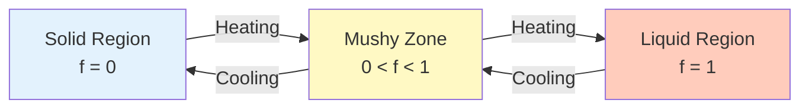
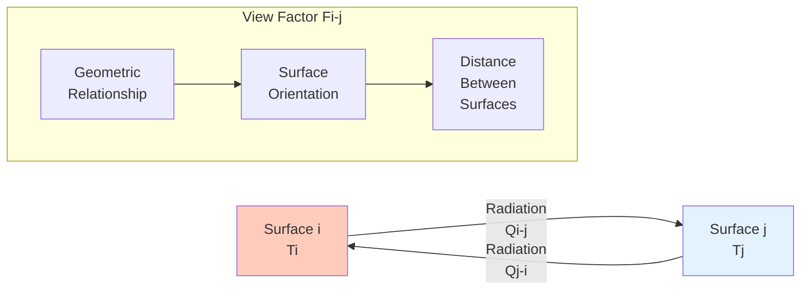

# 🔗 Advanced Coupling Topics

> [!INFO] Overview
> This note covers advanced coupling phenomena in OpenFOAM multiphysics simulations, including phase change materials, radiation coupling, and numerical stability considerations in fluid-structure interaction.

---

## 1. Phase Change Materials (PCM)

**Phase Change Materials (PCMs)** are substances that absorb or release substantial thermal energy during phase transitions, typically between solid and liquid states. This unique property makes PCMs critical for thermal management systems in:

- Building temperature control
- Electronics heat dissipation
- Spacecraft thermal control

OpenFOAM provides a robust numerical framework for simulating PCM behavior through specialized solvers and models that capture the complex physics of phase change processes.

### 1.1 Fundamental Phase Change Physics

At the core of PCM simulation lies the **enthalpy method**, which reformulates the energy equation to handle discontinuous enthalpy changes at the phase change temperature.

#### Phase Change Governing Equation

$$\rho L \frac{\partial f}{\partial t} = \nabla \cdot (k \nabla T)$$

**Variable Definitions:**
- $\rho$ = Material density [kg/m³]
- $L$ = Latent heat of fusion [J/kg]
- $f$ = Liquid fraction (dimensionless, 0 ≤ $f$ ≤ 1)
- $k$ = Thermal conductivity coefficient [W/(m·K)]
- $T$ = Temperature field [K]

The liquid fraction $f$ represents the proportion of material in liquid state within a volume element and varies from **0 (fully solid)** to **1 (fully liquid)** within a small temperature range around the melting point.



### 1.2 Enthalpy-Porosity Method

The **enthalpy-porosity method** is the most widely used technique for simulating solid-liquid phase change in OpenFOAM.

#### Operating Principle

This method treats the **mushy zone** (where solid and liquid states coexist) as a porous medium with porosity equal to the liquid fraction.

#### Modified Momentum Equation

$$\mathbf{S}_m = -A_{\text{mush}} \frac{(1-f)^2}{f^3 + \epsilon} \mathbf{u}$$

**Variable Definitions:**
- $A_{\text{mush}}$ = Mushy zone constant [Pa·s/m²]
- $\epsilon$ = Small value (~10⁻³) to prevent division by zero
- $\mathbf{u}$ = Velocity vector [m/s]

This damping term effectively **reduces velocity to zero** in solid regions while allowing natural convection in the liquid state.

### 1.3 OpenFOAM Implementation

#### Solver meltFoam

The **primary solver for melting/solidification problems** is `meltFoam`, which implements a complete set of governing equations:

##### Core Components

1. **Energy Equation**: Incorporating enthalpy-temperature coupling
2. **Momentum Equation**: Modified with porosity damping terms
3. **Continuity Equation**: Standard incompressible flow formulation

##### Implementation Features
- Automatic enthalpy calculation based on temperature and phase fraction
- Adaptive time stepping for stability during rapid phase transitions
- Support for multiple material properties (density, specific heat, thermal conductivity)

#### OpenFOAM Code Implementation

```cpp
// Enthalpy-porosity source term implementation
volVectorField& U = mesh_.lookupObject<volVectorField>("U");
const volScalarField& f = mesh_.lookupObject<volScalarField>("liquidFraction");

// Damping source term
volVectorField Sporous =
   -Amush_ * (1.0 - f) * (1.0 - f) / (f*f*f() + epsilon_) * U;

// Add to momentum equation
UEqn += Sporous;
```

#### Thermophysical Properties

PCM materials require careful thermophysical property specification in `thermophysicalProperties`:

```cpp
type            mixtureProperties11;
mixture         PCM;

species
(
    PCM
);

energy          sensibleEnthalpy;

specie
{
    molWeight       1;
}

thermo
{
    type            sensibleEnthalpy;
    Cp              Cp [0 2 -2 -1 0 0 0] 2100;
    Hf              0;
}

transport
{
    type            const;
    mu              mu [1 -1 -1 0 0 0 0] 0.001;
    Pr              Pr [0 0 0 0 0 0 0] 7;
}
```

### 1.4 Advanced PCM Simulation Features

#### Multiple PCM Regions

OpenFOAM can handle complex geometries with multiple PCM materials having:
- Different melting temperatures
- Separate thermophysical properties
- Phase transition parameters specific to each zone

#### Anisotropic Thermal Properties

For directional materials (e.g., composites), OpenFOAM supports anisotropic thermal conductivity tensors:

$$\mathbf{k} = \begin{bmatrix}
k_x & 0 & 0 \\
0 & k_y & 0 \\
0 & 0 & k_z
\end{bmatrix}$$

#### Natural Convection Effects

When PCM is in liquid state, natural convection can significantly enhance heat transfer:

$$\mathbf{F}_b = \rho \mathbf{g} \beta (T - T_{\text{ref}})$$

**Variable Definitions:**
- $\mathbf{g}$ = Gravity acceleration vector [m/s²]
- $\beta$ = Thermal expansion coefficient [1/K]
- $T_{\text{ref}}$ = Reference temperature [K]

### 1.5 Practical Implementation Considerations

#### Numerical Stability

PCM simulations require special care:

| Factor | Consideration | Management Strategy |
|--------|--------------|---------------------|
| **Time Step** | Phase transition rate | Use small time steps during rapid transitions |
| **Under-relaxation** | Temperature coupling | Implement appropriate under-relaxation factors |
| **Mesh Quality** | High temperature gradients | Check mesh quality, especially in high-gradient regions |

#### Mesh Requirements

**High-quality mesh** is essential for accurate PCM simulation:

1. **High resolution** near phase boundaries to capture moving interfaces
2. **Avoid highly skewed cells** which can destabilize porosity calculations
3. **Adaptive mesh refinement** for evolving phase boundaries

#### Performance Optimization

For large-scale PCM simulations:

| Strategy | Purpose | Outcome |
|----------|---------|----------|
| **Parallel Decomposition** | Reduce interface communication | Better parallel computation efficiency |
| **Multigrid Solvers** | Pressure-velocity coupling | Faster convergence |
| **GPU Acceleration** | Convection calculations | Speedup for compute-intensive operations |

### 1.6 Applications and Case Studies

#### Building Thermal Management

**PCM wall panels for building energy efficiency:**

- **Heat absorption** from solar radiation during day, release at night
- **HVAC energy reduction** of 20-40%
- **Maintained indoor temperature range** for comfort

#### Electronics Heat Dissipation

**PCM-based thermal management for electronics:**

- **Passive cooling** for high-power electronic devices
- **Temperature control** during power surges
- **Extended device lifespan** through reduced thermal cycling

#### Spacecraft Thermal Control

**PCM applications in space systems:**

- **Temperature stabilization** for sensitive electronics
- **Thermal management** during orbit changes
- **Heat buffering** for power transients

---

## 2. Radiation Coupling

Simulating surface-to-surface radiation in OpenFOAM is a critical aspect of heat transfer simulation where radiative heat exchange between surfaces significantly impacts overall thermal behavior. This phenomenon is particularly important in high-temperature applications, combustion systems, and processes where radiative heat transfer is dominant or highly contributory to the energy balance.

### 2.1 Mathematical Fundamentals

The basic radiative heat transfer equation applied in OpenFOAM follows the Stefan-Boltzmann law for surface-to-surface radiation:

$$q_{\text{rad}} = \epsilon \sigma (T^4 - T_{\infty}^4)$$

**Where:**
- $q_{\text{rad}}$ = Radiative heat flux density [W/m²]
- $\epsilon$ = Surface emissivity (dimensionless, 0 ≤ $\epsilon$ ≤ 1)
- $\sigma$ = Stefan-Boltzmann constant ($5.67 \times 10^{-8}$ W/m²K⁴)
- $T$ = Surface temperature [K]
- $T_{\infty}$ = Ambient or surrounding temperature [K]

This equation accounts for the nonlinear relationship between temperature and radiative heat transfer, where heat flux is proportional to the fourth power of the absolute temperature difference. The emissivity $\epsilon$ represents the ratio of radiation emitted from the actual surface compared to that from a blackbody at the same temperature.

### 2.2 OpenFOAM Implementation

#### Radiation Boundary Conditions

OpenFOAM implements radiation coupling through specific boundary conditions that integrate radiative heat transfer with conductive and convective mechanisms. The primary boundary condition type is `radiation`, which can be applied to temperature fields in thermal simulations.

```cpp
// Example radiation boundary condition specification
boundaryField
{
    heatedSurface
    {
        type            radiation;
        epsilon         0.85;           // Surface emissivity
        TInf           300;            // Ambient temperature [K]
        qr             qr;             // Name of radiative flux field
    }
}
```

#### Mapped Boundary Conditions for Coupled Surfaces

For surface-to-surface radiation between different computational domains or coupled surfaces, OpenFOAM uses the `mapped` boundary condition type, enabling radiation data exchange between different mesh regions or connected patches.

```cpp
// Example mapped radiation boundary condition
boundaryField
{
    coupledSurface
    {
        type            mapped;
        setAverage     false;
        average       false;
        interpolationScheme cellPoint;
        value          uniform 300;

        // Radiation properties
        radiation
        {
            type            viewFactor;
        }
    }
}
```

### 2.3 View Factor Method

For enclosed systems with multiple radiating surfaces, OpenFOAM implements the **view factor method** to calculate geometric relationships between surfaces. The view factor $F_{i-j}$ represents the fraction of radiation leaving surface $i$ that directly intercepts surface $j$.

The radiative heat exchange between surfaces $i$ and $j$ is:

$$Q_{i-j} = \epsilon_i \sigma A_i F_{i-j} (T_i^4 - T_j^4)$$



### 2.4 Coupling with Conduction

Radiation boundary conditions must be properly coupled with conductive heat transfer at boundaries. The total heat flux at a radiating boundary comprises:

$$q_{\text{total}} = q_{\text{conduction}} + q_{\text{convection}} + q_{\text{radiation}}$$

Where the conductive heat flux is:

$$q_{\text{conduction}} = -k \frac{\partial T}{\partial n}$$

This coupling ensures energy conservation across boundaries and maintains physical consistency of results.

### 2.5 Solution Strategies

Due to the nonlinear nature of radiation (T⁴ dependence), OpenFOAM solvers employ iterative solution strategies:

1. **Under-relaxation**: Applied to temperature updates to ensure convergence
2. **Linearization**: Radiation terms are linearized around current temperatures
3. **Segregated Solving**: Temperature field is solved separately from other variables

The linearized radiation term can be expressed as:

$$q_{\text{rad}}^{n+1} \approx q_{\text{rad}}^n + \frac{\partial q_{\text{rad}}}{\partial T}\bigg|_n (T^{n+1} - T^n)$$

Where the derivative is:

$$\frac{\partial q_{\text{rad}}}{\partial T} = 4 \epsilon \sigma T^3$$

### 2.6 Application Examples

#### Furnace Simulation

In furnace and combustion chamber simulations, radiation coupling is essential for accurate temperature prediction. High temperature gradients and participating media (combustion gases) require coupled radiation-convection-conduction analysis.

#### Solar Radiation

For building external thermal analysis, solar radiation effects can be simulated using modified radiation boundary conditions that account for directional solar flux and atmospheric effects.

#### Electronics Cooling

Electronic device cooling often involves radiative heat transfer between devices and surroundings, particularly at high temperatures or in vacuum conditions where radiation is the dominant heat transfer mechanism.

| Application Type | Radiation Importance | Simulation Method |
|------------------|---------------------|-------------------|
| Furnaces and combustion chambers | High (determines temperature distribution) | View factor + conjugate heat |
| Solar radiation | High (external flux) | Solar load + incident angle |
| Electronics cooling | Moderate to High (T-dependent) | Radiation + convection |

---

## 3. Numerical Stability in Fluid-Structure Interaction

Fluid-Structure Interaction (FSI) problems present some of the most challenging numerical stability issues in computational mechanics due to the tight coupling between physical systems with vastly different time scales and stiffness properties.

### 3.1 Added Mass Instability Phenomenon

At the core of FSI stability challenges is the **added mass effect**, where the fluid adds effective mass to the structure, creating an unstable feedback loop in explicit coupling schemes.

When a structure accelerates through a dense fluid like water, it must also accelerate the surrounding fluid, significantly increasing the effective inertia of the coupled system.

#### Instability Criterion Analysis

For incompressible flow configurations, explicit coupling becomes unstable when the density ratio between fluid and structure exceeds a critical limit:

$$\frac{\rho_f}{\rho_s} > C_{\text{crit}}$$

**Variable Definitions:**
- $\rho_f$ = Fluid density
- $\rho_s$ = Structure density
- $C_{\text{crit}}$ = Critical stability parameter (typically in range 0.2-1.0)

#### Factors Affecting $C_{\text{crit}}$

| Factor | Description |
|---------|-------------|
| **Geometric Configuration** | Slender submerged structures behave differently than bluff bodies |
| **Discretization Parameters** | Grid resolution and time step size affect stability bounds |
| **Boundary Conditions** | Fixed vs. free boundary conditions alter coupling dynamics |
| **Numerical Scheme** | Specific coupling algorithms affect stability characteristics |

**Practical Impact:** When simulating lightweight structures (low density) in heavy fluids (high density), explicit coupling schemes rapidly become unstable, requiring very small time steps or more sophisticated stabilization techniques.

### 3.2 Physical Origin of Instability

The instability originates from the physics of incompressible flow, where pressure waves travel at infinite speed.

When a structure moves, it creates pressure disturbances throughout the fluid domain instantaneously, which feed back as forces on the structure. This instantaneous feedback creates a mathematical singularity in the coupling equations, which manifests as numerical instability when handled explicitly.

### 3.3 Numerical Stabilization Techniques

#### 1. Under-Relaxation

The simplest stabilization approach is to relax structural displacement updates:

$$\mathbf{d}^{n+1} = \mathbf{d}^n + \omega(\mathbf{d}^* - \mathbf{d}^n)$$

**Variable Definitions:**
- $\mathbf{d}^*$ = Displacement predicted from fluid solver
- $\omega \in [0.1, 0.5]$ = Relaxation factor

##### Advantages and Disadvantages

| Advantages | Disadvantages |
|-----------|---------------|
| Easy to implement | Convergence can be very slow |
| Low computational cost | May not stabilize for tightly coupled problems |
| Works well for moderate density ratios | Requires careful tuning of $\omega$ |

#### 2. Aitken Acceleration

Aitken acceleration provides adaptive relaxation based on residual history, automatically adjusting $\omega$ for optimal convergence:

$$\omega^{n+1} = \omega^n \left(\frac{(\mathbf{r}^{n-1} - \mathbf{r}^n) \cdot \mathbf{r}^{n-1}}{(\mathbf{r}^{n-1} - \mathbf{r}^n) \cdot (\mathbf{r}^{n-1} - \mathbf{r}^n)}\right)$$

Where $\mathbf{r}^n = \mathbf{d}^n - \mathbf{d}^{n-1}$ represents the residual between successive iterations.

#### OpenFOAM Code Implementation

```cpp
// Pseudocode for Aitken acceleration in FSI coupling
scalar omega = 0.5; // Initial relaxation factor
vectorField dPrev = d;
vectorField dCurr = d;

for (int iter = 0; iter < maxIter; iter++)
{
    // Solve fluid equations with current displacement
    fluidSolver.solve(dCurr);

    // Get fluid forces on structure
    vectorField fluidForces = fluidSolver.getForces();

    // Solve structural equations
    vectorField dNew = structureSolver.solve(fluidForces);

    if (iter > 0)
    {
        // Apply Aitken acceleration
        vectorField rPrev = dCurr - dPrev;
        vectorField rCurr = dNew - dCurr;

        scalar alpha = -rPrev & rCurr / (rCurr & rCurr);
        omega *= alpha;

        dCurr = dPrev + omega * (dNew - dPrev);
    }
    else
    {
        dCurr = dNew;
    }

    // Check convergence
    if (mag(dNew - dCurr) < tolerance) break;
}
```

#### 3. Implicit Coupling Methods

The most robust approach is **fully implicit coupling**, where fluid and structure are solved simultaneously in a monolithic system:

$$\begin{bmatrix}
\mathbf{A}_f & -\mathbf{B} \\
\mathbf{B}^T & \mathbf{A}_s
\end{bmatrix}
\begin{bmatrix}
\Delta \mathbf{u}_f \\
\Delta \mathbf{d}
\end{bmatrix}
=
\begin{bmatrix}
\mathbf{R}_f \\
\mathbf{R}_s
\end{bmatrix}$$

**Variable Definitions:**
- $\mathbf{A}_f$, $\mathbf{A}_s$ = Jacobian matrices for fluid and structure
- $\mathbf{B}$ = Coupling conditions
- $\mathbf{R}_f$, $\mathbf{R}_s$ = Residuals

##### Implementation Challenges

| Challenge | Details |
|-----------|---------|
| **Memory Requirements** | Monolithic Jacobian matrices can be very large |
| **Solver Complexity** | Requires specialized linear solvers for block systems |
| **Code Integration** | Demands deep integration between fluid and structural solvers |

##### Advantages
- Unconditionally stable for any density ratio
- Quadratic convergence with Newton methods
- Can handle highly nonlinear FSI problems

### 3.4 OpenFOAM User Considerations

#### Selecting Appropriate Stabilization Strategy

##### Low Density Ratio ($\rho_f/\rho_s < 0.2$)
- Standard under-relaxation may be sufficient
- Low computational cost
- Can converge rapidly

##### Moderate Density Ratio ($0.2 < \rho_f/\rho_s < 1.0$)
- Aitken acceleration recommended
- Better stability bounds
- Automatic parameter tuning

##### High Density Ratio ($\rho_f/\rho_s > 1.0$)
- Implicit coupling required
- Consider specialized FSI solvers
- May require block preconditioners

#### Best Practices

1. **Time Step Selection**: Even with stabilization, start with small time steps and increase gradually
2. **Convergence Monitoring**: Track both fluid residuals and structural interface forces
3. **Interface Quality**: Ensure good mesh quality at fluid-structure interfaces
4. **Preconditioning**: Use appropriate preconditioners for coupled systems
5. **Parallel Efficiency**: Consider load balancing between fluid and structure processors

#### Diagnostic Indicators

Monitor these indicators for stability assessment:

| Indicator | Behavior to Observe |
|-----------|-------------------|
| **Interface force convergence** | Should show monotonic convergence |
| **Energy conservation** | Check for unnatural energy gains/losses |
| **Residual history** | Look for oscillatory or divergent behavior |
| **Displacement continuity** | Check for smooth transitions at interface |

### 3.5 Advanced Stabilization Techniques

#### Interface Quasi-Newton Methods

Interface quasi-Newton methods approximate the inverse of the interface mapping Jacobian, providing superior stability without the cost of full implicit coupling:

$$\mathbf{W}^{n+1} = \mathbf{W}^n + \frac{(\Delta\mathbf{R}^n - \mathbf{W}^n\Delta\mathbf{d}^n)\Delta\mathbf{d}^{nT}}{\Delta\mathbf{d}^{nT}\Delta\mathbf{d}^n}$$

**Variable Definitions:**
- $\mathbf{W}$ = Jacobian inverse approximation
- $\Delta\mathbf{R}$ = Residual change
- $\Delta\mathbf{d}$ = Displacement change

#### Robin Interface Conditions

Using Robin (mixed) interface conditions instead of Dirichlet-Neumann coupling can improve stability:

$$\alpha \mathbf{u}_f + \beta \mathbf{t}_f = \alpha \mathbf{u}_s + \beta \mathbf{t}_s \quad \text{on } \Gamma_{FS}$$

**Variable Definitions:**
- $\alpha$, $\beta$ = Weighting parameters tunable for optimal stability
- $\mathbf{u}_f$, $\mathbf{u}_s$ = Fluid and structure velocities
- $\mathbf{t}_f$, $\mathbf{t}_s$ = Fluid and structure tractions
- $\Gamma_{FS}$ = Fluid-structure interface

---

## 4. Verification and Validation

Verification and Validation (V&V) are fundamental processes in computational fluid dynamics that build confidence in simulation results through systematic assessment of numerical accuracy and physical fidelity. In the context of CFD and OpenFOAM, V&V encompasses both mathematical verification of numerical implementation and physical validation against experimental results or analytical solutions.

### 4.1 Verification: Mathematical Correctness

Verification answers the question: **"Are we solving the equations correctly?"** This involves confirming that the numerical implementation accurately represents the mathematical model and that numerical calculations converge to the correct solution of the governing equations.

#### Code Verification

Code verification focuses on confirming that numerical algorithms are implemented correctly without programming errors:

```cpp
// Example verification test for gradient calculation
template<class Type>
void Foam::fv::gradScheme<Type>::verifyCalculation
(
    const GeometricField<Type, fvPatchField, volMesh>& vf
) const
{
    // Test order of accuracy using method of manufactured solutions
    for (int refinement = 0; refinement < 4; refinement++)
    {
        // Refine mesh and compute gradient
        // Verify convergence rate matches theoretical order
    }
}
```

#### Solution Verification

Solution verification assesses the numerical accuracy of specific calculations through:

##### Grid Convergence Study

Systematically refining mesh to assess solution convergence:

$$\phi_h = \phi_{exact} + C h^p + O(h^{p+1})$$

**Where:**
- $\phi_h$ = Solution on mesh of size $h$
- $\phi_{exact}$ = Exact solution
- $C$ = Constant
- $p$ = Order of convergence

##### Richardson Extrapolation

Extrapolating to exact solution from multiple grid levels:

$$\phi_{R} = \phi_{2h} + \frac{\phi_{2h} - \phi_{4h}}{2^p - 1}$$

#### Discretization Error Analysis

The discretization error $\epsilon_h$ is the difference between numerical and exact solutions of the continuous equations:

$$\epsilon_h = \phi_h - \phi_{exact}$$

For second-order accurate schemes in OpenFOAM, the expected convergence rate is approximately $O(h^2)$ for sufficiently refined meshes.

### 4.2 Validation: Physical Fidelity

Validation answers the question: **"Are we solving the right equations?"** This involves comparing simulation results with experimental data or analytical solutions to confirm that the mathematical model accurately represents physical phenomena.

#### Validation Methods

##### Benchmark Problems

Standard benchmark cases provide reference solutions for validation:

| Benchmark Problem | Purpose | Validation Parameters |
|-------------------|---------|------------------------|
| Flow over cylinder (Re=40) | Flow establishment | Recirculation length, pressure distribution |
| Lid-driven cavity | Pressure-velocity coupling | Velocity profiles, convergence |
| Backward step | Flow separation | Reattachment length, wall shear stress |

```cpp
// Example validation case setup
// Backward step - Re=100, expansion ratio 1.942
void Foam::validationCases::backwardStep()
{
    // Compare with experimental data from Armaly et al. (1983)
    // Key validation parameters:
    // - Reattachment length
    // - Velocity profiles
    // - Wall shear stress distribution
}
```

#### Experimental Validation

##### Wind Tunnel Testing

Comparing CFD results with wind tunnel measurements involves:

###### Velocity Profiles

Point-by-point comparison of velocity magnitude and direction:

$$\text{Error}_{velocity} = \frac{|\mathbf{u}_{CFD} - \mathbf{u}_{experiment}|}{|\mathbf{u}_{experiment}|} \times 100\%$$

###### Pressure Coefficient

Validating surface pressure distribution:

$$C_p = \frac{p - p_{\infty}}{\frac{1}{2}\rho U_{\infty}^2}$$

###### Force Coefficients

Validating drag and lift coefficients:

$$C_D = \frac{F_D}{\frac{1}{2}\rho U_{\infty}^2 A}, \quad C_L = \frac{F_L}{\frac{1}{2}\rho U_{\infty}^2 A}$$

### 4.3 Uncertainty Quantification

Validation must account for uncertainties in both experimental and computational results:

#### Experimental Uncertainty

Measurement uncertainties affect validation comparisons:

$$u = \sqrt{u_A^2 + u_B^2}$$

**Where:**
- $u_A$ = Type A uncertainty (statistical)
- $u_B$ = Type B uncertainty (systematic)

#### Computational Uncertainty

Sources of computational uncertainty include:

| Source | Symbol | Description |
|--------|--------|-------------|
| Mesh discretization | $\epsilon_{mesh}$ | Error from mesh resolution |
| Time stepping | $\epsilon_{time}$ | Error from time step size |
| Iterative convergence | $\epsilon_{iter}$ | Error from non-convergence |
| Model assumptions | $\epsilon_{model}$ | Error from modeling |

Total computational uncertainty:

$$U_{CFD} = \sqrt{\epsilon_{mesh}^2 + \epsilon_{time}^2 + \epsilon_{iter}^2 + \epsilon_{model}^2}$$

### 4.4 Validation Metrics

#### Statistical Validation Metrics

| Metric | Equation | Meaning |
|--------|----------|---------|
| Coefficient of determination (R²) | $R^2 = 1 - \frac{\sum_{i=1}^n (y_i - \hat{y}_i)^2}{\sum_{i=1}^n (y_i - \bar{y})^2}$ | Data agreement |
| Root mean square error (RMSE) | $\text{RMSE} = \sqrt{\frac{1}{n}\sum_{i=1}^n (y_i - \hat{y}_i)^2}$ | Average deviation |
| Mean absolute percentage error (MAPE) | $\text{MAPE} = \frac{100\%}{n}\sum_{i=1}^n \left|\frac{y_i - \hat{y}_i}{y_i}\right|$ | Percentage error |

### 4.5 Validation Hierarchy

Validation follows a hierarchical approach from simple to complex problems:

#### Level 1: Unit Problems

Validation of individual physical phenomena:
- **Laminar flow validation**: Poiseuille flow, Couette flow
- **Heat transfer validation**: Conduction in simple geometries
- **Turbulence model validation**: Flat plate boundary layers

#### Level 2: Integrated Problems

Multi-physics validation scenarios:
- **Conjugate heat transfer**: Solid-fluid coupling
- **Multiphase flow**: Bubble dynamics, interface tracking
- **Combustion**: Simple flame configurations

#### Level 3: Engineering Applications

Full-scale engineering problem validation:
- **Automotive aerodynamics**: Vehicle drag prediction
- **Building ventilation**: Indoor air quality assessment
- **Chemical reactors**: Flow and reaction validation

### 4.6 Validation Tools in OpenFOAM

OpenFOAM provides specialized tools for validation:

```cpp
// Validation tools in OpenFOAM
namespace Foam
{
    // Field comparison tools
    class fieldValidation
    {
        // Calculate L2 norm between fields
        scalar calculateL2Norm
        (
            const volScalarField& field1,
            const volScalarField& field2
        );

        // Generate validation report
        void writeValidationReport
        (
            const word& caseName,
            const dictionary& validationData
        );
    };
}
```

### 4.7 Automated Validation Framework

The OpenFOAM test suite includes automated validation:

```bash
# Run validation tests
cd $FOAM_TEST_CASES
./Alltest

# Run specific validation cases
./validation/laminar/Allrun
./validation/turbulence/Allrun
./validation/heatTransfer/Allrun
```

#### Automated Validation Steps:

1. **Select Test Case**: Setup appropriate benchmark problem
2. **Run Simulation**: Execute solver with convergence settings
3. **Compare Results**: Calculate errors against reference data
4. **Generate Report**: Produce validation report with metrics
5. **Assess**: Determine if validation criteria are met

---

## 5. Key Takeaways

### 5.1 CHT Architecture: `chtMultiRegionFoam` Uses Separate Regions Through `mapped` Boundaries

**Core Concept**: Conjugate Heat Transfer (CHT) uses a complex multi-region architecture where each physical domain is managed as a separate region with its own mesh and governing equations.

**Coupling Architecture:**
- `mapped` boundary condition types create thermodynamic and mechanical coupling
- Supports region-specific schemes, solvers, and convergence criteria
- Maintains physical consistency through mapped boundary framework

### 5.2 Mapping Engine: `mappedPatchBase` Provides Geometric Interpolation Between Regions

**Coupling Core**: The `mappedPatchBase` class serves as the primary interpolation tool for transferring data between non-conforming meshes.

#### Supported Interpolation Modes

| Mapping Mode | Description | Accuracy |
|--------------|-------------|----------|
| **Direct cell mapping** | Direct cell-to-cell correspondence | Highest |
| **Face-to-cell mapping** | Interpolation from face to neighboring cells | High |
| **Weighted averaging** | Based on geometric proximity and overlap area | Moderate |

### 5.3 Field Separation: Region-Specific Object Registries Enable Clean Field Separation

**Memory Management System**: OpenFOAM uses a hierarchical memory management structure where each CHT region maintains its own field registry.

#### Registry System Benefits

| Feature | Benefit | Impact |
|---------|---------|--------|
| **Memory isolation** | Fields from different regions can have identical names | Prevents naming conflicts |
| **Automatic management** | Region destruction cascades data deletion | Prevents memory leaks |
| **Parallel distribution** | Each region decomposes independently across MPI ranks | Improves parallel efficiency |
| **Cache coherence** | Related fields remain co-located | Improves memory access |

### 5.4 FSI Complexity: Added Mass Effect Requires Careful Coupling Algorithm Selection

**Primary Challenge**: Fluid-structure interaction (FSI) introduces an "added mass effect" that creates numerical stability challenges.

#### Mathematical Foundation of Added Mass

**Added Mass Force:**
$$\mathbf{F}_{added} = \rho_f V_{disp} \frac{\mathrm{d}^2 \mathbf{x}}{\mathrm{d}t^2}$$

**Modified Structural Equation:**
$$m_s \frac{\mathrm{d}^2 \mathbf{x}}{\mathrm{d}t^2} = \mathbf{F}_{fluid} + \mathbf{F}_{structural} - \mathbf{F}_{added}$$

**Reorganized Form:**
$$(m_s + m_{added}) \frac{\mathrm{d}^2 \mathbf{x}}{\mathrm{d}t^2} = \mathbf{F}_{fluid} + \mathbf{F}_{structural}$$

### 5.5 Verification: Always Check Conservation and Compare Against Analytical Methods

**Importance**: Rigorous verification processes are essential for ensuring the accuracy of multiphysics CFD simulations.

#### Conservation Checks

**Total Energy Balance:**
$$\frac{\mathrm{d}}{\mathrm{d}t} \int_V (\rho e) \,\mathrm{d}V = -\int_{\partial V} q \cdot \mathbf{n} \,\mathrm{d}A + \int_V Q \,\mathrm{d}V$$

**Mass Balance for Incompressible Flow:**
$$\int_{\partial V} \mathbf{u} \cdot \mathbf{n} \,\mathrm{d}A = 0$$

#### Analytical Validation Cases

| Problem | Analytical Solution | Parameters |
|--------|---------------------|-------------|
| **CHT Steady-State** | $\frac{T - T_{cold}}{T_{hot} - T_{cold}} = \frac{1 + Bi \cdot (x/L)}{1 + Bi}$ | $Bi = \frac{hL}{k}$ |
| **Transient Diffusion** | $\frac{T(x,t) - T_{initial}}{T_{surface} - T_{initial}} = \text{erfc}\left(\frac{x}{2\sqrt{\alpha t}}\right)$ | $\alpha = \frac{k}{\rho c_p}$ |

---

## 6. Debugging Workflow for Conjugate Heat Transfer Simulations

### Step 1: Verify Mesh Geometry Validity

Proper mesh geometry is **fundamental** for conjugate heat transfer simulation. Use the `checkMesh` utility separately for each region to verify mesh quality:

```bash
checkMesh -region fluid
checkMesh -region solid
```

#### Key Results to Check

| Parameter | Recommended Value | Importance |
|-----------|-------------------|------------|
| Mesh non-orthogonality | < 70° | For accurate gradient calculation |
| Mesh aspect ratio | < 1000 | For numerical stability |
| Negative volumes | None | Mesh validity |
| Face warpage | None | Mesh validity |
| Mesh matching at interfaces | Appropriate | Inter-region heat transfer |

### Step 2: Verify Boundary Conditions

Boundary conditions must be specified **correctly** for both regions and their interfaces. Use `foamDictionary` to check boundary specifications:

```bash
foamDictionary -entry boundary -region fluid 0/T
foamDictionary -entry boundary -region solid 0/T
```

#### Critical Verification Checks

- **Interface boundary type** should be `compressible::turbulentTemperatureCoupledBaffleMixed`
- **Consistent thermal properties** at interfaces
- **Appropriate thermal resistance coefficients**
- **Correct region-specific thermal conductivity values**

#### OpenFOAM Implementation: Boundary Condition Setup

```cpp
// Example interface boundary condition setup
fluid_to_solid
{
    type            compressible::turbulentTemperatureCoupledBaffleMixed;
    Tnbr            T;
    thicknessLayer  0.001;
    kappaLayer      solidThermo;
    kappaMethod     fluidThermo;
}
```

### Step 3: Monitor Coupling Residuals

Check **interface residuals** during solver execution to identify convergence issues:

```bash
tail -f log.chtMultiRegionFoam | grep -A5 -B5 "interface"
```

#### Key Indicators

- **Interface residual convergence** below $10^{-6}$
- **Heat flux balance** across interfaces
- **Temperature continuity** at region boundaries
- **No divergent patterns** in coupling iterations

#### Interface Heat Flux Balance Equation

$$q_{\text{fluid}} = q_{\text{solid}}$$

$$q = -k \frac{\partial T}{\partial n}$$

**Where:**
- $q_{\text{fluid}}$ = Heat flux from fluid region
- $q_{\text{solid}}$ = Heat flux from solid region
- $k$ = Thermal conductivity
- $\frac{\partial T}{\partial n}$ = Temperature gradient in normal direction

### Step 4: Visualization and Validation

Visualize temperature distribution and interface conditions using `paraFoam`:

```bash
paraFoam -region fluid
paraFoam -region solid
```

#### Key Areas for Visualization

| Area | What to Check | Purpose |
|------|---------------|---------|
| **Interfaces** | Temperature field smoothness | Thermal continuity |
| **Boundaries** | Heat flux vectors | Heat flow direction |
| **Mesh** | Quality indicators | Result validity |
| **Temporal** | Time-dependent behavior | Simulation stability |

---

## 7. Summary and Next Steps

### Key Points

- **Mesh Quality**: High-quality, orthogonal meshes are essential for accurate heat transfer predictions
- **Interface Coupling**: Proper thermal resistance specification determines simulation accuracy
- **Solver Selection**: `chtMultiRegionFoam` provides robust conjugate heat transfer capabilities
- **Validation**: Always verify results against analytical solutions or experimental data

### Advanced Topics

#### 1. Optimization Strategies

- **Adaptive mesh refinement** at thermal interfaces
- **Coupling optimization** between turbulence and heat transfer
- **Parallel processing optimization**

#### 2. Extensibility

- **Multi-physics coupling** (fluid-structure interaction)
- **Phase change simulation**
- **Radiation heat transfer integration**

#### 3. Industrial Applications

| Application | Use Case | Challenges |
|-------------|----------|------------|
| **Electronics cooling systems** | Component thermal management | High heat flux density |
| **Building thermal analysis** | Heat transfer through walls | External weather conditions |
| **Automotive thermal management** | Engine cooling systems | High temperatures and complex flow |

### Development Path

The foundation built in this module provides a **comprehensive framework** for solving complex conjugate heat transfer problems in OpenFOAM, with flexibility to extend to advanced multiphysics simulations as needed.

---

## 8. Resources and Further Reading

### Advanced Learning Path

1. **Master fundamentals** of heat transfer and fluid dynamics
2. **Practice** with increasingly complex CHT cases
3. **Explore** multiphysics coupling beyond thermal
4. **Develop** custom boundary conditions and solvers
5. **Contribute** to OpenFOAM community and development

### Documentation References

- OpenFOAM User Guide: Conjugate Heat Transfer
- OpenFOAM Programmer's Guide: Multi-Region Simulation
- CHT Tutorial Cases: `tutorials/heatTransfer/chtMultiRegionFoam`

### Community Resources

- OpenFOAM Forums: CHT-specific discussions
- CFD Online: Multiphysics simulation resources
- GitHub: OpenFOAM development and extensions
