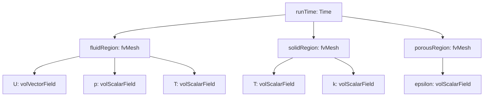
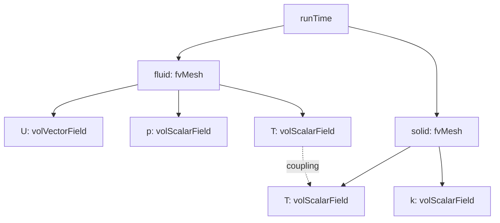

I'll refactor this OpenFOAM documentation file following the specified strategy. Let me analyze the current content and restructure it with enhanced learning objectives, practical debugging examples, common pitfalls, and memory management considerations.

```markdown
# Object Registry Architecture
## สถาปัตยกรรม Object Registry สำหรับ Multi-Region Simulation

---

## 🎯 Learning Objectives

After completing this section, you will be able to:

1. **Understand** the hierarchical structure of OpenFOAM's object registry system and its role in multi-region simulations
2. **Access** and manipulate fields across multiple computational regions using string-based lookup mechanisms
3. **Implement** cross-region data transfer in conjugate heat transfer and fluid-structure interaction applications
4. **Debug** common registry-related issues including lookup failures, null pointers, and const correctness violations
5. **Manage** memory efficiently when working with multi-region simulations using appropriate ownership models
6. **Apply** best practices for field registration, lifecycle management, and safe cross-region communication

---

## Overview

### What is the Object Registry?

The **Object Registry** is OpenFOAM's central storage mechanism that provides hierarchical access to computational meshes, fields, and boundary conditions. It acts as a database where all simulation objects are stored and can be retrieved by name.

**สถาปัตยกรรม** Object Registry เป็นระบบจัดเก็บข้อมูลแบบลำดับชั้น (hierarchical) ที่ใช้ string-based lookup เพื่อเข้าถึง meshes, fields, และ boundary conditions ใน multi-region simulations

### Why Do We Need It?

**Multi-region simulations** (conjugate heat transfer, fluid-structure interaction, combustion in porous media) require:
- **Separate meshes** for different physical domains (fluid/solid, fluid/structure)
- **Cross-region communication** for boundary condition coupling
- **Centralized object management** to avoid memory leaks and dangling references

**ความสำคัญ**: 
- แยก meshes สำหรับ domains ทางฟิสิกส์ที่ต่างกัน (fluid/solid)
- สื่อสารข้าม regions สำหรับ boundary condition coupling
- จัดการ objects แบบรวมศูนย์เพื่อป้องกัน memory leaks

### How Does It Work?

The registry follows a **tree structure** where `runTime` (top-level) contains multiple region meshes, and each mesh contains its own fields (U, p, T, etc.). Objects are automatically registered when constructed and can be looked up by name at runtime.

**การทำงาน**: โครงสร้างแบบ tree ที่ `runTime` (ระดับบนสุด) บรรจุ meshes หลาย regions และแต่ละ mesh มี fields ของตัวเอง (U, p, T) โดย objects จะ register อัตโนมัติเมื่อสร้าง

---

## 1. Registry Hierarchy

### 1.1 Structure Overview



### 1.2 Registry Levels

| Level | Object Type | Description | Example |
|-------|------------|-------------|---------|
| **Top** | `Time` | Global database | `runTime` |
| **Region** | `fvMesh` | Computational mesh | `fluidMesh`, `solidMesh`, `porousMesh` |
| **Field** | `GeometricField` | Physics variables | `U`, `p`, `T`, `k`, `epsilon` |
| **Boundary** | `fvPatchField` | Boundary conditions | `fixedValueFvPatchField` |

### 1.3 Real-World Example



**ตัวอย่าง Conjugate Heat Transfer**: fluid และ solid regions แชร์ field T ที่ interface ผ่าน boundary condition coupling

---

## 2. Accessing Regions and Fields

### 2.1 Basic Region Access

#### What: การเข้าถึง regions ผ่านชื่อ

#### Why: ต้องการเข้าถึง meshes ต่างๆ ใน multi-region simulation

#### How:

```cpp
// Method 1: Direct lookup by region name
const fvMesh& fluidMesh = runTime.lookupObject<fvMesh>("fluidRegion");
const fvMesh& solidMesh = runTime.lookupObject<fvMesh>("solidRegion");

// Method 2: Using regionProperties dictionary (RECOMMENDED)
regionProperties rp(runTime);
const wordList& fluidNames = rp.fluidRegionNames();
const wordList& solidNames = rp.solidRegionNames();

// Access first fluid region
const fvMesh& firstFluid = runTime.lookupObject<fvMesh>(fluidNames[0]);

// Method 3: Iterate through all regions
forAll(fluidNames, i)
{
    const fvMesh& mesh = runTime.lookupObject<fvMesh>(fluidNames[i]);
    Info<< "Fluid region " << i << " has " 
        << mesh.nCells() << " cells" << endl;
}
```

**ข้อแนะนำ**: ใช้ `regionProperties` dictionary เพื่อความยืดหยุ่นและรองรับการเพิ่ม regions ในอนาคต

### 2.2 Field Access Within Region

#### What: การเข้าถึง fields ภายใน region ที่ระบุ

#### Why: ต้องการอ่านหรือแก้ไขค่า field (U, p, T, etc.) ใน region

#### How:

```cpp
// Get field from specific region (READ-ONLY)
const volScalarField& Tfluid = fluidMesh.lookupObject<volScalarField>("T");
const volScalarField& Tsolid = solidMesh.lookupObject<volScalarField>("T");

// Get field for modification (READ-WRITE)
volScalarField& T = fluidMesh.lookupObjectRef<volScalarField>("T");

// Check if field exists before lookup (SAFE PRACTICE)
if (fluidMesh.foundObject<volScalarField>("T"))
{
    const volScalarField& T = fluidMesh.lookupObject<volScalarField>("T");
    Info<< "Max temperature: " << max(T).value() << endl;
}
else
{
    WarningIn("functionName")
        << "Field T not found in fluid region" << nl
        << "Available fields: " << fluidMesh.sortedToc() << endl;
}

// Optional field access (returns NULL if not found)
const volScalarField* pT = fluidMesh.findObject<volScalarField>("T");
if (pT)
{
    // Field exists, safe to use
    Info<< "Temperature found" << endl;
}
```

### 2.3 Comparison Table

| Method | Use Case | Returns | Safety |
|--------|----------|---------|--------|
| `lookupObject<T>(name)` | Required field, read-only | `const T&` | Throws if not found |
| `lookupObjectRef<T>(name)` | Required field, read-write | `T&` | Throws if not found |
| `foundObject<T>(name)` | Check existence | `bool` | Always safe |
| `findObject<T>(name)` | Optional field | `T*` or `nullptr` | Always safe |

---

## 3. Cross-Region Data Transfer

### 3.1 Mapped Boundary Conditions

#### What: การส่งข้อมูลระหว่าง regions ผ่าน boundary conditions

#### Why: จำเป็นต้องแลกเปลี่ยนข้อมูลที่ interfaces (เช่น heat flux ระหว่าง fluid และ solid)

#### How:

```cpp
// In custom mapped boundary condition
const fvMesh& nbrMesh = patch().boundaryMesh().mesh()
    .time().lookupObject<fvMesh>(nbrRegionName_);

const volScalarField& nbrField =
    nbrMesh.lookupObject<volScalarField>(nbrFieldName_);

// Access neighbor patch
const label nbrPatchID = nbrMesh.boundaryMesh().findPatchID(nbrPatchName_);
const fvPatchScalarField& nbrPatchField = 
    nbrField.boundaryField()[nbrPatchID];

// Example: Extract values from neighbor patch
scalarField nbrValues = nbrPatchField.patchInternalField();

// Apply coupling logic
this->operator==(nbrValues);
```

### 3.2 Direct Field Access (Advanced)

#### What: การเข้าถึง fields ข้าม regions โดยตรง

#### Why: ใช้ใน solvers ที่ต้องการแก้ไข fields ระหว่าง regions

#### How:

```cpp
// In solver: transfer heat flux between regions
const fvMesh& solidMesh = runTime.lookupObject<fvMesh>("solid");
const volScalarField& solidT = solidMesh.lookupObject<volScalarField>("T");

const fvMesh& fluidMesh = runTime.lookupObject<fvMesh>("fluid");
volScalarField& fluidT = fluidMesh.lookupObjectRef<volScalarField>("T");

// Apply coupling at interface
const fvPatchScalarField& solidPatchT = 
    solidT.boundaryField()[solidPatchID];
const fvPatchScalarField& fluidPatchT = 
    fluidT.boundaryField()[fluidPatchID];

// Example: Set fluid temperature equal to solid at interface
fluidT.boundaryFieldRef()[fluidPatchID] == solidPatchT;
```

### 3.3 Practical Example: Conjugate Heat Transfer

```cpp
// Complete CHT coupling example
void coupleFluidSolidRegions(
    const fvMesh& fluidMesh,
    const fvMesh& solidMesh,
    label fluidPatchID,
    label solidPatchID
)
{
    // Get temperature fields
    volScalarField& fluidT = fluidMesh.lookupObjectRef<volScalarField>("T");
    const volScalarField& solidT = solidMesh.lookupObject<volScalarField>("T");
    
    // Get boundary patches
    fvPatchScalarField& fluidPatch = fluidT.boundaryFieldRef()[fluidPatchID];
    const fvPatchScalarField& solidPatch = solidT.boundaryField()[solidPatchID];
    
    // Transfer temperature values
    scalarField solidPatchValues = solidPatch.patchInternalField();
    
    // Apply to fluid boundary
    fluidPatch == solidPatchValues;
    
    Info<< "Coupled fluid-solid interface: "
        << "T_fluid_interface = " << average(fluidPatch)
        << ", T_solid_interface = " << average(solidPatch) << endl;
}
```

---

## 4. Multi-Region Solver Loop Pattern

### 4.1 Standard Multi-Region Loop

#### What: โครงสร้าง main loop สำหรับ multi-region solvers

#### Why: ต้องการ solve หลาย regions และดำเนินการ coupling ระหว่าง iterations

#### How:

```cpp
// Typical multi-region solver structure
#include "regionProperties.H"

// Create region properties
regionProperties rp(runTime);
const wordList& fluidNames = rp.fluidRegionNames();
const wordList& solidNames = rp.solidRegionNames();

// Initialize mesh lists
PtrList<fvMesh> fluidRegions(fluidNames.size());
PtrList<fvMesh> solidRegions(solidNames.size());

// Initialize meshes
forAll(fluidNames, i)
{
    Info<< "Creating fluid mesh " << fluidNames[i] << endl;
    fluidRegions.set
    (
        i,
        new fvMesh
        (
            IOobject
            (
                fluidNames[i],
                runTime.timeName(),
                runTime,
                IOobject::MUST_READ
            )
        )
    );
}

forAll(solidNames, i)
{
    Info<< "Creating solid mesh " << solidNames[i] << endl;
    solidRegions.set
    (
        i,
        new fvMesh
        (
            IOobject
            (
                solidNames[i],
                runTime.timeName(),
                runTime,
                IOobject::MUST_READ
            )
        )
    );
}

// Main time loop
while (runTime.run())
{
    runTime++;
    Info<< "Time = " << runTime.timeName() << nl << endl;
    
    // Solve fluid regions
    forAll(fluidRegions, i)
    {
        fvMesh& mesh = fluidRegions[i];
        // Solve fluid equations for this region
        solveFluid(mesh);
    }
    
    // Solve solid regions
    forAll(solidRegions, i)
    {
        fvMesh& mesh = solidRegions[i];
        // Solve solid equations for this region
        solveSolid(mesh);
    }
    
    // Coupling iteration
    for (int couplingIter = 0; couplingIter < nCouplingIters; couplingIter++)
    {
        // Update boundary conditions between regions
        updateCoupling(fluidRegions, solidRegions);
    }
    
    runTime.write();
}
```

### 4.2 Advanced Pattern with Sub-Iteration

```cpp
// Advanced loop with implicit coupling
while (runTime.run())
{
    runTime++;
    
    // Outer coupling iteration
    for (int outerIter = 0; outerIter < nOuterIters; outerIter++)
    {
        // Solve fluid regions
        forAll(fluidRegions, i)
        {
            solveFluid(fluidRegions[i]);
        }
        
        // Solve solid regions
        forAll(solidRegions, i)
        {
            solveSolid(solidRegions[i]);
        }
        
        // Check convergence
        scalar couplingResidual = computeCouplingResidual();
        
        if (couplingResidual < couplingTolerance)
        {
            Info<< "Coupling converged in " << outerIter + 1 
                << " iterations" << endl;
            break;
        }
    }
    
    runTime.write();
}
```

---

## 5. Field Registration and Lifecycle

### 5.1 Automatic Registration

#### What: Fields ลงทะเบียนอัตโนมัติเมื่อสร้าง

#### Why: ทำให้เข้าถึงได้ทันทีผ่าน registry

#### How:

```cpp
// Fields automatically register with their mesh upon construction
volScalarField T
(
    IOobject
    (
        "T",
        runTime.timeName(),
        mesh,
        IOobject::MUST_READ,    // Read from file
        IOobject::AUTO_WRITE    // Write automatically
    ),
    mesh
);
// T is now in mesh's object registry and can be looked up by name

// Create temporary field (not registered to file)
volVectorField UTemp
(
    IOobject
    (
        "UTemp",
        runTime.timeName(),
        mesh,
        IOobject::NO_READ,
        IOobject::NO_WRITE      // Temporary field
    ),
    mesh,
    dimensionedVector("zero", dimVelocity, Zero)
);
// UTemp is in registry but won't be written to disk
```

### 5.2 Manual Registration (Advanced)

#### What: การลงทะเบียน objects ด้วยตนเอง

#### Why: ใช้สำหรับ dynamic objects ที่สร้างระหว่าง runtime

#### How:

```cpp
// Create and manually register object
autoPtr<volScalarField> pT
(
    new volScalarField
    (
        IOobject
        (
            "T_custom",
            runTime.timeName(),
            mesh,
            IOobject::NO_READ,
            IOobject::AUTO_WRITE
        ),
        mesh,
        dimensionedScalar("Tinit", dimTemperature, 300.0)
    )
);

// Transfer ownership to registry
mesh.objectRegistry::store(pT.ptr());

// Field is now accessible via lookup
const volScalarField& Tcustom = mesh.lookupObject<volScalarField>("T_custom");
```

### 5.3 Object Removal and Memory Management

#### What: การจัดการ memory และการลบ objects

#### Why: ป้องกัน memory leaks และ dangling references

#### How:

```cpp
// Check object existence
if (mesh.foundObject<volScalarField>("tempField"))
{
    // Get reference (not owned)
    volScalarField& T = mesh.lookupObjectRef<volScalarField>("tempField");
    
    // When T goes out of scope, object remains in registry
    // To remove permanently:
    mesh.objectRegistry::checkOut("tempField");
}

// PtrList automatically manages memory
PtrList<volScalarField> fields(3);
fields.set(0, new volScalarField(...));
fields.set(1, new volScalarField(...));
fields.set(2, new volScalarField(...));

// When fields is destroyed, all objects are automatically deleted
```

---

## 6. Common Pitfalls and Solutions

### 6.1 Pitfall 1: Lookup Failure

#### What: การค้นหา field ที่ไม่มีอยู่จริง

#### Why: ชื่อผิด, field ยังไม่ถูกสร้าง, หรืออยู่ใน region อื่น

#### Solution:

```cpp
// ❌ WRONG: No error checking
const volScalarField& T = mesh.lookupObject<volScalarField>("temperatrue");  // Typo!

// ✅ CORRECT: Check existence first
if (mesh.foundObject<volScalarField>("T"))
{
    const volScalarField& T = mesh.lookupObject<volScalarField>("T");
}
else
{
    FatalErrorIn("myFunction")
        << "Field 'T' not found in mesh registry." << nl
        << "Available fields: " << mesh.sortedToc() << nl
        << "Check field name and region." << endl
        << exit(FatalError);
}

// ✅ BETTER: Helper function for robust lookup
template<class T>
const T& lookupFieldOrFail(const objectRegistry& registry, const word& name)
{
    if (!registry.foundObject<T>(name))
    {
        FatalErrorIn("lookupFieldOrFail")
            << "Field '" << name << "' not found." << nl
            << "Available fields: " << registry.sortedToc() << nl
            << exit(FatalError);
    }
    return registry.lookupObject<T>(name);
}
```

### 6.2 Pitfall 2: Const Correctness Violation

#### What: พยายามแก้ไข field ผ่าน const reference

#### Why: ใช้ `lookupObject<T>()` แทน `lookupObjectRef<T>()`

#### Solution:

```cpp
// ❌ WRONG: Trying to modify const reference
const volScalarField& T = mesh.lookupObject<volScalarField>("T");
T *= 1.1;  // Compilation error!

// ✅ CORRECT: Use lookupObjectRef for modification
volScalarField& T = mesh.lookupObjectRef<volScalarField>("T");
T *= 1.1;  // OK

// ✅ BEST: Explicit const/non-const overloads
// For reading (const)
void printMaxTemperature(const fvMesh& mesh)
{
    const volScalarField& T = mesh.lookupObject<volScalarField>("T");
    Info<< "Max T = " << max(T).value() << endl;
}

// For writing (non-const)
void scaleTemperature(fvMesh& mesh, scalar factor)
{
    volScalarField& T = mesh.lookupObjectRef<volScalarField>("T");
    T *= factor;
}
```

### 6.3 Pitfall 3: Wrong Region Access

#### What: ค้นหา field ใน region ที่ผิด

#### Why: ไม่ตรวจสอบว่า field มีอยู่จริงใน region นั้น

#### Solution:

```cpp
// ❌ WRONG: Assuming field exists in all regions
const fvMesh& solidMesh = runTime.lookupObject<fvMesh>("solid");
const volScalarField& U = solidMesh.lookupObject<volScalarField>("U");  // Fails! U is in fluid

// ✅ CORRECT: Verify region physics
const fvMesh& solidMesh = runTime.lookupObject<fvMesh>("solid");
if (!solidMesh.foundObject<volVectorField>("U"))
{
    Info<< "Velocity field not in solid region (expected)" << nl
        << "This is a solid domain." << endl;
}

// ✅ BETTER: Use regionProperties to understand physics
regionProperties rp(runTime);
const wordList& solidNames = rp.solidRegionNames();

forAll(solidNames, i)
{
    const fvMesh& solidMesh = runTime.lookupObject<fvMesh>(solidNames[i]);
    
    // Solid regions typically have T but not U, p
    if (solidMesh.foundObject<volScalarField>("T"))
    {
        const volScalarField& T = solidMesh.lookupObject<volScalarField>("T");
        // Process temperature
    }
}
```

### 6.4 Pitfall 4: Memory Leaks from Raw Pointers

#### What: Memory leak จากการใช้ raw pointers

#### Why: ไม่ลบ objects ที่สร้างด้วย `new`

#### Solution:

```cpp
// ❌ WRONG: Raw pointer without proper deletion
volScalarField* pT = new volScalarField(...);
// If exception occurs before delete, memory leaks!

// ✅ CORRECT: Use autoPtr for automatic cleanup
autoPtr<volScalarField> pT(new volScalarField(...));
// When pT goes out of scope, object is automatically deleted

// ✅ BETTER: Transfer to registry for ownership
autoPtr<volScalarField> pT(new volScalarField(...));
mesh.objectRegistry::store(pT.ptr());  // Registry now owns it

// ✅ BEST: Use PtrList for collections
PtrList<volScalarField> fields(5);
fields.set(0, new volScalarField(...));  // PtrList owns it
fields.set(1, new volScalarField(...));
// All objects deleted when fields is destroyed
```

### 6.5 Pitfall 5: Stale References After Mesh Changes

#### What: References ใช้ไม่ได้หลังจาก mesh เปลี่ยน

#### Why: Mesh topology changes invalidate field references

#### Solution:

```cpp
// ❌ WRONG: Store reference across mesh modification
const volScalarField& T = mesh.lookupObject<volScalarField>("T");
mesh.topoChange();  // Mesh changes
Info<< max(T).value();  // UNDEFINED BEHAVIOR!

// ✅ CORRECT: Re-lookup after mesh changes
const volScalarField& T = mesh.lookupObject<volScalarField>("T");
Info<< "Before: " << max(T).value() << endl;

mesh.topoChange();  // Mesh changes

// Re-lookup to get valid reference
const volScalarField& Tnew = mesh.lookupObject<volScalarField>("T");
Info<< "After: " << max(Tnew).value() << endl;
```

---

## 7. Debugging Helper Functions

### 7.1 Registry Inspector

#### What: Utility functions สำหรับตรวจสอบ registry

#### Why: ช่วย debug และ understand registry contents

#### How:

```cpp
// Utility function to print registry contents
void printRegistryContents(const objectRegistry& registry, const word& name)
{
    Info<< "\n=== Registry: " << name << " ===" << endl;
    Info<< "Total objects: " << registry.size() << nl << endl;
    
    const wordList& objNames = registry.sortedToc();
    Info<< "Object list: " << objNames << nl << endl;
    
    forAll(objNames, i)
    {
        const word& objName = objNames[i];
        if (registry.foundObject<regIOobject>(objName))
        {
            const regIOobject& obj = registry.lookupObject<regIOobject>(objName);
            Info<< "  " << objName << " : " << obj.type() << endl;
        }
    }
    Info<< endl;
}

// Usage examples
printRegistryContents(runTime, "runTime");
printRegistryContents(fluidMesh, "fluidMesh");
printRegistryContents(solidMesh, "solidMesh");
```

### 7.2 Field Finder Utility

```cpp
// Find and print field details
template<class Type>
void findFieldDetails(const fvMesh& mesh, const word& fieldName)
{
    if (mesh.foundObject<Type>(fieldName))
    {
        const Type& field = mesh.lookupObject<Type>(fieldName);
        
        Info<< "Field: " << fieldName << nl
            << "  Type: " << field.type() << nl
            << "  Dimensions: " << field.dimensions() << nl
            << "  Size: " << field.size() << nl
            << "  Min: " << min(field).value() << nl
            << "  Max: " << max(field).value() << nl
            << "  Avg: " << average(field).value() << endl;
    }
    else
    {
        Info<< "Field '" << fieldName << "' not found." << nl
            << "Available fields: " << mesh.sortedToc() << endl;
    }
}

// Usage
findFieldDetails<volScalarField>(mesh, "T");
findFieldDetails<volVectorField>(mesh, "U");
```

### 7.3 Cross-Region Validator

```cpp
// Validate cross-region coupling setup
bool validateCrossRegionSetup(
    const Time& runTime,
    const word& region1,
    const word& region2,
    const word& fieldName
)
{
    Info<< "Validating cross-region setup..." << endl;
    
    // Check regions exist
    if (!runTime.foundObject<fvMesh>(region1))
    {
        FatalError << "Region '" << region1 << "' not found." << exit(FatalError);
        return false;
    }
    
    if (!runTime.foundObject<fvMesh>(region2))
    {
        FatalError << "Region '" << region2 << "' not found." << exit(FatalError);
        return false;
    }
    
    // Get meshes
    const fvMesh& mesh1 = runTime.lookupObject<fvMesh>(region1);
    const fvMesh& mesh2 = runTime.lookupObject<fvMesh>(region2);
    
    // Check field exists in both regions
    if (!mesh1.foundObject<volScalarField>(fieldName))
    {
        Warning << "Field '" << fieldName << "' not in region '" << region1 << "'";
        return false;
    }
    
    if (!mesh2.foundObject<volScalarField>(fieldName))
    {
        Warning << "Field '" << fieldName << "' not in region '" << region2 << "'";
        return false;
    }
    
    Info<< "✓ Cross-region setup valid" << endl;
    return true;
}

// Usage
validateCrossRegionSetup(runTime, "fluid", "solid", "T");
```

---

## 8. Memory Management Considerations

### 8.1 Ownership Models

#### What: รูปแบบการครอบครอง objects ใน registry

#### Why: สำคัญต่อการป้องกัน memory leaks และ dangling pointers

#### How:

| Model | Description | Ownership | Lifetime | Use Case |
|-------|------------|-----------|----------|----------|
| **Reference** | `const T& obj = lookupObject<T>(name)` | Registry owns | Until removed | Standard access |
| **Pointer** | `const T* ptr = findObject<T>(name)` | Registry owns | Until removed | Optional fields |
| **autoPtr** | `autoPtr<T> ptr(new T(...))` | Transfers to registry | Until deleted | Dynamic creation |
| **PtrList** | `PtrList<T> list(n)` | PtrList owns | Until list destroyed | Collections |

### 8.2 Ownership Examples

```cpp
// Model 1: Reference (not owned) - Most common
const volScalarField& T = mesh.lookupObject<volScalarField>("T");
// Registry owns T; reference becomes invalid if T is removed

// Model 2: Pointer (not owned) - For optional fields
const volScalarField* pT = mesh.findObject<volScalarField>("T");
if (pT) { /* use */ }
// Still not owned; pointer becomes dangling if T is removed

// Model 3: autoPtr (owns) - For dynamic creation
autoPtr<volScalarField> pT
(
    new volScalarField
    (
        IOobject("T_custom", runTime.timeName(), mesh, ...),
        mesh
    )
);
mesh.objectRegistry::store(pT.ptr());
// Ownership transferred to registry; pT is now NULL

// Model 4: PtrList (owns) - For collections
PtrList<volScalarField> fields(5);
fields.set(0, new volScalarField(...));
fields.set(1, new volScalarField(...));
// PtrList owns all objects; destroyed automatically
```

### 8.3 Best Practices

#### ✅ DO:

```cpp
// 1. Use lookupObject for standard access
const volScalarField& T = mesh.lookupObject<volScalarField>("T");

// 2. Use lookupObjectRef for modification
volScalarField& T = mesh.lookupObjectRef<volScalarField>("T");
T *= 1.1;

// 3. Use foundObject before optional lookups
if (mesh.foundObject<volScalarField>("T")) { /* safe access */ }

// 4. Use PtrList for dynamic object arrays
PtrList<volScalarField> fields(3);
fields.set(0, new volScalarField(...));

// 5. Call checkOut when manually removing objects
mesh.objectRegistry::checkOut("tempField");

// 6. Use autoPtr for temporary objects
autoPtr<volScalarField> pT(new volScalarField(...));
// Transfer to registry when needed
mesh.objectRegistry::store(pT.ptr());
```

#### ❌ DON'T:

```cpp
// 1. Store raw pointers beyond lifetime
const volScalarField* pT = &mesh.lookupObject<volScalarField>("T");
// Dangling if mesh changes or T removed

// 2. Delete objects from lookupObject
const volScalarField& T = mesh.lookupObject<volScalarField>("T");
delete &T;  // CRASH! Registry owns it

// 3. Assume field exists without checking
const volScalarField& T = mesh.lookupObject<volScalarField>("T");
// Throws if T doesn't exist

// 4. Use new without autoPtr or PtrList
volScalarField* pT = new volScalarField(...);
// Memory leak if exception before delete

// 5. Mix const/non-const incorrectly
const volScalarField& T = mesh.lookupObject<volScalarField>("T");
T *= 1.1;  // Compilation error
```

---

## 9. Quick Reference

### 9.1 Common Operations

| Operation | Code Snippet | Description |
|-----------|--------------|-------------|
| **Get mesh by name** | `runTime.lookupObject<fvMesh>("regionName")` | Access region mesh |
| **Get field (read)** | `mesh.lookupObject<volScalarField>("T")` | Read-only access |
| **Get field (write)** | `mesh.lookupObjectRef<volScalarField>("T")` | Read-write access |
| **Check field exists** | `mesh.foundObject<volScalarField>("T")` | Boolean check |
| **Find field (optional)** | `mesh.findObject<volScalarField>("T")` | Returns NULL if not found |
| **List all objects** | `mesh.sortedToc()` | Get all object names |
| **Get region names** | `regionProperties(runTime).fluidRegionNames()` | List fluid regions |
| **Register object** | `mesh.store(autoPtr<T>.ptr())` | Manual registration |
| **Remove object** | `mesh.checkOut("fieldName")` | Manual removal |

### 9.2 Error Handling Pattern

```cpp
// Standard error handling pattern
template<class Type>
const Type& safeLookup(const objectRegistry& reg, const word& name)
{
    if (!reg.foundObject<Type>(name))
    {
        FatalErrorIn("safeLookup")
            << "Object '" << name << "' not found in registry." << nl
            << "Available objects: " << reg.sortedToc() << nl
            << exit(FatalError);
    }
    return reg.lookupObject<Type>(name);
}
```

---

## 🎯 Key Takeaways

### Core Concepts

1. **Hierarchical Storage**: `runTime` → regions → fields → boundary conditions
   - **ระดับชั้น**: Time (global) → fvMesh (region) → GeometricField (field)

2. **String-Based Lookup**: All objects accessed by name via `lookupObject<T>(name)`
   - **ค้นหาด้วยชื่อ**: ใช้ string names ในการ lookup

3. **Automatic Registration**: Fields register automatically when constructed with mesh reference
   - **ลงทะเบียนอัตโนมัติ**: Fields ถูกเพิ่มเมื่อสร้าง

4. **Cross-Region Access**: Navigate hierarchy: `runTime.lookupObject<fvMesh>(regionName).lookupObject<T>(fieldName)`
   - **เข้าถึงข้าม regions**: ดำเนินการผ่าน mesh references

### Practical Wisdom

- **Always check existence** with `foundObject()` before critical lookups
  - **ตรวจสอบก่อน**: ใช้ `foundObject()` เพื่อป้องกัน errors

- **Use const correctness**: `lookupObject<T>()` for reading, `lookupObjectRef<T>()` for writing
  - **const correctness**: แยก read/write access ชัดเจน

- **Validate region names** via `regionProperties` dictionary
  - **ตรวจสอบ region**: ใช้ `regionProperties` เพื่อยืนยัน

- **Debug with `sortedToc()`** to print available objects
  - **ดู objects**: ใช้ `sortedToc()` สำหรับ debugging

- **Memory safety**: Registry owns objects; don't manually delete looked-up objects
  - **ความปลอดภัย**: Registry เป็นเจ้าของ objects

### When to Use What

| Scenario | Approach | รูปแบบ |
|----------|----------|---------|
| Standard field access | `mesh.lookupObject<T>("name")` | การเข้าถึงปกติ |
| Field modification | `mesh.lookupObjectRef<T>("name")` | การแก้ไข field |
| Optional field | `mesh.findObject<T>("name")` + null check | Field ที่อาจไม่มี |
| Dynamic objects | `autoPtr<T>` + `registry.store()` | Objects แบบ dynamic |
| Object collections | `PtrList<T>` for automatic memory management | หลาย objects |

---

## 🧠 Concept Check

<details>
<summary><b>1. Registry ทำหน้าที่อะไรใน OpenFOAM?</b></summary>

**Centralized storage and retrieval** of simulation objects (meshes, fields, boundary conditions) by name across multiple computational regions.

**คำตอบ**: เป็นระบบจัดเก็บและค้นหา objects แบบรวมศูนย์ ใช้ชื่อในการเข้าถึง meshes, fields, และ boundary conditions ใน multi-region simulations

</details>

<details>
<summary><b>2. เขียน code เพื่อตรวจสอบว่า field 'T' มีอยู่ใน region หรือไม่?</b></summary>

```cpp
if (mesh.foundObject<volScalarField>("T"))
{
    const volScalarField& T = mesh.lookupObject<volScalarField>("T");
    // Use T safely
}
else
{
    Warning << "Field T not found" << endl;
}
```

**คำตอบ**: ใช้ `foundObject<T>()` เพื่อตรวจสอบ จากนั้นใช้ `lookupObject<T>()` เมื่อมั่นใจว่ามีอยู่

</details>

<details>
<summary><b>3. Cross-region access ทำอย่างไร?</b></summary>

**Get target mesh by name**, then lookup field from that mesh:

```cpp
// Step 1: Get neighbor mesh
const fvMesh& nbrMesh = runTime.lookupObject<fvMesh>("neighborRegion");

// Step 2: Get field from neighbor
const volScalarField& nbrT = nbrMesh.lookupObject<volScalarField>("T");

// Step 3: Access boundary patch if needed
label nbrPatchID = nbrMesh.boundaryMesh().findPatchID("patchName");
const fvPatchScalarField& nbrPatch = nbrT.boundaryField()[nbrPatchID];
```

**คำตอบ**: เข้าถึง mesh ปลายทางผ่าน `runTime.lookupObject<fvMesh>()` จากนั้น lookup field จาก mesh นั้น

</details>

<details>
<summary><b>4. Field สามารถ register เองได้หรือไม่?</b></summary>

**ใช่** — Fields auto-register via IOobject constructor with mesh reference:

```cpp
// Automatic registration
volScalarField T
(
    IOobject("T", runTime.timeName(), mesh, ...),
    mesh
);
// T is automatically registered

// Manual registration for dynamic objects
autoPtr<volScalarField> pT(new volScalarField(...));
mesh.objectRegistry::store(pT.ptr());
```

**คำตอบ**: Fields ลงทะเบียนอัตโนมัติเมื่อสร้าง หรือสามารถลงทะเบียนเองด้วย `registry.store()`

</details>

<details>
<summary><b>5. แก้ปัญหา segmentation fault จาก lookup failure อย่างไร?</b></summary>

**Always validate existence** before lookup:

```cpp
// Solution 1: Check with foundObject
if (!mesh.foundObject<volScalarField>("fieldName"))
{
    FatalError << "Field not found. Available: " 
               << mesh.sortedToc() << exit(FatalError);
}
const volScalarField& field = mesh.lookupObject<volScalarField>("fieldName");

// Solution 2: Use helper function
template<class T>
const T& lookupOrFail(const objectRegistry& reg, const word& name)
{
    if (!reg.foundObject<T>(name))
    {
        FatalError << "Object '" << name << "' not found. Available: "
                   << reg.sortedToc() << exit(FatalError);
    }
    return reg.lookupObject<T>(name);
}
```

**คำตอบ**: ตรวจสอบ existence ด้วย `foundObject()` หรือใช้ helper function ที่มี error handling

</details>

<details>
<summary><b>6. lookupObject และ lookupObjectRef ต่างกันอย่างไร?</b></summary>

**lookupObject<T>()** returns `const T&` (read-only):
```cpp
const volScalarField& T = mesh.lookupObject<volScalarField>("T");
Info<< max(T).value();  // OK: reading
T *= 1.1;               // ERROR: cannot modify
```

**lookupObjectRef<T>()** returns `T&` (read-write):
```cpp
volScalarField& T = mesh.lookupObjectRef<volScalarField>("T");
T *= 1.1;  // OK: modifying
```

**คำตอบ**: `lookupObject` สำหรับอ่าน (const) `lookupObjectRef` สำหรับอ่านและแก้ไข (non-const)

</details>

---

## 📖 Related Documentation

- **Overview**: [00_Overview.md](00_Overview.md) — Coupled physics architecture overview
- **Fundamentals**: [01_Coupled_Physics_Fundamentals.md](01_Coupled_Physics_Fundamentals.md) — Theory of multi-physics coupling
- **Implementation**: [02_Conjugate_Heat_Transfer.md](02_Conjugate_Heat_Transfer.md) — CHT solver details and examples
- **Advanced**: [03_Fluid_Structure_Interaction.md](03_Fluid_Structure_Interaction.md) — FSI implementation patterns
- **Validation**: [06_Validation_and_Best_Practices.md](06_Validation_and_Best_Practices.md) — Testing strategies
- **Exercises**: [07_Hands_On_Exercises.md](07_Hands_On_Exercises.md) — Practical tutorials
```