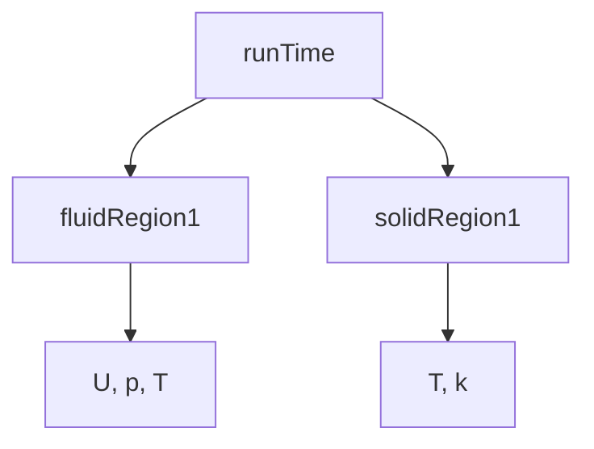

# Object Registry Architecture

สถาปัตยกรรม Object Registry สำหรับ Multi-Region

---

## Overview

> **Object Registry** = Central storage for accessing fields across regions

---

## 1. Registry Hierarchy



---

## 2. Accessing Regions

```cpp
// Get mesh by name
const fvMesh& fluidMesh = runTime.lookupObject<fvMesh>("fluid");
const fvMesh& solidMesh = runTime.lookupObject<fvMesh>("solid");

// Get field from specific region
const volScalarField& Tfluid = fluidMesh.lookupObject<volScalarField>("T");
const volScalarField& Tsolid = solidMesh.lookupObject<volScalarField>("T");
```

---

## 3. Cross-Region Access

```cpp
// In mapped boundary condition
const fvMesh& nbrMesh = patch().boundaryMesh().mesh()
    .time().lookupObject<fvMesh>(nbrRegionName_);

const volScalarField& nbrField =
    nbrMesh.lookupObject<volScalarField>(nbrFieldName_);
```

---

## 4. Region List

```cpp
// Get all regions
wordList regionNames = runTime.sortedToc();

// Or from regionProperties
regionProperties rp(runTime);
const wordList& fluidNames = rp.fluidRegionNames();
const wordList& solidNames = rp.solidRegionNames();
```

---

## 5. Multi-Region Solver Loop

```cpp
// Process each fluid region
forAll(fluidRegions, i)
{
    fvMesh& mesh = fluidRegions[i];
    // Solve fluid equations
}

// Process each solid region
forAll(solidRegions, i)
{
    fvMesh& mesh = solidRegions[i];
    // Solve solid equations
}
```

---

## 6. Field Registration

```cpp
// Fields auto-register with their mesh
volScalarField T
(
    IOobject("T", ..., mesh),
    mesh
);
// T is now in mesh's registry
```

---

## Quick Reference

| Need | Code |
|------|------|
| Get mesh | `runTime.lookupObject<fvMesh>("name")` |
| Get field | `mesh.lookupObject<volScalarField>("T")` |
| Region list | `regionProperties(runTime)` |

---

## Concept Check

<details>
<summary><b>1. Registry ทำอะไร?</b></summary>

**Store and lookup objects** by name
</details>

<details>
<summary><b>2. Cross-region access ทำอย่างไร?</b></summary>

**Get mesh by name**, then lookup field from that mesh
</details>

<details>
<summary><b>3. Field register เอง?</b></summary>

**ใช่** — via IOobject with mesh reference
</details>

---

## Related Documents

- **ภาพรวม:** [00_Overview.md](00_Overview.md)
- **Advanced:** [05_Advanced_Coupling_Topics.md](05_Advanced_Coupling_Topics.md)
