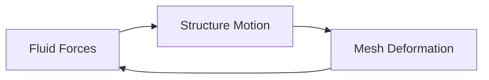

# Advanced Coupling Topics

หัวข้อขั้นสูงสำหรับ Coupled Physics

---

## Overview

> Advanced techniques สำหรับ complex coupled simulations

---

## 1. Fluid-Structure Interaction



```cpp
// Mesh motion
pointVectorField displacement = ...;
mesh.movePoints(mesh.points() + displacement);
```

---

## 2. Relaxation

```cpp
// Under-relaxation for stability
T = alpha * Tnew + (1 - alpha) * Told;

// Aitken relaxation
alpha = -alphaOld * (residualOld & deltaResidual)
      / (deltaResidual & deltaResidual);
```

---

## 3. Strong vs Weak Coupling

| Type | Description |
|------|-------------|
| **Weak** | Solve each physics once |
| **Strong** | Iterate until converged |

```cpp
// Strong coupling
do
{
    solveFluid();
    solveSolid();
    residual = computeResidual();
} while (residual > tolerance);
```

---

## 4. Time Stepping

```cpp
// Subcycling
for (int subCycle = 0; subCycle < nSubCycles; subCycle++)
{
    solveFluid(deltaT / nSubCycles);
}
solveSolid(deltaT);
```

---

## 5. Data Mapping

```cpp
// Map data between non-conformal meshes
meshToMesh mapper(srcMesh, tgtMesh);

mapper.mapSrcToTgt(srcField, tgtField);
```

---

## 6. Implicit Coupling

```cpp
// Implicit coupling via matrix manipulation
fvScalarMatrix TEqn
(
    fvm::ddt(T)
  - fvm::laplacian(alpha, T)
  ==
    fvm::Sp(heff, T)  // Implicit source from coupling
);
```

---

## Quick Reference

| Topic | Key |
|-------|-----|
| FSI | Mesh motion |
| Stability | Relaxation |
| Accuracy | Strong coupling |
| Performance | Subcycling |

---

## 🧠 Concept Check

<details>
<summary><b>1. Strong vs Weak coupling?</b></summary>

- **Weak**: One solve per timestep
- **Strong**: Iterate to convergence
</details>

<details>
<summary><b>2. Relaxation ทำไม?</b></summary>

**Prevent oscillations** in iterative coupling
</details>

<details>
<summary><b>3. Subcycling ใช้เมื่อไหร่?</b></summary>

เมื่อ physics มี **different time scales**
</details>

---

## 📖 เอกสารที่เกี่ยวข้อง

- **ภาพรวม:** [00_Overview.md](00_Overview.md)
- **Validation:** [06_Validation_and_Benchmarks.md](06_Validation_and_Benchmarks.md)
