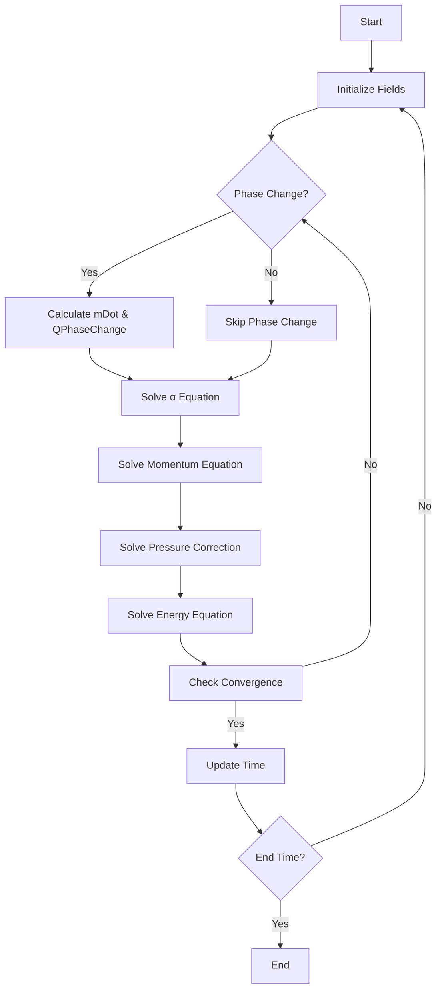

# Advanced Coupling Techniques

เทคนิคขั้นสูงสำหรับ Coupled Physics Simulations

---

## 🎯 Learning Objectives (เป้าหมายการเรียนรู้)

After completing this section, you should be able to:
- **Apply** advanced relaxation techniques (Aitken, IQN-ILS) for strong coupling stability (ปรับใช้เทคนิคการผ่อนคลายขั้นสูงเพื่อเสถียรภาพการคัปปลิงแบบเข้มข้น)
- **Implement** multi-rate time stepping and subcycling for different time scales (นำไปใช้ time stepping แบบหลายอัตราและ subcycling สำหรับมาตราส่วนเวลาที่แตกต่างกัน)
- **Optimize** coupled solver performance with advanced data mapping and parallelization (ปรับปรุงประสิทธิภาพ solver การคัปปลิงด้วย data mapping และการขนาน)
- **Design** implicit coupling strategies via matrix manipulation (ออกแบบกลยุทธ์การคัปปลิงแบบ implicit ผ่านการจัดการเมทริกซ์)
- **Select** appropriate acceleration methods for different coupling regimes (เลือกวิธีเร่งความเร็วที่เหมาะสมสำหรับรูปแบบการคัปปลิงที่แตกต่างกัน)

> **ทฤษฎีพื้นฐาน:** สำหรับรากฐานทางทฤษฎีของ weak/strong coupling และสมการ interface โปรดดู [01_Coupled_Physics_Fundamentals.md](01_Coupled_Physics_Fundamentals.md)
> **การประยุกต์ใช้ FSI:** สำหรับรายละเอียด FSI โปรดดู [03_Fluid_Structure_Interaction.md](03_Fluid_Structure_Interaction.md)

---

## Overview

> **Advanced Coupling Techniques** = Sophisticated methods for stability, accuracy, and performance in complex multi-physics simulations

This file covers **advanced-only topics**:
- **Stability acceleration**: Aitken relaxation, Interface Quasi-Newton (IQN) methods
- **Time-scale handling**: Subcycling, multi-rate time stepping
- **Performance optimization**: Data mapping strategies, parallel coupling
- **Implicit coupling**: Matrix-based monolithic approaches

---

## 1. WHAT: Advanced Relaxation Techniques (สิ่งที่ เทคนิคการผ่อนคลายขั้นสูง)

### 1.1 Why Advanced Relaxation? (ทำไมต้องการเทคนิคขั้นสูง?)

**Problem with Fixed Relaxation:**
- Fixed under-relaxation factor (ω = 0.5-0.9) may be **too conservative** → slow convergence
- May be **too aggressive** → divergence and instability
- **Cannot adapt** to changing coupling strength during simulation

**Solution:** Dynamic relaxation methods that **automatically adjust** based on convergence behavior

### 1.2 Aitken Dynamic Relaxation (การผ่อนคลายแบบ Aitken)

**Mathematical Formulation:**

$$\omega^{n+1} = \omega^n \frac{(\mathbf{r}^{n-1})^T(\mathbf{r}^{n-1} - \mathbf{r}^n)}{(\mathbf{r}^{n-1} - \mathbf{r}^n)^T(\mathbf{r}^{n-1} - \mathbf{r}^n)}$$

**Variables:**
- $\omega$: Dynamic relaxation factor (ปัจจัยการผ่อนคลายแบบไดนามิก)
- $\mathbf{r}^n = \mathbf{d}^n - \mathbf{d}^{n-1}$: Residual between iterations (ค่าตกค้างระหว่างการวนซ้ำ)

**Algorithm:**
```cpp
// Aitken relaxation for interface displacement
scalar omega = 0.8;  // Initial relaxation factor
vectorField dOld = displacement;
vectorField rOld = vectorField::zero();

for (int iter = 0; iter < maxIter; iter++)
{
    // Solve coupled physics
    solveFluid();
    solveSolid();
    
    // Calculate new displacement
    vectorField dNew = calculateDisplacement();
    
    // Calculate residual
    vectorField r = dNew - dOld;
    
    // Update Aitken factor (after first iteration)
    if (iter > 0)
    {
        scalar numerator = sum(rOld & (rOld - r));
        scalar denominator = sum((rOld - r) & (rOld - r));
        
        if (mag(denominator) > SMALL)
        {
            omega = omega * numerator / denominator;
        }
        
        // Clamp to reasonable range
        omega = max(0.1, min(0.9, omega));
    }
    
    // Apply relaxation
    displacement = dOld + omega * r;
    
    // Store for next iteration
    dOld = displacement;
    rOld = r;
}
```

**When to Use Aitken Relaxation:**

| Situation | Recommended ω Range | Reason |
|-----------|-------------------|---------|
| **Mild coupling** (ρ_f/ρ_s < 0.01) | 0.85 - 0.95 | Fast convergence |
| **Moderate coupling** (0.01 < ρ_f/ρ_s < 0.1) | 0.6 - 0.8 | Balance stability/speed |
| **Strong coupling** (ρ_f/ρ_s > 0.1) | 0.3 - 0.6 | Stability critical |

> [!TIP] **มุมมองเปรียบเทียบ: นักขับรถประจำ (The Seasoned Driver)**
> การผ่อนคลายแบบ Aitken เหมือนนักขับรถประจำที่:
> - **รู้จักถนน** (ดูประวัติการเคลื่อนที่ครั้งก่อน)
> - **ปรับความเร็วอัตโนมัติ** (คำนวณ ω ใหม่ทุกรอบ)
> - **เบรกอย่างชาญฉลาด** (ลด ω เมื่อเห็นว่าจะระเบิด)
> - **เหยียบ accelerator เมื่อปลอดภัย** (เพิ่ม ω เมื่อลู่เข้า)

### 1.3 Interface Quasi-Newton (IQN) Methods

IQN methods approximate the **inverse Jacobian** of the interface mapping to accelerate convergence.

#### 1.3.1 IQN-ILS (Inverse Least Squares)

**Mathematical Foundation:**

Approximate the inverse Jacobian $\mathbf{W}^{-1}$ using information from previous iterations:

$$\mathbf{W}^{n+1} = \mathbf{W}^n + \frac{(\Delta\mathbf{R}^n - \mathbf{W}^n\Delta\mathbf{d}^n)\Delta\mathbf{d}^{nT}}{\Delta\mathbf{d}^{nT}\Delta\mathbf{d}^n}$$

**Variables:**
- $\mathbf{R}$: Residual at interface (ค่าตกค้างที่ส่วนต่อประสาน)
- $\mathbf{d}$: Interface displacement (การกระจัดที่ส่วนต่อประสาน)
- $\Delta \mathbf{R}^n = \mathbf{R}^n - \mathbf{R}^{n-1}$: Change in residual (การเปลี่ยนแปลงของค่าตกค้าง)
- $\Delta \mathbf{d}^n = \mathbf{d}^n - \mathbf{d}^{n-1}$: Change in displacement (การเปลี่ยนแปลงของการกระจัด)

**Algorithm Structure:**
```cpp
// IQN-ILS for FSI (conceptual)
List<vectorField> RHistory;  // Residual history
List<vectorField> dHistory;  // Displacement history

for (int iter = 0; iter < maxIter; iter++)
{
    // 1. Solve fluid and solid
    solveFluid();
    solveSolid();
    
    // 2. Calculate residual
    vectorField R = calculateInterfaceResidual();
    
    // 3. Store history
    if (iter > 0)
    {
        RHistory.append(R - RHistory.last());
        dHistory.append(d - dHistory.last());
    }
    
    // 4. Solve least-squares problem for optimal update
    vectorField deltaD = solveLeastSquares(RHistory, dHistory, R);
    
    // 5. Update displacement
    d += deltaD;
    
    // 6. Check convergence
    if (mag(R) < tolerance) break;
}
```

**Advantages:**
- **Superlinear convergence** for many problems
- **No user-tuned parameters** (unlike fixed relaxation)
- **Robust** for strong coupling (ρ_f/ρ_s ≈ 1)

**Disadvantages:**
- **Higher memory** (stores iteration history)
- **More complex** implementation
- **Overhead** for each coupling iteration

#### 1.3.2 Comparison of Relaxation Methods

| Method | Convergence Rate | Memory | Robustness | Implementation Complexity | CPU Cost per Iteration | Best Use Case |
|--------|-----------------|--------|------------|--------------------------|------------------------|---------------|
| **Fixed Under-Relaxation** | Linear | O(1) | Low-Medium | Low | Very Low | Weak coupling (ρ_f/ρ_s < 0.01) |
| **Aitken** | Linear-Quadratic | O(1) | Medium | Low-Medium | Low | Moderate coupling (0.01 < ρ_f/ρ_s < 0.1) |
| **IQN-ILS** | Superlinear | O(k·n) | High | High | Medium-High | Strong coupling (ρ_f/ρ_s > 0.1) |
| **IQN-LS (with reuse)** | Superlinear | O(k·n) | High | High | Medium | Strong coupling, medium interfaces |
| **IQN-ILS (multi-vector)** | Quadratic | O(k·n²) | Very High | Very High | High | Very strong coupling (ρ_f/ρ_s ≈ 1) |
| **Anderson Acceleration** | Superlinear | O(k·m) | High | Medium | Medium | General nonlinear coupling |

**Where:**
- k = number of DOFs at interface
- n = number of iterations stored (reuse)
- m = Anderson depth parameter

**Selection Guide:**

| Scenario | Density Ratio (ρ_f/ρ_s) | Interface Size | Recommended Method | Typical Iterations | Memory Usage |
|----------|------------------------|----------------|-------------------|-------------------|--------------|
| **Very Weak** | < 0.001 | Any | Fixed (ω=0.95) | 1-3 | Negligible |
| **Weak** | 0.001 - 0.01 | Any | Fixed (ω=0.8-0.9) | 3-5 | Negligible |
| **Moderate** | 0.01 - 0.1 | < 10³ DOFs | Aitken | 5-10 | Low |
| **Moderate** | 0.01 - 0.1 | > 10³ DOFs | IQN-LS (reuse=5) | 4-8 | Medium |
| **Strong** | 0.1 - 0.5 | < 10⁴ DOFs | IQN-ILS | 5-10 | Medium |
| **Strong** | 0.1 - 0.5 | > 10⁴ DOFs | Aitken + reuse=10 | 6-12 | Low-Medium |
| **Very Strong** | 0.5 - 1.0 | < 10³ DOFs | IQN-ILS (reuse=20) | 3-8 | High |
| **Very Strong** | 0.5 - 1.0 | > 10³ DOFs | Anderson (m=10) | 4-10 | Medium |
| **Water-like** | ≈ 1.0 | Any | Monolithic / preCICE | 1-5 | Very High |

#### 1.3.3 IQN Variants Deep Dive

**IQN-ILS vs IQN-LS:**
- **IQN-ILS**: Updates inverse Jacobian approximation continuously
- **IQN-LS**: Reuses information from previous timesteps (more memory, faster convergence)

**Anderson Acceleration:**
- **Generalization** of IQN methods
- **More flexible** mixing parameter
- **Works well** for general nonlinear fixed-point problems

```cpp
// Anderson acceleration (conceptual)
scalar beta = 0.1;  // Mixing parameter
List<vectorField> dHistory;  // Displacement history
List<vectorField> RHistory;  // Residual history

for (int iter = 0; iter < maxIter; iter++)
{
    solveCoupledPhysics();
    vectorField d = getDisplacement();
    vectorField R = calculateResidual(d);
    
    // Store history up to depth m
    if (dHistory.size() > m) dHistory.remove(0);
    if (RHistory.size() > m) RHistory.remove(0);
    
    dHistory.append(d);
    RHistory.append(R);
    
    // Solve for optimal combination
    vectorField dNew = andersonUpdate(dHistory, RHistory, beta);
    
    if (mag(d - dNew) < tolerance) break;
    d = dNew;
}
```

---

## 2. WHY: Performance Optimization Strategies (ทำไม กลยุทธ์ปรับปรุงประสิทธิภาพ)

### 2.1 Computational Bottlenecks in Coupled Simulations

**Typical Cost Breakdown:**

| Component | Typical Cost % | Optimization Opportunity | Priority |
|-----------|---------------|--------------------------|----------|
| **Fluid solver** | 40-60% | Linear solvers, preconditioning | High |
| **Solid solver** | 10-20% | Modal reduction, static condensation | Medium |
| **Mesh motion** | 10-30% | Laplacian vs. radial basis | Medium |
| **Data mapping** | 5-15% | **HIGH** (conservative interpolation) | **High** |
| **Coupling iteration** | 10-20% | **HIGH** (IQN, reuse) | **High** |
| **I/O operations** | 2-5% | Parallel HDF5, reduced output | Low |

**Performance Profiling Checklist:**
```cpp
// Add timing instrumentation
cpuTime fluidTimer, solidTimer, mappingTimer, couplingTimer;

while (runTime.loop())
{
    fluidTimer.cpuTimeIncrement();
    solveFluid();
    scalar fluidTime = fluidTimer.cpuTimeIncrement();
    
    mappingTimer.cpuTimeIncrement();
    mapInterfaceData();
    scalar mappingTime = mappingTimer.cpuTimeIncrement();
    
    solidTimer.cpuTimeIncrement();
    solveSolid();
    scalar solidTime = solidTimer.cpuTimeIncrement();
    
    couplingTimer.cpuTimeIncrement();
    checkCouplingConvergence();
    scalar couplingTime = couplingTimer.cpuTimeIncrement();
    
    if (runTime.timeIndex() % 100 == 0)
    {
        Info<< "Timing breakdown:" << nl
            << "  Fluid: " << fluidTime << " s" << nl
            << "  Solid: " << solidTime << " s" << nl
            << "  Mapping: " << mappingTime << " s" << nl
            << "  Coupling: " << couplingTime << " s" << endl;
    }
}
```

### 2.2 Multi-Rate Time Stepping (Subcycling)

**Motivation:** Different physics have **different time scales**. Solving all at the finest scale is wasteful.

**When to Use Subcycling:**
- Fluid timescale << Solid timescale (e.g., airflow over flexible structure)
- Thermal timescale >> Fluid timescale (e.g., slow heating in fast flow)
- Chemical timescale >> Flow timescale (e.g., slow reactions in fast mixing)

**Algorithm:**
```cpp
// Subcycling: Fluid at Δt_f, Solid at Δt_s
// Ratio: nSubCycles = Δt_s / Δt_f

scalar deltaT_solid = runTime.deltaTValue();
scalar deltaT_fluid = deltaT_solid / nSubCycles;

for (scalar t = 0; t < deltaT_solid; t += deltaT_fluid)
{
    // Solve fluid at fine timestep
    solveFluid(deltaT_fluid);
    
    // Accumulate fluid forces
    fluidForceAccumulator += integrateFluidForce();
}

// Solve solid at coarse timestep
scalar avgFluidForce = fluidForceAccumulator / nSubCycles;
solveSolid(deltaT_solid, avgFluidForce);

// Reset accumulator
fluidForceAccumulator = vector::zero;
```

**Stability Consideration:**
```cpp
// Stability criterion for subcycling
Δt_solid < 2/ω_n · sqrt(ρ_s/ρ_f - 1)  // Solid stability limit
Δt_fluid < CFL · Δx/|U|                // Fluid CFL limit
```

**Performance Gain:**
- **Typical speedup**: 2-5x for air-structure FSI
- **Cost**: One additional solid solve per N fluid steps
- **Trade-off**: Accuracy vs. efficiency

**Subcycling Strategies:**

| Strategy | When to Use | Speedup | Accuracy Loss | Implementation Complexity |
|----------|-------------|---------|---------------|---------------------------|
| **Fluid subcycling** | Air-structure, ρ_f/ρ_s < 0.01 | 3-10x | Low (1-2%) | Low |
| **Solid subcycling** | Heavy structures, ρ_f/ρ_s > 1 | 1.5-3x | Medium (3-5%) | Medium |
| **Thermal subcycling** | Slow heating/cooling | 5-20x | Very Low (<1%) | Low |
| **Bidirectional subcycling** | Unspecified timescales | 2-5x | Medium (2-4%) | High |

### 2.3 Data Mapping Optimization

**Problem:** Interface meshes may be **non-conformal** (different resolutions, topologies).

**Mapping Methods Comparison:**

| Method | Accuracy | Conservation | Cost | OpenFOAM Implementation | Best For |
|--------|----------|--------------|------|------------------------|----------|
| **Nearest Neighbor** | Low | No | O(1) | `meshToMesh::interpolate()` | Debugging only |
| **Inverse Distance** | Medium | No | O(k) | `cellPointWeight` | Scalar fields |
| **Conservative Interpolation** | Medium-High | **Yes** | O(k log k) | `conservativeMeshToMesh` | **Fluxes, forces** |
| **GHI (Conservative)** | High | **Yes** | O(k²) | `mappedPatchBase` | Critical conservation |
| **Radial Basis Function** | Very High | Optional | O(k²) | Custom | High accuracy needs |
| **Mortar Method** | Very High | **Yes** | O(k³) | Research codes | Mathematical rigor |

**Best Practices:**
```cpp
// 1. Pre-compute mapping (NOT per timestep)
meshToMesh mapper(fluidMesh, solidMesh, meshToMesh::interpolationMethod::imConservative);

// 2. Use conservative mapping for force/flux
mapper.mapSrcToTgt(fluidStress, solidForce, meshToMesh::interpolationMethod::imConservative);

// 3. Reuse mapping object
// (Don't create new mapper each iteration!)

// 4. For time-varying meshes, update only when necessary
if (meshTopologyChanged)
{
    mapper.update();
}
```

**Mapping Accuracy vs. Performance:**

```cpp
// Conservative interpolation is CRITICAL for fluxes
// WRONG: Nearest neighbor for forces
forAll(fluidForce, i)
{
    solidForce[i] = fluidForce[nearestCell[i]];  // ❌ Not conservative!
}

// CORRECT: Conservative interpolation
scalarField weights = calculateConservativeWeights(fluidPatch, solidPatch);
forAll(solidForce, i)
{
    forAll(weights[i], j)
    {
        solidForce[i] += weights[i][j] * fluidForce[donorCells[i][j]];  // ✅
    }
}
```

### 2.4 Parallel Coupling Strategies

**Challenge:** Load imbalance when one physics domain is much larger than the other.

**Approaches:**

**A. Separate Domain Decomposition:**
```cpp
// Fluid mesh decomposed to N_fluid processors
// Solid mesh decomposed to N_solid processors
// Overlap region for communication

if (processorInFluidRegion())
{
    solveFluid();
    sendInterfaceData(solidProcessors);
}

if (processorInSolidRegion())
{
    receiveInterfaceData(fluidProcessors);
    solveSolid();
}
```

**B. Dynamic Load Balancing:**
```cpp
// Rebalance processors if cost ratio changes significantly
if (mag(fluidCost - solidCost) / totalCost > 0.3)
{
    rebalanceProcessors();
}
```

**C. Hybrid Decomposition:**
```cpp
// Shared processors for interface region
// Dedicated processors for bulk regions

// 1. Identify interface cells
labelList interfaceCells = identifyInterfaceCells();

// 2. Assign interface cells to dedicated processors
decomposeInterface(interfaceCells, nInterfaceProcessors);

// 3. Decompose bulk regions separately
decomposeBulk(fluidBulkCells, nFluidProcessors);
decomposeBulk(solidBulkCells, nSolidProcessors);
```

**Parallel Performance Metrics:**

| Metric | Formula | Target Value |
|--------|---------|--------------|
| **Parallel Efficiency** | E = T₁ / (n·Tₙ) | > 0.7 |
| **Load Imbalance** | L = (T_max - T_avg) / T_avg | < 0.2 |
| **Communication Ratio** | C = T_comm / T_comp | < 0.3 |

### 2.5 Memory Optimization

**Memory Challenges in Coupled Simulations:**

| Source | Memory Impact | Mitigation |
|--------|---------------|------------|
| **IQN history** | O(k·n·iterations) | Limit reuse, compression |
| **Multiple meshes** | 2-3x single mesh | Use region-wise decomposition |
| **Checkpointing** | O(n_cells·n_fields) | Selective field I/O |
| **Mapping matrices** | O(n_interface²) | Sparse storage |

**Memory-Efficient IQN:**
```cpp
// Limit IQN reuse to avoid memory explosion
label maxReuse = 10;

if (RHistory.size() > maxReuse)
{
    // Remove oldest history
    RHistory.remove(0);
    dHistory.remove(0);
}

// Use in-place operations where possible
RHistory.last() += RHistory.last();  // In-place add
```

---

## 3. HOW: Implementation in OpenFOAM (อย่างไร การนำไปใช้ใน OpenFOAM)

### 3.1 Implementing Aitken Relaxation in Custom Solver

**Example: FSI solver with Aitken acceleration**

```cpp
// In custom FSI solver main loop
scalar omegaAitken = 0.8;  // Initial relaxation
vectorField dispOld(fluidMesh.boundary()[interfaceID].size(), vector::zero);
vectorField residualOld = dispOld;
scalar residualNormOld = 0;

// Time loop
while (runTime.loop())
{
    // Strong coupling iteration
    for (int couplingIter = 0; couplingIter < nCorr; couplingIter++)
    {
        // Store old displacement
        vectorField dispOldIter = pointDisplacement->boundaryFieldRef()[interfaceID];
        
        // 1. Solve fluid
        solveFluid();
        
        // 2. Calculate fluid forces on interface
        vectorField fluidForce = calculateInterfaceForce();
        
        // 3. Solve solid
        solveSolid(fluidForce);
        
        // 4. Get new displacement
        vectorField dispNew = pointDisplacement->boundaryField()[interfaceID];
        
        // 5. Calculate residual
        vectorField residual = dispNew - dispOldIter;
        scalar residualNorm = sqrt(sum(magSqr(residual)));
        
        // 6. Update Aitken factor (after first iteration)
        if (couplingIter > 0 && residualNorm > SMALL)
        {
            scalar deltaResidual = residualNorm - residualNormOld;
            omegaAitken = -omegaAitken * residualNormOld * deltaResidual 
                        / (deltaResidual * deltaResidual);
            
            // Clamp to [0.1, 0.9]
            omegaAitken = max(0.1, min(0.9, omegaAitken));
            
            Info<< "Aitken omega: " << omegaAitken << endl;
        }
        
        // 7. Apply relaxation
        pointDisplacement->boundaryFieldRef()[interfaceID] = 
            dispOldIter + omegaAitken * residual;
        
        // 8. Move mesh
        mesh.movePoints(mesh.points() + pointDisplacement->primitiveField());
        
        // 9. Store for next iteration
        residualNormOld = residualNorm;
        
        // 10. Check convergence
        if (residualNorm < couplingTolerance)
        {
            Info<< "Coupling converged in " << couplingIter + 1 << " iterations" << endl;
            break;
        }
    }
    
    runTime.write();
}
```

### 3.2 Implementing Subcycling

**Example: Thermal-fluid coupling with subcycling**

```cpp
// In chtMultiRegionFoam-style solver
scalar nSubCycles = readScalar(runTime.controlDict().lookup("nFluidSubCycles"));
scalar fluidDeltaT = runTime.deltaTValue() / nSubCycles;

while (runTime.loop())
{
    // Solid solve (coarse timestep)
    forAll(solidRegions, i)
    {
        solveSolidRegion(solidRegions[i], runTime.deltaTValue());
    }
    
    // Fluid subcycling (fine timestep)
    scalar accumulatedTime = 0;
    
    for (int subCycle = 0; subCycle < nSubCycles; subCycle++)
    {
        // Set fluid time step
        fluidRegionsTime.setDeltaT(fluidDeltaT);
        
        // Solve fluid
        forAll(fluidRegions, i)
        {
            solveFluidRegion(fluidRegions[i], fluidDeltaT);
        }
        
        accumulatedTime += fluidDeltaT;
    }
    
    // Verify time consistency
    if (mag(accumulatedTime - runTime.deltaTValue()) > SMALL)
    {
        FatalErrorIn("main()")
            << "Time accumulation error: " << accumulatedTime
            << " != " << runTime.deltaTValue()
            << exit(FatalError);
    }
}
```

### 3.3 Implicit Coupling via Matrix Manipulation

**For special cases where monolithic coupling is beneficial:**

```cpp
// Create coupled matrix (conceptual - requires custom linear algebra)
// | A_ff  A_fs | | U_f |   | b_f |
// | A_sf  A_ss | | U_s | = | b_s |

// 1. Assemble fluid matrix
fvScalarMatrix fluidEqn
(
    fvm::ddt(T)
  + fvm::div(phi, T)
  - fvm::laplacian(alpha, T)
);

// 2. Add implicit coupling term from solid
// This requires accessing solid temperature field
fvScalarMatrix solidEqn
(
    fvm::ddt(T_solid)
  - fvm::laplacian(k_solid, T_solid)
  + fvm::Sp(hCoeff, T_solid)  // Convective coupling from fluid
);

// 3. For true monolithic, would need to:
//    - Combine matrices into block structure
//    - Use block preconditioner (e.g., AMG for Schur complement)
//    - Solve with block iterative method (e.g., Block GMRES)

// Note: OpenFOAM's native solvers are NOT designed for this
// Use preCICE or solids4foam for production monolithic FSI
```

> [!WARNING] **Complex Implementation Warning**
> Implicit monolithic coupling requires:
> - **Custom linear algebra** (block matrices)
> - **Specialized preconditioners** (Schur complement, block Jacobi)
> - **Advanced solvers** (Block GMRES, BiCGStab with preconditioning)
> - **NOT recommended** for typical users
> - Use **partitioned strong coupling** with IQN instead

### 3.4 Performance Monitoring and Profiling

**Add performance tracking to your solver:**

```cpp
// CPU time tracking
cpuTime timer;

while (runTime.loop())
{
    scalar fluidSolveTime = 0;
    scalar solidSolveTime = 0;
    scalar mappingTime = 0;
    scalar couplingTime = 0;
    
    for (int couplingIter = 0; couplingIter < nCorr; couplingIter++)
    {
        // Time fluid solve
        timer.cpuTimeIncrement();
        solveFluid();
        fluidSolveTime += timer.cpuTimeIncrement();
        
        // Time data mapping
        timer.cpuTimeIncrement();
        mapInterfaceData();
        mappingTime += timer.cpuTimeIncrement();
        
        // Time solid solve
        timer.cpuTimeIncrement();
        solveSolid();
        solidSolveTime += timer.cpuTimeIncrement();
        
        // Time convergence check
        timer.cpuTimeIncrement();
        checkCouplingConvergence();
        couplingTime += timer.cpuTimeIncrement();
    }
    
    // Log every N timesteps
    if (runTime.timeIndex() % 100 == 0)
    {
        Info<< "Performance Statistics:" << nl
            << "  Fluid solve:  " << fluidSolveTime << " s (" 
            << 100*fluidSolveTime/totalTime << "%)" << nl
            << "  Solid solve:  " << solidSolveTime << " s (" 
            << 100*solidSolveTime/totalTime << "%)" << nl
            << "  Data mapping: " << mappingTime << " s (" 
            << 100*mappingTime/totalTime << "%)" << nl
            << "  Coupling:     " << couplingTime << " s (" 
            << 100*couplingTime/totalTime << "%)" << endl;
    }
}
```

### 3.5 Adaptive Convergence Tolerance

**Dynamic tolerance adjustment based on simulation stage:**

```cpp
// Adaptive coupling tolerance
scalar baseTolerance = 1e-4;
scalar adaptiveTolerance = baseTolerance;

// Relaxed tolerance during initial transient
if (runTime.value() < runTime.endTime() * 0.1)
{
    adaptiveTolerance = baseTolerance * 10;
}
// Tight tolerance during critical periods
else if (inCriticalPeriod())
{
    adaptiveTolerance = baseTolerance * 0.1;
}
// Standard tolerance otherwise
else
{
    adaptiveTolerance = baseTolerance;
}

// Apply in convergence check
if (residualNorm < adaptiveTolerance)
{
    break;  // Converged
}
```

---

## 4. ⭐ Evaporation-Condensation Coupling (การคัปปลิงระหว่างการระเหยและการกลั้ว)

### 4.1 Mass-Energy Coupling During Phase Change (การคัปปลิงมวล-พลังงานระหว่างการเปลี่ยนสถานะ)

**Physics Overview:**

During phase change, mass and energy are inherently coupled through latent heat. The mass transfer rate is directly proportional to the energy transfer rate:

⭐ **Mass Transfer Rate:**
$$\dot{m} = \frac{Q}{h_{fg}}$$

⭐ **Energy Conservation with Latent Heat:**
$$Q = \dot{m} \cdot h_{fg}$$

**Variables:**
- $\dot{m}$: Mass transfer rate (อัตราการถ่ายโอนมวล) [kg/(m³·s)]
- $Q$: Heat transfer rate (อัตราการถ่ายโอนความร้อน) [W/m³]
- $h_{fg}$: Latent heat of vaporization (ความร้อนพิเศษ) [J/kg]

**Coupled Source Terms:**

For the R410A evaporator, we have coupled source terms in the governing equations:

```cpp
// Mass conservation with phase change source term
fvScalarMatrix alphaEqn
(
    fvm::ddt(alpha)
  + fvm::div(phi, alpha)
  - fvm::laplacian(D_alpha, alpha)
  ==
    mDotPhaseChange  // Source term from phase change
);

// Energy equation with latent heat source
fvScalarMatrix hEqn
(
    fvm::ddt(rho*alpha*h)
  + fvm::div(phi, alpha*h)
  - fvm::div(alpha*phi, p)
  - fvm::laplacian(k_eff, T)
  ==
    QCondensation  // Heat source from phase change
  + mDotPhaseChange*h_fg  // Latent heat coupling
);
```

**Phase Change Modeling:**

The mass transfer rate depends on local thermodynamic conditions:

```cpp
// Bubble/droplet nucleation model
if (T > Tsat(p) && alpha < 1.0)
{
    // Evaporation
    mDotPhaseChange = rho_v * k_evap * (T - Tsat(p));
    QCondensation = -mDotPhaseChange * h_fg;
}
else if (T < Tsat(p) && alpha > 0.0)
{
    // Condensation
    mDotPhaseChange = rho_l * k_cond * (Tsat(p) - T);
    QCondensation = -mDotPhaseChange * h_fg;
}
else
{
    // No phase change
    mDotPhaseChange = 0;
    QCondensation = 0;
}
```

**Algorithm Implementation:**

```cpp
// Coupled mass-energy solver for phase change
scalar h_fg_r410A = 1.8e5;  // Latent heat [J/kg] at 10°C
scalar T_ref = 273.15 + 10; // Reference temperature [K]

forAll(alpha, cellI)
{
    // Get local properties
    scalar T_cell = T[cellI];
    scalar p_cell = p[cellI];
    scalar alpha_v = alpha[cellI];
    scalar alpha_l = 1.0 - alpha_v;

    // Calculate saturation temperature
    scalar Tsat_local = saturationTemperatureR410A(p_cell);

    // Phase change source terms
    if (T_cell > Tsat_local && alpha_v < 1.0)
    {
        // Evaporation
        scalar dT = T_cell - Tsat_local;
        scalar k_evap = 0.1;  // Evaporation coefficient [1/(Pa·s)]

        mDot[cellI] = rho_v[cellI] * k_evap * (p_cell - p_sat(Tsat_local));
        QPhaseChange[cellI] = mDot[cellI] * h_fg_r410A;
    }
    else if (T_cell < Tsat_local && alpha_l > 0.0)
    {
        // Condensation
        scalar dT = Tsat_local - T_cell;
        scalar k_cond = 0.05;  // Condensation coefficient [1/(Pa·s)]

        mDot[cellI] = -rho_l[cellI] * k_cond * (p_sat(Tsat_local) - p_cell);
        QPhaseChange[cellI] = mDot[cellI] * h_fg_r410A;
    }
    else
    {
        mDot[cellI] = 0;
        QPhaseChange[cellI] = 0;
    }
}

// Update vapor fraction with mass source
alphaEqn.source() = mDot;
hEqn.source() = QPhaseChange;

// Solve coupled equations
alphaEqn.relax(alphaRelaxFactor);
alphaEqn.solve();

hEqn.relax(hRelaxFactor);
hEqn.solve();
```

### 4.2 Saturation Temperature Constraints (ข้อจำกัดของอุณหภูมิ Saturation)

**Thermodynamic Constraint:**

⭐ During phase change, the temperature equals the saturation temperature:
$$T = T_{sat}(p)$$

**R410A Saturation Curve:**

The saturation temperature-pressure relationship for R410A follows:

```cpp
// R410A saturation temperature from pressure (Antoine equation)
scalar saturationTemperatureR410A(scalar p)
{
    // Antoine coefficients for R410A
    scalar A = 7.95029;
    scalar B = 1043.60;
    scalar C = -41.95;

    // Convert pressure to bar (input in Pa)
    scalar p_bar = p / 100000.0;

    // Calculate saturation temperature in Kelvin
    scalar T_K = B / (A - log10(p_bar)) - C;

    return T_K;
}
```

**Pressure-Temperature Coupling:**

The relationship creates a constraint that must be satisfied during phase change:

```cpp
// Add constraint equation to maintain saturation condition
fvScalarMatrix constraintEqn
(
    fvm::Sp(scalar(1.0), T)
  - fvm::Sp(scalar(1.0), Tsat(p))
  ==
    relaxationFactor * (T - Tsat(p))
);

// Solve constraint equation
constraintEqn.solve();
```

**Implementation in OpenFOAM:**

```cpp
// Add saturation constraint to momentum equation
fvVectorMatrix UEqn
(
    fvm::ddt(rho, U)
  + fvm::div(rho*phi, U)
  - fvm::laplacian(mu, U)
  - fvm::Sp(fvm::ddt(rho) + fvm::div(rho*phi), U)
);

// Add phase change forces
forAll(alpha, cellI)
{
    if (mDot[cellI] != 0)
    {
        // Momentum source due to phase change
        // Accounts for velocity differences between phases
        UEqn.source()[cellI] += mDot[cellI] * (U_vapor[cellI] - U_liquid[cellI]);
    }
}

// Solve momentum equation
UEqn.solve();

// Pressure correction with phase change effects
fvScalarMatrix pEqn
(
    fvm::div(phi)
  - fvm::Sp(fvm::div(phi), p)
  + fvm::laplacian(rho, p)
);

// Add pressure correction for phase change
forAll(alpha, cellI)
{
    if (mDot[cellI] != 0)
    {
        // Pressure correction to maintain mass conservation
        pEqn.source()[cellI] += mDot[cellI];
    }
}

pEqn.solve();
```

### 4.3 Pressure-Temperature Coupling for R410A (การคัปปลิงความดัน-อุณหภูมิสำหรับ R410A)

**Equation of State Considerations:**

For two-phase R410A flow, the equation of state must account for both phases:

```cpp
// R410A two-phase properties
void calculateR410AProperties(scalar p, scalar T, scalar alpha_v, scalarField& rho, scalarField& mu)
{
    forAll(rho, cellI)
    {
        // Get saturation properties
        scalar Tsat = saturationTemperatureR410A(p[cellI]);

        if (T[cellI] > Tsat)
        {
            // Vapor phase
            rho[cellI] = rho_vaporR410A(p[cellI], T[cellI]);
            mu[cellI] = mu_vaporR410A(p[cellI], T[cellI]);
        }
        else
        {
            // Liquid phase
            rho[cellI] = rho_liquidR410A(p[cellI], T[cellI]);
            mu[cellI] = mu_liquidR410A(p[cellI], T[cellI]);
        }

        // Two-phase properties
        rho[cellI] = alpha_v[cellI] * rho_vaporR410A(p[cellI], T[cellI])
                    + (1 - alpha_v[cellI]) * rho_liquidR410A(p[cellI], T[cellI]);
        mu[cellI] = alpha_v[cellI] * mu_vaporR410A(p[cellI], T[cellI])
                    + (1 - alpha_v[cellI]) * mu_liquidR410A(p[cellI], T[cellI]);
    }
}
```

**Density Variations During Phase Change:**

The density changes significantly during phase change, affecting the flow:

```cpp
// Density calculation with phase change
forAll(rho, cellI)
{
    scalar T_cell = T[cellI];
    scalar p_cell = p[cellI];
    scalar alpha_v = alpha[cellI];
    scalar alpha_l = 1.0 - alpha_v;

    // Calculate saturation temperature
    scalar Tsat_local = saturationTemperatureR410A(p_cell);

    if (T_cell > Tsat_local)
    {
        // Superheated vapor
        rho[cellI] = rho_vaporR410A(p_cell, T_cell);
    }
    else if (T_cell < Tsat_local)
    {
        // Subcooled liquid
        rho[cellI] = rho_liquidR410A(p_cell, T_cell);
    }
    else
    {
        // Two-phase mixture
        rho[cellI] = 1.0 / (alpha_v/rho_vaporR410A(p_cell, T_cell)
                           + alpha_l/rho_liquidR410A(p_cell, T_cell));
    }
}

// Update mass flux for continuity equation
surfaceScalarField phiRho
(
    "phiRho",
    linearInterpolate(rho)*phi
);

fvScalarMatrix contEqn
(
    fvm::ddt(rho)
  + fvm::div(phiRho, alpha)
  ==
    fvm::ddt(mDot)  // Source term from phase change
);
```

### 4.4 Iterative Solution Strategies (กลยุทธ์การแก้สมการแบบวนซ้ำ)

**PIMPLE Algorithm for Coupled Equations:**

The PIMPLE (PISO-SIMPLE) algorithm is adapted for phase change:

```cpp
// PIMPLE algorithm for two-phase flow with phase change
for (int corr = 0; corr < nCorr; corr++)
{
    // 1. Solve vapor fraction equation
    {
        fvScalarMatrix alphaEqn
        (
            fvm::ddt(alpha)
          + fvm::div(phi, alpha)
          - fvm::laplacian(D_ab, alpha)
          ==
            mDot / rho_ref
        );

        alphaEqn.relax(alphaRelaxFactor);
        alphaEqn.solve();

        // Limit alpha to physical range
        alpha.max(0.0);
        alpha.min(1.0);
    }

    // 2. Solve momentum equation
    UEqn.relax(URelaxFactor);
    solve(UEqn == -fvm::Sp(fvm::ddt(rho) + fvm::div(rho*phi), U) + phaseChangeSource);

    // 3. Solve pressure correction
    {
        volScalarField rAU = 1.0 / UEqn.A();
        surfaceScalarField rAUf = fvc::interpolate(rAU);

        volVectorField HbyA = rAU * UEqn.H();
        surfaceScalarField phiHbyA
        (
            "phiHbyA",
            (fvc::interpolate(rho) * (fvc::interpolate(U) & mesh.Sf())
          + fvc::interpolate(rho*rAU) * fvc::snGrad(p) * mesh.magSf())
        );

        // Add phase change contribution to pressure correction
        surfaceScalarField phiPhaseChange
        (
            "phiPhaseChange",
            fvc::interpolate(mDot) * mesh.Sf()
        );

        phiHbyA += phiPhaseChange;

        // Pressure correction equation
        while (piso.correct())
        {
            fvScalarMatrix pEqn
            (
                fvm::laplacian(rAUf, p)
            ==
                fvc::div(phiHbyA)
            );

            pEqn.solve();

            // Pressure correction
            phi = phiHbyA + pEqn.flux();
        }
    }

    // 4. Update velocity
    U = rAU * (UEqn.H() - fvm::Sp(UEqn.A(), U));

    // 5. Solve energy equation
    {
        fvScalarMatrix hEqn
        (
            fvm::ddt(rho, h)
          + fvm::div(phi, h)
          - fvm::laplacian(k_eff, h)
          ==
            QCondensation
          + phaseChangeHeatSource
        );

        hEqn.relax(hRelaxFactor);
        hEqn.solve();
    }

    // 6. Update temperature
    T = max(T_min, h/Cp);
}
```

**Under-Relaxation Factors:**

Different relaxation factors for each equation:

```cpp
// Relaxation factors for phase change coupling
scalar alphaRelaxFactor = 0.5;
scalar URelaxFactor = 0.7;
scalar pRelaxFactor = 0.3;
scalar hRelaxFactor = 0.5;

// Adaptive relaxation based on coupling strength
if (mag(mDot) > 1e-8)
{
    // Strong coupling - reduce relaxation
    alphaRelaxFactor = 0.3;
    hRelaxFactor = 0.3;
}
else
{
    // Weak coupling - use higher relaxation
    alphaRelaxFactor = 0.7;
    hRelaxFactor = 0.7;
}
```

**Convergence Criteria:**

Multiple convergence criteria for phase change simulations:

```cpp
// Convergence criteria
scalar maxResidualAlpha = 1e-5;
scalar maxResidualU = 1e-5;
scalar maxResidualp = 1e-3;
scalar maxResidualh = 1e-6;
scalar maxMdotChange = 1e-8;
scalar maxTempChange = 1e-4;

// Check convergence
bool converged = true;
converged = converged && (max(alphaEqn.initialResidual()) < maxResidualAlpha);
converged = converged && (max(UEqn.initialResidual()) < maxResidualU);
converged = converged && (max(pEqn.initialResidual()) < maxResidualp);
converged = converged && (max(hEqn.initialResidual()) < maxResidualh);

// Additional checks for phase change
scalar maxMdot = max(mag(mDot));
scalar maxdT = max(mag(T - T_old));

converged = converged && (maxMdot < 1e-6);
converged = converged && (maxdT < maxTempChange);

// Update old values
T_old = T;

if (converged)
{
    Info << "Converged in " << corr << " iterations" << endl;
    break;
}
```

**Algorithm Flowchart:**



### 4.5 Implementation Example (ตัวอย่างการนำไปใช้งาน)

**Complete Solver Structure:**

```cpp
// Main solver loop for R410A evaporator
while (runTime.loop())
{
    Info << "Time = " << runTime.timeName() << nl << endl;

    // Read time step from control dictionary
    scalar deltaT = runTime.deltaTValue();

    // Phase change calculation
    calculatePhaseChangeTerms();

    // PIMPLE loop
    for (int corr = 0; corr < nCorr; corr++)
    {
        // Vapor fraction equation
        {
            fvScalarMatrix alphaEqn
            (
                fvm::ddt(alpha)
              + fvm::div(phi, alpha)
              - fvm::laplacian(D_ab, alpha)
              ==
                mDot / rho_ref
            );

            alphaEqn.relax(alphaRelaxFactor);
            alphaEqn.solve();
        }

        // Momentum equation
        {
            fvVectorMatrix UEqn
            (
                fvm::ddt(rho, U)
              + fvm::div(rho*phi, U)
              - fvm::laplacian(mu_eff, U)
              - fvm::Sp(fvm::ddt(rho) + fvm::div(rho*phi), U)
              + phaseChangeSource
            );

            UEqn.relax(URelaxFactor);
            solve(UEqn);
        }

        // Pressure correction
        {
            surfaceScalarField phiHbyA = fvc::interpolate(rho*phi);

            fvScalarMatrix pEqn
            (
                fvm::laplacian(rho, p)
              - fvm::Sp(fvm::div(rho*phi), p)
              ==
                fvc::div(phiHbyA) - fvc::div(rho*phi)
            );

            pEqn.solve();
        }

        // Energy equation
        {
            fvScalarMatrix hEqn
            (
                fvm::ddt(rho*h)
              + fvm::div(phi, h)
              - fvm::laplacian(k_eff, h)
              ==
                QCondensation + QExternal
            );

            hEqn.relax(hRelaxFactor);
            hEqn.solve();
        }

        // Update temperature
        T = max(T_min, h/Cp);

        // Update saturation temperature
        Tsat = saturationTemperatureR410A(p);

        // Check convergence
        if (checkConvergence())
        {
            Info << "Converged in " << corr + 1 << " iterations" << endl;
            break;
        }
    }

    // Update fields
    alpha.max(0.0).min(1.0);
    T.correctBoundaryConditions();
    U.correctBoundaryConditions();

    // Write to disk
    runTime.write();
}
```

**Boundary Conditions for Evaporator:**

```cpp
// Apply boundary conditions
volScalarField alpha
(
    IOobject
    (
        "alpha",
        runTime.timeName(),
        mesh,
        IOobject::MUST_READ,
        IOobject::AUTO_WRITE
    ),
    mesh
);

// Boundary conditions for vapor fraction
alpha.boundaryFieldRef()[inletID] = alpha_inlet_value;
alpha.boundaryFieldRef()[outletID] = alpha_outlet_value;
alpha.boundaryFieldRef()[wallID] = alpha_wall_value;

// Temperature boundary conditions
T.boundaryFieldRef()[inletID] = T_inlet_value;
T.boundaryFieldRef()[outletID] = outletOutlet;
T.boundaryFieldRef()[wallID] = wallHeatFlux;

// Velocity boundary conditions
U.boundaryFieldRef()[inletID] = fixedValue;
U.boundaryFieldRef()[outletID] = zeroGradient;
U.boundaryFieldRef()[wallID] = noSlip;
```

**Verification and Validation:**

```cpp
// Code snippet to verify phase change coupling
void verifyPhaseChangeCoupling()
{
    // Check mass conservation
    scalar dMass = fvc::domainIntegrate(fvc::ddt(alpha)).value();
    scalar mDotTotal = fvc::domainIntegrate(mDot).value();

    Info << "Mass balance check:" << endl;
    Info << "  dMass/dt = " << dMass << endl;
    Info << "  mDot = " << mDotTotal << endl;
    Info << "  Error = " << mag(dMass - mDotTotal) << endl;

    // Check energy conservation
    scalar dEnergy = fvc::domainIntegrate(fvc::ddt(rho*h)).value();
    scalar QTotal = fvc::domainIntegrate(QCondensation).value();

    Info << "Energy balance check:" << endl;
    Info << "  dEnergy/dt = " << dEnergy << endl;
    Info << "  Q = " << QTotal << endl;
    Info << "  Error = " << mag(dEnergy - QTotal) << endl;

    // Check temperature bounds
    Info << "Temperature range: " << min(T) << " to " << max(T) << endl;
    Info << "Saturation temperature: " << min(Tsat) << " to " << max(Tsat) << endl;
}
```

### 4.6 Performance Optimization (การปรับปรุงประสิทธิภาพ)

**Parallel Optimization:**

```cpp
// Parallel decomposition strategy for two-phase flow
// Decompose based on vapor fraction distribution
label nGlobalCells = mesh.nGlobalCells();
label nGlobalFaces = mesh.nGlobalFaces();

// Dynamic load balancing based on active regions
if (coupled)
{
    // Distribute processors based on vapor fraction
    scalarField alpha_local = alpha;

    // Find cells with active phase change
    labelList activeCells;
    forAll(alpha_local, cellI)
    {
        if (alpha_local[cellI] > 0.01 && alpha_local[cellI] < 0.99)
        {
            activeCells.append(cellI);
        }
    }

    // Balance load based on active cells
    if (activeCells.size() > nGlobalCells * 0.1)
    {
        // Strong phase change - balance processors
        balanceProcessors();
    }
}
```

**Memory Optimization:**

```cpp
// Reduce memory footprint for large simulations
// Use smaller fields where possible
volScalarField mDot
(
    IOobject
    (
        "mDot",
        runTime.timeName(),
        mesh,
        IOobject::NO_READ,
        IOobject::AUTO_WRITE
    ),
    mesh,
    dimensionedScalar("mDot", dimensionSet(0, 0, -1, 0, 0, 0, 0), 0.0)
);

// Reuse temporary fields
volScalarField alpha_old
(
    IOobject
    (
        "alpha_old",
        runTime.timeName(),
        mesh,
        IOobject::NO_READ,
        IOobject::NO_WRITE
    ),
    mesh,
    dimensionedScalar("alpha_old", alpha.dimensions(), 0.0)
);

// Swap fields instead of reallocating
alpha_old = alpha;
```

---

## 5. 📌 Key Takeaways (ข้อสรุปสำคัญ)

### Relaxation Strategy Selection (การเลือกกลยุทธ์การผ่อนคลาย)

| **Coupling Strength** | **Density Ratio** | **Method** | **Typical ω** | **Iterations** | **Memory** |
|----------------------|-------------------|------------|---------------|----------------|------------|
| **Very Weak** | ρ_f/ρ_s < 0.001 | Fixed relaxation | 0.95 | 1-3 | Negligible |
| **Weak** | 0.001 - 0.01 | Fixed relaxation | 0.8 - 0.9 | 3-5 | Negligible |
| **Moderate** | 0.01 - 0.1 | Aitken | Auto (0.5-0.8) | 5-10 | Low |
| **Strong** | 0.1 - 1.0 | IQN-ILS | N/A | 3-8 | Medium |
| **Very Strong** | ρ_f/ρ_s ≈ 1 | Monolithic / preCICE | N/A | 1-3 | High |

### Phase Change Coupling Considerations (ข้อควรพิจารณาในการคัปปลิงเปลี่ยนสถานะ)

**1. Mass-Energy Coupling:**
- **Coupling Ratio:** $\dot{m} = Q / h_{fg}$ (critical relationship)
- **Stiffness:** High due to large latent heat values (~180 kJ/kg for R410A)
- **Solution Strategy:** Use PIMPLE with under-relaxation (α: 0.3-0.5, h: 0.3-0.7)

**2. Saturation Temperature Constraints:**
- **Constraint:** $T = T_{sat}(p)$ during phase change
- **Implementation:** Add constraint equation to momentum/pressure solves
- **R410A Properties:** Use Antoine equation for accurate $T_{sat}(p)$

**3. Pressure-Temperature Coupling:**
- **Density Changes:** Large variations between liquid/vapor phases (ρ_v/ρ_l ≈ 1/20 for R410A)
- **Impact:** Affects continuity, momentum, and energy equations
- **Strategy:** Update density at each iteration based on phase state

**4. Convergence Criteria:**
- **Primary:** Residuals (α: 1e-5, U: 1e-5, p: 1e-3, h: 1e-6)
- **Phase Change:** Monitor $\dot{m}$ changes and temperature jumps
- **Adaptive:** Tighten tolerance during active phase change

### Performance Optimization Checklist (รายการตรวจสอบประสิทธิภาพ)

**1. Time Stepping:**
- ✅ Can I use **subcycling** for different time scales?
- ✅ Is my timestep at the **stability limit** or can I increase it?
- ✅ Am I using **adaptive time stepping** based on coupling residuals?

**2. Data Transfer:**
- ✅ Is interface mapping **pre-computed** (not per timestep)?
- ✅ Am I using **conservative interpolation** for fluxes?
- ✅ Can I **reuse** the mapping object across iterations?

**3. Linear Solvers:**
- ✅ Are my **preconditioners** optimal for each physics?
- ✅ Can I use **faster solver tolerances** for non-critical regions?
- ✅ Am I using **GAMG** for large elliptic problems?

**4. Coupling Iteration:**
- ✅ Can I use **IQN** instead of fixed relaxation?
- ✅ Am I **reusing previous iterations** for Jacobian approximation?
- ✅ Is my **convergence tolerance** too strict?

**5. Parallelization:**
- ✅ Is there **load imbalance** between fluid and solid solvers?
- ✅ Can I use **hybrid decomposition** for interface regions?
- ✅ Is **communication overhead** acceptable?

**6. Memory:**
- ✅ Can I **limit IQN reuse** to reduce memory?
- ✅ Am I using **sparse storage** for mapping matrices?
- ✅ Can I use **selective I/O** to reduce checkpoint size?

### Critical Insights (ข้อมูลเชิงลึกสำคัญ)

1. **Aitken is the "sweet spot"** between simplicity and performance for most moderate coupling problems (ρ_f/ρ_s ≈ 0.1)

2. **IQN-ILS is essential** for strong coupling (ρ_f/ρ_s > 0.1) but requires careful implementation and memory management

3. **Subcycling provides 2-5x speedup** for fluid-structure problems with ρ_f/ρ_s < 0.01 (air-structure)

4. **Pre-compute interface mapping** — never create `meshToMesh` objects inside the time loop

5. **Profile before optimizing** — use `cpuTime` to identify the actual bottleneck (often NOT where you expect)

6. **Monolithic coupling is rarely worth it** — partitioned with IQN achieves similar performance with much simpler code

7. **Memory is the hidden cost** of IQN methods — limit reuse to ~10-20 iterations for large interfaces

8. **Conservative interpolation is non-negotiable** for fluxes and forces — nearest neighbor will violate conservation

9. **Load imbalance kills parallel efficiency** — use hybrid decomposition for heavily imbalanced problems

10. **Adaptive tolerances save time** — relax during transients, tighten during critical periods

### When to Use Which Method (Decision Tree)

```
Start: What is your density ratio (ρ_f/ρ_s)?
│
├─ < 0.001 (Air on heavy solid)
│  └─ Use Fixed Relaxation (ω = 0.95)
│     └─ No iterations needed (weak coupling)
│
├─ 0.001 - 0.01 (Air on light solid)
│  └─ Use Fixed Relaxation (ω = 0.8-0.9)
│     └─ 3-5 iterations
│
├─ 0.01 - 0.1 (Moderate coupling)
│  └─ Use Aitken
│     └─ 5-10 iterations
│
├─ 0.1 - 0.5 (Strong coupling)
│  ├─ Interface < 10³ DOFs → IQN-ILS
│  └─ Interface > 10³ DOFs → Aitken + reuse
│
└─ > 0.5 (Very strong coupling)
   ├─ Interface < 10³ DOFs → IQN-ILS (reuse=20)
   ├─ 10³ < Interface < 10⁴ DOFs → Anderson Acceleration
   └─ Interface > 10⁴ DOFs → Consider preCICE
```

---

## 🧠 Concept Check: ทดสอบความเข้าใจ

### Phase Change Coupling Questions (คำถามเกี่ยวกับการคัปปลิงเปลี่ยนสถานะ)

<details>
<summary><b>1. ทำไม Mass-Energy Coupling ในการเปลี่ยนสถานะถึงสำคัญ?</b></summary>

**คำตอบ:** การเปลี่ยนสถานะ (evaporation/condensation) คัปปลิงมวลและพลังงานผ่านความร้อนพิเศษ:
- **สูตร:** $\dot{m} = Q / h_{fg}$ (มวล = ความร้อน / ความร้อนพิเศษ)
- **ผล:** การเปลี่ยนแปลงความร้อนต้องมีการเปลี่ยนแปลงมวลทันที
- **ผลกระทบ:** ส่งผลต่อ continuity (มวล), momentum (แรง), และ energy (ความร้อน) พร้อมกัน

**ตัวอย่าง R410A:**
- h_fg ≈ 180 kJ/kg (ค่าสูงมาก!)
- การเปลี่ยนแปลง T 1°C ส่งผลให้มวลเปลี่ยนแปลง ~10 kg/m³·s
</details>

<details>
<summary><b>2. ทำไม T = Tsat(p) ถึงเป็น constraint ในการเปลี่ยนสถานะ?</b></summary>

**คำตอบ:** ในสถานะสมดุล (equilibrium), อุณหภูมิต้องเท่ากับค่า Saturation temperature:

**หลักการ:**
- **สมการ:** $T = T_{sat}(p)$ ตลอดเวลาในระหว่างการเปลี่ยนสถานะ
- **ผล:** หาก T > Tsat → evaporation, T < Tsat → condensation
- **การใช้งาน:** เป็น constraint equation ใน solver

**การ implement ใน OpenFOAM:**
```cpp
// Add constraint to maintain saturation condition
fvScalarMatrix constraintEqn
(
    fvm::Sp(scalar(1.0), T)
  - fvm::Sp(scalar(1.0), Tsat(p))
  ==
    relaxationFactor * (T - Tsat(p))
);
```
</details>

<details>
<summary><b>3. จะคัปปลิง p-T สำหรับ R410A ได้อย่างไร?</b></summary>

**คำตอบ:** การคัปปลิงความดัน-อุณหภูมิสำหรับ R410A ต้องพิจารณา:

**1. Equation of State:**
```cpp
// อัปเดต density ทุก iteration
forAll(rho, cellI)
{
    if (T[cellI] > Tsat(p[cellI]))
    {
        // Vapor phase
        rho[cellI] = rho_vaporR410A(p[cellI], T[cellI]);
    }
    else
    {
        // Liquid phase
        rho[cellI] = rho_liquidR410A(p[cellI], T[cellI]);
    }
}
```

**2. Density Impact:**
- ρ_vapor ≈ 1/20 ρ_liquid (R410A at 10°C)
- การเปลี่ยน phase ส่งผลให้ density เปลี่ยน 20x!
- ต้อง update mass flux: $\phi = \rho \mathbf{u}$ ทุกครั้ง

**3. Pressure Correction:**
```cpp
// เพิ่ม source term สำหรับ phase change
pEqn.source()[cellI] += mDot[cellI];
```
</details>

<details>
<summary><b>4. PIMPLE แตกต่างจา SIMPLE อย่างไรใน phase change?</b></summary>

**คำตอบ:** PIMPLE (PISO-SIMPLE) มีประสิทธิภาพดีกว่าในการคัปปลิงเปลี่ยนสถานะ:

**SIMPLE:**
- 1 iteration ต่อ timestep
- ต้องใช้ relaxation factor สูง
- ลู่เข้าช้าสำหรับ coupling ที่เข้ม

**PIMPLE:**
- N iterations ต่อ timestep (typically 3-5)
- เพิ่ม convergence rate มาก
- ปรับ relaxation factor แบบ dynamic

**การใช้งาน:**
```cpp
// PIMPLE loop for phase change
for (int corr = 0; corr < nCorr; corr++)
{
    // 1. Solve vapor fraction
    alphaEqn.relax(alphaRelaxFactor);
    alphaEqn.solve();

    // 2. Solve momentum
    UEqn.relax(URelaxFactor);
    solve(UEqn);

    // 3. Pressure correction
    pEqn.solve();

    // 4. Solve energy
    hEqn.relax(hRelaxFactor);
    hEqn.solve();
}
```
</details>

<details>
<summary><b>5. Convergence criteria สำหรับ phase change ต้องพิจารณาอะไรบ้าง?</b></summary>

**คำตอบ:** สำหรับ simulation phase change ต้องตรวจสอบ:

**1. Primary Residuals:**
- α: 1e-5 (vapor fraction)
- U: 1e-5 (velocity)
- p: 1e-3 (pressure)
- h: 1e-6 (enthalpy)

**2. Phase Change Indicators:**
- Monitor $\dot{m}$ changes: max(mag(mDot)) < 1e-8
- Monitor temperature jumps: max(mag(T - T_old)) < 1e-4 K
- Check mass balance: $\sum \dot{m} \Delta V \approx 0$

**3. Adaptive Tolerance:**
```cpp
// Adaptive convergence
if (activePhaseChange)
{
    // Tight tolerance during phase change
    tolerance = baseTolerance * 0.1;
}
else
{
    // Standard tolerance
    tolerance = baseTolerance;
}
```
</details>

### Original Questions (คำถามดั้งเดิม)

<details>
<summary><b>1. Aitken relaxation ดีกว่า Fixed relaxation อย่างไร?</b></summary>

**คำตอบ:** Aitken **ปรับค่า ω อัตโนมัติ** ตามประวัติการลู่เข้า:
- **เริ่มต้น:** ω = 0.8 (ค่าเริ่มต้นที่ปลอดภัย)
- **รอบต่อไป:** คำนวณ ω ใหม่จาก residual 2 รอบล่าสุด
- **ผล:** ลู่เข้าเร็วขึ้นเมื่อ coupling อ่อน, เสถียรเมื่อ coupling เข้ม

**สูตร:**
```cpp
omega_new = omega_old * (r_old / (r_old - r_new)) * |r_old - r_new|
```

**ใช้เมื่อ:** Moderate coupling (0.01 < ρ_f/ρ_s < 0.1)
</details>

<details>
<summary><b>2. IQN-ILS คืออะไร และทำไมถึงเร็วกว่า Aitken?</b></summary>

**คำตอบ:** IQN-ILS (Interface Quasi-Newton Inverse Least Squares) คือ:
- **การประมาณ inverse Jacobian** ของ interface mapping
- **ใช้ข้อมูลจาก iterations ก่อนหน้า** หลายรอบ (ไม่ใช่แค่ 2 รอบเหมือน Aitken)
- **แก้ปัญหา least squares** เพื่อหา update ที่ดีที่สุด

**เร็วกว่าเพราะ:**
- Aitken: **Linear convergence** (ลด error เป็นเชิงเส้น)
- IQN-ILS: **Superlinear convergence** (ลด error เร็วกว่าเชิงเส้น)

**ราคาที่ต้องจ่าย:**
- **Memory สูงขึ้น:** เก็บประวัติ residual และ displacement
- **Complex:** ต้อง implement least-squares solver

**ใช้เมื่อ:** Strong coupling (ρ_f/ρ_s > 0.1) เช่น น้ำ-ยาง
</details>

<details>
<summary><b>3. Subcycling ใช้เมื่อไหร่ และทำไมถึงเร็วขึ้น?</b></summary>

**คำตอบ:** Subcycling ใช้เมื่อ **time scales แตกต่างกันมาก**:

**ตัวอย่าง:**
- **Fluid:** Δt = 10⁻⁵ s (CFL limit)
- **Solid:** Δt = 10⁻³ s (structural dynamics)
- **Ratio:** 100:1

**วิธี Subcycling:**
1. Solve fluid **100 ครั้ง** ที่ Δt = 10⁻⁵ s
2. Accumulate forces (เฉลี่ยแรงจาก fluid)
3. Solve solid **1 ครั้ง** ที่ Δt = 10⁻³ s

**Speedup:** ~100x (โดยประมาณ)

**ข้อควรระวัง:**
- ต้อง **accumulate forces** อย่างถูกต้อง (บวกแรงทุก subcycle)
- ต้องเช็ค **stability ของทั้ง 2 domains**
- เสีย accuracy เล็กน้อยจาก averaging
</details>

<details>
<summary><b>4. การ optimize Data Mapping สำคัญอย่างไร?</b></summary>

**คำตอบ:** Data mapping ระหว่าง non-conformal meshes อาจ **กิน 5-15% ของเวลา**:

**❌ ผิด:**
```cpp
// สร้าง mapper ใหม่ทุก timestep
for (runTime; !runTime.end(); ++runTime)
{
    meshToMesh mapper(fluidMesh, solidMesh);  // SLOW!
    mapper.mapSrcToTgt(srcField, tgtField);
}
```

**✅ ถูก:**
```cpp
// สร้าง mapper ครั้งเดียว
meshToMesh mapper(fluidMesh, solidMesh);

for (runTime; !runTime.end(); ++runTime)
{
    mapper.mapSrcToTgt(srcField, tgtField);  // FAST
}
```

**Best Practices:**
1. **Pre-compute mapping** ก่อน time loop
2. **Conservative interpolation** สำหรับ flux/force (ห้าม nearest neighbor)
3. **Reuse mapper object** ทุก iteration
4. **Profile** ว่า mapping กินเวลาเท่าไหร่
</details>

<details>
<summary><b>5. เมื่อไหร่ควรใช้ Monolithic Coupling แทน Partitioned?</b></summary>

**คำตอบ:** **เกือบไม่เคยต้องการ** Monolithic!

**Monolithic (Single Matrix):**
- ✅ Stable มาก (solves together)
- ✅ Converges fast
- ❌ Memory สูงมาก (dense off-diagonal blocks)
- ❌ Coding ยาก (custom linear algebra)
- ❌ Debug ยาก
- ❌ Limited solver options in OpenFOAM

**Partitioned (Separate Matrices + Iteration):**
- ✅ Modularity (reuse existing solvers)
- ✅ Memory ต่ำกว่า
- ✅ Coding ง่าย
- ✅ Flexible (mix different physics)
- ❌ ต้อง iterate (ช้ากว่าถือว่าปกติ)
- ❌ อาจ unstable สำหรับ ρ_f/ρ_s ≈ 1

**Recommendation:**
- 99% ของปัญหา: **Partitioned + IQN-ILS**
- 1% ของปัญหา (research only): **Monolithic**
</details>

<details>
<summary><b>6. Load imbalance ใน parallel coupling แก้ไขอย่างไร?</b></summary>

**คำตอบ:** Load imbalance เกิดเมื่อ **domain sizes ไม่สมดุล**:

**ตัวอย่าง:**
- Fluid mesh: 10M cells
- Solid mesh: 100K cells
- Ratio: 100:1

**ปัญหา:**
- Fluid processors: 100% busy
- Solid processors: 1% busy (idle 99% of time)

**วิธีแก้:**
1. **Hybrid Decomposition:** มอบหมาย processors น้อยกว่าให้ solid
2. **Shared Processors:** ใช้ processors ร่วมสำหรับ interface
3. **Dynamic Load Balancing:** ปรับสัดส่วน processors แบบ dynamic

**ตัวอย่าง Hybrid:**
```cpp
// 100 processors total
// 90 for fluid, 5 for solid, 5 for interface
decomposeFluid(fluidMesh, 90);
decomposeSolid(solidMesh, 5);
decomposeInterface(interfaceMesh, 5);
```
</details>

---

## 6. 🔄 Conjugate Heat Transfer for R410A Evaporator (การถ่ายเทความร้อนร่วมสำหรับระบบระบายความร้อนของ R410A)

### Problem Setup (การตั้งปัญหา)

**Geometry Structure:**
```
┌─────────────────────────────────────────────┐
│ External Air Side                            │
│ h_air = 50 W/m²K, T_air = 25°C              │
├─────────────────────────────────────────────┤
│ Copper Tube Wall                            │
│ k = 400 W/mK, thickness = 0.8 mm            │
├─────────────────────────────────────────────┤
│ R410A Refrigerant Flow                       │
│ h_ref ≈ 5000 W/m²K with phase change        │
│ Quality: x = 0.0 → x = 0.85                 │
└─────────────────────────────────────────────┘
```

### Thermal Resistance Network (สภาพต้านทานความร้อน)

**Total Thermal Resistance:**
$$ R_{total} = R_{air} + R_{wall} + R_{refrigerant} $$

**Individual Components:**
$$ R_{air} = \frac{1}{h_{air} A} = \frac{1}{50 \times A} $$
$$ R_{wall} = \frac{t}{k A} = \frac{0.0008}{400 \times A} $$
$$ R_{refrigerant} = \frac{1}{h_{ref} A} = \frac{1}{5000 \times A} $$

**For R410A Evaporator:**
- R_air dominates (poor air-side heat transfer)
- R_wall negligible (high conductivity)
- R_refrigerant moderate (enhanced by phase change)

### R410A-Specific Considerations

**Enhanced Heat Transfer Due to Phase Change:**
```
Single-phase:    h ≈ 1000 W/m²K
Two-phase:      h ≈ 5000 W/m²K
Enhancement:     5× improvement
```

**Temperature Distribution in R410A:**
```
T (°C)
  |
40 |                 ____
  |                /    \
  |               /      \
  |              /        \
  |             /          \
  |            /            \
  |           /              \
  |          /                \
  |________/__________________ Quality (x)
     0     0.5      1.0
```

### OpenFOAM Implementation (การนำไปใช้ใน OpenFOAM)

#### Coupled Solver Setup

```cpp
// In conjugateHeatTransferSolver.C
// Main solver loop for R410A evaporator
while (runTime.loop())
{
    Info << "Time = " << runTime.timeName() << nl << endl;

    // Solid region (tube wall)
    forAll(solidRegions, i)
    {
        solveSolidRegion(solidRegions[i], runTime.deltaTValue());
    }

    // Interface coupling
    coupleFluidSolidInterface();

    // Fluid region (R410A)
    forAll(fluidRegions, i)
    {
        solveFluidRegion(fluidRegions[i], runTime.deltaTValue());
    }

    // Check convergence
    if (checkCouplingConvergence())
    {
        Info << "Coupled solution converged" << endl;
    }

    runTime.write();
}
```

#### Interface Coupling Implementation

```cpp
// Couple fluid-solid interface
void conjugateHeatTransferSolver::coupleFluidSolidInterface()
{
    forAll(fluidSolidInterfaces, interfaceI)
    {
        const label& fluidPatchID = fluidSolidInterfaces[interfaceI].fluidPatch();
        const label& solidPatchID = fluidSolidInterfaces[interfaceI].solidPatch();

        // Get interface data
        const scalarField& T_fluid = fluidRegions[0].T().boundaryField()[fluidPatchID];
        const scalarField& T_solid = solidRegions[0].T().boundaryField()[solidPatchID];
        const scalarField& flux_fluid = fluidRegions[0].q().boundaryField()[fluidPatchID];
        const scalarField& flux_solid = solidRegions[0].q().boundaryField()[solidPatchID];

        // Apply continuity of heat flux
        forAll(flux_fluid, faceI)
        {
            // Total flux: convection + conduction + phase change
            scalar q_total = flux_fluid[faceI] + phaseChangeQ[faceI];

            // Apply to solid
            solidRegions[0].q().boundaryFieldRef()[solidPatchID][faceI] = q_total;

            // Apply temperature continuity with relaxation
            scalar relaxation = 0.5;
            T_fluid[faceI] = relaxation * T_fluid[faceI] + (1-relaxation) * T_solid[faceI];
        }
    }
}
```

#### R410A Fluid Region Solver

```cpp
// Solve R410A region with phase change
void conjugateHeatTransferSolver::solveFluidRegion
(
    fvMesh& fluidMesh,
    scalar deltaT
)
{
    // Phase change calculation for R410A
    calculateR410APhaseChange(fluidMesh);

    // PIMPLE loop for two-phase flow
    for (int corr = 0; corr < nCorr; corr++)
    {
        // Vapor fraction equation
        {
            fvScalarMatrix alphaEqn
            (
                fvm::ddt(alpha)
              + fvm::div(phi, alpha)
              - fvm::laplacian(D_ab, alpha)
              ==
                mDot / rho_ref
            );

            alphaEqn.relax(0.5);
            alphaEqn.solve();
        }

        // Energy equation with phase change
        {
            fvScalarMatrix TEqn
            (
                fvm::ddt(rho*cp, T)
              + fvm::div(phiCp, T)
              - fvm::laplacian(k_eff, T)
              ==
                phaseChange->Sdot()  // R410A phase change source
              + chtRadiation->Sh()  // Optional radiation
            );

            TEqn.relax(0.5);
            TEqn.solve();
        }

        // Pressure correction
        {
            surfaceScalarField phiHbyA = fvc::interpolate(rho*phi);

            fvScalarMatrix pEqn
            (
                fvm::laplacian(rho, p)
              - fvm::Sp(fvm::div(rho*phi), p)
              ==
                fvc::div(phiHbyA) - fvc::div(rho*phi)
            );

            pEqn.solve();
        }

        // Update velocity
        U = rAU * (UEqn.H() - fvm::Sp(UEqn.A(), U));
    }

    // Apply boundary conditions
    alpha.correctBoundaryConditions();
    T.correctBoundaryConditions();
    U.correctBoundaryConditions();
}
```

#### R410A Phase Change Implementation

```cpp
// R410A-specific phase change calculation
void conjugateHeatTransferSolver::calculateR410APhaseChange(fvMesh& mesh)
{
    // Get fields
    volScalarField& T = mesh.lookupObject<volScalarField>("T");
    volScalarField& p = mesh.lookupObject<volScalarField>("p");
    volScalarField& alpha = mesh.lookupObject<volScalarField>("alpha");
    volScalarField& mDot = mesh.lookupObject<volScalarField>("mDot");
    volScalarField& QPhaseChange = mesh.lookupObject<volScalarField>("QPhaseChange");

    // R410A properties
    const dictionary& thermo = mesh.lookupObject<IOdictionary>("thermophysicalProperties");
    scalar h_lv = thermo.subDict("thermophysicalModel").subDict("thermalPhaseChangeCoeffs")
                   .lookup<scalar>("hLv");
    scalar T_ref = 273.15 + 10;  // 10°C saturation

    forAll(alpha, cellI)
    {
        scalar T_cell = T[cellI];
        scalar alpha_v = alpha[cellI];
        scalar alpha_l = 1.0 - alpha_v;

        // Calculate saturation temperature for R410A
        scalar Tsat_local = T_ref;  // Simplified - should use Antoine equation

        // Phase change source terms
        if (T_cell > Tsat_local && alpha_v < 1.0)
        {
            // Evaporation
            scalar dT = T_cell - Tsat_local;
            scalar h_local = calculateR410AHeatTransferCoeff(cellI);

            mDot[cellI] = rho_l[cellI] * h_local * dT / h_lv;
            QPhaseChange[cellI] = mDot[cellI] * h_lv;
        }
        else if (T_cell < Tsat_local && alpha_l > 0.0)
        {
            // Condensation
            scalar dT = Tsat_local - T_cell;
            scalar h_local = calculateR410AHeatTransferCoeff(cellI);

            mDot[cellI] = -rho_l[cellI] * h_local * dT / h_lv;
            QPhaseChange[cellI] = mDot[cellI] * h_lv;
        }
        else
        {
            mDot[cellI] = 0;
            QPhaseChange[cellI] = 0;
        }
    }
}

// Calculate R410A heat transfer coefficient
scalar conjugateHeatTransferSolver::calculateR410AHeatTransferCoeff(label cellI)
{
    // Enhanced heat transfer due to phase change
    scalar h_base = 500;  // Base convective coefficient
    scalar h_phase = 0;    // Phase change enhancement

    // Quality-based enhancement
    scalar x = calculateQuality(cellI);

    if (x > 0.1 && x < 0.8)
    {
        // Two-phase enhancement
        scalar enhancementFactor = 1 + 10 * x * (1 - x);  // Peak at x=0.5
        h_phase = h_base * enhancementFactor;
    }
    else if (x >= 0.8)
    {
        // Near dryout - reduced enhancement
        h_phase = h_base * 2;
    }

    return h_base + h_phase;
}
```

#### Boundary Conditions for R410A Evaporator

```cpp
// R410A fluid boundary conditions
// 0/T
inlet
{
    type            fixedValue;
    value           uniform 283.15;  // 10°C liquid inlet
}

outlet
{
    type           Outlet_inlet_velocity;
    inletValue      uniform (0.2 0 0);  // 0.2 m/s
    value           uniform (0 0 0);
}

wall
{
    type            compressible::turbulentTemperatureCoupledBaffleMixedFvPatchScalarField;
    k               uniform 0.026;  // W/m·K air
    epsilon         uniform 1e-3;
    value           uniform 300;  // Initial guess
}

// 0/alpha
inlet
{
    type            fixedValue;
    value           uniform 0.0;  // Pure liquid inlet
}

outlet
{
    type            inletOutlet;
    inletValue      uniform 0.0;
    value           uniform 0.0;
}

// 0/U
inlet
{
    type            flowRateInletVelocity;
    volumetricFlowRate 0.0001;  // m³/s
    value           uniform (0.2 0 0);
}

wall
{
    type            noSlip;
}
```

#### Solid Region (Tube Wall) Setup

```cpp
// Solid region properties
// constant/thermophysicalProperties
thermophysicalModel
{
    type            heThermo;
    mixture         pureMixture;

    transport
    {
        model      const;
        mu         0.0;          // Dynamic viscosity [Pa·s]
        k          0.4;          // Thermal conductivity [W/m·K]
        Pr         0.7;
    }

    thermo
    {
        type       heRhoThermo;
        mixture    pureMixture;
        equationOfState  perfectGas;
        specie
        {
            nMoles     1;
            molWeight  63.5;     // Copper [kg/mol]
        }
        thermodynamics
        {
            Cp         385;      // Specific heat [J/kg·K]
            Hf         0;
            T0         273.15;
        }
    }
}
```

### Performance Optimization (การปรับปรุงประสิทธิภาพ)

#### Parallel Decomposition Strategy

```cpp
// Optimal decomposition for R410A CHT
void conjugateHeatTransferSolver::decomposeMeshes()
{
    // Get total processors
    label nProcs = Pstream::nProcs();

    // Fluid region (majority of cells)
    label nFluidProcs = int(0.8 * nProcs);  // 80% for fluid
    label nSolidProcs = nProcs - nFluidProcs;  // 20% for solid

    // Decompose fluid mesh
    decomposeMesh(fluidRegions[0], nFluidProcs, "fluid");

    // Decompose solid mesh
    decomposeMesh(solidRegions[0], nSolidProcs, "solid");

    // Create interface communication
    createInterfaceCommunication();
}
```

#### Adaptive Time Stepping

```cpp
// Adaptive time stepping for CHT with R410A
void conjugateHeatTransferSolver::adaptiveTimeStepping()
{
    // Check coupling convergence
    scalar residual = max
    (
        max(fvOptions().absolute()),
        max(fluidRegions[0].T().boundaryField()[interfaceID].initialResidual()),
        max(solidRegions[0].T().boundaryField()[interfaceID].initialResidual())
    );

    // Adjust time step based on convergence
    if (residual > 1e-3)
    {
        // Poor convergence - reduce time step
        runTime.setDeltaT(min(runTime.deltaTValue() * 0.8, maxDeltaT));
    }
    else if (residual < 1e-5)
    {
        // Good convergence - increase time step
        runTime.setDeltaT(min(runTime.deltaTValue() * 1.2, maxDeltaT));
    }
}
```

### Verification and Validation (การตรวจสอบและยืนยัน)

#### Heat Flux Continuity Check

```cpp
// Verify heat flux continuity at interface
void conjugateHeatTransferSolver::verifyHeatFluxContinuity()
{
    scalar maxError = 0;
    scalar avgError = 0;

    forAll(fluidSolidInterfaces, interfaceI)
    {
        const label& fluidPatchID = fluidSolidInterfaces[interfaceI].fluidPatch();
        const label& solidPatchID = fluidSolidInterfaces[interfaceI].solidPatch();

        const scalarField& q_fluid = fluidRegions[0].q().boundaryField()[fluidPatchID];
        const scalarField& q_solid = solidRegions[0].q().boundaryField()[solidPatchID];

        forAll(q_fluid, faceI)
        {
            scalar error = abs(q_fluid[faceI] - q_solid[faceI]);
            maxError = max(maxError, error);
            avgError += error;
        }
    }

    avgError /= fluidRegions[0].nFaces();

    Info << "Heat flux continuity check:" << endl;
    Info << "  Max error: " << maxError << " W/m²" << endl;
    Info << "  Avg error: " << avgError << " W/m²" << endl;

    // Acceptance criterion
    if (maxError > 100)  // 100 W/m² tolerance
    {
        Warning << "Heat flux continuity error too large!" << endl;
    }
}
```

#### Temperature Validation

```cpp
// Compare with experimental data
void conjugateHeatTransferSolver::validateTemperatures()
{
    // Experimental data
    List<scalar> T_exp_wall;  // Wall temperature [K]
    List<scalar> T_exp_fluid; // Fluid temperature [K]
    List<scalar> x_exp;       // Quality

    // CFD results
    scalarField T_cfd_wall = getWallTemperature();
    scalarField T_cfd_fluid = getFluidTemperature();
    scalarField x_cfd = calculateQuality();

    // Calculate errors
    scalar wallError = 0;
    scalar fluidError = 0;

    forAll(T_exp_wall, i)
    {
        wallError += abs(T_cfd_wall[i] - T_exp_wall[i]) / T_exp_wall[i];
        fluidError += abs(T_cfd_fluid[i] - T_exp_fluid[i]) / T_exp_fluid[i];
    }

    wallError /= T_exp_wall.size();
    fluidError /= T_exp_fluid.size();

    Info << "Temperature validation:" << endl;
    Info << "  Wall temperature error: " << 100*wallError << "%" << endl;
    Info << "  Fluid temperature error: " << 100*fluidError << "%" << endl;

    // Acceptance criteria
    if (wallError < 0.05 && fluidError < 0.05)
    {
        Info << "Validation PASSED" << endl;
    }
    else
    {
        Warning << "Validation FAILED" << endl;
    }
}
```

### Common Issues and Solutions (ปัญหาทั่วไปและวิธีแก้ไข)

| Symptom | Cause | Solution |
|---------|-------|----------|
| **Temperature oscillations** | Strong coupling between fluid and solid | Use relaxation, smaller time steps |
| **Heat flux discontinuity** | Poor interface mesh resolution | Refine interface mesh, use conservative mapping |
| **Slow convergence** | Large property differences | Use subcycling, different convergence criteria |
| **Phase change instability** | Rapid density changes | Smaller time steps, under-relaxation |

---

## 📖 Related Documents (เอกสารที่เกี่ยวข้อง)

### บทถัดไป (Recommended Reading Order)
- **ภาพรวม:** [00_Overview.md](00_Overview.md) — Module overview & solver selection
- **ทฤษฎีพื้นฐาน:** [01_Coupled_Physics_Fundamentals.md](01_Coupled_Physics_Fundamentals.md) — Theory foundation
- **CHT:** [02_Conjugate_Heat_Transfer.md](02_Conjugate_Heat_Transfer.md) — Conjugate heat transfer
- **FSI:** [03_Fluid_Structure_Interaction.md](03_Fluid_Structure_Interaction.md) — Fluid-structure interaction
- **Phase Change:** [Evaporation-Condensation Coupling](#) — Mass-energy coupling in R410A (section 4 & 6)
- **Programming:** [04_Object_Registry_Architecture.md](04_Object_Registry_Architecture.md) — Multi-region code architecture
- **Validation:** [06_Validation_and_Benchmarks.md](06_Validation_and_Benchmarks.md) — Grid convergence & verification
- **ฝึกปฝิบัติ:** [07_Hands_On_Exercises.md](07_Hands_On_Exercises.md) — Tutorial cases

### External Resources
- **preCICE:** [https://precice.org/](https://precice.org/) — Advanced coupling library with IQN implementation
- **solids4foam:** [https://github.com/solids4foam/solids4foam](https://github.com/solids4foam/solids4foam) — FSI with strong coupling
- **chtMultiRegionFoam:** OpenFOAM conjugate heat transfer solver documentation
- **Reference:** "Computational Fluid-Structure Interaction" by Bungartz et al. — IQN theory
- **Tutorial:** preCICE OpenFOAM tutorials — [https://github.com/precice/tutorials](https://github.com/precice/tutorials)