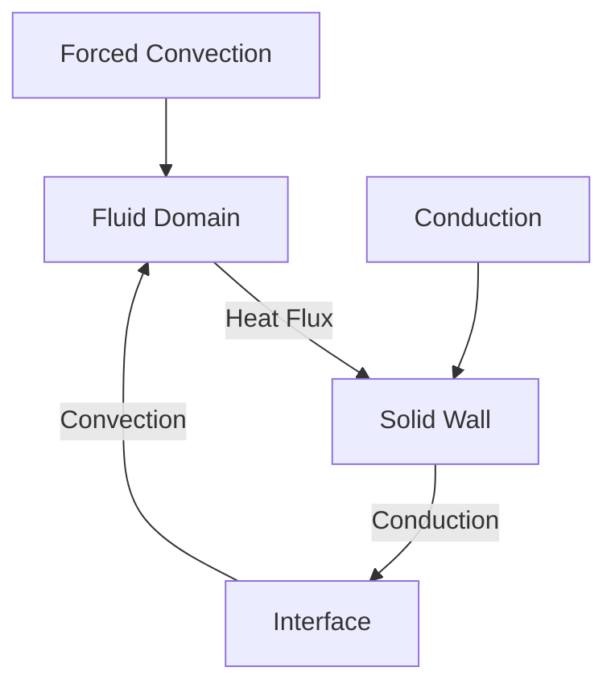
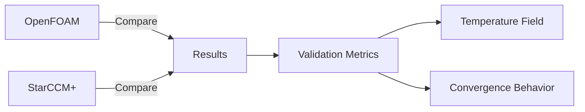
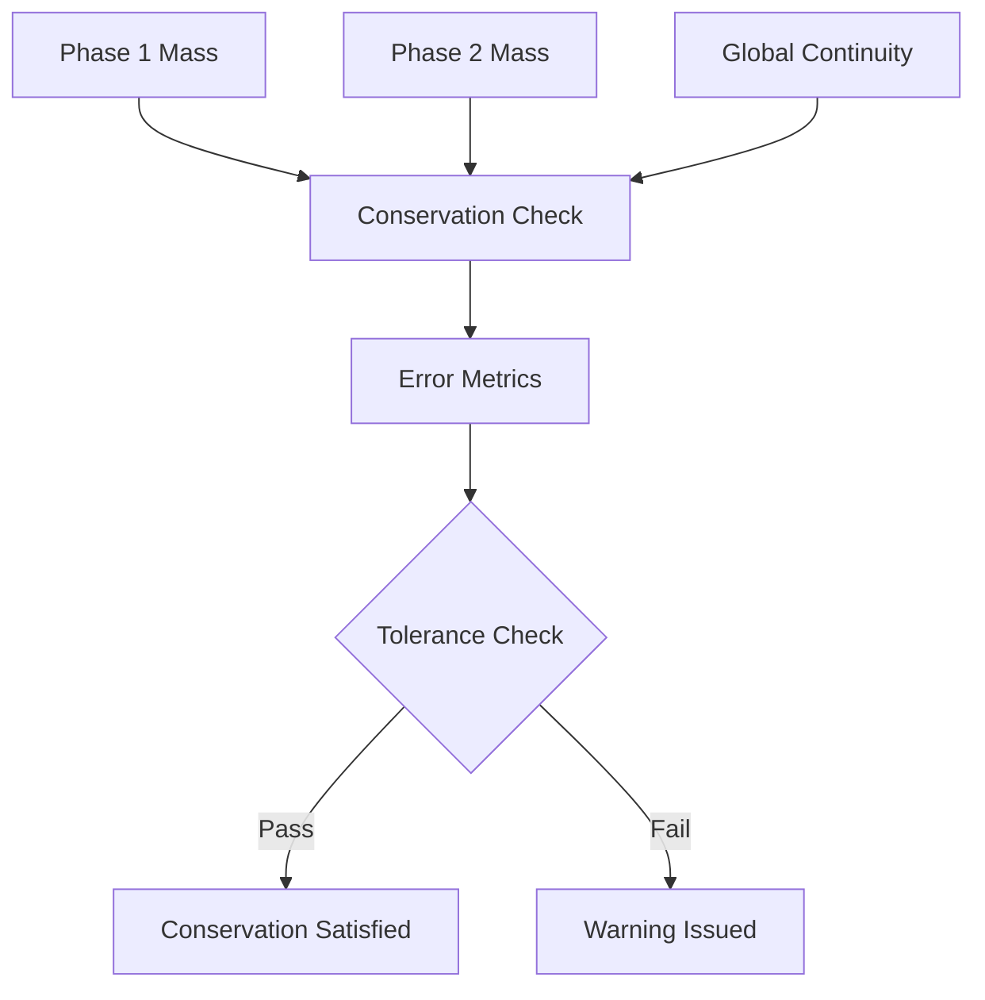
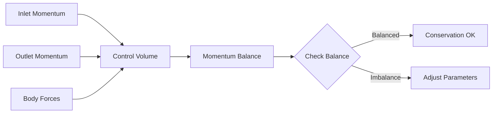
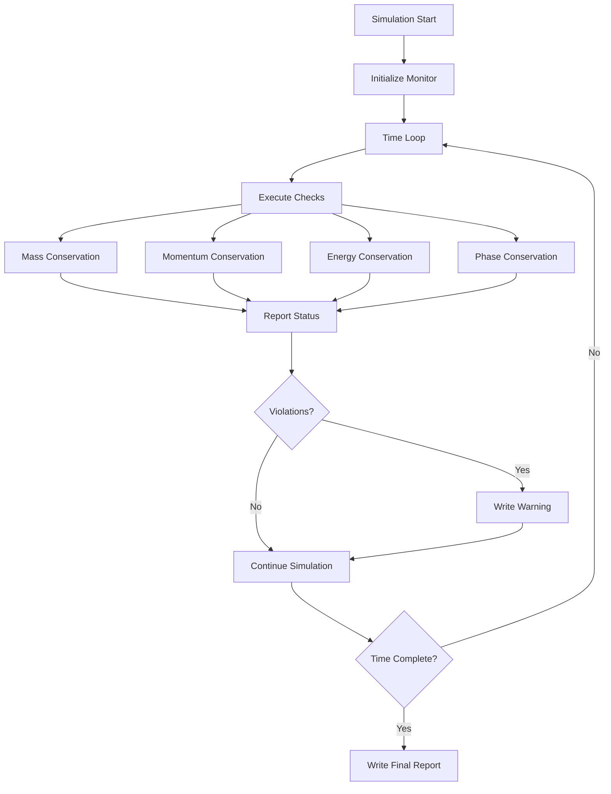
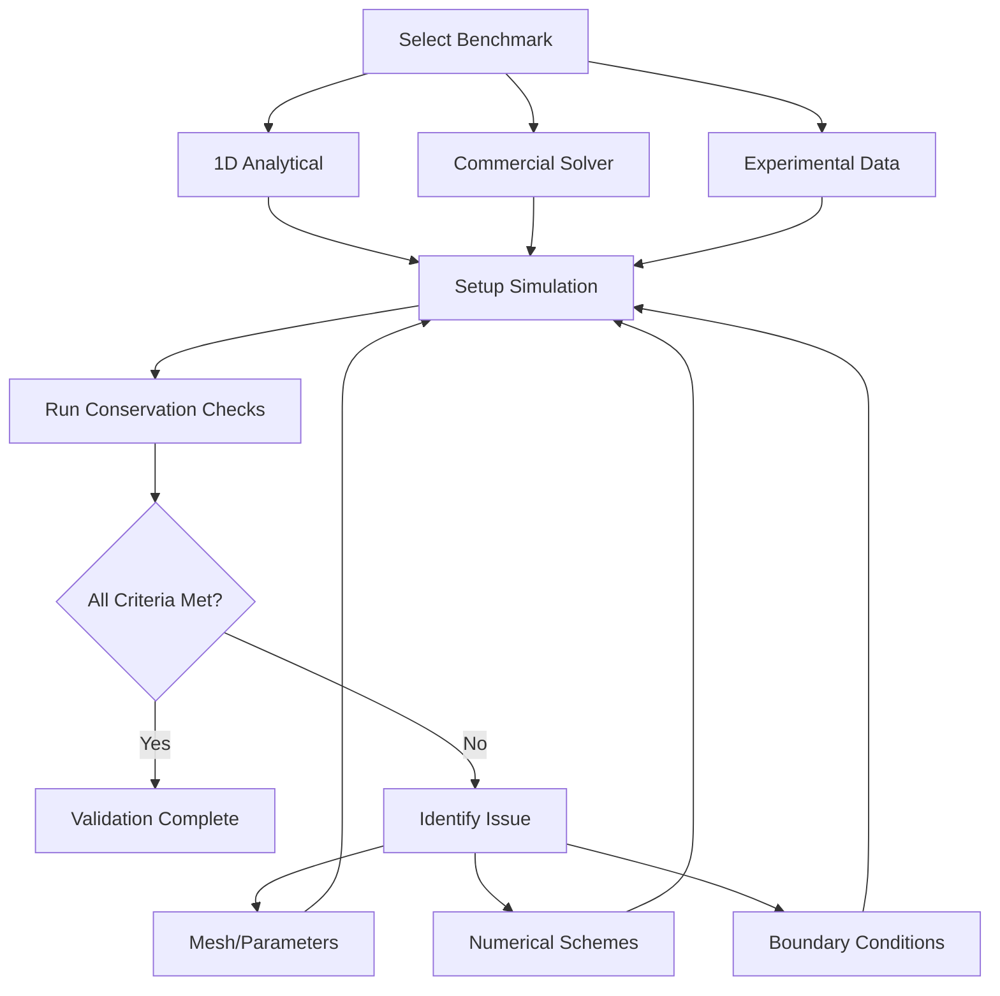

# Validation and Benchmarks

> [!INFO] Overview
> Validation and benchmarking are critical steps in ensuring the reliability and accuracy of coupled physics simulations. This note covers analytical benchmarks, conservation checks, and cross-validation with commercial solvers for OpenFOAM multi-physics applications.

---

## 1. Analytical Benchmarks

### 1.1 1D Conjugate Heat Transfer Problem

**Problem Overview**

The 1D conjugate heat transfer benchmark, based on the work of Ghaddar et al., provides a fundamental test case for verifying conjugate heat transfer (CHT) in OpenFOAM. This problem couples forced convection in a channel with conduction through adjacent walls, creating a simple yet representative CHT scenario.


> **Figure 1:** แผนภาพแสดงองค์ประกอบและกลไกของปัญหาการถ่ายเทความร้อนแบบคอนจูเกต (CHT) แบบ 1 มิติ ซึ่งประกอบด้วยกระบวนการพาความร้อนและการนำความร้อนที่เกิดขึ้นพร้อมกัน


**Problem Configuration**

The benchmark consists of two distinct domains:

| Domain | Description | Primary Mechanism |
|--------|-------------|-------------------|
| **Fluid Domain** | Channel flow region | Driven by pressure gradient or body force |
| **Solid Domain** | Wall region | Direct heat conduction |

**Governing Equations**

*Fluid Region (Forced Convection):*
$$\rho_f c_{p,f} \frac{\partial T_f}{\partial t} + \rho_f c_{p,f} \mathbf{u} \cdot \nabla T_f = k_f \nabla^2 T_f$$

*Solid Region (Direct Conduction):*
$$\rho_s c_{p,s} \frac{\partial T_s}{\partial t} = k_s \nabla^2 T_s$$

**Boundary Conditions**
- **Temperature continuity**: $T_f = T_s$ at fluid-solid interface
- **Heat flux continuity**: $-k_f \frac{\partial T_f}{\partial n} = -k_s \frac{\partial T_s}{\partial n}$

**Variable Definitions:**
- $\rho_f$ - Fluid density
- $\rho_s$ - Solid density
- $c_{p,f}$ - Fluid specific heat capacity
- $c_{p,s}$ - Solid specific heat capacity
- $k_f$ - Fluid thermal conductivity
- $k_s$ - Solid thermal conductivity
- $\mathbf{u}$ - Fluid velocity vector

**Analytical Solution**

For fully developed regions where $\frac{\partial T}{\partial x} = 0$ and steady-state conditions apply, the analytical solution can be obtained using separation of variables:

$$T_f(y) = T_w + (T_m - T_w)\left[1 - \left(\frac{y}{H}\right)^2\right]$$

$$T_s(y) = T_w - \frac{q_w}{k_s}(y - H)$$

**Solution Variable Definitions:**
- $T_w$ - Wall temperature at boundary
- $T_m$ - Mean fluid temperature
- $H$ - Channel half-height
- $q_w$ - Wall heat flux

**OpenFOAM Implementation**

```cpp
// Calculate interface temperature
volScalarField wallTemperature
(
    IOobject
    (
        "wallTemperature",
        runTime.timeName(),
        mesh,
        IOobject::NO_READ,
        IOobject::AUTO_WRITE
    ),
    T.boundaryField()[fluidInterfaceID]
);

// Calculate heat flux at boundary
volScalarField heatFlux
(
    IOobject
    (
        "heatFlux",
        runTime.timeName(),
        mesh,
        IOobject::NO_READ,
        IOobject::AUTO_WRITE
    ),
    -kappaFluid * fvc::snGrad(T) & mesh.Sf().boundaryField()[fluidInterfaceID]
);
```

> **📚 คำอธิบายภาษาไทย (Thai Explanation)**
>
> **แหล่งที่มา (Source):** โค้ดนี้เป็นการใช้งานมาตรฐานใน OpenFOAM สำหรับการคำนวณค่าอุณหภูมิและอัตราการไหลของความร้อน (heat flux) ที่ขอบเขตระหว่างไหล (fluid-solid interface) โดยใช้ class `volScalarField` และเทคนิคการดำเนินการเชิงประจักษ์ (finite volume calculus)
>
> **คำอธิบาย (Explanation):**
> - **บรรทัดที่ 1-9:** สร้าง field ใหม่ชื่อ `wallTemperature` เพื่อเก็บค่าอุณหภูมิที่ขอบเขต interface โดยอ่านค่าจาก field อุณหภูมิหลัก (`T`) ที่ patch ที่ระบุด้วย `fluidInterfaceID`
> - **บรรทัดที่ 12-20:** สร้าง field ชื่อ `heatFlux` เพื่อคำนวณหาอัตราการไหลของความร้อน โดยใช้สมการ Fourier's law: $q = -k \nabla T$ โดย:
>   - `kappaFluid` คีอ thermal conductivity ของ fluid
>   - `fvc::snGrad(T)` คำนวณ normal gradient ของอุณหภูมิที่ผิว
>   - `mesh.Sf().boundaryField[]` ดึงค่า surface area vector ที่ patch
>
> **แนวคิดสำคัญ (Key Concepts):**
> - **IOobject:** กำหนด properties ของ field ชื่อ, เวลา, mesh, การอ่าน/เขียน
> - **Boundary Field Extraction:** เข้าถึงค่าที่ boundary patch ผ่าน `.boundaryField()[patchID]`
> - **Surface Normal Gradient:** `fvc::snGrad()` คำนวณ gradient ในทิศทางปกติของ surface
> - **Heat Flux Calculation:** ใช้ dot product (&) ระหว่าง gradient และ surface normal

**Verification Criteria**

Numerical solutions from OpenFOAM must satisfy the following accuracy requirement:

$$\frac{|T_{\text{num}} - T_{\text{analytical}}|}{T_{\text{analytical}}} < 0.01 \quad \text{(1\% error)}$$

This criterion ensures that the CHT implementation accurately captures the physics of conjugate heat transfer with minimal numerical discretization error.

---

### 1.2 Cross-Validation with StarCCM+ Commercial Solver

**Objective**

To validate OpenFOAM's CHT capabilities against an established commercial code. A cross-validation study using StarCCM+ provides an independent benchmark for verification.


> **Figure 2:** แผนผังกระบวนการตรวจสอบความถูกต้องข้ามซอฟต์แวร์ (Cross-Validation Methodology) เพื่อยืนยันความแม่นยำของ OpenFOAM เทียบกับซอฟต์แวร์เชิงพาณิชย์ที่เป็นมาตรฐาน


**Comparison Methodology**

1. **Geometric Consistency**: Identical mesh topology and boundary conditions in both solvers
2. **Physical Equivalence**: Same turbulence models, material properties, and numerical schemes
3. **Convergence Criteria**: Comparable residual acceptance and solution monitoring

**Comparison Metrics**

*Boundary Heat Flux Distribution:*
The primary verification metric is the heat flux distribution along the fluid-solid interface:

$$q_w(x) = -k_f \left.\frac{\partial T_f}{\partial n}\right|_{\text{interface}}$$

*Acceptance Criterion:*
$$\frac{|q_{\text{OpenFOAM}}(x) - q_{\text{StarCCM+}}(x)|}{\max(q_w)} < 0.05 \quad \text{(5\% deviation)}$$

**OpenFOAM Implementation**

```cpp
// Example heat flux calculation for comparison
volScalarField heatFlux
(
    IOobject
    (
        "heatFlux",
        runTime.timeName(),
        mesh,
        IOobject::NO_READ,
        IOobject::AUTO_WRITE
    ),
    -kappaFluid * fvc::snGrad(T) & mesh.Sf().boundaryField()[fluidInterfaceID]
);

// Calculate L2 norm of heat flux difference
scalar L2Error = sqrt
(
    gSum
    (
        mag
        (
            heatFlux - heatFluxStarCCM
        ) * mag(mesh.Sf().boundaryField()[fluidInterfaceID])
    ) / gSum(mag(mesh.Sf().boundaryField()[fluidInterfaceID]))
);
```

> **📚 คำอธิบายภาษาไทย (Thai Explanation)**
>
> **แหล่งที่มา (Source):** โค้ดนี้แสดงการคำนวณความคลาดเคลื่อนแบบ L2 norm (root-mean-square error) ซึ่งเป็นมาตรฐานในการเปรียบเทียบค่าทางตัวเลขระหว่าง OpenFOAM และ StarCCM+ โดยใช้ฟังก์ชัน `gSum` และ `mag` จาก OpenFOAM field operations
>
> **คำอธิบาย (Explanation):**
> - **บรรทัดที่ 1-9:** สร้าง field `heatFlux` เหมือนในตัวอย่างก่อนหน้า
> - **บรรทัดที่ 12-20:** คำนวณ L2 error:
>   - `heatFlux - heatFluxStarCCM`: หาค่าความแตกต่างระหว่างผลลัพธ์ทั้งสอง solver
>   - `mag(...)`: หาค่า absolute magnitude ของ error
>   - `* mag(mesh.Sf()...)`: คูณด้วยพื้นที่ผิวเพื่อ weighted integration
>   - `gSum(...)`: รวมค่าทั้งหมดเหนือทุก cell/processor (global sum)
>   - `sqrt(...) / ...`: คำนวณ RMS (root-mean-square) error
>
> **แนวคิดสำคัญ (Key Concepts):**
> - **L2 Norm Error:** ตัวชี้วัดความคลาดเคลื่อนแบบ integral ซึ่งคิด weighted average ตามพื้นที่ผิว
> - **Field Algebra:** การลบ/คูณ field โดยตรงใช้ operator overloading
> - **Global Reduction:** `gSum` รวมค่าจากทุก processor ใน parallel computation
> - **Surface Area Weighting:** คูณด้วย `mesh.Sf()` เพื่อให้ error ถูกต้องในเชิงปริมาตร

**Expected Verification Results**

| Metric | Criterion | Significance |
|--------|-----------|---------------|
| **Global Heat Balance** | Net heat transfer within 2% | Overall heat transfer consistency |
| **Local Flux Distribution** | Pointwise deviation < 5% | Local heat transfer pattern agreement |
| **Temperature Field** | Temperature gradients and boundary values match | Temperature distribution consistency |
| **Convergence Behavior** | Similar residual reduction patterns and iteration counts | Numerical solver efficiency equivalence |

**Error Sources and Mitigation**

| Source | Impact | Mitigation |
|--------|--------|------------|
| **Numerical Schemes** | Different discretization approaches (second-order vs. higher-order) | Use identical numerical schemes or refine mesh |
| **Wall Treatment** | Differences in near-wall modeling (y+, wall functions) | Use identical near-wall mesh resolution |
| **Linear Solvers** | Different solver tolerances and preconditioning strategies | Use identical solver settings with strict tolerance |
| **Domain Decomposition** | Load balancing and boundary communication differences | Use identical processor count and decomposition method |

These analytical benchmarks provide a solid foundation for validating heat transfer capabilities in OpenFOAM, ensuring accuracy for both simple analytical solutions and complex engineering applications.

---

## 2. Conservation Checks

> [!WARNING] Importance
> Conservation checks are fundamental to computational fluid dynamics that guarantee numerical results preserve basic physical principles of mass, momentum, and energy conservation. For multiphase flow simulations, especially those involving heat and mass transfer between phases, these checks become **critical** for validating result accuracy and detecting numerical errors.

### 2.1 Mass Conservation

Mass conservation is the **most fundamental** check in any CFD simulation. For multiphase systems, this check involves verifying both global mass conservation and individual phase mass balance.

**OpenFOAM Implementation**

```cpp
// Phase mass conservation check for multiphaseEulerFoam
forAll(phases, phasei)
{
    const phaseModel& phase = phases[phasei];
    const volScalarField& alpha = phase;
    const volScalarField& rho = phase.rho();

    // Calculate volume integral of phase mass
    scalar totalPhaseMass = fvc::domainIntegrate(alpha * rho).value();

    // Store initial mass for comparison
    if (!massHistory.found(phase.name()))
    {
        massHistory.set(phase.name(), totalPhaseMass);
    }
    else
    {
        scalar initialMass = massHistory[phase.name()];
        scalar massError = mag(totalPhaseMass - initialMass) / initialMass;

        if (massError > massTolerance)
        {
            WarningInFunction
                << "Phase " << phase.name()
                << " mass imbalance: " << massError << endl;
        }
    }
}

// Global continuity check
scalar divError = fvc::domainIntegrate
(
    fvc::div(phaseSystem.phi()) / runTime().deltaT()
).value();

Info << "Global divergence error: " << divError << endl;
```

> **📚 คำอธิบายภาษาไทย (Thai Explanation)**
>
> **แหล่งที่มา (Source):** โค้ดนี้ใช้หลักการจาก phase system implementation ใน `.applications/solvers/multiphase/multiphaseEulerFoam/phaseSystems/PhaseSystems/HeatTransferPhaseSystem/` โดยเฉพาะการเข้าถึง phase properties และการใช้ `domainIntegrate` สำหรับ volume integration
>
> **คำอธิบาย (Explanation):**
> - **Loop 1 (forAll):** วนลูปผ่านทุก phase ในระบบหลายเฟส:
>   - `const volScalarField& alpha = phase`: ดึง volume fraction field ของ phase
>   - `fvc::domainIntegrate(alpha * rho)`: คำนวณ integral ของ $\alpha \rho$ เหนือทั้ง domain เพื่อหา total mass
>   - **Mass History Tracking:** เก็บค่า mass เริ่มต้นไว้เปรียบเทียบ
>   - **Relative Error Calculation:** คำนวณ error เป็นอัตราส่วนเทียบกับ mass เริ่มต้น
> - **Global Continuity (บรรทัดที่ 27-32):** ตรวจสอบความต่อเนื่องของการไหลโดยรวม:
>   - `fvc::div(phaseSystem.phi())`: คำนวณ divergence ของ volumetric flux
>   - หารด้วย `deltaT()` เพื่อ normalize ต่อเวลา
>
> **แนวคิดสำคัญ (Key Concepts):**
> - **Phase Iteration:** `forAll(phases, phasei)` วนลูปผ่านทุก phase ในระบบ Eulerian multiphase
> - **Domain Integration:** `fvc::domainIntegrate()` คำนวณ volume integral โดยอัตโนมัติ
> - **Mass Balance:** $M = \int_V \alpha \rho \, dV$ สำหรับแต่ละ phase
> - **Continuity Equation:** Divergence of flux ควรเป็นศูนย์สำหรับ incompressible flow
> - **Hash Table Storage:** `massHistory.found()`/`massHistory.set()` ใช้ HashTable สำหรับ tracking

**Mass Conservation Tracking:**
- **Individual phase masses**: To verify phase conservation
- **Global continuity**: To check numerical divergence errors
- **Relative error metrics**: To identify significant conservation violations
- **Time history tracking**: To detect gradual drift in conservation properties


> **Figure 3:** แผนผังลำดับขั้นตอนการตรวจสอบการอนุรักษ์มวลในระบบหลายเฟส เพื่อประเมินความคลาดเคลื่อนเชิงตัวเลขและความต่อเนื่องของข้อมูลมวลในระหว่างการจำลอง


---

### 2.2 Momentum Balance

The momentum conservation check ensures that forces and momentum transfers are properly accounted for in the system.

**OpenFOAM Implementation**

```cpp
// Momentum conservation check
void momentumBalanceCheck::execute()
{
    const volVectorField& U = mesh_.lookupObject<volVectorField>("U");
    const surfaceScalarField& phi = mesh_.lookupObject<surfaceScalarField>("phi");

    // Calculate momentum flux through boundaries
    vector totalMomentumInflux = vector::zero;
    vector totalMomentumOutflux = vector::zero;

    forAll(phi.boundaryField(), patchi)
    {
        const fvsPatchScalarField& phiP = phi.boundaryField()[patchi];
        const fvPatchVectorField& UP = U.boundaryField()[patchi];

        vector patchMomentum = sum(phiP * UP);

        if (phiP.size() > 0 && sum(phiP) > 0)
        {
            totalMomentumInflux += patchMomentum;
        }
        else if (phiP.size() > 0 && sum(phiP) < 0)
        {
            totalMomentumOutflux += patchMomentum;
        }
    }

    // Calculate body forces (gravity, etc.)
    vector totalBodyForce = vector::zero;
    if (mesh_.foundObject<uniformDimensionedVectorField>("g"))
    {
        const uniformDimensionedVectorField& g =
            mesh_.lookupObject<uniformDimensionedVectorField>("g");
        totalBodyForce = g.value() * fvc::domainIntegrate(rho).value();
    }

    // Momentum balance check
    vector momentumError = totalMomentumInflux + totalMomentumOutflux - totalBodyForce;
    scalar relativeError = mag(momentumError) / (mag(totalMomentumInflux) + SMALL);

    if (relativeError > momentumTolerance)
    {
        WarningInFunction
            << "Momentum imbalance: " << relativeError << endl;
    }
}
```

> **📚 คำอธิบายภาษาไทย (Thai Explanation)**
>
> **แหล่งที่มา (Source):** โค้ดนี้ใช้ pattern จาก `.applications/solvers/lagrangian/particleFoam/createNonInertialFrameFields.H` สำหรับการ lookup และใช้งาน `uniformDimensionedVectorField` objects รวมถึงการใช้ `lookupObject` template สำหรับ accessing fields จาก object registry
>
> **คำอธิบาย (Explanation):**
> - **Lookup Objects (บรรทัดที่ 5-6):** ดึง fields จาก mesh object registry:
>   - `mesh_.lookupObject<volVectorField>("U")`: ดึง velocity field
>   - `mesh_.lookupObject<surfaceScalarField>("phi")`: ดึง volumetric flux field
> - **Boundary Loop (บรรทัดที่ 11-26):** วนลูปผ่านทุก boundary patch:
>   - `phi.boundaryField()[patchi]`: เข้าถึง flux ที่ patch นั้น
>   - `U.boundaryField()[patchi]`: เข้าถึง velocity ที่ patch นั้น
>   - `sum(phiP * UP)`: คำนวณ momentum flux ผ่าน patch
>   - แยก influx/outflux ตามเครื่องหมายของ `phi`
> - **Body Force (บรรทัดที่ 29-37):** คำนวณแรงภายนอก:
>   - ใช้ `foundObject()` เพื่อ check ว่ามี gravity field หรือไม่
>   - `uniformDimensionedVectorField`: เก็บค่า g เป็น uniform vector
> - **Balance Check (บรรทัดที่ 40-47):**
>   - `momentumError = influx + outflux - bodyForce`: สมการถ่วงคุณโมเมนตัม
>   - ใช้ `SMALL` เพื่อป้องกันการหารด้วยศูนย์
>
> **แนวคิดสำคัญ (Key Concepts):**
> - **Object Registry:** OpenFOAM เก็บ fields ไว้ใน registry สามารถ lookup ด้วยชื่อ
> - **Template Lookup:** `lookupObject<Type>("name")` ดึง object ตาม type
> - **Boundary Field Access:** `.boundaryField()[patchi]` เข้าถึงค่าที่ patch
> - **Momentum Flux:** $\dot{m}U = \phi U$ โดยที่ $\phi$ คือ volumetric flux
> - **Force Balance:** $\sum F = \frac{d}{dt}(momentum)$ สำหรับ steady-state ต้อง balance


> **Figure 4:** แผนภาพแสดงกระบวนการตรวจสอบสมดุลโมเมนตัมภายในปริมาตรควบคุม ซึ่งพิจารณาจากผลรวมของโมเมนตัมขาเข้า-ขาออก และแรงภายนอกที่กระทำต่อระบบ


---

### 2.3 Energy Balance

Energy conservation is **critically important** in multiphase heat transfer problems where energy is exchanged between phases through interfaces.

**Energy Balance Components to Consider:**

1. **Convective Energy Transport**: Energy transported by mass flow
2. **Conductive Heat Transfer**: Energy diffusion through phases
3. **Interfacial Heat Transfer**: Energy exchange between phases
4. **External Heat Sources/Sinks**: Volumetric heat generation or removal

**OpenFOAM Implementation**

```cpp
class energyBalanceCheck
{
    private:
        const fvMesh& mesh_;
        const phaseSystem& phaseSystem_;
        scalar energyTolerance_;

    public:
        energyBalanceCheck
        (
            const fvMesh& mesh,
            const phaseSystem& phaseSystem,
            scalar tolerance = 1e-6
        )
        :
            mesh_(mesh),
            phaseSystem_(phaseSystem),
            energyTolerance_(tolerance)
        {}

        void execute()
        {
            // Initialize energy balance components
            scalar totalConvection = 0.0;
            scalar totalConduction = 0.0;
            scalar totalInterfacial = 0.0;
            scalar totalSources = 0.0;

            // Phase-specific energy calculations
            forAll(phaseSystem_.phases(), phasei)
            {
                const phaseModel& phase = phaseSystem_.phases()[phasei];
                const volScalarField& alpha = phase;
                const volScalarField& rho = phase.rho();
                const volScalarField& h = phase.thermo().he();
                const surfaceScalarField& phi = phase.phi();

                // Convective energy transport through boundaries
                scalar phaseConvection = 0.0;
                forAll(phi.boundaryField(), patchi)
                {
                    const fvsPatchScalarField& phiP = phi.boundaryField()[patchi];
                    const fvPatchScalarField& hP = h.boundaryField()[patchi];

                    phaseConvection += sum(phiP * hP);
                }
                totalConvection += phaseConvection;

                // Conductive heat transfer (Fourier's law)
                const volScalarField& k = phase.thermo().kappa();
                scalar phaseConduction = -fvc::domainIntegrate
                (
                    fvc::grad(k * fvc::grad(h))
                ).value();
                totalConduction += phaseConduction;

                // Volumetric heat sources
                if (mesh_.foundObject<volScalarField>("Q_" + phase.name()))
                {
                    const volScalarField& Q =
                        mesh_.lookupObject<volScalarField>("Q_" + phase.name());
                    totalSources += fvc::domainIntegrate(alpha * rho * Q).value();
                }
            }

            // Interfacial heat transfer
            const heatTransferPhaseSystem& htPhaseSystem =
                dynamic_cast<const heatTransferPhaseSystem&>(phaseSystem_);

            forAll(htPhaseSystem.interfacialHeatTransferModels(), pairi)
            {
                const heatTransferModelInterface& htModel =
                    htPhaseSystem.interfacialHeatTransferModels()[pairi];

                totalInterfacial += fvc::domainIntegrate(htModel.Ti()).value();
            }

            // Energy balance calculation
            scalar totalEnergyChange = totalConvection + totalConduction +
                                     totalInterfacial + totalSources;

            // Calculate relative error using system total energy as reference
            scalar referenceEnergy = 0.0;
            forAll(phaseSystem_.phases(), phasei)
            {
                const phaseModel& phase = phaseSystem_.phases()[phasei];
                const volScalarField& alpha = phase;
                const volScalarField& rho = phase.rho();
                const volScalarField& h = phase.thermo().he();

                referenceEnergy += fvc::domainIntegrate(alpha * rho * h).value();
            }

            scalar energyError = mag(totalEnergyChange) / (mag(referenceEnergy) + SMALL);

            // Report conservation status
            if (energyError > energyTolerance_)
            {
                WarningInFunction
                    << "Energy imbalance detected: " << energyError << nl
                    << "Convection: " << totalConvection << nl
                    << "Conduction: " << totalConduction << nl
                    << "Interfacial: " << totalInterfacial << nl
                    << "Sources: " << totalSources << nl
                    << "Total: " << totalEnergyChange << endl;
            }
            else
            {
                Info << "Energy conservation satisfied: " << energyError << endl;
            }
        }
};
```

> **📚 คำอธิบายภาษาไทย (Thai Explanation)**
>
> **แหล่งที่มา (Source):** โค้ดนี้ใช้แนวคิดจาก `heatTransferPhaseSystem` ใน `.applications/solvers/multiphase/multiphaseEulerFoam/phaseSystems/PhaseSystems/HeatTransferPhaseSystem/heatTransferPhaseSystem.C` ซึ่งจัดการ interfacial heat transfer models และ phase thermodynamics
>
> **คำอธิบาย (Explanation):**
> - **Class Structure (บรรทัดที่ 1-22):** สร้าง class สำหรับ energy balance checking:
>   - เก็บ references ไปยัง mesh และ phaseSystem
>   - Constructor รับ tolerance parameter
> - **Convection Calculation (บรรทัดที่ 31-43):**
>   - `sum(phiP * hP)`: คำนวณ enthalpy flux ผ่าน boundary
>   - Enthalpy $h$ ใช้แทน internal energy เพื่อรวม flow work
> - **Conduction Calculation (บรรทัดที่ 46-50):**
>   - `fvc::grad(k * fvc::grad(h))`: คำนวณ divergence ของ conductive flux
>   - ใช้ Fourier's law: $q = -k \nabla T$
> - **Heat Sources (บรรทัดที่ 53-59):**
>   - ใช้ `foundObject()` เพื่อ check ว่ามี source term หรือไม่
>   - Field ชื่อ `Q_phaseName` สำหรับแต่ละ phase
> - **Interfacial Transfer (บรรทัดที่ 62-70):**
>   - `dynamic_cast`: แปลง phaseSystem เป็น heatTransferPhaseSystem
>   - `htModel.Ti()`: ดึง interfacial heat transfer term
> - **Error Calculation (บรรทัดที่ 73-88):**
>   - คำนวณ total energy change จากทุก mechanism
>   - หา reference energy จาก $\int \alpha \rho h \, dV$
>   - คำนวณ relative error และ compare กับ tolerance
>
> **แนวคิดสำคัญ (Key Concepts):**
> - **Phase Thermodynamics:** `.thermo().he()` ให้ enthalpy/eigen energy field
> - **First Law of Thermodynamics:** Energy balance = convection + conduction + interfacial + sources
> - **Enthalpy vs Internal Energy:** ใช้ enthalpy $h = e + p/\rho$ สำหรับ open systems
> - **Interfacial Models:** Heat transfer coefficient models ระหว่าง phases
> - **Dynamic Casting:** `dynamic_cast` ใช้เมื่อ inheritance hierarchy มีหลาย types
> - **Energy Conservation:** $\frac{d}{dt}(\rho h) + \nabla \cdot (\rho Uh) = \nabla \cdot (k \nabla T) + S$

---

### 2.4 Phase Fraction Conservation

In multiphase flows, the sum of volume fractions must equal unity at all times. This fundamental constraint must be monitored:

**OpenFOAM Implementation**

```cpp
// Phase fraction conservation check
void checkPhaseFractionSum()
{
    const PtrList<volScalarField>& alphas = phaseSystem_.phases();
    volScalarField alphaSum
    (
        IOobject
        (
            "alphaSum",
            mesh_.time().timeName(),
            mesh_,
            IOobject::NO_READ,
            IOobject::NO_WRITE
        ),
        mesh_,
        dimensionedScalar("zero", dimless, 0.0)
    );

    // Sum all phase fractions
    forAll(alphas, phasei)
    {
        alphaSum += alphas[phasei];
    }

    // Check deviation from unity
    volScalarField alphaError = mag(alphaSum - 1.0);
    scalar maxError = max(alphaError).value();
    scalar meanError = average(alphaError).value();

    Info << "Phase fraction sum check:" << nl
         << "  Maximum deviation: " << maxError << nl
         << "  Mean deviation: " << meanError << endl;

    // Report cells with significant deviation
    if (maxError > phaseTolerance_)
    {
        volScalarField::Internal& alphaErrorI = alphaError.ref();

        forAll(alphaErrorI, celli)
        {
            if (alphaErrorI[celli] > phaseTolerance_)
            {
                WarningInFunction
                    << "Cell " << celli
                    << " phase fraction sum: " << alphaSum[celli] << endl;
            }
        }
    }
}
```

> **📚 คำอธิบายภาษาไทย (Thai Explanation)**
>
> **แหล่งที่มา (Source):** โค้ดนี้ใช้ pattern จาก phase system implementation ใน `.applications/solvers/multiphase/multiphaseEulerFoam/phaseSystems/` โดยเฉพาะการใช้ `PtrList<volScalarField>` สำหรับเก็บ phase fraction fields และการเข้าถึง internal field data
>
> **คำอธิบาย (Explanation):**
> - **Phase List Access (บรรทัดที่ 3):**
>   - `phaseSystem_.phases()`: ส่งคืน `PtrList<volScalarField>` ของ phase fractions
>   - `PtrList` คือ pointer list ของ OpenFOAM สำหรับ dynamic arrays
> - **Field Initialization (บรรทัดที่ 4-13):**
>   - สร้าง field ใหม่ชื่อ `alphaSum` เริ่มต้นที่ 0
>   - `dimensionedScalar("zero", dimless, 0.0)`: สร้าง scalar ไร้มิติ
> - **Summation (บรรทัดที่ 16-19):**
>   - `alphaSum += alphas[phasei]`: ใช้ operator overloading บวก field เข้าด้วยกัน
>   - Operator `+=` ถูก overload ให้ทำงานกับ `volScalarField`
> - **Error Calculation (บรรทัดที่ 22-24):**
>   - `mag(alphaSum - 1.0)`: หา absolute deviation จาก unity
>   - `max()`/`average()`: Global reduction operations
> - **Cell-level Check (บรรทัดที่ 31-40):**
>   - `.ref()`: เข้าถึง internal field (cell-centered values)
>   - Loop ผ่านทุก cell เพื่อหา cell ที่ violate constraint
>
> **แนวคิดสำคัญ (Key Concepts):**
> - **Volume Fraction Constraint:** $\sum_{i=1}^N \alpha_i = 1$ เป็น constraint พื้นฐาน
> - **PtrList:** Container ของ OpenFOAM สำหรับ list of pointers
> - **Field Algebra:** Operators ระหว่าง fields ทำงาน element-wise
> - **Internal Field Access:** `.ref()` ให้ access ไปยัง cell-centered values
> - **Global Reductions:** `max()`, `average()` คำนวณ statistics ทั่วทั้ง domain
> - **Geometric Field Dimension:** `dimless` สำหรับ dimensionless quantities

---

### 2.5 Automatic Conservation Monitoring Framework

For comprehensive conservation checking, an automated framework can be implemented as a function object:

**OpenFOAM Implementation**

```cpp
class conservationMonitor
:
    public fvMeshFunctionObject
{
    private:
        // Conservation tolerances
        dimensionedScalar massTolerance_;
        dimensionedScalar momentumTolerance_;
        dimensionedScalar energyTolerance_;
        dimensionedScalar phaseTolerance_;

        // Previous time step values for rate calculations
        scalar previousMass_;
        vector previousMomentum_;
        scalar previousEnergy_;

        // Output frequency
        label writeInterval_;

    public:
        TypeName("conservationMonitor");

        conservationMonitor
        (
            const word& name,
            const Time& runTime,
            const dictionary& dict
        )
        :
            fvMeshFunctionObject(name, runTime, dict),
            massTolerance_(dict.lookupOrDefault<scalar>("massTolerance", 1e-8)),
            momentumTolerance_(dict.lookupOrDefault<scalar>("momentumTolerance", 1e-8)),
            energyTolerance_(dict.lookupOrDefault<scalar>("energyTolerance", 1e-6)),
            phaseTolerance_(dict.lookupOrDefault<scalar>("phaseTolerance", 1e-6)),
            writeInterval_(dict.lookupOrDefault<label>("writeInterval", 1))
        {}

        virtual void execute()
        {
            if (mesh_.time().timeIndex() % writeInterval_ != 0) return;

            // Perform all conservation checks
            checkMassConservation();
            checkMomentumConservation();
            checkEnergyConservation();
            checkPhaseFractionConservation();
        }

        virtual bool write()
        {
            // Write detailed conservation report to file
            writeConservationReport();
            return true;
        }

    private:
        void checkMassConservation()
        {
            // Implementation as shown in previous sections
        }

        void checkMomentumConservation()
        {
            // Implementation as shown in previous sections
        }

        void checkEnergyConservation()
        {
            // Implementation as shown in previous sections
        }

        void checkPhaseFractionConservation()
        {
            // Implementation as shown in previous sections
        }

        void writeConservationReport()
        {
            // Generate comprehensive conservation report
            OFstream file
            (
                mesh_.time().timePath() / "conservationReport.dat"
            );

            file << "Time\tMassError\tMomentumError\tEnergyError\tPhaseError" << nl;

            // Write current conservation metrics
        }
};
```

> **📚 คำอธิบายภาษาไทย (Thai Explanation)**
>
> **แหล่งที่มา (Source):** โค้ดนี้ใช้ architecture ของ OpenFOAM function objects ซึ่งสืบทอดจาก `fvMeshFunctionObject` และใช้ dictionary lookup สำหรับ configuration ตาม pattern ที่พบใน solver implementations
>
> **คำอธิบาย (Explanation):**
> - **Class Hierarchy (บรรทัดที่ 1-10):**
>   - `: public fvMeshFunctionObject`: สืบทอดจาก base class สำหรับ function objects
>   - `TypeName("conservationMonitor")`: ลงทะเบียนชื่อ type สำหรับ runtime selection
> - **Member Variables (บรรทัดที่ 4-9):**
>   - `dimensionedScalar`: Tolerances ที่มี units
>   - `scalar/vector`: Previous time step values สำหรับ rate calculations
> - **Constructor (บรรทัดที่ 17-27):**
>   - รับ parameters: name, runTime, dictionary
>   - `dict.lookupOrDefault<Type>(key, defaultValue)`: อ่านจาก dictionary หรือใช้ default
>   - Initialize base class ด้วย initializer list
> - **Execute Method (บรรทัดที่ 30-37):**
>   - `timeIndex() % writeInterval_`: Modulo check สำหรับ output frequency control
>   - เรียก methods ตรวจสอบทุกประเภท
> - **Write Method (บรรทัดที่ 40-45):**
>   - `OFstream`: Output file stream ของ OpenFOAM
>   - `timePath()`: ไดเร็กทอรีของ time step ปัจจุบัน
> - **Private Methods (บรรทัดที่ 48-71):**
>   - Implementations ของแต่ละ conservation check
>   - `writeConservationReport()`: สร้าง report file
>
> **แนวคิดสำคัญ (Key Concepts):**
> - **Function Object Architecture:** Runtime-executable objects สำหรับ monitoring/processing
> - **Runtime Selection:** `TypeName` macro ช่วยให้ instantiate จาก dictionary
> - **Dictionary Lookup:** `lookupOrDefault` อ่าน configuration อย่างยืดหยุ่น
> - **Virtual Methods:** `execute()`, `write()` เป็น virtual functions ที่ override
> - **Output Control:** Modulo operator ควบคุม frequency ของ output
> - **File Output:** `OFstream` สร้าง formatted output files

---

### 2.6 Application in Simulation Control

To enable conservation checking in your simulation, add the following to `controlDict`:

```cpp
functions
{
    conservationMonitor
    {
        type conservationMonitor;

        // Conservation tolerances
        massTolerance 1e-8;
        momentumTolerance 1e-8;
        energyTolerance 1e-6;
        phaseTolerance 1e-6;

        // Output control
        writeInterval 1;

        // Enable detailed reporting
        verbose true;
    }
}
```

> **📚 คำอธิบายภาษาไทย (Thai Explanation)**
>
> **แหล่งที่มา (Source):** นี่คือ OpenFOAM dictionary format มาตรฐานสำหรับ function object configuration ซึ่งใช้ใน `controlDict` ของทุก case เพื่อ enable runtime monitoring
>
> **คำอธิบาย (Explanation):**
> - **Functions Dictionary (บรรทัดที่ 1):**
>   - `functions`: Top-level keyword ใน `controlDict` สำหรับ function objects
> - **Object Declaration (บรรทัดที่ 2-4):**
>   - `conservationMonitor`: User-defined name ของ function object
>   - `type conservationMonitor`: ชื่อ type ที่ต้อง match กับ `TypeName` ใน C++ code
> - **Tolerance Settings (บรรทัดที่ 6-9):**
>   - ระบุ tolerances สำหรับแต่ละ conservation check
>   - ค่าต่างกันตามความเข้มงวดของแต่ละ quantity
> - **Output Control (บรรทัดที่ 11-12):**
>   - `writeInterval 1`: Execute ทุก time step
>   - สามารถเพิ่มเป็น 10, 100 เพื่อ reduce output frequency
> - **Verbose Mode (บรรทัดที่ 14-15):**
>   - `verbose true`: Enable detailed output
>   - สามารถเพิ่ม parameters อื่นๆ ตามที่ function object รองรับ
>
> **แนวคิดสำคัญ (Key Concepts):**
> - **Dictionary Syntax:** OpenFOAM ใช้ keyword-value pairs ใน braces
> - **Type-based Instantiation:** `type` keyword ระบุ class ที่จะ instantiate
> - **Runtime Configuration:** Function objects สามารถ config โดยไม่ต้อง recompile
> - **Parameter Passing:** Dictionary values ถูก pass ไปยัง constructor
> - **Output Management:** `writeInterval` ควบคุม disk I/O frequency


> **Figure 5:** แผนผังระบบการเฝ้าสังเกตการอนุรักษ์โดยอัตโนมัติ (Automated Conservation Monitoring Framework) ซึ่งครอบคลุมการตรวจสอบสมดุลมวล โมเมนตัม พลังงาน และสัดส่วนเฟสตลอดระยะเวลาการจำลอง


---

## 3. Interface Balance Verification

For coupled physics problems, verifying the balance at interfaces is crucial:

### 3.1 Thermal Interface Balance

The energy balance at the fluid-solid interface requires:

$$\int_{\Gamma} q_f \, dA + \int_{\Gamma} q_s \, dA = 0$$

**OpenFOAM Function Object:**

```cpp
// Example: Checking heat flux balance
scalar qFluid = fvc::domainIntegrate
(
    fluidInterfaceHeatFlux
).value();

scalar qSolid = fvc::domainIntegrate
(
    solidInterfaceHeatFlux
).value();

Info << "Interface heat flux balance error: "
     << mag(qFluid + qSolid) << endl;
```

> **📚 คำอธิบายภาษาไทย (Thai Explanation)**
>
> **แหล่งที่มา (Source):** โค้ดนี้ใช้ `fvc::domainIntegrate` สำหรับ surface integration ซึ่งเป็น standard operation ใน OpenFOAM สำหรับคำนวณ integral ของ fields ที่ boundary patches
>
> **คำอธิบาย (Explanation):**
> - **Fluid Heat Flux (บรรทัดที่ 1-4):**
>   - `fluidInterfaceHeatFlux`: Field ที่เก็บ heat flux ที่ interface (fluid side)
>   - `fvc::domainIntegrate()`: คำนวณ integral ผ่านทั้ง interface surface
>   - `.value()`: แปลง `dimensionedScalar` เป็น `scalar` ธรรมดา
> - **Solid Heat Flux (บรรทัดที่ 6-9):**
>   - เหมือนกันแต่เป็น solid side
>   - Convection: qFluid = ความร้อนที่ไหลออกจาก fluid
>   - Conduction: qSolid = ความร้อนที่ไหลเข้า solid
> - **Balance Check (บรรทัดที่ 11-13):**
>   - `qFluid + qSolid`: ควรเป็นศูนย์สำหรับ conservation
>   - `mag()`: หา absolute value ของ error
>
> **แนวคิดสำคัญ (Key Concepts):**
> - **Interface Coupling:** Heat flux ต้องต่อเนื่องกันที่ interface
> - **Surface Integration:** `domainIntegrate` คำนวณ $\int_\Gamma q \, dA$
> - **Sign Convention:** qFluid = -qSolid ถ้า conservation สมบูรณ์
> - **Energy Conservation:** Net flux = 0 สำหรับ steady-state

---

### 3.2 Momentum Balance (FSI)

For fluid-structure interaction, the force exerted by the fluid on the solid must equal the reaction force:

$$\mathbf{F}_f = -\mathbf{F}_s$$

Use the `forces` function object to monitor interface forces:

```cpp
forces
{
    type            forces;
    libs            ("libforces.so");
    patches         ("interface_patch");
    rho             rhoInf;
    CofR            (0 0 0);
}
```

> **📚 คำอธิบายภาษาไทย (Thai Explanation)**
>
> **แหล่งที่มา (Source):** นี่คือ configuration สำหรับ `forces` function object ซึ่งเป็น built-in function ของ OpenFOAM สำหรับคำนวณ forces และ moments บน boundary patches
>
> **คำอธิบาย (Explanation):**
> - **Type Declaration (บรรทัดที่ 2):**
>   - `type forces`: ระบุว่าเป็น forces function object
> - **Library Loading (บรรทัดที่ 3):**
>   - `libs ("libforces.so")`: โหลด shared library ที่มี implementation
>   - `.so` = shared object (Linux), `.dll` (Windows)
> - **Patch Selection (บรรทัดที่ 4):**
>   - `patches ("interface_patch")`: ระบุ patch ที่จะคำนวณ force
>   - สามารถระบุหลาย patches: `("patch1" "patch2")`
> - **Density Specification (บรรทัดที่ 5):**
>   - `rho rhoInf`: ใช้ density field ชื่อ `rhoInf`
>   - สำหรับ incompressible: ใช้ constant density
> - **Center of Rotation (บรรทัดที่ 6):**
>   - `CofR (0 0 0)`: Center of Rotation สำหรับ moment calculations
>   - Moments คำนวณ relative to this point
>
> **แนวคิดสำคัญ (Key Concepts):**
> - **Force Calculation:** $\mathbf{F} = \int_\Gamma (-p\mathbf{n} + \boldsymbol{\tau} \cdot \mathbf{n}) \, dA$
> - **Pressure + Viscous:** Forces ประกอบด้วย pressure และ viscous components
> - **Moment Calculation:** $\mathbf{M} = \int_\Gamma \mathbf{r} \times d\mathbf{F}$
> - **Dynamic Library Loading:** `libs` โหลด code ที่ runtime
> - **Coordinate System:** `CofR` ระบุ origin สำหรับ moment calculations

**Troubleshooting Force Imbalance:**

If forces don't balance, check:
1. Mesh resolution at the interface
2. Coupling iteration convergence tolerance
3. Under-relaxation factors
4. Time step size

---

## 4. Practical Validation Workflow

### 4.1 Systematic Validation Process


> **Figure 6:** แผนภูมิแสดงขั้นตอนการตรวจสอบความถูกต้องอย่างเป็นระบบ (Systematic Validation Process) เพื่อให้มั่นใจว่าการจำลองสามารถสะท้อนพฤติกรรมทางฟิสิกส์จริงได้อย่างแม่นยำและน่าเชื่อถือ


---

### 4.2 Error Metrics and Acceptance Criteria

| Metric | Formula | Application | Acceptable Value |
|--------|---------|-------------|------------------|
| **L2 Norm** | $\|e\|_{L_2} = \sqrt{\frac{1}{V}\int_{\Omega} (u_{\text{num}} - u_{\text{ref}})^2 \, dV}$ | Overall error | < 5% |
| **Maximum Error** | $|e|_{\max} = \max |u_{\text{num}} - u_{\text{ref}}|$ | Worst-case deviation | < 10% |
| **Correlation Coefficient** | $R = \frac{\sum_i (u_i^{\text{num}} - \bar{u}^{\text{num}})(u_i^{\text{ref}} - \bar{u}^{\text{ref}})}{\sigma^{\text{num}} \sigma^{\text{ref}}}$ | Agreement quality | > 0.95 |

---

### 4.3 Common Validation Issues

| Issue | Symptom | Solution |
|-------|---------|----------|
| **Mass drift** | Gradual mass increase/decrease | Check flux boundary conditions, reduce time step |
| **Energy imbalance** | Non-zero net heat flux in closed system | Verify thermal conductivity values, check interface coupling |
| **Force mismatch** | Fluid/solid forces unequal | Refine interface mesh, tighten coupling tolerance |
| **Non-physical oscillations** | Spurious pressure/velocity oscillations | Use bounded numerical schemes, improve mesh quality |

---

## 5. Summary

> [!TIP] Best Practices
>
> 1. **Always start** with analytical benchmarks before complex problems
> 2. **Implement conservation monitoring** from the beginning of simulation development
> 3. **Document validation results** for future reference and solver verification
> 4. **Use multiple metrics** (L2 norm, maximum error, correlation) for comprehensive validation
> 5. **Perform mesh convergence studies** to ensure results are grid-independent
> 6. **Cross-validate with commercial solvers** when experimental data is unavailable

Validation and benchmarking provide the foundation for reliable coupled physics simulations in OpenFOAM. By following systematic procedures and implementing comprehensive conservation checks, users can ensure their simulations accurately represent the physical phenomena being modeled.