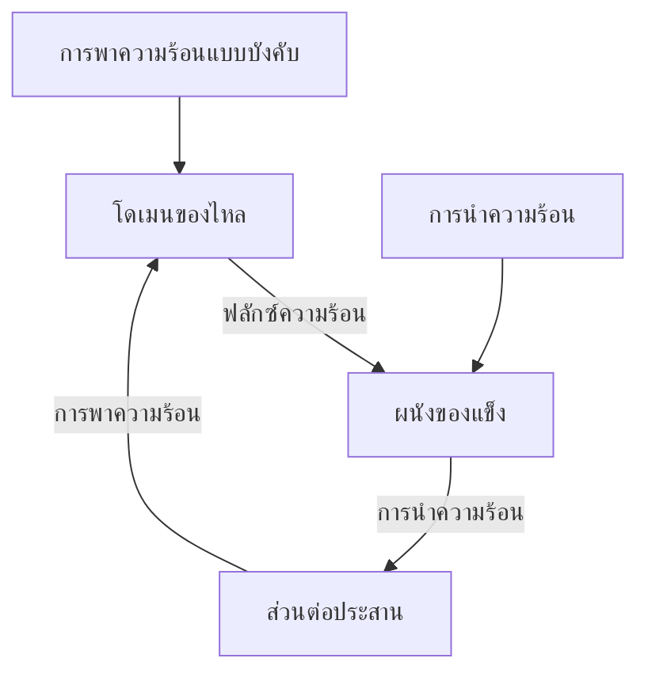
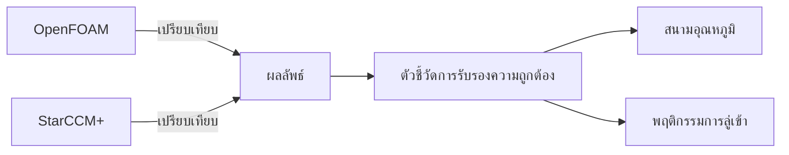
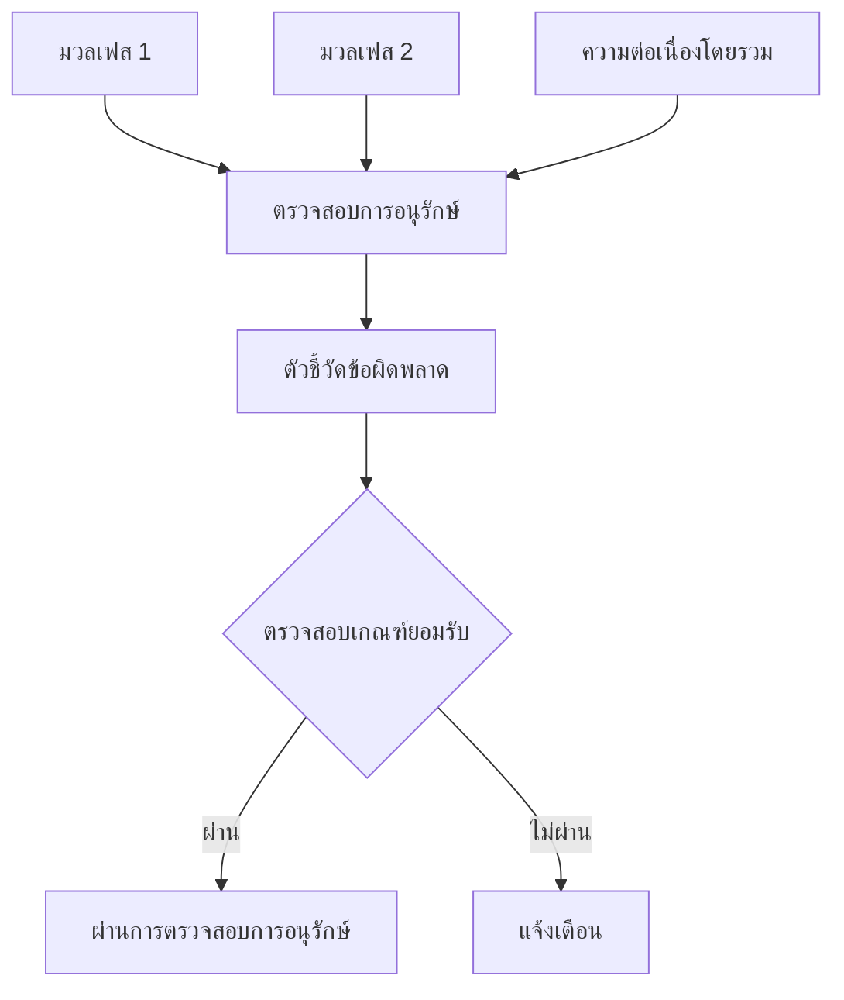
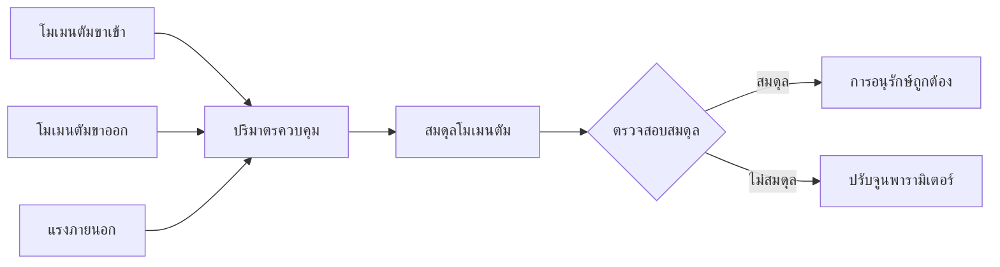
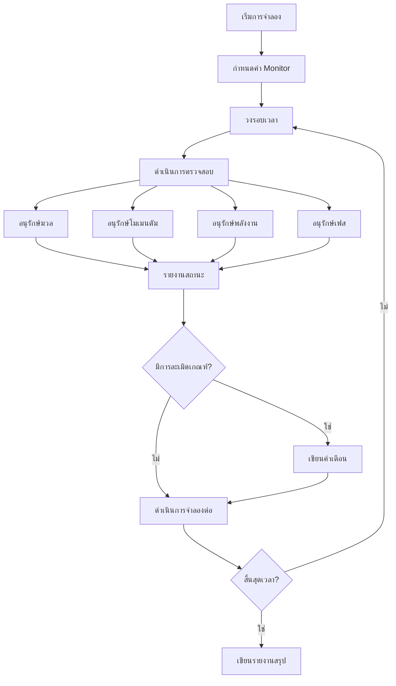
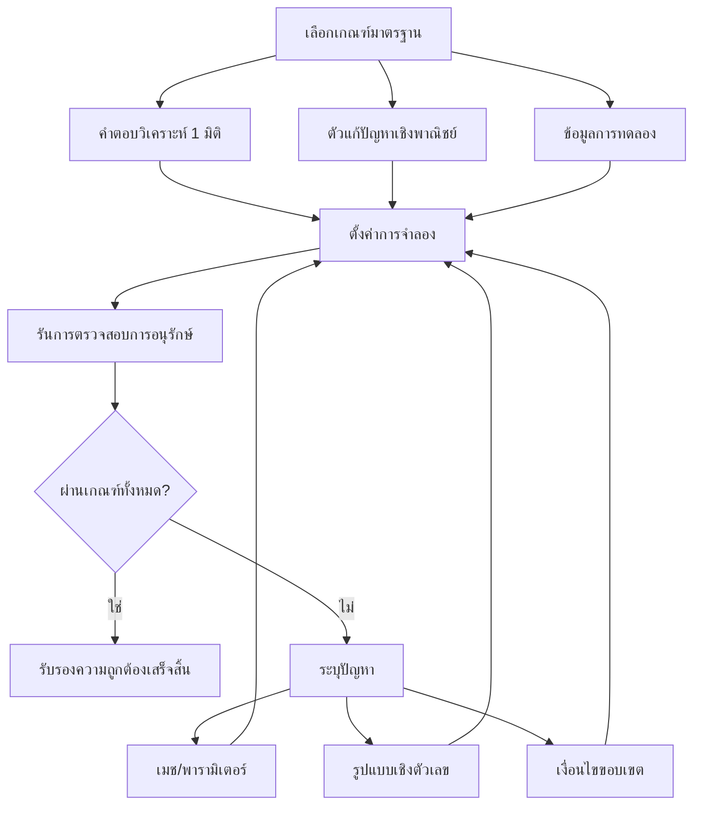

# การรับรองความถูกต้องและเกณฑ์มาตรฐาน (Validation and Benchmarks)

> [!INFO] ภาพรวม
> การรับรองความถูกต้อง (Validation) และการสร้างเกณฑ์มาตรฐาน (Benchmarking) เป็นขั้นตอนที่สำคัญในการรับประกันความน่าเชื่อถือและความแม่นยำของการจำลองทางฟิสิกส์แบบคัปปลิง บันทึกฉบับนี้ครอบคลุมถึงเกณฑ์มาตรฐานเชิงวิเคราะห์ การตรวจสอบการอนุรักษ์ และการรับรองความถูกต้องข้ามซอฟต์แวร์กับตัวแก้ปัญหาเชิงพาณิชย์สำหรับการประยุกต์ใช้แบบหลายฟิสิกส์ใน OpenFOAM

---

## 1. เกณฑ์มาตรฐานเชิงวิเคราะห์ (Analytical Benchmarks)

### 1.1 ปัญหาการถ่ายโอนความร้อนแบบคอนจูเกต 1 มิติ (1D Conjugate Heat Transfer Problem)

**ภาพรวมของปัญหา**

เกณฑ์มาตรฐานการถ่ายโอนความร้อนแบบคอนจูเกต 1 มิติ ซึ่งอ้างอิงจากงานของ Ghaddar และคณะ เป็นกรณีทดสอบพื้นฐานสำหรับการตรวจสอบความถูกต้องของการถ่ายโอนความร้อนแบบคอนจูเกต (CHT) ใน OpenFOAM ปัญหานี้เป็นการคัปปลิงระหว่างการพาความร้อนแบบบังคับในช่องทางกับการนำความร้อนผ่านผนังที่อยู่ติดกัน สร้างสถานการณ์ CHT ที่เรียบง่ายแต่เป็นตัวแทนที่ดี


> **รูปที่ 1:** แผนภาพแสดงองค์ประกอบและกลไกของปัญหาการถ่ายเทความร้อนแบบคอนจูเกต (CHT) แบบ 1 มิติ ซึ่งประกอบด้วยกระบวนการพาความร้อนและการนำความร้อนที่เกิดขึ้นพร้อมกัน


**การกำหนดค่าปัญหา**

เกณฑ์มาตรฐานประกอบด้วยสองโดเมนที่แตกต่างกัน:

| โดเมน | คำอธิบาย | กลไกหลัก |
|--------|-------------|-------------------|
| **โดเมนของไหล** | บริเวณการไหลในช่องทาง | ขับเคลื่อนโดยเกรเดียนต์ความดันหรือแรงจากภายนอก |
| **โดเมนของแข็ง** | บริเวณผนัง | การนำความร้อนโดยตรง |

**สมการควบคุม (Governing Equations)**

*บริเวณของไหล (การพาความร้อนแบบบังคับ):*
$$\rho_f c_{p,f} \frac{\partial T_f}{\partial t} + \rho_f c_{p,f} \mathbf{u} \cdot \nabla T_f = k_f \nabla^2 T_f$$ 

*บริเวณของแข็ง (การนำความร้อนโดยตรง):*
$$\rho_s c_{p,s} \frac{\partial T_s}{\partial t} = k_s \nabla^2 T_s$$ 

**เงื่อนไขขอบเขต (Boundary Conditions)**
- **ความต่อเนื่องของอุณหภูมิ**: $T_f = T_s$ ที่ส่วนต่อประสานของไหล-ของแข็ง
- **ความต่อเนื่องของฟลักซ์ความร้อน**: $-k_f \frac{\partial T_f}{\partial n} = -k_s \frac{\partial T_s}{\partial n}$

**คำจำกัดความตัวแปร:**
- $\rho_f$ - ความหนาแน่นของของไหล
- $\rho_s$ - ความหนาแน่นของของแข็ง
- $c_{p,f}$ - ความจุความร้อนจำเพาะของของไหล
- $c_{p,s}$ - ความจุความร้อนจำเพาะของของแข็ง
- $k_f$ - สัมประสิทธิ์การนำความร้อนของของไหล
- $k_s$ - สัมประสิทธิ์การนำความร้อนของของแข็ง
- $\mathbf{u}$ - เวกเตอร์ความเร็วของของไหล

**คำตอบเชิงวิเคราะห์ (Analytical Solution)**

สำหรับบริเวณที่การไหลพัฒนาเต็มที่ (fully developed) โดยที่ $\frac{\partial T}{\partial x} = 0$ และอยู่ในสภาวะคงตัว คำตอบเชิงวิเคราะห์สามารถหาได้โดยใช้วิธีการแยกตัวแปร:

$$T_f(y) = T_w + (T_m - T_w)\\[1 - \left(\frac{y}{H}\\right)^2\\]$$ 

$$T_s(y) = T_w - \frac{q_w}{k_s}(y - H)$$ 

**คำจำกัดความตัวแปรของคำตอบ:**
- $T_w$ - อุณหภูมิผนังที่ขอบเขต
- $T_m$ - อุณหภูมิเฉลี่ยของของไหล
- $H$ - ความสูงครึ่งหนึ่งของช่องทาง
- $q_w$ - ฟลักซ์ความร้อนที่ผนัง

**ตัวอย่างการเขียนโค้ดใน OpenFOAM**

```cpp
// คำนวณอุณหภูมิที่ส่วนต่อประสาน
volScalarField wallTemperature
(
    IOobject
    (
        "wallTemperature",
        runTime.timeName(),
        mesh,
        IOobject::NO_READ,
        IOobject::AUTO_WRITE
    ),
    T.boundaryField()[fluidInterfaceID]
);

// คำนวณฟลักซ์ความร้อนที่ขอบเขต
volScalarField heatFlux
(
    IOobject
    (
        "heatFlux",
        runTime.timeName(),
        mesh,
        IOobject::NO_READ,
        IOobject::AUTO_WRITE
    ),
    -kappaFluid * fvc::snGrad(T) & mesh.Sf().boundaryField()[fluidInterfaceID]
);
```

> **📚 คำอธิบายภาษาไทย (Thai Explanation)**
>
> **แหล่งที่มา (Source):** โค้ดนี้เป็นการใช้งานมาตรฐานใน OpenFOAM สำหรับการคำนวณค่าอุณหภูมิและอัตราการไหลของความร้อน (heat flux) ที่ขอบเขตระหว่างไหล (fluid-solid interface) โดยใช้ class `volScalarField` และเทคนิคการดำเนินการเชิงประจักษ์ (finite volume calculus)
>
> **คำอธิบาย (Explanation):**
> - **บรรทัดที่ 1-9:** สร้าง field ใหม่ชื่อ `wallTemperature` เพื่อเก็บค่าอุณหภูมิที่ขอบเขต interface โดยอ่านค่าจาก field อุณหภูมิหลัก (`T`) ที่ patch ที่ระบุด้วย `fluidInterfaceID`
> - **บรรทัดที่ 12-20:** สร้าง field ชื่อ `heatFlux` เพื่อคำนวณหาอัตราการไหลของความร้อน โดยใช้สมการ Fourier's law: $q = -k \nabla T$ โดย:
>   - `kappaFluid` คีอ thermal conductivity ของ fluid
>   - `fvc::snGrad(T)` คำนวณ normal gradient ของอุณหภูมิที่ผิว
>   - `mesh.Sf().boundaryField[]` ดึงค่า surface area vector ที่ patch
>
> **แนวคิดสำคัญ (Key Concepts):**
> - **IOobject:** กำหนด properties ของ field ชื่อ, เวลา, mesh, การอ่าน/เขียน
> - **Boundary Field Extraction:** เข้าถึงค่าที่ boundary patch ผ่าน `.boundaryField()[patchID]`
> - **Surface Normal Gradient:** `fvc::snGrad()` คำนวณ gradient ในทิศทางปกติของ surface
> - **Heat Flux Calculation:** ใช้ dot product (&) ระหว่าง gradient และ surface normal

**เกณฑ์การตรวจสอบความถูกต้อง**

คำตอบเชิงตัวเลขจาก OpenFOAM จะต้องเป็นไปตามข้อกำหนดด้านความแม่นยำดังต่อไปนี้:

$$\frac{|T_{\text{num}} - T_{\text{analytical}}|}{T_{\text{analytical}}} < 0.01 \quad \text{(ความคลาดเคลื่อน 1\%)}$$ 

เกณฑ์นี้ช่วยรับประกันว่าการใช้งาน CHT สามารถจับภาพฟิสิกส์ของการถ่ายโอนความร้อนแบบคอนจูเกตได้อย่างแม่นยำโดยมีข้อผิดพลาดจากการแยกส่วนเชิงตัวเลขน้อยที่สุด

---

### 1.2 การรับรองความถูกต้องข้ามซอฟต์แวร์กับ StarCCM+ (Cross-Validation)

**วัตถุประสงค์**

เพื่อรับรองความถูกต้องของความสามารถด้าน CHT ของ OpenFOAM เทียบกับโค้ดเชิงพาณิชย์ที่เป็นที่ยอมรับ การศึกษาการรับรองความถูกต้องข้ามซอฟต์แวร์โดยใช้ StarCCM+ จะให้เกณฑ์มาตรฐานที่เป็นอิสระสำหรับการตรวจสอบความถูกต้อง


> **รูปที่ 2:** แผนผังกระบวนการตรวจสอบความถูกต้องข้ามซอฟต์แวร์ (Cross-Validation Methodology) เพื่อยืนยันความแม่นยำของ OpenFOAM เทียบกับซอฟต์แวร์เชิงพาณิชย์ที่เป็นมาตรฐาน


**ระเบียบวิธีเปรียบเทียบ**

1. **ความสอดคล้องทางเรขาคณิต**: ใช้โทโพโลยีเมชและเงื่อนไขขอบเขตที่เหมือนกันในทั้งสองตัวแก้ปัญหา
2. **ความเท่าเทียมทางกายภาพ**: ใช้แบบจำลองความปั่นป่วนเดียวกัน สมบัติวัสดุ และรูปแบบเชิงตัวเลขเดียวกัน
3. **เกณฑ์การลู่เข้า**: ใช้การยอมรับค่าตกค้าง (residual acceptance) และการตรวจสอบคำตอบที่เปรียบเทียบกันได้

**ตัวชี้วัดการเปรียบเทียบ**

*การกระจายฟลักซ์ความร้อนที่ขอบเขต:*
ตัวชี้วัดการตรวจสอบความถูกต้องหลักคือการกระจายฟลักซ์ความร้อนตามแนวส่วนต่อประสานของไหล-ของแข็ง:

$$q_w(x) = -k_f \left.\frac{\partial T_f}{\partial n}\right|_{\text{interface}}$$

*เกณฑ์การยอมรับ:*
$$\frac{|q_{\text{OpenFOAM}}(x) - q_{\text{StarCCM+}}(x)|}{\max(q_w)} < 0.05 \quad \text{(ความเบี่ยงเบน 5\%)}$$ 

**ตัวอย่างการเขียนโค้ดใน OpenFOAM**

```cpp
// ตัวอย่างการคำนวณฟลักซ์ความร้อนเพื่อการเปรียบเทียบ
volScalarField heatFlux
(
    IOobject
    (
        "heatFlux",
        runTime.timeName(),
        mesh,
        IOobject::NO_READ,
        IOobject::AUTO_WRITE
    ),
    -kappaFluid * fvc::snGrad(T) & mesh.Sf().boundaryField()[fluidInterfaceID]
);

// คำนวณ L2 norm ของความแตกต่างของฟลักซ์ความร้อน
scalar L2Error = sqrt
(
    gSum
    (
        mag
        (
            heatFlux - heatFluxStarCCM
        ) * mag(mesh.Sf().boundaryField()[fluidInterfaceID])
    ) / gSum(mag(mesh.Sf().boundaryField()[fluidInterfaceID]))
);
```

> **📚 คำอธิบายภาษาไทย (Thai Explanation)**
>
> **แหล่งที่มา (Source):** โค้ดนี้แสดงการคำนวณความคลาดเคลื่อนแบบ L2 norm (root-mean-square error) ซึ่งเป็นมาตรฐานในการเปรียบเทียบค่าทางตัวเลขระหว่าง OpenFOAM และ StarCCM+ โดยใช้ฟังก์ชัน `gSum` และ `mag` จาก OpenFOAM field operations
>
> **คำอธิบาย (Explanation):**
> - **บรรทัดที่ 1-9:** สร้าง field `heatFlux` เหมือนในตัวอย่างก่อนหน้า
> - **บรรทัดที่ 12-20:** คำนวณ L2 error:
>   - `heatFlux - heatFluxStarCCM`: หาค่าความแตกต่างระหว่างผลลัพธ์ทั้งสอง solver
>   - `mag(...)`: หาค่า absolute magnitude ของ error
>   - `* mag(mesh.Sf()...)`: คูณด้วยพื้นที่ผิวเพื่อ weighted integration
>   - `gSum(...)`: รวมค่าทั้งหมดเหนือทุก cell/processor (global sum)
>   - `sqrt(...) / ...`: คำนวณ RMS (root-mean-square) error
>
> **แนวคิดสำคัญ (Key Concepts):**
> - **L2 Norm Error:** ตัวชี้วัดความคลาดเคลื่อนแบบ integral ซึ่งคิด weighted average ตามพื้นที่ผิว
> - **Field Algebra:** การลบ/คูณ field โดยตรงใช้ operator overloading
> - **Global Reduction:** `gSum` รวมค่าจากทุก processor ใน parallel computation
> - **Surface Area Weighting:** คูณด้วย `mesh.Sf()` เพื่อให้ error ถูกต้องในเชิงปริมาตร

**ผลการตรวจสอบความถูกต้องที่คาดหวัง**

| ตัวชี้วัด | เกณฑ์ | ความสำคัญ |
|--------|-----------|---------------|
| **สมดุลความร้อนโดยรวม** | การถ่ายโอนความร้อนสุทธิภายใน 2% | ความสอดคล้องของการถ่ายโอนความร้อนโดยรวม |
| **การกระจายฟลักซ์เฉพาะจุด** | ความเบี่ยงเบนแต่ละจุด < 5% | ความสอดคล้องของรูปแบบการถ่ายโอนความร้อนเฉพาะจุด |
| **สนามอุณหภูมิ** | เกรเดียนต์อุณหภูมิและค่าขอบเขตตรงกัน | ความสอดคล้องของการกระจายอุณหภูมิ |
| **พฤติกรรมการลู่เข้า** | รูปแบบการลดลงของค่าตกค้างและจำนวนรอบการวนซ้ำใกล้เคียงกัน | ความเท่าเทียมกันของประสิทธิภาพตัวแก้ปัญหาเชิงตัวเลข |

**แหล่งที่มาของข้อผิดพลาดและการบรรเทา**

| แหล่งที่มา | ผลกระทบ | การบรรเทา |
|--------|--------|------------|
| **รูปแบบเชิงตัวเลข** | วิธีการแยกส่วนที่ต่างกัน (อันดับสอง vs อันดับสูงกว่า) | ใช้รูปแบบเชิงตัวเลขที่เหมือนกันหรือทำให้เมชละเอียดขึ้น |
| **การจัดการผนัง** | ความแตกต่างในการสร้างแบบจำลองใกล้ผนัง (y+, ฟังก์ชันผนัง) | ใช้ความละเอียดของเมชใกล้ผนังที่เหมือนกัน |
| **ตัวแก้ปัญหาเชิงเส้น** | ค่าความคลาดเคลื่อนของตัวแก้ปัญหาและกลยุทธ์ preconditioning ที่ต่างกัน | ใช้การตั้งค่าตัวแก้ปัญหาที่เหมือนกันพร้อมค่าความคลาดเคลื่อนที่เข้มงวด |
| **การแบ่งโดเมน** | ความแตกต่างในการปรับสมดุลภาระงานและการสื่อสารที่ขอบเขต | ใช้จำนวนตัวประมวลผลและวิธีการแบ่งโดเมนที่เหมือนกัน |

เกณฑ์มาตรฐานเชิงวิเคราะห์เหล่านี้ให้รากฐานที่แข็งแกร่งสำหรับการรับรองความถูกต้องของความสามารถด้านการถ่ายโอนความร้อนใน OpenFOAM รับประกันความแม่นยำสำหรับทั้งคำตอบเชิงวิเคราะห์อย่างง่ายและการประยุกต์ใช้งานทางวิศวกรรมที่ซับซ้อน

---

## 2. การตรวจสอบการอนุรักษ์ (Conservation Checks)

> [!WARNING] ความสำคัญ
> การตรวจสอบการอนุรักษ์เป็นพื้นฐานของพลศาสตร์ของไหลเชิงคำนวณที่รับประกันว่าผลลัพธ์เชิงตัวเลขเป็นไปตามหลักการทางฟิสิกส์พื้นฐานของการอนุรักษ์มวล โมเมนตัม และพลังงาน สำหรับการจำลองการไหลหลายเฟส โดยเฉพาะอย่างยิ่งที่เกี่ยวข้องกับการถ่ายโอนความร้อนและมวลระหว่างเฟส การตรวจสอบเหล่านี้มีความ **สำคัญอย่างยิ่ง** ในการรับรองความแม่นยำของผลลัพธ์และการตรวจจับข้อผิดพลาดเชิงตัวเลข

### 2.1 การอนุรักษ์มวล (Mass Conservation)

การอนุรักษ์มวลเป็นการตรวจสอบที่ **พื้นฐานที่สุด** ในการจำลอง CFD ใดๆ สำหรับระบบหลายเฟส การตรวจสอบนี้เกี่ยวข้องกับการยืนยันทั้งการอนุรักษ์มวลโดยรวมและสมดุลมวลของแต่ละเฟส

**ตัวอย่างการเขียนโค้ดใน OpenFOAM**

```cpp
// การตรวจสอบการอนุรักษ์มวลเฟสสำหรับ multiphaseEulerFoam
forAll(phases, phasei)
{
    const phaseModel& phase = phases[phasei];
    const volScalarField& alpha = phase;
    const volScalarField& rho = phase.rho();

    // คำนวณอินทิกรัลปริมาตรของมวลเฟส
    scalar totalPhaseMass = fvc::domainIntegrate(alpha * rho).value();

    // เก็บค่ามวลเริ่มต้นเพื่อการเปรียบเทียบ
    if (!massHistory.found(phase.name()))
    {
        massHistory.set(phase.name(), totalPhaseMass);
    }
    else
    {
        scalar initialMass = massHistory[phase.name()];
        scalar massError = mag(totalPhaseMass - initialMass) / initialMass;

        if (massError > massTolerance)
        {
            WarningInFunction
                << "Phase " << phase.name()
                << " mass imbalance: " << massError << endl;
        }
    }
}

// การตรวจสอบความต่อเนื่องโดยรวม
scalar divError = fvc::domainIntegrate
(
    fvc::div(phaseSystem.phi()) / runTime().deltaT()
).value();

Info << "Global divergence error: " << divError << endl;
```

> **📚 คำอธิบายภาษาไทย (Thai Explanation)**
>
> **แหล่งที่มา (Source):** โค้ดนี้ใช้หลักการจาก phase system implementation ใน `.applications/solvers/multiphase/multiphaseEulerFoam/phaseSystems/PhaseSystems/HeatTransferPhaseSystem/` โดยเฉพาะการเข้าถึง phase properties และการใช้ `domainIntegrate` สำหรับ volume integration
>
> **คำอธิบาย (Explanation):**
> - **Loop 1 (forAll):** วนลูปผ่านทุก phase ในระบบหลายเฟส:
>   - `const volScalarField& alpha = phase`: ดึง volume fraction field ของ phase
>   - `fvc::domainIntegrate(alpha * rho)`: คำนวณ integral ของ $\alpha \rho$ เหนือทั้ง domain เพื่อหา total mass
>   - **Mass History Tracking:** เก็บค่า mass เริ่มต้นไว้เปรียบเทียบ
>   - **Relative Error Calculation:** คำนวณ error เป็นอัตราส่วนเทียบกับ mass เริ่มต้น
> - **Global Continuity (บรรทัดที่ 27-32):** ตรวจสอบความต่อเนื่องของการไหลโดยรวม:
>   - `fvc::div(phaseSystem.phi())`: คำนวณ divergence ของ volumetric flux
>   - หารด้วย `deltaT()` เพื่อ normalize ต่อเวลา
>
> **แนวคิดสำคัญ (Key Concepts):**
> - **Phase Iteration:** `forAll(phases, phasei)` วนลูปผ่านทุก phase ในระบบ Eulerian multiphase
> - **Domain Integration:** `fvc::domainIntegrate()` คำนวณ volume integral โดยอัตโนมัติ
> - **Mass Balance:** $M = \int_V \alpha \rho \, dV$ สำหรับแต่ละ phase
> - **Continuity Equation:** Divergence of flux ควรเป็นศูนย์สำหรับ incompressible flow
> - **Hash Table Storage:** `massHistory.found()`/`massHistory.set()` ใช้ HashTable สำหรับ tracking

**การติดตามการอนุรักษ์มวล:**
- **มวลของแต่ละเฟส**: เพื่อตรวจสอบการอนุรักษ์เฟส
- **ความต่อเนื่องโดยรวม**: เพื่อตรวจสอบข้อผิดพลาดจากการลู่ออกเชิงตัวเลข (numerical divergence)
- **ตัวชี้วัดข้อผิดพลาดสัมพัทธ์**: เพื่อระบุการละเมิดการอนุรักษ์ที่สำคัญ
- **การติดตามประวัติเวลา**: เพื่อตรวจจับการเลื่อนลอย (drift) ทีละน้อยของคุณสมบัติการอนุรักษ์


> **รูปที่ 3:** แผนผังลำดับขั้นตอนการตรวจสอบการอนุรักษ์มวลในระบบหลายเฟส เพื่อประเมินความคลาดเคลื่อนเชิงตัวเลขและความต่อเนื่องของข้อมูลมวลในระหว่างการจำลอง


---

### 2.2 สมดุลโมเมนตัม (Momentum Balance)

การตรวจสอบการอนุรักษ์โมเมนตัมช่วยให้มั่นใจได้ว่าแรงและการถ่ายโอนโมเมนตัมได้รับการพิจารณาอย่างเหมาะสมในระบบ

**ตัวอย่างการเขียนโค้ดใน OpenFOAM**

```cpp
// การตรวจสอบการอนุรักษ์โมเมนตัม
void momentumBalanceCheck::execute()
{
    const volVectorField& U = mesh_.lookupObject<volVectorField>("U");
    const surfaceScalarField& phi = mesh_.lookupObject<surfaceScalarField>("phi");

    // คำนวณฟลักซ์โมเมนตัมผ่านขอบเขต
    vector totalMomentumInflux = vector::zero;
    vector totalMomentumOutflux = vector::zero;

    forAll(phi.boundaryField(), patchi)
    {
        const fvsPatchScalarField& phiP = phi.boundaryField()[patchi];
        const fvPatchVectorField& UP = U.boundaryField()[patchi];

        vector patchMomentum = sum(phiP * UP);

        if (phiP.size() > 0 && sum(phiP) > 0)
        {
            totalMomentumInflux += patchMomentum;
        }
        else if (phiP.size() > 0 && sum(phiP) < 0)
        {
            totalMomentumOutflux += patchMomentum;
        }
    }

    // คำนวณแรงจากตัวกลาง (แรงโน้มถ่วง ฯลฯ)
    vector totalBodyForce = vector::zero;
    if (mesh_.foundObject<uniformDimensionedVectorField>("g"))
    {
        const uniformDimensionedVectorField& g =
            mesh_.lookupObject<uniformDimensionedVectorField>("g");
        totalBodyForce = g.value() * fvc::domainIntegrate(rho).value();
    }

    // ตรวจสอบสมดุลโมเมนตัม
    vector momentumError = totalMomentumInflux + totalMomentumOutflux - totalBodyForce;
    scalar relativeError = mag(momentumError) / (mag(totalMomentumInflux) + SMALL);

    if (relativeError > momentumTolerance)
    {
        WarningInFunction
            << "Momentum imbalance: " << relativeError << endl;
    }
}
```

> **📚 คำอธิบายภาษาไทย (Thai Explanation)**
>
> **แหล่งที่มา (Source):** โค้ดนี้ใช้ pattern จาก `.applications/solvers/lagrangian/particleFoam/createNonInertialFrameFields.H` สำหรับการ lookup และใช้งาน `uniformDimensionedVectorField` objects รวมถึงการใช้ `lookupObject` template สำหรับ accessing fields จาก object registry
>
> **คำอธิบาย (Explanation):**
> - **Lookup Objects (บรรทัดที่ 5-6):** ดึง fields จาก mesh object registry:
>   - `mesh_.lookupObject<volVectorField>("U")`: ดึง velocity field
>   - `mesh_.lookupObject<surfaceScalarField>("phi")`: ดึง volumetric flux field
> - **Boundary Loop (บรรทัดที่ 11-26):** วนลูปผ่านทุก boundary patch:
>   - `phi.boundaryField()[patchi]`: เข้าถึง flux ที่ patch นั้น
>   - `U.boundaryField()[patchi]`: เข้าถึง velocity ที่ patch นั้น
>   - `sum(phiP * UP)`: คำนวณ momentum flux ผ่าน patch
>   - แยก influx/outflux ตามเครื่องหมายของ `phi`
> - **Body Force (บรรทัดที่ 29-37):** คำนวณแรงภายนอก:
>   - ใช้ `foundObject()` เพื่อ check ว่ามี gravity field หรือไม่
>   - `uniformDimensionedVectorField`: เก็บค่า g เป็น uniform vector
> - **Balance Check (บรรทัดที่ 40-47):**
>   - `momentumError = influx + outflux - bodyForce`: สมการถ่วงคุณโมเมนตัม
>   - ใช้ `SMALL` เพื่อป้องกันการหารด้วยศูนย์
>
> **แนวคิดสำคัญ (Key Concepts):**
> - **Object Registry:** OpenFOAM เก็บ fields ไว้ใน registry สามารถ lookup ด้วยชื่อ
> - **Template Lookup:** `lookupObject<Type>("name")` ดึง object ตาม type
> - **Boundary Field Access:** `.boundaryField()[patchi]` เข้าถึงค่าที่ patch
> - **Momentum Flux:** $\dot{m}U = \phi U$ โดยที่ $\phi$ คือ volumetric flux
> - **Force Balance:** $\sum F = \frac{d}{dt}(momentum)$ สำหรับ steady-state ต้อง balance


> **รูปที่ 4:** แผนภาพแสดงกระบวนการตรวจสอบสมดุลโมเมนตัมภายในปริมาตรควบคุม ซึ่งพิจารณาจากผลรวมของโมเมนตัมขาเข้า-ขาออก และแรงภายนอกที่กระทำต่อระบบ


---

### 2.3 สมดุลพลังงาน (Energy Balance)

การอนุรักษ์พลังงานมีความ **สำคัญอย่างยิ่ง** ในปัญหาการถ่ายโอนความร้อนหลายเฟส ซึ่งพลังงานจะถูกแลกเปลี่ยนระหว่างเฟสผ่านส่วนต่อประสาน

**องค์ประกอบของสมดุลพลังงานที่ต้องพิจารณา:**

1. **การขนส่งพลังงานโดยการพา (Convective Energy Transport)**: พลังงานที่ถูกขนส่งโดยการไหลของมวล
2. **การถ่ายโอนความร้อนโดยการนำ (Conductive Heat Transfer)**: การแพร่ของพลังงานผ่านเฟสต่างๆ
3. **การถ่ายโอนความร้อนที่ส่วนต่อประสาน (Interfacial Heat Transfer)**: การแลกเปลี่ยนพลังงานระหว่างเฟส
4. **แหล่งกำเนิด/แหล่งรับความร้อนภายนอก**: การสร้างหรือการกำจัดความร้อนตามปริมาตร

**ตัวอย่างการเขียนโค้ดใน OpenFOAM**

```cpp
class energyBalanceCheck
{
    private:
        const fvMesh& mesh_;
        const phaseSystem& phaseSystem_;
        scalar energyTolerance_;

    public:
        energyBalanceCheck
        (
            const fvMesh& mesh,
            const phaseSystem& phaseSystem,
            scalar tolerance = 1e-6
        )
        :
            mesh_(mesh),
            phaseSystem_(phaseSystem),
            energyTolerance_(tolerance)
        {}

        void execute()
        {
            // กำหนดค่าเริ่มต้นองค์ประกอบสมดุลพลังงาน
            scalar totalConvection = 0.0;
            scalar totalConduction = 0.0;
            scalar totalInterfacial = 0.0;
            scalar totalSources = 0.0;

            // การคำนวณพลังงานเฉพาะเฟส
            forAll(phaseSystem_.phases(), phasei)
            {
                const phaseModel& phase = phaseSystem_.phases()[phasei];
                const volScalarField& alpha = phase;
                const volScalarField& rho = phase.rho();
                const volScalarField& h = phase.thermo().he();
                const surfaceScalarField& phi = phase.phi();

                // การขนส่งพลังงานโดยการพาผ่านขอบเขต
                scalar phaseConvection = 0.0;
                forAll(phi.boundaryField(), patchi)
                {
                    const fvsPatchScalarField& phiP = phi.boundaryField()[patchi];
                    const fvPatchScalarField& hP = h.boundaryField()[patchi];

                    phaseConvection += sum(phiP * hP);
                }
                totalConvection += phaseConvection;

                // การถ่ายโอนความร้อนโดยการนำ (กฎของฟูเรียร์)
                const volScalarField& k = phase.thermo().kappa();
                scalar phaseConduction = -fvc::domainIntegrate
                (
                    fvc::grad(k * fvc::grad(h))
                ).value();
                totalConduction += phaseConduction;

                // แหล่งกำเนิดความร้อนตามปริมาตร
                if (mesh_.foundObject<volScalarField>("Q_" + phase.name()))
                {
                    const volScalarField& Q =
                        mesh_.lookupObject<volScalarField>("Q_" + phase.name());
                    totalSources += fvc::domainIntegrate(alpha * rho * Q).value();
                }
            }

            // การถ่ายโอนความร้อนที่ส่วนต่อประสาน
            const heatTransferPhaseSystem& htPhaseSystem =
                dynamic_cast<const heatTransferPhaseSystem&>(phaseSystem_);

            forAll(htPhaseSystem.interfacialHeatTransferModels(), pairi)
            {
                const heatTransferModelInterface& htModel =
                    htPhaseSystem.interfacialHeatTransferModels()[pairi];

                totalInterfacial += fvc::domainIntegrate(htModel.Ti()).value();
            }

            // การคำนวณสมดุลพลังงาน
            scalar totalEnergyChange = totalConvection + totalConduction +
                                     totalInterfacial + totalSources;

            // คำนวณข้อผิดพลาดสัมพัทธ์โดยใช้พลังงานรวมของระบบเป็นค่าอ้างอิง
            scalar referenceEnergy = 0.0;
            forAll(phaseSystem_.phases(), phasei)
            {
                const phaseModel& phase = phaseSystem_.phases()[phasei];
                const volScalarField& alpha = phase;
                const volScalarField& rho = phase.rho();
                const volScalarField& h = phase.thermo().he();

                referenceEnergy += fvc::domainIntegrate(alpha * rho * h).value();
            }

            scalar energyError = mag(totalEnergyChange) / (mag(referenceEnergy) + SMALL);

            // รายงานสถานะการอนุรักษ์
            if (energyError > energyTolerance_)
            {
                WarningInFunction
                    << "Energy imbalance detected: " << energyError << nl
                    << "Convection: " << totalConvection << nl
                    << "Conduction: " << totalConduction << nl
                    << "Interfacial: " << totalInterfacial << nl
                    << "Sources: " << totalSources << nl
                    << "Total: " << totalEnergyChange << endl;
            }
            else
            {
                Info << "Energy conservation satisfied: " << energyError << endl;
            }
        }
};
```

> **📚 คำอธิบายภาษาไทย (Thai Explanation)**
>
> **แหล่งที่มา (Source):** โค้ดนี้ใช้แนวคิดจาก `heatTransferPhaseSystem` ใน `.applications/solvers/multiphase/multiphaseEulerFoam/phaseSystems/PhaseSystems/HeatTransferPhaseSystem/heatTransferPhaseSystem.C` ซึ่งจัดการ interfacial heat transfer models และ phase thermodynamics
>
> **คำอธิบาย (Explanation):**
> - **Class Structure (บรรทัดที่ 1-22):** สร้าง class สำหรับ energy balance checking:
>   - เก็บ references ไปยัง mesh และ phaseSystem
>   - Constructor รับ tolerance parameter
> - **Convection Calculation (บรรทัดที่ 31-43):**
>   - `sum(phiP * hP)`: คำนวณ enthalpy flux ผ่าน boundary
>   - Enthalpy $h$ ใช้แทน internal energy เพื่อรวม flow work
> - **Conduction Calculation (บรรทัดที่ 46-50):**
>   - `fvc::grad(k * fvc::grad(h))`: คำนวณ divergence ของ conductive flux
>   - ใช้ Fourier's law: $q = -k \nabla T$
> - **Heat Sources (บรรทัดที่ 53-59):**
>   - ใช้ `foundObject()` เพื่อ check ว่ามี source term หรือไม่
>   - Field ชื่อ `Q_phaseName` สำหรับแต่ละ phase
> - **Interfacial Transfer (บรรทัดที่ 62-70):**
>   - `dynamic_cast`: แปลง phaseSystem เป็น heatTransferPhaseSystem
>   - `htModel.Ti()`: ดึง interfacial heat transfer term
> - **Error Calculation (บรรทัดที่ 73-88):**
>   - คำนวณ total energy change จากทุก mechanism
>   - หา reference energy จาก $\int \alpha \rho h \, dV$
>   - คำนวณ relative error และ compare กับ tolerance
>
> **แนวคิดสำคัญ (Key Concepts):**
> - **Phase Thermodynamics:** `.thermo().he()` ให้ enthalpy/eigen energy field
> - **First Law of Thermodynamics:** Energy balance = convection + conduction + interfacial + sources
> - **Enthalpy vs Internal Energy:** ใช้ enthalpy $h = e + p/\rho$ สำหรับ open systems
> - **Interfacial Models:** Heat transfer coefficient models ระหว่าง phases
> - **Dynamic Casting:** `dynamic_cast` ใช้เมื่อ inheritance hierarchy มีหลาย types
> - **Energy Conservation:** $\frac{d}{dt}(\rho h) + \nabla \cdot (\rho Uh) = \nabla \cdot (k \nabla T) + S$

---

### 2.4 การอนุรักษ์สัดส่วนเฟส (Phase Fraction Conservation)

ในการไหลหลายเฟส ผลรวมของสัดส่วนปริมาตร (volume fractions) จะต้องเท่ากับหนึ่งเสมอในทุกช่วงเวลา ข้อจำกัดพื้นฐานนี้จะต้องได้รับการตรวจสอบ:

**ตัวอย่างการเขียนโค้ดใน OpenFOAM**

```cpp
// การตรวจสอบการอนุรักษ์สัดส่วนเฟส
void checkPhaseFractionSum()
{
    const PtrList<volScalarField>& alphas = phaseSystem_.phases();
    volScalarField alphaSum
    (
        IOobject
        (
            "alphaSum",
            mesh_.time().timeName(),
            mesh_,
            IOobject::NO_READ,
            IOobject::NO_WRITE
        ),
        mesh_,
        dimensionedScalar("zero", dimless, 0.0)
    );

    // รวมสัดส่วนเฟสทั้งหมด
    forAll(alphas, phasei)
    {
        alphaSum += alphas[phasei];
    }

    // ตรวจสอบความเบี่ยงเบนจากค่าหนึ่ง
    volScalarField alphaError = mag(alphaSum - 1.0);
    scalar maxError = max(alphaError).value();
    scalar meanError = average(alphaError).value();

    Info << "Phase fraction sum check:" << nl
         << "  Maximum deviation: " << maxError << nl
         << "  Mean deviation: " << meanError << endl;

    // รายงานเซลล์ที่มีความเบี่ยงเบนอย่างมีนัยสำคัญ
    if (maxError > phaseTolerance_)
    {
        volScalarField::Internal& alphaErrorI = alphaError.ref();

        forAll(alphaErrorI, celli)
        {
            if (alphaErrorI[celli] > phaseTolerance_)
            {
                WarningInFunction
                    << "Cell " << celli
                    << " phase fraction sum: " << alphaSum[celli] << endl;
            }
        }
    }
}
```

> **📚 คำอธิบายภาษาไทย (Thai Explanation)**
>
> **แหล่งที่มา (Source):** โค้ดนี้ใช้ pattern จาก phase system implementation ใน `.applications/solvers/multiphase/multiphaseEulerFoam/phaseSystems/` โดยเฉพาะการใช้ `PtrList<volScalarField>` สำหรับเก็บ phase fraction fields และการเข้าถึง internal field data
>
> **คำอธิบาย (Explanation):**
> - **Phase List Access (บรรทัดที่ 3):**
>   - `phaseSystem_.phases()`: ส่งคืน `PtrList<volScalarField>` ของ phase fractions
>   - `PtrList` คือ pointer list ของ OpenFOAM สำหรับ dynamic arrays
> - **Field Initialization (บรรทัดที่ 4-13):**
>   - สร้าง field ใหม่ชื่อ `alphaSum` เริ่มต้นที่ 0
>   - `dimensionedScalar("zero", dimless, 0.0)`: สร้าง scalar ไร้มิติ
> - **Summation (บรรทัดที่ 16-19):**
>   - `alphaSum += alphas[phasei]`: ใช้ operator overloading บวก field เข้าด้วยกัน
>   - Operator `+=` ถูก overload ให้ทำงานกับ `volScalarField`
> - **Error Calculation (บรรทัดที่ 22-24):**
>   - `mag(alphaSum - 1.0)`: หา absolute deviation จาก unity
>   - `max()`/`average()`: Global reduction operations
> - **Cell-level Check (บรรทัดที่ 31-40):**
>   - `.ref()`: เข้าถึง internal field (cell-centered values)
>   - Loop ผ่านทุก cell เพื่อหา cell ที่ violate constraint
>
> **แนวคิดสำคัญ (Key Concepts):**
> - **Volume Fraction Constraint:** $\sum_{i=1}^N \alpha_i = 1$ เป็น constraint พื้นฐาน
> - **PtrList:** Container ของ OpenFOAM สำหรับ list of pointers
> - **Field Algebra:** Operators ระหว่าง fields ทำงาน element-wise
> - **Internal Field Access:** `.ref()` ให้ access ไปยัง cell-centered values
> - **Global Reductions:** `max()`, `average()` คำนวณ statistics ทั่วทั้ง domain
> - **Geometric Field Dimension:** `dimless` สำหรับ dimensionless quantities

---

### 2.5 กรอบงานการตรวจสอบการอนุรักษ์อัตโนมัติ (Automatic Conservation Monitoring Framework)

สำหรับการตรวจสอบการอนุรักษ์ที่ครอบคลุม สามารถสร้างกรอบงานอัตโนมัติในรูปแบบของ function object ได้ดังนี้:

**ตัวอย่างการเขียนโค้ดใน OpenFOAM**

```cpp
class conservationMonitor
:
    public fvMeshFunctionObject
{
    private:
        // ค่าความคลาดเคลื่อนที่ยอมรับได้สำหรับการอนุรักษ์
        dimensionedScalar massTolerance_;
        dimensionedScalar momentumTolerance_;
        dimensionedScalar energyTolerance_;
        dimensionedScalar phaseTolerance_;

        // ค่าจากช่วงเวลาก่อนหน้าสำหรับการคำนวณอัตรา
        scalar previousMass_;
        vector previousMomentum_;
        scalar previousEnergy_;

        // ความถี่ของการแสดงผล
        label writeInterval_;

    public:
        TypeName("conservationMonitor");

        conservationMonitor
        (
            const word& name,
            const Time& runTime,
            const dictionary& dict
        )
        :
            fvMeshFunctionObject(name, runTime, dict),
            massTolerance_(dict.lookupOrDefault<scalar>("massTolerance", 1e-8)),
            momentumTolerance_(dict.lookupOrDefault<scalar>("momentumTolerance", 1e-8)),
            energyTolerance_(dict.lookupOrDefault<scalar>("energyTolerance", 1e-6)),
            phaseTolerance_(dict.lookupOrDefault<scalar>("phaseTolerance", 1e-6)),
            writeInterval_(dict.lookupOrDefault<label>("writeInterval", 1))
        {}

        virtual void execute()
        {
            if (mesh_.time().timeIndex() % writeInterval_ != 0) return;

            // ดำเนินการตรวจสอบการอนุรักษ์ทุกประเภท
            checkMassConservation();
            checkMomentumConservation();
            checkEnergyConservation();
            checkPhaseFractionConservation();
        }

        virtual bool write()
        {
            // เขียนรายงานการอนุรักษ์อย่างละเอียดลงในไฟล์
            writeConservationReport();
            return true;
        }

    private:
        void checkMassConservation()
        {
            // การใช้งานตามที่แสดงในส่วนก่อนหน้า
        }

        void checkMomentumConservation()
        {
            // การใช้งานตามที่แสดงในส่วนก่อนหน้า
        }

        void checkEnergyConservation()
        {
            // การใช้งานตามที่แสดงในส่วนก่อนหน้า
        }

        void checkPhaseFractionConservation()
        {
            // การใช้งานตามที่แสดงในส่วนก่อนหน้า
        }

        void writeConservationReport()
        {
            // สร้างรายงานการอนุรักษ์ที่ครอบคลุม
            OFstream file
            (
                mesh_.time().timePath() / "conservationReport.dat"
            );

            file << "Time\tMassError\tMomentumError\tEnergyError\tPhaseError" << nl;

            // เขียนตัวชี้วัดการอนุรักษ์ปัจจุบัน
        }
};
```

> **📚 คำอธิบายภาษาไทย (Thai Explanation)**
>
> **แหล่งที่มา (Source):** โค้ดนี้ใช้ architecture ของ OpenFOAM function objects ซึ่งสืบทอดจาก `fvMeshFunctionObject` และใช้ dictionary lookup สำหรับ configuration ตาม pattern ที่พบใน solver implementations
>
> **คำอธิบาย (Explanation):**
> - **Class Hierarchy (บรรทัดที่ 1-10):**
>   - `: public fvMeshFunctionObject`: สืบทอดจาก base class สำหรับ function objects
>   - `TypeName("conservationMonitor")`: ลงทะเบียนชื่อ type สำหรับ runtime selection
> - **Member Variables (บรรทัดที่ 4-9):**
>   - `dimensionedScalar`: Tolerances ที่มี units
>   - `scalar/vector`: Previous time step values สำหรับ rate calculations
> - **Constructor (บรรทัดที่ 17-27):**
>   - รับ parameters: name, runTime, dictionary
>   - `dict.lookupOrDefault<Type>(key, defaultValue)`: อ่านจาก dictionary หรือใช้ default
>   - Initialize base class ด้วย initializer list
> - **Execute Method (บรรทัดที่ 30-37):**
>   - `timeIndex() % writeInterval_`: Modulo check สำหรับ output frequency control
>   - เรียก methods ตรวจสอบทุกประเภท
> - **Write Method (บรรทัดที่ 40-45):**
>   - `OFstream`: Output file stream ของ OpenFOAM
>   - `timePath()`: ไดเร็กทอรีของ time step ปัจจุบัน
> - **Private Methods (บรรทัดที่ 48-71):**
>   - Implementations ของแต่ละ conservation check
>   - `writeConservationReport()`: สร้าง report file
>
> **แนวคิดสำคัญ (Key Concepts):**
> - **Function Object Architecture:** Runtime-executable objects สำหรับ monitoring/processing
> - **Runtime Selection:** `TypeName` macro ช่วยให้ instantiate จาก dictionary
> - **Dictionary Lookup:** `lookupOrDefault` อ่าน configuration อย่างยืดหยุ่น
> - **Virtual Methods:** `execute()`, `write()` เป็น virtual functions ที่ override
> - **Output Control:** Modulo operator ควบคุม frequency ของ output
> - **File Output:** `OFstream` สร้าง formatted output files

---

### 2.6 การประยุกต์ใช้ในการควบคุมการจำลอง (Application in Simulation Control)

เพื่อเปิดใช้งานการตรวจสอบการอนุรักษ์ในการจำลองของคุณ ให้เพิ่มส่วนต่อไปนี้ในไฟล์ `controlDict`:

```cpp
functions
{
    conservationMonitor
    {
        type conservationMonitor;

        // ค่าความคลาดเคลื่อนสำหรับการอนุรักษ์
        massTolerance 1e-8;
        momentumTolerance 1e-8;
        energyTolerance 1e-6;
        phaseTolerance 1e-6;

        // การควบคุมการแสดงผล
        writeInterval 1;

        // เปิดใช้งานการรายงานอย่างละเอียด
        verbose true;
    }
}
```

> **📚 คำอธิบายภาษาไทย (Thai Explanation)**
>
> **แหล่งที่มา (Source):** นี่คือ OpenFOAM dictionary format มาตรฐานสำหรับ function object configuration ซึ่งใช้ใน `controlDict` ของทุก case เพื่อ enable runtime monitoring
>
> **คำอธิบาย (Explanation):**
> - **Functions Dictionary (บรรทัดที่ 1):**
>   - `functions`: Top-level keyword ใน `controlDict` สำหรับ function objects
> - **Object Declaration (บรรทัดที่ 2-4):**
>   - `conservationMonitor`: User-defined name ของ function object
>   - `type conservationMonitor`: ชื่อ type ที่ต้อง match กับ `TypeName` ใน C++ code
> - **Tolerance Settings (บรรทัดที่ 6-9):**
>   - ระบุ tolerances สำหรับแต่ละ conservation check
>   - ค่าต่างกันตามความเข้มงวดของแต่ละ quantity
> - **Output Control (บรรทัดที่ 11-12):**
>   - `writeInterval 1`: Execute ทุก time step
>   - สามารถเพิ่มเป็น 10, 100 เพื่อ reduce output frequency
> - **Verbose Mode (บรรทัดที่ 14-15):**
>   - `verbose true`: Enable detailed output
>   - สามารถเพิ่ม parameters อื่นๆ ตามที่ function object รองรับ
>
> **แนวคิดสำคัญ (Key Concepts):**
> - **Dictionary Syntax:** OpenFOAM ใช้ keyword-value pairs ใน braces
> - **Type-based Instantiation:** `type` keyword ระบุ class ที่จะ instantiate
> - **Runtime Configuration:** Function objects สามารถ config โดยไม่ต้อง recompile
> - **Parameter Passing:** Dictionary values ถูก pass ไปยัง constructor
> - **Output Management:** `writeInterval` ควบคุม disk I/O frequency


> **รูปที่ 5:** แผนผังระบบการเฝ้าสังเกตการอนุรักษ์โดยอัตโนมัติ (Automated Conservation Monitoring Framework) ซึ่งครอบคลุมการตรวจสอบสมดุลมวล โมเมนตัม พลังงาน และสัดส่วนเฟสตลอดระยะเวลาการจำลอง


---

## 3. การตรวจสอบสมดุลที่ส่วนต่อประสาน (Interface Balance Verification)

สำหรับปัญหาทางฟิสิกส์ที่คัปปลิงกัน การตรวจสอบสมดุลที่ส่วนต่อประสานเป็นเรื่องสำคัญอย่างยิ่ง:

### 3.1 สมดุลความร้อนที่ส่วนต่อประสาน (Thermal Interface Balance)

สมดุลพลังงานที่ส่วนต่อประสานระหว่างของไหล-ของแข็งต้องการให้:

$$\int_{\Gamma} q_f \, dA + \int_{\Gamma} q_s \, dA = 0$$ 

**การใช้ออบเจกต์ฟังก์ชันใน OpenFOAM:**

```cpp
// ตัวอย่าง: การตรวจสอบสมดุลฟลักซ์ความร้อน
scalar qFluid = fvc::domainIntegrate
(
    fluidInterfaceHeatFlux
).value();

scalar qSolid = fvc::domainIntegrate
(
    solidInterfaceHeatFlux
).value();

Info << "Interface heat flux balance error: "
     << mag(qFluid + qSolid) << endl;
```

> **📚 คำอธิบายภาษาไทย (Thai Explanation)**
>
> **แหล่งที่มา (Source):** โค้ดนี้ใช้ `fvc::domainIntegrate` สำหรับ surface integration ซึ่งเป็น standard operation ใน OpenFOAM สำหรับคำนวณ integral ของ fields ที่ boundary patches
>
> **คำอธิบาย (Explanation):**
> - **Fluid Heat Flux (บรรทัดที่ 1-4):**
>   - `fluidInterfaceHeatFlux`: Field ที่เก็บ heat flux ที่ interface (fluid side)
>   - `fvc::domainIntegrate()`: คำนวณ integral ผ่านทั้ง interface surface
>   - `.value()`: แปลง `dimensionedScalar` เป็น `scalar` ธรรมดา
> - **Solid Heat Flux (บรรทัดที่ 6-9):**
>   - เหมือนกันแต่เป็น solid side
>   - Convection: qFluid = ความร้อนที่ไหลออกจาก fluid
>   - Conduction: qSolid = ความร้อนที่ไหลเข้า solid
> - **Balance Check (บรรทัดที่ 11-13):**
>   - `qFluid + qSolid`: ควรเป็นศูนย์สำหรับ conservation
>   - `mag()`: หา absolute value ของ error
>
> **แนวคิดสำคัญ (Key Concepts):**
> - **Interface Coupling:** Heat flux ต้องต่อเนื่องกันที่ interface
> - **Surface Integration:** `domainIntegrate` คำนวณ $\int_\Gamma q \, dA$
> - **Sign Convention:** qFluid = -qSolid ถ้า conservation สมบูรณ์
> - **Energy Conservation:** Net flux = 0 สำหรับ steady-state

---

### 3.2 สมดุลโมเมนตัมใน FSI (Momentum Balance)

สำหรับปฏิสัมพันธ์ระหว่างของไหลและโครงสร้าง แรงที่ของไหลกระทำต่อของแข็งจะต้องเท่ากับแรงปฏิกิริยา:

$$\mathbf{F}_f = -\mathbf{F}_s$$ 

ใช้ออบเจกต์ฟังก์ชัน `forces` เพื่อติดตามแรงที่ส่วนต่อประสาน:

```cpp
forces
{
    type            forces;
    libs            ("libforces.so");
    patches         ("interface_patch");
    rho             rhoInf;
    CofR            (0 0 0);
}
```

> **📚 คำอธิบายภาษาไทย (Thai Explanation)**
>
> **แหล่งที่มา (Source):** นี่คือ configuration สำหรับ `forces` function object ซึ่งเป็น built-in function ของ OpenFOAM สำหรับคำนวณ forces และ moments บน boundary patches
>
> **คำอธิบาย (Explanation):**
> - **Type Declaration (บรรทัดที่ 2):**
>   - `type forces`: ระบุว่าเป็น forces function object
> - **Library Loading (บรรทัดที่ 3):**
>   - `libs ("libforces.so")`: โหลด shared library ที่มี implementation
>   - `.so` = shared object (Linux), `.dll` (Windows)
> - **Patch Selection (บรรทัดที่ 4):**
>   - `patches ("interface_patch")`: ระบุ patch ที่จะคำนวณ force
>   - สามารถระบุหลาย patches: `("patch1" "patch2")`
> - **Density Specification (บรรทัดที่ 5):**
>   - `rho rhoInf`: ใช้ density field ชื่อ `rhoInf`
>   - สำหรับ incompressible: ใช้ constant density
> - **Center of Rotation (บรรทัดที่ 6):**
>   - `CofR (0 0 0)`: Center of Rotation สำหรับ moment calculations
>   - Moments คำนวณ relative to this point
>
> **แนวคิดสำคัญ (Key Concepts):**
> - **Force Calculation:** $\mathbf{F} = \int_\Gamma (-p\mathbf{n} + \boldsymbol{\tau} \cdot \mathbf{n}) \, dA$
> - **Pressure + Viscous:** Forces ประกอบด้วย pressure และ viscous components
> - **Moment Calculation:** $\mathbf{M} = \int_\Gamma \mathbf{r} \times d\mathbf{F}$
> - **Dynamic Library Loading:** `libs` โหลด code ที่ runtime
> - **Coordinate System:** `CofR` ระบุ origin สำหรับ moment calculations

**การแก้ปัญหาความไม่สมดุลของแรง:**

หากแรงไม่สมดุล ให้ตรวจสอบ:
1. ความละเอียดของเมชที่ส่วนต่อประสาน
2. ค่าความคลาดเคลื่อนของการวนซ้ำการคัปปลิง
3. ปัจจัยการผ่อนคลาย (Under-relaxation factors)
4. ขนาดของช่วงเวลา (Time step size)

---

## 4. ขั้นตอนการรับรองความถูกต้องในทางปฏิบัติ (Practical Validation Workflow)

### 4.1 กระบวนการรับรองความถูกต้องอย่างเป็นระบบ


> **รูปที่ 6:** แผนภูมิแสดงขั้นตอนการตรวจสอบความถูกต้องอย่างเป็นระบบ (Systematic Validation Process) เพื่อให้มั่นใจว่าการจำลองสามารถสะท้อนพฤติกรรมทางฟิสิกส์จริงได้อย่างแม่นยำและน่าเชื่อถือ


---

### 4.2 ตัวชี้วัดข้อผิดพลาดและเกณฑ์การยอมรับ

| ตัวชี้วัด | สูตร | การประยุกต์ใช้ | ค่าที่ยอมรับได้ |
|--------|---------|-------------|------------------|
| **L2 Norm** | $\|e\|_{L_2} = \sqrt{\frac{1}{V}\int_{\Omega} (u_{\text{num}} - u_{\text{ref}})^2 \, dV}$ | ข้อผิดพลาดโดยรวม | < 5% |
| **ข้อผิดพลาดสูงสุด** | $|e|_{\max} = \max |u_{\text{num}} - u_{\text{ref}}|$ | ความเบี่ยงเบนในกรณีที่แย่ที่สุด | < 10% |
| **สัมประสิทธิ์สหสัมพันธ์** | $R = \frac{\sum_i (u_i^{\text{num}} - \bar{u}^{\text{num}})(u_i^{\text{ref}} - \bar{u}^{\text{ref}})}{\sigma^{\text{num}} \sigma^{\text{ref}}}$ | คุณภาพความสอดคล้อง | > 0.95 |

---

### 4.3 ปัญหาการรับรองความถูกต้องที่พบบ่อย

| ปัญหา | อาการ | วิธีแก้ไข |
|-------|---------|----------|
| **มวลเลื่อนลอย (Mass drift)** | มวลเพิ่มขึ้น/ลดลงทีละน้อย | ตรวจสอบเงื่อนไขขอบเขตของฟลักซ์, ลดขนาดช่วงเวลา |
| **ความไม่สมดุลของพลังงาน** | ฟลักซ์ความร้อนสุทธิไม่เป็นศูนย์ในระบบปิด | ตรวจสอบค่าการนำความร้อน, ตรวจสอบการคัปปลิงที่ส่วนต่อประสาน |
| **แรงไม่ตรงกัน** | แรงของไหล/ของแข็งไม่เท่ากัน | ทำให้เมชที่ส่วนต่อประสานละเอียดขึ้น, บังคับเกณฑ์การคัปปลิงให้เข้มงวดขึ้น |
| **การแกว่งที่ไม่สอดคล้องกับฟิสิกส์** | การแกว่งของความดัน/ความเร็วที่ผิดปกติ | ใช้รูปแบบเชิงตัวเลขที่มีขอบเขต (bounded), ปรับปรุงคุณภาพเมช |

---

## 5. สรุป (Summary)

> [!TIP] แนวทางปฏิบัติที่ดีที่สุด
>
> 1. **เริ่มจากง่ายเสมอ** โดยใช้เกณฑ์มาตรฐานเชิงวิเคราะห์ก่อนจะไปทำปัญหาที่ซับซ้อน
> 2. **ใช้งานการติดตามการอนุรักษ์** ตั้งแต่เริ่มต้นการพัฒนาการจำลอง
> 3. **บันทึกผลการรับรองความถูกต้อง** ไว้เพื่อการอ้างอิงในอนาคตและการตรวจสอบความถูกต้องของตัวแก้ปัญหา
> 4. **ใช้ตัวชี้วัดที่หลากหลาย** (L2 norm, ข้อผิดพลาดสูงสุด, สหสัมพันธ์) เพื่อการรับรองความถูกต้องที่ครอบคลุม
> 5. **ทำการศึกษาการลู่เข้าของเมช** เพื่อรับประกันว่าผลลัพธ์ไม่ขึ้นกับความละเอียดของกริต
> 6. **รับรองความถูกต้องข้ามซอฟต์แวร์** กับตัวแก้ปัญหาเชิงพาณิชย์เมื่อไม่มีข้อมูลการทดลอง

การรับรองความถูกต้องและการสร้างเกณฑ์มาตรฐานเป็นรากฐานของการจำลองทางฟิสิกส์แบบคัปปลิงที่น่าเชื่อถือใน OpenFOAM การปฏิบัติตามขั้นตอนอย่างเป็นระบบและการใช้งานการตรวจสอบการอนุรักษ์ที่ครอบคลุม จะช่วยให้ผู้ใช้มั่นใจได้ว่าการจำลองของตนแสดงถึงปรากฏการณ์ทางกายภาพที่กำลังจำลองได้อย่างถูกต้องแม่นยำ
