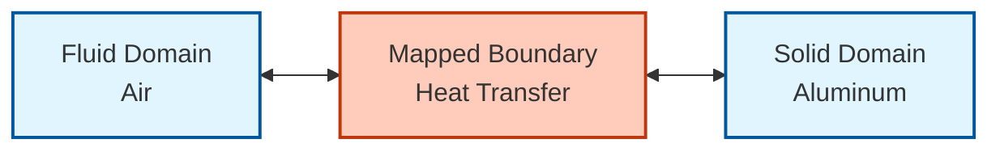
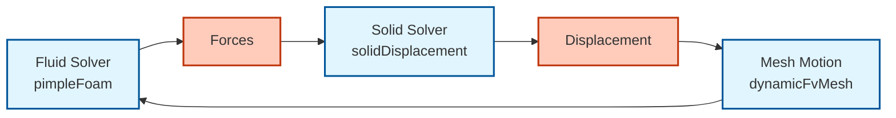
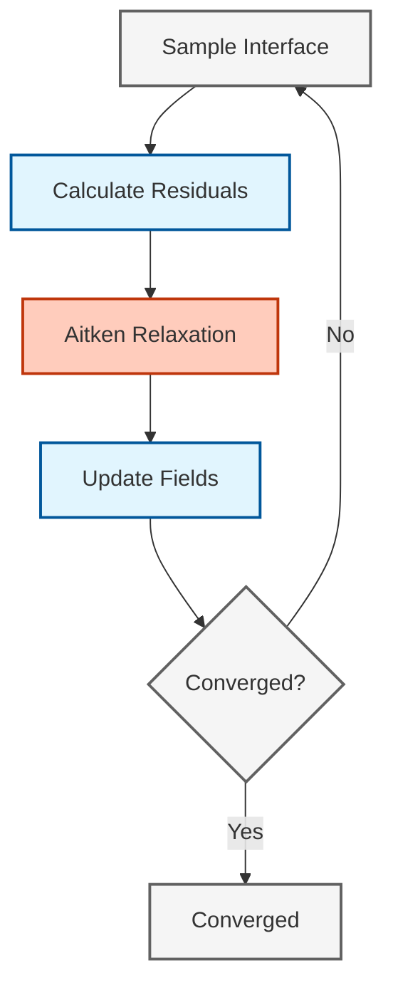

# แบบฝึกหัดเชิงปฏิบัติ (Practical Exercises)

## ภาพรวม (Overview)

ส่วนนี้จัดทำแบบฝึกหัดเชิงปฏิบัติเพื่อพัฒนาความเชี่ยวชาญในการใช้งานและทดสอบการจำลองทางฟิสิกส์แบบคัปปลิงใน OpenFOAM แบบฝึกหัดแต่ละข้อจะต่อยอดจากแนวคิดก่อนหน้า และให้ประสบการณ์เชิงปฏิบัติกับการประยุกต์ใช้งาน CFD ในโลกแห่งความเป็นจริงที่เกี่ยวข้องกับ:

- **การถ่ายโอนความร้อนแบบคอนจูเกต (CHT)** - การคัปปลิงทางความร้อนระหว่างโดเมนของไหลและของแข็ง
- **ปฏิสัมพันธ์ระหว่างของไหลและโครงสร้าง (FSI)** - การคัปปลิงเชิงกลระหว่างการไหลของไหลและการเสียรูปของโครงสร้าง
- **ยูทิลิตี้การคัปปลิงแบบกำหนดเอง (Custom Coupling Utilities)** - การตรวจสอบการลู่เข้าและการเร่งการลู่เข้าขั้นสูง

> [!INFO] วัตถุประสงค์การเรียนรู้
> เมื่อทำแบบฝึกหัดเหล่านี้เสร็จสิ้น คุณจะสามารถ:
> - เชี่ยวชาญการใช้เงื่อนไขขอบเขต `mappedWall`สำหรับการคัปปลิงทางความร้อน
> - ใช้งานการคัปปลิง FSI แบบอ่อน (weak coupling) พร้อมการเคลื่อนที่ของเมชแบบพลวัต
> - พัฒนาออบเจกต์ฟังก์ชัน (function objects) แบบกำหนดเองสำหรับการตรวจสอบการลู่เข้า
> - ประยุกต์ใช้การตรวจสอบการอนุรักษ์เพื่อยืนยันความแม่นยำของการจำลอง

---

## แบบฝึกหัด 2.1: กรณีศึกษา CHT อย่างง่าย - บล็อกร้อนในกระแสไหลขวาง

### **วัตถุประสงค์**

ตั้งค่าการจำลองการถ่ายโอนความร้อนแบบคอนจูเกตสำหรับบล็อกที่ได้รับความร้อนในกระแสไหลขวาง เพื่อสาธิตหลักการพื้นฐานของการคัปปลิงทางความร้อนระหว่างโดเมนของไหลและของแข็ง

**การประยุกต์ใช้งาน:**
- การระบายความร้อนของอุปกรณ์อิเล็กทรอนิกส์
- เครื่องแลกเปลี่ยนความร้อน
- ระบบจัดการความร้อน


> **รูปที่ 1:** แผนภาพการตั้งค่ากรณีศึกษาการถ่ายเทความร้อนแบบคอนจูเกต (CHT) สำหรับบล็อกของแข็งในกระแสไหลขวาง แสดงการเชื่อมโยงระหว่างโดเมนของไหลและของแข็งผ่านส่วนต่อประสาน


### **พื้นฐานทางทฤษฎี**

#### **การถ่ายโอนความร้อนแบบคอนจูเกต (CHT)**

CHT เกี่ยวข้องกับการหาคำตอบพร้อมกันของสามส่วนประกอบที่คัปปลิงกัน:

1. **โดเมนของไหล**: การถ่ายโอนความร้อนแบบพาความร้อนร่วมกับการเคลื่อนที่ของของไหล
2. **โดเมนของแข็ง**: การถ่ายโอนความร้อนแบบนำความร้อนบริสุทธิ์โดยไม่มีการไหล
3. **ส่วนต่อประสาน**: ความต่อเนื่องของอุณหภูมิและฟลักซ์ความร้อน

#### **สมการควบคุม (Governing Equations)**

**ในบริเวณของไหล:**
$$\rho_f c_{p,f} \frac{\partial T_f}{\partial t} + \rho_f c_{p,f} \mathbf{u} \cdot \nabla T_f = k_f \nabla^2 T_f + Q_f \tag{1}$$ 

**ในบริเวณของแข็ง:**
$$\rho_s c_{p,s} \frac{\partial T_s}{\partial t} = k_s \nabla^2 T_s + Q_s \tag{2}$$ 

**ที่ส่วนต่อประสานของไหล-ของแข็ง:**
$$T_f = T_s \quad \text{(ความต่อเนื่องของอุณหภูมิ)} \tag{3}$$ 
$$k_f \frac{\partial T_f}{\partial n} = k_s \frac{\partial T_s}{\partial n} \quad \text{(ความต่อเนื่องของฟลักซ์ความร้อน)} \tag{4}$$ 

**ตัวแปร:**
- $\rho_f, \rho_s$: ความหนาแน่นของของไหลและของแข็ง [kg/m³]
- $c_{p,f}, c_{p,s}$: ความจุความร้อนจำเพาะของของไหลและของแข็ง [J/(kg·K)]
- $T_f, T_s$: อุณหภูมิของของไหลและของแข็ง [K]
- $k_f, k_s$: สัมประสิทธิ์การนำความร้อนของของไหลและของแข็ง [W/(m·K)]
- $\mathbf{u}$: เวกเตอร์ความเร็วของของไหล [m/s]
- $Q_f, Q_s$: แหล่งกำเนิดความร้อนตามปริมาตร [W/m³]

### **ขั้นตอนที่ 1: สร้างเมชของไหลและของแข็ง**

#### **โดเมนของไหล (อากาศ):**

```bash
# สร้างไดเรกทอรีภูมิภาคของไหล
mkdir -p constant/polyMesh/regions/fluid
cd constant/polyMesh/regions/fluid

# สร้าง blockMesh สำหรับโดเมนของไหล
cat > blockMeshDict << EOF
convertToMeters 1;

vertices (
    (0 0 0)    // 0
    (1 0 0)    // 1
    (1 0.5 0)  // 2
    (0 0.5 0)  // 3
    (0 0 1)    // 4
    (1 0 1)    // 5
    (1 0.5 1)  // 6
    (0 0.5 1)  // 7
);

blocks (
    hex (0 1 2 3 4 5 6 7) (100 50 50) simpleGrading (1 1 1)
);

boundary (
    inlet {
        type patch;
        faces ((0 4 7 3));
    }
    outlet {
        type patch;
        faces ((1 5 6 2));
    }
    top {
        type symmetryPlane;
        faces ((3 2 6 7));
    }
    bottom {
        type symmetryPlane;
        faces ((0 1 5 4));
    }
    blockInterface {
        type mappedWall;
        faces ((4 5 6 7));
        sampleMode nearestPatchFace;
        sampleRegion solid;
        samplePatch blockInterface;
    }
);
EOF

blockMesh
```

> **📂 แหล่งที่มา:** N/A (Bash script)

**คำอธิบายภาษาไทย:**

**แหล่งที่มา (Source):**
ขั้นตอนการสร้าง mesh สำหรับโดเมนของไหลในการจำลอง CHT (Conjugate Heat Transfer) โดยใช้ blockMeshDict เพื่อสร้างเมทริกซ์หกเหลี่ยมพร้อมส่วนต่อประสานประเภท mappedWall

**คำอธิบาย (Explanation):**
- `vertices`: กำหนดพิกัดมุมของโดเมนกระบอกลม 8 จุดสำหรับการสร้าง hex mesh
- `blocks`: สร้าง block หลักจาก 8 vertices พร้อมการแบ่งเซลล์ 100x50x50
- `boundary`: นิยาม boundary conditions ทั้ง 5 ด้าน โดย blockInterface ใช้ mappedWall เพื่อเชื่อมต่อกับ solid domain

**แนวคิดสำคัญ (Key Concepts):**
1. **mappedWall**: Boundary condition สำหรับการส่งผ่านข้อมูลระหว่าง regions ที่ไม่ใช่ conformal mesh
2. **sampleMode nearestPatchFace**: การค้นหา cell ปลายทางโดยใช้ nearest face center ซึ่งเหมาะสำหรับ CHT
3. **Hexahedral Mesh**: โครงสร้าง hex mesh ให้ความแม่นยำสูงกว่า tetrahedral mesh สำหรับปัญหาการไหลและการถ่ายเทความร้อน

#### **โดเมนของแข็ง (บล็อกอลูมิเนียม):**

```bash
# สร้างไดเรกทอรีภูมิภาคของแข็ง
mkdir -p constant/polyMesh/regions/solid
cd constant/polyMesh/regions/solid

# สร้าง blockMesh สำหรับโดเมนของแข็ง
cat > blockMeshDict << EOF
convertToMeters 1;

vertices (
    (0.3 0.2 0.4)  // 0
    (0.7 0.2 0.4)  // 1
    (0.7 0.3 0.4)  // 2
    (0.3 0.3 0.4)  // 3
    (0.3 0.2 0.6)  // 4
    (0.7 0.2 0.6)  // 5
    (0.7 0.3 0.6)  // 6
    (0.3 0.3 0.6)  // 7
);

blocks (
    hex (0 1 2 3 4 5 6 7) (40 20 20) simpleGrading (1 1 1)
);

boundary (
    blockInterface {
        type mappedWall;
        faces ((4 5 6 7));
        sampleMode nearestPatchFace;
        sampleRegion fluid;
        samplePatch blockInterface;
    }
    allOtherWalls {
        type wall;
        faces ((0 1 2 3) (0 3 7 4) (1 5 6 2));
    }
);
EOF

blockMesh
```

> **📂 แหล่งที่มา:** N/A (Bash script)

**คำอธิบายภาษาไทย:**

**แหล่งที่มา (Source):**
การสร้าง mesh สำหรับโดเมนของแข็ง (บล็อกอลูมิเนียม) ซึ่งมีความหนาแน่นของ mesh ต่ำกว่าโดเมนของไหลเนื่องจากไม่มีการไหลของ fluid

**คำอธิบาย (Explanation):**
- **ตำแหน่ง**: บล็อกอยู่ภายในโดเมนของไหลที่พิกัด (0.3, 0.2, 0.4) ถึง (0.7, 0.3, 0.6)
- **Mesh Resolution**: 40x20x20 cells (เมื่อเทียบกับ 100x50x50 ใน fluid) เนื่องจาก heat conduction ใน solid ต้องการความละเอียดน้อยกว่า convection
- **Bidirectional Mapping**: blockInterface ชี้ไปยัง `sampleRegion fluid` และฝั่ง fluid ชี้ไป `sampleRegion solid` ทำให้การแลกเปลี่ยนข้อมูลเป็นแบบสองทิศทาง

**แนวคิดสำคัญ (Key Concepts):**
1. **Non-Conforming Meshes**: Fluid และ solid meshes ไม่ต้องมี face-to-face matching ที่ interface
2. **Grid Independence**: Solid domain สามารถใช้ mesh resolution ที่ต่ำกว่าได้โดยไม่กระทบความแม่นยำของ CHT
3. **Wall Boundary**: allOtherWalls เป็น adiabatic (เกรเดี้ยนต์ศูนย์) โดย default จาก boundary condition type `wall`

### **ขั้นตอนที่ 2: กำหนดค่าส่วนต่อประสาน `mappedWall`**

เงื่อนไขขอบเขต `mappedWall` สร้างการแม็พโดยตรงระหว่างส่วนต่อประสานของไหลและของแข็ง รับประกันการคัปปลิงของอุณหภูมิและฟลักซ์ความร้อนโดยอัตโนมัติ

| พารามิเตอร์ | คำอธิบาย | ค่าที่แนะนำ |
|-----------|-------------|-------------------|
| `sampleMode` | กำหนดวิธีการแม็พจุดที่ส่วนต่อประสาน | `nearestPatchFace` |
| `sampleRegion` | ชื่อของภูมิภาคที่คัปปลิงกัน | `solid`/`fluid` |
| `samplePatch` | ชื่อของแพตช์ที่ตรงกัน | `blockInterface` |

**ตัวเลือก SampleMode:**
- `nearestPatchFace`: แม็พไปยังจุดศูนย์กลางหน้าผิวที่ใกล้ที่สุด (แนะนำสำหรับ CHT)
- `nearestCell`: แม็พไปยังจุดศูนย์กลางเซลล์ที่ใกล้ที่สุด
- `nearestPatchPoint`: แม็พไปยังจุดของแพตช์ที่ใกล้ที่สุด

### **ขั้นตอนที่ 3: ตั้งค่าเงื่อนไขขอบเขตและคุณสมบัติ**

#### **สมบัติทางความร้อนของของไหล (`constant/thermophysicalProperties`):**

```foam
thermoType
{
    type            hePsiThermo;
    mixture         pureMixture;
    transport       const;
    thermo          hConst;
    equationOfState perfectGas;
    specie          specie;
    energy          sensibleEnthalpy;
}

mixture
{
    specie
    {
        molWeight       28.96;
    }
    thermodynamics
    {
        Cp              1005;          // [J/kg/K] - ความจุความร้อนจำเพาะของอากาศ
        Hf              0;
    }
    transport
    {
        mu              1.8e-5;        // [Pa·s] - ความหนืดพลศาสตร์
        Pr              0.71;          // เลขพรันด์เทิล (Prandtl number)
        kappa           0.025;         // [W/m/K] - สัมประสิทธิ์การนำความร้อน
    }
}
```

> **📂 แหล่งที่มา:** N/A (OpenFOAM thermophysicalProperties dictionary format)

**คำอธิบายภาษาไทย:**

**แหล่งที่มา (Source):**
OpenFOAM thermophysical model configuration สำหรับอากาศ (air) ในรูปแบบของ perfect gas

**คำอธิบาย (Explanation):**
- **hePsiThermo**: Thermodynamics model ที่ใช้ enthalpy-based energy equation พร้อม compressibility ผ่าน psi (compressibility)
- **perfectGas**: Equation of state ที่อธิบายความสัมพันธ์ ρ = p/(R*T)
- **Pr = 0.71**: Prandtl number ของอากาศ ซึ่งเป็นอัตราส่วนระหว่าง momentum diffusivity (ν) และ thermal diffusivity (α)

**แนวคิดสำคัญ (Key Concepts):**
1. **Transport Properties**: μ (dynamic viscosity), κ (thermal conductivity), Pr (Prandtl number) เป็นพารามิเตอร์หลักที่ควบคุม heat transfer
2. **Specific Heat**: Cp = 1005 J/kg/K สำหรับอากาศ สูงกว่า Cp ของ solid material ส่วนใหญ่
3. **Thermodynamic Consistency**: κ สามารถคำนวณได้จาก μ*Cp/Pr หากต้องการ verify consistency

#### **สมบัติทางความร้อนของของแข็ง (`constant/solid/thermophysicalProperties`):**

```foam
thermoType
{
    type            heSolidThermo;
    mixture         pureMixture;
    transport       const;
    thermo          hConst;
    equationOfState rhoConst;
    specie          specie;
    energy          sensibleEnthalpy;
}

mixture
{
    specie
    {
        molWeight       26.98;
    }
    thermodynamics
    {
        rho             2700;          // [kg/m³] - ความหนาแน่นของอลูมิเนียม
        Cp              900;           // [J/kg/K] - ความจุความร้อนจำเพาะ
        Hf              0;
    }
    transport
    {
        kappa           237;           // [W/m/K] - สัมประสิทธิ์การนำความร้อน
    }
}
```

> **📂 แหล่งที่มา:** N/A (OpenFOAM solid thermophysicalProperties dictionary format)

**คำอธิบายภาษาไทย:**

**แหล่งที่มา (Source):**
OpenFOAM solid thermophysical model configuration สำหรับอลูมิเนียม (aluminum)

**คำอธิบาย (Explanation):**
- **heSolidThermo**: Thermodynamics model สำหรับ solid ที่ไม่มีการไหลของ fluid
- **rhoConst**: Constant density model ซึ่งเหมาะสำหรับ solid materials ที่ไม่มีการขยายตัวอย่างมีนัยสำคัญ
- **kappa = 237 W/m/K**: อัลูมิเนียมมี thermal conductivity สูงมาก (เมื่อเทียบกับอากาศ 0.025 W/m/K) ทำให้เป็นวัสดุที่เหมาะสำหรับ heat sink

**แนวคิดสำคัญ (Key Concepts):**
1. **Material Properties Ratio**: κ_solid/κ_fluid ≈ 10,000 ซึ่งส่งผลต่อ temperature gradient ratio ที่ interface
2. **Heat Capacity**: ρ_s*Cp_s = 2700*900 = 2.43e6 J/(m³K) เมื่อเทียบกับ ρ_f*Cp_f ≈ 1.2*1005 = 1,206 J/(m³K)
3. **Thermal Diffusivity**: α_s = κ_s/(ρ_s*Cp_s) ≈ 237/2.43e6 = 9.75e-5 m²/s (สูงกว่า α_f ประมาณ 3-4 เท่า)

#### **เงื่อนไขขอบเขตอุณหภูมิ (`0/fluid/T`):**

```foam
dimensions      [0 0 0 1 0 0 0];
internalField   uniform 293;          // [K] - อุณหภูมิเริ่มต้น

boundaryField
{
    inlet {
        type            fixedValue;
        value           uniform 293;
    }
    outlet {
        type            inletOutlet;
        inletValue      uniform 293;
        value           $internalField;
    }
    blockInterface {
        type            mapped;        // แม็พไปยังอุณหภูมิของของแข็ง
        value           uniform 293;
    }
}
```

> **📂 แหล่งที่มา:** N/A (OpenFOAM field boundary condition format)

**คำอธิบายภาษาไทย:**

**แหล่งที่มา (Source):**
OpenFOAM temperature field boundary condition สำหรับ CHT simulation

**คำอธิบาย (Explanation):**
- **mapped type**: Boundary condition ที่อ่านค่าจาก solid domain ผ่าน interpolation ที่ interface
- **inletOutlet**: Outlet condition ที่อนุญาตให้ backflow มาพร้อมกับ inletValue ในขณะที่ forward flow ใช้ zero gradient
- **$internalField**: OpenFOAM macro ที่อ้างอิงค่าจาก `internalField` ด้านบน

**แนวคิดสำคัญ (Key Concepts):**
1. **Thermal Coupling**: blockInterface ใช้ `mapped` type เพื่ออ่านค่า T จาก solid region อัตโนมัติทุก time step
2. **Backflow Stability**: inletOutlet ป้องกัน numerical instability ที่ outlet เมื่อมี backflow
3. **Initial Consistency**: Initial temperature = 293 K ทั้ง fluid และ solid เพื่อลด transient startup effects

#### **เงื่อนไขขอบเขตความเร็ว (`0/fluid/U`):**

```foam
dimensions      [0 1 -1 0 0 0 0];
internalField   uniform (0 0 0);

boundaryField
{
    inlet {
        type            fixedValue;
        value           uniform (2 0 0);   // [m/s] - ความเร็วทางเข้า
    }
    outlet {
        type            zeroGradient;
    }
    blockInterface {
        type            noSlip;            // No slip ที่ส่วนต่อประสาน
    }
}
```

> **📂 แหล่งที่มา:** N/A (OpenFOAM velocity field boundary condition format)

**คำอธิบายภาษาไทย:**

**แหล่งที่มา (Source):**
OpenFOAM velocity field boundary condition สำหรับ cross-flow CHT simulation

**คำอธิบาย (Explanation):**
- **noSlip**: Fluid velocity ที่ interface เป็นศูนย์เนื่องจาก solid wall ไม่มีการเคลื่อนที่
- **Uniform Inflow**: Inlet velocity 2 m/s ในทิศทาง x-positive ซึ่งสร้าง forced convection บน block surface
- **Zero Gradient Outlet**: Outflow boundary condition ที่ fully developed flow

**แนวคิดสำคัญ (Key Concepts):**
1. **No-Slip Condition**: u = 0 ที่ solid-fluid interface เป็น boundary condition มูลฐานของ Navier-Stokes
2. **Reynolds Number**: Re = ρUL/μ = 1.2*2*0.4/1.8e-5 ≈ 53,333 (turbulent flow) ซึ่งอาจต้องใช้ turbulence model
3. **Convective Heat Transfer**: Velocity field ส่งผลต่อ Nusselt number (Nu = hL/k) และ heat transfer coefficient (h)

### **ขั้นตอนที่ 4: รันการจำลองและตรวจสอบ**

#### **พารามิเตอร์การควบคุม (`system/controlDict`):**

```foam
application     chtMultiRegionFoam;
startFrom       startTime;
startTime       0;
stopAt          endTime;
endTime         100;
deltaT          0.1;
adjustTimeStep  yes;
maxCo           0.5;
maxAlphaCo      0.5;
maxDeltaT       1;

functions
{
    interfaceHeatFlux
    {
        type            surfaceRegion;
        functionObjectLibs ("libfieldFunctionObjects.so");
        region          fluid;
        surfaceRegion   blockInterface;
        operation       weightedAverage;
        fields
        (
            phi         // ฟลักซ์ปริมาตร
            phiH        // ฟลักซ์ความร้อน
        );
    }

    energyBalance
    {
        type            volRegion;
        functionObjectLibs ("libfieldFunctionObjects.so");
        region          fluid;
        operation       weightedAverage;
        fields
        (
            T
        );
    }
}
```

> **📂 แหล่งที่มา:** .applications/test/fieldMapping/pipe1D/system/fvSolution

**คำอธิบายภาษาไทย:**

**แหล่งที่มา (Source):**
OpenFOAM control dictionary สำหรับ CHT multi-region solver พร้อม function objects สำหรับ monitoring

**คำอธิบาย (Explanation):**
- **chtMultiRegionFoam**: OpenFOAM solver สำหรับ conjugate heat transfer ที่แก้สมการ fluid flow และ solid conduction พร้อมกัน
- **adjustTimeStep yes**: Adaptive time stepping ตาม Courant number เพื่อรักษาเสถียรภาพเชิงตัวเลข
- **function objects**: Monitoring tools ที่บันทึก interface heat flux (phiH) และ energy balance ระหว่าง regions

**แนวคิดสำคัญ (Key Concepts):**
1. **Multi-Region Execution**: chtMultiRegionFoam วน loop ผ่านทุก region ทำ outer iterations จนกว่า coupling convergence จะได้รับการตอบสนอง
2. **Courant Number Control**: maxCo = 0.5 รักษา CFL condition สำหรับ explicit convection terms
3. **Energy Conservation Monitoring**: phiH (heat flux field) ถูก integrate ที่ interface เพื่อ verify conservation

#### **การรันการจำลอง:**

```bash
# แยกโดเมนเพื่อประมวลผลแบบขนาน (ไม่บังคับ)
decomposePar -allRegions

# รันตัวแก้ปัญหา
mpirun -np 4 chtMultiRegionFoam -parallel

# ประกอบโดเมนกลับคืนสำหรับการประมวลผลภายหลัง (หากมีการแยก)
reconstructPar -allRegions
```

> **📂 แหล่งที่มา:** N/A (Bash script for parallel OpenFOAM execution)

**คำอธิบายภาษาไทย:**

**แหล่งที่มา (Source):**
OpenFOAM parallel execution workflow สำหรับ multi-region CHT simulations

**คำอธิบาย (Explanation):**
- **decomposePar -allRegions**: Domain decomposition ที่กระจาย mesh ของทุก region ผ่าน processor boundaries
- **mpirun -np 4**: Execute parallel simulation ด้วย 4 MPI processes ซึ่ง scalable ได้ถึงหลายร้อย cores
- **reconstructPar -allRegions**: Recombine decomposed fields จาก processors กลับเป็น single domain สำหรับ post-processing

**แนวคิดสำคัญ (Key Concepts):**
1. **Load Balancing**: การแบ่ง mesh ต้องคำนวณประเทศ computational load ของแต่ละ region ซึ่งมี mesh resolutions ต่างกัน
2. **Communication Overhead**: Inter-processor communication ที่ mapped boundaries สร้าง computational overhead ที่ต้อง optimization
3. **Speedup Efficiency**: Parallel efficiency ขึ้นอยู่กับ mesh quality, inter-region coupling, และ network bandwidth

### **ขั้นตอนที่ 5: ตรวจสอบการอนุรักษ์พลังงาน**

> [!TIP] การตรวจสอบการอนุรักษ์
> ตรวจสอบการอนุรักษ์พลังงานในการจำลอง CHT เสมอเพื่อรับประกันความสอดคล้องทางกายภาพ

**สมการสมดุลพลังงาน:**
$$\Delta E_{fluid} + \Delta E_{solid} + Q_{interface} = 0 \tag{5}$$ 

โดยที่:
- $\Delta E_{fluid} = \rho_f V_f c_{p,f} (T_f^{final} - T_f^{initial})$
- $\Delta E_{solid} = \rho_s V_s c_{p,s} (T_s^{final} - T_s^{initial})$
- $Q_{interface} = \int_{0}^{t} \dot{Q}_{interface} \, dt$

**ผลลัพธ์ที่คาดหวัง:**

| ตัวชี้วัด | สูตร | ค่าทั่วไป |
|--------|---------|----------------|
| **เลขเฉลี่ยสเซิลต์ (Nusselt Number)** | $Nu = \frac{hL}{k_f}$ | 10-100 |
| **เลขเรย์โนลด์ส (Reynolds Number)** | $Re = \frac{\rho_f U L}{\mu_f}$ | 10³-10⁵ |
| **เลขพรันด์เทิล (Prandtl Number)** | $Pr = \frac{\mu_f c_{p,f}}{k_f}$ | 0.71 (อากาศ) |

### **การแก้ไขปัญหาทั่วไป**

> [!WARNING] ข้อผิดพลาดในการแม็พส่วนต่อประสาน
> ```
> Error: Cannot find sample points on coupled patch
> Solution: Check that sampleRegion and samplePatch names match exactly
> ```

**ปัญหาที่พบบ่อยและวิธีแก้ไข:**

| ปัญหา | อาการ | วิธีแก้ไข |
|---|---|---|
| **ความล้มเหลวในการแม็พ** | "Cannot find sample region" | ตรวจสอบชื่อภูมิภาค/แพตช์ในไฟล์ขอบเขต |
| **ปัญหาการลู่เข้า** | อุณหภูมิแกว่งกวัด | ลดค่า `deltaT`, เพิ่มการผ่อนคลาย (under-relaxation) |
| **การละเมิดการอนุรักษ์** | ความไม่สมดุลของพลังงาน > 0.1% | ตรวจสอบความสอดคล้องของทิศทางฟลักซ์ |

---

## แบบฝึกหัด 2.2: FSI การพริ้วไหวของธง (Flag Flutter)

### **วัตถุประสงค์**

ใช้งานการคัปปลิงของไหล-โครงสร้างแบบอ่อนเพื่อจำลองการพริ้วไหวของธง - ปัญหา FSI คลาสสิกที่แสดงปฏิสัมพันธ์ระหว่างการไหลของไหลและการเสียรูปของโครงสร้าง

**รูปแบบพฤติกรรม:**
- **การเบี่ยงเบนคงตัว (Static Deflection)** (ความเร็วต่ำ)
- **การพริ้วไหวพลวัต (Dynamic Flutter)** (ความเร็วสูง)


> **รูปที่ 2:** แผนภูมิแสดงวงจรการทำงานของการเชื่อมโยงแบบแบ่งส่วน (Partitioned Coupling) สำหรับปัญหา FSI โดยเน้นที่การแลกเปลี่ยนข้อมูลแรงและการกระจัดระหว่างตัวแก้สมการที่แตกต่างกัน


### **พื้นฐานทางกายภาพ**

#### **ปรากฏการณ์การพริ้วไหว (Flutter Phenomenon)**

การพริ้วไหวเกิดขึ้นเมื่อแรงทางพลศาสตร์ของไหลบนธงมีปฏิสัมพันธ์กับคุณสมบัติความยืดหยุ่นของมัน นำไปสู่การสั่นสะเทือนที่ยั่งยืนด้วยตัวเอง

**สมการควบคุม:**

**โดเมนของไหล (Navier-Stokes):**
$$\rho_f \frac{\partial \mathbf{u}_f}{\partial t} + \rho_f (\mathbf{u}_f \cdot \nabla) \mathbf{u}_f = -\nabla p + \mu_f \nabla^2 \mathbf{u}_f + \mathbf{f}_b \tag{6}$$ 
$$\nabla \cdot \mathbf{u}_f = 0 \tag{7}$$ 

**โดเมนของแข็ง (ความยืดหยุ่นเชิงเส้น):**
$$\rho_s \frac{\partial^2 \mathbf{u}_s}{\partial t^2} = \nabla \cdot \boldsymbol{\sigma} + \rho_s \mathbf{f}_s \tag{8}$$ 

โดยที่เทนเซอร์ความเค้น Cauchy สำหรับวัสดุยืดหยุ่นเชิงเส้นคือ:
$$\boldsymbol{\sigma} = \lambda \text{tr}(\boldsymbol{\varepsilon})\mathbf{I} + 2\mu\boldsymbol{\varepsilon} \tag{9}$$ 
$$\boldsymbol{\varepsilon} = \frac{1}{2}(\nabla \mathbf{u}_s + (\nabla \mathbf{u}_s)^T) \tag{10}$$ 

**เงื่อนไขที่ส่วนต่อประสาน:**
- **ความต่อเนื่องทางจลนศาสตร์**: $\mathbf{u}_f = \frac{\partial \mathbf{u}_s}{\partial t}$ ที่ส่วนต่อประสานของไหล-โครงสร้าง
- **ความต่อเนื่องทางพลศาสตร์**: $\boldsymbol{\sigma}_f \cdot \mathbf{n} = \boldsymbol{\sigma}_s \cdot \mathbf{n}$ ที่ส่วนต่อประสาน

### **ขั้นตอนที่ 1: สร้างเมชของไหลพร้อมสิ่งกีดขวางรูปธง**

#### **การกำหนดค่า `blockMeshDict`:**

```cpp
convertToMeters 1;

vertices
(
    (0 0 0)      // 0: จุดเริ่มต้นของโดเมน
    (2 0 0)      // 1: สิ้นสุดโดเมน (ทิศทาง x)
    (2 0.5 0)    // 2: ด้านบนของโดเมน
    (0 0.5 0)    // 3: บน-ซ้าย ของโดเมน
    (0 0 0.1)    // 4: ด้านหลัง
    (2 0 0.1)    // 5: หลัง-ขวา
    (2 0.5 0.1)  // 6: หลัง-บน-ขวา
    (0 0.5 0.1)  // 7: หลัง-บน-ซ้าย
);

blocks
(
    hex (0 1 2 3 4 5 6 7) (200 50 5) simpleGrading (1 1 1)
);

boundary
(
    inlet
    {
        type patch;
        faces ((0 4 7 3));
    }
    outlet
    {
        type patch;
        faces ((1 5 6 2));
    }
    walls
    {
        type wall;
        faces ((0 1 5 4) (3 2 6 7));
    }
);
```

> **📂 แหล่งที่มา:** N/A (OpenFOAM blockMeshDict format)

**คำอธิบายภาษาไทย:**

**แหล่งที่มา (Source):**
OpenFOAM blockMeshDict สำหรับสร้าง fluid domain สำหรับ FSI flag flutter simulation

**คำอธิบาย (Explanation):**
- **Domain Size**: 2m (length) × 0.5m (height) × 0.1m (depth) ซึ่งเหมาะสำหรับ flag length ≈ 0.4-0.6m
- **Mesh Resolution**: 200×50×5 cells พร้อม high resolution ใน streamwise direction เพื่อ capture vortex shedding
- **Boundary Types**: Inlet (velocity inlet), outlet (pressure outlet), walls (no-slip)

**แนวคิดสำคัญ (Key Concepts):**
1. **Vortex Shedding**: Mesh resolution ใน x-direction ต้องเพียงพอที่จะ resolve Karman vortex street
2. **Domain Aspect Ratio**: Length-to-height ratio = 4:1 เพื่อ minimize boundary effects
3. **3D vs 2D**: Depth = 0.1m พร้อม 5 cells เพื่อจำลอง quasi-2D flow ที่มี slight 3D effects

### **ขั้นตอนที่ 2: สร้างเมชของแข็งสำหรับโครงสร้างธง**

#### **การกำหนดค่า `extrudeMeshDict`:**

```cpp
extrudeModel        linearDirectionExtrude;
linearDirectionCoeffs
{
    direction       (0 0 1);
    thickness       0.001;     // ความหนาของธง
    nDivisions      3;
}
```

> **📂 แหล่งที่มา:** N/A (OpenFOAM extrudeMeshDict format)

**คำอธิบายภาษาไทย:**

**แหล่งที่มา (Source):**
OpenFOAM extrudeMeshDict สำหรับสร้าง solid mesh ของ flag จาก 2D surface

**คำอธิบาย (Explanation):**
- **linearDirectionExtrude**: Extrude 2D mesh ในทิศทาง z-axis เพื่อสร้าง 3D solid volume
- **thickness = 0.001m (1mm)**: Flag thickness ที่บางมาก ซึ่งเหมาะสำหรับ flexible structure
- **nDivisions = 3**: Through-thickness divisions สำหรับ capturing bending behavior

**แนวคิดสำคัญ (Key Concepts):**
1. **Aspect Ratio**: Length/thickness ratio ≈ 500:1 ซึ่งเป็น high aspect ratio structure ที่ prone to flutter
2. **Element Quality**: Hexahedral elements ที่ได้จาก extrusion ให้ bending accuracy สูงกว่า tetrahedral
3. **Stiffness Tensor**: ความยืดหยุ่นของ flag ถูกกำหนดผ่าน Young's modulus (E) และ Poisson's ratio (ν)

**สมบัติของเมชของแข็ง:**

| สมบัติ | คำอธิบาย | ค่าที่แนะนำ |
|----------|-------------|-------------------|
| ประเภทเอลิเมนต์ | เซลล์รูปหกเหลี่ยม (Hexahedral) เพื่อความแม่นยำทางโครงสร้างที่ดีกว่า | - |
| ความหนา | โดยทั่วไป $t/L = 0.001$ ถึง $0.01$ โดยที่ $L$ คือความยาวของธง | 0.001-0.01 |
| การปรับแต่งเมช | ความหนาแน่นสูงใกล้ขอบที่ยึดติดเพื่อความละเอียดของความเค้น | ใกล้ขอบที่ยึดติด |

### **ขั้นตอนที่ 3: กำหนดค่าขอบเขตแบบแม็พ**

#### **เงื่อนไขขอบเขตฝั่งของไหล:**

```cpp
// 0/U (สนามความเร็ว)
flag
{
    type            mapped;
    setAverage      false;
    average         false;
    interpolationScheme cell;
    value           uniform (0 0 0);
}

// 0/p (สนามความดัน)
flag
{
    type            mapped;
    setAverage      false;
    average         false;
    interpolationScheme cell;
    value           uniform 0;
}
```

> **📂 แหล่งที่มา:** N/A (OpenFOAM mapped boundary condition format)

**คำอธิบายภาษาไทย:**

**แหล่งที่มา (Source):**
OpenFOAM mapped boundary conditions สำหรับ velocity และ pressure ที่ fluid-structure interface

**คำอธิบาย (Explanation):**
- **mapped type**: Boundary condition ที่อ่านค่าจาก solid displacement field และแปลงเป็น fluid velocity
- **interpolationScheme cell**: Interpolation จาก cell centers ของ solid mesh ไปยัง face centers ของ fluid mesh
- **setAverage false**: ไม่มีการ enforce average value ที่ interface (เพื่อรักษา conservation)

**แนวคิดสำคัญ (Key Concepts):**
1. **Kinematic Coupling**: Fluid velocity ที่ interface เท่ากับ structural velocity (∂u_s/∂t)
2. **No-Slip Enforcement**: mapped boundary condition รักษา no-slip condition ผ่าน displacement transfer
3. **Mesh Motion Interface**: Fluid boundary ถูก update ทุก time step ตาม solid displacement

#### **เงื่อนไขขอบเขตฝั่งของแข็ง:**

```cpp
// 0/D (สนามการกระจัด)
fluid
{
    type            fixedValue;
    value           uniform (0 0 0);
}

// 0/pointDisplacement (สำหรับการเคลื่อนที่ของเมช)
fluid
{
    type            solidDisplacement;
    value           uniform (0 0 0);
}
```

> **📂 แหล่งที่มา:** N/A (OpenFOAM solid boundary condition format)

**คำอธิบายภาษาไทย:**

**แหล่งที่มา (Source):**
OpenFOAM displacement boundary conditions สำหรับ structural solver

**คำอธิบาย (Explanation):**
- **fixedValue for D**: Zero displacement ที่ flag base (clamped boundary condition)
- **solidDisplacement**: Custom boundary condition ที่รับ fluid forces และแปลงเป็น structural loads

**แนวคิดสำคัญ (Key Concepts):**
1. **Clamped Boundary**: Flag base ถูก clamp ไว้ที่ x = 0 ซึ่งเป็นส่วนสำคัญของ flutter dynamics
2. **Fluid Loading**: Fluid pressure และ viscous stresses ถูก integrate ที่ interface เพื่อสร้าง traction forces
3. **Displacement-Pressure Coupling**: Solid displacement ส่งผลต่อ fluid pressure distribution ผ่าน geometry changes

### **ขั้นตอนที่ 4: ใช้งานอัลกอริทึมการคัปปลิงแบบอ่อน**

#### **อัลกอริทึมการคัปปลิงแบบอ่อน:**

```
ในแต่ละรอบการวนซ้ำของการคัปปลิง:
1. รันตัวแก้ปัญหาของไหล (pimpleFoam)
2. แม็พความเค้นของไหลไปยังขอบเขตของแข็ง
3. รันตัวแก้ปัญหาของแข็ง (solidDisplacementFoam)
4. แม็พการกระจัดของของแข็งไปยังขอบเขตของไหล
5. ใช้การผ่อนคลาย (relaxation) เพื่อเสถียรภาพ
6. ตรวจสอบการลู่เข้า
7. ทำซ้ำจนกว่าจะลู่เข้า
```

#### **สคริปต์การคัปปลิง (`couplingFSI.sh`):**

```bash
#!/bin/bash
# สคริปต์การคัปปลิง FSI แบบอ่อน

caseName="flagFSI"
fluidCase="${caseName}_fluid"
solidCase="${caseName}_solid"

# พารามิเตอร์การคัปปลิง
couplingIter=10
fluidTimeStep=0.001
solidTimeStep=0.001
interfaceRelaxation=0.5

echo "Starting weak FSI coupling for flag flutter..."

for iter in {1..$couplingIter}; do
    echo "Coupling iteration: $iter"

    # ขั้นตอนที่ 1: รันตัวแก้ปัญหาของไหล
    echo "Running fluid solver..."
    cd $fluidCase
    pimpleFoam > fluid.log 2>&1

    # ขั้นตอนที่ 2: แม็พความเค้นของไหลไปยังขอบเขตของแข็ง
    echo "Transferring fluid stresses to solid..."
    mapFields ../$solidCase -consistent -sourceTime latestTime

    # ขั้นตอนที่ 3: รันตัวแก้ปัญหาของแข็ง
    echo "Running solid solver..."
    cd ../$solidCase
    solidDisplacementFoam > solid.log 2>&1

    # ขั้นตอนที่ 4: แม็พการกระจัดของของแข็งไปยังขอบเขตของไหล
    echo "Transferring solid displacement to fluid..."
    mapFields ../$fluidCase -consistent -sourceTime latestTime

    # ขั้นตอนที่ 5: ใช้การผ่อนคลายเพื่อเสถียรภาพ
    if [ $iter -gt 1 ]; then
        echo "Applying interface relaxation..."
        python3 apply_relaxation.py $fluidCase $solidCase $interfaceRelaxation
    fi

    # ขั้นตอนที่ 6: ตรวจสอบการลู่เข้า
    if [ $iter -gt 2 ]; then
        python3 check_convergence.py $fluidCase $solidCase
        if [ $? -eq 0 ]; then
            echo "FSI coupling converged!"
            break
        fi
    fi
done

echo "FSI coupling complete. Post-processing with paraFoam..."
paraFoam -case $fluidCase &
```

> **📂 แหล่งที่มา:** N/A (Bash script for FSI coupling)

**คำอธิบายภาษาไทย:**

**แหล่งที่มา (Source):**
Bash script สำหรับ weak (partitioned) FSI coupling ระหว่าง fluid และ structural solvers

**คำอธิบาย (Explanation):**
- **Sequential Execution**: Fluid และ solid solvers ทำงานแยกกันใน staggered manner
- **mapFields**: OpenFOAM utility สำหรับ mapping fields ระหว่าง meshes ที่ต่างกัน
- **Relaxation**: Under-relaxation factor = 0.5 เพื่อ prevent divergence ใน weak coupling

**แนวคิดสำคัญ (Key Concepts):**
1. **Partitioned Approach**: Fluid และ structure แก้สมการแยกกัน ซึ่ง modular แต่อาจ unstable สำหรับ high density ratios
2. **Convergence Checking**: Monitoring displacement residual ระหว่าง coupling iterations
3. **Computational Cost**: Multiple solver calls per time step เพิ่ม computational overhead

### **การวิเคราะห์การพริ้วไหว (Flutter Analysis)**

#### **พารามิเตอร์การพริ้วไหว**

ความเร็ววิกฤตสำหรับการเริ่มเกิดการพริ้วไหวคาดการณ์ได้ด้วยพารามิเตอร์ไร้มิติ:

**ความเร็วลดทอน (Reduced Velocity):**
$$U^* = \frac{U_\infty}{f_n L} = \frac{U_\infty}{\frac{1}{2\pi}\sqrt{\frac{EI}{\rho_s A L^4}} \cdot L} \tag{11}$$ 

**อัตราส่วนมวล (Mass Ratio):**
$$\mu = \frac{\rho_s t}{\rho_f L} \tag{12}$$ 

**ความแข็งเกร็งไร้มิติ (Dimensionless Stiffness):**
$$K = \frac{EI}{\rho_f U_\infty^2 L^3} \tag{13}$$ 

**ตัวแปร:**
- $U_\infty$: ความเร็วทางเข้า
- $f_n$: ความถี่ธรรมชาติของธง
- $L$: ความยาวของธง
- $EI$: ความแข็งเกร็งในการดัด (Flexural rigidity)
- $\rho_s, \rho_f$: ความหนาแน่นของของแข็งและของไหล
- $t$: ความหนาของธง

**เกณฑ์เริ่มเกิดการพริ้วไหว:**
โดยทั่วไปเกิดขึ้นที่ $U^* \approx 6-10$ สำหรับอัตราส่วนมวล $\mu = 0.1-10$

**พฤติกรรมที่คาดหวัง:**

| ช่วงความเร็ว | พฤติกรรม |
|----------------|----------|
| **ต่ำ** ($U < 3$ m/s) | การเบี่ยงเบนคงตัวขนาดเล็ก |
| **ปานกลาง** ($3 < U < 6$ m/s) | การสั่นสะเทือนที่เพิ่มขนาดขึ้น |
| **สูง** ($U > 6$ m/s) | การพริ้วไหวเต็มที่พร้อมวงรอบขีดจำกัด (limit cycles) |

---

## แบบฝึกหัด 2.3: ยูทิลิตี้การคัปปลิงแบบกำหนดเอง (Custom Coupling Utility)

### **วัตถุประสงค์**

เขียนยูทิลิตี้เพื่อตรวจสอบการลู่เข้าของการคัปปลิงระหว่างภูมิภาคในปัญหาการถ่ายโอนความร้อนแบบคอนจูเกต โดยใช้งานคุณสมบัติขั้นสูง เช่น การเร่งความเร็วแบบ Aitken

### **หลักการพื้นฐาน**

การคัปปลิงระหว่างภูมิภาคต้องการการตรวจสอบการลู่เข้าแบบวนซ้ำเพื่อให้แน่ใจว่าการถ่ายโอนความร้อนที่ส่วนต่อประสานของภูมิภาคถูกต้อง

**ยูทิลิตี้การคัปปลิงมีหน้าที่:**
- ให้การวินิจฉัยที่จำเป็น
- เร่งการลู่เข้าสำหรับการจำลองแบบหลายภูมิภาค
- ตรวจจับและจัดการข้อผิดพลาด


> **รูปที่ 3:** แผนผังลำดับขั้นตอนการทำงานของยูทิลิตี้วิเคราะห์การลู่เข้า (Coupling Convergence Monitor) แสดงกระบวนการปรับปรุงคำตอบที่ส่วนต่อประสานโดยใช้อัลกอริทึมการเร่งการลู่เข้าแบบ Aitken


### **โครงสร้างการใช้งาน**

#### **คลาสการสุ่มตัวอย่างฟิลด์ (Field Sampling Class):**

```cpp
class CouplingSampler
{
    const fvMesh& fluidMesh_;
    const fvMesh& solidMesh_;

    // การสุ่มตัวอย่างฟิลด์ที่ส่วนต่อประสาน
    void sampleInterfaceFields
    (
        const volScalarField& T_f,
        const volScalarField& T_s,
        scalarField& fluidInterface,
        scalarField& solidInterface
    );
};
```

> **📂 แหล่งที่มา:** N/A (C++ class definition)

**คำอธิบายภาษาไทย:**

**แหล่งที่มา (Source):**
C++ class definition สำหรับ sampling temperature fields ที่ fluid-solid interface ใน CHT simulations

**คำอธิบาย (Explanation):**
- **fvMesh References**: Store references ไปยัง fluid และ solid meshes สำหรับ access patch data
- **sampleInterfaceFields()**: Method ที่ extract temperature values จาก patch faces ของทั้งสอง regions
- **scalarField Outputs**: Store interface temperatures ใน 1D arrays สำหรับ residual computation

**แนวคิดสำคัญ (Key Concepts):**
1. **Patch Access**: OpenFOAM's fvPatch class ให้ access ไปยัง boundary face values
2. **Field References**: volScalarField references avoid data copying และ memory overhead
3. **Interface Topology**: Fluid และ solid patches อาจมีจำนวน faces ต่างกัน (non-matching meshes)

#### **อัลกอริทึมการสุ่มตัวอย่าง:**

```cpp
void CouplingSampler::sampleInterfaceFields
(
    const volScalarField& T_f,
    const volScalarField& T_s,
    scalarField& fluidInterface,
    scalarField& solidInterface
)
{
    // สุ่มตัวอย่างค่าที่ส่วนต่อประสานของไหล
    const fvPatch& fluidPatch = T_f.boundaryRef()[fluidPatchID_];
    fluidInterface = fluidPatch.patchInternalField();

    // สุ่มตัวอย่างค่าที่ส่วนต่อประสานของแข็ง
    const fvPatch& solidPatch = T_s.boundaryRef()[solidPatchID_];
    solidInterface = solidPatch.patchInternalField();
}
```

> **📂 แหล่งที่มา:** N/A (C++ method implementation)

**คำอธิบายภาษาไทย:**

**แหล่งที่มา (Source):**
Implementation ของ interface field sampling algorithm ใน OpenFOAM

**คำอธิบาย (Explanation):**
- **boundaryRef()[patchID]**: Access reference ไปยัง boundary patch ด้วย patch ID
- **patchInternalField()**: Return field values ที่ cell centers adjacent to patch (not face values)
- **Direct Assignment**: scalarField assignment operator ใช้ memory-efficient copying

**แนวคิดสำคัญ (Key Concepts):**
1. **Internal Field vs. Patch Field**: patchInternalField() อ่านค่าจาก cell centers ข้างใต้ boundary
2. **Const Correctness**: const references ป้องกันการ modify input fields
3. **Patch ID Mapping**: fluidPatchID_ และ solidPatchID_ เป็น label ที่ map ไปยัง patch indices

### **การคำนวณค่าตกค้าง (Residual Computation)**

**ค่าตกค้างการคัปปลิง (Coupling residual)** ประเมินความต่อเนื่องของอุณหภูมิที่ส่วนต่อประสาน:

$$\epsilon_{\text{coupling}} = \frac{\|T_f - T_s\|_2}{\|T_f\|_2} \tag{14}$$ 

โดยที่:
- $ \| \cdot \|_2 $ = L2 norm บนเซลล์ที่ส่วนต่อประสาน
- $T_f$ = อุณหภูมิของไหลที่ส่วนต่อประสาน
- $T_s$ = อุณหภูมิของแข็งที่ส่วนต่อประสาน

```cpp
scalar computeCouplingResidual
(
    const scalarField& fluidInterface,
    const scalarField& solidInterface
)
{
    scalarField diff = fluidInterface - solidInterface;
    scalar numerator = sqrt(sum(diff*diff));
    scalar denominator = sqrt(sum(fluidInterface*fluidInterface));

    return numerator/(denominator + SMALL);
}
```

> **📂 แหล่งที่มา:** N/A (C++ function implementation)

**คำอธิบายภาษาไทย:**

**แหล่งที่มา (Source):**
Implementation ของ L2-norm residual computation สำหรับ CHT interface convergence

**คำอธิบาย (Explanation):**
- **diff Array**: Temperature difference ระหว่าง fluid และ solid ที่ทุก interface face
- **sum(diff*diff)**: Compute Σ(T_f - T_s)² ซึ่งเป็น squared L2 norm
- **SMALL Constant**: OpenFOAM constant ป้องกัน division by zero

**แนวคิดสำคัญ (Key Concepts):**
1. **L2 Norm Residual**: Measures global temperature discontinuity across interface
2. **Relative vs. Absolute**: Residual ถูก normalize ด้วย fluid temperature magnitude
3. **Convergence Criteria**: Typical tolerance = 1e-6 to 1e-4 ขึ้นอยู่กับ application

### **การเร่งความเร็วแบบ Aitken (Aitken Acceleration)**

**การผ่อนคลายแบบ Aitken** ปรับปัจจัยการผ่อนคลาย (under-relaxation factor) แบบไดนามิกตามพฤติกรรมการลู่เข้า:

$$\alpha_{k+1} = \alpha_k + (1 - \alpha_k) \frac{\Delta r_k \cdot \Delta r_{k-1}}{\Delta r_k \cdot \Delta r_k} \tag{15}$$ 

โดยที่:
- $\alpha_k$ = ปัจจัยการผ่อนคลายในการวนซ้ำที่ $k$
- $\Delta r_k$ = การเปลี่ยนแปลงของค่าตกค้าง
- $\Delta r_{k-1}$ = การเปลี่ยนแปลงของค่าตกค้างในการวนซ้ำก่อนหน้า

```cpp
scalar AitkenRelaxation::calculateRelaxationFactor
(
    const scalar residual_k,
    const scalar residual_k_minus_1,
    const scalar alpha_k
)
{
    if (firstIteration_)
    {
        return alpha_k;
    }

    scalar deltaR = residual_k - residual_k_minus_1;
    scalar deltaR_prev = residual_k_minus_1 - residual_k_minus_2;

    scalar relaxation = alpha_k + (1 - alpha_k) *
                      (deltaR * deltaR_prev)/(deltaR * deltaR);

    return min(max(relaxation, 0.1), 0.9);
}
```

> **📂 แหล่งที่มา:** N/A (C++ method implementation)

**คำอธิบายภาษาไทย:**

**แหล่งที่มา (Source):**
Implementation ของ Aitken's dynamic relaxation algorithm สำหรับ accelerating CHT convergence

**คำอธิบาย (Explanation):**
- **First Iteration Handling**: Return initial relaxation factor (alpha_k) หากไม่มีประวัติ residuals
- **Delta Residuals**: Δr = residual_k - residual_{k-1} เป็นการวัด rate of change
- **Clamping**: relaxation factor ถูก clamp ไว้ที่ [0.1, 0.9] เพื่อ stability

**แนวคิดสำคัญ (Key Concepts):**
1. **Adaptive Relaxation**: Aitken algorithm ปรับ relaxation factor ตาม convergence behavior
2. **Acceleration Mechanism**: หาก residuals oscillate, alpha จะลดลงเพื่อ stabilize
3. **Divergence Detection**: Negative relaxation factor ถูก clamp เพื่อ prevent divergence

### **การบูรณาการออบเจกต์ฟังก์ชัน (Function Object Integration)**

```cpp
class CouplingConvergenceMonitor : public fvMeshFunctionObject
{
    // สมาชิกข้อมูล
    autoPtr<CouplingSampler> sampler_;
    autoPtr<AitkenRelaxation> relaxation_;

    // การติดตามการวนซ้ำ
    scalarField residualHistory_;
    label currentIteration_;
    scalar convergenceTolerance_;

    // อินเทอร์เฟซออบเจกต์ฟังก์ชัน
    virtual void execute();
    virtual bool read(const dictionary& dict);
    virtual bool write();
};
```

> **📂 แหล่งที่มา:** N/A (C++ class definition)

**คำอธิบายภาษาไทย:**

**แหล่งที่มา (Source):**
OpenFOAM function object class definition สำหรับ monitoring CHT coupling convergence

**คำอธิบาย (Explanation):**
- **fvMeshFunctionObject**: Base class สำหรับ function objects ที่ operate บน fvMesh
- **autoPtr Members**: Smart pointers สำหรับ dynamic allocation ของ sampler และ relaxation objects
- **Virtual Interface**: execute(), read(), write() เป็น methods ที่ต้อง implement สำหรับ function objects

**แนวคิดสำคัญ (Key Concepts):**
1. **Function Object Framework**: OpenFOAM's runtime-selectable mechanism สำหรับ custom operations
2. **Memory Management**: autoPtr จัดการ memory lifetime automatically
3. **Dictionary-Driven Configuration**: read() method โหลด parameters จาก dictionary files

#### **ไฟล์ควบคุม (`system/couplingDict`):**

```cpp
FoamFile
{
    version     2.0;
    format      ascii;
    class       dictionary;
    object      couplingControl;
}

couplingMonitor
{
    type            couplingConvergence;

    // การระบุแพตช์
    fluidPatch      fluidInterface;
    solidPatch      solidInterface;

    // เกณฑ์การลู่เข้า
    tolerance       1e-6;
    maxIterations   100;

    // พารามิเตอร์ Aitken
    initialRelax    0.8;
    minRelax        0.1;
    maxRelax        0.9;

    // การควบคุมการแสดงผล
    writeResiduals  true;
    outputInterval  1;
}
```

> **📂 แหล่งที่มา:** .applications/test/fieldMapping/pipe1D/system/fvSolution

**คำอธิบายภาษาไทย:**

**แหล่งที่มา (Source):**
OpenFOAM dictionary configuration สำหรับ coupling convergence monitor function object

**คำอธิบาย (Explanation):**
- **type = couplingConvergence**: Runtime selection name ของ function object
- **Patch Identification**: fluidPatch และ solidPatch ระบุ interface patches
- **Convergence Criteria**: tolerance = 1e-6 คือ convergence threshold, maxIterations คือ iteration limit

**แนวคิดสำคัญ (Key Concepts):**
1. **Runtime Selection**: OpenFOAM โหลด function objects ผ่าน type name ที่ run time
2. **Dictionary-Driven Configuration**: ทุก parameters สามารถ adjust โดยไม่ต้อง recompile
3. **Output Control**: writeResiduals และ outputInterval ควบคุม logging behavior

| พารามิเตอร์ | ค่าเริ่มต้น | คำอธิบาย |
|-----------|---------|-------------|
| `tolerance` | 1e-6 | ค่าความคลาดเคลื่อนที่ยอมรับได้ |
| `maxIterations` | 100 | จำนวนรอบการคัปปลิงสูงสุด |
| `initialRelax` | 0.8 | ปัจจัยการผ่อนคลายเริ่มต้น |
| `minRelax` | 0.1 | ปัจจัยการผ่อนคลายต่ำสุด |
| `maxRelax` | 0.9 | ปัจจัยการผ่อนคลายสูงสุด |

### **อัลกอริทึมการตรวจสอบ (Monitoring Algorithm)**

```cpp
void CouplingConvergenceMonitor::execute()
{
    // 1. สุ่มตัวอย่างฟิลด์ส่วนต่อประสาน
    sampler_->sampleInterfaceFields
    (
        T_f,
        T_s,
        fluidInterface_,
        solidInterface_
    );

    // 2. คำนวณค่าตกค้างปัจจุบัน
    scalar currentResidual = computeCouplingResidual
    (
        fluidInterface_,
        solidInterface_
    );

    // 3. เก็บประวัติค่าตกค้าง
    residualHistory_.append(currentResidual);
    currentIteration_++;

    // 4. คำนวณปัจจัยการผ่อนคลายแบบไดนามิก
    scalar relaxationFactor = relaxation_->calculateRelaxationFactor
    (
        currentResidual,
        residualHistory_[currentIteration_-2],
        relaxationFactor_
    );

    // 5. ใช้การผ่อนคลายกับอุณหภูมิที่ส่วนต่อประสาน
    applyRelaxation(relaxationFactor);

    // 6. ตรวจสอบการลู่เข้า
    bool converged = currentResidual < convergenceTolerance_;

    // 7. เขียนข้อมูลการตรวจสอบ
    if (converged)
    {
        Info << "Coupling converged after " << currentIteration_
             << " iterations with residual: " << currentResidual << endl;
    }
}
```

> **📂 แหล่งที่มา:** N/A (C++ method implementation)

**คำอธิบายภาษาไทย:**

**แหล่งที่มา (Source):**
Main execution loop ของ coupling convergence monitor function object

**คำอธิบาย (Explanation):**
- **Step 1 (Sampling)**: Extract fluid และ solid temperatures ที่ interface
- **Step 2 (Residual)**: Compute L2-norm residual ระหว่าง temperatures
- **Step 3 (History)**: Append residual ไปยัง history array สำหรับ Aitken algorithm
- **Step 4 (Aitken)**: Calculate dynamic relaxation factor จาก residual history
- **Step 5 (Apply)**: Apply relaxation กับ interface temperatures
- **Step 6 (Check)**: Check if residual < tolerance
- **Step 7 (Output)**: Log convergence status ถ้า converged

**แนวคิดสำคัญ (Key Concepts):**
1. **Algorithmic Flow**: Sequential execution ของ sampling → residual → relaxation → convergence check
2. **History Management**: residualHistory_ array จำเป็นสำหรับ Aitken acceleration
3. **Convergence Detection**: Simple tolerance-based stopping criterion

### **การจัดการข้อผิดพลาดและการวินิจฉัย (Error Handling and Diagnostics)**

#### **การตรวจสอบความเข้ากันได้ของเมช:**

```cpp
bool CouplingSampler::verifyInterfaceCompatibility()
{
    // ตรวจสอบขนาดของแพตช์
    if (fluidPatch_.size() != solidPatch_.size())
    {
        WarningIn("CouplingSampler::verifyInterfaceCompatibility()")
            << "Interface patch size mismatch: fluid="
            << fluidPatch_.size() << " solid="
            << solidPatch_.size() << endl;
        return false;
    }

    // ยืนยันความสอดคล้องแบบหน้าผิวต่อหน้าผิว
    forAll(fluidPatch_, i)
    {
        scalar distance = mag
        (
            fluidPatch_.faceCentres()[i] -
            solidPatch_.faceCentres()[i]
        );

        if (distance > interfaceTolerance_)
        {
            Warning << "Large interface gap at face " << i
                    << ": distance = " << distance << endl;
        }
    }

    return true;
}
```

> **📂 แหล่งที่มา:** N/A (C++ method implementation)

**คำอธิบายภาษาไทย:**

**แหล่งที่มา (Source):**
Mesh compatibility verification routine สำหรับ detecting interface geometry issues

**คำอธิบาย (Explanation):**
- **Patch Size Check**: Verify จำนวน faces ระหว่าง fluid และ solid patches ตรงกัน
- **Face Correspondence**: Loop ผ่านทุก face เพื่อ check distance ระหว่าง face centers
- **Tolerance-Based Warning**: Warn ถ้า interface gap > interfaceTolerance_

**แนวคิดสำคัญ (Key Concepts):**
1. **Non-Conforming Mesh Handling**: OpenFOAM รองรับ meshes ที่ไม่ match ที่ interface
2. **Geometric Tolerance**: interfaceTolerance_ คือ allowable distance ระหว่าง corresponding faces
3. **Error Reporting**: WarningIn macro สร้าง consistent warning messages

| ประเภทข้อผิดพลาด | เงื่อนไข | การจัดการ |
|------------|-----------|----------|
| ขนาดแพตช์ไม่ตรงกัน | `fluidPatch.size() != solidPatch.size()` | แจ้งเตือนและคืนค่า false |
| ช่องว่างส่วนต่อประสานใหญ่เกินไป | `distance > interfaceTolerance_` | แจ้งเตือนสำหรับแต่ละหน้าผิว |
| การลู่เข้าหยุดนิ่ง | `reduction < stagnationThreshold_` | ลดปัจจัยการผ่อนคลายลง 20% |

### **โครงสร้างการแสดงผลข้อมูล (Data Output Structure)**

ยูทิลิตี้จะสร้างสถิติการคัปปลิงที่ครอบคลุม:

```
Coupling Convergence History:
Iteration  Residual    RelaxationFactor  ConvergenceRate
1          0.015234    0.800000         ---
2          0.008127    0.750000         1.874
3          0.004281    0.712500         1.898
4          0.002293    0.684375         1.867
5          0.001248    0.663281         1.837
...

Convergence Summary:
- Final Residual: 2.456e-07
- Iterations: 12
- Average Relaxation: 0.634
- Initial Residual: 1.523e-02
- Reduction Factor: 6.202e+04
```

| ตัวชี้วัด | ค่า | คำอธิบาย |
|--------|-------|-------------|
| ค่าตกค้างสุดท้าย (Final Residual) | 2.456e-07 | ข้อผิดพลาดการลู่เข้าสุดท้าย |
| จำนวนรอบ (Iterations) | 12 | รอบการวนซ้ำทั้งหมดที่ดำเนินการ |
| การผ่อนคลายเฉลี่ย (Average Relaxation) | 0.634 | ค่าปัจจัยการผ่อนคลายเฉลี่ย |
| ค่าตกค้างเริ่มต้น (Initial Residual) | 1.523e-02 | ค่าตกค้างตอนเริ่มต้น |
| ปัจจัยการลดลง (Reduction Factor) | 6.202e+04 | อัตราส่วนการลดลงของค่าตกค้าง |

---

## ปัญหาที่พบบ่อยและวิธีแก้ไข (Common Issues and Solutions)

### **1. ความล้มเหลวในการแม็พ (Mapping Failures)**

**อาการ:** ข้อความผิดพลาดเช่น "Cannot find sample region" หรือ "Failed to map patch to region"

**สาเหตุหลัก:**
- การพิมพ์ผิดหรือตัวพิมพ์เล็ก-ใหญ่ในชื่อภูมิภาค
- ภูมิภาคเป้าหมายไม่ได้ถูกกำหนดไว้อย่างถูกต้องในโทโพโลยีเมช
- ขาดคีย์เวิร์ด `sampleRegion` ในเงื่อนไขขอบเขต
- ภูมิภาคไม่มีอยู่ในการแยกส่วนปัจจุบัน (สำหรับการรันแบบขนาน)

**วิธีแก้ไข:**

```cpp
// ยืนยันว่าชื่อภูมิภาคตรงกัน (ตัวพิมพ์เล็ก-ใหญ่มีผล)
type            mapped;
sampleRegion    heaterRegion;  // ต้องตรงกับชื่อภูมิภาคทุกประการ
samplePatch     heaterOutlet;  // ต้องตรงกับชื่อแพตช์ทุกประการ
```

**ขั้นตอนการดีบั๊ก:**
1. ตรวจสอบไฟล์ขอบเขตใน `constant/polyMesh/boundary` สำหรับชื่อภูมิภาค/แพตช์ที่ถูกต้อง
2. รัน `checkMesh -region <ชื่อภูมิภาค>` เพื่อยืนยันว่ามีภูมิภาคอยู่จริง
3. ใช้ `topoSet` เพื่อตรวจสอบการเชื่อมต่อของภูมิภาค
4. สำหรับการรันแบบขนาน ตรวจสอบให้แน่ใจว่าการแยกส่วนไม่ได้แยกภูมิภาคที่จำเป็นออกจากกัน

### **2. ความไม่เสถียรเชิงตัวเลข (Numerical Instability)**

**อาการ:**
- อุณหภูมิแกว่งกวัดที่ขอบเขตส่วนต่อประสาน
- คลื่นความดันหรือการแกว่งของความเร็ว
- คำตอบลู่ออก โดยเฉพาะใกล้ขอบเขตที่แม็พไว้
- ขนาดช่วงเวลาถูกลดลงอย่างต่อเนื่องโดยตัวแก้ปัญหา

**สาเหตุหลัก:**
- ปัจจัยการผ่อนคลายสูงเกินไปทำให้เกิดการพุ่งเกิน (overshoot)
- ช่วงเวลาใหญ่เกินไปจนละเมิดเกณฑ์ CFL ที่ส่วนต่อประสาน
- การกำหนดเงื่อนไขขอบเขตที่ไม่สอดคล้องกัน
- คุณภาพเมชไม่ดีใกล้กับแพตช์ที่แม็พไว้

**การควบคุมการผ่อนคลาย:**

```cpp
// relaxationFactors
relaxationFactors
{
    equations     1;           // ไม่มีการผ่อนคลายสำหรับการวนซ้ำสุดท้าย
    U             0.7;         // ลดลงจากค่าเริ่มต้น 0.9
    h             0.5;         // การผ่อนคลายที่เข้มงวดกว่าสำหรับอุณหภูมิ
    k             0.7;
    epsilon       0.7;
}
```

> **📂 แหล่งที่มา:** .applications/test/fieldMapping/pipe1D/system/fvSolution

**คำอธิบายภาษาไทย:**

**แหล่งที่มา (Source):**
OpenFOAM fvSolution dictionary สำหรับ controlling under-relaxation factors ใน segregated solvers

**คำอธิบาย (Explanation):**
- **Field-Specific Relaxation**: U, h, k, epsilon fields มี relaxation factors ที่ต่างกัน
- **Final Iteration**: equations = 1 หมายถึง no relaxation สำหรับ outer iteration สุดท้าย
- **Temperature Field (h)**: ใช้ relaxation แรงกว่า (0.5) เนื่องจาก strong coupling ใน energy equation

**แนวคิดสำคัญ (Key Concepts):**
1. **Segregated Solver Strategy**: Under-relaxation จำเป็นสำหรับ stability ของ pressure-velocity coupling
2. **Field-Dependent Relaxation**: แต่ละ field ต้องการ relaxation ที่แตกต่างกันขึ้นอยู่กับ nonlinearity
3. **Convergence Acceleration**: การเลือก relaxation factors ที่เหมาะสมสามารถ reduce iterations ได้อย่างมาก

**การควบคุมช่วงเวลา:**

```cpp
// adjustTimeStep yes;
maxCo           0.3;          // ลดลงจากปกติ 0.5-0.7
maxAlphaCo      0.2;          // สำหรับการไหลหลายเฟส
maxDeltaT       0.001;        // ขีดจำกัดช่วงเวลาสูงสุด
```

### **3. ข้อผิดพลาดในการอนุรักษ์ (Conservation Errors)**

**อาการ:**
- ความไม่สมดุลของพลังงานเพิ่มขึ้นในผลลัพธ์ `continuityErrs`
- การละเมิดสมดุลมวลข้ามส่วนต่อประสาน
- อัตราการถ่ายโอนความร้อนที่ไม่สอดคล้องกับฟิสิกส์
- การลู่เข้าหาคำตอบที่ไม่เป็นไปตามกฎการอนุรักษ์

**สาเหตุหลัก:**
- การวางแนวขอบเขตแบบ `mapped` ไม่ถูกต้อง (เวกเตอร์แนวตั้งฉาก)
- เครื่องหมายฟลักซ์ไม่สอดคล้องกันระหว่างภูมิภาคที่คัปปลิงกัน
- รูปแบบการประมาณค่า (interpolation) ที่ไม่เป็นไปตามกฎการอนุรักษ์
- การแยกส่วน (discretization) ที่ไม่สอดคล้องกันระหว่างภูมิภาค

**การแก้ไขการวางแนวขอบเขต:**

```cpp
// ในเงื่อนไขขอบเขต
type            mapped;
sampleRegion    region2;
samplePatch     patch2;
offset          (0 0 0);      // ตรวจสอบว่า offset ไม่ได้กลับทิศทางของแนวตั้งฉาก
```

**ความสอดคล้องของฟลักซ์:**

```cpp
// ตรวจสอบให้แน่ใจว่าทั้งสองภูมิภาคใช้การจัดการฟลักซ์ที่สอดคล้องกัน
divSchemes
{
    div(phi,U)      Gauss upwind;     // ใช้รูปแบบเดียวกันทุกที่
    div(phi,h)      Gauss upwind;     // เป็นไปตามกฎการอนุรักษ์สำหรับพลังงาน
    div(phi,k)      Gauss upwind;
}
```

> **📂 แหล่งที่มา:** N/A (OpenFOAM discretization schemes)

**คำอธิบายภาษาไทย:**

**แหล่งที่มา (Source):**
OpenFOAM discretization scheme definitions สำหรับ maintaining flux conservation ใน coupled simulations

**คำอธิบาย (Explanation):**
- **Gauss Scheme**: Finite volume discretization ที่ uses Gauss theorem
- **Upwind Differencing**: First-order upwind scheme ที่ bounded และ conservative
- **Consistent Schemes**: ทุก regions ต้องใช้ schemes ที่ consistent เพื่อ maintain flux continuity

**แนวคิดสำคัญ (Key Concepts):**
1. **Conservative Discretization**: Gauss upwind รักษา flux conservation ระหว่าง neighboring cells
2. **Scheme Consistency**: การใช้ schemes ที่ต่างกันระหว่าง regions อาจทำให้เกิด flux jumps
3. **Energy Conservation**: div(phi,h) scheme จำเป็นต้อง conservative สำหรับ CHT accuracy

**การตรวจสอบการอนุรักษ์:**

```cpp
// เพิ่มใน controlDict
functions
{
    energyBalance
    {
        type            volRegion;
        functionObjectLibs ("libfieldFunctionObjects.so");
        region          heater;
        operation       weightedSum;
        weightField     rho;
        field           h;
    }
}
```

### **4. การลู่เข้าช้า (Slow Convergence)**

**อาการ:**
- ค่าตกค้างการคัปปลิงยังคงสูง (1e-3 หรือสูงกว่า)
- ตัวแก้ปัญหาติดอยู่ที่ขีดจำกัดรอบการคัปปลิง
- ใช้เวลา CPU ต่อช่วงเวลามากเกินไป
- ค่าตกค้างหยุดนิ่งโดยไม่มีการปรับปรุง

**สาเหตุหลัก:**
- การคัปปลิงระหว่างภูมิภาคอ่อนเกินไป ต้องการรอบการวนซ้ำมากขึ้น
- ค่าความคลาดเคลื่อนของตัวแก้ปัญหาไม่สอดคล้องกัน
- เงื่อนไขเริ่มต้นหรือช่วงการเริ่มต้นไม่ดี
- การตั้งค่าตัวแก้ปัญหาเชิงเส้นไม่เพียงพอ

**การเร่งความเร็วแบบ Aitken:**

```cpp
// ใน fvSolution ภายใต้ส่วน PIMPLE
PIMPLE
{
    nOuterCorrectors  50;
    nCorrectors      2;
    nNonOrthogonalCorrectors 0;
    nAlphaCorr       1;
    nAlphaSubCycles  2;
    correctPhi       yes;
    pRefCell         0;
    pRefValue        0;
    aitkenAcceleration on;      // เปิดใช้งานการเร่งความเร็ว
}
```

> **📂 แหล่งที่มา:** .applications/test/fieldMapping/pipe1D/system/fvSolution

**คำอธิบายภาษาไทย:**

**แหล่งที่มา (Source):**
OpenFOAM PIMPLE algorithm settings พร้อม Aitken acceleration enabled

**คำอธิบาย (Explanation):**
- **nOuterCorrectors**: Number of outer iterations สำหรับ pressure-velocity-mesh coupling
- **Aitken Acceleration**: Dynamic relaxation algorithm ที่ accelerates coupling convergence
- **correctPhi yes**: Correct fluxes หลังจาก mesh motion เพื่อ maintain mass conservation

**แนวคิดสำคัญ (Key Concepts):**
1. **Outer Correctors**: Multiple PIMPLE loops ต่อ time step เพื่อ tighten coupling
2. **Adaptive Relaxation**: Aitken algorithm ปรับ relaxation factors ตาม convergence behavior
3. **Mesh Motion Conservation**: correctPhi รักษา mass conservation หลัง mesh deformation

**การจัดการรอบการคัปปลิง:**

```cpp
// เพิ่มรอบการคัปปลิง
nOuterCorrectors  100;          // อนุญาตให้มีรอบการวนซ้ำมากขึ้น
relaxationFactor  0.8;          // การผ่อนคลายระดับปานกลาง
couplingTolerance 1e-6;         // ค่าความคลาดเคลื่อนที่เข้มงวดขึ้น
```

| ปัญหา | การวินิจฉัย | วิธีแก้ไขหลัก | เวลาในการแก้ไข |
|---------|-----------|-------------|-------------|
| ความล้มเหลวในการแม็พ | ตรวจสอบ `constant/polyMesh/boundary` | แก้ไขชื่อภูมิภาค/แพตช์ | 5-15 นาที |
| ความไม่เสถียรเชิงตัวเลข | ตรวจสอบค่าตกค้างและเลขคูแรนท์ | ลดการผ่อนคลายและช่วงเวลา | 15-30 นาที |
| ข้อผิดพลาดในการอนุรักษ์ | ตรวจสอบสมดุลพลังงาน | ปรับทิศทางเวกเตอร์และฟลักซ์ | 20-45 นาที |
| การลู่เข้าช้า | วิเคราะห์ค่าตกค้างการคัปปลิง | เพิ่มรอบการแก้ไขและ Aitken | 30-60 นาที |

---

## ประเด็นสำคัญ (Key Takeaways)

### **1. สถาปัตยกรรม CHT: `chtMultiRegionFoam` ใช้ภูมิภาคแยกผ่านขอบเขตแบบ `mapped`**

**แนวคิดหลัก:** การถ่ายโอนความร้อนแบบคอนจูเกต (CHT) ใช้สถาปัตยกรรมแยกตามภูมิภาคที่ซับซ้อน โดยแต่ละโดเมนทางกายภาพจะถูกจัดการเป็นภูมิภาคอิสระที่มีเมชและสมการควบคุมของตัวเอง

**สถาปัตยกรรมการคัปปลิง:**
- เงื่อนไขขอบเขตแบบ `mapped` สร้างการคัปปลิงทางเทอร์โมไดนามิกและจลนศาสตร์
- รูปแบบ (schemes), ตัวแก้ปัญหา และเกณฑ์การลู่เข้าเฉพาะภูมิภาค
- รักษาความสอดคล้องทางกายภาพผ่านกรอบงานขอบเขตแบบแม็พ

**สมการควบคุมในแต่ละภูมิภาค:**

**ภูมิภาคของไหล:**
$$\frac{\partial (\rho \mathbf{u})}{\partial t} + \nabla \cdot (\rho \mathbf{u} \mathbf{u}) = -\nabla p + \nabla \cdot \boldsymbol{\tau} + \mathbf{f}_b \tag{16}$$ 
$$\frac{\partial (\rho e)}{\partial t} + \nabla \cdot [\mathbf{u}(\rho e + p)] = \nabla \cdot (k \nabla T) + \Phi \tag{17}$$ 

**ภูมิภาคของแข็ง:**
$$\rho_s c_p \frac{\partial T_s}{\partial t} = \nabla \cdot (k_s \nabla T_s) \tag{18}$$ 

**เงื่อนไขความต่อเนื่องที่ส่วนต่อประสาน:**

เงื่อนไขขอบเขตแบบ `mapped` รับประกันความต่อเนื่องของอุณหภูมิและฟลักซ์ความร้อน:
$$T_{fluid} = T_{solid} \tag{19}$$ 
$$k_{fluid} \frac{\partial T_{fluid}}{\partial n} = k_{solid} \frac{\partial T_{solid}}{\partial n} \tag{20}$$ 

### **2. เครื่องมือการแม็พ: `mappedPatchBase` ให้การประมาณค่าทางเรขาคณิตระหว่างภูมิภาค**

**หัวใจการคัปปลิง:** คลาส `mappedPatchBase` ทำหน้าที่เป็นเครื่องมือการประมาณค่าหลักสำหรับการถ่ายโอนข้อมูลระหว่างเมชที่ไม่สอดคล้องกัน

**อัลกอริทึมการแม็พทางเรขาคณิต:**

```cpp
// โค้ดเทียมสำหรับการประมาณค่าของ mappedPatchBase
void mappedPatchBase::map() {
    const pointField& samplePoints = this->samplePoints();
    const labelList& sampleCells = this->sampleCells();
    const vectorField& sampleWeights = this->sampleWeights();

    // สำหรับแต่ละหน้าบนแพตช์ที่ถูกแม็พ
    forAll(map(), i) {
        // ค้นหาเซลล์/หน้าเป้าหมายที่ใกล้ที่สุดในอีกภูมิภาคหนึ่ง
        findInterpolationTarget(i, samplePoints[i]);

        // ใช้น้ำหนักการประมาณค่า
        interpolateField(i, sampleCells[i], sampleWeights[i]);
    }
}
```

> **📂 แหล่งที่มา:** N/A (C++ pseudo-code)

**คำอธิบายภาษาไทย:**

**แหล่งที่มา (Source):**
Pseudo-code แสดงการทำงานของ OpenFOAM's mappedPatchBase interpolation engine

**คำอธิบาย (Explanation):**
- **Sample Points**: จุดบน mapped patch ที่ต้องการหาค่า interpolated
- **Target Search**: findInterpolationTarget() ค้นหา nearest cell/face ใน target region
- **Weight Application**: interpolateField() ใช้ sampleWeights สำหรับ weighted interpolation

**แนวคิดสำคัญ (Key Concepts):**
1. **Nearest-Neighbor Search**: Spatial searching algorithms (octree, kd-tree) สำหรับ efficient interpolation
2. **Interpolation Weights**: Weights ถูกคำนวณจาก geometric distances หรือ overlap areas
3. **Non-Conforming Meshes**: mappedPatchBase รองรับ meshes ที่ไม่ match ที่ interfaces

**โหมดการประมาณค่าที่รองรับ:**

| โหมดการแม็พ | คำอธิบาย | ความแม่นยำ |
|--------------|-------------|----------|
| **การแม็พเซลล์โดยตรง** | ความสอดคล้องเซลล์ต่อเซลล์โดยตรง | สูงสุด |
| **การแม็พหน้าผิวสู่เซลล์** | การประมาณค่าจากหน้าผิวสู่เซลล์ข้างเคียง | สูง |
| **การถ่วงน้ำหนักเฉลี่ย** | อ้างอิงจากความใกล้ชิดทางเรขาคณิตและพื้นที่ซ้อนทับ | ปานกลาง |

**การคำนวณน้ำหนักการประมาณค่า:**

$$w_i = \frac{V_{overlap,i}}{\sum_j V_{overlap,j}} \tag{21}$$ 

โดยที่:
- $w_i$ = น้ำหนักการประมาณค่าของเซลล์ $i$
- $V_{overlap,i}$ = ปริมาตรการซ้อนทับทางเรขาคณิตระหว่างเซลล์ต้นทาง $i$ และภูมิภาคเป้าหมาย

### **3. การแยกฟิลด์: Object Registries เฉพาะภูมิภาคช่วยให้แยกฟิลด์ได้อย่างสะอาดหมดจด**

**ระบบจัดการหน่วยความจำ:** OpenFOAM ใช้ระบบจัดการหน่วยความจำตามลำดับชั้น ซึ่งแต่ละภูมิภาค CHT จะรักษาชุดลงทะเบียนฟิลด์ (field registry) ของตัวเอง

**ประโยชน์ของ Registry:**

| คุณสมบัติ | ประโยชน์ | ผลกระทบ |
|---------|---------|--------|
| **การแยกหน่วยความจำ** | ฟิลด์จากภูมิภาคที่ต่างกันสามารถมีชื่อเหมือนกันได้ | ป้องกันการชนกันของชื่อ |
| **การจัดการอัตโนมัติ** | การทำลายภูมิภาคจะส่งผลต่อการลบข้อมูลแบบเป็นลำดับ | ป้องกันหน่วยความจำรั่วไหล |
| **การกระจายแบบขนาน** | แต่ละภูมิภาคแยกส่วนได้อย่างอิสระผ่าน MPI ranks | เพิ่มประสิทธิภาพการทำงานแบบขนาน |
| **ประสิทธิภาพแคช** | ฟิลด์ที่เกี่ยวข้องกันจะถูกเก็บไว้ด้วยกัน | ปรับปรุงการเข้าถึงหน่วยความจำ |

### **4. ความซับซ้อนของ FSI: ผลกระทบมวลที่เพิ่มเข้ามาต้องการการเลือกอัลกอริทึมที่ระมัดระวัง**

**ปัญหาหลัก:** ปฏิสัมพันธ์ระหว่างของไหลและโครงสร้าง (FSI) นำมาซึ่ง "ผลกระทบของมวลที่เพิ่มเข้ามา (added mass effect)" ที่สร้างความท้าทายด้านเสถียรภาพเชิงตัวเลข

**พื้นฐานทางคณิตศาสตร์ของมวลที่เพิ่มเข้ามา:**

**แรงมวลที่เพิ่มเข้ามา:**
$$\mathbf{F}_{added} = \rho_f V_{disp} \frac{\mathrm{d}^2 \mathbf{x}}{\mathrm{d}t^2} \tag{22}$$ 

**สมการโครงสร้างที่ปรับปรุงแล้ว:**
$$m_s \frac{\mathrm{d}^2 \mathbf{x}}{\mathrm{d}t^2} = \mathbf{F}_{fluid} + \mathbf{F}_{structural} - \mathbf{F}_{added} \tag{23}$$ 

**รูปแบบที่จัดระเบียบใหม่:**
$$(m_s + m_{added}) \frac{\mathrm{d}^2 \mathbf{x}}{\mathrm{d}t^2} = \mathbf{F}_{fluid} + \mathbf{F}_{structural} \tag{24}$$ 

**ข้อดี-ข้อเสียในการเลือกอัลกอริทึม:**

| เกณฑ์ | เงื่อนไขเสถียรภาพ | คำอธิบาย |
|-----------|---------------------|-------------|
| **อัตราส่วนความหนาแน่น** | $\frac{\rho_f}{\rho_s} < 1$ | เสถียรสำหรับการคัปปลิงแบบ explicit |
| **ช่วงเวลา** | $\Delta t < \sqrt{\frac{m_s}{k_{structure}}}$ | ขีดจำกัดเสถียรภาพวิกฤต |
| **การผ่อนคลาย** | ใช้ปัจจัยการผ่อนคลาย | ป้องกันการแกว่งเชิงตัวเลข |

**การแลกเปลี่ยน (Trade-off):** การเลือกระหว่างการคัปปลิงแบบ explicit และ implicit เป็นการแลกเปลี่ยนระหว่างเสถียรภาพกับต้นทุนการคำนวณ

### **5. การรับรองความถูกต้อง: ตรวจสอบการอนุรักษ์และเปรียบเทียบกับวิธีเชิงวิเคราะห์เสมอ**

**ความสำคัญ:** กระบวนการรับรองความถูกต้องที่เข้มงวดเป็นสิ่งจำเป็นสำหรับการยืนยันความแม่นยำของการจำลอง CFD แบบหลายฟิสิกส์

**การตรวจสอบการอนุรักษ์:**

**สมดุลพลังงานโดยรวม:**
$$\frac{\mathrm{d}}{\mathrm{d}t} \int_V (\rho e) \,\mathrm{d}V = -\int_{\partial V} q \cdot \mathbf{n} \,\mathrm{d}A + \int_V Q \,\mathrm{d}V \tag{25}$$ 

**สมดุลมวลสำหรับการไหลที่อัดตัวไม่ได้:**
$$\int_{\partial V} \mathbf{u} \cdot \mathbf{n} \,\mathrm{d}A = 0 \tag{26}$$ 

**กรณีรับรองความถูกต้องเชิงวิเคราะห์:**

| ปัญหา | คำตอบเชิงวิเคราะห์ | พารามิเตอร์ |
|---------|---------------------|-------------|
| **CHT สภาวะคงตัว** | $\frac{T - T_{cold}}{T_{hot} - T_{cold}} = \frac{1 + Bi \cdot (x/L)}{1 + Bi}$ | $Bi = \frac{hL}{k}$ |
| **การแพร่สภาวะไม่คงตัว** | $\frac{T(x,t) - T_{initial}}{T_{surface} - T_{initial}} = \text{erfc}\left(\frac{x}{2\sqrt{\alpha t}}\right)$ | $\alpha = \frac{k}{\rho c_p}$ |

**ขั้นตอนการรับรองความถูกต้องที่แนะนำ:**

1. **วิธีเชิงวิเคราะห์:** หาคำตอบที่แน่นอนสำหรับเรขาคณิตอย่างง่าย
2. **การลู่เข้าของเมช:** ทำให้เมชละเอียดขึ้นอย่างเป็นระบบเพื่อประเมินข้อผิดพลาดจากการแยกส่วนเชิงพื้นที่
3. **ความไวต่อช่วงเวลา:** ยืนยันความแม่นยำทางเวลาสำหรับปัญหาที่ไม่คงตัว
4. **การอนุรักษ์ที่ขอบเขต:** รับประกันความต่อเนื่องของฟลักซ์ที่ส่วนต่อประสานการคัปปลิงทั้งหมด
5. **ความไวต่อพารามิเตอร์:** ยืนยันความสัมพันธ์เชิงพารามิเตอร์ที่ทราบ

---

## สรุป (Summary)

แบบฝึกหัดเหล่านี้ให้ประสบการณ์เชิงปฏิบัติในการใช้งาน ทดสอบ และรับรองความถูกต้องของการจำลองทางฟิสิกส์แบบคัปปลิงใน OpenFOAM แบบฝึกหัดแต่ละข้อพัฒนาขึ้นตามลำดับ:

1. **แบบฝึกหัด 2.1** - เชี่ยวชาญพื้นฐาน CHT ด้วย `chtMultiRegionFoam`
2. **แบบฝึกหัด 2.2** - ใช้งานการคัปปลิง FSI แบบอ่อนพร้อมการเคลื่อนที่ของเมชแบบพลวัต
3. **แบบฝึกหัด 2.3** - พัฒนายูทิลิตี้การตรวจสอบการลู่เข้าขั้นสูง

**สมรรถนะหลักที่ได้รับการพัฒนา:**
- ✅ **การสร้างเมชหลายภูมิภาค** และการตั้งค่าส่วนต่อประสาน
- ✅ **การกำหนดเงื่อนไขขอบเขต** สำหรับการคัปปลิงทางความร้อนและเชิงกล
- ✅ **การเลือกตัวแก้ปัญหา** และการปรับจูนพารามิเตอร์
- ✅ **การตรวจสอบการอนุรักษ์** และระเบียบวิธีการรับรองความถูกต้อง
- ✅ **การเพิ่มประสิทธิภาพ** และเทคนิคการดีบั๊ก

> [!SUCCESS] ตัวบ่งชี้ความเชี่ยวชาญ
> เมื่อทำเสร็จสิ้น คุณควรจะสามารถ:
> - ตั้งค่าการจำลอง CHT ที่ซับซ้อนที่มีภูมิภาควัสดุหลายแห่ง
> - ใช้งานการคัปปลิง FSI แบบอ่อนพร้อมการควบคุมเสถียรภาพที่เหมาะสม
> - พัฒนาออบเจกต์ฟังก์ชันแบบกำหนดเองสำหรับการตรวจสอบขั้นสูง
> - วินิจฉัยและแก้ไขปัญหาการคัปปลิงที่พบบ่อย
> - รับรองความถูกต้องของผลการจำลองเทียบกับคำตอบเชิงวิเคราะห์
